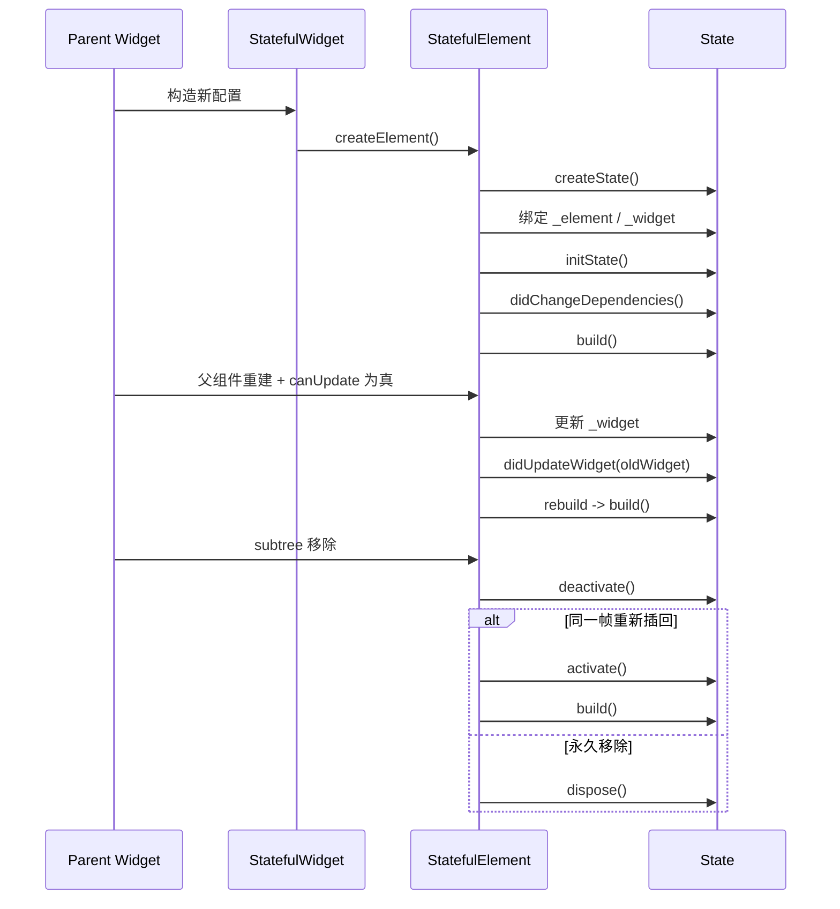

# StatefulWidget 与 State 源码分析

[toc]

> 基于 Flutter `3.41.9` 的 `packages/flutter/lib/src/widgets/framework.dart` 源码整理。  
> 重点在于“框架为什么会这样调用它”，而不是“怎么写 StatefulWidget”。  
> 官方文档对照：[State class](https://api.flutter.dev/flutter/widgets/State-class.html)、[StatefulWidget class](https://api.flutter.dev/flutter/widgets/StatefulWidget-class.html)。

---

## 1. 先给结论

`StatefulWidget` 本身只是**不可变配置**。真正保存可变状态的是 `State`。

框架运行时的核心关系是：

- `StatefulWidget` 提供配置
- `StatefulElement` 负责把 `Widget` 和 `State` 绑在一起
- `State` 保存可变数据，并通过 `setState()` 请求重建

一句话概括：

> `Widget` 描述 UI，`Element` 负责挂载与更新，`State` 负责可变逻辑。

---

## 2. 源码入口在哪

主要看这一个文件：

- `C:\Users\chink\fvm\default\packages\flutter\lib\src\widgets\framework.dart`

和本文相关的关键位置（行号基于 3.41.9，不同版本会有偏移）：

- `Widget.canUpdate`：`framework.dart:382-384`
- `StatefulWidget`：`framework.dart:771-801`
- `State`（类文档里写死了完整生命周期清单）：`framework.dart:916-1502`
- `State.widget / context / mounted / initState / didUpdateWidget / setState / deactivate / activate / dispose / build`：分布在 `framework.dart:926-1479`
- `StatefulElement`：`framework.dart:5900-6132`

---

## 3. `StatefulWidget` 只是配置，不是状态本体

源码里对 `StatefulWidget` 的描述已经很直接：

- 它是“有 mutable state 的 widget”
- 但 widget 实例本身仍然是 immutable
- 真实可变状态要么放到 `State`，要么放到 `State` 持有的可监听对象里

源码关键点：

- `StatefulWidget.createElement()` 固定返回 `StatefulElement`
- `createState()` 负责创建对应的 `State`
- 同一个 `StatefulWidget` 实例，可能在不同位置被 inflate 多次，因此可能对应多个 `State`

也就是说：

```text
Widget 不是状态容器
Widget 只是状态的配置载体
```

---

## 4. 什么时候会复用 `State`

框架判断“能不能用新 widget 更新旧 element”时，看的是 `runtimeType` 和 `key`。

源码位置：`framework.dart:382-384`

```dart
static bool canUpdate(Widget oldWidget, Widget newWidget) {
  return oldWidget.runtimeType == newWidget.runtimeType && oldWidget.key == newWidget.key;
}
```

这条规则非常关键：

- 类型相同且 key 相同，才允许复用已有 Element/State
- 如果 key 是 `null`，那就看类型是否一致
- 这也是为什么“同一个页面更新配置”通常不会重新创建 State

可以把它理解成：

```text
同类型 + 同 key = 允许更新
不同类型 / 不同 key = 认为是新对象
```

---

## 5. `StatefulWidget.createElement()` 和 `createState()`

源码位置：`framework.dart:779-800`

### `createElement()`

`StatefulWidget.createElement()` 直接创建 `StatefulElement(this)`。

这说明：

- `StatefulWidget` 不直接持有 `State`
- 它先交给 `StatefulElement` 作为运行时中介

### `createState()`

`createState()` 是子类必须实现的入口。

框架可能多次调用它：

- widget 在树里出现多个位置
- widget 被移除后又重新插入

所以不要把 `State` 当成“只会创建一次的单例对象”。

---

## 6. `StatefulElement` 才是绑定中心

源码位置：`framework.dart:5901-5927`

`StatefulElement` 的构造过程最能说明三者关系：

1. 先调用 `widget.createState()`
2. 再把 `state._element = this`
3. 再把 `state._widget = widget`
4. 然后进入后续生命周期

这段逻辑说明：

- `Element` 持有 `State`
- `State` 也反向持有 `Element`
- `State.widget` 和 `State.context` 都来自这层绑定

可以把关系画成这样：


---

## 7. 生命周期的真实顺序

源码位置：`framework.dart:842-914`（`State` 类文档中的生命周期清单）、`framework.dart:5945-6008`（`StatefulElement._firstBuild` 与 `update`）

框架对 `State` 的生命周期是明确写死的：

```text
createState
→ 绑定 BuildContext
→ initState
→ didChangeDependencies
→ build
```

之后会进入重复阶段：

- `setState()` 触发 `build`
- 父 widget 配置变化触发 `didUpdateWidget(oldWidget)`，随后一定会 `build`
- 依赖的 `InheritedWidget` 变化会触发 `didChangeDependencies`

销毁阶段则是：

```text
deactivate
→ 可能在同一帧内被重新插回树
→ 如果没有重插，dispose
```

### 关键点

- `initState()` 只调用一次
- `didChangeDependencies()` 会在 `initState()` 后立即调用一次，后续依赖变化也会再调用
- `didUpdateWidget()` 只处理“配置变了，但 State 复用”的场景
- `dispose()` 之后，`mounted` 变成 `false`

---

## 8. `widget`、`context`、`mounted` 到底是什么

源码位置：`framework.dart:917-981`

### `widget`

`State.widget` 是当前配置对象。

它由框架在更新阶段替换，保存的是当前 widget 引用，并非常量缓存。

当父 widget 重建并且 `canUpdate()` 为真时：

- 先更新 `state._widget`
- 再调用 `didUpdateWidget(oldWidget)`

所以在 `didUpdateWidget()` 里：

- `oldWidget` 是旧配置
- `widget` 是新配置

### `context`

`State.context` 实际上就是这个 State 绑定的 `Element`。

源码里明确写了：

- 这个关联是 permanent
- `State` 不会换 `BuildContext`
- 但 `BuildContext` 可以跟着子树移动

这也是为什么：

- `context` 不会“变成另一个 context”
- 但同一个 State 对应的 Element 可以在树里移动

### `mounted`

`mounted` 的判断非常简单：看 `_element != null`。

所以：

- `mounted == true` 表示还挂在树上
- `dispose()` 后会变成 `false`

这也是异步回调里最常见的保护条件。

---

## 9. `initState()` 为什么不能依赖 InheritedWidget

源码位置：`framework.dart:975-1010`、`framework.dart:6050-6120`（`StatefulElement.dependOnInheritedElement` 中的断言）

框架明确禁止在 `initState()` 里通过 `dependOnInheritedWidgetOfExactType()` 建立依赖。

原因很直接：

- `initState()` 时机太早
- 这时如果建立依赖，后续 InheritedWidget 变化时，依赖关系可能不完整或不符合预期

所以源码给出的正确路径是：

- `initState()`：做一次性初始化
- `didChangeDependencies()`：处理依赖于 InheritedWidget 的初始化

如果你只是读取 `context` 的某些非依赖信息，情况会更复杂，但默认仍建议谨慎。

---

## 10. `didUpdateWidget()` 为什么一定会跟着 `build()`

源码位置：`framework.dart:1013-1036`、`framework.dart:5972-6008`

更新路径是：

1. `StatefulElement.update(newWidget)`
2. 先把 `state._widget` 换成新 widget
3. 调 `didUpdateWidget(oldWidget)`
4. 然后强制 `rebuild(force: true)`

这意味着：

- `didUpdateWidget()` 不是最终渲染出口
- 它只是一个“响应配置变化”的过渡点
- 你在 `didUpdateWidget()` 里调用 `setState()` 是冗余的，因为后面一定会 build

典型用途：

- 旧参数换成新参数后，重新订阅监听器
- 对比旧值和新值，决定是否重置动画
- 处理 controller / stream / notifier 的切换

---

## 11. `setState()` 的设计：同步改状态 + 标记重建，不只是“通知一下”

源码位置：`framework.dart:1053-1220`（实现体在 `1160-1220`）

`setState()` 的实现很短，但设计意图很强：

- 回调必须同步执行
- 回调不能返回 `Future`
- 回调后调用 `Element.markNeedsBuild()`

源码还特意解释了为什么早期叫 `markNeedsBuild` 的设计不够好：

- 人会滥用这个 API
- 于是框架改成“先在 callback 里改状态，再触发重建”

这能逼着开发者明确回答一个问题：

> 你到底改了什么状态，为什么需要重建？

官方文档对这段设计取舍的完整讨论见 [State.setState](https://api.flutter.dev/flutter/widgets/State/setState.html) 的 Design discussion 一节。

### 直接结论

- `setState` 不是异步入口
- `setState` 不是计算入口
- `setState` 只负责同步修改“会影响 UI 的那部分状态”

---

## 12. `deactivate()`、`activate()`、`dispose()` 的边界

源码位置：`framework.dart:1222-1339`、`framework.dart:6010-6044`

### `deactivate()`

当 subtree 从树上移除时调用。

这时不一定真的死了，因为：

- 同一帧内可能通过 `GlobalKey` 被重新插回别处

### `activate()`

当被重新插回树时调用。

`StatefulElement.activate()` 的顺序是：先 `super.activate()` 恢复 Element 自身，再调用 `State.activate()`，最后 `markNeedsBuild()` 把自己标记为脏。源码注释专门解释了这次重建的原因：State 可能在 `deactivate()` 里释放过 build 阶段分配的资源，必须给它一次重新分配的机会，让它适配新位置。

### `dispose()`

如果本帧结束前没有重新插回，才会走 `dispose()`。

这是终态：

- 不能再 `setState`
- `mounted` 变成 `false`
- `State.context` 也不再可用

这就是为什么：

- 定时器
- 动画监听
- 流订阅

都应该在 `dispose()` 里清理。

---

## 13. `GlobalKey` 为什么会影响 State 复用

源码位置：`framework.dart:159-243`、`framework.dart:4481-4540`（`Element._retakeInactiveElement`）

`GlobalKey` 的真正意义是允许 subtree 被搬家，跟“写起来高级”无关。

框架做法是：

- 先在旧位置把 element 标记为 inactive
- 如果新位置同一帧内需要同一个 key，就把这个 element 重新取回来
- 再 `activate()`
- 再 `build()`

所以 `GlobalKey` 相关的 state 复用，本质是：

- 同一个 `State`
- 可能换了树上的位置

这也是为什么文档里常说：

> `State` 绑定的是对象，不是绝对位置。

但前提是，它要在同一帧内被重新接回去。

---

## 14. 一段最实用的源码级心智模型

可以把 `StatefulWidget` 的运行过程理解为：



---

## 15. 最容易误解的几个点

### 误解 1：State 只会创建一次

不对。

`createState()` 可能被调用多次，尤其是：

- 同一个 widget 被放到多个位置
- widget 被移除后又再次插入

### 误解 2：`didUpdateWidget()` 后还要再手动 `setState()`

通常不需要。

因为框架已经保证后面会 `build()`。

### 误解 3：`dispose()` 后还可以靠 `mounted` 继续补救

`mounted` 只能用来判断是否还能安全访问，不是补救机制。

更正确的做法是：

- 取消订阅
- 停掉定时器
- 释放 controller

### 误解 4：`context` 是一个会自动变化的普通字段

不对。

`State.context` 对应的是固定绑定的 `Element`。

---

## 16. 如果只记 6 条

1. `StatefulWidget` 只是配置，不保存真正的运行时状态。
2. `Widget.canUpdate()` 由 `runtimeType + key` 决定是否复用。
3. `StatefulElement` 负责把 `Widget` 和 `State` 绑定起来。
4. `initState()` 只做一次性初始化，`didChangeDependencies()` 处理依赖型初始化。
5. `didUpdateWidget()` 一定会接着 `build()`。
6. `dispose()` 之后 `mounted == false`，不能再 `setState()`。

---

## 17. 适合继续看的源码位置

如果要继续顺着这篇往下读，下一步建议看：

- `Element.rebuild`
- `ComponentElement.performRebuild`
- `Widget.canUpdate`
- `BuildOwner.buildScope`
- `InheritedElement.notifyClients`

这些位置能把 `setState -> rebuild -> build -> layout -> paint` 这条链串完整。

