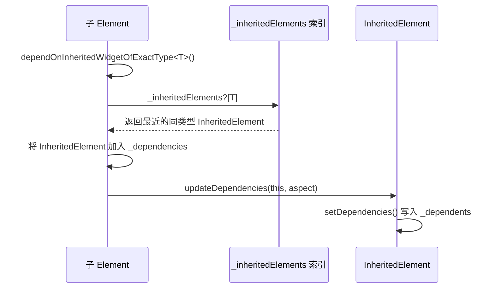
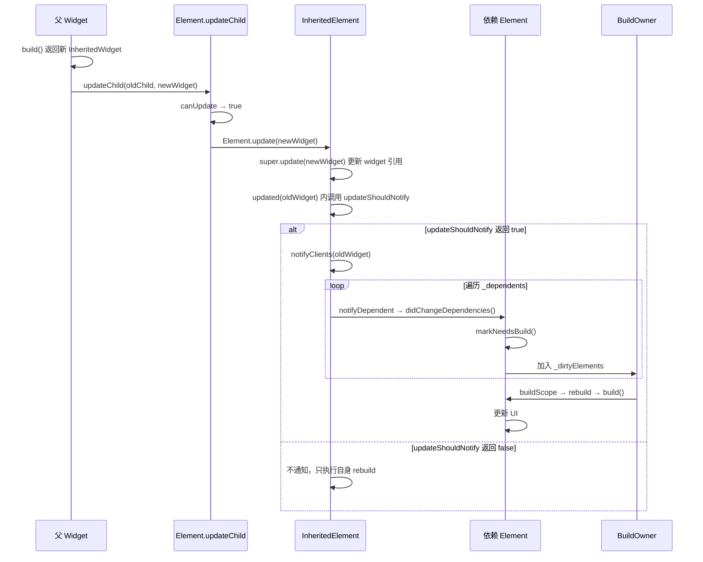

# Flutter InheritedWidget 依赖注册与通知机制

[toc]

`InheritedWidget` 是 Flutter 框架中最核心的数据传递机制之一。它通过依赖注册与通知系统实现了"数据向下传递，精准更新依赖者"的高效模式。`Theme`、`MediaQuery`、`Localizations` 以及几乎所有状态管理框架（Provider、Riverpod 等）都建立在 `InheritedWidget` 之上。本文将从源码层面深入分析其依赖注册、通知触发的完整链路（基于 Flutter 3.41 stable 的 framework 源码，[InheritedWidget 官方文档](https://api.flutter.dev/flutter/widgets/InheritedWidget-class.html)）。

## 一、InheritedWidget 概述

### 1.1 核心价值

`InheritedWidget` 解决了一个根本问题：**如何高效地将数据从父节点传递给深层子节点，并在数据变化时只更新真正依赖该数据的组件**。

如果不使用 `InheritedWidget`，数据只能通过构造函数逐层传递（prop drilling），或者借助全局单例。前者在层级深时冗余代码爆炸，后者缺乏组件级别的生命周期管理且无法精准更新。

```dart
// 不使用 InheritedWidget：逐层传递
Widget build(BuildContext context) {
  return SomeWidget(
    theme: theme,          // 第 1 层传递
    child: AnotherWidget(
      theme: theme,        // 第 2 层传递
      child: DeepWidget(
        theme: theme,      // 第 3 层传递 —— 冗余
      ),
    ),
  );
}

// 使用 InheritedWidget：深层直接访问
Widget build(BuildContext context) {
  final theme = Theme.of(context); // 直接获取，无需逐层传递
  return Text('Hello', style: theme.textTheme.bodyLarge);
}
```

### 1.2 与普通 Widget 的区别

| 特性 | 普通 Widget | InheritedWidget |
|------|------------|-----------------|
| 数据传递 | 通过构造函数逐层传递 | 子组件通过 `dependOnInheritedWidgetOfExactType` 跨层级获取 |
| 依赖追踪 | 无 | 框架自动记录哪些子组件依赖了自己 |
| 变更通知 | 父 Widget rebuild 时所有子组件重建 | 只通知注册了依赖的子组件 |
| 更新控制 | `updateShouldNotify` 无意义 | 通过 `updateShouldNotify` 决定是否触发通知 |

`InheritedWidget` 是不可变的"数据容器"——它本身不持有可变状态，而是将数据存储在其属性中。当父 Widget rebuild 并返回一个新的 `InheritedWidget` 实例时，框架会比较新旧实例，通过 `updateShouldNotify` 决定是否需要通知依赖者。

### 1.3 典型使用场景

Flutter 框架中大量使用 `InheritedWidget`：

- **`Theme`**：通过 `_InheritedTheme` 传递 ThemeData，子组件通过 `Theme.of(context)` 获取
- **`MediaQuery`**：传递屏幕尺寸、像素密度、文字缩放等信息，屏幕旋转时自动通知
- **`Localizations`**：传递当前 locale 和翻译资源，语言切换时通知依赖组件
- **`Form`**：通过内部的 `_FormScope`（InheritedWidget）传递 `FormState`，`Form.of(context)` 据此找到表单（`Navigator.of` 则走 `findAncestorStateOfType` 查找，不依赖此机制）
- **`DefaultTextStyle`**：提供默认文本样式

第三方状态管理框架同样基于 `InheritedWidget`：

- **Provider**：核心的 `InheritedProvider` 在 build 时生成 `_InheritedProviderScope`（一个 `InheritedWidget`）
- **Riverpod**：`ProviderScope` 向子树暴露 `ProviderContainer`（riverpod 2.x 中负责暴露的 `UncontrolledProviderScope` 是 `InheritedWidget`）
- **InheritedWidget** 本身就是最轻量的状态管理方案

## 二、依赖关系的数据结构

### 2.1 Element 中的依赖存储

每个 `Element` 内部维护了一个依赖集合，用于记录该 Element 依赖了哪些 `InheritedWidget`（Flutter 3.41 实现）：

```dart
// framework.dart - Element 类
abstract class Element extends DiagnosticableTree implements BuildContext {
  // ...

  /// 当前 Element 类型可查到的最近各级 InheritedElement 的哈希索引，
  /// Key: InheritedWidget 的 runtimeType，Value: 最近的同类型 InheritedElement。
  /// 挂载时从父 Element 复制并覆盖自身类型，查找因此是 O(1)。
  PersistentHashMap<Type, InheritedElement>? _inheritedElements;

  /// 记录当前 Element 依赖的所有 InheritedElement（即"我依赖了谁"）
  Set<InheritedElement>? _dependencies;

  /// 曾尝试依赖某类型 InheritedWidget 但树上不存在
  bool _hadUnsatisfiedDependencies = false;
  // ...
}
```

`_dependencies` 的含义：

- **元素类型**（`InheritedElement`）：被依赖的 `InheritedElement` 本身。注意这里存的是 **Element 而不是 Widget**，直接指向提供数据的那个 `InheritedElement` 节点
- **Aspect 不存这一侧**：依赖的附加信息（如 `InheritedModel` 的 Aspect）不记录在 `_dependencies` 中，而是反过来存在 `InheritedElement._dependents` Map 的 Value 里（见下文）

这种 Set/Map 的分工是理解整个机制的关键：**Element 侧只知道"我依赖了哪些节点"（Set），节点侧才知道"每个依赖者关心什么"（Map 的 Value）**。

### 2.2 依赖注册的过程

当子组件调用 `context.dependOnInheritedWidgetOfExactType<T>()` 时，框架执行以下步骤：



1. **索引查找**：从当前 Element 的 `_inheritedElements` 哈希索引中按类型 `T` 直接取出最近的 `InheritedElement`（O(1)，无需向上遍历，索引的维护见 3.3 节）
2. **存储依赖**：将找到的 `InheritedElement` 加入当前 Element 的 `_dependencies` Set
3. **注册反向引用**：调用 `InheritedElement.updateDependencies(this, aspect)`，默认实现会把当前 Element 作为 Key 写入 `InheritedElement` 的 `_dependents` Map（aspect 作为 Value）

### 2.3 双向依赖关系

依赖关系是双向的：

- **Element → InheritedWidget**：通过 `Element._dependencies`（`Set<InheritedElement>`）记录"我依赖了谁"
- **InheritedWidget → Element**：通过 `InheritedElement._dependents`（`Map<Element, Object?>`）记录"谁依赖了我"，Value 是该依赖者的附加信息（普通场景为 null，`InheritedModel` 中为 Aspect 集合）

当 `InheritedWidget` 需要通知变化时，遍历 `_dependents` 即可找到所有依赖者；当 `Element` 被 deactivate（从树上移除）时，通过 `_dependencies` 找到所有依赖的 `InheritedElement` 并调用其 `removeDependent` 清理反向引用。

### 2.4 源码片段：依赖的清理时机

依赖清理发生在 `deactivate`（Element 从树上摘下）而不是 `unmount`，这样同一帧内被重新挂载（GlobalKey 复用）的 Element 可以在 `activate` 中重建依赖：

```dart
// framework.dart - Element 类
@mustCallSuper
@visibleForOverriding
void activate() {
  final bool hadDependencies =
      (_dependencies?.isNotEmpty ?? false) || _hadUnsatisfiedDependencies;
  _lifecycleState = _ElementLifecycle.active;
  // 复用时清空旧依赖，后续 build 会重新注册
  _dependencies?.clear();
  _hadUnsatisfiedDependencies = false;
  _updateInheritance();
  // ...
  if (hadDependencies) {
    didChangeDependencies(); // 之前有依赖 → 重新走一次依赖变化流程
  }
}

/// deactivate 之后立即调用，移除依赖并把生命周期置为 inactive
void _ensureDeactivated() {
  if (_dependencies case final Set<InheritedElement> dependencies? when dependencies.isNotEmpty) {
    for (final dependency in dependencies) {
      dependency.removeDependent(this); // 1. 清理所有反向引用
    }
  }
  _inheritedElements = null;
  _lifecycleState = _ElementLifecycle.inactive;
}

@mustCallSuper
void unmount() {
  // ...
  _widget = null;
  _dependencies = null; // 2. 最终卸载时释放集合本身
  _lifecycleState = _ElementLifecycle.defunct;
}
```

## 三、dependOnInheritedWidgetOfExactType 注册逻辑（源码级）

### 3.1 完整调用链

当我们在代码中写 `context.dependOnInheritedWidgetOfExactType<MyInherited>()` 时，完整的调用链如下（Flutter 3.41）：

```
BuildContext.dependOnInheritedWidgetOfExactType<T>()
  → Element.dependOnInheritedWidgetOfExactType<T>()
    → _inheritedElements?[T]                  // O(1) 哈希索引查找最近的 InheritedElement
    → Element.dependOnInheritedElement(ancestor, aspect)
      → _dependencies.add(ancestor)           // 记录"我依赖了谁"
      → InheritedElement.updateDependencies(this, aspect)
        → setDependencies(this, null)         // 记录"谁依赖了我"（默认依赖值为 null）
```

### 3.2 BuildContext 接口定义

```dart
// framework.dart - BuildContext 接口
abstract interface class BuildContext {
  // ...

  /// 查找类型为 T 的最近 InheritedWidget，并注册依赖
  /// 返回 InheritedWidget 本身
  /// 如果未找到，返回 null
  ///
  /// 调用此方法会建立依赖关系：
  /// - 当 InheritedWidget 变化时，当前 Element 的 didChangeDependencies 会被调用
  /// [aspect] 仅在 T 支持部分更新（如 InheritedModel）时使用
  T? dependOnInheritedWidgetOfExactType<T extends InheritedWidget>({Object? aspect});

  /// 查找类型为 T 的最近 InheritedWidget，但不注册依赖
  /// 用于只需读取值、不希望被通知的场景
  T? getInheritedWidgetOfExactType<T extends InheritedWidget>();

  /// 查找类型为 T 的最近 InheritedElement，同样不注册依赖
  /// 与 getInheritedWidgetOfExactType 的区别：返回 Element 而不是 Widget
  /// 官方文档建议用它（在 didChangeDependencies 中配合 dependOn...）保存引用
  InheritedElement? getElementForInheritedWidgetOfExactType<T extends InheritedWidget>();

  // ...
}
```

三个查找方法中，`dependOnInheritedWidgetOfExactType` 与后两个的区别至关重要：

- **`dependOnInheritedWidgetOfExactType`**：注册依赖 → 数据变化时触发 `didChangeDependencies` → 标记 dirty → rebuild
- **`getInheritedWidgetOfExactType` / `getElementForInheritedWidgetOfExactType`**：不注册依赖 → 数据变化时不会收到通知 → 不会 rebuild（两者都是 O(1) 查找，后者常用于"先拿到 Element、稍后再手动注册依赖"的两段式写法）

> 官方文档：[BuildContext.dependOnInheritedWidgetOfExactType](https://api.flutter.dev/flutter/widgets/BuildContext/dependOnInheritedWidgetOfExactType.html)、[BuildContext.getElementForInheritedWidgetOfExactType](https://api.flutter.dev/flutter/widgets/BuildContext/getElementForInheritedWidgetOfExactType.html)

### 3.3 Element 中的查找实现

```dart
// framework.dart - Element 类（Flutter 3.41）
abstract class Element extends DiagnosticableTree implements BuildContext {

  @override
  T? dependOnInheritedWidgetOfExactType<T extends InheritedWidget>({Object? aspect}) {
    assert(_debugCheckStateIsActiveForAncestorLookup());
    // 第一步：从哈希索引中 O(1) 取出最近的同类型 InheritedElement
    final InheritedElement? ancestor = _inheritedElements?[T];
    if (ancestor != null) {
      // 第二步：注册依赖关系
      return dependOnInheritedElement(ancestor, aspect: aspect) as T;
    }
    // 找不到也记录一笔，activate 时据此决定是否补发 didChangeDependencies
    _hadUnsatisfiedDependencies = true;
    return null;
  }

  /// 注册对特定 InheritedElement 的依赖
  @override
  InheritedWidget dependOnInheritedElement(InheritedElement ancestor, {Object? aspect}) {
    // 1. 记录"我依赖了谁"（Element 侧）
    (_dependencies ??= HashSet<InheritedElement>()).add(ancestor);
    // 2. 记录"谁依赖了我"（InheritedElement 侧）
    ancestor.updateDependencies(this, aspect);
    return ancestor.widget as InheritedWidget;
  }

  /// 挂载/重新激活时维护类型 → 最近 InheritedElement 的索引
  void _updateInheritance() {
    assert(_lifecycleState == _ElementLifecycle.active);
    _inheritedElements = _parent?._inheritedElements; // 先继承父级的索引
  }
}

// framework.dart - InheritedElement 类
class InheritedElement extends ProxyElement {
  // ...

  @override
  void _updateInheritance() {
    // 再把"自身类型"覆盖为 this —— 因此索引里永远是最近的那个
    _inheritedElements = (_parent?._inheritedElements
            ?? const PersistentHashMap<Type, InheritedElement>.empty())
        .put(widget.runtimeType, this);
  }
}
```

这里有两点与直觉不同、但很关键：

- **查找不遍历树**。每个 Element 挂载时把父级的 `_inheritedElements` 索引复制一份（`PersistentHashMap` 的持久化数据结构使复制是共享底层节点的低成本操作）；`InheritedElement` 额外把"自己的类型"指向自己。这样任意深度子树里的查找都是一次哈希取值。
- **`_hadUnsatisfiedDependencies` 兜底**。依赖查找落空（树上没有该类型）时也会被记下，之后 Element 被移动到有该类型 InheritedWidget 的子树并 activate 时，会补发一次 `didChangeDependencies`，避免"曾经想要依赖但没找到"的场景漏更新。

### 3.4 InheritedElement.updateDependencies

```dart
// framework.dart - InheritedElement 类（Flutter 3.41）
class InheritedElement extends ProxyElement {
  /// 所有依赖此 InheritedWidget 的 Element
  /// Key: 依赖者 Element
  /// Value: 依赖的附加信息（普通场景为 null，InheritedModel 中为 Aspect 集合）
  final Map<Element, Object?> _dependents = HashMap<Element, Object?>();

  /// dependOnInheritedWidgetOfExactType 注册新依赖时被调用
  @protected
  void updateDependencies(Element dependent, Object? aspect) {
    // 默认实现：无条件依赖（依赖值为 null，通知时不做区分）
    setDependencies(dependent, null);
  }

  /// 读取某个依赖者的依赖值（Aspect 等）
  @protected
  Object? getDependencies(Element dependent) {
    return _dependents[dependent];
  }

  /// 写入某个依赖者的依赖值
  @protected
  void setDependencies(Element dependent, Object? value) {
    _dependents[dependent] = value;
  }

  /// 移除某个依赖者（Element 被 deactivate 时调用）
  @protected
  @mustCallSuper
  void removeDependent(Element dependent) {
    _dependents.remove(dependent);
  }
}
```

注意这套 `updateDependencies / setDependencies / getDependencies` 是一组**设计给子类重写的扩展点**：默认只记录"无条件依赖"；`InheritedModel` 的 `InheritedModelElement` 重写 `updateDependencies` 把 Aspect 累积成 Set 存进 Value，重写 `notifyDependent` 时再按 Aspect 过滤（见 5.3 节）。

### 3.5 依赖查找的就近原则

```dart
// 查找规则：从当前 Element 向上找第一个类型匹配的 InheritedElement
```

当存在多层嵌套的同类型 `InheritedWidget` 时，查找遵循**就近原则**：

```dart
class MyInherited extends InheritedWidget {
  final String name;
  const MyInherited({super.key, required this.name, required super.child});

  @override
  bool updateShouldNotify(MyInherited oldWidget) => name != oldWidget.name;

  static MyInherited of(BuildContext context) {
    return context.dependOnInheritedWidgetOfExactType<MyInherited>()!;
  }
}

// 嵌套场景
MyInherited(
  name: 'outer',
  child: MyInherited(
    name: 'inner',
    child: ChildWidget(), // MyInherited.of(context) 获取到的是 'inner'
  ),
)
```

`dependOnInheritedWidgetOfExactType` 查询的是 `_inheritedElements` 索引，而索引在每层挂载时会用"自己的类型"覆盖父级索引中的同类型条目（见 3.3 节的 `_updateInheritance`）。因此从内层任何子树查到的都是离自己**最近**的那个实例——内层的 `InheritedWidget` 天然"遮蔽"外层的同类型 `InheritedWidget`，不需要运行时逐层比较。

## 四、notifyClients 通知触发路径（源码级）

### 4.1 完整链路概览



### 4.2 第一步：InheritedWidget 更新触发

当父 Widget 的 `build()` 返回一个新的 `InheritedWidget` 实例时（数据已变化），框架通过 `Element.updateChild()` 处理更新：

```dart
// framework.dart - Element.updateChild（Flutter 3.41，节选）
Element? updateChild(Element? child, Widget? newWidget, Object? newSlot) {
  if (newWidget == null) {
    // 新 Widget 为 null → 卸载旧 Element
    if (child != null) deactivateChild(child);
    return null;
  }

  if (child != null) {
    if (child.widget == newWidget) {
      // ① 同一个实例（如 const 构造）→ 直接短路，连 update 都不调用
      if (child.slot != newSlot) updateSlotForChild(child, newSlot);
      return child;
    }
    if (Widget.canUpdate(child.widget, newWidget)) {
      // ② 类型相同且 key 相同 → 复用 Element，调用 update
      if (child.slot != newSlot) updateSlotForChild(child, newSlot);
      child.update(newWidget);
      return child;
    }
    // ③ 不能复用 → 卸载旧的，创建新的
    deactivateChild(child);
  }

  // 创建新 Element
  return inflateWidget(newWidget, newSlot);
}
```

`Widget.canUpdate` 的判断规则是 `runtimeType` 相同且 `key` 相同。对于 `InheritedWidget`，每次 `build()` 返回的是同类型的新实例，所以 `canUpdate` 返回 `true`，框架会复用 `InheritedElement` 并调用其 `update()` 方法。

先看分支 ①：如果 `build()` 返回的是 `const` 构造的 `InheritedWidget`（或与上次完全相同的实例），Dart 的常量规范化保证两次拿到的是同一个对象，`child.widget == newWidget` 成立，整个更新流程在这里就短路了——不会调用 `update()`，更不会走到 `updateShouldNotify`。这就是"**const InheritedWidget 不通知依赖者**"的根源，也是把不常变的 InheritedWidget 声明为 `const` 能带来实际收益的原因。

### 4.3 InheritedElement 的 update / updated / notifyClients

Flutter 3.41 中，`InheritedElement` **并不重写 `update()`**——通用的更新流程由父类 `ProxyElement.update()` 驱动，`InheritedElement` 只在两个钩子上做文章：`updated()` 里做 `updateShouldNotify` 短路，`notifyClients()` 里遍历依赖者：

```dart
// framework.dart - ProxyElement（通用更新流程）
abstract class ProxyElement extends ComponentElement {
  @override
  void update(ProxyWidget newWidget) {
    final oldWidget = widget as ProxyWidget;
    super.update(newWidget);        // 1. 更新 widget 引用
    updated(oldWidget);             // 2. 钩子：InheritedElement 在此决定是否通知
    rebuild(force: true);           // 3. 强制重建自身（child 也要更新）
  }

  /// 默认实现：直接通知客户端
  @protected
  void updated(covariant ProxyWidget oldWidget) {
    notifyClients(oldWidget);
  }

  /// 抽象方法，由子类实现
  @protected
  void notifyClients(covariant ProxyWidget oldWidget);
}

// framework.dart - InheritedElement（Flutter 3.41）
class InheritedElement extends ProxyElement {
  // ...

  /// update 之后、通知前调用 —— updateShouldNotify 的短路点就在这里
  @override
  void updated(InheritedWidget oldWidget) {
    if ((widget as InheritedWidget).updateShouldNotify(oldWidget)) {
      super.updated(oldWidget);     // → ProxyElement.updated → notifyClients
    }
    // 返回 false：什么都不做，依赖者不会被通知
  }

  /// 通知所有依赖者（必须处于 build 阶段）
  @override
  void notifyClients(InheritedWidget oldWidget) {
    assert(_debugCheckOwnerBuildTargetExists('notifyClients'));
    // 注意：这里没有 updateShouldNotify 判断，短路已在 updated 中完成
    for (final Element dependent in _dependents.keys) {
      assert(() {
        // 检查依赖者确实是自己的后代
        Element? ancestor = dependent._parent;
        while (ancestor != this && ancestor != null) {
          ancestor = ancestor._parent;
        }
        return ancestor == this;
      }());
      // 检查依赖者确实注册了对自己的依赖
      assert(dependent._dependencies!.contains(this));
      notifyDependent(oldWidget, dependent);
    }
  }

  /// 通知单个依赖者
  @protected
  void notifyDependent(covariant InheritedWidget oldWidget, Element dependent) {
    dependent.didChangeDependencies();
  }
}
```

`updateShouldNotify` 的判断在 `updated()` 钩子中，`notifyClients()` 本身是无条件遍历。这个分工很重要——`InheritedNotifier` 会直接调用 `notifyClients()`（绕过 `updated` 的短路，见 5.2 节），而子类如果想按依赖者精细过滤，应重写 `notifyDependent()`（`InheritedModel` 就是这么做的，见 5.3 节）。

### 4.4 updateShouldNotify：控制通知的触发条件

```dart
// framework.dart - InheritedWidget
abstract class InheritedWidget extends ProxyWidget {
  const InheritedWidget({super.key, required super.child});

  /// 决定当 widget 属性变化时是否通知依赖者
  /// 返回 true → 通知所有依赖者
  /// 返回 false → 不通知
  @protected
  bool updateShouldNotify(covariant InheritedWidget oldWidget);
}
```

子类必须实现 `updateShouldNotify`。这是性能优化的关键——即使 `InheritedWidget` 被"重建"了，如果关键数据没变，可以不通知依赖者，避免无效 rebuild：

```dart
class MyData extends InheritedWidget {
  final int count;
  final String title;

  const MyData({
    super.key,
    required this.count,
    required this.title,
    required super.child,
  });

  @override
  bool updateShouldNotify(MyData oldWidget) {
    // 只有关键数据变化时才通知
    return count != oldWidget.count || title != oldWidget.title;
  }

  static MyData of(BuildContext context) {
    return context.dependOnInheritedWidgetOfExactType<MyData>()!;
  }
}
```

> 官方文档：[InheritedWidget.updateShouldNotify](https://api.flutter.dev/flutter/widgets/InheritedWidget/updateShouldNotify.html)

### 4.5 依赖者的 didChangeDependencies

当 `notifyClients` 调用 `dependent.didChangeDependencies()` 时，依赖 Element 的响应逻辑（Flutter 3.41）：

```dart
// framework.dart - Element（基类实现，所有 Element 共享）
@mustCallSuper
void didChangeDependencies() {
  assert(_lifecycleState == _ElementLifecycle.active);
  assert(_debugCheckOwnerBuildTargetExists('didChangeDependencies'));
  markNeedsBuild(); // 标记 dirty，加入 BuildOwner._dirtyElements
}

// framework.dart - StatefulElement
class StatefulElement extends ComponentElement {
  /// 控制是否在下次 build 开始时调用 State.didChangeDependencies
  bool _didChangeDependencies = false;

  @override
  void didChangeDependencies() {
    super.didChangeDependencies(); // 基类：markNeedsBuild
    _didChangeDependencies = true; // 只设标志，不立即调用 State 的回调
  }

  @override
  void performRebuild() {
    if (_didChangeDependencies) {
      state.didChangeDependencies(); // 延迟到真正 rebuild 时才调用
      _didChangeDependencies = false;
    }
    super.performRebuild();
  }
}
```

这里有一个容易被忽略的细节：**`State.didChangeDependencies()` 并不是在收到通知的瞬间被调用的**。`StatefulElement.didChangeDependencies()` 只是把 `_didChangeDependencies` 标志置为 true，真正的 `State.didChangeDependencies()` 被推迟到该 Element 实际执行 `performRebuild` 的开头。框架注释解释了原因——避免对"即将被从树上移除、不会真正 rebuild"的 State 做无意义的回调。而 `StatelessElement` 没有重写 `didChangeDependencies`，直接沿用基类的 `markNeedsBuild()`。

另外，首次挂载时 `StatefulElement._firstBuild()` 会在 `state.initState()` 之后、首次 `build()` 之前调用一次 `state.didChangeDependencies()`——这就是"依赖初始化应该写在 didChangeDependencies 而不是 initState"的生命周期依据（详见 7.2 节）。

### 4.6 嵌套 InheritedWidget 的依赖传递

如果依赖者自身也是 `InheritedElement`（嵌套 `InheritedWidget` 的场景），行为略有不同。Flutter 3.41 中 `InheritedElement` **没有重写** `didChangeDependencies`，因此它收到通知时走的是 `Element` 基类实现——`markNeedsBuild()` 把自己标记为 dirty：

```text
外层 InheritedWidget B 更新
  → B.notifyClients → 内层 InheritedElement A.didChangeDependencies()（基类实现）
  → A.markNeedsBuild()（A 被标记 dirty，进入 _dirtyElements）
  → 本帧稍后 A rebuild → A.update(newWidget) → A.updated(oldWidget)
  → A 自己的 updateShouldNotify 判断 → A.notifyClients
  → A 的依赖者们 didChangeDependencies → rebuild
```

也就是说，**依赖通知不会从外层 InheritedWidget "直接转发"给内层的依赖者，而是借助 rebuild 链条中转一程**：A 先作为 B 的依赖者被重建，重建过程中作为提供方再通知自己的依赖者。中途 A 的 `updateShouldNotify` 仍然有机会短路，因此整条链是逐层把关的。

另外，provider 包定义过一个自己的 `markNeedsNotifyDependents()`（`InheritedContext` 扩展方法，内部是 `markNeedsBuild() + 置标志，rebuild 时调用 notifyClients`），那是第三方库在 `InheritedElement` 子类上实现的能力，并不是 Flutter 框架的 API——不要与框架机制混淆。

### 4.7 关键优化：精准的依赖更新

**只有注册了依赖的 Element 才会被通知 rebuild**。这是 `InheritedWidget` 的核心性能优势：

```dart
InheritedWidget(
  child: Column(
    children: [
      // Widget A：调用了 dependOnInheritedWidgetOfExactType → 依赖注册 → 会 rebuild
      DependentWidgetA(),
      // Widget B：没有调用 → 无依赖 → 不会 rebuild
      IndependentWidgetB(),
      // Widget C：调用了 dependOnInheritedWidgetOfExactType → 依赖注册 → 会 rebuild
      DependentWidgetC(),
    ],
  ),
)
```

当 `InheritedWidget` 数据变化时，只有 `DependentWidgetA` 和 `DependentWidgetC` 的 `didChangeDependencies` 被调用，`IndependentWidgetB` 完全不受影响。

## 五、ProxyWidget / InheritedNotifier / InheritedModel 深入

### 5.1 ProxyWidget：通知机制的基类

`ProxyWidget` 是 `InheritedWidget` 的直接父类，它只是单纯地声明了一个 `child`，把"代理"这个概念抽象出来：

```dart
// framework.dart - ProxyWidget
abstract class ProxyWidget extends Widget {
  /// Creates a widget that has exactly one child widget.
  const ProxyWidget({super.key, required this.child});

  /// The widget below this widget in the tree.
  final Widget child;
  // 注意：没有提供 createElement 的实现，由具体子类决定
  // （InheritedWidget → InheritedElement，ParentDataWidget → ParentDataElement）
}

// framework.dart - ProxyElement（Flutter 3.41）
abstract class ProxyElement extends ComponentElement {
  ProxyElement(ProxyWidget super.widget);

  @override
  Widget build() => (widget as ProxyWidget).child;

  @override
  void update(ProxyWidget newWidget) {
    final oldWidget = widget as ProxyWidget;
    super.update(newWidget);
    updated(oldWidget);       // 钩子：默认实现会调用 notifyClients
    rebuild(force: true);
  }

  /// 钩子方法，在 update 后调用
  /// 默认实现：直接调用 notifyClients（子类可重写以短路，如 InheritedElement）
  @protected
  void updated(covariant ProxyWidget oldWidget) {
    notifyClients(oldWidget);
  }

  /// 通知客户端 —— 抽象方法，强制子类实现
  @protected
  void notifyClients(covariant ProxyWidget oldWidget);
}
```

`ProxyElement.update()` 的核心逻辑是三步走：

1. `super.update(newWidget)` — 更新 widget 引用
2. `updated(oldWidget)` — 钩子，默认实现转发到 `notifyClients`，子类可重写做短路
3. `rebuild(force: true)` — 强制重建自身（child 也要跟着更新）

`InheritedElement` 继承 `ProxyElement`，重写了 `updated()`（加 `updateShouldNotify` 短路）和 `notifyClients()`（遍历 `_dependents`）。`ProxyWidget` 本身不提供任何通知能力，它只是一个"代理容器"，将 `child` 直接传递下去；另一个子类 `ParentDataElement` 则把 `notifyClients` 实现为向 RenderObject 应用 ParentData。

### 5.2 InheritedNotifier：按需通知

`InheritedNotifier` 是对 `InheritedWidget` 的重要优化——它持有一个 `Listenable`，**只有当 `Listenable` 发出通知（或 notifier 本身被替换）时才触发 `notifyClients`**，而不是每次父 Widget rebuild 都通知。

#### 核心思路

普通 `InheritedWidget` 的通知时机是由父 Widget 的 `build()` 触发的：父 rebuild → 返回新 InheritedWidget → `updateShouldNotify` → `notifyClients`。如果父 Widget 因为其他原因 rebuild（比如自身的其他状态变化），但 InheritedNotifier 的 `notifier` 数据没变，依赖者不应该被重建。

`InheritedNotifier` 通过直接监听 `notifier` 来解决这个问题——通知不再依赖父 Widget 的 rebuild 周期。它的另一个关键特性是**通知合并（coalescing）**：两帧之间 notifier 无论触发多少次通知，依赖者都只会 rebuild 一次。

> 官方文档：[InheritedNotifier class](https://api.flutter.dev/flutter/widgets/InheritedNotifier-class.html)

#### 源码分析

```dart
// inherited_notifier.dart - InheritedNotifier（Flutter 3.41）
abstract class InheritedNotifier<T extends Listenable> extends InheritedWidget {
  const InheritedNotifier({super.key, this.notifier, required super.child});

  final T? notifier;

  @override
  bool updateShouldNotify(InheritedNotifier<T> oldWidget) {
    // 只有 notifier 对象引用变了才通知（走 update 路径时）
    return oldWidget.notifier != notifier;
  }

  @override
  InheritedElement createElement() => _InheritedNotifierElement<T>(this);
}

// inherited_notifier.dart - _InheritedNotifierElement
class _InheritedNotifierElement<T extends Listenable> extends InheritedElement {
  _InheritedNotifierElement(InheritedNotifier<T> widget) : super(widget) {
    // 1. 挂载时立即监听 notifier
    widget.notifier?.addListener(_handleUpdate);
  }

  bool _dirty = false;

  @override
  void update(InheritedNotifier<T> newWidget) {
    final T? oldNotifier = (widget as InheritedNotifier<T>).notifier;
    final T? newNotifier = newWidget.notifier;
    // 2. notifier 对象被替换时，重新挂载监听
    if (oldNotifier != newNotifier) {
      oldNotifier?.removeListener(_handleUpdate);
      newNotifier?.addListener(_handleUpdate);
    }
    super.update(newWidget);
  }

  void _handleUpdate() {
    // 3. 收到通知：只设脏标志 + 标记自身需要 rebuild
    //    注意不在这里直接 notifyClients！
    _dirty = true;
    markNeedsBuild();
  }

  @override
  Widget build() {
    // 4. 真正 rebuild 时才通知依赖者 —— 多次通知被合并成一次
    if (_dirty) {
      notifyClients(widget as InheritedNotifier<T>);
    }
    return super.build();
  }

  @override
  void notifyClients(InheritedNotifier<T> oldWidget) {
    super.notifyClients(oldWidget);
    _dirty = false;
  }

  @override
  void unmount() {
    (widget as InheritedNotifier<T>).notifier?.removeListener(_handleUpdate);
    super.unmount();
  }
}
```

实现上有两个值得注意的设计：

- **通知不在监听回调里直接发出**。`_handleUpdate` 只做"设脏 + `markNeedsBuild`"，真正的 `notifyClients` 延迟到本帧自身 rebuild 时的 `build()` 中。这样一帧内 notifier 连续触发多次，依赖者也只收到一次通知——这就是官方文档所说的 coalescing。
- **绕过 `updateShouldNotify` 短路**。notifier 引用没变时 `updateShouldNotify` 返回 false，若通知仍走 `updated()` 钩子会被短路掉；因此 `build()` 中是**直接调用 `notifyClients()`**（`notifyClients` 本身不做 `updateShouldNotify` 判断，见 4.3 节），保证数据变化一定能送达依赖者。

#### 通知机制对比

```text
普通 InheritedWidget 通知链路：
  父 Widget setState → 父 rebuild → build 返回新 InheritedWidget
  → Element.update → updated（updateShouldNotify 为 true 才继续）
  → notifyClients → 依赖者 rebuild

InheritedNotifier 通知链路（notifier 数据变化）：
  notifier.notifyListeners() → _handleUpdate()
  → _dirty = true + markNeedsBuild()（自身入 dirty 列表）
  → 本帧自身 rebuild → build() 中发现 _dirty → notifyClients
  → 依赖者 rebuild
  （同一帧内多次 notifyListeners 只会触发一次 rebuild）
```

#### 代码示例：ChangeNotifier + InheritedNotifier

```dart
import 'package:flutter/material.dart';

// 1. 定义数据模型
class CounterModel extends ChangeNotifier {
  int _count = 0;

  int get count => _count;

  void increment() {
    _count++;
    notifyListeners(); // 直接触发 InheritedNotifier 的通知链
  }

  void decrement() {
    _count--;
    notifyListeners();
  }
}

// 2. 定义 InheritedNotifier
class InheritedCounter extends InheritedNotifier<CounterModel> {
  const InheritedCounter({
    super.key,
    required CounterModel notifier,
    required super.child,
  });

  static CounterModel of(BuildContext context) {
    final InheritedCounter? inheritedCounter =
        context.dependOnInheritedWidgetOfExactType<InheritedCounter>();
    assert(inheritedCounter != null,
        'CounterModel not found in context');
    return inheritedCounter!.notifier!;
  }
}

// 3. 实现状态持有者 Widget
class CounterProvider extends StatefulWidget {
  const CounterProvider({super.key, required this.child});

  final Widget child;

  @override
  State<CounterProvider> createState() => _CounterProviderState();
}

class _CounterProviderState extends State<CounterProvider> {
  final CounterModel _model = CounterModel();

  @override
  Widget build(BuildContext context) {
    return InheritedCounter(
      notifier: _model,
      child: widget.child,
    );
  }

  @override
  void dispose() {
    _model.dispose();
    super.dispose();
  }
}

// 4. 消费者组件
class CounterDisplay extends StatelessWidget {
  const CounterDisplay({super.key});

  @override
  Widget build(BuildContext context) {
    // 注册依赖 —— 当 counter 变化时会 rebuild
    final count = InheritedCounter.of(context).count;
    print('CounterDisplay build');
    return Text(
      'Count: $count',
      style: Theme.of(context).textTheme.headlineMedium,
    );
  }
}

// 5. 操作组件
class CounterControls extends StatelessWidget {
  const CounterControls({super.key});

  @override
  Widget build(BuildContext context) {
    return Row(
      mainAxisAlignment: MainAxisAlignment.center,
      children: [
        ElevatedButton(
          onPressed: () => InheritedCounter.of(context).decrement(),
          child: const Text('-'),
        ),
        const SizedBox(width: 20),
        ElevatedButton(
          onPressed: () => InheritedCounter.of(context).increment(),
          child: const Text('+'),
        ),
      ],
    );
  }
}

// 6. 独立组件（不依赖 counter，不会 rebuild）
class IndependentWidget extends StatelessWidget {
  const IndependentWidget({super.key});

  @override
  Widget build(BuildContext context) {
    print('IndependentWidget build');
    return const Text('I do not depend on counter');
  }
}

// 7. 完整示例
void main() {
  runApp(const MyApp());
}

class MyApp extends StatelessWidget {
  const MyApp({super.key});

  @override
  Widget build(BuildContext context) {
    return MaterialApp(
      home: CounterProvider(
        child: const Scaffold(
          body: Center(
            child: Column(
              mainAxisAlignment: MainAxisAlignment.center,
              children: [
                CounterDisplay(),
                SizedBox(height: 20),
                CounterControls(),
                SizedBox(height: 20),
                IndependentWidget(),
              ],
            ),
          ),
        ),
      ),
    );
  }
}
```

点击 `+` 按钮时，日志输出：

```bash
CounterDisplay build    # 只有依赖者 rebuild
# IndependentWidget 不会被 rebuild
```

两个细节值得一提：其一，`CounterDisplay` 首帧 build 时通过 `of(context)` 注册了依赖，所以每次 counter 变化都会 rebuild；其二，`CounterControls` 的 `of(context)` 写在 `onPressed` 回调里，首次点击执行回调时才会注册依赖——这也解释了为什么它从第二次点击起同样会被通知 rebuild（事件回调中调用 `dependOnInheritedWidgetOfExactType` 是合法的，官方文档明确允许在交互回调中这样获取值）。

### 5.3 InheritedModel：基于 Aspect 的细粒度依赖

`InheritedModel` 是 `InheritedWidget` 的进一步细化——它允许子组件只依赖 `InheritedWidget` 的某个"方面（Aspect）"，当 `InheritedWidget` 更新时，只通知与变化 Aspect 相关的依赖者。

#### 核心概念

假设有一个大型配置对象包含主题、语言、字体等多个维度：

```dart
class AppConfig {
  final ThemeData theme;
  final String locale;
  final double fontSize;
  // ... 更多字段
}
```

使用普通 `InheritedWidget` 时，任何字段变化都会通知所有依赖者。使用 `InheritedModel` 时，可以做到"只有 `fontSize` 变化时才通知依赖了 `fontSize` 的组件"。

> 官方文档：[InheritedModel class](https://api.flutter.dev/flutter/widgets/InheritedModel-class.html)。`MediaQuery` 在新版本框架中就是用 `InheritedModel` 实现的——`MediaQuery.sizeOf(context)` 只依赖尺寸 aspect，文字缩放变化不会导致它 rebuild。

#### 源码分析

```dart
// inherited_model.dart - InheritedModel（Flutter 3.41）
abstract class InheritedModel<T> extends InheritedWidget {
  const InheritedModel({super.key, required super.child});

  /// 子类重写：判断特定依赖者的 Aspect 集合是否命中本次变化
  @protected
  bool updateShouldNotifyDependent(
    covariant InheritedModel<T> oldWidget,
    Set<T> dependencies,
  );

  /// 子类可重写：本模型是否支持给定的 aspect（默认支持所有）
  /// 用于让内层模型"遮蔽"祖先模型的部分 aspect
  @protected
  bool isSupportedAspect(Object aspect) => true;

  /// 查找最近的 InheritedModel 并注册对指定 aspect 的依赖
  static T? inheritFrom<T extends InheritedModel<Object>>(
    BuildContext context, {
    Object? aspect,
  }) {
    if (aspect == null) {
      // 不指定 aspect → 等价于普通依赖，任何变化都通知
      return context.dependOnInheritedWidgetOfExactType<T>();
    }

    // 从最近的 T 类型模型开始，逐级向上收集，
    // 直到遇到一个声明"支持该 aspect"的模型为止
    final models = <InheritedElement>[];
    _findModels<T>(context, aspect, models);
    if (models.isEmpty) return null;

    final InheritedElement lastModel = models.last;
    for (final model in models) {
      // 对沿途每个模型都注册依赖，aspect 作为依赖值
      final value = context.dependOnInheritedElement(model, aspect: aspect) as T;
      if (model == lastModel) {
        return value;
      }
    }
    return null;
  }
}
```

```dart
// inherited_model.dart - InheritedModelElement
class InheritedModelElement<T> extends InheritedElement {
  InheritedModelElement(InheritedModel<T> super.widget);

  /// 重写依赖注册：把 aspect 累积成 Set 存入 _dependents 的 Value
  /// （复用父类的 Map<Element, Object?> _dependents，不另建数据结构）
  @override
  void updateDependencies(Element dependent, Object? aspect) {
    final dependencies = getDependencies(dependent) as Set<T>?;
    if (dependencies != null && dependencies.isEmpty) {
      return; // 已经是"订阅全部"（空 Set），保持不变
    }

    if (aspect == null) {
      setDependencies(dependent, HashSet<T>()); // 空 Set = 订阅所有 aspect
    } else {
      assert(aspect is T);
      setDependencies(dependent, (dependencies ?? HashSet<T>())..add(aspect as T));
    }
  }

  /// 重写单个依赖者的通知：按 Aspect 过滤
  @override
  void notifyDependent(InheritedModel<T> oldWidget, Element dependent) {
    final dependencies = getDependencies(dependent) as Set<T>?;
    if (dependencies == null) {
      return; // 没有依赖值（理论上不会发生）
    }
    if (dependencies.isEmpty ||
        (widget as InheritedModel<T>).updateShouldNotifyDependent(
            oldWidget, dependencies)) {
      dependent.didChangeDependencies();
    }
  }
}
```

对照 4.3 节就能看清 `InheritedModel` 的实现策略：**整体是否要通知仍由继承来的 `updated()`（`updateShouldNotify`）决定；一旦决定通知，逐个依赖者的过滤在重写的 `notifyDependent()` 里完成**。它没有自建数据结构，而是把 `InheritedElement._dependents` 的 Value 从默认的 `null` 换成了 `Set<T>`（aspect 集合）——这正是 3.4 节所说"Value 留给子类存附加信息"的用途。

#### 代码示例：细粒度主题/配置系统

```dart
import 'package:flutter/material.dart';

// 1. 定义 Aspect 枚举
enum ConfigAspect {
  theme,
  locale,
  fontSize,
}

// 2. 定义 InheritedModel
class AppConfigModel extends InheritedModel<ConfigAspect> {
  const AppConfigModel({
    super.key,
    required this.themeData,
    required this.locale,
    required this.fontSize,
    required super.child,
  });

  final ThemeData themeData;
  final String locale;
  final double fontSize;

  /// 获取指定 Aspect 的值
  static AppConfigModel of(BuildContext context, ConfigAspect aspect) {
    final model = InheritedModel.inheritFrom<AppConfigModel>(
      context,
      aspect: aspect,
    );
    assert(model != null, 'AppConfigModel not found');
    return model!;
  }

  @override
  bool updateShouldNotify(AppConfigModel oldWidget) {
    // 只要有任何字段变化就进入依赖检查
    return themeData != oldWidget.themeData ||
        locale != oldWidget.locale ||
        fontSize != oldWidget.fontSize;
  }

  @override
  bool updateShouldNotifyDependent(
    AppConfigModel oldWidget,
    Set<ConfigAspect> dependencies,
  ) {
    // 只检查依赖者关心的 Aspect
    if (dependencies.contains(ConfigAspect.theme) &&
        themeData != oldWidget.themeData) {
      return true;
    }
    if (dependencies.contains(ConfigAspect.locale) &&
        locale != oldWidget.locale) {
      return true;
    }
    if (dependencies.contains(ConfigAspect.fontSize) &&
        fontSize != oldWidget.fontSize) {
      return true;
    }
    return false;
  }
}

// 3. 状态持有者
class AppConfigProvider extends StatefulWidget {
  const AppConfigProvider({super.key, required this.child});
  final Widget child;

  @override
  State<AppConfigProvider> createState() => _AppConfigProviderState();
}

class _AppConfigProviderState extends State<AppConfigProvider> {
  ThemeData _themeData = ThemeData.light();
  String _locale = 'zh';
  double _fontSize = 14.0;

  @override
  Widget build(BuildContext context) {
    return AppConfigModel(
      themeData: _themeData,
      locale: _locale,
      fontSize: _fontSize,
      child: widget.child,
    );
  }

  void toggleTheme() {
    setState(() {
      _themeData = _themeData.brightness == Brightness.light
          ? ThemeData.dark()
          : ThemeData.light();
    });
  }

  void changeLocale(String locale) {
    setState(() {
      _locale = locale;
    });
  }

  void changeFontSize(double size) {
    setState(() {
      _fontSize = size;
    });
  }
}

// 4. 只依赖 theme 的组件
class ThemeDependentWidget extends StatelessWidget {
  const ThemeDependentWidget({super.key});

  @override
  Widget build(BuildContext context) {
    final config = AppConfigModel.of(context, ConfigAspect.theme);
    print('ThemeDependentWidget rebuild');
    return Text(
      'Theme: ${config.themeData.brightness}',
      style: config.themeData.textTheme.bodyLarge,
    );
  }
}

// 5. 只依赖 locale 的组件
class LocaleDependentWidget extends StatelessWidget {
  const LocaleDependentWidget({super.key});

  @override
  Widget build(BuildContext context) {
    final config = AppConfigModel.of(context, ConfigAspect.locale);
    print('LocaleDependentWidget rebuild');
    return Text('Locale: $config');
  }
}

// 6. 只依赖 fontSize 的组件
class FontSizeDependentWidget extends StatelessWidget {
  const FontSizeDependentWidget({super.key});

  @override
  Widget build(BuildContext context) {
    final config = AppConfigModel.of(context, ConfigAspect.fontSize);
    print('FontSizeDependentWidget rebuild');
    return Text(
      'Font Size: ${config.fontSize}',
      style: TextStyle(fontSize: config.fontSize),
    );
  }
}
```

当调用 `toggleTheme()` 时，日志输出：

```bash
ThemeDependentWidget rebuild    # 只有依赖 theme 的组件 rebuild
# LocaleDependentWidget 和 FontSizeDependentWidget 不会 rebuild
```

当调用 `changeFontSize(18.0)` 时：

```bash
FontSizeDependentWidget rebuild  # 只有依赖 fontSize 的组件 rebuild
```

## 六、InheritedWidget 与状态管理框架的关系

### 6.1 Provider 的底层实现

Provider 的核心由两层组成：`InheritedProvider` 本身是一个 StatelessWidget，它的 build 产出真正的 `_InheritedProviderScope`（InheritedWidget）：

```dart
// provider 源码简化
class InheritedProvider<T> extends SingleChildStatelessWidget {
  final _Delegate<T> _delegate; // 封装 create/update/dispose/startListening

  @override
  Widget buildWithChild(BuildContext context, Widget? child) {
    return _InheritedProviderScope<T?>(
      owner: this, // 真正的 InheritedWidget
      child: child,
    );
  }
}

class _InheritedProviderScope<T> extends InheritedWidget {
  @override
  bool updateShouldNotify(InheritedWidget oldWidget) {
    return false; // 恒为 false：不用 update 路径通知，见下文
  }

  @override
  _InheritedProviderScopeElement<T> createElement() =>
      _InheritedProviderScopeElement<T>(this);
}

// _InheritedProviderScopeElement extends InheritedElement，
// 重写 updateDependencies/notifyDependent 实现 context.select 的按需过滤
// （与 InheritedModel 的思路一致：把依赖值当 aspect 用）

// Provider.of(context) 的底层调用（简化）
static T of<T>(BuildContext context, {bool listen = true}) {
  // 1. 不注册依赖地拿到最近的 provider Element
  final inheritedElement =
      context.getElementForInheritedWidgetOfExactType<_InheritedProviderScope<T>>();
  // 2. 需要监听时，再显式注册依赖
  if (listen) {
    context.dependOnInheritedElement(inheritedElement as InheritedElement);
  }
  return inheritedElement.value;
}
```

`ChangeNotifierProvider` 是 `InheritedProvider` + `ChangeNotifier` 的组合（注意：它自己实现了类似的通知调度，并没有基于 `InheritedNotifier`）：

```text
ChangeNotifier
    ↓ notifyListeners()
InheritedProvider 的 startListening 监听被触发
    ↓ markNeedsNotifyDependents()（provider 对 Element 的扩展：
      markNeedsBuild 自身 + 置 _shouldNotifyDependents 标志）
该 InheritedElement 在下次 build 时调用 notifyClients
    ↓ 依赖者.didChangeDependencies() → markNeedsBuild
依赖者 rebuild
```

这个"置标志 + rebuild 时统一 notifyClients"的调度和 5.2 节 `InheritedNotifier` 的 `_dirty` 机制异曲同工——都绕开了 `updateShouldNotify` 恒 false 的短路，同时把同一帧内的多次通知合并为一次。

### 6.2 Riverpod 的底层实现

Riverpod 使用 `ProviderScope` 作为根节点，它在 StatefulWidget 的 State 中创建并持有 `ProviderContainer`，再通过内部的 `UncontrolledProviderScope`（riverpod 2.x 中是一个 `InheritedWidget`）把 container 暴露给子树：

```dart
// riverpod 源码简化（2.x）
class ProviderScope extends StatefulWidget {
  const ProviderScope({
    super.key,
    this.overrides = const [],
    required this.child,
  });

  final Widget child;
  final List<Override> overrides;

  @override
  State<ProviderScope> createState() => _ProviderScopeState();
}

class _ProviderScopeState extends State<ProviderScope> {
  // container 在 State 中创建，随 State 生命周期自动 dispose
  late final ProviderContainer container =
      ProviderContainer(overrides: widget.overrides);

  @override
  Widget build(BuildContext context) {
    return UncontrolledProviderScope(
      container: container,
      child: widget.child,
    );
  }
}

// 暴露 container 的 InheritedWidget
class UncontrolledProviderScope extends InheritedWidget {
  final ProviderContainer container;

  @override
  bool updateShouldNotify(UncontrolledProviderScope oldWidget) {
    return container != oldWidget.container;
  }
}
```

Riverpod 的 `Ref` 系统通过 `ProviderContainer` 管理状态生命周期，`UncontrolledProviderScope` 只负责把 container 送进子树。每个 `ConsumerWidget` / `Consumer` 通过 `ref.watch<T>()` 访问状态——watch 的订阅关系由 container 内部维护（不直接走 `InheritedWidget._dependents`），但入口查找仍依赖这层 `InheritedWidget`。riverpod 3.x 已把 `UncontrolledProviderScope` 从 `InheritedWidget` 重构为 StatefulWidget + 自行调度重建，说明它对这一层的依赖在弱化，但 `ProviderScope` 的用法不变。

### 6.3 GetX 与 InheritedWidget

GetX 本身不直接依赖 `InheritedWidget` 实现状态管理——它使用 `GetxController` + `GetBuilder`/`Obx` 的方式，通过全局的 `Controller` 注册表管理状态。

但 `Get.context` 的实现仍然利用了 Flutter 的导航系统，而导航系统的 `Navigator` 和 `Overlay` 内部使用了 `InheritedWidget`。此外，`GetMaterialApp` 在底层也会创建 `Theme`、`MediaQuery` 等 `InheritedWidget`。

```text
GetX 状态管理：GetxController → update([id]) → GetBuilder 局部 rebuild
（不依赖 InheritedWidget 的依赖注册/通知机制）

但 GetX 的路由系统依赖 InheritedWidget：
  Navigator（_NavigatorState via InheritedWidget）
  Theme（InheritedWidget）
  MediaQuery（InheritedWidget）
  Localizations（InheritedWidget）
```

### 6.4 为什么状态管理框架都基于 InheritedWidget

所有主流状态管理框架选择 `InheritedWidget` 作为基础，原因在于它提供了三个不可替代的能力：

1. **树形作用域**：数据绑定在 Widget 树中，不同子树可以有不同实例（支持多 Provider 嵌套）
2. **自动生命周期管理**：Element unmount 时自动清理依赖关系，不会内存泄漏
3. **精准更新**：只有注册了依赖的组件才会 rebuild，无关组件不受影响

```text
对比不同方案：

全局单例（全局 Map 存储）：
  ✗ 无作用域隔离
  ✗ 需要手动清理
  ✗ 无法精准更新

Callback 层层传递：
  ✗ 嵌套深时代码冗余
  ✗ 重建范围难以控制

InheritedWidget：
  ✓ 树形作用域（就近查找）
  ✓ 自动清理（Element 生命周期）
  ✓ 精准更新（依赖注册）
```

## 七、常见陷阱与最佳实践

### 7.1 在 didChangeDependencies 中做耗时操作

**问题**：`didChangeDependencies` 可能被频繁调用（每次依赖变化都会触发），如果在其中做耗时操作（网络请求、大计算量操作），会导致卡顿。

```dart
// 错误示范
class _BadState extends State<MyWidget> {
  @override
  void didChangeDependencies() {
    super.didChangeDependencies();
    // 每次依赖变化都会发起网络请求！
    fetchData(); // 耗时操作
  }
}

// 正确做法：在 initState 中做初始化
class _GoodState extends State<MyWidget> {
  @override
  void initState() {
    super.initState();
    // 初始化操作只在组件创建时执行一次
    fetchData();
  }

  @override
  void didChangeDependencies() {
    super.didChangeDependencies();
    // 只做轻量操作，如读取 context 相关的值
    final theme = Theme.of(context);
    // 不要在这里做耗时操作
  }
}
```

### 7.2 dependOnInheritedWidgetOfExactType 在 initState 中调用的问题

**问题**：`initState` 中调用 `dependOnInheritedWidgetOfExactType`（包括 `Theme.of` 这类内部会注册依赖的 `of` 方法）在 debug 模式下会**直接抛出断言异常**。

```dart
// 错误示范：在 initState 中依赖 InheritedWidget
class _MyState extends State<MyWidget> {
  late ThemeData theme;

  @override
  void initState() {
    super.initState();
    // StatefulElement.dependOnInheritedElement 中的断言会抛出：
    // "dependOnInheritedWidgetOfExactType<_InheritedTheme>() ... was called
    //  before _MyState.initState() completed."
    theme = Theme.of(context); // 抛 FlutterError（debug 模式）
  }
}

// 正确做法：需要响应变化 → didChangeDependencies 中读取
class _MyState extends State<MyWidget> {
  late ThemeData theme;

  @override
  void didChangeDependencies() {
    super.didChangeDependencies();
    // 首帧（initState 之后、build 之前）和每次依赖变化时都会走到这里
    theme = Theme.of(context);
  }
}

// 正确做法：只想在 initState 里拿一次值、不响应变化 → 用不注册依赖的查找
class _MyState extends State<MyWidget> {
  late final InheritedElement? element;

  @override
  void initState() {
    super.initState();
    // getElementForInheritedWidgetOfExactType 不注册依赖，initState 中允许调用
    element = context.getElementForInheritedWidgetOfExactType<_MyInherited>();
  }
}
```

**原因**：`StatefulElement` 重写了 `dependOnInheritedElement`，其中有一个 debug 断言——当 `State` 尚处于 `created` 生命周期（initState 还没执行完）时注册依赖，直接抛出 `FlutterError`。框架这样设计是因为 `initState` 一生只执行一次：如果在这里建立依赖，之后 InheritedWidget 变化时框架无法通过重新调用 initState 来通知你，依赖关系就成了"死"的。而 `didChangeDependencies` 在 `initState` 之后、首次 build 之前会被调用一次，之后每次依赖变化还会再调用——它才是与"依赖"生命周期对齐的钩子（见 4.5 节）。

**注意**：`getElementForInheritedWidgetOfExactType` / `getInheritedWidgetOfExactType` 不注册依赖，在 `initState` 中是**合法**的——官方文档推荐用它们先拿到引用，再在 `didChangeDependencies` 中调用 `dependOnInheritedWidgetOfExactType` 补注册。

> 官方文档：[State.initState](https://api.flutter.dev/flutter/widgets/State/initState.html)、[BuildContext.dependOnInheritedWidgetOfExactType](https://api.flutter.dev/flutter/widgets/BuildContext/dependOnInheritedWidgetOfExactType.html)

### 7.3 InheritedWidget 的更新粒度

**问题**：普通 `InheritedWidget` 的 `updateShouldNotify` 是一个全量判断——返回 `true` 则所有依赖者都 rebuild。

```dart
// 粗粒度：任何字段变化都通知所有依赖者
class MyData extends InheritedWidget {
  final String name;
  final int age;
  final String address;
  final String phone;

  @override
  bool updateShouldNotify(MyData oldWidget) {
    // name 变了，但只关心 age 的组件也会 rebuild
    return name != oldWidget.name ||
        age != oldWidget.age ||
        address != oldWidget.address ||
        phone != oldWidget.phone;
  }
}
```

**解决方案**：

1. **使用 `InheritedModel`**：按 Aspect 细分依赖
2. **使用 `InheritedNotifier`**：让 `notifier` 控制通知时机
3. **拆分为多个 `InheritedWidget`**：每个只管理一个维度的数据

### 7.4 getInheritedWidgetOfExactType vs dependOnInheritedWidgetOfExactType

两个方法的区别：

| 方法 | 注册依赖 | 数据变化时 | 典型用途 |
|------|---------|-----------|---------|
| `dependOnInheritedWidgetOfExactType` | 是 | 触发 `didChangeDependencies` → rebuild | 读取数据并需要在变化时更新 |
| `getInheritedWidgetOfExactType` | 否 | 不触发任何回调 | 只读取当前值，不需要响应变化 |
| `getElementForInheritedWidgetOfExactType` | 否 | 不触发任何回调 | 同上，但返回 Element；常用于先取引用、稍后手动注册依赖 |

```dart
// 需要响应变化 → 注册依赖
final theme = Theme.of(context); // 内部调用 dependOnInheritedWidgetOfExactType

// 不需要响应变化 → 不注册依赖（T 必须是具体的 InheritedWidget 子类，
// 例如自定义的 MyData；Theme/MediaQuery 这类 StatefulWidget 包装不能直接用）
final data = context.getInheritedWidgetOfExactType<MyData>();
```

**典型场景**：在回调函数中访问 `InheritedWidget` 的值，但不希望组件因此 rebuild：

```dart
ElevatedButton(
  onPressed: () {
    // 只读取当前值，不需要组件 rebuild
    // 注意：dependOn 方式在事件回调中调用也会注册依赖
    // （官方允许，但会让组件从此跟随该 InheritedWidget 变化）
    final data = context.getInheritedWidgetOfExactType<MyData>();
    debugPrint('current value: ${data?.name}');
  },
  child: const Text('Click'),
)
```

**注意**：`getInheritedWidgetOfExactType` / `getElementForInheritedWidgetOfExactType` 不会在 `debugFillProperties` 中报告依赖关系，可能导致调试困难。在大多数情况下，使用 `dependOnInheritedWidgetOfExactType` 更安全。

### 7.5 嵌套 InheritedWidget 的查找规则

**就近原则**：查找走的是 `_inheritedElements` 哈希索引（见 3.3/3.5 节），索引中每个类型对应的都是离当前子树**最近**的那个 `InheritedElement`，因此查到的永远是内层实例。

```dart
void main() {
  runApp(
    // 外层 MyData
    MyData(
      name: 'outer',
      child: MaterialApp(
        home: Scaffold(
          body: Builder(
            builder: (context) {
              // 内层 MyData 遮蔽外层
              return MyData(
                name: 'inner',
                child: ConsumerWidget(),
              );
            },
          ),
        ),
      ),
    ),
  );
}

class ConsumerWidget extends StatelessWidget {
  @override
  Widget build(BuildContext context) {
    // 获取到 'inner'，不是 'outer'
    final data = MyData.of(context);
    return Text(data.name);
  }
}
```

**如果需要访问外层的 InheritedWidget**，可以通过以下方式：

```dart
// 方式 1：用 Builder 在外层捕获 context
Builder(
  builder: (outerContext) {
    return MyData(
      name: 'inner',
      child: Builder(
        builder: (innerContext) {
          // outerContext 仍然指向外层
          final outerData = MyData.of(outerContext);
          final innerData = MyData.of(innerContext);
          return Text('${outerData.name} - ${innerData.name}');
        },
      ),
    );
  },
)

// 方式 2：不注册依赖，手动向上查找
// （不推荐，属于 hack 做法）
```

### 7.6 代码示例：验证只有依赖者被 rebuild

以下示例通过日志验证 `InheritedWidget` 的精准更新机制：

```dart
import 'package:flutter/material.dart';

// InheritedWidget 定义
class CounterData extends InheritedWidget {
  final int count;
  final VoidCallback onIncrement;

  const CounterData({
    super.key,
    required this.count,
    required this.onIncrement,
    required super.child,
  });

  static CounterData of(BuildContext context) {
    return context.dependOnInheritedWidgetOfExactType<CounterData>()!;
  }

  @override
  bool updateShouldNotify(CounterData oldWidget) {
    return count != oldWidget.count;
  }
}

// 状态管理 Widget
class CounterRoot extends StatefulWidget {
  const CounterRoot({super.key, required this.child});
  final Widget child;

  @override
  State<CounterRoot> createState() => _CounterRootState();
}

class _CounterRootState extends State<CounterRoot> {
  int _count = 0;

  void _increment() {
    setState(() {
      _count++;
    });
  }

  @override
  Widget build(BuildContext context) {
    return CounterData(
      count: _count,
      onIncrement: _increment,
      child: widget.child,
    );
  }
}

// 依赖者 A：依赖 counter
class DependentA extends StatelessWidget {
  const DependentA({super.key});

  @override
  Widget build(BuildContext context) {
    final count = CounterData.of(context).count;
    print('  [DependentA] build — count=$count');
    return Text('Counter: $count',
        style: const TextStyle(fontSize: 24));
  }
}

// 依赖者 B：依赖 counter 和回调
class DependentB extends StatelessWidget {
  const DependentB({super.key});

  @override
  Widget build(BuildContext context) {
    final data = CounterData.of(context);
    print('  [DependentB] build — count=${data.count}');
    return ElevatedButton(
      onPressed: data.onIncrement,
      child: Text('Increment (count: ${data.count})'),
    );
  }
}

// 独立组件：不依赖 counter
class IndependentWidget extends StatelessWidget {
  const IndependentWidget({super.key});

  @override
  Widget build(BuildContext context) {
    print('  [IndependentWidget] build');
    return const Text('I do NOT depend on counter',
        style: TextStyle(color: Colors.grey));
  }
}

void main() {
  runApp(const App());
}

class App extends StatelessWidget {
  const App({super.key});

  @override
  Widget build(BuildContext context) {
    return MaterialApp(
      home: Scaffold(
        appBar: AppBar(title: const Text('InheritedWidget 精准更新验证')),
        body: CounterRoot(
          child: const Center(
            child: Column(
              mainAxisAlignment: MainAxisAlignment.center,
              children: [
                DependentA(),
                SizedBox(height: 10),
                DependentB(),
                SizedBox(height: 10),
                IndependentWidget(),
              ],
            ),
          ),
        ),
      ),
    );
  }
}
```

**首次渲染日志**：

```bash
[DependentA] build — count=0
[DependentB] build — count=0
[IndependentWidget] build
```

**点击 Increment 后日志**：

```bash
[DependentA] build — count=1
[DependentB] build — count=1
# IndependentWidget 没有输出 —— 它没有被 rebuild！
```

**再次点击后日志**：

```bash
[DependentA] build — count=2
[DependentB] build — count=2
# IndependentWidget 依然没有被 rebuild
```

这个示例清晰验证了 `InheritedWidget` 的核心特性：**只有通过 `dependOnInheritedWidgetOfExactType` 注册了依赖的组件才会在数据变化时 rebuild**。

### 7.7 小结：常见陷阱速查

| 陷阱 | 现象 | 解决方案 |
|------|------|---------|
| 在 `didChangeDependencies` 中做耗时操作 | 频繁卡顿 | 耗时操作放 `initState`，`didChangeDependencies` 只做轻量读取 |
| 在 `initState` 中调用 `dependOnInheritedWidgetOfExactType` | debug 模式抛断言异常 | 改在 `didChangeDependencies` 中读取；只取值用 `getElementForInheritedWidgetOfExactType` |
| `InheritedWidget` 粒度过粗 | 无关字段变化导致全部 rebuild | 使用 `InheritedModel` 或拆分多个 `InheritedWidget` |
| 混用 `get` / `depend` 方法 | 组件不更新或多余更新 | 理解两者区别，按需选择 |
| 嵌套同类型 InheritedWidget | 只能获取最近的 | 使用 `Builder` 在目标层级捕获 `context` |
| 未实现 `updateShouldNotify` | 每次父 rebuild 都通知 | 根据业务数据实现精准的比较逻辑 |
| 忘记在 `updateShouldNotify` 返回 false | 不必要的 rebuild | 确保只在关键数据变化时返回 true |

## 总结

`InheritedWidget` 的依赖注册与通知机制是 Flutter 框架最核心的基础设施之一。其核心设计可以概括为：

**注册阶段**：子组件通过 `dependOnInheritedWidgetOfExactType` 在 `_inheritedElements` 哈希索引中 O(1) 定位目标 `InheritedElement`，建立双向依赖关系（`Element._dependencies` Set + `InheritedElement._dependents` Map）。

**通知阶段**：当 `InheritedWidget` 更新时，`updated()` 中先用 `updateShouldNotify` 短路；通过后在 `notifyClients` 遍历所有依赖者，调用其 `didChangeDependencies` → `markNeedsBuild`（`State.didChangeDependencies` 延迟到实际 rebuild 时执行），依赖者被标记为 dirty 并在本帧的 `buildScope` 中 rebuild。

**优化手段**：
- `updateShouldNotify`：控制是否需要通知
- `InheritedNotifier`：将通知时机与 `Listenable` 绑定，避免无效 rebuild
- `InheritedModel`：通过 Aspect 实现细粒度依赖，只通知相关 Aspect 的依赖者

这套机制使得 Flutter 能够在大规模组件树中实现精准、高效的局部更新，是所有 Flutter 状态管理框架的基石。
