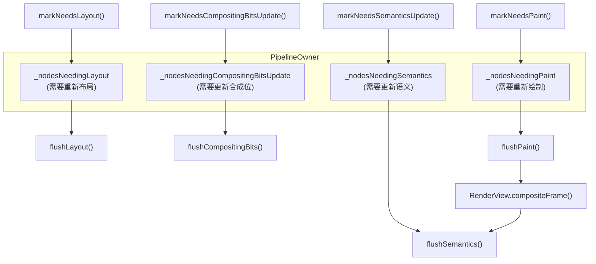
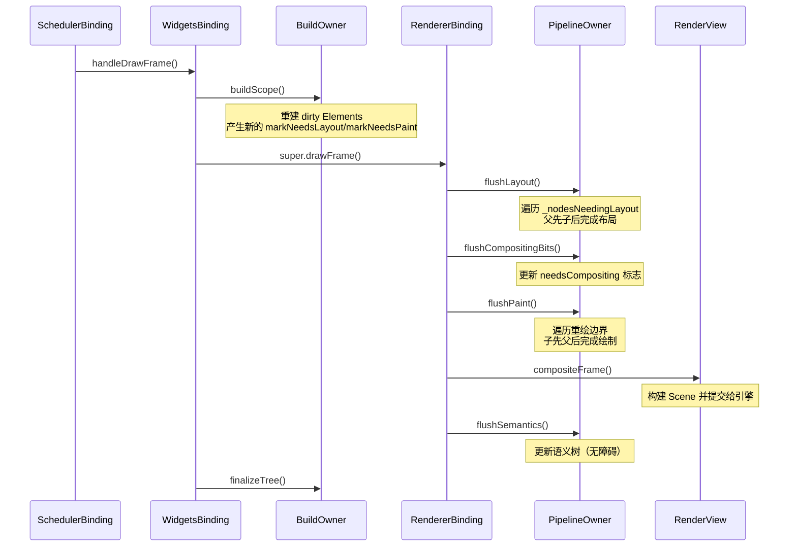
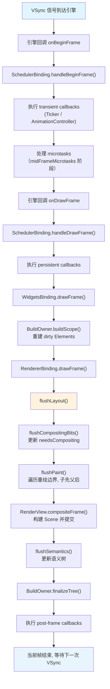

# Flutter PipelineOwner 与脏传播机制

## 概念总览

`PipelineOwner` 是 Flutter 渲染管线的"总调度"。它不直接布局或绘制任何东西，而是 **持有四组脏节点列表**，在每一帧的 `drawFrame` 阶段按顺序驱动它们完成重新布局、合成位更新、重新绘制和语义更新。

可以把 `PipelineOwner` 理解为渲染管线的任务调度器：

- **谁需要重新布局？** → `_nodesNeedingLayout` 列表
- **谁需要更新合成位？** → `_nodesNeedingCompositingBitsUpdate` 列表
- **谁需要重新绘制？** → `_nodesNeedingPaint` 列表
- **谁需要更新语义？** → `_nodesNeedingSemantics` 集合

这些列表的填充来自 `RenderObject` 的几个 `markNeeds*` 方法，而消费它们的是 `drawFrame` 的四个阶段：`flushLayout` → `flushCompositingBits` → `flushPaint` →（合成帧之后）`flushSemantics`。

这也解释了几个关键现象：

- `markNeedsLayout()` 不会立刻触发布局，只是把节点加入队列，等下一帧统一处理
- 布局和绘制的遍历顺序相反：布局是父先子后（约束自上而下传递），绘制是子先父后（后绘制的内容覆盖先绘制的）
- 重排边界（relayout boundary）和重绘边界（repaint boundary）是性能优化的核心机制，它们限制了脏传播的范围

这一篇的前提是"一帧已经被 `SchedulerBinding` 调度起来了"：脏标记最终都会走到 `requestVisualUpdate()` → `ensureVisualUpdate()` 请求下一帧，而 `drawFrame` 里发生的布局、绘制细节就是本文的主题。渲染对象的布局与绘制基础（constraints、performLayout、paint 等）这里只在需要的位置展开。

## 一、PipelineOwner 的角色定位

### 1.1 PipelineOwner 是什么

`PipelineOwner` 是 Flutter 框架中管理渲染管线（rendering pipeline）的核心对象。它的职责可以浓缩为一句话：**持有需要重新处理的 RenderObject 列表，在每帧的 drawFrame 阶段按正确顺序驱动它们完成布局、合成位更新、绘制和语义更新**。

从类定义看，`PipelineOwner` 是一个普通类（不是 mixin），存储了四组关键列表和若干调度方法：

```dart
// flutter/packages/flutter/lib/src/rendering/object.dart（节选，Flutter 3.41）
base class PipelineOwner with DiagnosticableTreeMixin {
  PipelineOwner({
    this.onNeedVisualUpdate,        // 需要视觉更新时的回调（可自定义）
    this.onSemanticsOwnerCreated,   // 语义所有者创建时回调
    this.onSemanticsUpdate,         // 语义更新时回调
    this.onSemanticsOwnerDisposed,  // 语义所有者销毁时回调
  });

  // 需要重新布局的节点列表（只收集重排边界）
  List<RenderObject> _nodesNeedingLayout = <RenderObject>[];

  // 需要重新判断 needsCompositing 标志的节点列表
  final List<RenderObject> _nodesNeedingCompositingBitsUpdate = <RenderObject>[];

  // 需要重新绘制的重绘边界节点列表
  List<RenderObject> _nodesNeedingPaint = <RenderObject>[];

  // 需要更新语义的节点集合
  final Set<RenderObject> _nodesNeedingSemantics = <RenderObject>{};

  // 根节点（通常是 RenderView）
  RenderObject? get rootNode => _rootNode;
  // ...
}
```

### 1.2 四个核心职责

PipelineOwner 的核心职责可以拆解为四个维度：

**职责一：管理需要重新布局的 RenderObject 列表**

- 当 `RenderObject.markNeedsLayout()` 被调用时，脏标记沿 parent 链向上传播，最终只有最近的重排边界（relayout boundary）节点会被加入 `_nodesNeedingLayout`
- `flushLayout()` 遍历这个列表，从浅到深依次完成重新布局

**职责二：管理需要更新合成位的 RenderObject 列表**

- 当 `RenderObject.markNeedsCompositingBitsUpdate()` 被调用时，节点被加入 `_nodesNeedingCompositingBitsUpdate`
- `flushCompositingBits()` 遍历这个列表，更新每个节点（及其子树）的 `needsCompositing` 标志

**职责三：管理需要重新绘制的 RenderObject 列表**

- 当 `RenderObject.markNeedsPaint()` 被调用时，脏标记沿 parent 链向上传播，最近的重绘边界（repaint boundary）节点会被加入 `_nodesNeedingPaint`
- `flushPaint()` 遍历这个列表，从深到浅依次完成重新绘制

**职责四：管理需要更新语义的 RenderObject 集合**

- 当 `RenderObject.markNeedsSemanticsUpdate()` 被调用时，节点被加入 `_nodesNeedingSemantics`
- `flushSemantics()` 在无障碍功能开启时遍历这个集合，更新语义树并发送给系统



### 1.3 PipelineOwner 与 WidgetsBinding / RendererBinding 的关系

在 Flutter 的 Binding 体系中，PipelineOwner 由 `RendererBinding` 创建和管理：

```text
WidgetsBinding
  └── RendererBinding（混入）
        └── 创建根 PipelineOwner（rootPipelineOwner），View widget 还会创建子 PipelineOwner 挂到它下面
        └── 在 drawFrame() 中依次调用 flushLayout / flushCompositingBits / flushPaint / flushSemantics
```

具体关系：

- `RendererBinding.initInstances()` 创建根 `PipelineOwner`（`rootPipelineOwner`）
- `RendererBinding.drawFrame()` 调用 `PipelineOwner` 的四个 flush 方法来驱动渲染管线
- `WidgetsBinding.drawFrame()` 先调用 `BuildOwner.buildScope()` 完成 Element 重建，再调 `super.drawFrame()` 进入渲染管线

```text
SchedulerBinding.handleDrawFrame()
    ↓
WidgetsBinding.drawFrame()
    ↓
BuildOwner.buildScope()          ← Element 重建
    ↓
super.drawFrame()                ← RendererBinding.drawFrame()
    ↓
flushLayout()
    ↓
flushCompositingBits()
    ↓
flushPaint()
    ↓
renderView.compositeFrame()      ← 生成 Scene 并提交给引擎
    ↓
flushSemantics()                 ← 更新语义树（无障碍开启时）
```

### 1.4 全局 PipelineOwner 实例

根 `PipelineOwner` 在 `RendererBinding.initInstances()` 中创建（Flutter 3.41 源码）：

```dart
// flutter/packages/flutter/lib/src/rendering/binding.dart（节选）
mixin RendererBinding
    on BindingBase, ServicesBinding, SchedulerBinding, GestureBinding, SemanticsBinding, HitTestable {
  @override
  void initInstances() {
    super.initInstances();
    _rootPipelineOwner = createRootPipelineOwner(); // 默认返回 _DefaultRootPipelineOwner()
    // ...
    rootPipelineOwner.attach(_manifold); // 挂到 PipelineManifold 上
  }

  PipelineOwner get rootPipelineOwner => _rootPipelineOwner;
}
```

`PipelineOwner` 通过 `requestVisualUpdate()` 请求视觉更新，它有两条出口：如果构造时配置了 `onNeedVisualUpdate` 回调就直接调用；否则走 `PipelineManifold.requestVisualUpdate()`。默认的 `PipelineManifold` 由 RendererBinding 提供，最终会调到 `SchedulerBinding.ensureVisualUpdate()`，再决定是否 `scheduleFrame()` 向引擎请求下一帧。这就是脏标记最终触发帧调度的链路：

```text
markNeedsLayout()
    ↓
PipelineOwner.requestVisualUpdate()
    ↓
onNeedVisualUpdate 回调（若配置）或 PipelineManifold.requestVisualUpdate()
    ↓
RendererBinding.ensureVisualUpdate()
    ↓
SchedulerBinding.scheduleFrame()
    ↓
向引擎请求 VSync
```

`ensureVisualUpdate()` 内部还会按 `schedulerPhase` 短路：只有处于 `idle` 或 `postFrameCallbacks` 阶段才会真正请求帧，一帧已经在处理中时是空操作，因此同一帧内的多次脏标记不会重复申请帧。

## 二、四个 dirty 列表

### 2.1 _nodesNeedingLayout（需要重新布局的节点）

**数据结构**：`List<RenderObject>`

```dart
List<RenderObject> _nodesNeedingLayout = <RenderObject>[];
```

**节点加入条件**：当 `RenderObject.markNeedsLayout()` 被调用时，节点会被加入这个列表。但有一个关键优化：**实际加入的是最近的重排边界（relayout boundary）节点**，而不是节点本身。

这意味着如果 A → B → C → D（A 是重排边界，D 是叶子节点），当 D 调用 `markNeedsLayout()` 时，脏标记沿 parent 链逐级向上传播（途中 B、C、D 都被置上 `_needsLayout = true`），最终实际被加入列表的是 A 而不是 D。

**重排边界的判定条件**：

一个 RenderObject 是不是重排边界，在每次 `layout()` 时都会重算。判定逻辑只有一行：

```dart
// flutter/packages/flutter/lib/src/rendering/object.dart（RenderObject.layout 内）
_isRelayoutBoundary = !parentUsesSize || sizedByParent || constraints.isTight || parent == null;
```

也就是说，以下任一条件成立，该节点就是重排边界：

1. `parentUsesSize == false`：父节点布局时不读取该节点的尺寸
2. `sizedByParent == true`：该节点的尺寸完全由约束决定（`performResize` 与 `performLayout` 分离的场景）
3. `constraints.isTight`：约束是紧约束，尺寸已被唯一确定
4. `parent == null`：它是根节点

```text
RenderObject A (relayout boundary)
  └── RenderObject B
        └── RenderObject C
              └── RenderObject D  ← markNeedsLayout()
                      ↓
              沿 parent 链递归向上标记（markParentNeedsLayout）
                      ↓
              找到 A (最近的重排边界)
                      ↓
              将 A 加入 _nodesNeedingLayout
```

**布局完成后清空**：`flushLayout()` 执行过程中会不断取出 `_nodesNeedingLayout` 里的节点，逐个调用 `_layoutWithoutResize()`，完成后节点的 `_needsLayout` 标志被重置为 false，并隐式触发一次 `markNeedsPaint()`（布局变了，绘制内容的位置也可能变了）。

### 2.2 _dirtyElements（需要重建的 Element）

严格来说，`_dirtyElements` **不是** PipelineOwner 管理的列表，而是 `BuildOwner` 管理的。但由于 BuildOwner 的 buildScope 和 PipelineOwner 的 flush 在同一帧里先后执行，二者紧密关联，所以放在这里一起讨论。

**所属**：`BuildOwner`
**数据结构**：`List<Element>`

```dart
// flutter/packages/flutter/lib/src/widgets/framework.dart
class BuildOwner {
  final List<Element> _dirtyElements = <Element>[];
}
```

**节点加入条件**：当 `Element.markNeedsBuild()` 被调用时，Element 被加入这个列表。典型调用链：

```text
State.setState()
    ↓
Element.markNeedsBuild()
    ↓
BuildOwner.scheduleBuildFor(element) → _dirtyElements.add(element)
    ↓
BuildOwner.onBuildScheduled() → WidgetsBinding._handleBuildScheduled()
    ↓
SchedulerBinding.ensureVisualUpdate()   ← 注意：这条路直接找 SchedulerBinding，不经过 PipelineOwner
```

**深度排序**：在 `BuildOwner.buildScope()` 中，dirty elements 会按深度从浅到深排序。这确保了父节点先于子节点重建，因为子节点的 Widget 可能依赖父节点传入的配置。

**与 PipelineOwner 的关系**：

```text
WidgetsBinding.drawFrame()
    ↓
BuildOwner.buildScope()          ← 处理 _dirtyElements
    ↓                            ← rebuild 过程中会产生新的 markNeedsLayout/markNeedsPaint
RendererBinding.drawFrame()
    ↓
flushLayout()                    ← 处理 _nodesNeedingLayout
    ↓
flushCompositingBits()
    ↓
flushPaint()
```

### 2.3 合成位更新列表

**数据结构**：`List<RenderObject>`

```dart
final List<RenderObject> _nodesNeedingCompositingBitsUpdate = <RenderObject>[];
```

**节点加入条件**：当 `RenderObject.markNeedsCompositingBitsUpdate()` 被调用时，最终会有一个节点被加入这个列表（详见第五节：传播会在最近的重绘边界或根节点处停下，加入列表的是那个终止节点）。

**needsCompositing 标志的意义**：

`needsCompositing` 是一个布尔标志，表示该 RenderObject 自身或其子树中是否存在至少一个需要独立合成层的节点。这个标志影响：

- paint 阶段是否要为该节点的子树创建/附加新的合成层
- 渲染树在合成阶段的处理方式

当渲染树结构发生变化（新增或移除节点）时，需要重新判断这个标志，这时就会触发 `markNeedsCompositingBitsUpdate()`。

```dart
// flutter/packages/flutter/lib/src/rendering/object.dart（Flutter 3.41）
bool _needsCompositingBitsUpdate = false;

void markNeedsCompositingBitsUpdate() {
  assert(!_debugDisposed);
  if (_needsCompositingBitsUpdate) {
    return;
  }
  _needsCompositingBitsUpdate = true;
  final RenderObject? parent = this.parent;
  if (parent != null) {
    if (parent._needsCompositingBitsUpdate) {
      return; // 父节点已经标记过，说明祖先链已经有人负责，直接返回
    }
    if ((!_wasRepaintBoundary || !isRepaintBoundary) && !parent.isRepaintBoundary) {
      parent.markNeedsCompositingBitsUpdate(); // 递归向上传播
      return;
    }
  }
  // 传播终止（到了根节点，或父节点是重绘边界）：把自己加入列表
  owner?._nodesNeedingCompositingBitsUpdate.add(this);
}
```

注意两点与直觉不同的地方：

- 传播**不会**一路走到根节点，而是停在最近的重绘边界祖先处。重绘边界自身必然需要合成（`needsCompositing` 恒为 true），再往上传播也不会改变祖先的判断结果
- 这个方法**不调用 `requestVisualUpdate()`**。源码注释明确说明：合成位更新从来不会单独发生，触发它的那次树结构变更一定已经顺带请求过帧了

**遍历方式**：`flushCompositingBits()` 会先把这个列表按深度从浅到深排序，再对每个节点调用 `_updateCompositingBits()`，递归地更新整个子树的 `needsCompositing` 标志。

### 2.4 重绘边界列表

**数据结构**：`List<RenderObject>`（PipelineOwner 的实例字段）

```dart
// flutter/packages/flutter/lib/src/rendering/object.dart（PipelineOwner 内）
List<RenderObject> _nodesNeedingPaint = <RenderObject>[];
```

**节点加入条件**：当 `RenderObject.markNeedsPaint()` 被调用时，系统会沿 parent 链向上查找最近的重绘边界（`isRepaintBoundary == true` 的节点），并将该边界节点加入列表。

**重绘边界的作用**：

重绘边界是绘制优化的核心机制。当一个节点的 `isRepaintBoundary` 为 true 时，它拥有独立的 `OffsetLayer`，可以：

- 隔离绘制范围：子节点的重绘不会影响父节点
- 支持 `RepaintBoundary` Widget 的局部重绘功能
- 减少 paint 阶段的遍历范围

```text
RenderObject A (repaint boundary) → 拥有独立 OffsetLayer
  └── RenderObject B
        └── RenderObject C  ← markNeedsPaint()
                ↓
        沿 parent 链向上递归查找
                ↓
        找到 A (最近的重绘边界)
                ↓
        将 A 加入 _nodesNeedingPaint
```

## 三、markNeedsLayout 脏传播路径

`markNeedsLayout()` 是触发布局更新的入口方法，也是理解脏传播机制的关键。下面逐行分析其源码实现。

### 3.1 源码分析

```dart
// flutter/packages/flutter/lib/src/rendering/object.dart（Flutter 3.41）
void markNeedsLayout() {
  assert(_debugCanPerformMutations);
  // 1. 如果已经标记为需要布局，直接返回（同一帧内重复标记会被吸收）
  if (_needsLayout) {
    assert(_debugRelayoutBoundaryAlreadyMarkedNeedsLayout());
    return;
  }

  // 2. 设置脏标记
  _needsLayout = true;

  // 3. 分情况：自己是重排边界，就把自己登记到 PipelineOwner
  if (owner case final PipelineOwner owner? when (_isRelayoutBoundary ?? false)) {
    owner._nodesNeedingLayout.add(this);
    owner.requestVisualUpdate(); // 请求视觉更新（向引擎请求下一帧）
  } else if (parent != null) {
    // 4. 不是重排边界 → 交给父节点继续向上传播
    markParentNeedsLayout();
  }
}

// 配套的向上传播方法
@protected
void markParentNeedsLayout() {
  assert(_debugCanPerformMutations);
  _needsLayout = true;
  final RenderObject parent = this.parent!;
  if (!_doingThisLayoutWithCallback) {
    parent.markNeedsLayout(); // 递归调用父节点的 markNeedsLayout
  } else {
    assert(parent._debugDoingThisLayout);
  }
}
```

读这段代码要注意两点：

- `_isRelayoutBoundary` 是在 `layout()` 时计算的布尔标志（见 3.4 节），初始为 null（还没被布局过）
- 传播是**逐级递归**的：D 标记自己 → 调 `markParentNeedsLayout()` → C 标记自己 → B 标记自己 → A（重排边界）把自己加入 `_nodesNeedingLayout`。沿途每个节点都带上了 `_needsLayout = true` 标记，父节点重新布局时调用子节点的 `layout()`，`layout()` 发现 `_needsLayout` 为 true 就不会提前返回

### 3.2 脏传播的完整路径

以一个叶子节点触发 `markNeedsLayout` 为例，完整传播路径如下：

```text
叶子节点 D.markNeedsLayout()
    ↓
检查 _needsLayout → false（首次标记）
    ↓
设置 _needsLayout = true
    ↓
检查 _isRelayoutBoundary → D 不是重排边界
    ↓
markParentNeedsLayout() → parent.markNeedsLayout() 逐级向上（C、B 同样置脏）
    ↓（A 是重排边界）
A 把自己加入 PipelineOwner._nodesNeedingLayout
    ↓
PipelineOwner.requestVisualUpdate()
    ↓
RendererBinding.ensureVisualUpdate()
    ↓
SchedulerBinding.scheduleFrame()
    ↓
向引擎请求 VSync
```

### 3.3 重排边界的作用

重排边界（relayout boundary）是布局系统的核心优化机制。它的核心思想是：**当子节点的布局发生变化时，不需要让所有祖先节点都重新布局，只需要让最近的重排边界及其以下的部分重新布局即可**。

这在以下场景中尤其重要：

- 列表项内部尺寸变化：列表项内部内容改变时，不需要重新布局整个列表
- 可滚动区域：滚动内容尺寸变化时，不需要重新布局滚动容器的外壳
- 页面路由切换：页面内部布局变化时，不需要重新布局导航栏和侧边栏

```text
RenderView (root, 必然是 relayout boundary)
  └── RenderFlex
        └── RenderConstrainedBox (父以 parentUsesSize: false 布局它 → relayout boundary)
              └── RenderPadding
                    └── RenderParagraph  ← markNeedsLayout()

传播路径停在 RenderConstrainedBox，不会继续向上传播到 RenderFlex 和 RenderView。
```

**注意：重排边界和重绘边界是两套独立的机制**。`RenderRepaintBoundary` 只保证自己是重绘边界（`isRepaintBoundary == true`），它是否同时是重排边界，完全取决于父节点怎么布局它：如果父节点读取它的尺寸（`parentUsesSize: true`）且约束不紧、它自己也非 `sizedByParent`，那它就不是重排边界，`markNeedsLayout` 会穿过它继续向上传播。所以不能靠"套一个 RepaintBoundary"来隔断布局脏传播。

### 3.4 一个节点何时成为重排边界

`_isRelayoutBoundary` 不需要开发者手动设置，它在每次 `layout()` 的开头重算：

```dart
// flutter/packages/flutter/lib/src/rendering/object.dart（RenderObject.layout 节选）
void layout(Constraints constraints, { bool parentUsesSize = false }) {
  // ...

  // 每次布局都重算：四个条件任一成立即是重排边界
  _isRelayoutBoundary = !parentUsesSize || sizedByParent || constraints.isTight || parent == null;

  // 早退优化：不脏且约束没变，什么都不用做
  if (!_needsLayout && constraints == _constraints) {
    return;
  }
  _constraints = constraints;

  // ... performResize（若 sizedByParent）→ performLayout
}
```

这里有两条信息值得记住：

- **重排边界身份是动态的**。父节点这次用 `parentUsesSize: true` 布局它、下次改成 false，它的边界身份就变了；约束从松变紧（`constraints.isTight`）同理
- **约束未变且不脏时直接早退**。这就是为什么重排边界能省工作量：边界内的子树再怎么折腾，只要没把脏标记传播到边界之外，外层祖先的 `layout()` 都会被这行早退逻辑挡住

### 3.5 代码示例：自定义 RenderObject 中的 markNeedsLayout

```dart
class MyCustomRenderObject extends RenderBox {
  double _value = 0.0;

  double get value => _value;

  set value(double newValue) {
    if (_value != newValue) {
      _value = newValue;
      // 通知框架需要重新布局
      markNeedsLayout();
    }
  }

  @override
  void performLayout() {
    // 根据 _value 计算新的尺寸
    size = Size(constraints.maxWidth, _value * 40);
  }
}
```

在这个例子中，每次 `value` 改变都会调用 `markNeedsLayout()`，将最近的重排边界加入 `PipelineOwner._nodesNeedingLayout`，等下一帧的 `flushLayout` 来处理。

### 3.6 常见误区

**误区一**：`markNeedsLayout()` 会立刻触发布局。

不会。它只是把节点加入脏列表，并请求下一帧。真正的布局发生在 `flushLayout()` 中。

**误区二**：调用 `markNeedsLayout()` 一定会把当前节点加入脏列表。

不一定会。实际加入的是最近的重排边界节点。如果当前节点本身就是重排边界，那加入的就是它自己；否则加入的是上游的某个祖先节点。

**误区三**：重排边界之上的节点在子树布局变化时不会重新布局。

这是对的。但有一个例外：如果约束本身发生了变化（比如父节点尺寸变了），约束变化会打破重排边界的"隔离"效果，迫使重排边界之上的节点也重新布局。

## 四、markNeedsPaint 脏传播路径

### 4.1 源码分析

```dart
// flutter/packages/flutter/lib/src/rendering/object.dart（Flutter 3.41）
void markNeedsPaint() {
  assert(!_debugDisposed);
  assert(owner == null || !owner!.debugDoingPaint);

  // 1. 如果已经标记过需要 paint，直接返回
  if (_needsPaint) {
    return;
  }

  // 2. 设置脏标记
  _needsPaint = true;

  // 3. 自己是重绘边界（且此前就是，拥有可复用的 layer）→ 直接把自己登记进列表
  if (isRepaintBoundary && _wasRepaintBoundary) {
    assert(_layerHandle.layer is OffsetLayer);
    if (owner != null) {
      owner!._nodesNeedingPaint.add(this);
      owner!.requestVisualUpdate(); // 请求视觉更新（向引擎请求下一帧）
    }
  } else if (parent != null) {
    // 4. 不是重绘边界 → 交给父节点继续向上传播
    parent!.markNeedsPaint();
  } else {
    // 5. 是根节点但不是重绘边界：只能自己画自己，请求一帧即可
    owner?.requestVisualUpdate();
  }
}
```

这段代码和 `markNeedsLayout` 的结构几乎对称：都是"已标记就早退 → 置脏 → 是边界就登记自己，不是就递归找父节点"。区别只在"边界"的定义：布局用的是 `_isRelayoutBoundary`（动态计算），绘制用的是 `isRepaintBoundary`（由子类声明，如 `RenderRepaintBoundary` 固定返回 true）。

`_wasRepaintBoundary` 记录的是"上一次 paint 时是不是重绘边界"。如果一个节点刚变成重绘边界、还没有属于自己的 layer，就不能直接登记，要先向上找能画的祖先。

### 4.2 与 markNeedsLayout 的传播路径差异

| 特性 | markNeedsLayout | markNeedsPaint |
|------|----------------|----------------|
| 脏标志 | `_needsLayout` | `_needsPaint` |
| 边界类型 | relayout boundary | repaint boundary |
| 边界属性 | `_isRelayoutBoundary`（layout 时动态计算） | `isRepaintBoundary`（子类声明，固定） |
| 数据结构 | `_nodesNeedingLayout` (List) | `_nodesNeedingPaint` (List) |
| 传播方式 | 逐级递归向上，直到重排边界 | 逐级递归向上，直到重绘边界 |
| 帧内多次调用 | 跳过（已标记则返回） | 跳过（已标记则返回） |
| 典型触发 | 尺寸、约束变化 | 外观、颜色、内容变化 |

两者的传播机制在新版源码里已经趋同（都是递归向上），真正的差别在"沿途付出什么代价"：

- `markNeedsLayout` 途中每个祖先都被置上 `_needsLayout = true`，将来父节点重新布局时会顺着 `layout()` 调用链重算这些子树
- `markNeedsPaint` 途中祖先只是把 `_needsPaint` 标记传上去，真正被登记的只有那个重绘边界，边界内的重绘被整体压缩成"重画这一个边界"


### 4.3 重绘边界的创建

重绘边界由 `isRepaintBoundary` 属性控制。最常见的方式是使用 `RepaintBoundary` Widget：

```dart
RepaintBoundary(
  child: AnimatedBuilder(
    animation: _animation,
    builder: (context, child) {
      return Container(
        width: 200,
        height: 200,
        color: Color.fromRGBO(
          (255 * _animation.value).toInt(),
          0,
          0,
          1.0,
        ),
      );
    },
  ),
);
```

`RepaintBoundary` 的底层实现：

```dart
// flutter/packages/flutter/lib/src/widgets/basic.dart
class RepaintBoundary extends SingleChildRenderObjectWidget {
  const RepaintBoundary({ super.key, super.child });

  @override
  RenderRepaintBoundary createRenderObject(BuildContext context) => RenderRepaintBoundary();
}

// flutter/packages/flutter/lib/src/rendering/proxy_box.dart
class RenderRepaintBoundary extends RenderProxyBox {
  @override
  bool get isRepaintBoundary => true;
}
```

### 4.4 代码示例：理解 markNeedsPaint 的传播范围

```dart
// 场景：点击按钮改变颜色，但不影响父容器
class ColorChangingWidget extends StatelessWidget {
  const ColorChangingWidget({super.key});

  @override
  Widget build(BuildContext context) {
    return Column(
      children: [
        const Text('这个 Text 不会重绘'),
        RepaintBoundary(
          child: _ColorBox(),
        ),
        const Text('这个 Text 也不会重绘'),
      ],
    );
  }
}

class _ColorBox extends StatefulWidget {
  @override
  State<_ColorBox> createState() => _ColorBoxState();
}

class _ColorBoxState extends State<_ColorBox> {
  Color _color = Colors.red;

  @override
  Widget build(BuildContext context) {
    return GestureDetector(
      onTap: () {
        // markNeedsPaint 只传播到 RepaintBoundary
        setState(() {
          _color = _color == Colors.red ? Colors.blue : Colors.red;
        });
      },
      child: Container(
        width: 100,
        height: 100,
        color: _color,
      ),
    );
  }
}
```

在这个例子中，`setState` 触发 `markNeedsBuild`，进而导致 `RenderDecoratedBox.markNeedsPaint()`。由于 `RepaintBoundary` 的存在，paint 只会在 `RepaintBoundary` 范围内进行，两个 `Text` 不会重绘。

## 五、markNeedsCompositingBitsUpdate 脏传播路径

### 5.1 源码分析

```dart
// flutter/packages/flutter/lib/src/rendering/object.dart（Flutter 3.41）
bool _needsCompositingBitsUpdate = false;

void markNeedsCompositingBitsUpdate() {
  assert(!_debugDisposed);
  // 1. 已经标记过，直接返回
  if (_needsCompositingBitsUpdate) {
    return;
  }

  // 2. 设置脏标记
  _needsCompositingBitsUpdate = true;

  final RenderObject? parent = this.parent;
  if (parent != null) {
    // 3. 父节点已经标记过 → 祖先链上已有人负责，直接返回
    if (parent._needsCompositingBitsUpdate) {
      return;
    }

    // 4. 递归向上传播（停在最近的重绘边界祖先处）
    if ((!_wasRepaintBoundary || !isRepaintBoundary) && !parent.isRepaintBoundary) {
      parent.markNeedsCompositingBitsUpdate();
      return;
    }
  }

  // 5. 传播终止（到了根节点，或父节点是重绘边界）：把自己加入列表
  owner?._nodesNeedingCompositingBitsUpdate.add(this);
}
```

注意这个方法**不调用 `requestVisualUpdate()`**，源码注释明确解释了原因：合成位更新从来不会"单独"发生——一定是先有树结构变更（adoptChild / dropChild）触发了它，而那次变更本身已经顺带请求过帧了。

### 5.2 needsCompositing 标志的意义

`needsCompositing` 标志用于告诉绘制与合成阶段，当前 RenderObject 自身或其子树中是否存在至少一个需要独立合成层的节点。

它不是实时计算的 getter，而是一个由 `_updateCompositingBits()` 统一维护的字段：

```dart
// flutter/packages/flutter/lib/src/rendering/object.dart
bool get needsCompositing {
  assert(!_needsCompositingBitsUpdate); // 脏的时候禁止读取
  return _needsCompositing;
}
```

哪些情况会导致 `needsCompositing` 为 true：

- 节点自身 `isRepaintBoundary` 为 true（重绘边界必有独立 layer）
- 节点自身 `alwaysNeedsCompositing` 为 true（如 `Opacity`、`ClipPath`、`ShaderMask`、`BackdropFilter` 等需要 push layer 的渲染对象）
- 任意一个子节点的 `needsCompositing` 为 true（会沿树向上传导）

### 5.3 _updateCompositingBits 的递归实现

```dart
// flutter/packages/flutter/lib/src/rendering/object.dart（Flutter 3.41）
void _updateCompositingBits() {
  if (!_needsCompositingBitsUpdate) {
    return;
  }
  final bool oldNeedsCompositing = _needsCompositing;
  _needsCompositing = false;

  // 1. 先递归更新所有子节点
  visitChildren((RenderObject child) {
    child._updateCompositingBits();
    if (child.needsCompositing) {
      _needsCompositing = true;
    }
  });

  // 2. 再看自身：重绘边界或必须独占 layer 的节点
  if (isRepaintBoundary || alwaysNeedsCompositing) {
    _needsCompositing = true;
  }

  // 3. 合成位发生变化 → 需要重新绘制（layer 结构变了）
  if (!isRepaintBoundary && _wasRepaintBoundary) {
    // 节点不再是重绘边界：从绘制列表移除，重新走 markNeedsPaint 找能画它的祖先
    _needsPaint = false;
    _needsCompositedLayerUpdate = false;
    owner?._nodesNeedingPaint.removeWhere((RenderObject t) => identical(t, this));
    _needsCompositingBitsUpdate = false;
    markNeedsPaint();
  } else if (oldNeedsCompositing != _needsCompositing) {
    _needsCompositingBitsUpdate = false;
    markNeedsPaint();
  } else {
    _needsCompositingBitsUpdate = false;
  }
}
```

### 5.4 触发时机

`markNeedsCompositingBitsUpdate()` 通常在以下场景被调用：

1. **新增节点到渲染树**：`adoptChild()` 时
2. **从渲染树中移除节点**：`dropChild()` 时
3. **节点重新挂载**：`attach()` 时若发现离树期间被标过脏，会重新登记

```dart
// flutter/packages/flutter/lib/src/rendering/object.dart（RenderObject 节选）
@override
void adoptChild(RenderObject child) {
  // ...
  markNeedsCompositingBitsUpdate(); // 树结构变了，子树的合成位需要重算
}

@override
void dropChild(RenderObject child) {
  // ...
  markNeedsCompositingBitsUpdate();
}

// attach：把离树期间积攒的脏标记重新登记到新 owner
@mustCallSuper
void attach(PipelineOwner owner) {
  _owner = owner;
  if (_needsLayout && _isRelayoutBoundary != null) {
    _needsLayout = false;
    markNeedsLayout(); // 重置后重新走一遍标记流程
  }
  if (_needsCompositingBitsUpdate) {
    _needsCompositingBitsUpdate = false;
    markNeedsCompositingBitsUpdate();
  }
  if (_needsPaint && _layerHandle.layer != null) {
    _needsPaint = false;
    markNeedsPaint();
  }
  // ... 语义部分同理
}

// detach：只是把 owner 引用置空，节点可以带着脏标记"离队"，等下次 attach 再补登记
@mustCallSuper
void detach() {
  _owner = null;
}
```

## 六、flushLayout 遍历

### 6.1 源码级分析

`flushLayout()` 是布局阶段的入口方法。它的核心逻辑是遍历所有脏节点，从浅到深依次完成布局。

```dart
// flutter/packages/flutter/lib/src/rendering/object.dart（Flutter 3.41，节选）
void flushLayout() {
  try {
    // 1. while 循环：布局过程中可能产生新的脏节点，要一直处理到没有为止
    while (_nodesNeedingLayout.isNotEmpty) {
      final List<RenderObject> dirtyNodes = _nodesNeedingLayout;
      _nodesNeedingLayout = <RenderObject>[];

      // 2. 排序：按深度从浅到深（父节点先于子节点）
      dirtyNodes.sort((RenderObject a, RenderObject b) => a.depth - b.depth);

      for (var i = 0; i < dirtyNodes.length; i++) {
        // LayoutBuilder 回调返回后可能产生新脏节点，先合并回来再继续
        if (_shouldMergeDirtyNodes) {
          _shouldMergeDirtyNodes = false;
          if (_nodesNeedingLayout.isNotEmpty) {
            _nodesNeedingLayout.addAll(dirtyNodes.getRange(i, dirtyNodes.length));
            break; // 跳回 while 循环重新排序处理
          }
        }
        final RenderObject node = dirtyNodes[i];
        // 3. 逐个布局（只有重排边界会出现在这个列表里）
        if (node._needsLayout && node.owner == this) {
          node._layoutWithoutResize();
        }
      }
      _shouldMergeDirtyNodes = false;
    }
    // 4. 子 PipelineOwner 递归 flush
    for (final PipelineOwner child in _children) {
      child.flushLayout();
    }
  } finally {
    // ...收尾
  }
}

// 单个重排边界的布局入口
void _layoutWithoutResize() {
  try {
    performLayout();          // 真正的布局逻辑
    markNeedsSemanticsUpdate(); // 布局变了，语义也可能要更新
  } catch (e, stack) {
    _reportException('performLayout', e, stack);
  }
  _needsLayout = false;
  markNeedsPaint();           // 布局完成后隐式请求重绘
}
```

这里有两个值得注意的细节：

- 列表里取出的节点直接调 `_layoutWithoutResize()`（不做 `performResize`），因为重排边界的尺寸不受父节点使用方式影响，只有子树需要重排
- 每个节点布局完成后会**隐式调用一次 `markNeedsPaint()`**。所以"布局变了但绘制不用动"几乎不会发生——布局脏了必然伴随重绘请求

### 6.2 遍历顺序：深度优先，父节点先于子节点

布局必须从父节点开始，因为父节点需要先将自己的约束（constraints）传递给子节点，子节点才能在约束范围内决定自己的尺寸。

```text
RenderView
  ├── performLayout()
  │     传递 constraints 给子节点
  │
  └── RenderFlex
        ├── performLayout()
        │     传递 constraints 给子节点
        │
        ├── RenderConstrainedBox
        │     └── performLayout()
        │
        └── RenderExpanded
              └── performLayout()
```

这是一个 **深度优先、父先子后** 的遍历顺序。在 `performLayout` 内部，节点会递归地调用子节点的 `layout()` 方法，确保子树也完成布局。

### 6.3 为什么父节点必须先 layout

这涉及 Flutter 布局系统的核心约束传递原则：**约束从父往子传，尺寸从子往父回**。

```dart
// RenderFlex.performLayout() 的简化版
@override
void performLayout() {
  // 1. 父节点决定如何分配约束给每个子节点
  double mainAxisExtent = 0;
  final BoxConstraints childConstraints = BoxConstraints(
    minWidth: 0,
    maxWidth: constraints.maxWidth,
  );

  // 2. 依次布局每个子节点
  RenderBox? child = firstChild;
  while (child != null) {
    // 将约束传给子节点
    child.layout(childConstraints, parentUsesSize: true);
    // 读取子节点的尺寸
    mainAxisExtent += child.size.height;
    child = childAfter(child);
  }

  // 3. 根据子节点尺寸确定自身尺寸
  size = constraints.constrain(Size(constraints.maxWidth, mainAxisExtent));
}
```

如果子节点先于父节点 layout，子节点就无法获得正确的约束，因为约束是由父节点根据自身的约束计算出来的。

### 6.4 RenderView.performLayout 的特殊处理

`RenderView` 是渲染树的根节点，它的约束来自引擎（即屏幕尺寸），所以它的 `performLayout` 有特殊处理：

```dart
// flutter/packages/flutter/lib/src/rendering/view.dart（Flutter 3.41）
class RenderView extends RenderObject with RenderObjectWithChildMixin<RenderBox> {
  @override
  void performLayout() {
    assert(_rootTransform != null);
    // 约束是否唯一确定了尺寸？
    final bool sizedByChild = !constraints.isTight;
    // 把引擎给的约束直接传给子节点；只有约束是松的时才读取子节点尺寸
    child?.layout(constraints, parentUsesSize: sizedByChild);
    _size = sizedByChild && child != null ? child!.size : constraints.smallest;
    assert(size.isFinite);
    assert(constraints.isSatisfiedBy(size));
  }

  @override
  bool get isRepaintBoundary => true;
}
```

`RenderView` 的特殊性在于：

1. 它是渲染树的根节点，没有父节点，框架从不调用它的 `layout()`，而是首帧时通过 `scheduleInitialLayout()` 直接把它加入 `_nodesNeedingLayout`
2. 它的约束来自引擎（屏幕物理尺寸换算成的逻辑约束）
3. 它是天然的重排边界（根节点）和重绘边界（`isRepaintBoundary => true`）
4. 它不需要关心 `parentUsesSize`（没有父节点）

## 七、flushCompositingBits 遍历

### 7.1 执行时机

`flushCompositingBits()` 在 `flushLayout()` 之后、`flushPaint()` 之前执行。

```text
RendererBinding.drawFrame()
    ↓
flushLayout()               ← 布局完成
    ↓
flushCompositingBits()      ← 更新合成位
    ↓
flushPaint()                ← 开始绘制
```

### 7.2 为什么在 layout 和 paint 之间执行

这个顺序是有意义的：

1. **先完成布局**：布局可能改变节点的位置和尺寸，这会影响哪些节点需要合成层
2. **更新合成位**：在布局完成后，确定每个节点是否需要合成层
3. **再开始绘制**：绘制需要知道哪些节点需要独立的合成层

```dart
// flutter/packages/flutter/lib/src/rendering/object.dart（Flutter 3.41，节选）
void flushCompositingBits() {
  // 1. 先按深度从浅到深排序：父节点的合成位依赖子节点的结果，必须先算子树
  _nodesNeedingCompositingBitsUpdate.sort((RenderObject a, RenderObject b) => a.depth - b.depth);
  // 2. 对每个节点递归更新子树的合成位
  for (final RenderObject node in _nodesNeedingCompositingBitsUpdate) {
    if (node._needsCompositingBitsUpdate && node.owner == this) {
      node._updateCompositingBits();
    }
  }
  _nodesNeedingCompositingBitsUpdate.clear();
  // 3. 子 PipelineOwner 递归 flush
  for (final PipelineOwner child in _children) {
    child.flushCompositingBits();
  }
}
```

### 7.3 合成位更新的递归特性

`_updateCompositingBits()` 是递归的，它不仅更新当前节点的 `needsCompositing`，还会递归更新所有子节点：

```text
节点 A
  ├── A._updateCompositingBits()
  │     ├── child B._updateCompositingBits()
  │     │     ├── child D._updateCompositingBits()
  │     │     └── child E._updateCompositingBits()
  │     └── child C._updateCompositingBits()
  │           └── child F._updateCompositingBits()
  ├── 计算 A.needsCompositing
  └── 如果 needsCompositing 变化 → markNeedsPaint()
```

如果某个节点的 `needsCompositing` 从 false 变为 true 或从 true 变为 false，说明该节点可能需要或不再需要合成层，这时会触发 `markNeedsPaint()`，让绘制阶段处理合成层的变化。

## 八、flushPaint 遍历

### 8.1 源码级分析

```dart
// flutter/packages/flutter/lib/src/rendering/object.dart（Flutter 3.41，节选）
void flushPaint() {
  try {
    final List<RenderObject> dirtyNodes = _nodesNeedingPaint;
    _nodesNeedingPaint = <RenderObject>[];

    // 1. 排序：按深度从深到浅（子节点先于父节点）
    for (final node in dirtyNodes..sort((RenderObject a, RenderObject b) => b.depth - a.depth)) {
      assert(node._layerHandle.layer != null);
      if ((node._needsPaint || node._needsCompositedLayerUpdate) && node.owner == this) {
        if (node._layerHandle.layer!.attached) {
          assert(node.isRepaintBoundary);
          if (node._needsPaint) {
            // 2. 重绘该重绘边界的子树
            PaintingContext.repaintCompositedChild(node);
          } else {
            // 只更新 layer 属性（如透明度），不重画子树
            PaintingContext.updateLayerProperties(node);
          }
        } else {
          // layer 已脱管：把整棵子树重新标记为待重绘
          node._skippedPaintingOnLayer();
        }
      }
    }
    // 3. 子 PipelineOwner 递归 flush
    for (final PipelineOwner child in _children) {
      child.flushPaint();
    }
  } finally {
    // ...收尾
  }
}
```

### 8.2 遍历顺序：子节点先于父节点 paint

与 flushLayout 相反，flushPaint 的遍历顺序是 **子节点先于父节点**。这个顺序是源码里显式排序出来的：`flushPaint()` 对脏节点列表按深度**从深到浅**排序（源码注释原话是 "Sort the dirty nodes in reverse order (deepest first)"），而 `flushLayout()` 是从浅到深。

先画子的重绘边界、再画父的，是为了让父边界做合成（把子 layer 挂进自己的 layer 树）时，挂到的已经是子边界更新后的内容；反过来先父后子，父刚合成完子又要更新，容易造成同一帧内的重复工作。

```dart
// RenderBoxContainerDefaultsMixin.defaultPaint（多子容器绘制的通用实现，简化）
void defaultPaint(PaintingContext context, Offset offset) {
  // 依次绘制所有子节点
  RenderBox? child = firstChild;
  while (child != null) {
    final BoxParentData childParentData = child.parentData! as BoxParentData;
    context.paintChild(child, childParentData.offset + offset);
    child = childAfter(child);
  }
}
```

### 8.3 为什么子节点先 paint

这与 Flutter 的绘制模型有关。在同一个 `PaintingContext` 对应的 `PictureLayer` 里，后绘制的图形会覆盖先绘制的。所以父节点通常先画自己的内容（比如背景装饰），再调用 `paintChild` 画子节点，子节点的内容就自然覆盖在父节点背景之上。这通常是正确的层级关系：

```text
父节点 paint 背景
    ↓
子节点 A paint 内容
    ↓
子节点 B paint 内容
    ↓
父节点 paint 前景装饰
```

要区分两个层面的"子先父后"：

- **多个脏重绘边界之间**：由 `flushPaint()` 的深度降序排序保证（本节开头说的那种）
- **单个重绘边界内部**：paint 递归中，父 RenderObject 的 `paint()` 方法先被调用，但方法体内先画自己再画子节点，最终落到画布上的效果是子内容叠在父内容之上

对于重绘边界节点，由于每个重绘边界都有独立的 `OffsetLayer`，它们的绘制是独立的。`flushPaint` 只需要遍历所有需要重绘的重绘边界，对每个边界从该节点开始向下递归绘制。

### 8.4 PaintingContext 的作用

`PaintingContext` 是 paint 阶段的核心工具类。它封装了一个 `PictureRecorder` 和一个 `Canvas`，负责把绘制指令记录进 `PictureLayer`：

```dart
// flutter/packages/flutter/lib/src/rendering/object.dart（Flutter 3.41，节选）
class PaintingContext extends ClipContext {
  PaintingContext(this._containerLayer, this.estimatedBounds);

  final ContainerLayer _containerLayer;

  // 在给定偏移量处绘制子节点
  void paintChild(RenderObject child, Offset offset) {
    if (child.isRepaintBoundary) {
      // 子节点是重绘边界：停止当前记录，把子的 layer 合成进来
      stopRecordingIfNeeded();
      _compositeChild(child, offset);
    } else if (child._wasRepaintBoundary) {
      // 曾经是重绘边界但现在不是了：丢弃旧 layer，直接画进当前上下文
      child._layerHandle.layer = null;
      child._paintWithContext(this, offset);
    } else {
      // 普通子节点：在同一个 context 中继续绘制
      child._paintWithContext(this, offset);
    }
  }

  void _compositeChild(RenderObject child, Offset offset) {
    // 子边界若标脏则先重画它（复用它的 layer），否则直接复用
    if (child._needsPaint || !child._wasRepaintBoundary) {
      repaintCompositedChild(child, debugAlsoPaintedParent: true);
    } else if (child._needsCompositedLayerUpdate) {
      updateLayerProperties(child);
    }
    // 把子边界的 OffsetLayer 挂到当前容器 layer 下
    final childOffsetLayer = child._layerHandle.layer! as OffsetLayer;
    childOffsetLayer.offset = offset;
    appendLayer(childOffsetLayer);
  }
}
```

关键认知：**遇到重绘边界时，父的画布并不会真的去"画"它，而是把它的 `OffsetLayer` 作为子 layer 挂到自己所在的 layer 树上**。这就是重绘边界能被独立复用的原因——它上次画好的 `Picture` 就躺在自己的 layer 里，父边界重绘时直接整层搬过去，不必重画。

### 8.5 重绘边界与独立的 OffsetLayer

每个重绘边界节点拥有独立的 `OffsetLayer`。这意味着：

1. 重绘边界内的绘制变化不会影响外部
2. 合成器可以将重绘边界作为一个独立的合成层
3. 重绘边界的 `Picture` 可以被缓存，下次只需要重新缓存的部分

```text
Layer Tree:
  TransformLayer (root, RenderView)
    ├── OffsetLayer (RepaintBoundary A)
    │     └── PictureLayer (A 子树的绘制内容，含普通节点 B 的内容)
    └── OffsetLayer (RepaintBoundary C)
          └── PictureLayer (C 的绘制内容)
```

普通节点 B 没有自己的 layer，它的内容被记录进所属重绘边界的 `PictureLayer`。当 B 需要重绘时，实际上要重画的是它所在的那个重绘边界（也就是重新记录整个 `PictureLayer`）。当 C 需要重绘时，只需要重新记录 C 自己的 `PictureLayer`。重绘边界 A 和 C 之间互不影响。

## 九、drawFrame 完整流程

### 9.1 RendererBinding.drawFrame 的五个阶段

```dart
// flutter/packages/flutter/lib/src/rendering/binding.dart（Flutter 3.41）
@protected
void drawFrame() {
  // 第一阶段：完成所有脏节点的布局
  rootPipelineOwner.flushLayout();

  // 第二阶段：更新合成位
  rootPipelineOwner.flushCompositingBits();

  // 第三阶段：完成所有脏节点的绘制
  rootPipelineOwner.flushPaint();

  if (sendFramesToEngine) {
    // 第四阶段：合成帧并发送给引擎（注意：这是 RenderView 的方法，不是 PipelineOwner 的）
    for (final RenderView renderView in renderViews) {
      renderView.compositeFrame(); // this sends the bits to the GPU
    }
    // 第五阶段：更新语义树并发送给系统（无障碍开启时才有实际工作）
    rootPipelineOwner.flushSemantics(); // this sends the semantics to the OS.
  }
}
```

### 9.2 五个阶段的执行顺序与原因



每个阶段的必要性：

| 阶段 | 输入 | 输出 | 为什么需要 |
|------|------|------|-----------|
| buildScope | `_dirtyElements` | 更新后的 Element 树 | 重建 Widget 树，可能产生新的 RenderObject 或修改现有 RenderObject |
| flushLayout | `_nodesNeedingLayout` | 所有节点完成布局 | 布局可能改变尺寸和位置，影响后续绘制 |
| flushCompositingBits | `_nodesNeedingCompositingBitsUpdate` | 所有节点合成位更新 | 合成位决定绘制是否需要独立 layer |
| flushPaint | `_nodesNeedingPaint` | 所有节点完成绘制 | 产生最终的绘制指令（Layer 树） |
| compositeFrame | Layer 树 | `ui.Scene` | 把 layer 树合成并发送给引擎光栅化 |
| flushSemantics | `_nodesNeedingSemantics` | 语义树更新 | 支持无障碍（读屏等），仅在语义开启时有实际工作 |

### 9.3 与 SchedulerBinding.handleDrawFrame() 的关系

`SchedulerBinding.handleDrawFrame()` 是整个帧流程的入口，它按以下顺序执行（节选自源码）：

```dart
// flutter/packages/flutter/lib/src/scheduler/binding.dart（节选）
void handleDrawFrame() {
  assert(_schedulerPhase == SchedulerPhase.midFrameMicrotasks);
  try {
    // 1. PERSISTENT FRAME CALLBACKS（最重要的就是 WidgetsBinding.drawFrame）
    _schedulerPhase = SchedulerPhase.persistentCallbacks;
    for (final callback in List<FrameCallback>.of(_persistentCallbacks)) {
      _invokeFrameCallback(callback, _currentFrameTimeStamp!);
    }

    // 2. POST-FRAME CALLBACKS
    _schedulerPhase = SchedulerPhase.postFrameCallbacks;
    final localPostFrameCallbacks = List<FrameCallback>.of(_postFrameCallbacks);
    _postFrameCallbacks.clear(); // 一次性：执行前先清空
    for (final callback in localPostFrameCallbacks) {
      _invokeFrameCallback(callback, _currentFrameTimeStamp!);
    }
  } finally {
    _schedulerPhase = SchedulerPhase.idle;
  }
}
```

`WidgetsBinding.drawFrame()` 是最关键的 persistent callback：

```dart
// flutter/packages/flutter/lib/src/widgets/binding.dart（Flutter 3.41，节选）
@override
void drawFrame() {
  // 1. 重建所有 dirty elements
  if (rootElement != null) {
    buildOwner!.buildScope(rootElement!);
  }

  // 2. 调用 RendererBinding.drawFrame()（布局 → 合成位 → 绘制 → 合成 → 语义）
  super.drawFrame();

  // 3. 收尾 Element 树（触发被移除节点的 State.dispose 等）
  buildOwner!.finalizeTree();
}
```

### 9.4 完整的帧工作流图



### 9.5 帧内可能出现的新脏标记

在 `flushLayout` 过程中，可能产生新的 `markNeedsLayout` 或 `markNeedsPaint` 调用。PipelineOwner 的处理方式是：

- `flushLayout` 过程中产生的 `markNeedsLayout` 会被加入到新的 `_nodesNeedingLayout` 列表中
- 新的 `_nodesNeedingPaint` 会在同一帧稍后的 `flushPaint` 中处理；新的布局脏节点会被 while 循环吸收进当前 `flushLayout`
- 如果在同一帧内产生了脏标记，`requestVisualUpdate` 不会产生额外帧请求：此时处于 `persistentCallbacks` 阶段，`ensureVisualUpdate()` 对这个阶段是空操作

这就是为什么 `flushLayout` 使用 while 循环而不是单次遍历：

```dart
while (_nodesNeedingLayout.isNotEmpty) {
  final List<RenderObject> dirtyNodes = _nodesNeedingLayout;
  _nodesNeedingLayout = <RenderObject>[];
  // ... 处理 dirtyNodes ...
}
```

如果在处理过程中又产生了脏节点，while 循环会继续处理，直到没有新的脏节点为止。另外 3.41 的源码里还有一个更细的优化：`RenderObject.invokeLayoutCallback`（比如 `LayoutBuilder` 的 builder 回调）返回后，框架会把回调期间新增的脏节点**合并回当前列表重新排序**（`_shouldMergeDirtyNodes` 标志），而不是简单地排到队尾，避免同一个节点在一帧里被布局多次。

## 十、实战与调试

### 10.1 debugPrintMarkNeedsLayoutStacks

当 `debugPrintMarkNeedsLayoutStacks` 为 true 时，每次调用 `markNeedsLayout()` 都会打印调用栈，帮助定位哪些代码触发了布局更新。

```dart
// 在 main 函数中启用
void main() {
  debugPrintMarkNeedsLayoutStacks = true;
  runApp(const MyApp());
}
```

输出示例（示意，实际为每次 `markNeedsLayout` 打印一条调用栈）：

```text
markNeedsLayout() called for RenderFlex#12345
#0      RenderObject.markNeedsLayout (package:flutter/src/rendering/object.dart:...)
#1      RenderConstrainedBox.value= (package:flutter/src/rendering/proxy_box.dart:...)
#2      _ColorBoxState.build (package:my_app/main.dart:...)
#3      ...
```

### 10.2 debugPrintMarkNeedsPaintStacks

同理，`debugPrintMarkNeedsPaintStacks` 可以追踪哪些代码触发了绘制更新：

```dart
debugPrintMarkNeedsPaintStacks = true;
```

### 10.3 debugDisableClipLayers / debugDisablePhysicalShapeLayers

在排查绘制性能时，可以使用这些调试标志来确认 clip 和 shape 操作是否是性能瓶颈：

```dart
void main() {
  debugDisableClipLayers = true;    // 禁用裁剪层
  debugDisablePhysicalShapeLayers = true;  // 禁用物理形状层
  runApp(const MyApp());
}
```

### 10.4 常见性能问题诊断

#### 问题一：布局抖动（layout thrashing）

**症状**：同一帧内某个节点被反复标记为 dirty，导致多次 layout。

**原因**：在 `performLayout` 或 `layout` 回调中触发了新的 `markNeedsLayout`。

**诊断方法**：

```dart
debugProfileBuildsEnabled = true;  // 启用构建性能分析
debugProfileLayoutsEnabled = true; // 启用布局性能分析
```

**解决方法**：避免在 layout 过程中修改影响其他节点布局的状态。如果需要在 layout 时获取信息，使用 `computeDryLayout` 而非实际执行 layout。

#### 问题二：过大的重绘范围

**症状**：一个小区域的动画导致整个页面重绘。

**原因**：缺少 `RepaintBoundary`，脏标记传播到了过高的节点。

**诊断方法**：

1. 在 DevTools 中使用 "Repaint Rainbow" 模式，观察重绘范围
2. 检查是否有 `RepaintBoundary` 包裹频繁更新的区域

**解决方法**：

```dart
// 在频繁更新的区域外包裹 RepaintBoundary
RepaintBoundary(
  child: AnimatedBuilder(
    animation: _animation,
    builder: (context, child) {
      return Transform.rotate(
        angle: _animation.value * 2 * pi,
        child: child,
      );
    },
    child: const Icon(Icons.star, size: 100),
  ),
);
```

#### 问题三：深层嵌套导致布局耗时过长

**症状**：DevTools 帧时间线显示 layout 阶段耗时过长。

**原因**：渲染树层级过深，`flushLayout` 需要遍历大量节点。

**诊断方法**：

- 使用 Flutter DevTools 的 Widget Inspector 查看渲染树深度
- 使用 `debugProfileLayoutsEnabled = true` 查看每个节点的 layout 耗时

**解决方法**：

1. 减少 Widget 嵌套层级
2. 使用 `const` 构造函数减少不必要的重建
3. 对不参与布局的节点使用 `IgnorePointer` + `AbsorbPointer` 等简化结构

#### 问题四：合成层数量过多

**症状**：GPU 内存占用过高，渲染帧率下降。

**原因**：过多的 `RepaintBoundary` 或需要独立合成层的节点。

**诊断方法**：

- DevTools → Performance → Layer Tree
- 观察 Layer 树的层级数量

**解决方法**：

1. 只在确实需要隔离重绘的区域使用 `RepaintBoundary`
2. 避免不必要的 `Opacity`、`ClipPath`、`BackdropFilter` 等操作
3. 使用 `debugDumpLayerTree()` 导出 Layer 树分析

```dart
// 在 postFrameCallback 中导出 Layer 树
WidgetsBinding.instance.addPostFrameCallback((_) {
  debugDumpLayerTree();
});
```

### 10.5 使用 debugDumpRenderTree 分析渲染树

在调试渲染问题时，可以使用 `debugDumpRenderTree()` 打印完整的渲染树：

```dart
// 在 postFrameCallback 中调用
WidgetsBinding.instance.addPostFrameCallback((_) {
  debugDumpRenderTree();
});
```

输出包含每个节点的：
- 类名和诊断信息
- 尺寸和约束
- dirty 状态（`needsLayout`、`needsPaint`、`needsCompositing`）
- 重排/重绘边界状态

### 10.6 手动触发 PipelineOwner 的流程

在某些极端场景下（比如测试或自定义渲染管线），你可能需要手动触发 PipelineOwner 的流程：

```dart
// 手动触发一帧的完整渲染流程（示意，仅用于说明各阶段归属）
void manualFrame() {
  final RenderView renderView = WidgetsBinding.instance.renderViews.first;
  final PipelineOwner owner = renderView.owner!;
  owner.flushLayout();
  owner.flushCompositingBits();
  owner.flushPaint();
  renderView.compositeFrame(); // 注意：compositeFrame 是 RenderView 的方法，不是 PipelineOwner 的
  owner.flushSemantics();
}
```

注意：**在生产代码中不要这样做**。正常的渲染流程应该由 SchedulerBinding 驱动，手动调用可能导致状态不一致。

### 10.7 调试重排边界的有效性

想确认某个节点是否是重排边界，可以检查 `_isRelayoutBoundary`（注意：这是私有字段，以下代码仅用于说明判定依据，实际项目里可以通过 DevTools 的渲染树视图或 dump 信息观察）：

```dart
// 调试辅助方法（示意：_isRelayoutBoundary 为私有字段，不可在 SDK 外直接访问）
void debugCheckRelayoutBoundary(RenderObject node) {
  if (node._isRelayoutBoundary == true) {
    debugPrint('${node.runtimeType} 是重排边界');
  } else {
    debugPrint('${node.runtimeType} 不是重排边界');
  }
}
```

更实用的替代做法是记住判定条件，对照自己的布局代码自查：父节点布局子节点时是否传了 `parentUsesSize: true`？约束是否是紧约束？子树是否 `sizedByParent`？

### 10.8 完整的调试示例

```dart
void main() {
  // 启用调试标志
  debugProfileBuildsEnabled = true;
  debugProfileLayoutsEnabled = true;
  debugProfilePaintsEnabled = true;
  // debugPrintMarkNeedsLayoutStacks = true;   // 需要时再开
  // debugPrintMarkNeedsPaintStacks = true;    // 需要时再开

  runApp(const MyApp());
}

// 在 StatefulWidget 中检查首帧后的状态
class MyWidgetState extends State<MyWidget> {
  @override
  Widget build(BuildContext context) {
    return SomeWidget();
  }

  @override
  void initState() {
    super.initState();
    WidgetsBinding.instance.addPostFrameCallback((_) {
      // 首帧后打印渲染树
      debugDumpRenderTree();

      // 首帧后打印 Layer 树
      debugDumpLayerTree();

      // 检查特定节点的状态
      final RenderObject? renderObject = context.findRenderObject();
      if (renderObject != null) {
        debugPrint('needsLayout: ${renderObject.debugNeedsLayout}');
        debugPrint('needsPaint: ${renderObject.debugNeedsPaint}');
        debugPrint('needsCompositing: ${renderObject.needsCompositing}');
        debugPrint('isRepaintBoundary: ${renderObject.isRepaintBoundary}');
      }
    });
  }
}
```

## 常见误区

### 1. PipelineOwner 负责直接布局和绘制

不是。

`PipelineOwner` 是调度器，不是执行者。它持有脏节点列表，在 `drawFrame` 中驱动遍历，但实际的布局和绘制由 `RenderObject.performLayout()` 和 `RenderObject.paint()` 完成。

### 2. markNeedsLayout 和 markNeedsPaint 的传播方式相同

机制上确实趋同了（都是逐级递归向上），但语义仍有差别。

`markNeedsLayout` 途中每个祖先都被置上 `_needsLayout = true`，父节点重新布局时会顺着 `layout()` 调用链重算这些子树；`markNeedsPaint` 途中祖先只是把标记传上去，真正被登记进 `_nodesNeedingPaint` 的只有那个重绘边界，边界内所有重绘被压缩成"重画这一个边界"。

### 3. flushLayout 和 flushPaint 的遍历顺序一样

相反。

`flushLayout` 把脏节点按深度升序排序（父先子后，约束自上而下传递）。`flushPaint` 把脏的重绘边界按深度降序排序（子先父后，父边界合成时挂到的已经是子边界更新后的 layer）。这两个相反的排序是 Flutter 渲染管线设计的核心。

### 4. _dirtyElements 是 PipelineOwner 管理的

不是。

`_dirtyElements` 由 `BuildOwner` 管理。`PipelineOwner` 只管理 `_nodesNeedingLayout`（布局）、`_nodesNeedingCompositingBitsUpdate`（合成位）、`_nodesNeedingPaint`（绘制）和 `_nodesNeedingSemantics`（语义）。但二者在同一帧中协同工作。

### 5. RepaintBoundary 越多越好

不是。

每个 `RepaintBoundary` 都会创建独立的 `OffsetLayer` 和 `PictureLayer`，占用额外的 GPU 内存。只在确实需要隔离重绘的区域使用。一般经验是：页面级别的复杂动画区域、列表中频繁更新的项、独立的画布绘制（如自定义 chart）是合适的候选。

### 6. 帧内再次调用 markNeedsLayout 会立刻被处理

不会。

如果在 `flushLayout` 过程中又产生了 `markNeedsLayout`，新的脏节点会被加入到新的 `_nodesNeedingLayout` 中，在当前 `flushLayout` 的 while 循环的下一轮迭代中处理（LayoutBuilder 回调产生的还会被合并回当前列表重新排序）。不会在处理某个节点的中途递归处理。

## 面试问法 / 性能点

### 面试常问 1：PipelineOwner 的职责是什么？

核心答案：

- 持有四组脏节点列表：布局、合成位、绘制、语义
- 在每帧的 `drawFrame` 中按顺序驱动它们完成更新（flushLayout → flushCompositingBits → flushPaint → compositeFrame 后的 flushSemantics）
- 是渲染管线的总调度，不直接参与布局和绘制

### 面试常问 2：markNeedsLayout 的脏传播过程是怎样的？

核心答案：

1. 检查是否已经标记（避免重复）
2. 设置 `_needsLayout = true`
3. 若自己是重排边界，将自己加入 `PipelineOwner._nodesNeedingLayout`；否则通过 `markParentNeedsLayout()` 递归向上传播，途中祖先全部置脏
4. 被登记的重排边界调用 `requestVisualUpdate()` 请求下一帧

### 面试常问 3：为什么 flushLayout 是父先子后，flushPaint 是子先父后？

核心答案：

- flushLayout 父先子后（按深度升序排序）：约束从父往子传，子节点布局依赖父节点传递的约束
- flushPaint 子先父后（按深度降序排序）：父重绘边界做合成时要把子 layer 挂进自己的 layer 树，子边界先更新完，父挂到的就是新内容，避免同帧内重复更新；在单个重绘边界内部，后绘制的内容覆盖先绘制的，父先画背景、子内容自然叠在上层

### 面试常问 4：重排边界和重绘边界的区别？

核心答案：

- 重排边界（relayout boundary）：限制 `markNeedsLayout` 的传播范围。当子节点尺寸变化时，不影响重排边界之上的祖先节点
- 重绘边界（repaint boundary）：限制 `markNeedsPaint` 的传播范围。拥有独立的 `OffsetLayer`，可以隔离绘制

### 面试常问 5：一帧内从 setState 到屏幕像素的完整链路？

核心答案：

```text
setState → markNeedsBuild → Element 加入 _dirtyElements
    ↓
下一帧：BuildOwner.buildScope → rebuild Element
    ↓
产生新的 markNeedsLayout / markNeedsPaint
    ↓
RendererBinding.drawFrame 驱动 PipelineOwner
    ↓
flushLayout → flushCompositingBits → flushPaint → RenderView.compositeFrame
    ↓
Scene 提交给引擎 → GPU 光栅化 → 屏幕显示
```

### 性能点 1：合理使用 RepaintBoundary

只在频繁更新的区域使用。过多的 RepaintBoundary 会增加 GPU 内存和合成开销。

### 性能点 2：减少 flushLayout 的遍历范围

通过合理的重排边界设置，让布局变化尽量局限在小范围内。例如列表项内部的尺寸变化不应该传播到整个列表。

### 性能点 3：避免在 layout 过程中产生新的脏标记

在 `performLayout` 中避免调用会导致 `markNeedsLayout` 的方法。如果需要预计算尺寸，使用 `computeDryLayout`。

### 性能点 4：关注合成层数量

通过 DevTools 的 Layer Tree 视图检查合成层数量。过多的合成层会导致 GPU 内存压力增大。

### 性能点 5：使用 debug 工具定位问题

- `debugPrintMarkNeedsLayoutStacks` / `debugPrintMarkNeedsPaintStacks`：追踪脏标记来源
- `debugDumpRenderTree()`：查看渲染树状态
- `debugDumpLayerTree()`：查看 Layer 树结构
- DevTools Repaint Rainbow：可视化重绘范围

## 参考

### 官方文档

- [PipelineOwner class](https://api.flutter.dev/flutter/rendering/PipelineOwner-class.html)
- [PipelineOwner.flushLayout](https://api.flutter.dev/flutter/rendering/PipelineOwner/flushLayout.html)
- [PipelineOwner.flushCompositingBits](https://api.flutter.dev/flutter/rendering/PipelineOwner/flushCompositingBits.html)
- [PipelineOwner.flushPaint](https://api.flutter.dev/flutter/rendering/PipelineOwner/flushPaint.html)
- [PipelineOwner.flushSemantics](https://api.flutter.dev/flutter/rendering/PipelineOwner/flushSemantics.html)
- [RenderObject.markNeedsLayout](https://api.flutter.dev/flutter/rendering/RenderObject/markNeedsLayout.html)
- [RenderObject.markNeedsPaint](https://api.flutter.dev/flutter/rendering/RenderObject/markNeedsPaint.html)
- [RenderObject.markNeedsCompositingBitsUpdate](https://api.flutter.dev/flutter/rendering/RenderObject/markNeedsCompositingBitsUpdate.html)
- [RenderObject.needsCompositing](https://api.flutter.dev/flutter/rendering/RenderObject/needsCompositing.html)
- [RenderObject.isRepaintBoundary](https://api.flutter.dev/flutter/rendering/RenderObject/isRepaintBoundary.html)
- [RenderView.compositeFrame](https://api.flutter.dev/flutter/rendering/RenderView/compositeFrame.html)
- [RendererBinding](https://api.flutter.dev/flutter/rendering/RendererBinding-mixin.html)
- [RepaintBoundary widget](https://api.flutter.dev/flutter/widgets/RepaintBoundary-class.html)
- [Performance best practices](https://docs.flutter.dev/perf/best-practices)
