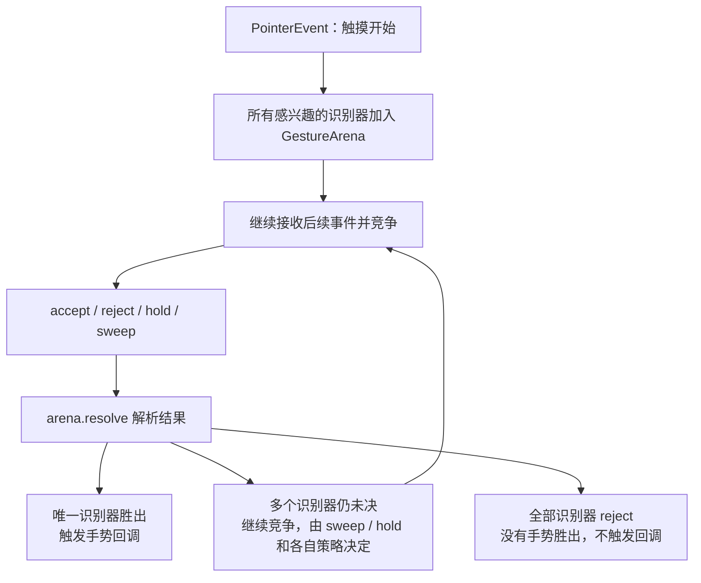

# Flutter 中的用户输入与事件响应机制

Flutter 拥有一套完整的用户输入处理系统，涵盖从底层触摸事件捕获到高级手势识别的整个过程。本文将详细解析这一机制的各个环节。

## 1. 事件处理架构概述

Flutter 的事件处理系统由以下几个核心部分组成：

1. **原始指针事件**：从设备传递到 Flutter 引擎的底层触摸事件
2. **命中测试**：确定哪些 RenderObject / HitTestTarget 接收到了触摸事件
3. **事件分发**：将事件传递给适当的小部件
4. **手势识别**：识别复杂的手势模式，如点击、拖动、缩放等
5. **状态更新**：根据用户交互更新应用程序状态

## 2. 原始指针事件（Pointer Events）

Flutter 中的原始指针事件是最底层的用户输入表示，主要有以下类型：

- **PointerDownEvent**：触摸开始时触发
- **PointerMoveEvent**：触摸移动时触发
- **PointerUpEvent**：触摸结束时触发
- **PointerCancelEvent**：触摸被系统取消时触发

这些事件包含以下关键信息：
- 触摸点的位置（相对于屏幕）
- 触摸时间戳
- 设备类型和按压力度(如果设备支持)
- 指针标识符(多点触控时区分不同手指)

## 3. 命中测试（Hit Testing）

命中测试是确定哪些 RenderObject / HitTestTarget 位于触摸点下方的过程。

### 命中测试流程

```text
设备产生原始触摸事件
↓
Flutter 引擎转成 PointerEvent
↓
GestureBinding 在 Down 事件时创建 HitTestResult 并发起 hitTestInView
↓
RenderObject 树自顶向下递归 hitTest
↓
命中的对象自底向上加入 HitTestResult
↓
返回命中测试结果
↓
PointerEvent 分发给命中的 RenderObject
```

### 命中测试的特点

1. **自上而下遍历**：从根 RenderObject 开始，递归地询问子节点是否包含触摸点
2. **添加到HitTestResult**：命中时先递归子节点，子节点把自己加入结果后，父节点再把自己加入——因此列表中**最深的节点在前、祖先在后**，`GestureBinding` 自身恒在最后
3. **顺序即分发顺序**：视觉最上层（最靠近手指）的目标排在 `HitTestResult.path` 最前面，因此事件分发时它最先收到事件

### 代码示例：RenderBox 中的命中测试

```dart
// rendering/box.dart（RenderBox，略去断言）
@override
bool hitTest(BoxHitTestResult result, { required Offset position }) {
  if (_size!.contains(position)) {
    // 先问子元素，再问自己；两者任一命中，才把自己加入结果
    if (hitTestChildren(result, position: position) || hitTestSelf(position)) {
      result.add(BoxHitTestEntry(this, position));  // 子元素已在更早的递归中先行加入
      return true;
    }
  }
  return false;
}
```

三个要点：

- **先子后己**：`hitTestChildren` 递归命中子节点时，子节点先把自己 `add` 进结果，返回到父节点后父节点才 `add` 自己，这决定了 path 中"叶子在前、根在后"的顺序
- **默认行为**：`hitTestSelf` 默认返回 `false`（纯容器自身不算命中），`RenderProxyBox` 的 `hitTestChildren` 只是转发给 child；`GestureDetector`/`Listener` 通过 `HitTestBehavior`（`deferToChild`/`opaque`/`translucent`）控制"空白区域是否可命中"
- **返回值语义**：返回 `true` 表示"这个点被我（或我的子树）消费了"，用于让外层容器（如 `Stack` 下的兄弟节点）停止继续命中

## 4. 事件分发（Event Dispatching）

命中测试确定了对象列表后，Flutter 开始分发事件。

### 事件分发流程

```text
Flutter 引擎发送 PointerDataPacket
↓
GestureBinding 转成 PointerEvent（Down 时执行命中测试并缓存结果）
↓
GestureBinding.dispatchEvent() 沿命中路径分发
↓
命中对象的 handleEvent 接收事件（叶子 → 根，Listener 在这里回调）
↓
路径末尾 GestureBinding.handleEvent → pointerRouter 路由给识别器
↓
Down 时竞技场 close，Up 时 sweep，竞争解析
```

### 事件分发的特点

> - **命中测试**：自上而下 (根节点→叶节点)
> - **事件处理**：自下而上 (叶节点→根节点)

1. **顺序**：按照 `HitTestResult.path` 的顺序分发——从最深的叶子节点到根节点，`GestureBinding` 自身被加在每个路径的末尾
2. **PointerRouter 在路径末尾触发**：`GestureBinding.handleEvent` 先调用 `pointerRouter.route(event)` 把事件交给已注册的识别器，随后对 `PointerDownEvent` 执行 `gestureArena.close()`、对 `PointerUpEvent` 执行 `gestureArena.sweep()`
3. **同指针复用结果**：Move / Up / Cancel 事件不再重新命中测试，而是复用 Down 时缓存的 `HitTestResult`——手指按在哪个组件上，后续事件就一直发给它

### PointerEvent 在框架内的路径

1. Engine 将平台触摸数据打包为 `PointerDataPacket`，经 `PlatformDispatcher.onPointerDataPacket` 回调交给框架
2. `GestureBinding._handlePointerDataPacket` 用 `PointerEventConverter` 把物理像素数据展开为逻辑像素坐标的 `PointerEvent`
3. `GestureBinding.handlePointerEvent` 在 Down 事件时执行命中测试（`hitTestInView` → 渲染树），并缓存结果供同指针的后续事件复用
4. `HitTestResult.path` 由渲染层 `hitTest` 生成
5. `GestureBinding.dispatchEvent` 沿 path 分发，`RenderObject.handleEvent`（如 `RenderPointerListener`）把事件交给 Listener 回调；手势识别器则在 Down 分发阶段经 `addPointer` 进入竞技场，后续事件改经 PointerRouter 投递

这套生命周期在 [GestureBinding 类文档](https://api.flutter.dev/flutter/gestures/GestureBinding-class.html)的 "Lifecycle of pointer events and the gesture arena" 一节有权威描述。

## 5. 手势识别（Gesture Recognition）

Flutter 使用 GestureDetector 和 GestureRecognizer 系列类来识别高级手势。

### 常见手势识别器

- **TapGestureRecognizer**：处理点击
- **LongPressGestureRecognizer**：处理长按
- **DragGestureRecognizer**：处理拖动
- **ScaleGestureRecognizer**：处理缩放
- **MultiTapGestureRecognizer**：处理多次点击

### 手势竞争与解析流程



### 手势竞争机制

1. **GestureArena**：当触摸开始时，所有感兴趣的识别器都加入"竞技场"
2. **竞争过程**：随着事件的进行，识别器可以:
   - 宣布自己识别了手势（accept）
   - 放弃识别（reject）
   - 继续观察（待定）
3. **解析策略**:
   - 如果只有一个识别器接受，它获胜
   - 如果多个识别器竞争，胜负取决于各自的 accept / reject、sweep / hold 以及 recognizer 的实现策略，不能简单概括为“更具体的那个获胜”
   - 如果所有识别器都拒绝，则不触发任何手势

### GestureDetector 代码示例

```dart
GestureDetector(
  onTap: () => print('单击'),
  onDoubleTap: () => print('双击'),
  onLongPress: () => print('长按'),
  onPanUpdate: (details) => print('拖动: ${details.delta}'),
  child: Container(
    width: 200,
    height: 200,
    color: Colors.blue,
    child: Center(child: Text('触摸区域')),
  ),
)
```

## 6. 低级事件拦截与监听

### Listener 组件

用于直接监听底层指针事件，不进行手势识别（更底层的原理与"不参与手势竞技场"的说明见 [Listener 官方文档](https://api.flutter.dev/flutter/widgets/Listener-class.html)）：

```dart
Listener(
  onPointerDown: (PointerDownEvent event) => print('按下: ${event.position}'),
  onPointerMove: (PointerMoveEvent event) => print('移动: ${event.position}'),
  onPointerUp: (PointerUpEvent event) => print('抬起: ${event.position}'),
  child: Container(
    width: 200,
    height: 200,
    color: Colors.green,
  ),
)
```

### AbsorbPointer 和 IgnorePointer

用于阻止事件传递到子树：

```dart
AbsorbPointer(
  absorbing: true,  // 阻止子树接收事件，但自身仍参与命中测试
  child: GestureDetector(
    onTap: () => print('永远不会触发'),
    child: Text('点击无效'),
  ),
)
```

## 7. 全流程综合示例

以下是一个从触摸到状态更新的完整流程示例：

```text
用户触摸屏幕
↓
Flutter 引擎转发原始触摸事件
↓
GestureBinding 执行命中测试
↓
事件分发给手势识别器
↓
多个识别器进入 GestureArena
↓
后续 Move / Up 事件持续参与竞争解析
↓
识别成功，如 onTap
↓
GestureDetector 触发回调
↓
StatefulWidget 调用 setState()
↓
Widget 树重建并更新 UI
```

## 8. 复杂手势处理

### 自定义手势识别器

对于复杂手势，可以创建自定义手势识别器：

```dart
class MyCustomGestureRecognizer extends OneSequenceGestureRecognizer {
  @override
  String get debugDescription => 'my custom gesture';
  
  VoidCallback? onCustomGesture;
  
  @override
  void handleEvent(PointerEvent event) {
    if (event is PointerDownEvent) {
      // 开始跟踪
    } else if (event is PointerMoveEvent) {
      // 判断是否符合特定模式
      if (/* 满足条件 */) {
        resolve(GestureDisposition.accepted);
        onCustomGesture?.call();
      }
    } else if (event is PointerUpEvent) {
      // 结束跟踪
      resolve(GestureDisposition.rejected);
    }
  }
  
  @override
  void addPointer(PointerDownEvent event) {
    // 注册跟踪：同时向 PointerRouter 注册路由，并把自己加入手势竞技场
    startTrackingPointer(event.pointer);
  }
}
```

### 手势冲突解决：RawGestureDetector

解决复杂的手势冲突场景：

```dart
RawGestureDetector(
  gestures: <Type, GestureRecognizerFactory>{
    TapGestureRecognizer: GestureRecognizerFactoryWithHandlers<TapGestureRecognizer>(
      () => TapGestureRecognizer(),
      (TapGestureRecognizer instance) {
        instance.onTap = () => print('点击');
      },
    ),
    MyCustomGestureRecognizer: GestureRecognizerFactoryWithHandlers<MyCustomGestureRecognizer>(
      () => MyCustomGestureRecognizer(),
      (MyCustomGestureRecognizer instance) {
        instance.onCustomGesture = () => print('自定义手势');
      },
    ),
  },
  child: Container(color: Colors.red, width: 200, height: 200),
)
```

## 9. 状态管理与事件响应

用户交互通常导致应用状态更新，Flutter 提供了多种状态管理方式：

### 局部状态管理

使用 StatefulWidget 和 setState()：

```dart
class CounterWidget extends StatefulWidget {
  @override
  _CounterWidgetState createState() => _CounterWidgetState();
}

class _CounterWidgetState extends State<CounterWidget> {
  int _counter = 0;
  
  void _incrementCounter() {
    setState(() {
      _counter++;
    });
  }
  
  @override
  Widget build(BuildContext context) {
    return GestureDetector(
      onTap: _incrementCounter,
      child: Container(
        color: Colors.blue,
        child: Center(
          child: Text('计数: $_counter', style: TextStyle(color: Colors.white)),
        ),
      ),
    );
  }
}
```

### 全局状态管理

使用 Provider、Riverpod、Bloc 等：

```dart
// 使用Provider的示例
class CounterModel extends ChangeNotifier {
  int _count = 0;
  int get count => _count;
  
  void increment() {
    _count++;
    notifyListeners();
  }
}

// 在Widget中使用
Consumer<CounterModel>(
  builder: (context, counter, child) {
    return GestureDetector(
      onTap: () => counter.increment(),
      child: Text('计数: ${counter.count}'),
    );
  },
)
```

## 10. 优化与最佳实践

### 性能优化

1. **避免频繁触发 setState()**：对于拖动等连续事件，考虑节流或批量更新
2. **使用 RepaintBoundary**：隔离频繁重绘的UI部分
3. **谨慎使用全局事件监听**：过多的全局监听器会影响性能

### 可访问性考虑

Flutter 的手势系统与可访问性服务(如屏幕阅读器)集成：

```dart
GestureDetector(
  onTap: () => print('点击'),
  child: Semantics(
    label: '增加计数按钮',
    hint: '点击以增加计数',
    child: Container(/* ... */),
  ),
)
```

### 测试事件处理

测试手势交互：

```dart
testWidgets('测试点击增加计数', (WidgetTester tester) async {
  await tester.pumpWidget(MyApp());
  
  // 查找计数显示
  final counterFinder = find.text('计数: 0');
  expect(counterFinder, findsOneWidget);
  
  // 模拟点击
  await tester.tap(find.byType(GestureDetector));
  await tester.pump();
  
  // 验证计数已增加
  expect(find.text('计数: 1'), findsOneWidget);
});
```

## 11. 高级场景：嵌套滚动和手势共存

### GestureDetector 嵌套

处理列表中的点击事件：

```dart
ListView.builder(
  itemBuilder: (context, index) {
    return GestureDetector(
      onTap: () => print('点击了项目 $index'),
      behavior: HitTestBehavior.opaque, // 确保透明区域也可点击
      child: ListTile(title: Text('项目 $index')),
    );
  },
)
```

### 滚动和拖动共存

允许在滚动视图内部进行拖动操作：

```dart
ScrollConfiguration(
  behavior: ScrollConfiguration.of(context).copyWith(
    dragDevices: {
      PointerDeviceKind.touch,
      PointerDeviceKind.mouse,
    },
  ),
  child: SingleChildScrollView(
    child: GestureDetector(
      onVerticalDragUpdate: (details) {
        // 处理垂直拖动
      },
      child: /* ... */,
    ),
  ),
)
```

## 总结

Flutter 的事件处理系统是一个多层次的架构，从底层指针事件到高级手势识别，再到状态管理和UI更新，形成了一个完整的闭环：

1. **原始事件**由操作系统提供，经过 Flutter 引擎转换为 PointerEvent
2. **命中测试**确定哪些对象位于触摸点下方
3. **事件分发**将事件传递给相关对象
4. **手势识别**解析复杂的触摸模式
5. **状态更新**根据用户交互修改应用状态
6. **UI重建**反映状态变化

通过理解这一完整流程，开发者可以创建出响应迅速、交互自然的 Flutter 应用程序。

---

## 补充一：GestureArena 源码级分析

Flutter 的手势竞技场（Gesture Arena）是解决多个手势识别器（GestureRecognizer）竞争同一触摸序列的核心机制。本节从源码层面深入剖析其数据结构、管理逻辑和竞争状态流转。

手势竞技场的裁决规则可概括为一句话（来自 [GestureArenaManager 官方文档](https://api.flutter.dev/flutter/gestures/GestureArenaManager-class.html)）：**The first member to accept or the last member to not reject wins**（第一个声明获胜的成员赢；若无人声明，则坚持到最后的成员赢）。官方对手势消歧的整体说明见 [flutter.dev/to/gesture-disambiguation](https://flutter.dev/to/gesture-disambiguation)。

### 12.1 核心数据结构

手势竞技场的实现位于 `package:flutter/gestures/arena.dart`，核心由以下几个类构成。

#### `_GestureArena` 类

每个 pointer（手指/触控笔）对应一个竞技场实例：

```dart
// gestures/arena.dart（简化，省略调试代码）
class _GestureArena {
  final List<GestureArenaMember> members = <GestureArenaMember>[];
  bool isOpen = true;
  bool isHeld = false;
  bool hasPendingSweep = false;

  /// 竞技场仍处于 open 状态时就声明获胜的成员。
  /// 竞技场 close 时若存在 eagerWinner，会立即按它裁决。
  GestureArenaMember? eagerWinner;
}
```

各字段含义：

| 字段 | 类型 | 说明 |
|------|------|------|
| `members` | `List<GestureArenaMember>` | 竞技场中的所有成员（GestureRecognizer），按注册顺序排列 |
| `eagerWinner` | `GestureArenaMember?` | 在竞技场关闭前就声明获胜的成员（如 `EagerGestureRecognizer`），关闭时会被优先裁决；是单个成员而不是列表 |
| `isOpen` | `bool` | 竞技场是否仍在接受新成员，`close()` 后变为 `false` |
| `isHeld` | `bool` | 竞技场是否被 hold 暂停清扫（`hold()` 设置为 `true`，`release()` 恢复） |
| `hasPendingSweep` | `bool` | hold 期间收到 sweep 请求时置 `true`，`release()` 时补执行 |

#### `GestureArenaMember` 接口

所有参与竞技的手势识别器都必须实现此接口：

```dart
// gestures/arena.dart
abstract class GestureArenaMember {
  /// 竞技场通知该成员获胜
  void acceptGesture(int pointer);

  /// 竞技场通知该成员落败
  void rejectGesture(int pointer);
}
```

- `acceptGesture`：获胜方被调用，识别器开始正式响应手势（如开始拖拽、触发点击回调）
- `rejectGesture`：落败方被调用，识别器必须清理自身状态、恢复 UI

#### `GestureArenaEntry` 类

注册成员时返回的句柄，用于后续操作竞技场：

```dart
// gestures/arena.dart
class GestureArenaEntry {
  GestureArenaEntry._(this._arena, this._pointer, this._member);

  final GestureArenaManager _arena;
  final int _pointer;
  final GestureArenaMember _member;

  /// 成员声明自己获胜（accepted）或认输（rejected）
  void resolve(GestureDisposition disposition) {
    _arena._resolve(_pointer, _member, disposition);
  }
}
```

注意句柄持有的是 `GestureArenaManager` 而不是 `_GestureArena` 本身——成员并不直接操作竞技场，而是把裁决请求转交管理器统一处理。

#### `GestureDisposition` 枚举

```dart
// gestures/arena.dart
enum GestureDisposition {
  /// 成员声明自己获胜
  accepted,
  /// 成员声明自己认输
  rejected,
}
```

只有 `accepted` / `rejected` 两种取向，没有"待定"——加入竞技场本身就是待定状态，识别器要么表态，要么保持沉默等待 `sweep` 或默认裁决。

### 12.2 手势竞技场管理器 `GestureArenaManager`

`GestureArenaManager` 是竞技场的全局管理者，作为 `GestureBinding` 单例的一个字段（`GestureBinding.instance.gestureArena`）存在，管理所有 pointer 的竞技场：

```dart
// gestures/arena.dart
class GestureArenaManager {
  /// 以 pointer ID 为 key，存储每个 pointer 对应的竞技场
  final Map<int, _GestureArena> _arenas = <int, _GestureArena>{};
}
```

#### 核心方法详解

##### `add(pointer, member)` — 注册成员

当 `PointerDownEvent` 到达时，命中测试命中的所有 `GestureRecognizer` 都会通过此方法注册到竞技场：

```dart
// gestures/arena.dart
GestureArenaEntry add(int pointer, GestureArenaMember member) {
  final _GestureArena state = _arenas.putIfAbsent(pointer, () => _GestureArena());
  state.add(member);
  return GestureArenaEntry._(this, pointer, member);
}
```

**流程**：
1. 根据 `pointer` ID 查找或创建 `_GestureArena`
2. 将 `member`（GestureRecognizer）追加到 `members` 列表末尾
3. 返回 `GestureArenaEntry` 句柄（注意捕获的是 manager `this`），后续 Recognizer 通过此句柄调用 `resolve()`

##### `close(pointer)` — 关闭竞技场

`PointerDownEvent` 处理完成后调用，不再接受新成员：

```dart
// gestures/arena.dart
void close(int pointer) {
  final _GestureArena? state = _arenas[pointer];
  if (state == null) return;
  state.isOpen = false;
  _tryToResolveArena(pointer, state);
}
```

关闭后，如果存在 `eagerWinner`（open 期间提前声明获胜的成员），或者只剩一个成员，会立即尝试解析竞技场。

##### `sweep(pointer)` — 强制裁决

`PointerUpEvent` 处理到路径末尾时调用，竞技场若仍无胜者就强制选出获胜者：

```dart
// gestures/arena.dart（简化，省略调试代码）
void sweep(int pointer) {
  final _GestureArena? state = _arenas[pointer];
  if (state == null) return;
  assert(!state.isOpen);

  if (state.isHeld) {
    state.hasPendingSweep = true;  // 被 hold：推迟到 release 再清扫
    return;
  }

  _arenas.remove(pointer);
  if (state.members.isNotEmpty) {
    // 第一个成员获胜，其余成员全部落败
    state.members.first.acceptGesture(pointer);
    for (var i = 1; i < state.members.length; i++) {
      state.members[i].rejectGesture(pointer);
    }
  }
}
```

`sweep` 的默认策略是让第一个注册的成员获胜（"先到先得"）——注意这里的"第一个"通常是命中路径中最深处的识别器。它适用于**所有识别器都没表态**的僵局（例如没有任何 `onTap` 回调之外的手势参与时，单击抬起后由 sweep 判 tap 获胜）。

一个常见误解是"`GestureDetector` 同时设置 `onTap` 和 `onDoubleTap` 时，单击能触发 `onTap` 是因为 sweep 先到先得"。实际并非如此：`DoubleTapGestureRecognizer` 在第一次抬起时会调用 `gestureArena.hold()` 暂停清扫（否则 `onTap` 就会在抬起瞬间触发、双击永远不可能赢）。要等到约 300ms（`kDoubleTapTimeout`）内没有第二根手指按下，DoubleTap 才自我 reject，竞技场只剩 TapGestureRecognizer，由"仅剩一个成员"的默认裁决判 tap 获胜——这也是单击 + 双击并存时 `onTap` 会延迟约 300ms 的原因。

##### `hold(pointer)` — 暂停竞技场

框架中真实的使用者是 `DoubleTapGestureRecognizer`：第一次抬起后它需要等待约 300ms 看有没有第二次点击，期间调用 `hold()` 阻止 sweep 立刻把胜利判给别的识别器：

```dart
// gestures/arena.dart
void hold(int pointer) {
  final _GestureArena? state = _arenas[pointer];
  if (state == null) return;
  state.isHeld = true;
}
```

##### `release(pointer)` — 恢复竞技场

```dart
// gestures/arena.dart
void release(int pointer) {
  final _GestureArena? state = _arenas[pointer];
  if (state == null) return;
  state.isHeld = false;

  // 如果有待处理的 sweep，现在执行
  if (state.hasPendingSweep) {
    sweep(pointer);
  }
}
```

#### `_tryToResolveArena` — 核心解析逻辑

这是竞技场内部最关键的方法，在 `close`、成员 reject 之后被调用，决定何时、如何解析竞争：

```dart
// gestures/arena.dart（简化，省略调试代码）
void _tryToResolveArena(int pointer, _GestureArena state) {
  assert(!state.isOpen);
  if (state.members.length == 1) {
    // 只剩一个成员 → 通过微任务让它默认获胜
    scheduleMicrotask(() => _resolveByDefault(pointer, state));
  } else if (state.members.isEmpty) {
    // 所有成员都退出了 → 直接移除竞技场，没有任何手势获胜
    _arenas.remove(pointer);
  } else if (state.eagerWinner != null) {
    // 存在提前声明获胜的成员 → 按它裁决
    _resolveInFavorOf(pointer, state, state.eagerWinner!);
  }
}

void _resolveByDefault(int pointer, _GestureArena state) {
  if (!_arenas.containsKey(pointer)) return;  // 竞技场可能已被别人解决
  _arenas.remove(pointer);
  state.members.first.acceptGesture(pointer);
}

void _resolveInFavorOf(int pointer, _GestureArena state, GestureArenaMember member) {
  _arenas.remove(pointer);
  for (final GestureArenaMember rejectedMember in state.members) {
    if (rejectedMember != member) {
      rejectedMember.rejectGesture(pointer);
    }
  }
  member.acceptGesture(pointer);
}
```

**注意**：只剩一个成员时并不会同步宣布获胜，`scheduleMicrotask` 会把它推迟到当前事件分发结束之后。这保证了 Down 事件的一次完整分发内，所有识别器都有机会表态。

#### `_resolve` — 成员声明胜负的入口

当 Recognizer 调用 `entry.resolve(GestureDisposition.accepted/rejected)` 时，最终执行：

```dart
// gestures/arena.dart（简化，省略调试代码）
void _resolve(int pointer, GestureArenaMember member, GestureDisposition disposition) {
  final _GestureArena? state = _arenas[pointer];
  if (state == null) return;  // 竞技场已被解决，重复 resolve 是安全的

  switch (disposition) {
    case GestureDisposition.accepted:
      if (state.isOpen) {
        // 竞技场还在接收成员：不会立刻获胜，先记为候选（eagerWinner）
        state.eagerWinner ??= member;
      } else {
        // 已关闭：立即按该成员裁决——其余成员全部 reject
        _resolveInFavorOf(pointer, state, member);
      }
    case GestureDisposition.rejected:
      state.members.remove(member);
      member.rejectGesture(pointer);
      if (!state.isOpen) {
        _tryToResolveArena(pointer, state);  // 可能因此只剩一个成员
      }
  }
}
```

两个容易忽略的语义：

- **open 状态下的 accept 不会立即生效**：它只是把成员记为 `eagerWinner`，等 `close()` 时才由 `_tryToResolveArena` 裁决。这是给"急切"识别器（如 `EagerGestureRecognizer`，在 `addPointer` 后立刻 resolve accepted）预留的通道
- **reject 永远不会触发 sweep**：成员陆续退出只可能走向"只剩一个 → 默认获胜"或"全部退出 → 竞技场移除、无手势触发"两条路

### 12.3 完整的手势竞争状态流转（源码级）

结合上述源码，一个完整的手势竞争生命周期如下：

```text
1. PointerDownEvent 到达
   ↓
2. GestureBinding.handlePointerEvent()
   → 命中测试得到 HitTestResult
   → dispatchEvent 遍历 path，调用每个 HitTestTarget 的 handleEvent()
   ↓
3. 命中路径上的 Listener（RawGestureDetector 内部就是一个 Listener）
   回调 recognizer.addPointer(event)
   → addPointer 检查 isPointerAllowed 后进入 addAllowedPointer
   → startTrackingPointer：向 PointerRouter 注册路由，
     同时通过 GestureBinding.instance.gestureArena.add(pointer, this)
     将自身注册到竞技场
   ↓
4. Down 事件分发到 path 末尾的 GestureBinding.handleEvent
   → gestureArena.close(pointer)
   → 若此时只剩一个成员，微任务 _resolveByDefault 让它直接获胜
   ↓
5. 后续 Move 事件经 PointerRouter 投递给各识别器的 handleEvent
   某个识别器判定条件满足（如位移超过 kTouchSlop）
   → resolve(GestureDisposition.accepted)
   ↓
6. GestureArenaManager._resolve() 执行（竞技场已关闭）：
   → _resolveInFavorOf：获胜成员 acceptGesture(pointer)
   → 其余所有成员 rejectGesture(pointer)
   → 竞技场从 _arenas 移除
   ↓
7. 获胜的识别器执行手势回调（onDragStart、onTap 等）
   落败的识别器清理内部状态
   ↑ PointerUpEvent 到达 path 末尾时 gestureArena.sweep：
     若仍无人表态，第一个成员被判获胜
```

**特殊情况处理**：

- **所有识别器都 reject**：最后一个成员退出后竞技场被直接移除，**不会触发任何手势**（reject 不会引发 sweep）
- **竞技场被 hold**：`DoubleTapGestureRecognizer` 等待第二次点击时 hold 竞技场，sweep 被记为 pending，直到 `release` 后才补执行
- **竞技场关闭时只剩一个成员**：通过微任务 `_resolveByDefault` 直接获胜（常见于单一手势场景，这也是"只有 onTap 的按钮在按下后、抬起前就敲定手势归属"的原因）
- **竞技场仍 open 时就 accept**：不会立即获胜，先记为 `eagerWinner`，`close()` 时优先裁决

### 12.4 `DragGestureRecognizer` 的具体实现

`DragGestureRecognizer`（继承自 `OneSequenceGestureRecognizer`）是拖拽手势的核心实现，位于 `package:flutter/src/gestures/monodrag.dart`。它与其子类 `VerticalDragGestureRecognizer`、`HorizontalDragGestureRecognizer`、`PanGestureRecognizer` 都定义在这个文件里（旧版源码中的 `vertical_drag.dart`、`horizontal_drag.dart` 已合并删除，早期教程引用的 `drag.dart` 现在只剩 `Drag` 抽象类）。

#### 注册阶段

`PointerDownEvent` 分发到识别器时，先经过基类的过滤，再进入 `DragGestureRecognizer` 的初始化：

```dart
// gestures/monodrag.dart（简化）
@override
void addAllowedPointer(PointerDownEvent event) {
  super.addAllowedPointer(event);  // 1. 向 PointerRouter 注册 + 加入竞技场
  if (_state == _DragState.ready) {
    _initialButtons = event.buttons;  // 2. 记录初始按键状态，中途换键则放弃手势
  }
  _addPointer(event);  // 3. 初始化状态机
}

void _addPointer(PointerEvent event) {
  _velocityTrackers[event.pointer] = velocityTrackerBuilder(event);
  switch (_state) {
    case _DragState.ready:
      _state = _DragState.possible;
      _initialPosition = OffsetPair(global: event.position, local: event.localPosition);
      _pendingDragOffset = OffsetPair.zero;
      _globalDistanceMoved = 0.0;
      _checkDown();  // 触发 onDown 回调（此时还没赢得竞技场）
    // ...
  }
}
```

注意 `onDown` 在手势归属确定**之前**就会触发——它只是"手指按下了"的通知。

#### 跟踪移动事件

```dart
// gestures/monodrag.dart（简化）
@override
void handleEvent(PointerEvent event) {
  // 中途换了按键（如从左键切到右键拖拽）→ 放弃
  if (event is PointerMoveEvent && event.buttons != _initialButtons) {
    _giveUpPointer(event.pointer);
    return;
  }
  if (event is PointerMoveEvent || event is PointerPanZoomUpdateEvent) {
    switch (_state) {
      case _DragState.ready || _DragState.possible:
        // 仍在竞争：累积位移，判断是否达到拖拽阈值
        _pendingDragOffset += OffsetPair(local: event.localDelta, global: event.delta);
        _globalDistanceMoved += /* 沿主轴方向的带符号位移 */;
        if (hasSufficientGlobalDistanceToAccept(event.kind, gestureSettings?.touchSlop)) {
          _hasDragThresholdBeenMet = true;
          resolve(GestureDisposition.accepted);  // 达到阈值 → 声明获胜
        }
      case _DragState.accepted:
        // 已获胜：直接处理拖拽更新
        _checkUpdate(/* DragUpdateDetails(...) */);
    }
  }
  if (event case PointerUpEvent() || PointerCancelEvent() || PointerPanZoomEndEvent()) {
    _giveUpPointer(event.pointer);  // up 时若从未被 accept，会 resolve(rejected)
  }
}
```

#### `hasSufficientGlobalDistanceToAccept()` — 判定逻辑

基类把它声明为抽象方法，由各子类按自己的"主轴"实现：

```dart
// gestures/monodrag.dart（VerticalDragGestureRecognizer）
@override
bool hasSufficientGlobalDistanceToAccept(
  PointerDeviceKind pointerDeviceKind,
  double? deviceTouchSlop,
) {
  return globalDistanceMoved.abs() > computeHitSlop(pointerDeviceKind, gestureSettings);
}
```

`PanGestureRecognizer` 用的是更大的 `computePanSlop`（`kPanSlop = kTouchSlop * 2 = 36.0`），因为平移手势一旦认错方向代价更高。

#### `computeHitSlop()` — 按设备类型取阈值

```dart
// gestures/events.dart
double computeHitSlop(PointerDeviceKind kind, DeviceGestureSettings? settings) {
  switch (kind) {
    case PointerDeviceKind.mouse:
      return kPrecisePointerHitSlop;  // 1.0
    case PointerDeviceKind.stylus:
    case PointerDeviceKind.invertedStylus:
    case PointerDeviceKind.unknown:
    case PointerDeviceKind.touch:
    case PointerDeviceKind.trackpad:
      return settings?.touchSlop ?? kTouchSlop;  // 18.0，可被系统设置覆盖
  }
}
```

`DeviceGestureSettings` 通常来自 `MediaQuery`（Android 上会把系统触摸阈值的物理像素值换算成逻辑像素），因此同一份代码在真机上的 `touchSlop` 未必恰好是 18.0。

#### `acceptGesture()` 与 `rejectGesture()`

```dart
// gestures/monodrag.dart（简化）
@override
void acceptGesture(int pointer) {
  _acceptedActivePointers.add(pointer);
  if (!onlyAcceptDragOnThreshold || _hasDragThresholdBeenMet) {
    _checkDrag(pointer);  // 正式开始拖拽：置 _state = accepted，触发 onStart
  }
}

@override
void rejectGesture(int pointer) {
  _giveUpPointer(pointer);  // 停止跟踪；若曾触发 onDown 则补发 onCancel
}
```

`_checkDrag` 内部会按 `dragStartBehavior` 决定起始位置（详见 13.7 方案 4），构造 `DragStartDetails` 触发 `onStart`，并在最后 `resolve(GestureDisposition.accepted)` 把该指针在手势团队中的其余入场一并敲定。

### 12.5 代码示例：自定义 GestureRecognizer 观察竞技场状态变化

以下示例通过自定义 Recognizer 打印竞技场的完整状态变化，可用于调试手势竞争：

```dart
import 'package:flutter/material.dart';
import 'package:flutter/gestures.dart';

/// 自定义手势识别器，打印竞技场状态
class DebugGestureArenaObserver extends OneSequenceGestureRecognizer {
  final String tag;
  VoidCallback? onWin;
  VoidCallback? onLose;

  DebugGestureArenaObserver({required this.tag});

  @override
  String get debugDescription => 'DebugObserver($tag)';

  @override
  void addPointer(PointerDownEvent event) {
    debugPrint('[$tag] addPointer → 加入竞技场 (pointer=${event.pointer})');
    startTrackingPointer(event.pointer);
  }

  @override
  void handleEvent(PointerEvent event) {
    if (event is PointerMoveEvent) {
      debugPrint('[$tag] handleEvent → PointerMove @ ${event.position}');
    } else if (event is PointerUpEvent) {
      debugPrint('[$tag] handleEvent → PointerUp');
      stopTrackingPointer(event.pointer);
    }
  }

  @override
  void acceptGesture(int pointer) {
    debugPrint('[$tag] ★ acceptGesture → 获胜!');
    onWin?.call();
  }

  @override
  void rejectGesture(int pointer) {
    debugPrint('[$tag] ✕ rejectGesture → 落败');
    onLose?.call();
    stopTrackingPointer(pointer);
  }

  @override
  void dispose() {
    super.dispose();
  }
}

/// 演示页面：用自定义 Recognizer 观察竞技场裁决过程
class GestureArenaDebugPage extends StatelessWidget {
  @override
  Widget build(BuildContext context) {
    return Scaffold(
      appBar: AppBar(title: const Text('GestureArena 竞技场调试')),
      body: Center(
        child: RawGestureDetector(
          gestures: <Type, GestureRecognizerFactory>{
            // 第一个识别器：检测水平移动获胜
            DebugGestureArenaObserver: GestureRecognizerFactoryWithHandlers<
                DebugGestureArenaObserver>(
              () => DebugGestureArenaObserver(tag: '水平拖拽'),
              (DebugGestureArenaObserver instance) {
                instance.onWin = () => debugPrint('→ 水平拖拽获胜，开始处理');
                instance.onLose = () => debugPrint('→ 水平拖拽落败，清理状态');
              },
            ),
          },
          child: Container(
            width: 300,
            height: 300,
            color: Colors.blue.withOpacity(0.3),
            alignment: Alignment.center,
            child: const Text('在此区域操作触摸', style: TextStyle(fontSize: 18)),
          ),
        ),
      ),
    );
  }
}
```

运行后控制台会输出类似：

```text
[水平拖拽] addPointer → 加入竞技场 (pointer=1)
[水平拖拽] ★ acceptGesture → 获胜!        ← Down 分发结束、竞技场 close 后由微任务裁决
→ 水平拖拽获胜，开始处理
[水平拖拽] handleEvent → PointerMove @ Offset(12.0, 3.0)
[水平拖拽] handleEvent → PointerUp
```

注意 `acceptGesture` 出现在 **PointerMove 之前**：竞技场里只有这一个成员，`close()` 触发 `_tryToResolveArena` 后 `scheduleMicrotask(_resolveByDefault)` 在 Down 事件的处理尾声就宣布了它获胜，不必等到抬起。

---

## 补充二：手势与 Scrollable 的嵌套竞争

当页面中出现嵌套的 ScrollView（如外层水平滚动 + 内层垂直滚动）时，手势竞争变得复杂。本节从源码层面分析 Scrollable 的手势识别器组合、嵌套竞争的解决机制以及常见问题的解决方案。

### 13.1 Scrollable 的手势识别器组合

`Scrollable` 是 Flutter 中所有可滚动组件（`ListView`、`GridView`、`SingleChildScrollView` 等）的底层实现。它内部通过一个 `RawGestureDetector` 注册手势识别器（`RawGestureDetector` 与 `GestureDetector` 都定义在 `package:flutter/widgets/gesture_detector.dart`）。

#### 源码位置

`Scrollable` 的核心实现在 `package:flutter/widgets/scrollable.dart`。

#### 手势识别器的创建

```dart
// widgets/scrollable.dart（简化，取 Axis.vertical 分支）
Map<Type, GestureRecognizerFactory> _gestureRecognizers =
    <Type, GestureRecognizerFactory>{
  VerticalDragGestureRecognizer:
      GestureRecognizerFactoryWithHandlers<VerticalDragGestureRecognizer>(
    () => VerticalDragGestureRecognizer(supportedDevices: _configuration.dragDevices),
    (VerticalDragGestureRecognizer instance) {
      instance
        ..onDown = _handleDragDown
        ..onStart = _handleDragStart
        ..onUpdate = _handleDragUpdate
        ..onEnd = _handleDragEnd
        ..onCancel = _handleDragCancel
        ..minFlingDistance = _physics?.minFlingDistance
        ..minFlingVelocity = _physics?.minFlingVelocity
        ..maxFlingVelocity = _physics?.maxFlingVelocity
        ..velocityTrackerBuilder = _configuration.velocityTrackerBuilder(context)
        ..dragStartBehavior = widget.dragStartBehavior
        ..multitouchDragStrategy = _configuration.getMultitouchDragStrategy(context)
        ..gestureSettings = _mediaQueryGestureSettings
        ..supportedDevices = _configuration.dragDevices;
    },
  ),
};
// Axis.horizontal 分支换成 HorizontalDragGestureRecognizer，配置方式相同
```

`VerticalDragGestureRecognizer` 和 `HorizontalDragGestureRecognizer` 都继承自 `DragGestureRecognizer`，区别在于：
- `VerticalDragGestureRecognizer` 的 `hasSufficientGlobalDistanceToAccept` 只看垂直方向位移
- `HorizontalDragGestureRecognizer` 只看水平方向位移

#### `VerticalDragGestureRecognizer` 的方向判定

```dart
// gestures/monodrag.dart
@override
bool hasSufficientGlobalDistanceToAccept(
  PointerDeviceKind pointerDeviceKind,
  double? deviceTouchSlop,
) {
  return globalDistanceMoved.abs() > computeHitSlop(pointerDeviceKind, gestureSettings);
}

@override
Offset _getDeltaForDetails(Offset delta) {
  // 只取垂直方向的 delta
  return Offset(0.0, delta.dy);
}
```

`HorizontalDragGestureRecognizer` 则返回 `Offset(delta.dx, 0.0)`。这种方向过滤确保了垂直 / 水平识别器各自只在自己关心方向上累积位移。

### 13.2 嵌套 ScrollView 的竞争场景

考虑以下经典布局：

```dart
// 外层水平滚动
ListView(
  scrollDirection: Axis.horizontal,
  children: [
    // 内层垂直滚动
    ListView(
      scrollDirection: Axis.vertical,
      children: List.generate(20, (i) => ListTile(title: Text('Item $i'))),
    ),
    // 第二页
    Container(width: 200, color: Colors.red),
  ],
)
```

**竞争关系**：
1. 手指在内层 `ListView` 上按下（`PointerDownEvent`）
2. 命中测试会同时命中内层和外层的 `Scrollable`
3. 内层注册 `VerticalDragGestureRecognizer`，外层注册 `HorizontalDragGestureRecognizer`
4. 两个 Recognizer 都加入同一个竞技场（同一个 pointer ID）
5. 手指移动时，两个 Recognizer 各自累积自己方向的位移

### 13.3 解决顺序（源码级分析）

#### 阶段 1：注册与跟踪

```text
PointerDownEvent → hitTest
↓
内层 VerticalDragGestureRecognizer.addPointer() → 注册到竞技场
外层 HorizontalDragGestureRecognizer.addPointer() → 注册到竞技场
↓
竞技场 members: [VerticalDrag, HorizontalDrag]
```

#### 阶段 2：累积位移

手指移动时，两个识别器共用 `DragGestureRecognizer.handleEvent` 这一份逻辑，方向过滤由子类的 `_getDeltaForDetails` / `_getPrimaryValueFromOffset` 钩子完成（下面的代码是示意，省略了坐标系换算）：

```dart
// gestures/monodrag.dart（示意）
// VerticalDrag 参与计算的只有 dy（_getPrimaryValueFromOffset 返回 delta.dy）
_globalDistanceMoved += 沿主轴的带符号位移;
if (hasSufficientGlobalDistanceToAccept(event.kind, gestureSettings?.touchSlop)) {
  // 主轴位移的绝对值超过 18px → 声明获胜
  resolve(GestureDisposition.accepted);
}

// HorizontalDrag 参与计算的只有 dx，逻辑同上
```

注意 `_globalDistanceMoved` 是**带符号**累积（往回滑动会抵消），判定时取 `abs()`，因此"来回抖动 9px + 9px"不会误触发拖拽。

#### 阶段 3：竞技场解析

假设用户向右上方 45° 移动手指：

```text
事件序列（简化）：
Move Δ(10, 0)  → HorizontalDrag.globalDistanceMoved = 10, Vertical = 0
Move Δ(0, 10)  → HorizontalDrag.globalDistanceMoved = 10, Vertical = 10
Move Δ(10, 0)  → HorizontalDrag.globalDistanceMoved = 20 > 18 → ACCEPTED!

竞技场解析：
→ HorizontalDrag.acceptGesture() → 开始水平滚动
→ VerticalDrag.rejectGesture()   → 清理，停止跟踪
```

如果用户接近垂直方向移动：

```text
事件序列：
Move Δ(0, 10)  → Horizontal = 0, Vertical = 10
Move Δ(0, 10)  → Horizontal = 0, Vertical = 20 > 18 → Vertical ACCEPTED!
→ VerticalDrag.acceptGesture()   → 开始垂直滚动
→ HorizontalDrag.rejectGesture() → 清理
```

谁先在自身方向累积超过 `kTouchSlop`（18px）的位移，谁就获胜。45° 移动时，哪个方向先到达阈值取决于事件分发的时序，通常不可预测。

### 13.4 `Scrollable.of(context).position.drag()` 的调用时机

当 `DragGestureRecognizer` 获胜后，`onStart` 回调触发 `Scrollable._handleDragStart`，由 `ScrollPosition` 接管滚动驱动：

```dart
// widgets/scrollable.dart
void _handleDragStart(DragStartDetails details) {
  // 竞技场获胜后调用
  assert(_drag == null);
  _drag = position.drag(details, _disposeDrag);
  // onDown 阶段可能持有一个 ScrollHoldController，此时让位给真正的拖拽
  if (_hold != null) {
    _disposeHold();
  }
}
```

`ScrollPosition.drag()` 返回一个实现了 `Drag` 接口的 `ScrollDragController`，并让 `ScrollPosition` 进入拖拽活动状态：

```dart
// widgets/scroll_position_with_single_context.dart（简化）
@override
Drag drag(DragStartDetails details, VoidCallback dragCancelCallback) {
  final drag = ScrollDragController(
    delegate: this,
    details: details,
    onDragCanceled: dragCancelCallback,
    carriedVelocity: physics.carriedMomentum(_heldPreviousVelocity),
    motionStartDistanceThreshold: physics.dragStartDistanceMotionThreshold,
  );
  beginActivity(DragScrollActivity(this, drag));
  return drag;
}
```

此后识别器每次 `onUpdate` 都会调用 `_drag.update(details)`，把位移交由 `DragScrollActivity` 应用到滚动偏移上；`onEnd` 触发 `_drag.end(details)`，进入惯性（fling）或静止。

### 13.5 `hasSufficientGlobalDistanceToAccept()` 的判定逻辑

```dart
// gestures/monodrag.dart（VerticalDragGestureRecognizer）
@override
bool hasSufficientGlobalDistanceToAccept(
  PointerDeviceKind pointerDeviceKind,
  double? deviceTouchSlop,
) {
  return globalDistanceMoved.abs() > computeHitSlop(pointerDeviceKind, gestureSettings);
}
```

判定条件只有一个：**沿主轴累积的位移绝对值超过对应设备类型的 hitSlop**。

按钮状态的一致性检查放在 `handleEvent` 的开头，而不在这里：

```dart
// gestures/monodrag.dart
@override
void handleEvent(PointerEvent event) {
  // ...
  // 中途切换按键（如按住左键拖到一半按下右键）→ 直接放弃该指针
  if (event is PointerMoveEvent && event.buttons != _initialButtons) {
    _giveUpPointer(event.pointer);
    return;
  }
  // ...
}
```

位移累积则在 `possible` 状态的分支中：

```dart
// gestures/monodrag.dart（简化）
case _DragState.ready || _DragState.possible:
  _pendingDragOffset += OffsetPair(local: event.localDelta, global: event.delta);
  _globalDistanceMoved += 沿主轴的带符号位移;
  if (hasSufficientGlobalDistanceToAccept(event.kind, gestureSettings?.touchSlop)) {
    _hasDragThresholdBeenMet = true;
    resolve(GestureDisposition.accepted);
  }
```

### 13.6 `PointerDeviceKind` 对手势判定的影响

不同输入设备的 `hitSlop` 差异显著（常量定义在 `package:flutter/src/gestures/constants.dart`）：

```dart
// gestures/constants.dart
const double kTouchSlop = 18.0;               // 触摸屏
const double kPrecisePointerHitSlop = 1.0;    // 鼠标
const double kPanSlop = kTouchSlop * 2.0;     // 36.0，PanGestureRecognizer 用
```

`computeHitSlop`（`gestures/events.dart`）的实际取值：

| 设备 | `hitSlop` | 说明 |
|------|-----------|------|
| `touch`（手指） | `settings?.touchSlop ?? 18.0` | Android 真机会用系统触摸阈值（经 `MediaQuery` 注入 `DeviceGestureSettings`）覆盖默认值 |
| `mouse` | 1.0（`kPrecisePointerHitSlop`） | 精确指针，极小位移即可触发 |
| `stylus` / `invertedStylus` | `settings?.touchSlop ?? 18.0` | 与触摸相同，没有单独的"触控笔容忍度" |
| `trackpad` | `settings?.touchSlop ?? 18.0` | 同触摸 |
| `unknown` | `settings?.touchSlop ?? 18.0` | 兜底同触摸 |

这意味着在桌面端（鼠标），嵌套 ScrollView 的竞争几乎瞬间完成（1px 就够），而移动端需要更明确的滑动意图。另外 `PanGestureRecognizer`（对应 `onPanUpdate`）用的是双倍阈值 `kPanSlop`（36.0），因此"平移"比"定向拖拽"更难触发。

### 13.7 常见嵌套竞争问题与解决方案

#### 方案 1：`NeverScrollableScrollPhysics` 禁止某个方向

最简单的方式：直接禁用某个方向的滚动，消除竞争。

```dart
// 外层水平 ScrollView，内层垂直 ScrollView
ListView(
  scrollDirection: Axis.horizontal,
  children: [
    ListView(
      // 禁止垂直滚动 → 竞技场中只有 HorizontalDrag
      physics: const NeverScrollableScrollPhysics(),
      children: List.generate(20, (i) => ListTile(title: Text('Item $i'))),
    ),
  ],
)
```

**适用场景**：内层内容不需要滚动，或由其他方式控制。

#### 方案 2：`GestureDetector` + `Listener` 组合处理复杂手势

当需要在滚动层之上叠加自定义手势时：

```dart
GestureDetector(
  // 自定义手势，参与竞技场竞争
  onVerticalDragStart: (_) => debugPrint('自定义垂直拖拽开始'),
  onVerticalDragUpdate: (details) => debugPrint('自定义拖拽: ${details.delta}'),
  onVerticalDragEnd: (_) => debugPrint('自定义垂直拖拽结束'),
  child: Listener(
    // Listener 不参与竞技场，直接接收底层事件
    onPointerDown: (event) => debugPrint('原始按下: ${event.position}'),
    onPointerMove: (event) => debugPrint('原始移动: ${event.position}'),
    child: Container(
      height: 300,
      color: Colors.orange.withOpacity(0.3),
      child: const Center(child: Text('手势叠加区域')),
    ),
  ),
)
```

**注意**：`Listener` 的 `handleEvent` 在 `GestureRecognizer` 之前被调用，但它不会参与竞技场竞争。

#### 方案 3：`RawGestureDetector` 手动控制竞争

当需要精细控制哪个手势获胜时，可以用 `RawGestureDetector` 配合自定义 Recognizer：

```dart
/// 自定义识别器：优先检测特定方向
class PriorityVerticalDragRecognizer extends VerticalDragGestureRecognizer {
  /// 如果在指定时间内检测到垂直移动，立即声明获胜
  final Duration winDelay;

  PriorityVerticalDragRecognizer({this.winDelay = const Duration(milliseconds: 50)});

  @override
  void handleEvent(PointerEvent event) {
    if (event is PointerMoveEvent) {
      // 如果垂直位移明显大于水平位移，立即获胜
      if (event.delta.dy.abs() > event.delta.dx.abs() * 2) {
        resolve(GestureDisposition.accepted);
      }
    }
    super.handleEvent(event);
  }
}

// 使用
RawGestureDetector(
  gestures: <Type, GestureRecognizerFactory>{
    PriorityVerticalDragRecognizer:
        GestureRecognizerFactoryWithHandlers<PriorityVerticalDragRecognizer>(
      () => PriorityVerticalDragRecognizer(),
      (PriorityVerticalDragRecognizer instance) {
        instance.onUpdate = (details) => debugPrint('优先垂直拖拽: ${details.delta}');
      },
    ),
  },
  child: Container(height: 200, color: Colors.purple.withOpacity(0.3)),
)
```

#### 方案 4：`DragStartBehavior` 的影响

`DragStartBehavior` 决定 `onStart` 回调携带的"拖拽起始位置"以哪个时刻为准（枚举定义见 [DragStartBehavior 文档](https://api.flutter.dev/flutter/gestures/DragStartBehavior.html)）：

```dart
// gestures/recognizer.dart
enum DragStartBehavior {
  /// 起始位置 = 第一个 down 事件（手指按下）的位置
  down,

  /// 起始位置 = 识别器在竞技场中获胜时刻的位置
  start,
}

// widgets/scrollable.dart（Scrollable 构造参数，默认 start）
this.dragStartBehavior = DragStartBehavior.start,
```

```dart
// 在 Scrollable 中配置
ListView(
  dragStartBehavior: DragStartBehavior.down, // 默认是 start
  children: [...],
)
```

- `start`（默认）：拖拽起点 = 手势**被判定获胜**（位移越过 `kTouchSlop`）那一刻的位置。按下到获胜之间的位移不补偿——滚动内容不会突然跳动，但手指已经划过的那段距离"消失"了
- `down`：拖拽起点 = 手指**按下**时的位置。获胜瞬间框架会把按下以来累积的位移一次性补偿（`_checkDrag` 中补发一次 `onUpdate`），滚动内容立刻跟手

在嵌套场景中，两种设置**不会改变竞争结果**（谁获胜由 `kTouchSlop` 决定），只影响获胜后第一次回调的位置基准与手感：`down` 更"跟手"，`start` 更"稳"。

### 13.8 代码示例：双层嵌套 ScrollView 的手势竞争验证

以下是一个完整的可运行示例，展示嵌套 ScrollView 的手势竞争，并打印详细的竞技场状态：

```dart
import 'package:flutter/material.dart';

/// 可观察的 DragGestureRecognizer，用于打印竞争状态
class ObservableDragRecognizer extends VerticalDragGestureRecognizer {
  final String tag;

  ObservableDragRecognizer({required this.tag});

  @override
  void acceptGesture(int pointer) {
    debugPrint('[$tag] ★ acceptGesture → 开始拖拽');
    super.acceptGesture(pointer);
  }

  @override
  void rejectGesture(int pointer) {
    debugPrint('[$tag] ✕ rejectGesture → 落败');
    super.rejectGesture(pointer);
  }
}

/// 嵌套 ScrollView 手势竞争验证页面
class NestedScrollViewDebugPage extends StatelessWidget {
  const NestedScrollViewDebugPage({super.key});

  @override
  Widget build(BuildContext context) {
    return Scaffold(
      appBar: AppBar(title: const Text('嵌套 ScrollView 手势竞争')),
      body: Column(
        crossAxisAlignment: CrossAxisAlignment.start,
        children: [
          const Padding(
            padding: EdgeInsets.all(16),
            child: Text(
              '内层为垂直 ListView（带可观察 Recognizer），'
              '外层为水平 ListView。\n'
              '尝试在列表区域斜向滑动，观察控制台输出。',
              style: TextStyle(fontSize: 14),
            ),
          ),
          const Divider(),
          Expanded(
            child: ListView.builder(
              scrollDirection: Axis.horizontal,
              itemCount: 3,
              itemBuilder: (context, pageIndex) {
                return SizedBox(
                  width: 300,
                  child: RawGestureDetector(
                    // 用自定义可观察 Recognizer 替换默认的
                    gestures: <Type, GestureRecognizerFactory>{
                      ObservableDragRecognizer:
                          GestureRecognizerFactoryWithHandlers<ObservableDragRecognizer>(
                        () => ObservableDragRecognizer(tag: '内层垂直(${pageIndex}列)'),
                        (ObservableDragRecognizer instance) {
                          instance.onUpdate = (details) {
                            debugPrint('[内层垂直] dragUpdate: Δ${details.delta}');
                          };
                          instance.onEnd = (details) {
                            debugPrint('[内层垂直] dragEnd');
                          };
                        },
                      ),
                    },
                    child: ListView.builder(
                      // 注意：RawGestureDetector 接管了手势，内层 ListView 不会滚动
                      // 这正是竞争的本质：谁赢了谁来滚动
                      itemCount: 20,
                      itemBuilder: (context, index) {
                        return ListTile(
                          title: Text('第 ${pageIndex + 1} 列 - Item $index'),
                          tileColor: index.isEven
                              ? Colors.blue.withOpacity(0.1)
                              : Colors.transparent,
                        );
                      },
                    ),
                  ),
                );
              },
            ),
          ),
        ],
      ),
    );
  }
}

void main() {
  runApp(const MaterialApp(home: NestedScrollViewDebugPage()));
}
```

### 13.9 代码示例：自定义手势识别器解决复杂嵌套竞争

以下是一个完整的可运行示例，通过自定义 `GestureRecognizer` 解决水平 + 垂直嵌套滚动同时保留两个方向能力的需求：

```dart
import 'package:flutter/material.dart';
import 'package:flutter/gestures.dart';

/// 双向拖拽识别器：根据滑动方向动态选择竞争策略
///
/// 在竞技场中等待一定时间或位移，然后根据实际方向决定获胜者。
class DirectionalDragRecognizer extends OneSequenceGestureRecognizer {
  final double directionalThreshold;
  final void Function(DragStartDetails)? onHorizontalDragStart;
  final void Function(DragUpdateDetails)? onHorizontalDragUpdate;
  final void Function(DragEndDetails)? onHorizontalDragEnd;
  final void Function(DragStartDetails)? onVerticalDragStart;
  final void Function(DragUpdateDetails)? onVerticalDragUpdate;
  final void Function(DragEndDetails)? onVerticalDragEnd;

  Offset? _initialPosition;
  double _totalDx = 0.0;
  double _totalDy = 0.0;
  bool _resolved = false;

  DirectionalDragRecognizer({
    this.directionalThreshold = 10.0,
    this.onHorizontalDragStart,
    this.onHorizontalDragUpdate,
    this.onHorizontalDragEnd,
    this.onVerticalDragStart,
    this.onVerticalDragUpdate,
    this.onVerticalDragEnd,
  });

  @override
  String get debugDescription => 'DirectionalDragRecognizer';

  @override
  void addPointer(PointerDownEvent event) {
    _initialPosition = event.position;
    _totalDx = 0.0;
    _totalDy = 0.0;
    _resolved = false;
    startTrackingPointer(event.pointer);
  }

  @override
  void handleEvent(PointerEvent event) {
    if (_initialPosition == null) return;

    if (event is PointerMoveEvent && !_resolved) {
      final delta = event.delta;
      _totalDx += delta.dx.abs();
      _totalDy += delta.dy.abs();

      // 检查是否达到方向判定阈值
      if (_totalDx > directionalThreshold || _totalDy > directionalThreshold) {
        _resolved = true;

        if (_totalDx > _totalDy) {
          // 水平方向获胜
          debugPrint('[DirectionalDrag] 水平方向获胜 '
              '(dx=$_totalDx, dy=$_totalDy)');
          onHorizontalDragStart?.call(DragStartDetails(
            globalPosition: event.position,
            localPosition: event.localPosition,
          ));
        } else {
          // 垂直方向获胜
          debugPrint('[DirectionalDrag] 垂直方向获胜 '
              '(dx=$_totalDx, dy=$_totalDy)');
          onVerticalDragStart?.call(DragStartDetails(
            globalPosition: event.position,
            localPosition: event.localPosition,
          ));
        }
        // 声明获胜，退出竞技场
        resolve(GestureDisposition.accepted);
      }
    } else if (event is PointerMoveEvent && _resolved) {
      // 已获胜，分发更新事件
      if (_totalDx > _totalDy) {
        onHorizontalDragUpdate?.call(DragUpdateDetails(
          delta: Offset(event.delta.dx, 0),
          globalPosition: event.position,
          localPosition: event.localPosition,
        ));
      } else {
        onVerticalDragUpdate?.call(DragUpdateDetails(
          delta: Offset(0, event.delta.dy),
          globalPosition: event.position,
          localPosition: event.localPosition,
        ));
      }
    } else if (event is PointerUpEvent) {
      if (_resolved) {
        if (_totalDx > _totalDy) {
          onHorizontalDragEnd?.call(DragEndDetails(
            velocity: Velocity(pixelsPerSecond: Offset.zero),
          ));
        } else {
          onVerticalDragEnd?.call(DragEndDetails(
            velocity: Velocity(pixelsPerSecond: Offset.zero),
          ));
        }
      }
      stopTrackingPointer(event.pointer);
      resolve(GestureDisposition.rejected);
    }
  }

  @override
  void acceptGesture(int pointer) {
    // 竞技场通知获胜，已在 handleEvent 中处理
  }

  @override
  void rejectGesture(int pointer) {
    debugPrint('[DirectionalDrag] 被拒绝');
    _resolved = true;
    stopTrackingPointer(pointer);
  }

  @override
  void dispose() {
    super.dispose();
  }
}

/// 使用自定义识别器解决嵌套竞争的完整示例
class CustomNestedScrollPage extends StatefulWidget {
  const CustomNestedScrollPage({super.key});

  @override
  State<CustomNestedScrollPage> createState() => _CustomNestedScrollPageState();
}

class _CustomNestedScrollPageState extends State<CustomNestedScrollPage> {
  final ScrollController _horizontalController = ScrollController();
  final ScrollController _verticalController = ScrollController();

  @override
  void dispose() {
    _horizontalController.dispose();
    _verticalController.dispose();
    super.dispose();
  }

  @override
  Widget build(BuildContext context) {
    return Scaffold(
      appBar: AppBar(title: const Text('自定义识别器解决嵌套竞争')),
      body: RawGestureDetector(
        gestures: <Type, GestureRecognizerFactory>{
          DirectionalDragRecognizer: GestureRecognizerFactoryWithHandlers<
              DirectionalDragRecognizer>(
            () => DirectionalDragRecognizer(directionalThreshold: 15.0),
            (DirectionalDragRecognizer instance) {
              instance.onHorizontalDragUpdate = (details) {
                _horizontalController.jumpTo(
                  _horizontalController.offset - details.delta.dx,
                );
                debugPrint('水平滚动: offset=${_horizontalController.offset}');
              };
              instance.onVerticalDragUpdate = (details) {
                _verticalController.jumpTo(
                  _verticalController.offset - details.delta.dy,
                );
                debugPrint('垂直滚动: offset=${_verticalController.offset}');
              };
            },
          ),
        },
        child: SingleChildScrollView(
          controller: _verticalController,
          physics: const NeverScrollableScrollPhysics(), // 由自定义识别器驱动
          child: SizedBox(
            width: 900,
            child: SingleChildScrollView(
              controller: _horizontalController,
              scrollDirection: Axis.horizontal,
              physics: const NeverScrollableScrollPhysics(), // 由自定义识别器驱动
              child: Column(
                children: [
                  _buildGrid(),
                ],
              ),
            ),
          ),
        ),
      ),
    );
  }

  Widget _buildGrid() {
    return Column(
      children: List.generate(30, (row) {
        return Row(
          children: List.generate(3, (col) {
            final color = Color.lerp(
              Colors.blue,
              Colors.purple,
              (row * 3 + col) / 90.0,
            )!;
            return Container(
              width: 300,
              height: 80,
              margin: const EdgeInsets.all(4),
              decoration: BoxDecoration(
                color: color.withOpacity(0.5),
                borderRadius: BorderRadius.circular(8),
              ),
              alignment: Alignment.center,
              child: Text(
                '($row, $col)',
                style: const TextStyle(color: Colors.white, fontSize: 16),
              ),
            );
          }),
        );
      }),
    );
  }
}

void main() {
  runApp(const MaterialApp(home: CustomNestedScrollPage()));
}
```

运行效果：
- 在网格区域斜向滑动时，控制台会打印方向判定结果
- 水平/垂直两个方向的滚动完全由 `DirectionalDragRecognizer` 控制
- 通过设置 `directionalThreshold` 可以调节方向判定的灵敏度
- 两个 `ScrollController` 各自独立管理对应方向的滚动偏移
