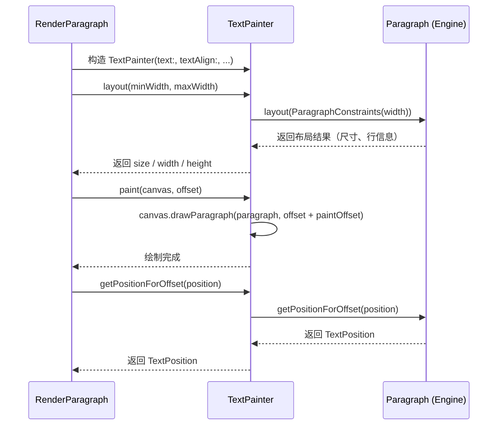

# Flutter 文本渲染原理

[toc]

## 一、文本渲染系统总览

### 完整渲染链路

在 Flutter 里输入一行文字，从声明到像素要经过一条很长的链路：

```
Text Widget → RichText Widget → RenderParagraph → TextPainter → Paragraph (dart:ui) → SkParagraph (C++, HarfBuzz/ICU) → Skia / Impeller 光栅化 → GPU
```

每一层的职责完全不同。理解这条链路，是排查文本布局问题和做性能优化的前提。

### 各层职责

| 层级 | 类 | 职责 |
|------|------|------|
| **Widget 层** | `Text` / `RichText` | 声明文本内容、样式、对齐方式等配置 |
| **Element 层** | `MultiChildRenderObjectElement` | 桥接 Widget 与 RenderObject；`WidgetSpan` 的子 Widget 通过它挂载 |
| **RenderObject 层** | `RenderParagraph` | 管理布局（换行、尺寸）和绘制（调用 Canvas API） |
| **Framework 绘制层** | `TextPainter` | 封装 Engine 的 Paragraph API，提供 Dart 侧的高层接口 |
| **Engine 层** | `Paragraph`（dart:ui）→ `SkParagraph`（C++）→ Skia/Impeller | 实际的文本度量、排版、光栅化 |

用一张分层图看更清楚：

| 层级 | 核心类 | 关键方法 / 职责 |
|------|--------|----------------|
| **Widget 层** | `Text` → 内部创建 `RichText(text: TextSpan(...))` | 声明文本内容、样式、对齐方式等配置 |
| **Element 层** | `MultiChildRenderObjectElement` | 桥接 Widget 与 RenderObject；`WidgetSpan` 的子 Widget 作为 children 挂载 |
| **RenderObject 层** | `RenderParagraph` | `computeDryLayout()` → 借助独立 `TextPainter`（`_textIntrinsics`）干布局<br>`performLayout()` → `TextPainter.layout()`<br>`paint()` → `TextPainter.paint()` + 绘制内联子节点<br>`hitTestChildren()` → 定位命中的 Span 与内联子节点 |
| **Framework 绘制层** | `TextPainter` | 持有 `Paragraph` 实例，`layout` / `paint` / `getPositionForOffset` 代理给 Paragraph |
| **Engine 层** | `Paragraph`（dart:ui）→ `SkParagraph`（C++，HarfBuzz shaping / ICU 断行）→ Skia / Impeller | `ParagraphBuilder` 构建，SkParagraph 做实际排版，Skia / Impeller 光栅化到 GPU |

### 为什么文本渲染这么复杂

"不就是画几个字吗？"——文本渲染却是 GUI 系统里最复杂的子系统之一，原因包括：

- **换行**：一段文字在给定宽度下要在哪里断行？中文按字断，英文按单词断，混合文本要同时处理两种规则
- **字体度量**：每个字形（glyph）的宽度、高度、基线（baseline）位置都不一样
- **双向文本（BiDi）**：阿拉伯语从右到左，但其中的数字从左到右，混排时需要 Unicode BiDi 算法
- **表情符号**：一个"笑脸"可能由多个 Unicode 码点组合而成（如 👨‍👩‍👧‍👦 是 7 个码点），需要正确的簇（cluster）处理
- **文本选择**：光标定位、选区高亮、拖拽选区——都需要精确的命中测试
- **字体回退**：当首选字体不包含某个字符时，需要自动查找回退字体

Flutter 把换行、字体度量、双向文本、表情符号这几个问题封装在 Engine 的文本排版模块里——现在是 Skia 的 **SkParagraph**（早期是 Flutter 自研的 libtxt，2023 年已从 Engine 中移除），Widget/RenderObject 层不需要关心这些底层细节。

---

## 二、TextSpan 与 InlineSpan 体系

### InlineSpan 基类

`InlineSpan` 是所有文本片段的基类，定义在 `painting/inline_span.dart` 中。它的核心方法是 `build()`，负责把 Span 树的内容写入 `ParagraphBuilder`（无返回值）：

```dart
abstract class InlineSpan extends DiagnosticableTree {
  // 把这个 Span 的文本/样式/占位符写入 ParagraphBuilder
  void build(
    ui.ParagraphBuilder builder, {
    TextScaler textScaler = TextScaler.noScaling,        // 文本缩放策略
    List<PlaceholderDimensions>? dimensions,             // 各占位符的尺寸
  });

  // 前序遍历 Span 树，访问每个有内容的节点
  bool visitChildren(InlineSpanVisitor visitor);

  // 返回包含指定文本位置的 Span（手势命中的关键）
  InlineSpan? getSpanForPosition(TextPosition position);

  // 把 Span 树展平成纯文本字符串（WidgetSpan 变为 U+FFFC）
  String toPlainText({bool includeSemanticsLabels = true, bool includePlaceholders = true});
}
```

**版本提示**：Flutter 1.x 时代 `build()` 返回 `Pointer<Void>`（Engine 侧 C++ 对象指针）并接收 `textScaleFactor`，这一旧 API 早已废弃，现在 `build()` 直接往 `ParagraphBuilder` 里写内容，缩放参数也换成了 `TextScaler`。

`InlineSpan` 在 painting 层有两个直接子类：`TextSpan` 和 `PlaceholderSpan`（抽象类，表示文本流中的占位符）。widgets 层的 `WidgetSpan` 继承自 `PlaceholderSpan`，是它最重要的具体实现。

> 官方文档：[InlineSpan](https://api.flutter.dev/flutter/painting/InlineSpan-class.html)、[TextSpan](https://api.flutter.dev/flutter/painting/TextSpan-class.html)

### TextSpan

`TextSpan` 是最常用的 Span 类型，表示一段带样式的文本：

```dart
const TextSpan({
  String? text,               // 文本内容（与 children 可同时存在，text 在前）
  List<InlineSpan>? children, // 子 Span（递归嵌套）
  TextStyle? style,           // 文本样式
  GestureRecognizer? recognizer, // 手势识别器
  MouseCursor? mouseCursor,   // 鼠标光标（默认根据 recognizer 自动选择）
  void Function(PointerEnterEvent)? onEnter,  // 鼠标进入
  void Function(PointerExitEvent)? onExit,    // 鼠标离开
  String? semanticsLabel,     // 语义标签
  String? semanticsIdentifier,// 语义标识符
  Locale? locale,             // 区域设置
  bool? spellOut,             // 无障碍"逐字拼读"
})
```

各字段的作用：

- **`text`**：纯文本内容。可以与 `children` 同时存在（`text` 在子节点之前渲染），但通常二者只用其一
- **`style`**：`TextStyle`，定义字体、颜色、大小、装饰等。子 Span 如果没有指定 `style`，会继承父 Span 的样式（`inherit: true` 是默认值）
- **`children`**：子 Span 列表，递归嵌套形成富文本树
- **`recognizer`**：`GestureRecognizer`，让这段文字可以响应点击/长按等手势
- **`semanticsLabel`**：无障碍语义标签

### WidgetSpan

`WidgetSpan` 允许在文本流中嵌入任意 Widget：

```dart
const WidgetSpan({
  required Widget child,      // 内嵌的 Widget（必填）
  PlaceholderAlignment alignment = PlaceholderAlignment.bottom,  // 对齐方式
  TextBaseline? baseline,     // 基线类型（baseline 类对齐时必传）
  TextStyle? style,
})
```

**PlaceholderAlignment 枚举**决定了 Widget 在文本行中的垂直对齐位置：

| 值 | 含义 |
|----|------|
| `top` | 与行顶部对齐 |
| `middle` | 与行中部对齐 |
| `bottom` | 与行底部对齐 |
| `baseline` | 与文本基线对齐（需指定 `baseline` 类型） |
| `aboveBaseline` | 底部在基线上方 |
| `belowBaseline` | 顶部在基线下方 |

内部实现上，`WidgetSpan` 本身就是 `PlaceholderSpan` 的子类：在文本流里它被展平为一个 U+FFFC（对象替换字符），Engine 排版时按传入的 `PlaceholderDimensions` 为这个字符预留一块矩形空间；实际 Widget 则作为 `RenderParagraph` 的**子 RenderBox** 正常挂载，只是它的绘制位置由文本排版结果（`inlinePlaceholderBoxes`）决定，在 `RenderParagraph.paint()` 中随文本一起绘制。

### TextSpan 树结构

TextSpan 通过 `children` 递归嵌套，构建出完整的富文本树：

```
TextSpan (root)
├── style: TextStyle(fontSize: 14, color: black)
├── text: "这是一段"
├── children:
│   ├── TextSpan(text: "加粗文字", style: TextStyle(fontWeight: bold))
│   ├── TextSpan(text: "和")
│   └── TextSpan(text: "红色文字", style: TextStyle(color: red))
```

### 代码示例：复杂的 TextSpan 嵌套

```dart
Text.rich(
  TextSpan(
    text: '请阅读并同意 ',
    style: const TextStyle(fontSize: 14),
    children: [
      TextSpan(
        text: '《用户协议》',
        style: const TextStyle(
          color: Colors.blue,
          decoration: TextDecoration.underline,
        ),
        recognizer: TapGestureRecognizer()
          ..onTap = () => print('点击了用户协议'),
      ),
      const TextSpan(text: ' 和 '),
      TextSpan(
        text: '《隐私政策》',
        style: const TextStyle(
          color: Colors.blue,
          decoration: TextDecoration.underline,
        ),
        recognizer: TapGestureRecognizer()
          ..onTap = () => print('点击了隐私政策'),
      ),
      const WidgetSpan(
        alignment: PlaceholderAlignment.middle,
        child: Icon(Icons.check_circle, size: 16, color: Colors.green),
      ),
      const TextSpan(text: ' 已同意'),
    ],
  ),
)
```

这个例子展示了 TextSpan 嵌套、GestureRecognizer 手势绑定和 WidgetSpan 的组合使用。

---

## 三、RichText → RenderParagraph

### RichText Widget

`RichText` 是文本渲染在 Widget 层的核心，它接收 `InlineSpan` 并创建对应的 RenderObject：

```dart
class RichText extends MultiChildRenderObjectWidget {
  RichText({
    super.key,
    required this.text,           // InlineSpan 根节点
    this.strutStyle,              // StrutStyle，最小行高控制
    this.textAlign = TextAlign.start,
    this.textDirection,           // 文本方向（默认取 Directionality.of）
    this.softWrap = true,         // 是否自动换行
    this.overflow = TextOverflow.clip,
    this.textScaler = TextScaler.noScaling,
    this.maxLines,                // 最大行数
    this.locale,                  // 区域设置
    this.textHeightBehavior,      // 行高行为
    this.selectionRegistrar,      // 选区注册器
    this.selectionColor,          // 选区颜色
    this.textWidthBasis = TextWidthBasis.parent,
  }) : super(
    // WidgetSpan 的子 Widget 在这里被提取出来，作为普通 children 挂载
    children: WidgetSpan.extractFromInlineSpan(text, textScaler),
  );
}
```

**重要细节**：`RichText` 继承自 `MultiChildRenderObjectWidget`。`WidgetSpan` 内嵌的子 Widget 会在构造时通过 `WidgetSpan.extractFromInlineSpan()` 提取为 `children`，经 `MultiChildRenderObjectElement` 挂载成 `RenderParagraph` 的子 RenderBox（由 `ContainerRenderObjectMixin` 管理）——它们是 RenderObject 树的"正式"子节点，只是**位置**不由普通布局算法决定，而由文本排版结果（占位符矩形）指定。

### 从 Widget 到 RenderObject

`RichText.createRenderObject()` 创建 `RenderParagraph`，`updateRenderObject()` 在属性变化时同步更新：

```dart
@override
RenderParagraph createRenderObject(BuildContext context) {
  return RenderParagraph(
    text,
    textAlign: textAlign,
    textDirection: textDirection ?? Directionality.of(context),
    softWrap: softWrap,
    overflow: overflow,
    textScaler: textScaler,
    maxLines: maxLines,
    strutStyle: strutStyle,
    textWidthBasis: textWidthBasis,
    textHeightBehavior: textHeightBehavior,
    locale: locale ?? Localizations.maybeLocaleOf(context),
    registrar: selectionRegistrar,
    selectionColor: selectionColor,
  );
}
```

### RenderParagraph

`RenderParagraph` 继承自 `RenderBox`（混入 `ContainerRenderObjectMixin` 以管理 WidgetSpan 子节点），是文本渲染在 RenderObject 层的核心。它持有 `TextPainter` 实例，将文本布局、绘制、命中测试全部代理给 `TextPainter`：

```dart
class RenderParagraph extends RenderBox
    with ContainerRenderObjectMixin<RenderBox, TextParentData>,
         RenderInlineChildrenContainerDefaults,
         RelayoutWhenSystemFontsChangeMixin {
  final TextPainter _textPainter;

  @override
  Size computeDryLayout(BoxConstraints constraints) {
    // 1. 干布局不能破坏主布局缓存，改用独立的 _textIntrinsics TextPainter
    final size = (_textIntrinsics
          ..setPlaceholderDimensions(
            // 2. 对 WidgetSpan 子节点做"干"布局，只求尺寸不落位置
            layoutInlineChildren(constraints.maxWidth,
                ChildLayoutHelper.dryLayoutChild, ChildLayoutHelper.getDryBaseline),
          )
          ..layout(minWidth: constraints.minWidth, maxWidth: constraints.maxWidth))
        .size;
    return constraints.constrain(size);
  }

  @override
  void performLayout() {
    final BoxConstraints constraints = this.constraints;
    // 1. 布局 WidgetSpan 子节点，得到占位符尺寸
    _placeholderDimensions = layoutInlineChildren(constraints.maxWidth,
        ChildLayoutHelper.layoutChild, ChildLayoutHelper.getBaseline);
    // 2. 把占位符尺寸交给 TextPainter，做真正的文本布局
    _layoutTextWithConstraints(constraints);
    // 3. 按排版结果把子节点摆到占位符矩形上
    positionInlineChildren(_textPainter.inlinePlaceholderBoxes!);

    final Size textSize = _textPainter.size;
    size = constraints.constrain(textSize);
    // ... 根据 overflow 决定是否需要裁剪/渐隐 shader
  }

  @override
  void paint(PaintingContext context, Offset offset) {
    // 1. 绘制选区（如启用了 SelectionRegistrar）
    // 2. _textPainter.paint(context.canvas, offset) 画文本
    _textPainter.paint(context.canvas, offset);
    // 3. paintInlineChildren(context, offset) 画 WidgetSpan 子节点
    // 4. 若 overflow 是 clip/fade，还要补裁剪与渐隐遮罩
  }

  @override
  bool hitTestSelf(Offset position) => true;

  @override
  bool hitTestChildren(BoxHitTestResult result, { required Offset position }) {
    // 1. 找到点击位置最近的字形，再反查它所属的 Span
    final glyph = _textPainter.getClosestGlyphForOffset(position);
    final spanHit = glyph != null && glyph.graphemeClusterLayoutBounds.contains(position)
        ? _textPainter.text!.getSpanForPosition(
            TextPosition(offset: glyph.graphemeClusterCodeUnitRange.start))
        : null;
    // 2. 命中了带 recognizer 的 Span，就把它作为事件目标加入命中结果
    if (spanHit is HitTestTarget) {
      result.add(HitTestEntry(spanHit));
      return true;
    }
    // 3. 否则继续测 WidgetSpan 子节点
    return hitTestInlineChildren(result, position);
  }
}
```

关键点：`RenderParagraph` 本身几乎不做任何文本计算，它只是一个"壳"，把文本相关工作转发给 `TextPainter`；它自己额外负责的是 WidgetSpan 子节点的挂载/摆位、溢出裁剪与选区。这个设计让文本渲染的复杂逻辑集中在 `TextPainter` 一处，`RenderParagraph` 只负责和布局协议对接。

---

## 四、TextPainter 详解

### 角色：Framework 与 Engine 之间的桥梁

`TextPainter` 是 `package:flutter/painting.dart` 中的核心类。它封装了 Engine 侧的 `Paragraph`（`dart:ui`），对外提供纯 Dart 接口。上层（`RenderParagraph`）只和 `TextPainter` 交互，不需要直接使用 `dart:ui` 的 API。

### 生命周期

`TextPainter` 的使用遵循严格的"构造 → 布局 → 绘制 → 释放"流程（官方类文档明确列出这四步，用完必须 `dispose()` 释放 Engine 侧资源）：



> 官方文档：[TextPainter](https://api.flutter.dev/flutter/painting/TextPainter-class.html)、[RenderParagraph](https://api.flutter.dev/flutter/rendering/RenderParagraph-class.html)

### 构造

```dart
TextPainter({
  InlineSpan? text,                                    // 文本（layout 前必须非空）
  TextAlign textAlign = TextAlign.start,
  TextDirection? textDirection,                        // 方向（layout 前必须非空）
  @Deprecated('Use textScaler instead')                // 3.12 起废弃
  double textScaleFactor = 1.0,
  TextScaler textScaler = ...,                          // 文本缩放策略
  int? maxLines,
  String? ellipsis,                                    // 溢出省略符，如 '…'
  Locale? locale,
  StrutStyle? strutStyle,
  TextWidthBasis textWidthBasis = TextWidthBasis.parent,
  TextHeightBehavior? textHeightBehavior,
})
```

注意：所有参数都是命名参数，`text`、`textAlign`、`textDirection` 等属性是可变的，构造后可以通过 setter 修改。修改后需要重新调用 `layout()`。占位符尺寸不通过构造传入，而是调用 `setPlaceholderDimensions()` 设置。使用完毕后应调用 `dispose()` 释放 Engine 侧资源。

### 核心方法详解

#### `layout()`

```dart
void layout({ double minWidth = 0.0, double maxWidth = double.infinity }) {
  // 1. 先尝试复用缓存：若新宽度不会改变断行结果（_resizeToFit），
  //    只调整 contentWidth 和 paintOffset，直接返回
  final cachedLayout = _layoutCache;
  if (cachedLayout != null && cachedLayout._resizeToFit(minWidth, maxWidth, textWidthBasis)) {
    return;
  }
  // 2. （必要时）通过 ParagraphBuilder 重建 Paragraph
  // 3. 调用 Paragraph.layout(ParagraphConstraints(width: maxWidth))
  final paragraph = (cachedLayout?.paragraph ?? _createParagraph(text))
      ..layout(ui.ParagraphConstraints(width: layoutMaxWidth));
  // 4. 把布局结果包装成缓存对象
  _layoutCache = _TextPainterLayoutCacheWithOffset(...);
}
```

`layout()` 会触发 Engine 侧的 `Paragraph.layout()`，这是文本渲染链路中**最昂贵的操作**——Engine 要计算每个字符的位置、决定换行点、处理双向文本等。不过它有缓存：文本与宽度都没变时（或新宽度不小于文本的 `maxIntrinsicWidth`、断行结果不可能变化时）会直接复用上一次结果。

#### `paint()`

```dart
void paint(Canvas canvas, Offset offset) {
  // 直接调用 Canvas.drawParagraph()（Paragraph 自身没有 paint 方法）
  canvas.drawParagraph(_paragraph!, offset + paintOffset);
}
```

`paint()` 将排版好的文本绘制到 Canvas 上。这个操作本身相对轻量，因为排版结果已经被缓存。`paintOffset` 是 `textAlign` 产生的水平对齐偏移（如居中时把文本向右移）。

#### 干布局：`RenderParagraph.computeDryLayout()`

TextPainter 没有公开的 `getDryLayout()` 方法。干布局（`RenderParagraph.computeDryLayout()`）的做法是使用一个**独立的 TextPainter 实例**（`_textIntrinsics`）：

```dart
// RenderParagraph 中（简化）
Size computeDryLayout(BoxConstraints constraints) {
  final size = (_textIntrinsics          // 独立的 TextPainter，不碰主布局缓存
        ..layout(minWidth: constraints.minWidth, maxWidth: constraints.maxWidth))
      .size;
  return constraints.constrain(size);
}
```

它不会修改主 `TextPainter` 的内部状态，适合父节点在 dry 布局阶段预估尺寸。但它同样要执行 Engine 侧的布局计算，因此并不"轻量"——只是不产生副作用。

#### `getPositionForOffset()` 与 `getBoxesForSelection()`

```dart
TextPosition getPositionForOffset(Offset offset) {
  return _paragraph!.getPositionForOffset(offset);  // 总能返回最近的位置（非空）
}

List<TextBox> getBoxesForSelection(TextSelection selection) {
  // 内部转调 Engine 的 getBoxesForRange(selection.start, selection.end)
  return getBoxesForRange(selection.start, selection.end);
}
```

命中测试将画布坐标转换为文本位置（`TextPosition`），用于光标定位和文本选择。

#### `getLineBoundary()`

```dart
TextRange getLineBoundary(TextPosition position) {
  return _paragraph!.getLineBoundary(position);
}
```

返回指定位置所在行的字符范围（`TextRange`），用于实现"点击某处选中整行"等功能。

#### `computeLineMetrics()`

```dart
List<LineMetrics> computeLineMetrics() {
  return _paragraph!.computeLineMetrics();
}
```

返回每一行的度量信息（宽度、高度、基线、行号等），用于自定义文本布局场景。

### TextWidthBasis

`TextWidthBasis` 控制文本的宽度计算基准：

```dart
enum TextWidthBasis {
  /// 多行文本占满父级给定的宽度；单行文本只取内容所需的最小宽度
  parent,

  /// 宽度恰好等于最长一行的宽度，不再更宽（典型场景：聊天气泡）
  longestLine,
}
```

- `parent`（默认）：`width` 取文本的 `maxIntrinsicWidth` 并限制在 `[minWidth, maxWidth]` 区间内——多行时结果基本等于 `maxWidth`，单行时等于内容宽度
- `longestLine`：文本的 `width` 等于最长一行的实际宽度（不含对齐留白）

这个属性影响 `RenderParagraph` 报告给父节点的尺寸，从而影响父节点的布局决策。

### TextPainter 与 Canvas 的交互

`TextPainter` 的 `paint()` 方法最终调用的是 `Canvas` 上的绘制命令。在 Engine 内部，这些命令会被转换为 Skia/Impeller 的绘制调用：

```dart
// TextPainter.paint() 内部（简化）
void paint(Canvas canvas, Offset offset) {
  // 若只有颜色等"绘制级"变化，会先悄悄重建 Paragraph（_rebuildParagraphForPaint）
  canvas.drawParagraph(_paragraph!, offset + paintOffset);
}
```

注意绘制走的是 `Canvas.drawParagraph()`，而不是把 `offset` 传给某个 `Paragraph.paint()`；`Paragraph` 只是被动的数据源，坐标系偏移统一由 Canvas 命令承担。`paintOffset` 用来实现 `textAlign` 的水平对齐（右对齐/居中时把整个段落平移）。

---

## 五、Paragraph（Engine 层）

### Paragraph 类（dart:ui）

`dart:ui` 中的 `Paragraph` 是 Engine 层暴露给 Framework 的文本对象。它是一个 opaque 的 handle，底层对应 C++ 层的 `SkParagraph` 实例。**`Paragraph` 是不可变的**：文本与样式在 `ParagraphBuilder.build()` 时就固定了，只能换宽度反复 `layout()`；要改内容必须重建。

```dart
abstract class Paragraph {
  // 布局
  void layout(ParagraphConstraints constraints);
  double get width;               // 占用宽度
  double get height;              // 占用高度
  double get longestLine;         // 最长一行的宽度
  double get minIntrinsicWidth;   // 最小内在宽度
  double get maxIntrinsicWidth;   // 最大内在宽度
  double get alphabeticBaseline;  // 字母基线位置
  double get ideographicBaseline; // 表意基线位置
  bool get didExceedMaxLines;     // 是否因 maxLines/ellipsis 截断
  int get numberOfLines;          // 可见行数

  // 注意：没有 paint 方法！绘制走 Canvas.drawParagraph(paragraph, offset)

  // 命中测试与几何查询
  List<TextBox> getBoxesForRange(int start, int end, {...});
  List<TextBox> getBoxesForPlaceholders();
  TextPosition getPositionForOffset(Offset offset);
  TextRange getWordBoundary(TextPosition position);
  TextRange getLineBoundary(TextPosition position);
  List<LineMetrics> computeLineMetrics();
  LineMetrics? getLineMetricsAt(int lineNumber);

  // 释放 Engine 侧资源
  void dispose();
}
```

> 官方文档：[dart:ui Paragraph](https://api.flutter.dev/flutter/dart-ui/Paragraph-class.html)。注意 `TextPainter.getBoxesForSelection()` 接收的 `TextSelection` 是 Framework 层的封装，Engine 层原始 API 是按 code unit 区间查询的 `getBoxesForRange(start, end)`。

### ParagraphConstraints

```dart
class ParagraphConstraints {
  const ParagraphConstraints({ required this.width });
  final double width;
}
```

只有一个 `width` 属性——文本布局只关心水平宽度约束，垂直方向由文本内容自行决定。

### ParagraphBuilder

`ParagraphBuilder` 是构建 `Paragraph` 的构建器，使用栈式 API。注意这里的 `TextStyle`、`TextAlign` 等都是 **dart:ui** 版本（不是 painting 层的），颜色要用 `ui.Color`：

```dart
import 'dart:ui' as ui;

final builder = ui.ParagraphBuilder(
  ui.ParagraphStyle(
    textAlign: TextAlign.left,
    fontSize: 14,
    textDirection: TextDirection.ltr,
  ),
);

// 压入样式（dart:ui 的 TextStyle）
builder.pushStyle(ui.TextStyle(color: const ui.Color(0xFF000000)));
// 添加文本
builder.addText('Hello ');
// 压入新样式（嵌套）
builder.pushStyle(ui.TextStyle(
  color: const ui.Color(0xFF0000FF),
  fontWeight: FontWeight.bold,
));
builder.addText('World');
// 弹出内层样式
builder.pop();
// 弹出根样式
builder.pop();

// 添加占位符（WidgetSpan 使用的机制）
builder.addPlaceholder(100, 100, PlaceholderAlignment.middle);

// 构建 Paragraph（构建后 builder 失效，不可复用）
final paragraph = builder.build();
```

**API 栈式模型**：

```
pushStyle(A)    ← 栈: [A]
  addText("X")  ← 当前样式: A
  pushStyle(B)  ← 栈: [A, B]
    addText("Y") ← 当前样式: A + B
    pushStyle(C) ← 栈: [A, B, C]
      addText("Z") ← 当前样式: A + B + C
    pop()        ← 栈: [A, B]
  pop()          ← 栈: [A]
pop()            ← 栈: []
```

子样式会合并父样式——未指定的属性继承父级，指定的属性覆盖父级。这和 CSS 的继承规则类似。

### SkParagraph：Engine 的排版引擎

`SkParagraph` 是 Flutter 团队开发的模块化文本排版库，寄宿在 Skia 仓库的 `modules/skparagraph` 中：

- **支持 Unicode 全集**：包括 CJK 字符、表情符号、双向文本
- **高级换行算法**：基于 ICU 断行规则，支持按单词断行（英文）和按字符断行（中文），源自 minikin 的 Knuth-Plass 风格优化（尽量避免孤行、平衡行长）
- **文本选择**：支持光标定位、选区、双向文本中的选区方向
- **字体回退**：通过 FontCollection 自动查找包含目标字符的回退字体

**演进历史**（这一段很多旧资料写错）：

1. Flutter 早期（约 2017-2018）的文本栈叫 **libtxt**，基于 minikin、HarfBuzz、ICU 和 Skia 自研，取代了更早借用 Blink 的实现
2. 2019-2020 年 Flutter 团队开发了 **SkParagraph** 作为 libtxt 的替代，逐步切换为默认（[flutter/flutter#39420](https://github.com/flutter/flutter/issues/39420)）
3. 2023 年初，libtxt 和 minikin 的代码从 Engine 中彻底移除（[flutter/engine#39499](https://github.com/flutter/engine/pull/39499)），此后所有平台统一使用 SkParagraph 做文本布局

注意 Skia 的 `SkTextBlob` 从来不是"旧排版引擎"，它只是 Skia 的字形绘制容器，至今仍是 SkParagraph 输出绘制结果的数据结构。

Flutter 文本渲染链路中 Engine 部分的简化流程：

```
ParagraphBuilder.build()
  → 创建 SkParagraph 实例 (C++)
  → 内部包含 ParagraphStyle、TextStyles、文本数据
  → HarfBuzz 做 shaping（字符→字形，处理连字/中英混排/emoji 簇）
  → ICU 提供断行与双向文本（BiDi）规则

Paragraph.layout(constraints)
  → SkParagraph::layout(width)
  → 断行计算、字体度量、字体回退（FontCollection）
  → 生成 LineMetrics（每行的宽高、基线等）

Canvas.drawParagraph(paragraph, offset)
  → SkParagraph::paint 产出 SkTextBlob
  → Skia: 将字形光栅化/缓存后绘制
  → Impeller: SkTextBlob 转为 TextFrame，字形栅格化进 GlyphAtlas
     （字形图集纹理），绘制时按图集采样出矩形
```

**Impeller 的文本栈补充**：Impeller 用 typographer 模块处理文本。普通字形进入 8-bit alpha 通道的字形图集（`kAlphaBitmap`），emoji/彩色字体字形进入 RGBA 位图图集（`kColorBitmap`），两类图集分开管理；绘制时每个字形变成一张从图集纹理采样的矩形，同一段文本合并成少量 draw call，且图集跨帧复用（新增字形时优先向现有图集追加，放不下才重建）。这也是 Impeller 不依赖 Skia 运行时 shader 的原因之一——文本光栅化结果被"烘焙"进了纹理。参考：[Impeller typographer 源码文档](https://api.flutter.dev/impeller/)。

---

## 六、TextStyle 深入

### 属性一览

`TextStyle` 是 Flutter 中描述文本外观的核心类，拥有 30+ 个属性：

```dart
const TextStyle({
  // 字体
  this.inherit = true,           // 是否继承父 Span 样式
  Color? color,                  // 文本颜色
  Color? backgroundColor,        // 背景色
  double? fontSize,              // 字体大小（逻辑像素）
  FontWeight? fontWeight,        // 字重 (w100-w900)
  FontStyle? fontStyle,          // normal / italic
  double? letterSpacing,         // 字间距
  double? wordSpacing,           // 词间距
  double? height,                // 行高倍数（1.0 表示与 fontSize 相同）
  TextBaseline? textBaseline,    // 基线类型
  String? fontFamily,            // 字体族名
  List<String>? fontFamilyFallback, // 字体回退列表
  String? package,               // 字体资源所在的 package
  TextDecoration? decoration,    // 文本装饰
  Color? decorationColor,        // 装饰颜色
  TextDecorationStyle? decorationStyle, // 装饰样式
  double? decorationThickness,   // 装饰线粗细
  String? debugLabel,            // 调试标签
  Paint? foreground,             // 前景 Paint（优先于 color）
  Paint? background,             // 背景Paint（优先于 backgroundColor）
  List<Shadow>? shadows,         // 文字阴影
  List<FontFeature>? fontFeatures, // OpenType 特性
  List<FontVariation>? fontVariations, // 字体变体
  TextOverflow? overflow,        // 溢出处理
  String? locale,                // 区域设置
})
```

### inherit 属性

`inherit` 控制 TextStyle 是否与父 Span 合并：

- `inherit: true`（默认）：未指定的属性从父 Span 继承
- `inherit: false`：所有属性独立，不受父 Span 影响

```dart
Text.rich(
  TextSpan(
    style: const TextStyle(fontSize: 14, color: Colors.black),
    children: [
      // inherit 默认 true，继承 fontSize: 14, color: black
      // 只覆盖 color 为 blue
      const TextSpan(text: '继承文字', style: TextStyle(color: Colors.blue)),
      // inherit: false，不继承任何父样式
      // fontSize 和 color 都未指定，使用系统默认值
      const TextSpan(text: '独立文字', style: TextStyle(inherit: false)),
    ],
  ),
)
```

### TextDecoration 与 TextDecorationStyle

```dart
// 文本装饰类型：注意这不是 enum，而是用位掩码实现的类，
// 因此可以用 combine 把多个装饰叠加在一起
class TextDecoration {
  static const TextDecoration none = ...;        // 无装饰
  static const TextDecoration underline = ...;   // 下划线
  static const TextDecoration overline = ...;    // 上划线
  static const TextDecoration lineThrough = ...; // 删除线

  // 组合多个装饰，例如"下划线 + 删除线"
  factory TextDecoration.combine(List<TextDecoration> decorations);
}

// 装饰样式（这个才是 enum）
enum TextDecorationStyle {
  solid,   // 实线
  double,  // 双线
  dotted,  // 点线
  dashed,  // 虚线
  wavy,    // 波浪线
}
```

组合示例：

```dart
TextStyle(
  decoration: TextDecoration.underline,
  decorationStyle: TextDecorationStyle.wavy,
  decorationColor: Colors.red,
  decorationThickness: 2,
)
```

### StrutStyle 与行高

`StrutStyle` 用于强制规定最小行高，确保多段文本的行间距一致：

```dart
RichText(
  strutStyle: const StrutStyle(
    fontSize: 16,           // 以哪个 fontSize 为基准
    height: 1.4,            // 行高倍数：strut 高度 = fontSize × height
    forceStrutHeight: true, // 强制使用 strut 高度，即使文本本身更高
  ),
  text: const TextSpan(text: '第一行\n第二行\n第三行'),
)
```

`StrutStyle` 的 `leading` 是在 `height` 之外**额外**加到行顶部/底部的间距（上下各分一半，单位是 fontSize 的倍数），不是行高本身。

`StrutStyle` 和 `TextStyle.height` 的区别：

| 属性 | 作用范围 | 行为 |
|------|---------|------|
| `TextStyle.height` | 只影响设置了该属性的 Span | 行高 = fontSize × height |
| `StrutStyle` | 影响整个 `RichText` 中所有行 | 规定最小行高；`forceStrutHeight: true` 时完全强制 |

### textHeightBehavior

`TextHeightBehavior` 控制第一行和最后一行的行高行为：

```dart
TextHeightBehavior(
  applyHeightToFirstAscent: true,   // 第一行的 ascent 是否受 height 影响
  applyHeightToLastDescent: true,   // 最后一行的 descent 是否受 height 影响
)
```

这在多行文本中很重要——如果不控制，文本块的顶部和底部可能出现额外的间距。

### fontSize 与 height 的交互

`height` 是行高倍数，实际行高 = `fontSize × height`：

```dart
TextStyle(
  fontSize: 14,
  height: 1.5,  // 行高 = 14 × 1.5 = 21 逻辑像素
)
```

- `height: 1.0`：行高等于 fontSize（无额外行间距，多行文字会紧贴）
- `height: 1.2`~`1.5`：常见的正文行高
- `height: null`：不显式指定，行高由**字体自身的度量**（ascent + descent）决定——不同字体差异明显（有的约 1.17，中文字体普遍在 1.3~1.5），这也是混排字体时行高忽高忽低的常见原因

### fontFeatures（OpenType 特性）

`fontFeatures` 允许启用字体的 OpenType 特性：

```dart
TextStyle(
  fontFeatures: const <FontFeature>[
    FontFeature.enable('tnum'),   // 表格数字（等宽数字）
    FontFeature.enable('liga'),   // 连字
    FontFeature.enable('kern'),   // 字距调整
    FontFeature.enable('calt'),   // 上下文替代
    FontFeature.disable('liga'),  // 禁用连字
  ],
)
```

常见的 OpenType 特性：

| 特性 | 含义 |
|------|------|
| `tnum` | 表格数字（等宽，适合对齐） |
| `lnum` | 等线数字（高度统一） |
| `liga` | 标准连字（如 fi → fi） |
| `kern` | 字距微调 |
| `calt` | 上下文替代字形 |
| `smcp` | 小型大写字母 |

### 代码示例：TextStyle 的各种效果

```dart
Column(
  crossAxisAlignment: CrossAxisAlignment.start,
  children: [
    // 基本样式
    const Text('基本文本', style: TextStyle(fontSize: 16, color: Colors.black)),

    // 粗体斜体
    const Text('粗体斜体',
      style: TextStyle(fontSize: 16, fontWeight: FontWeight.bold, fontStyle: FontStyle.italic)),

    // 阴影
    const Text('文字阴影',
      style: TextStyle(
        fontSize: 20,
        shadows: [
          Shadow(color: Colors.grey, offset: Offset(2, 2), blurRadius: 3),
        ],
      )),

    // 波浪线删除线
    const Text('波浪删除线',
      style: TextStyle(
        fontSize: 16,
        decoration: TextDecoration.lineThrough,
        decorationStyle: TextDecorationStyle.wavy,
        decorationColor: Colors.red,
      )),

    // 表格数字
    const Text('1234567890',
      style: TextStyle(fontSize: 16, fontFeatures: [FontFeature.enable('tnum')])),

    // 渐变色文字（通过 foreground Paint）
    ShaderMask(
      shaderCallback: (bounds) => const LinearGradient(
        colors: [Colors.blue, Colors.red],
      ).createShader(bounds),
      child: const Text('渐变文字', style: TextStyle(fontSize: 24)),
    ),
  ],
)
```

---

## 七、文本选择与光标的 hitTest

### TextSelection

```dart
class TextSelection {
  final int baseOffset;     // 选区起点
  final int extentOffset;   // 选区终点（拖拽时的当前位置）
  final TextAffinity affinity; // 光标亲和性
  final bool isDirectional;   // 是否有方向性
}
```

当 `baseOffset == extentOffset` 时，表示光标（没有选区）。

### RenderParagraph 的命中测试

`RenderParagraph` 的命中测试分两个层次：

**第一层：文本内容命中（`hitTestSelf` + `hitTestChildren`）**

```dart
// RenderParagraph 自身总是"可命中"的
@override
bool hitTestSelf(Offset position) => true;

// 子级命中：定位点击处最近的字形 → 反查所属 Span
@override
bool hitTestChildren(BoxHitTestResult result, { required Offset position }) {
  final glyph = _textPainter.getClosestGlyphForOffset(position);
  final spanHit = /* glyph 命中且属于某 Span 时 */ _textPainter.text!
      .getSpanForPosition(TextPosition(offset: ...));
  if (spanHit is HitTestTarget) {   // GestureRecognizer 实现了 HitTestTarget
    result.add(HitTestEntry(spanHit));
    return true;
  }
  return hitTestInlineChildren(result, position);  // 再测 WidgetSpan 子节点
}
```

**第二层：事件派发（GestureRecognizer）**

带 `recognizer` 的 Span 被加入命中结果后，`GestureBinding` 在分发 `PointerDownEvent` 时会调用它（`GestureRecognizer` 实现了 `HitTestTarget.handleEvent`），在 `handleEvent` 里执行 `addPointer(event)` 把手势竞技场注册进来。也就是说 `RenderParagraph` 并不直接调用 `recognizer.addPointer()`，而是借助命中测试结果走标准事件分发；`onEnter`/`onExit` 等鼠标事件同样由 MouseTracker 根据命中结果驱动。

### TextPosition 与 Affinity

```dart
class TextPosition {
  final int offset;              // 字符偏移量
  final TextAffinity affinity;   // 亲和性
}

enum TextAffinity {
  upstream,   // 光标贴在"前一个字符的尾部"（逻辑上游一侧）
  downstream, // 光标贴在"后一个字符的头部"（逻辑下游一侧）
}
```

**`affinity` 为什么重要？** 同一个 offset 可能对应两个视觉位置。最典型的例子是软换行处：行尾和下一行行首在文本里是同一个 offset，光标到底显示在上一行末尾还是下一行开头，就由 affinity 区分；双向文本中（阿拉伯语与数字混排）同理。

对于纯 LTR（从左到右）的中文/英文文本，`affinity` 通常不太重要，但仍需正确处理，否则光标渲染位置可能偏移。

### 选区的绘制

`RichText`/`Text` 开启选择（如包在 `SelectionArea` 里）后，选区由 `RenderParagraph`（内部按占位符拆分的 `_SelectableFragment`）在 `paint()` 里绘制，颜色来自 `RenderParagraph.selectionColor`（Material 下最终源自 `SelectionTheme`/`DefaultSelectionStyle`）：

```dart
// RenderParagraph 侧（简化）
void paintSelection(Canvas canvas, Offset offset, TextSelection selection) {
  final boxes = getBoxesForSelection(selection);  // 每行一个 TextBox
  final selectionPaint = Paint()..color = selectionColor;
  for (final box in boxes) {
    canvas.drawRect(box.toRect().shift(offset), selectionPaint);
  }
}
```

`getBoxesForSelection()` 返回 `List<TextBox>`，每个 `TextBox` 表示选区的一个矩形区域（因为选区可能跨多行，每行对应一个矩形）。

### 光标的绘制

光标的渲染由 `RenderEditable`（可编辑文本的 RenderObject）管理：

- 光标位置由 `TextPosition` 决定（`TextPainter.getOffsetForCaret()` 计算）
- 光标宽度默认 2.0 逻辑像素（`EditableText.cursorWidth` 可配；`RenderEditable` 层默认 1.0）
- 光标的闪烁由 `Timer` 驱动，半周期 500ms

```dart
// 简化的光标绘制逻辑（RenderEditable 实际用 caretPrototype + getOffsetForCaret）
void paintCursor(Canvas canvas, Offset offset, TextPosition position) {
  final caretOffset = textPainter.getOffsetForCaret(position, caretPrototype);
  canvas.drawRect(
    caretPrototype.shift(caretOffset + offset),
    Paint()..color = cursorColor,
  );
}
```

`RenderParagraph`（不可编辑文本）不处理光标。光标和选区的完整实现主要在 `RenderEditable`（用于 `TextField` / `TextFormField`）中。

---

## 八、文本渲染性能

### Paragraph.layout() 的开销

`Paragraph.layout()` 是整个文本渲染链路中**最昂贵的单一操作**。它需要：

1. 遍历所有字符和 Span
2. 查找字体、加载字形（glyph）
3. 计算每个字形的宽度
4. 执行换行算法
5. 处理双向文本
6. 计算行度量信息

对于普通短文本（几十个字符），这个开销可以忽略不计。但对于长文本（几百行以上），`Paragraph.layout()` 可能需要数毫秒。

### const Text() vs Text()

```dart
// 好：const 构造，Widget 不变，Element 被复用
const Text('Hello', style: TextStyle(fontSize: 16))

// 差：每次 build 都创建新的 Text Widget
Text('Hello', style: TextStyle(fontSize: 16))
```

`const Text()` 使得 Widget 可以在 rebuild 时被复用，避免不必要的 `RenderParagraph` 重建和 `TextPainter.layout()` 重新计算。

但注意：`const` 要求**所有属性都是编译时常量**。如果 `style` 包含动态值（如 `color: Colors.red.withOpacity(0.5)`），就不能用 `const`。

### TextPainter 的缓存策略

`TextPainter` 内部用 `_layoutCache`（`_TextPainterLayoutCacheWithOffset`）缓存布局结果，用 `_layoutTemplate`（一个只含空格的模板段落）缓存"典型行高"（`preferredLineHeight`）：

- 修改 `text`、`textAlign`、`textScaler` 等属性会触发 `markNeedsLayout()`：释放旧的 `Paragraph`、清空 `_layoutCache`
- 若新旧文本只是颜色这类"绘制级"差异（`compareTo` 返回 `paint`），则不重排，仅在下次 `paint()` 前悄悄重建 Paragraph（`_rebuildParagraphForPaint`）
- `layout()` 时若宽度未变，或新宽度仍不小于 `maxIntrinsicWidth`（断行结果不可能改变），`_resizeToFit` 会直接复用旧布局，只调整报告宽度和对齐偏移；否则才重新调用 Engine 排版

这正是 `const` 构造对性能很重要的原因——它能确保 `TextPainter` 的输入不变，从而命中缓存。

### 长文本的性能优化

**策略 1：使用 ListView.builder + Text**

```dart
// 差：单个 Text Widget 包含所有内容
ListView(
  children: [
    Text(veryLongString),  // 一次性排版全部文本
  ],
)

// 好：按行拆分，惰性构建
ListView.builder(
  itemCount: lines.length,
  itemBuilder: (context, index) {
    return Text(lines[index]);  // 只排版可见行的文本
  },
)
```

**策略 2：使用 maxLines 限制行数**

```dart
// 如果只需要显示前 3 行
Text(
  longText,
  maxLines: 3,
  overflow: TextOverflow.ellipsis,
)
```

`maxLines` 可以让 Engine 在行布局达到指定行数后提前停止，省掉后续行的断行与行度量（注意 shaping 阶段仍需处理全部文本，所以是"省一部分"而不是"省全部"），对长文本有一定收益。

**策略 3：textScaler vs textScaleFactor**

```dart
// 新 API（Flutter 3.16+）
MediaQuery(
  data: MediaQuery.of(context).copyWith(
    textScaler: TextScaler.linear(1.0),  // 明确的缩放控制
  ),
  child: child,
)

// 旧 API（3.16 起废弃）
MediaQuery(
  data: MediaQuery.of(context).copyWith(
    textScaleFactor: 1.2,  // 示例值：1.2 倍缩放
  ),
  child: child,
)
```

`TextScaler` 比 `textScaleFactor` 更精确，允许 `TextScaler.linear()` 和 `TextScaler.nonlinear()` 两种模式。在性能敏感场景下，可以显式设置 `TextScaler.noScaling`（即 1.0）来避免不必要的文本重排。

### RichText vs Text 的性能差异

`Text` 和 `RichText` 在底层是同一个东西——`Text` 的 `build()` 方法内部就是创建 `RichText`：

```dart
// Text.build()（简化：省略了粗体辅助、SelectionArea 分支等逻辑）
@override
Widget build(BuildContext context) {
  final DefaultTextStyle defaultTextStyle = DefaultTextStyle.of(context);
  // 合并默认样式
  TextStyle? effectiveTextStyle = style;
  if (style == null || style!.inherit) {
    effectiveTextStyle = defaultTextStyle.style.merge(style);
  }
  // 创建 RichText
  return RichText(
    textAlign: textAlign ?? defaultTextStyle.textAlign ?? TextAlign.start,
    textScaler: /* 优先取自身，缺省回退 MediaQuery.textScalerOf(context) */,
    text: TextSpan(
      text: data,
      style: effectiveTextStyle,
      children: textSpan != null ? <InlineSpan>[textSpan!] : null,
    ),
    // ... 其他属性
  );
}
```

因此 `Text` 和 `RichText` **没有性能差异**。`Text` 只是提供了便利的 `String` 接口和自动合并 `DefaultTextStyle` 的能力。

### ShaderMask 文字特效的性能代价

```dart
ShaderMask(
  shaderCallback: (bounds) => LinearGradient(
    colors: [Colors.blue, Colors.red],
  ).createShader(bounds),
  child: const Text('渐变文字', style: TextStyle(fontSize: 24)),
)
```

`ShaderMask` 会在绘制子节点时应用一个 `SaveLayer` 操作，把整个文本先绘制到一个离屏缓冲区，然后用 Shader 渲染。这会：

1. 增加一次 GPU 绘制调用
2. 消耗额外的显存用于离屏缓冲区
3. 在滚动场景中可能导致掉帧

如果只是需要简单的渐变色文字，可以考虑使用 `TextStyle(foreground: Paint()..shader = gradient.createShader(bounds))` 作为替代，但要注意这只在文本区域精确匹配渐变时效果正确。

### 性能对比总结

| 操作 | 开销等级 | 说明 |
|------|---------|------|
| `const Text()` | 最低 | Widget 复用，无额外开销 |
| `Text()` + 短文本 | 低 | 单次 `Paragraph.layout()` 几乎无感 |
| `Text()` + 长文本（>500字符） | 中 | `Paragraph.layout()` 可能需要数毫秒 |
| `ShaderMask` + Text | 中高 | 额外的 `SaveLayer` 开销 |
| `ListView.builder` + Text | 低 | 只排版可见项 |

---

## 九、常见问题与最佳实践

### 文本溢出处理

`TextOverflow` 枚举提供了四种溢出处理策略：

```dart
enum TextOverflow {
  clip,     // 直接裁剪（默认）
  fade,     // 渐隐效果（水平溢出向右/左渐隐，垂直溢出向下渐隐）
  ellipsis, // 省略号 "..."
  visible,  // 允许溢出可见
}
```

```dart
Text(
  '这是一段很长的文本，超过了容器的宽度限制，需要某种溢出处理方式。',
  maxLines: 1,
  overflow: TextOverflow.ellipsis,  // 显示省略号
)
```

| 策略 | 效果 | 适用场景 |
|------|------|---------|
| `clip` | 文字被截断，无任何提示 | 精确布局，不希望多余元素 |
| `fade` | 文字沿溢出方向渐隐 | 优雅的视觉过渡 |
| `ellipsis` | 文字末尾显示 "..." | 最常用的溢出提示 |
| `visible` | 文字超出容器边界仍可见 | 调试，或特殊布局需求 |

### 文本截断

`maxLines` 和 `overflow` 通常配合使用：

```dart
// 单行截断
Text(longText, maxLines: 1, overflow: TextOverflow.ellipsis)

// 两行截断
Text(longText, maxLines: 2, overflow: TextOverflow.ellipsis)

// 不截断（默认）
Text(longText)  // 等价于 maxLines: null
```

**注意**：`maxLines: 1` 和不设置 `maxLines` 的性能差异可能很大。设置了 `maxLines` 后，Engine 在行布局达到指定行数后会提前停止（shaping 仍要处理全部文本，但断行与行度量被截断）。

### 自适应文本大小

Flutter 没有内置的自适应文本大小功能。常见方案：

**方案 1：FittedBox + Text**

```dart
FittedBox(
  fit: BoxFit.scaleDown,
  child: Text(
    '这段文字可能很长',
    style: const TextStyle(fontSize: 100),
    maxLines: 1,
  ),
)
```

`FittedBox` 会等比缩放子组件以适应父容器。缺点是它会使用 `RenderBox.computeDryLayout()` 预估大小，可能导致额外的布局计算。

**方案 2：AutoSizeText（第三方包）**

```dart
// 需要依赖 auto_size_text 包
AutoSizeText(
  '这段文字可能很长',
  style: const TextStyle(fontSize: 30),
  maxLines: 2,
  minFontSize: 12,
),
```

`AutoSizeText` 通过二分查找逐步缩小 `fontSize`，直到文本适配容器。每一步都需要执行 `TextPainter.layout()`，因此有性能开销。

### GestureRecognizer 内存泄漏

在 `TextSpan` 中使用 `GestureRecognizer` 时，最常见的问题是内存泄漏：

```dart
// 差：GestureRecognizer 没有被 dispose
class _MyWidgetState extends State<MyWidget> {
  @override
  Widget build(BuildContext context) {
    return Text.rich(
      TextSpan(
        text: '可点击文字',
        recognizer: TapGestureRecognizer()..onTap = () { /* ... */ },
      ),
    );
  }
}
```

每次 `build()` 都会创建新的 `TapGestureRecognizer`，但旧的不会被释放。

**正确做法**：

```dart
class _MyWidgetState extends State<MyWidget> {
  late final TapGestureRecognizer _recognizer;

  @override
  void initState() {
    super.initState();
    _recognizer = TapGestureRecognizer()
      ..onTap = () { /* ... */ };
  }

  @override
  void dispose() {
    _recognizer.dispose();  // 必须手动释放
    super.dispose();
  }

  @override
  Widget build(BuildContext context) {
    return Text.rich(
      TextSpan(
        text: '可点击文字',
        recognizer: _recognizer,
      ),
    );
  }
}
```

关键点：
1. `GestureRecognizer` 必须在 `initState()` 中创建，在 `dispose()` 中释放
2. 不要在 `build()` 中创建 `GestureRecognizer`
3. `GestureRecognizer` 持有回调引用，如果不释放会阻止 GC 回收整个 Widget 树

### 国际化（i18n）中的文本渲染注意事项

1. **文本方向**：阿拉伯语、希伯来语是 RTL（从右到左），需要设置正确的 `textDirection`
2. **文本长度差异**：同一句话翻译成不同语言后长度可能差异很大（如中文通常比英文短），需要确保布局能适配
3. **字体回退**：某些语言（如日语、韩语、阿拉伯语）需要特定的字体，确保 `fontFamilyFallback` 配置正确
4. **数字格式**：不同地区使用不同的数字分隔符（如 `1,000` vs `1.000`），使用 `intl` 包格式化

```dart
// 国际化文本的最佳实践
Text(
  AppLocalizations.of(context)!.welcomeMessage,
  textDirection: Directionality.of(context),
  style: TextStyle(
    fontFamilyFallback: const ['Arial', 'NotoSansSC', 'NotoSansArabic'],
  ),
)
```

### 常见文本布局问题排查

| 问题 | 可能原因 | 解决方案 |
|------|---------|---------|
| 文字显示为方块 | 字体不包含该字符 | 检查 `fontFamilyFallback` 配置 |
| 文字截断不显示省略号 | 只设置了 `maxLines` 没设置 `overflow` | 添加 `overflow: TextOverflow.ellipsis` |
| 多行文本间距不均 | 行高计算不正确 | 调整 `TextStyle.height` 或使用 `StrutStyle` |
| 文字被部分遮挡 | 父容器约束不足 | 使用 `Expanded`/`Flexible` 调整布局 |
| 文本选择位置偏移 | 自定义绘制未正确处理偏移 | 确保 `paint()` 的 `offset` 正确传递 |
| 表情符号显示异常 | Emoji 不在字体中 | 确保系统有 Emoji 字体支持 |
| 文字换行位置不对 | CJK 和英文混合换行问题 | 检查 `softWrap` 和 `textWidthBasis` 设置 |
