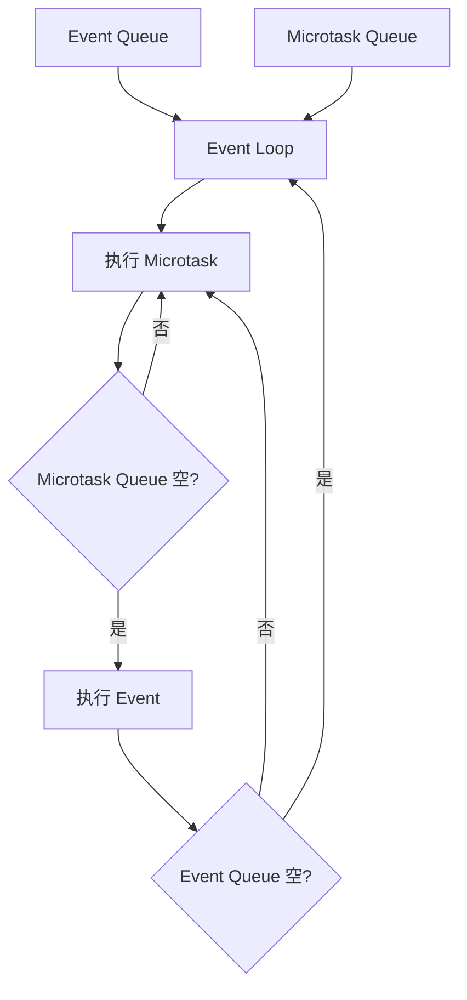

# Flutter Dart Isolate 并发模型

[toc]

## 概念总览

准确的说法是：**Dart 的每个 Isolate 内部是单线程的**——一个 Isolate 里的所有 Dart 代码默认在同一个线程（Flutter 中即主 isolate 所在线程）上顺序执行。这意味着任何 CPU 密集型计算都会阻塞 UI，导致掉帧和卡顿。但多个 Isolate 之间可以真正并行（跑在不同 CPU 核上），所以 Dart 并非"没有并行能力"，只是并行单元是 Isolate 而不是线程。

Isolate 是 Dart 解决这个问题的核心机制：**一个拥有独立堆内存和事件循环的 Dart 执行环境**。它不共享可变内存，而是通过消息传递（Message Passing）通信，本质上是 Actor 并发模型在 Dart 中的实现。

> 关于事件循环、微任务队列与 async/await 的调度细节，可参考官方文档：[Concurrency in Dart](https://dart.dev/language/concurrency)。

在 Flutter 中需要区分两个层面的"多线程"：

- **Engine 层的 C++ 线程**：Platform Thread、UI Thread、Raster Thread、IO Thread——这些由 Engine 管理，不是 Dart Isolate（Flutter 3.29 起 UI 线程正逐步并入 Platform Thread，见 1.6 节）
- **Dart 层的 Isolate**：由 `Isolate.spawn`、`compute()` 等创建，是 Dart 代码级别的并发单元

两者不在同一层面，不要混淆。根 Isolate 运行在 Engine 提供的线程上，子 Isolate 则由 Dart VM 自己的线程池调度；Dart 代码无法直接操作 Engine 的 C++ 线程。

---

## 一、为什么需要 Isolate

### 1.1 Dart 是单线程模型

Dart 的执行模型是**单线程 + 事件循环（Event Loop）**：



每次从 Event Queue 取出一个事件执行，执行完毕后检查 Microtask Queue 是否为空，清空微任务后再处理下一个事件。所有 Dart 代码都在这个循环里运行。

### 1.2 单线程的限制

单线程带来的直接后果是：**同步的 CPU 密集型计算会阻塞整个事件循环**。

```dart
// ❌ 这段代码会阻塞 UI 线程
void onButtonPressed() {
  // 假设这个计算需要 500ms
  final result = heavyComputation();
  print(result);
  // 在这 500ms 内，UI 完全冻结，用户无法交互
}
```

Flutter 要求每帧（约 16.67ms @ 60fps）内完成所有 Dart 侧工作（build、layout、paint）。如果同步计算超过 16ms，就会掉帧。

### 1.3 Isolate 的本质

Isolate 是 Dart 中"隔离的执行环境"的简称。每个 Isolate 拥有：

| 资源 | 说明 |
|------|------|
| 独立的堆内存（Heap） | 可变对象不与其他 Isolate 共享 |
| 独立的事件循环（Event Loop） | 有自己的 Event Queue 和 Microtask Queue |
| 独立的 GC（垃圾回收器） | 各自回收各自的堆 |
| 独占的执行线程 | 同一时刻一个 Isolate 的代码只在一个线程上运行；底层 OS 线程来自 Dart VM 的线程池，会被多个 Isolate 复用 |

名字中的 "Isolate"（隔离）正是对这一设计的精确描述：**内存完全隔离，不共享状态**。

### 1.4 Isolate vs Thread

这是最容易混淆的一点：

| 特性 | Thread（线程） | Isolate（隔离区） |
|------|---------------|------------------|
| 内存模型 | 共享内存 | 完全隔离 |
| 通信方式 | 直接读写共享变量 + 锁/互斥 | 消息传递（SendPort / ReceivePort） |
| 并发问题 | 竞态条件、死锁、数据竞争 | 无竞态（无共享状态） |
| GC | 通常共享 GC 或需要暂停所有线程 | 各自独立 GC |
| 开销 | 创建开销较小 | 相对较大（独立堆、GC；同 Group 内已大幅优化，见 1.5 节） |
| 适合场景 | 需要共享大量数据的并行计算 | 需要安全并发的独立任务 |

Isolate 的设计哲学是：**通过消除共享来消除并发问题**。你不需要锁、不需要互斥量、不需要原子操作——因为根本没有共享状态。代价是通信必须通过消息传递和序列化。

### 1.5 Dart VM 的 Isolate 实现

在 Dart VM 层面，一个 Isolate 的内部结构大致如下：

```
┌─────────────────────────────────────────────┐
│                  Isolate                     │
│  ┌───────────┐  ┌───────────┐               │
│  │  Heap     │  │  Heap     │  (Old / New)  │
│  └───────────┘  └───────────┘               │
│  ┌───────────┐  ┌───────────────────────┐   │
│  │ Event     │  │ Microtask            │   │
│  │ Queue     │  │ Queue                │   │
│  └───────────┘  └───────────────────────┘   │
│  ┌───────────┐  ┌───────────┐               │
│  │ GC        │  │ Zone     │               │
│  │ (独立)     │  │ (独立)    │               │
│  └───────────┘  └───────────┘               │
│  ┌───────────────────────────────┐          │
│  │ 线程 (OS Thread)              │          │
│  └───────────────────────────────┘          │
└─────────────────────────────────────────────┘
```

每个 Isolate 在 Dart VM 中是一个独立的执行单元，拥有上述所有资源。VM 负责线程分配和 Isolate 调度。

**Isolate Group：共享堆的 Isolate 组（Dart 2.15+）**。这是理解现代 Dart Isolate 行为的关键：

- 通过 `Isolate.spawn` 创建的 Isolate 与创建者属于**同一个 Isolate Group**；`Isolate.spawnUri` 创建的则属于新的 Group
- 同组 Isolate 共享一个托管堆（managed heap）：代码、内部数据结构、不可变对象（如字符串字面量）在组内共享，因此 spawn 同组 Isolate 非常轻量——官方数据是比旧版快 **100 倍以上**、内存占用低 **10~100 倍**
- **可变对象仍然不允许跨 Isolate 共享**，消息传递依旧是"拷贝/转移"语义（例外：`Isolate.exit` 可以在同组内直接转移结果对象，见文末补充）
- 消息传递规则也与 Group 相关：同组内几乎可以发送任意对象，跨组只能发送基本类型（详见第二节）

> 这解释了一个常见疑惑：既然"内存完全隔离"，为什么传一个自定义对象不用序列化成 JSON？因为隔离的是**可变状态**，而不是物理内存——同组 Isolate 共享堆，VM 只需保证发送的消息对象被复制（或转移），接收方拿到的永远是自己的私有副本。

官方说明见 [dart.dev - Performance and isolate groups](https://dart.dev/language/concurrency#performance-and-isolate-groups) 与 [Dart 2.15 发布公告](https://dart.dev/blog/announcing-dart-2-15)。

### 1.6 Flutter 中的多线程（Engine C++ 线程）

在 Flutter Engine 层面，有几个关键的 C++ 线程。它们是 Engine 内部概念，**不是 Dart Isolate**：

| 线程 | 职责 | 与 Dart Isolate 的关系 |
|------|------|----------------------|
| **Platform Thread** | 宿主平台主线程，处理原生生命周期、输入事件、插件回调 | 根 Isolate 的 Dart 代码运行在此线程上（3.29 起逐步与 UI 线程合并，见下） |
| **UI Thread** | 执行 Dart 代码、执行 build / layout / paint，生成 layer tree | 旧模型中根 Isolate 绑定到此线程；现已逐步并入 Platform Thread |
| **Raster Thread** | 栅格化 layer tree，调用 Skia / Impeller | 不运行 Dart 代码 |
| **IO Thread** | 图片解码、纹理上传等耗时 I/O | 不运行 Dart 代码 |

**重要版本变化：UI 线程与平台线程的合并**。Flutter 正在把 UI 线程并入平台线程（合并后 UI 线程被移除，根 Isolate 的 Dart 代码直接运行在原生平台主线程上），目的是让 Dart 能通过 FFI 同步调用平台 API、消除两个线程间消息往返的延迟与一致性问题：

| 平台 | 默认合并的版本 |
|------|--------------|
| iOS / Android | Flutter 3.29 |
| macOS / Windows | Flutter 3.35 |
| Linux | Flutter 3.41 |

（Raster 与 IO 线程保持独立。）官方说明见 [Flutter architectural overview](https://docs.flutter.dev/resources/architectural-overview) 与 [merged threads 迁移指南](https://docs.flutter.dev/release/breaking-changes/macos-windows-merged-threads)。

关键结论：**Engine 的这几个 C++ 线程中，只有根 Isolate 所在的那个线程运行 Dart 代码**；`Isolate.spawn` / `compute()` 创建的子 Isolate 由 Dart VM 自己的线程池调度，跑在 VM 管理的线程上，不占用 Engine 的 4 个线程。要在 Dart 层实现并发，只能通过创建新的 Dart Isolate。

---

## 二、Isolate 的内存隔离机制

### 2.1 每个 Isolate 拥有的独立资源

当通过 `Isolate.spawn` 手动创建一个新的 Isolate 时（`compute()` / `Isolate.run()` 内部同样会 spawn，只是用完即毁），它拥有：

- **独立的堆内存（Heap）**：有自己的 New Space（年轻代）和 Old Space（老年代）
- **独立的事件循环**：有独立的 Event Queue 和 Microtask Queue
- **独立的 GC**：各自进行垃圾回收，互不影响
- **独立的 Microtask Queue**：`scheduleMicrotask` 创建的微任务只在当前 Isolate 内执行
- **独立的 Zone**：每个 Isolate 有自己的 root zone

这意味着：

```dart
// 在主 Isolate 中
final myController = GetxController();
final myList = [1, 2, 3];

// 在子 Isolate 中 —— ❌ 这些全部不可访问
// myController  -> 编译都不通过（不在作用域内）
// myList         -> 无法直接传递，只能通过消息
```

### 2.2 隔离的后果

内存隔离带来的限制：

1. **不能直接访问其他 Isolate 的对象**：没有共享内存，没有全局引用
2. **不能共享内存**：没有 `shared_ptr`、没有 `unsafe` 指针、没有 `volatile`——Dart 根本不提供跨 Isolate 的内存共享原语（特殊 API 除外）
3. **对象传递需要拷贝**：从一个 Isolate 发送对象到另一个 Isolate 时，对象图会被复制（或转移）过去，接收方拿到的是独立副本

### 2.3 对象传递的序列化规则

Isolate 间传递消息时，Dart VM 对不同类型有不同处理方式。规则按发送方与接收方是否在同一个 Isolate Group 而不同（`Isolate.spawn` 创建的同组、`spawnUri` 创建的跨组）：

**同一个 Isolate Group 内（`Isolate.spawn`，最常见的场景）**——几乎可以发送任意对象：

| 类型 | 处理方式 | 说明 |
|------|---------|------|
| `null`、`bool`、`int`、`double`、`String` | 直接可用 | 不可变对象，VM 会共享而非复制 |
| `SendPort` | 特殊处理 | 跨 Isolate 传递后仍可用，用于建立回信通道 |
| `Capability` | 特殊处理 | 用于 pause/resume 等权限控制 |
| `TransferableTypedData` | 零拷贝转移（Dart 2.3.2+ 引入） | 转移后发送方的包装对象不可再用（见第五节） |
| `List` / `Map` / `Set` | 递归复制 | 逐层深拷贝，元素也必须可发送 |
| **自定义类实例** | **深拷贝（Dart 2.15+）** | 对象图会被完整复制到接收方，接收方拿到的是独立副本 |
| 闭包 / 函数对象 | 复制（Dart 2.15+） | 连同捕获的上下文一起复制（有隐式捕获风险，见 3.3 节） |
| `StackTrace` 对象 | 复制（Dart 2.15+） | — |

**不可发送的例外**（无论是否同组）：携带 native 资源的对象（如打开的 `Socket`、`File` 句柄）、`ReceivePort`、`Finalizer` / `NativeFinalizer`、`DynamicLibrary`（FFI）、以及被 `@pragma('vm:isolate-unsendable')` 标记的类的实例。发送它们会在运行时报 `Illegal argument in isolate message` 之类的错误。

**跨 Isolate Group（`spawnUri`）**——只能发送"到处都能发"的基本类型：`null`、`bool`、`int`、`double`、`String`、由字面量或标准构造器创建的 `List` / `Map` / `Set`、`TransferableTypedData`、`Capability`、`SendPort`，以及描述上述类型的 `Type` 对象。自定义类实例**不可**跨组发送——因为它属于发送方 Group 的代码，目标 Isolate 没有这个类。

**关于自定义对象**：

```dart
class User {
  final String name;
  final int age;
  User(this.name, this.age);
}

// ✅ 同 Group（Isolate.spawn / compute / Isolate.run）：直接发送即可，VM 深拷贝
sendPort.send(user);
final user2 = await compute(_cloneUser, user); // 子 Isolate 收到的是独立副本

// ❌ 跨 Group（spawnUri）或对象内含 native 资源：只能手动序列化为 Map/List
final message = {'name': user.name, 'age': user.age};
```

> 记忆点：**能发的前提是"接收方认识这个对象"且"对象不攥着 native 资源"**。日常开发里 `compute()` / `Isolate.spawn` 都是同 Group，直接发即可；只有跨 Group 或想让消息与具体类解耦（比如发给由 `spawnUri` 启动的通用 worker）时才需要拆成 Map。

### 2.4 为什么不能共享对象引用

注意精确表述：同一 Isolate Group 内的 Isolate **确实共享同一个堆**，但只共享代码和不可变对象；**可变对象**绝不允许被两个 Isolate 同时引用——这是设计选择，更是 GC 安全性的要求。如果两个 Isolate 可以持有同一个可变对象的引用，那么：

- GC 无法独立回收——需要跨 Isolate 的 GC 协调（Stop-The-World）
- 移动式 GC 无法安全工作——一个 Isolate 正在用的对象可能被另一个 Isolate 的 GC 移走
- 内存可见性问题——类似多线程中 cache coherency 的困难

Dart 通过完全隔离彻底消除了这些复杂性。

---

## 三、Isolate.spawn 使用模式

### 3.1 Isolate.spawn 基本用法

```dart
import 'dart:isolate';

// 顶层函数 —— entryPoint 推荐使用顶层函数或静态方法
void isolateEntry(SendPort sendPort) {
  // 在子 Isolate 中执行
  final result = heavyComputation();
  sendPort.send(result);
}

Future<void> main() async {
  final receivePort = ReceivePort();

  // 创建子 Isolate
  await Isolate.spawn(isolateEntry, receivePort.sendPort);

  // 等待子 Isolate 的结果
  final result = await receivePort.first;
  print('计算结果: $result');
}
```

### 3.2 Isolate.spawnUri

`Isolate.spawnUri` 可以从独立的 Dart 文件创建 Isolate，适用于模块化场景：

```dart
// worker.dart
import 'dart:isolate';

void main(List<String> args, SendPort sendPort) {
  final input = args.first;
  final result = _process(input);
  sendPort.send(result);
}

String _process(String input) {
  // 复杂处理逻辑
  return input.toUpperCase();
}
```

```dart
// main.dart
import 'dart:isolate';

Future<void> main() async {
  final receivePort = ReceivePort();
  await Isolate.spawnUri(
    Uri.file('worker.dart'),
    ['hello world'],  // args
    receivePort.sendPort,  // message
  );
  final result = await receivePort.first;
  print(result); // HELLO WORLD
}
```

> 注意：`spawnUri` 在 Flutter 中不太常用，因为 Flutter 的构建系统不会自动把 worker.dart 打包进去。更常见的做法是用 `Isolate.spawn` + 顶层函数。

### 3.3 entryPoint 的签名要求

`Isolate.spawn` 的 `entryPoint` 参数必须是**能用单个位置参数调用**的函数——最典型的就是顶层函数或静态方法：

```dart
// ✅ 顶层函数（推荐）
void topLevelEntry(SendPort sendPort) { }

// ✅ 静态方法（推荐）
class Worker {
  static void staticEntry(SendPort sendPort) { }
}
```

**闭包从 Dart 2.15 起也可以作为 entryPoint**（同 Group 内闭包可被复制到子 Isolate），但官方不推荐，原因如下：

```dart
// ⚠️ 可以运行，但有隐患（Dart 2.15+）
Future<void> main() async {
  final bigCache = loadHugeCache(); // 闭包没有用到它
  final port = ReceivePort();
  await Isolate.spawn((SendPort sendPort) {
    sendPort.send('done');
  }, port.sendPort);
  print(await port.first); // done
  port.close();
}
```

- 由于 Dart VM 对闭包捕获上下文的实现方式，闭包可能**隐式携带比预期更多的状态**（包括没被用到的变量），导致多余的拷贝、内存浪费，甚至因为拖进了不可发送对象而在运行时失败（跟踪 issue：[dartbug.com/36983](http://dartbug.com/36983)）
- 顶层函数 / 静态方法不捕获任何上下文，行为完全可控，也让 `Isolate.run` / `compute` 的调试名（debugName）更清晰

所以实践准则是：**entryPoint 用顶层函数或静态方法，把所有需要的数据放进 message 里传过去**——这既是老版本 Dart 的硬性要求，也是新版本下的最佳实践。

### 3.4 生命周期管理

Isolate 提供了完整的生命周期管理 API：

**监听退出**：

```dart
void main() async {
  final receivePort = ReceivePort();
  final exitPort = ReceivePort();

  final isolate = await Isolate.spawn(entryPoint, receivePort.sendPort);

  // 监听 Isolate 退出（不指定 response 时，收到的消息默认是 null）
  exitPort.listen((message) {
    print('Isolate 已退出，收到消息: $message'); // null
    exitPort.close();
  });
  isolate.addOnExitListener(exitPort.sendPort);

  // 也可以在注册时指定响应消息，这样收到的就是 'worker-done' 而不是 null
  // isolate.addOnExitListener(exitPort.sendPort, response: 'worker-done');
}
```

**监听错误**：

```dart
void main() async {
  final receivePort = ReceivePort();
  final errorPort = ReceivePort();

  final isolate = await Isolate.spawn(
    entryPoint,
    receivePort.sendPort,
    errorsAreFatal: false,  // 错误不会导致整个 app 崩溃
    onError: errorPort.sendPort,
  );

  errorPort.listen((errorPair) {
    final error = errorPair[0];       // 错误对象
    final stackTrace = errorPair[1];  // 堆栈信息
    print('子 Isolate 出错: $error\n$stackTrace');
  });
}
```

**终止 Isolate**：

```dart
// 优先级参数
isolate.kill(priority: Isolate.immediate);       // 立即终止
isolate.kill(priority: Isolate.beforeNextEvent); // 在下一个事件前终止（默认）
```

**暂停与恢复**：

暂停和恢复需要用同一个 `Capability` 作为"凭证"——`resume()` 必须传入当初 `pause()` 时使用的凭证（`pause()` 省略参数时会新建并返回一个凭证，注意接住它）：

```dart
// 用同一个 Capability 配对 pause / resume
final resumeCapability = isolate.pause(); // 暂停并返回凭证
isolate.resume(resumeCapability);         // 用凭证恢复

// 也可以自己创建凭证
final cap = Capability();
isolate.pause(cap);
isolate.resume(cap);
```

### 3.5 完整的双向通信模式

双向通信是最常用的 Isolate 交互模式。核心思路是**双方各自创建 ReceivePort，并交换 SendPort**：

```
Main Isolate                          Child Isolate
    │                                      │
    │  1. 创建 receivePortA                 │
    │  2. spawn(entryPoint, sendPortA) ──→  │
    │                                      │  3. 创建 receivePortB
    │                                      │  4. 通过 sendPortA 发送 sendPortB
    │  ←─── sendPortB ────────────────────  │
    │  5. 通过 sendPortB 发送任务请求 ────→  │
    │                                      │  6. 处理任务
    │  ←─── 发送处理结果 ─────────────────  │
    │  7. 通过 sendPortB 发送更多请求 ──→   │
    │          ...                          │
```

完整代码示例：

```dart
import 'dart:isolate';

/// 子 Isolate 的 entryPoint
void workerEntry(SendPort mainSendPort) {
  final workerReceivePort = ReceivePort();

  // 第一步：把子 Isolate 的 SendPort 发回主 Isolate
  mainSendPort.send(workerReceivePort.sendPort);

  // 监听来自主 Isolate 的消息
  workerReceivePort.listen((message) {
    if (message == 'shutdown') {
      workerReceivePort.close();
      return;
    }

    // 处理请求，格式: {'id': 请求id, 'type': 'compute', 'n': 42}
    if (message is Map<String, dynamic>) {
      final id = message['id'] as int; // 回传 id，主 Isolate 靠它匹配请求
      final type = message['type'] as String;
      switch (type) {
        case 'fibonacci':
          final n = message['n'] as int;
          final result = _fibonacci(n);
          mainSendPort.send({'id': id, 'type': 'result', 'value': result});
          break;
        case 'prime':
          final n = message['n'] as int;
          final result = _isPrime(n);
          mainSendPort.send({'id': id, 'type': 'result', 'value': result});
          break;
      }
    }
  });
}

int _fibonacci(int n) {
  if (n <= 1) return n;
  var a = 0, b = 1;
  for (var i = 2; i <= n; i++) {
    final temp = a + b;
    a = b;
    b = temp;
  }
  return b;
}

bool _isPrime(int n) {
  if (n < 2) return false;
  for (var i = 2; i * i <= n; i++) {
    if (n % i == 0) return false;
  }
  return true;
}
```

主 Isolate 侧：

```dart
import 'dart:isolate';

class WorkerClient {
  Isolate? _isolate;
  SendPort? _sendPort;
  final _responsePort = ReceivePort();
  final _completers = <int, Completer<dynamic>>{};
  int _requestId = 0;

  Future<void> start() async {
    final mainReceivePort = ReceivePort();

    _isolate = await Isolate.spawn(workerEntry, mainReceivePort.sendPort);

    // 等待子 Isolate 发回它的 SendPort
    _sendPort = await mainReceivePort.first as SendPort;

    // 监听子 Isolate 的响应
    _responsePort.listen((message) {
      if (message is Map<String, dynamic>) {
        final id = message['id'] as int;
        final completer = _completers.remove(id);
        completer?.complete(message['value']);
      }
    });
  }

  /// 发送 Fibonacci 计算请求
  Future<int> fibonacci(int n) async {
    final id = _requestId++;
    final completer = Completer<int>();
    _completers[id] = completer;

    _sendPort!.send({
      'id': id,
      'type': 'fibonacci',
      'n': n,
    });

    return completer.future;
  }

  /// 发送素数判断请求
  Future<bool> isPrime(int n) async {
    final id = _requestId++;
    final completer = Completer<bool>();
    _completers[id] = completer;

    _sendPort!.send({
      'id': id,
      'type': 'prime',
      'n': n,
    });

    return completer.future;
  }

  Future<void> dispose() async {
    _sendPort?.send('shutdown');
    _isolate?.kill();
    _responsePort.close();
  }
}
```

使用：

```dart
void main() async {
  final worker = WorkerClient();
  await worker.start();

  // 并发发送多个请求
  final results = await Future.wait([
    worker.fibonacci(40),
    worker.isPrime(999983),
    worker.fibonacci(50),
  ]);

  print('fib(40) = ${results[0]}');     // 102334155
  print('isPrime(999983) = ${results[1]}'); // true
  print('fib(50) = ${results[2]}');     // 12586269025

  await worker.dispose();
}
```

> 上面的 `WorkerClient` 用 `id` 字段来匹配请求和响应：每次请求递增 `_requestId`，子 Isolate 在响应中原样回传 `id`，主 Isolate 据此找到对应的 `Completer` 并完成它。这是 Isolate 双向通信里最常见的 Request-Response 模式。

---

## 四、compute() 使用模式

### 4.1 compute() 的本质

`compute()` 是 Flutter Foundation 库提供的便利函数（位于 `package:flutter/foundation.dart`）。自 Flutter 3.7 起，它在原生平台上的实现就是一行对 `Isolate.run()` 的调用（源码见 `flutter/lib/src/foundation/_isolates_io.dart`）：

```dart
// Flutter 3.7+ compute() 的真实实现（节选）
Future<R> compute<M, R>(ComputeCallback<M, R> callback, M message,
    {String? debugLabel}) async {
  debugLabel ??= kReleaseMode ? 'compute' : callback.toString();
  // 内部就是 Isolate.run，debugLabel 用于在 DevTools 里标识这个 Isolate
  return Isolate.run<R>(() => callback(message), debugName: debugLabel);
}
```

`Isolate.run()` 是 Dart 2.19+ 提供的 API，它做了以下事情：

1. 创建一个新的 Isolate（与当前 Isolate 同 Group，很轻量）
2. 在新 Isolate 中执行传入的计算函数（可以是闭包）
3. 计算完成后通过 `Isolate.exit()` 把结果**零拷贝地移交**给调用方（见文末补充节）
4. 子 Isolate 随即自动销毁，出错时错误会原样抛给调用方

一个平台差异需要注意：**在 Web 平台上 `compute()` 不会创建 Isolate**，而是直接在当前事件循环里同步执行 callback——因为 Web（dart2js/DDS）不支持 Isolate。API 文档见 [api.flutter.dev - compute](https://api.flutter.dev/flutter/foundation/compute.html)。

### 4.2 compute() 的限制

| 限制 | 说明 |
|------|------|
| callback / message / 返回值必须可发送 | Flutter 3.7+ 的 `compute` 基于 `Isolate.run`，闭包也可以直接用；但闭包会隐式捕获上下文，最佳实践仍是顶层函数或静态方法 |
| 只能传入一个参数 | `compute(callback, message)` 只有一个 message 参数，多参数需要封装成对象或 Record（如 `(a, b)`） |
| 无法双向通信 | 只有一次调用 → 返回，不能多次交互 |
| 不适合长时间运行的任务 | 每次调用都创建/销毁 Isolate，有额外开销 |

### 4.3 compute() 的适用场景

`compute()` 适合**一次性 CPU 密集型计算**：

- 大 JSON 解析
- 图片处理（裁剪、滤镜）
- 加密/解密
- 数据排序/过滤
- 文本处理

### 4.4 代码示例：用 compute() 解析大 JSON

```dart
import 'dart:convert';
import 'package:flutter/foundation.dart';

/// 顶层函数 —— 解析 JSON 并转换为目标模型
List<UserModel> parseUsers(String jsonString) {
  final List<dynamic> jsonList = jsonDecode(jsonString);
  return jsonList.map((json) => UserModel.fromJson(json)).toList();
}

class UserModel {
  final String name;
  final String email;
  final int age;

  UserModel({
    required this.name,
    required this.email,
    required this.age,
  });

  factory UserModel.fromJson(Map<String, dynamic> json) {
    return UserModel(
      name: json['name'] as String,
      email: json['email'] as String,
      age: json['age'] as int,
    );
  }
}

// 在 UI 代码中使用
Future<void> loadUsers() async {
  final jsonString = await rootBundle.loadString('assets/large_data.json');

  // 用 compute() 在子 Isolate 中解析
  final users = await compute(parseUsers, jsonString);

  // 回到主 Isolate，更新 UI
  updateUsers(users);
}
```

### 4.5 代码示例：用 compute() 处理图片

```dart
import 'dart:typed_data';
import 'dart:ui' as ui;
import 'package:flutter/foundation.dart';

/// 顶层函数 —— 应用灰度滤镜
Uint8List applyGrayscale(Uint8List pixels) {
  final result = Uint8List(pixels.length);
  for (var i = 0; i < pixels.length; i += 4) {
    // RGBA → 灰度
    final gray = (pixels[i] * 0.299 +
                  pixels[i + 1] * 0.587 +
                  pixels[i + 2] * 0.114).round();
    result[i] = gray;     // R
    result[i + 1] = gray; // G
    result[i + 2] = gray; // B
    result[i + 3] = pixels[i + 3]; // A（保持不变）
  }
  return result;
}

// 使用
Future<Uint8List> processImage(Uint8List originalPixels) async {
  return compute(applyGrayscale, originalPixels);
}
```

### 4.6 compute() vs Isolate.spawn 何时选择

| 维度 | `compute()` | `Isolate.spawn` |
|------|------------|-----------------|
| 复杂度 | 简单，一行调用 | 需要管理端口、生命周期 |
| 通信 | 一次调用，一次返回 | 双向、多次通信 |
| 生命周期 | 自动创建/销毁 | 手动管理 |
| 适用场景 | 一次性计算 | 长时间运行的后台任务 |
| Isolate 复用 | 每次新建 | 可以保持 Isolate 持续运行 |

**经验法则**：能用 `compute()` 解决的问题就不要用 `Isolate.spawn`。只有需要多次通信或长时间运行的任务才需要手动管理 Isolate。

---

## 五、SendPort / ReceivePort 消息传递

### 5.1 ReceivePort

`ReceivePort` 是消息的接收端，它实现了 `Stream<dynamic>` 接口（可以像普通 Stream 一样使用）：

```dart
final receivePort = ReceivePort();

// 方式一：通过 listen 订阅
receivePort.listen((message) {
  print('收到消息: $message');
});

// 方式二：通过 await for
await for (final message in receivePort) {
  print('收到消息: $message');
  if (message == 'done') break;
}

// 关闭
receivePort.close();
```

关键特性：

- **FIFO 顺序**：消息按发送顺序接收
- **多来源合并**：同一个 `ReceivePort` 可以接收来自多个 `SendPort` 的消息
- **流式 API**：因为实现了 `Stream` 接口，可以使用 `map`、`where`、`take` 等流操作

### 5.2 SendPort

`SendPort` 是消息的发送端，通过 `ReceivePort.sendPort` 获取：

```dart
final receivePort = ReceivePort();
final sendPort = receivePort.sendPort;

// 发送消息
sendPort.send('hello');
sendPort.send(42);
sendPort.send({'key': 'value'});
```

关键特性：

- **异步发送**：`send()` 是非阻塞的，立即返回
- **类型安全**：可以发送任何"可发送"的 Dart 对象（规则见 2.3 节）
- **单向通道**：`SendPort` 只能发送，不能接收

### 5.3 ReceivePort.first

`ReceivePort.first` 是一个便利属性，用于只接收第一条消息后自动关闭：

```dart
final receivePort = ReceivePort();
sendPort.send('result');

// 自动等待第一条消息，然后关闭 receivePort
final result = await receivePort.first;
print(result);
```

这在只需要一次响应的场景中非常有用（比如 `compute()` 内部就是用这个模式）。

### 5.4 消息的序列化与反序列化

当通过 `SendPort.send()` 发送消息时，Dart VM 会进行序列化。不同类型的处理方式不同：

**基本类型——直接复制**：

```dart
sendPort.send(42);          // int
sendPort.send(3.14);        // double
sendPort.send(true);        // bool
sendPort.send('hello');     // String
sendPort.send(null);        // null
```

这些类型在 Dart VM 内部是固定大小的值类型，复制开销很小。

**SendPort / ReceivePort——特殊处理**：

```dart
// 在子 Isolate 中创建，发送给主 Isolate
final childReceivePort = ReceivePort();
mainSendPort.send(childReceivePort.sendPort);
// sendPort 对象本身不是"复制"的，而是建立了一个跨 Isolate 的通信通道
```

**TransferableTypedData——零拷贝传输（Dart 2.3.2+）**：

对于大型 `TypedData`（如图片的像素数据），普通的 `send()` 会完整复制数据，这可能非常耗时。`TransferableTypedData` 提供了**零拷贝**的传输方式：

```dart
import 'dart:typed_data';
import 'dart:isolate';

// 发送方
void sender(SendPort sendPort) {
  final largeData = Uint8List(1024 * 1024 * 10); // 10MB
  // ... 填充数据 ...

  // 用 TransferableTypedData 包装（包装本身耗时与字节数成正比）
  final transferable = TransferableTypedData.fromList([largeData]);
  sendPort.send(transferable);

  // ⚠️ 发送后，transferable 这个"包装对象"不可再用：
  // 再调用 transferable.materialize() 会抛出
  // "Attempt to materialize object that was transferred already"
  // （源 largeData 本身不受影响，仍可正常读写）
}

// 接收方
void receiverMain() async {
  final receivePort = ReceivePort();
  await Isolate.spawn(sender, receivePort.sendPort);

  final message = await receivePort.first;
  if (message is TransferableTypedData) {
    // materialize() 解包得到 ByteBuffer，再用 asUint8List() 取数据
    final bytes = message.materialize().asUint8List();
    print('接收到 ${bytes.length} 字节'); // 10485760
  }
}
```

`TransferableTypedData` 的工作原理：

1. 创建时拷贝一份字节数据并包装（耗时与字节数成正比）
2. 通过 `SendPort.send()` 发送时，VM **直接转移内存所有权**，发送耗时是常数（O(1)）
3. 转移后，发送方的 `TransferableTypedData` 包装对象失效——再次 `materialize()` 会抛异常；源 `TypedData` 不受影响
4. 接收方通过 `materialize()` 解包（每个 transferable 只能解包一次），得到字节数据

它的价值在于**解耦"准备数据"和"接收数据"的耗时**：让不敏感的一方（如后台 worker）承担 O(N) 的准备成本，让敏感的一方（如 UI Isolate）以 O(1) 拿到数据，避免接收端因大消息拷贝而卡帧。

**对比**：

| 方式 | 10MB 数据传输 | 发送方数据 | 说明 |
|------|-------------|-----------|------|
| `send(Uint8List)` | 接收方需 O(N) 拷贝 | 仍可用 | 完整复制，双方各有独立副本 |
| `send(TransferableTypedData)` | 接收方 O(1) 拿到 | 源数据仍可用，但包装对象失效 | 转移所有权，同一时刻只有一方能 materialize |

### 5.5 各种消息传递模式

**模式一：一次性请求-响应（单向）**

```dart
Future<int> computeInIsolate(int n) async {
  final receivePort = ReceivePort();
  await Isolate.spawn(_entry, _IsolateMessage(receivePort.sendPort, n));
  return receivePort.first as int;
}

void _entry(_IsolateMessage message) {
  final result = message.n * message.n;
  message.sendPort.send(result);
}

class _IsolateMessage {
  final SendPort sendPort;
  final int n;
  _IsolateMessage(this.sendPort, this.n);
}
```

> 注意：`_IsolateMessage` 是一个自定义类，直接作为 `Isolate.spawn` 的 message 是可以的（Dart 2.15+，同 Group 内 VM 会深拷贝对象图）——前提是它的字段（这里是 `SendPort` 和 `int`）都是可发送类型。含 native 资源或跨 Group 时才必须拆解为 Map。

**模式二：持续通信（双向，参考第三节完整示例）**

**模式三：多个 SendPort 写入同一个 ReceivePort**

```dart
final receivePort = ReceivePort();

// 创建 3 个子 Isolate，都向同一个 receivePort 发送结果
for (var i = 0; i < 3; i++) {
  Isolate.spawn(worker, receivePort.sendPort);
}

// 按完成顺序接收（不保证哪个先完成）
final results = <int>[];
await for (final message in receivePort.take(3)) {
  results.add(message as int);
}
receivePort.close(); // take(3) 只会结束流，不会自动关闭底层端口
```

---

## 六、Isolate 错误处理

### 6.1 子 Isolate 中的未捕获错误

默认情况下，子 Isolate 中的未捕获错误会导致子 Isolate **崩溃**（`errorsAreFatal` 默认为 `true`）。错误不会传播到主 Isolate，子 Isolate 会静默退出。

```dart
void buggyEntry(SendPort sendPort) {
  // 这个错误会导致子 Isolate 崩溃，主 Isolate 不会收到任何通知
  throw Exception('子 Isolate 出错了');
}
```

### 6.2 捕获子 Isolate 的错误

通过设置 `errorsAreFatal: false` 和 `onError`，可以将错误路由到主 Isolate：

```dart
import 'dart:isolate';

Future<void> safeSpawnExample() async {
  final receivePort = ReceivePort();
  final errorPort = ReceivePort();

  await Isolate.spawn(
    entryPoint,
    receivePort.sendPort,
    errorsAreFatal: false,  // 错误不会导致 app 崩溃
    onError: errorPort.sendPort,  // 错误发送到 errorPort
  );

  // 监听正常消息
  receivePort.listen((message) {
    print('正常消息: $message');
  });

  // 监听错误消息
  errorPort.listen((errorList) {
    // errorList 格式: [error, stackTrace]
    final error = errorList[0];
    final stackTrace = errorList[1];
    print('子 Isolate 错误: $error');
    print('堆栈: $stackTrace');
  });
}
```

错误消息的格式固定为长度为 2 的 List：

- `errorList[0]`：错误对象的字符串形式（`error.toString()`）
- `errorList[1]`：堆栈跟踪的字符串形式（无堆栈时为 `null`）

### 6.3 Isolate.addErrorListener 的替代方案

除了在 `spawn` 时通过 `onError` 设置，还可以在创建 Isolate 后通过 `addErrorListener` 添加：

```dart
final isolate = await Isolate.spawn(entryPoint, receivePort.sendPort);

final errorPort = ReceivePort();
isolate.addErrorListener(errorPort.sendPort);

errorPort.listen((errorList) {
  print('错误: ${errorList[0]}');
  print('堆栈: ${errorList[1]}');
});
```

两种方式效果相同，`addErrorListener` 的好处是可以在 Isolate 创建后动态添加。

### 6.4 主 Isolate 中的错误处理

在子 Isolate 的 `entryPoint` 内部，可以使用 `try-catch` 处理错误并通过 `SendPort` 通知主 Isolate：

```dart
void safeEntry(SendPort sendPort) {
  try {
    final result = riskyComputation();
    sendPort.send({'status': 'success', 'result': result});
  } catch (e, stackTrace) {
    sendPort.send({
      'status': 'error',
      'error': e.toString(),
      'stackTrace': stackTrace.toString(),
    });
  }
}

Future<void> main() async {
  final receivePort = ReceivePort();
  await Isolate.spawn(safeEntry, receivePort.sendPort);

  final response = await receivePort.first as Map<String, dynamic>;
  if (response['status'] == 'success') {
    print('结果: ${response['result']}');
  } else {
    print('错误: ${response['error']}');
    print('堆栈: ${response['stackTrace']}');
  }
}
```

### 6.5 完整的 Isolate 错误处理示例

```dart
import 'dart:isolate';

/// 子 Isolate entryPoint —— 内部处理错误并回传
void workerEntry(SendPort mainSendPort) {
  final workerPort = ReceivePort();
  mainSendPort.send(workerPort.sendPort);

  workerPort.listen((message) async {
    final requestId = message['id'] as int;
    try {
      final data = message['data'] as String;

      // 模拟可能出错的操作
      final result = jsonDecode(data);
      mainSendPort.send({'id': requestId, 'status': 'ok', 'result': result});
    } on FormatException catch (e) {
      // 已知错误：JSON 格式错误
      mainSendPort.send({
        'id': requestId,
        'status': 'error',
        'error': 'JSON 解析失败: ${e.message}',
        'code': 'PARSE_ERROR',
      });
    } catch (e, st) {
      // 未知错误
      mainSendPort.send({
        'id': requestId,
        'status': 'error',
        'error': e.toString(),
        'code': 'UNKNOWN',
        'stackTrace': st.toString(),
      });
    }
  });
}
```

---

## 七、Flutter 中的实际应用场景

### 7.1 图片解码

Flutter 内部的 `decodeImageFromList` 已经在 IO 线程执行，不会阻塞 UI 线程。但在某些场景下（如自定义图片处理），你可能需要在 Isolate 中操作：

```dart
import 'dart:typed_data';
import 'dart:ui' as ui;
import 'package:flutter/foundation.dart';

/// 在 Isolate 中对原始像素数据应用模糊效果
Uint8List applyBlur(Uint8List pixels, int width, int height, double radius) {
  // 简单的盒式模糊实现（实际项目应使用更高效的算法）
  final result = Uint8List.fromList(pixels);
  final r = radius.round();
  final div = (2 * r + 1) * (2 * r + 1);

  for (var y = r; y < height - r; y++) {
    for (var x = r; x < width - r; x++) {
      var sumR = 0, sumG = 0, sumB = 0;
      for (var dy = -r; dy <= r; dy++) {
        for (var dx = -r; dx <= r; dx++) {
          final idx = ((y + dy) * width + (x + dx)) * 4;
          sumR += result[idx];
          sumG += result[idx + 1];
          sumB += result[idx + 2];
        }
      }
      final idx = (y * width + x) * 4;
      result[idx] = (sumR / div).round();
      result[idx + 1] = (sumG / div).round();
      result[idx + 2] = (sumB / div).round();
    }
  }
  return result;
}

// 参数需要封装为可传递的对象
class BlurParams {
  final Uint8List pixels;
  final int width;
  final int height;
  final double radius;
  BlurParams(this.pixels, this.width, this.height, this.radius);
}

Future<Uint8List> blurImage(Uint8List pixels, int w, int h, double r) {
  return compute(
    (BlurParams p) => applyBlur(p.pixels, p.width, p.height, p.radius),
    BlurParams(pixels, w, h, r),
  );
}
```

> **Isolate.run()** 是 Dart 2.19+ 提供的更简洁的 API，推荐在 Dart SDK >= 2.19 时使用：

```dart
// Dart 2.19+ 的 Isolate.run
final result = await Isolate.run(() {
  return applyBlur(pixels, width, height, radius);
});
```

### 7.2 JSON 解析

大 JSON 文件的解析是 Isolate 最常见的应用场景之一：

```dart
import 'dart:convert';
import 'package:flutter/foundation.dart';

/// 顶层函数 —— 解析大 JSON 并转为模型列表
List<OrderModel> parseOrders(String jsonString) {
  final parsed = jsonDecode(jsonString) as Map<String, dynamic>;
  final orders = parsed['orders'] as List<dynamic>;
  return orders.map((o) => OrderModel.fromJson(o)).toList();
}

class OrderModel {
  final String id;
  final String productName;
  final double amount;
  final DateTime createdAt;

  OrderModel({
    required this.id,
    required this.productName,
    required this.amount,
    required this.createdAt,
  });

  factory OrderModel.fromJson(Map<String, dynamic> json) {
    return OrderModel(
      id: json['id'] as String,
      productName: json['product_name'] as String,
      amount: (json['amount'] as num).toDouble(),
      createdAt: DateTime.parse(json['created_at'] as String),
    );
  }
}

// Controller 中的使用
class OrderController extends GetxController {
  final orders = <OrderModel>[].obs;

  Future<void> loadOrders() async {
    try {
      final jsonString = await _fetchOrderJson();
      // 在子 Isolate 中解析，不阻塞 UI
      final parsed = await compute(parseOrders, jsonString);
      orders.value = parsed;
    } catch (e) {
      // 错误处理
    }
  }

  Future<String> _fetchOrderJson() async {
    // 网络/文件请求
    return '';
  }
}
```

**性能对比**（解析 10MB JSON 的典型数据）：

| 方式 | 耗时 | UI 影响 |
|------|------|---------|
| 主线程直接解析 | ~200-500ms | 严重卡顿（12-30 帧） |
| `compute()` | ~200-500ms（计算时间相同） | 无卡顿 |

> 注意：`compute()` 不会让计算变快——它只是把计算从 UI 线程移走了。总耗时相同，但 UI 不再阻塞。真正的并行加速需要多个 Isolate 同时工作。

### 7.3 加密计算

密码学运算（尤其是非对称加密）是 CPU 密集型的，适合放在 Isolate 中：

```dart
import 'dart:convert';
import 'dart:io';
import 'dart:typed_data';
import 'package:crypto/crypto.dart'; // 需要添加依赖
import 'package:flutter/foundation.dart';

/// 在 Isolate 中计算文件哈希
String computeFileHash(List<int> fileBytes) {
  final bytes = Uint8List.fromList(fileBytes);
  final sha256 = sha256.convert(bytes);
  return sha256.toString();
}

// 使用
Future<String> getFileHash(String filePath) async {
  final file = File(filePath);
  final bytes = await file.readAsBytes();
  return compute(computeFileHash, bytes);
}
```

对于特别大的文件，可以分块处理：

```dart
/// 分块计算哈希 —— 顶层函数
String computeLargeFileHash(Map<String, dynamic> params) {
  final chunks = params['chunks'] as List<Uint8List>;
  final output = AccumulatorSink<Digest>();
  final input = sha256.startChunkedConversion(output);

  for (final chunk in chunks) {
    input.add(chunk);
  }
  input.close();
  return output.events.single.toString();
}

Future<String> hashLargeFile(String filePath) async {
  final file = File(filePath);
  final chunks = <Uint8List>[];

  // openRead() 返回 Stream<List<int>>，每个事件就是一块数据
  //（块大小由 dart:io 内部决定，通常为 64KB 左右）
  await for (final chunk in file.openRead()) {
    chunks.add(Uint8List.fromList(chunk));
  }

  return compute(computeLargeFileHash, {'chunks': chunks});
}
```

### 7.4 数据库操作

数据库查询本身通常是 IO 密集型，`async/await` 已经足够。但在查询返回大量数据需要处理时，可以用 Isolate 加速：

```dart
import 'package:flutter/foundation.dart';

/// 在 Isolate 中处理大量查询结果
List<ProcessedData> processQueryResults(List<Map<String, dynamic>> rows) {
  return rows.map((row) {
    // 复杂的数据转换/聚合
    return ProcessedData(
      id: row['id'] as int,
      value: (row['value'] as num).toDouble(),
      category: row['category'] as String,
      // 更多处理...
    );
  }).toList();
}

class ProcessedData {
  final int id;
  final double value;
  final String category;
  ProcessedData({required this.id, required this.value, required this.category});
}

// sqflite 示例
Future<List<ProcessedData>> queryAndProcess(Database db, String sql) async {
  final rows = await db.rawQuery(sql);
  if (rows.length > 1000) {
    // 大量数据，用 compute 处理
    return compute(processQueryResults, rows);
  }
  return processQueryResults(rows);
}
```

> `sqflite` 本身不支持在 Isolate 中直接使用（因为它依赖 Flutter 的平台通道）。`drift`（原 moor）提供了更好的 Isolate 支持，可以在子 Isolate 中执行查询。

### 7.5 Flutter 中的 Isolate 限制

**核心限制：不能在子 Isolate 中调用 Flutter API**：

```dart
// ❌ 以下代码在子 Isolate 中会崩溃
void badEntry(SendPort sendPort) {
  // 这些全部不允许：
  WidgetsBinding.instance;      // ❌ 需要主 Isolate 的绑定
  BuildContext context;         // ❌ UI 上下文
  Navigator.of(context);        // ❌ 导航
  Theme.of(context);            // ❌ 主题
  MediaQuery.of(context);       // ❌ 媒体查询
  ScaffoldMessenger.of(context); // ❌ SnackBar
}
```

原因很简单：Flutter 的 UI 系统（Widgets、Elements、RenderObjects）全部绑定在主 Isolate 上。子 Isolate 没有这些绑定，也看不到这棵树。

**正确做法**：在子 Isolate 中完成计算，通过消息将结果发回主 Isolate，再更新 UI：

```dart
// ✅ 正确模式
void workerEntry(SendPort sendPort) {
  // 只做纯计算
  final result = heavyComputation();
  sendPort.send(result); // 发回主 Isolate
}

// 主 Isolate 中
receivePort.listen((result) {
  // 在主 Isolate 中更新 UI
  updateUI(result);
});
```

**`flutter_isolate` 包的扩展能力**：

`flutter_isolate` 是一个第三方包，允许创建可以访问 Flutter 插件（如 `SharedPreferences`）的 Isolate。但即使使用这个包，仍然不能直接操作 UI 组件。它主要用于需要在后台 Isolate 中使用平台插件（如网络请求、本地存储）的场景。

```dart
// flutter_isolate 示例（概念性代码，实际 API 可能不同）
import 'package:flutter_isolate/flutter_isolate.dart';

final isolate = await FlutterIsolate.spawn(entryPoint, message);
```

> 在大多数情况下，`compute()` 或 `Isolate.run()` 已经足够。只有需要后台常驻 + 插件访问时才考虑 `flutter_isolate`。

**平台通道（Platform Channel）与后台 Isolate**：

平台通道默认只在根 Isolate 可用：Engine 只与根 Isolate 通信，`MethodChannel` 在非根 Isolate 中会路由到 `BackgroundIsolateBinaryMessenger.instance`——若尚未初始化，这里会**直接抛 `StateError`**（错误信息会提示需要先调用 `ensureInitialized`），而不是静默失败。相关官方工具分两类，解决的是两个不同的问题：

1. **`BackgroundIsolateBinaryMessenger`（Flutter 3.7+）**：主 Isolate 先取到 `RootIsolateToken` 随消息传给子 Isolate，子 Isolate 调用 `BackgroundIsolateBinaryMessenger.ensureInitialized(token)` 注册后，就可以在子 Isolate 里**发送平台消息并接收响应**（如 `MethodChannel.invokeMethod`，绝大多数插件因此可用）。但有一个边界：`setMessageHandler` 不被支持，会抛 `UnsupportedError`——平台主动推送的消息始终只送达根 Isolate：

```dart
import 'dart:isolate';
import 'package:flutter/services.dart';

// 启动消息：token 只有根 Isolate 能取到
class BackgroundBootstrap {
  const BackgroundBootstrap({required this.replyTo, this.token});
  final SendPort replyTo;
  final RootIsolateToken? token;
}

@pragma('vm:entry-point')
void backgroundEntry(BackgroundBootstrap bootstrap) {
  // 1. 用主 Isolate 传来的 token 注册（幂等，可重复调用）
  BackgroundIsolateBinaryMessenger.ensureInitialized(bootstrap.token!);
  // 2. 注册成功后，可发送平台消息并接收响应（setMessageHandler 不支持）
  bootstrap.replyTo.send(true);
}

Future<void> startBackgroundWorker() async {
  final port = ReceivePort();
  // spawn 时把根 Isolate 的 token 作为初始消息传入
  await Isolate.spawn(
    backgroundEntry,
    BackgroundBootstrap(replyTo: port.sendPort, token: RootIsolateToken.instance),
  );
  await port.first;
  port.close();
}
```

文档见 [api.flutter.dev - BackgroundIsolateBinaryMessenger](https://api.flutter.dev/flutter/services/BackgroundIsolateBinaryMessenger-class.html)。

2. **`IsolateNameServer`（仅 Flutter 提供）**：`dart:isolate` 本身没有"跨 Isolate 全局注册表"，Flutter Engine 额外提供了 `IsolateNameServer`，允许用字符串名字注册/查找 `SendPort`，让任意 Isolate（比如新 spawn 的 worker）能找到主 Isolate 的回信端口。注意它只是一个"名字 → SendPort"的注册表，与平台通道无关，也不能让子 Isolate 获得调用插件的能力：

```dart
import 'dart:ui';

// 主 Isolate：注册端口
IsolateNameServer.registerPortWithName(mainSendPort, 'main-port');

// 任意 Isolate：按名取端口
final mainSendPort = IsolateNameServer.lookupPortByName('main-port');
```

文档见 [api.flutter.dev - IsolateNameServer](https://api.flutter.dev/flutter/dart-ui/IsolateNameServer-class.html)。

---

## 八、Isolate 调试与性能

### 8.1 DevTools 中的 Isolate 查看

在 DevTools 中可以查看当前应用的所有 Isolate：

1. 打开 DevTools（`flutter pub global run devtools` 或 IDE 集成）
2. 切换到 **CPU Profiler** 页面
3. 在顶部可以看到所有活跃的 Isolate 列表
4. 每个 Isolate 的 CPU 使用、内存占用、GC 情况都可以监控

此外，**Memory** 页面可以查看每个 Isolate 的堆内存分配情况，**Timeline** 页面可以看到各 Isolate 的事件执行时序。

### 8.2 Isolate 的创建开销

Isolate 的创建开销主要包括（下表为量级示意，实际数值依平台与设备而异）：

| 开销项 | 耗时（量级） | 说明 |
|--------|------|------|
| 创建 Isolate 对象 | ~0.1ms | 数据结构初始化 |
| 分配堆内存 | ~0.5ms | New Space + Old Space |
| 启动事件循环 | ~0.1ms | Event Queue / Microtask Queue |
| 线程调度 | ~0.5-1ms | 从 VM 线程池取用/唤醒 OS 线程 |
| 加载代码 | ~0.1ms | 同 Group 内代码共享，几乎无开销 |
| **总计** | **~1-2ms** | |

两个官方参考数据：Isolate 的基础内存开销约为 **30KB**（来自 `Isolate.spawn` 的 API 文档）；Dart 2.15 引入 Isolate Group 后，同 Group 内 spawn 新 Isolate 比旧机制快 **100 倍以上**、内存占用低 **10~100 倍**——因为代码和内部数据结构不再需要重新初始化。

另外，Dart VM 内部维护的是**线程池**（不是 Isolate 池）：Isolate 销毁后，其占用的 OS 线程会归还线程池供后续复用。Isolate 对象本身不复用，但从 Dart 代码的角度看，`Isolate.spawn` / `Isolate.run()` 在同 Group 内已经足够便宜，多数场景不需要刻意做池化。

### 8.3 消息传递的延迟

消息传递的延迟取决于数据大小（下表为量级示意，实际依设备而异；Dart 2.15 重写消息传递机制后，中小消息的收发已非常快）：

| 数据大小 | 传递延迟 | 说明 |
|---------|---------|------|
| < 1KB | ~0.01ms | 基本类型的序列化开销极小 |
| 1KB - 100KB | ~0.05-0.1ms | 主要是复制开销 |
| 100KB - 1MB | ~0.1-0.5ms | 复制时间线性增长 |
| > 1MB | ~0.5ms+ | 应考虑 `TransferableTypedData` |

### 8.4 何时用 Isolate vs 何时不该用

**适合用 Isolate 的场景**：

- CPU 密集型计算，耗时超过 16ms（一帧的时间）
- 大 JSON 解析（> 1MB）
- 图片像素处理（滤镜、缩放、裁剪）
- 加密/哈希计算
- 复杂数据结构排序/搜索

**不适合用 Isolate 的场景**：

| 场景 | 原因 | 替代方案 |
|------|------|---------|
| 网络请求 | IO 密集型，`async/await` 已足够 | `Future` / `async` / `await` |
| 文件读写 | IO 密集型 | `Future` / `async` / `await` |
| 数据库查询 | IO 密集型（通常） | `async` / `await` |
| 极短的计算（< 1ms） | Isolate 创建开销 > 计算本身 | 直接在主线程执行 |
| 简单的状态更新 | 开销不值得 | `setState` / `update()` |

**决策流程**：

```
任务是否超过 16ms？
  ├─ 否 → 直接在主线程执行
  └─ 是 → 是 IO 密集型吗？
            ├─ 是 → 用 async/await
            └─ 否 → 需要多次通信吗？
                      ├─ 否 → 用 compute()
                      └─ 是 → 用 Isolate.spawn
```

### 8.5 Isolate 池（Isolate Pool）模式

当需要频繁执行并发任务时，每次都创建/销毁 Isolate 的开销会累积。Isolate Pool 通过**预先创建多个 Isolate** 并循环利用来解决：

```
┌─────────────────────────────────────────────┐
│                  Isolate Pool                │
│                                              │
│  ┌─────────┐  ┌─────────┐  ┌─────────┐     │
│  │Isolate-0│  │Isolate-1│  │Isolate-2│     │
│  │ idle    │  │ busy    │  │ idle    │     │
│  └────┬────┘  └────┬────┘  └────┬────┘     │
│       │            │            │           │
│  ┌────┴────────────┴────────────┴────┐      │
│  │           Task Queue               │      │
│  │  [Task-A] → [Task-B] → [Task-C]   │      │
│  └───────────────────────────────────┘      │
└─────────────────────────────────────────────┘
```

简化版的 Isolate Pool 实现：

```dart
import 'dart:async';
import 'dart:isolate';

class IsolatePool {
  final int poolSize;
  final List<_Worker> _workers = [];
  final _taskQueue = <_Task>[];
  bool _isRunning = false;

  IsolatePool({this.poolSize = 4});

  Future<void> start() async {
    for (var i = 0; i < poolSize; i++) {
      final worker = _Worker();
      await worker.start();
      _workers.add(worker);
    }
    _isRunning = true;
  }

  /// 提交任务到池中
  Future<R> submit<R, P>(
    Future<R> Function(P) work,
    P param,
  ) {
    final completer = Completer<R>();
    final task = _Task(work, param, completer);

    // 尝试找一个空闲 worker
    final idleWorker = _workers.cast<_Worker?>().firstWhere(
      (w) => w?.isIdle == true,
      orElse: () => null,
    );

    if (idleWorker != null) {
      idleWorker.execute(task);
    } else {
      _taskQueue.add(task);
    }

    return completer.future;
  }

  Future<void> dispose() async {
    _isRunning = false;
    for (final worker in _workers) {
      await worker.dispose();
    }
  }
}

class _Task {
  final Function work;
  final dynamic param;
  final Completer completer;
  _Task(this.work, this.param, this.completer);
}

class _Worker {
  Isolate? _isolate;
  SendPort? _sendPort;
  final _receivePort = ReceivePort();
  Completer<dynamic>? _currentCompleter;
  bool isIdle = true;

  Future<void> start() async {
    _isolate = await Isolate.spawn(
      _workerEntry,
      _receivePort.sendPort,
    );
    _sendPort = await _receivePort.first as SendPort;

    // 监听 worker 的响应
    _receivePort.listen((message) {
      if (message is Map<String, dynamic> && message['type'] == 'result') {
        _currentCompleter?.complete(message['value']);
        _currentCompleter = null;
        isIdle = true;
      }
    });
  }

  void execute(_Task task) {
    isIdle = false;
    _currentCompleter = task.completer;
    _sendPort!.send(task.param);
  }

  Future<void> dispose() async {
    _isolate?.kill();
    _receivePort.close();
  }
}

/// Pool 中 worker 的 entryPoint —— 这里简化处理，实际需要更复杂的协议
void _workerEntry(SendPort mainSendPort) {
  final workerPort = ReceivePort();
  mainSendPort.send(workerPort.sendPort);

  workerPort.listen((param) {
    // 注意：Dart 2.15+ 闭包其实可以跨 Isolate 传递（会连同捕获上下文一起复制），
    // 但上面 execute() 只发送了 task.param、没有发送 work 函数——
    // 实际实现要么把 work 一起发过来，要么传入一个标识符来选择要执行的函数
    // 这里仅为示意
    final result = someWork(param);
    mainSendPort.send({'type': 'result', 'value': result});
  });
}

dynamic someWork(dynamic param) {
  // 实际的处理逻辑
  return null;
}
```

> **实际项目中**，Isolate Pool 的实现需要考虑更多细节：任务类型分发、错误处理、池大小动态调整、优雅关闭等。生产环境中可以考虑使用现成的包（如 `pool` + `compute`）。

---

## 常见误区

### 1. "Isolate 就是线程"

不对。Isolate 是**执行环境**（独立堆 + 事件循环 + GC），线程只是它运行所依赖的资源：一个 Isolate 同一时刻只在一个线程上执行，而 OS 线程来自 VM 线程池、可被多个 Isolate 先后复用。Thread 共享进程内存，Isolate 不共享可变状态。Isolate 的隔离性是核心设计，不是实现细节。

### 2. "compute() 会自动复用 Isolate"

`compute()` 每次调用都会创建新的 Isolate（通过 `Isolate.run()`），执行完毕后销毁。Isolate 对象本身不复用，但其底层 OS 线程会归还 Dart VM 的线程池供后续 spawn 使用；且同 Group 内创建 Isolate 本身就很轻量。从 Dart 代码的角度看，每次都是独立的 Isolate。

### 3. "在子 Isolate 中可以直接操作 UI"

绝对不行。Flutter 的 UI 系统绑定在主 Isolate，子 Isolate 只能做纯计算，结果通过消息传回。

### 4. "Isolate 间传递自定义对象很方便 / 很麻烦"

两种极端都不准确。Dart 2.15+ 在同一个 Isolate Group 内（`Isolate.spawn` / `compute` / `Isolate.run`）**可以直接发送自定义对象**，VM 会深拷贝整个对象图，不需要手动转 Map——但要注意对象图里不能含 native 资源（打开的文件、Socket 等）。反过来，"能直接发"不等于"随便发"：发送大对象图照样有拷贝成本，跨 Group（`spawnUri`）时自定义类依然发不了。另外，`entryPoint` 不推荐用闭包不是因为"闭包无法序列化"（2.15+ 可以），而是闭包可能隐式捕获大量非预期状态。

### 5. "用 Isolate 处理网络请求可以提升性能"

网络请求是 IO 密集型，`async/await` 已经是非阻塞的。使用 Isolate 处理网络请求反而增加了序列化开销。只有网络返回后的大数据处理才需要 Isolate。

### 6. "async/await 创建了新的线程"

`async/await` 只是语法糖：编译器把它编译成基于 `Future` 的状态机，由 Event Loop 和微任务队列调度，不涉及线程切换。**同一个 Isolate 内**的 Dart 代码始终单线程执行——`await` 期间的"并发"只是事件循环在等待间隙处理别的事件，任何时刻都只有一段代码在跑。只有 `Isolate` 才是真正的并行执行。

### 7. "Isolate 越多越好"

每个 Isolate 都有独立的堆和 GC，创建太多 Isolate 会增加内存开销和 GC 压力。通常 2-4 个 Isolate 足以处理大部分场景。

---

## 面试问法/性能点

### 常见面试问法

1. Dart 的并发模型是什么？和 Java/C# 的线程模型有什么区别？
2. 什么是 Isolate？为什么叫"隔离"？
3. Isolate 和 Thread 的区别是什么？各自适合什么场景？
4. `compute()` 的原理是什么？有什么限制？
5. Isolate 间如何通信？为什么不能共享内存？
6. `SendPort` 和 `ReceivePort` 是什么？消息传递的顺序有保证吗？
7. 什么是 `TransferableTypedData`？它解决了什么问题？
8. 子 Isolate 中抛出未捕获异常会怎样？如何处理？
9. 为什么不能在子 Isolate 中调用 Flutter API？
10. 什么时候该用 Isolate，什么时候用 `async/await` 就够了？
11. 如何实现 Isolate 池？它的优势是什么？

### 性能点

- **UI 卡顿**：CPU 密集型计算在主 Isolate 执行超过 16ms 会导致掉帧，应移到子 Isolate
- **大 JSON 解析**：使用 `compute()` 将解析工作移到子 Isolate
- **图片处理**：大量像素操作（滤镜、裁剪）应在 Isolate 中完成
- **Isolate 创建开销**：约 1-2ms，短任务不适合用 Isolate
- **消息传递延迟**：基本类型几乎无开销，大对象需要考虑 `TransferableTypedData`
- **内存隔离**：每个 Isolate 有独立堆，避免创建过多 Isolate 导致内存压力
- **GC 独立**：子 Isolate 的 GC 不会暂停主 Isolate，这是内存隔离的一个重要优势

---

## 补充：Isolate.run()（Dart 2.19+）

Dart 2.19 引入了 `Isolate.run()`，它是对 `Isolate.spawn` + `ReceivePort` 的简化封装：

```dart
// 之前的方式
Future<int> doWork() async {
  final port = ReceivePort();
  await Isolate.spawn(_entry, port.sendPort);
  return await port.first;
}
void _entry(SendPort port) {
  port.send(42);
}

// Dart 2.19+ 的方式
Future<int> doWork() {
  return Isolate.run(() => 42);
}
```

`Isolate.run()` 的特点：

- 接受一个函数（可以是闭包），在新的 Isolate 中执行
- 自动处理 SendPort/ReceivePort 的创建和销毁
- 执行完毕后自动销毁 Isolate
- 子 Isolate 中的未捕获错误会以同样的异常抛给调用方（内部用 `onError` / `onExit` 监听实现）
- **注意**：闭包会被捕获并在子 Isolate 中执行，但这要求闭包只引用可跨 Isolate 传递的值

**为什么 `Isolate.run()` 回传大结果也很高效：`Isolate.exit()`**。`run()` 的最后一步不是普通的 `send()`，而是调用 `Isolate.exit(port, result)`——它同步终止当前 Isolate，并把 `result` 作为这个 Isolate 的最后一条消息发出。对原生端口，VM 会把结果的对象图**直接移交给接收方而不复制**（接收方常数时间拿到）。这解决了 worker 返回大 JSON 图时"深拷贝比计算还慢"的问题：

```dart
// 手写 spawn 时也可以显式使用 exit
void workerEntry(SendPort mainPort) {
  final result = heavyComputation(); // 假设是一个大对象图
  // 终止当前 Isolate，并把 result 零拷贝移交给主 Isolate
  Isolate.exit(mainPort, result);
}
```

注意 `exit` 的两个限制：`finally` 块不会执行、已调度的异步任务不会运行；目标端口所属 Isolate 必须与当前 Isolate 同 Group（`spawnUri` 创建的跨 Group 端口会抛错）。文档见 [api.flutter.dev - Isolate.exit](https://api.flutter.dev/flutter/dart-isolate/Isolate/exit.html)。

**`compute()` 与 `Isolate.run()` 怎么选**：Flutter 3.7+ 中 `compute` 内部就是 `Isolate.run`，二者能力几乎相同——Flutter 项目里用 `compute()`（享受 web 平台的兼容降级和 Flutter 生态惯例，还能指定 `debugLabel`），纯 Dart 项目（CLI / 服务端）直接用 `Isolate.run()`。
