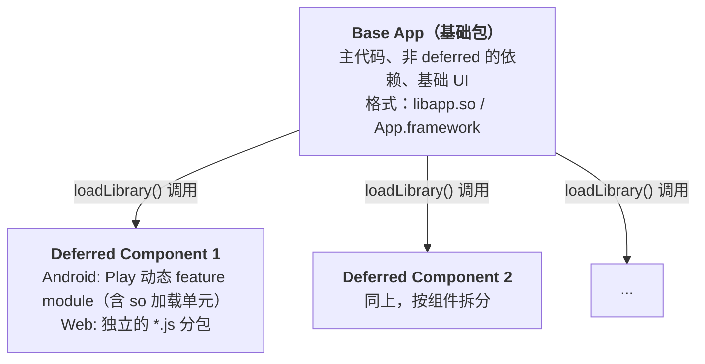

# Flutter 编译产物与包体积优化

Flutter 的编译系统将 Dart 源码转化为各平台的原生可执行代码，不同编译模式在性能、体积和调试能力上各有取舍。理解编译链路和包体积构成，是进行针对性优化的前提。

## 一、Flutter 编译模式总览

### 1.1 三种编译模式

Flutter 提供三种编译模式，覆盖从开发到生产的完整生命周期：

**Debug（JIT 模式）**

- 使用 JIT（Just-In-Time）编译，Dart 代码在运行时由 Dart VM 动态编译执行
- 支持 Hot Reload 和 Hot Restart，开发效率最高
- 包含完整的调试信息（assert 语句生效、`debugPrint` 正常输出）
- 未进行代码优化（无内联、无 Tree-shaking），体积最大
- 性能不作为目标，不能用于性能分析

**Profile（AOT 模式 + 调试能力）**

- 使用 AOT（Ahead-Of-Time）编译，Dart 代码在编译期被编译为原生机器码
- 支持 DevTools 性能分析（CPU Profiler、Memory Profiler、Network 等）
- 可通过 VM Service 连接调试工具（Observatory 已在 Dart 2.15+ 中并入 DevTools，不再是独立工具）
- **不支持** Hot Reload 和 Hot Restart
- 进行了大部分 AOT 优化（内联、常量折叠等），但不做代码混淆
- 适合在真实设备上进行性能调优

**Release（AOT 模式 + 最大优化）**

- 使用 AOT 编译，所有优化全开
- 去除所有调试信息和断言（`assert` 被完全移除）
- 最小的包体积、最快的运行时性能
- **不支持**任何调试能力（无 DevTools 连接、无 Observatory）
- 适合发布到应用商店

### 1.2 编译模式对比

| 特性 | Debug | Profile | Release |
|------|-------|---------|---------|
| **编译方式** | JIT | AOT | AOT |
| **代码优化** | 无 | 大部分优化 | 全部优化 |
| **调试信息** | 完整 | 保留部分 | 完全移除 |
| **assert 语句** | 生效 | 生效 | 移除 |
| **Hot Reload** | ✅ | ❌ | ❌ |
| **Hot Restart** | ✅ | ❌ | ❌ |
| **DevTools** | ✅ | ✅（性能分析） | ❌ |
| **启动速度** | 慢 | 快 | 最快 |
| **运行时性能** | 慢 | 快 | 最快 |
| **包体积** | 最大 | 中等 | 最小 |
| **用途** | 开发调试 | 性能分析 | 生产发布 |

### 1.3 编译命令

```bash
# Debug 模式（默认）
flutter run
flutter run --debug

# Profile 模式
flutter run --profile

# Release 模式
flutter run --release

# 构建生产包
flutter build apk --release
flutter build ios --release
flutter build web --release
```

## 二、Dart AOT 编译流程

### 2.1 完整编译链路

Flutter 的 AOT 编译将 Dart 源码逐步转化为可直接执行的机器码，完整链路如下：

```
Dart 源码 (.dart)
    │
    ▼
前端编译器 (Frontend Server)
    │  解析 → AST → 类型推断 → Kernel AST
    ▼
Kernel AST (.dill)
    │
    ▼
中间表示生成 (IL Generation)
    │  Kernel AST → SSA 形式的控制流图
    ▼
优化 Pass (Optimization Passes)
    │  内联、常量折叠、死代码消除、类型特化...
    ▼
后端代码生成 (Code Generation)
    │  IL → 机器码 (ARM/x64/AArch64)
    │  寄存器分配、指令调度
    ▼
Snapshot 序列化
    │  机器码 + 隔离堆数据 → Snapshot 文件
    ▼
平台产物
    Android: libapp.so
    iOS: App.framework/App
```

### 2.2 前端编译器（Frontend Server）

前端编译器负责将 Dart 源码转换为 Kernel AST（抽象语法树），是编译链的第一阶段。

**核心职责：**

1. **词法分析与语法解析**：将 Dart 源码解析为 AST（Abstract Syntax Tree）
2. **语义分析**：
   - 类型推断（Type Inference）：推导表达式的类型
   - 类型检查（Type Checking）：验证类型安全性
   - 常量求值（Constant Evaluation）：编译期计算常量表达式
3. **输出 Kernel AST**：生成 `.dill` 格式的 Kernel Snapshot 文件

**Hot Reload 中的增量编译：**

前端编译器在 Debug 模式下以持久进程形式运行（`frontend_server`）。它自己不监听文件系统，Flutter 工具通过进程的 stdin 把编译指令（`recompile`）下发给它：

```
用户触发（终端按 r / IDE 保存）
    → flutter_tools 扫描变更文件
    → 向 frontend_server 的 stdin 写入 recompile 指令
    → 依赖图分析（import/export 关系）
    → 只重编译受影响的库
    → 输出增量 .dill（仅包含变更部分）
```

增量编译是 Hot Reload 速度的关键——大型项目中增量编译通常只需 50-200ms，而全量编译可能需要 5-10 秒。

### 2.3 中间表示（Intermediate Representation）

Kernel AST 被转换为 SSA（Static Single Assignment）形式的中间表示，这是编译器优化的基础。

**SSA 形式的特点：**

- 每个变量只被赋值一次（单赋值），简化数据流分析
- 使用 φ（phi）节点处理控制流汇合点
- 形成控制流图（Control Flow Graph，CFG）

**优化 Pass：**

编译器在 IR 层执行一系列优化 pass，逐步提升代码质量：

| 优化 Pass | 说明 | 示例 |
|-----------|------|------|
| **内联（Inlining）** | 将小函数体直接嵌入调用处 | `int add(a, b) => a + b` → 调用处直接替换为 `a + b` |
| **常量折叠（Constant Folding）** | 编译期计算常量表达式 | `2 * 3 + 1` → `7` |
| **死代码消除（Dead Code Elimination）** | 移除不可达或无副作用的代码 | `if (false) { ... }` → 删除 |
| **类型特化（Type Specialization）** | 根据已知类型生成特化代码 | 对已知 `int` 调用 `+` → 直接调用整数加法 |
| **边界检查消除** | 移除可证明安全的数组边界检查 | 循环内的 `list[i]` 当 `i` 范围已知 |
| **逃逸分析（Escape Analysis）** | 判断对象是否"逃逸"出当前作用域 | 未逃逸的对象可在栈上分配 |
| **循环不变量外提** | 将循环中不变的代码提到循环外 | `for (...) { x = a + b; ... }` → `x = a + b; for (...) { ... }` |

### 2.4 后端代码生成

后端编译器将优化后的 IR 转换为目标平台的机器码。

**代码生成流程：**

1. **指令选择（Instruction Selection）**：将 IR 操作映射为目标平台的机器指令
2. **寄存器分配（Register Allocation）**：将虚拟寄存器映射到物理寄存器（使用图着色算法）
3. **指令调度（Instruction Scheduling）**：重排指令以最大化指令级并行（ILP）
4. **窥孔优化（Peephole Optimization）**：局部窗口内的小范围优化

**支持的目标平台：**

| 平台 | 架构 | 说明 |
|------|------|------|
| Android | `arm64-v8a` | 64 位 ARM（默认，大多数现代设备） |
| Android | `armeabi-v7a` | 32 位 ARM（兼容旧设备） |
| Android | `x86_64` | 模拟器 |
| iOS | `arm64` | 64 位 ARM（iPhone 5s 及之后） |
| macOS | `x86_64` / `arm64` | Intel / Apple Silicon |
| Windows | `x64` | 桌面应用 |
| Linux | `x64` | 桌面应用 |

### 2.5 Snapshot 生成

编译器将机器码和运行时数据序列化为 Snapshot 文件，这是最终打包到应用中的产物。

**Snapshot 的组成：**

```
App Snapshot
├── Dart 代码编译结果（AOT 机器码）
├── 隔离堆数据（Isolate Heap Data）
│   ├── 类定义（Class definitions）
│   ├── 常量池（Constant pool）
│   ├── 字符串表（String table）
│   └── 元数据（Metadata）
└── 运行时快照（Object Pool）
```

**平台产物格式：**

| 平台 | 产物路径 | 格式 |
|------|---------|------|
| Android | `lib/arm64-v8a/libapp.so` | ELF（Dart AOT snapshot 的容器） |
| iOS | `App.framework/App` | Mach-O 动态库（dylib） |
| macOS | `App.app/Contents/Frameworks/App.framework/Versions/A/App` | Mach-O |
| Windows | `app.exe` + `app.dll` | PE |
| Linux | `app` | ELF |

> **注意**：`libapp.so` 虽然后缀是 `.so`，但它不是供系统链接器使用的普通共享库——其内容是 Dart AOT snapshot（机器码指令段 + 数据段）以 ELF 容器封装，由 Dart VM 在应用启动时加载。

**Debug 模式的产物与之完全不同**：Debug 使用 JIT，Dart 源码整体编译为 Kernel（`kernel_blob.bin`），放在 `flutter_assets/` 目录中由 Dart VM 运行时解释/即时编译执行，并不会生成 `libapp.so`/`App.framework` 这类 AOT snapshot。这也是 Debug 包不能用于评估性能与体积的原因。

### 2.6 AOT vs JIT 的核心差异

| 特性 | JIT（Debug） | AOT（Profile/Release） |
|------|-------------|----------------------|
| **编译时机** | 运行时 | 编译期 |
| **编译速度** | 按需编译，首次执行有延迟 | 一次性编译，无运行时编译开销 |
| **代码优化** | 受限于编译时间（运行时不能太慢） | 可进行深度优化（编译时间不计入运行时） |
| **启动速度** | 慢（需要解释执行或即时编译） | 快（直接执行预编译的机器码） |
| **内存占用** | 高（需要保存 JIT 编译缓存和 VM 元数据） | 低（无需 JIT 基础设施） |
| **动态特性** | 完全支持（`dart:mirrors`、动态代码加载） | 受限（不支持反射，`noSuchMethod` 仍可用但基于编译期可达性分析） |
| **包体积** | 大（含 JIT 编译器和调试信息） | 小（只有编译后的机器码） |

**AOT 的限制：**

- **不支持 `dart:mirrors`**：AOT 编译无法保留运行时类型元信息，因此不支持反射（mirrors 包）
- **`noSuchMethod` 可用但有前提**：AOT 下基于编译期可达性分析，只有能被静态证明"可能被调用"的方法才会被保留；无法像 JIT 那样支持完全动态的调用
- **不支持 `Isolate.spawnUri`**：AOT 模式下无法动态加载新的 Dart 源码文件
- **延迟加载（Deferred Loading）有平台限制**：`deferred as` 在 Android 上需配合 deferred components（App Bundle 分发），iOS 上不支持动态下发代码（详见第五节）

## 三、Web 平台编译（dart2js / dart2wasm）

### 3.1 dart2js

`dart2js` 是 Dart SDK 自带的 Web 编译器，将 Dart 代码编译为 JavaScript。

**工作原理：**

```
Dart 源码 → Kernel AST → JS IR → JavaScript 代码
```

**编译优化：**

- **Tree-shaking**：分析代码的调用图，移除未引用的类、方法和函数
- **Minification**：缩短变量名、移除空白和注释
- **类型推导优化**：利用 Dart 的类型系统信息生成更优的 JS 代码

**特点与局限：**

- 支持所有 Dart 语言特性（因为 JS 可以模拟任何动态行为）
- 产物体积较大（gzip 后约 100-500KB，取决于代码量）
- 运行时性能受限于 JS 引擎（V8、JavaScriptCore 等），通常比原生慢 2-5 倍
- 首次加载时间受 JS 解析和编译的影响

### 3.2 dart2wasm（Dart 3.x / Flutter 3.22+）

`dart2wasm` 是新一代 Web 编译器，将 Dart 代码直接编译为 WebAssembly。

**工作原理：**

```
Dart 源码 → Kernel AST → Wasm IR → WebAssembly (.wasm)
```

**核心优势：**

1. **更好的运行时性能**：
   - WebAssembly 是接近原生的二进制格式，避免了 JS 的动态类型开销
   - 配套的 skwasm 渲染器支持在独立线程渲染（需满足 SharedArrayBuffer 安全要求）
2. **WasmGC（垃圾回收集成）**：
   - 利用 WebAssembly 的垃圾回收提案，将 Dart 对象直接映射为 Wasm GC 对象
   - 无需额外的 GC 层，减少运行时开销
   - 内存管理更高效
3. **产物体积通常更小**：skwasm 引擎本体（约 1.1MB wasm）比 CanvasKit（约 1.5MB wasm）更小，具体收益取决于应用

**当前限制：**

- 需要 WasmGC 支持（Chrome 119+、Firefox 120+ 原生支持；不支持的浏览器会自动回退到 canvaskit + dart2js 产物）
- 部分依赖 JS 互操作的包可能尚未兼容
- 与 dart2js 相比，某些边缘场景可能有兼容性问题

### 3.3 flutter build web 编译选项

```bash
# 默认构建（dart2js + canvaskit 渲染器）
flutter build web

# 启用 dart2wasm 编译（dart2wasm + skwasm 渲染器，
# 浏览器不支持时运行时自动回退到 canvaskit）
flutter build web --wasm

# 设置资源路径前缀（必须以 / 开头和结尾）
flutter build web --base-href /my-app/

# 静态资源从其他域名加载（CDN 场景，替换模板中的 $FLUTTER_STATIC_ASSETS_URL）
flutter build web --static-assets-url https://cdn.example.com/my-app/

# 使用 Flutter 官方 CDN 托管 canvaskit/skwasm 等静态资源（默认开启）
flutter build web --web-resources-cdn
```

> **重要变化**：HTML 渲染器已在 Flutter 3.29（2025 年首个 stable 版本）中移除，`--web-renderer` 参数（含 `html`/`auto` 取值）整体不再存在，`--web-index-name` 也从来不是有效的构建参数。若在旧脚本中见到这些参数，直接删除即可——默认构建就是 canvaskit。详见官方公告（[Web renderers](https://docs.flutter.dev/platform-integration/web/renderers)）。

**渲染器对比（Flutter 3.29+ 仅剩两种）：**

| 渲染器 | 原理 | 配套编译器 | 优点 | 缺点 |
|--------|------|-----------|------|------|
| `canvaskit` | Skia 的 WebAssembly 版本渲染到 Canvas | dart2js（默认构建） | 与移动端渲染一致、支持所有效果、兼容所有现代浏览器 | 引擎本体约 1.5MB wasm |
| `skwasm` | 精简版 Skia 编译为 wasm，支持独立线程渲染 | dart2wasm（`--wasm` 构建） | 体积更小（约 1.1MB）、启动与帧性能更好 | 需要 WasmGC；多线程需 SharedArrayBuffer 条件；不满足时自动回退 canvaskit |

### 3.4 dart2js vs dart2wasm 对比

| 特性 | dart2js | dart2wasm |
|------|---------|-----------|
| **编译目标** | JavaScript | WebAssembly |
| **配套渲染器** | canvaskit | skwasm（不支持时回退 canvaskit） |
| **运行时性能** | 中等 | 接近原生（多线程 skwasm 尤为明显） |
| **浏览器兼容性** | 所有现代浏览器 | Chrome 119+、Firefox 120+（需 WasmGC），其余自动回退 |
| **Dart 特性支持** | 完整 | 大部分（少数边缘场景有差异） |
| **GC 方式** | JS 引擎 GC（Dart 对象映射为 JS 对象） | WasmGC 原生 GC |
| **首次加载速度** | 受 JS 解析开销影响 | Wasm 解译速度快 |
| **Flutter 版本要求** | 所有版本 | Flutter 3.22+ |

## 四、编译优化参数

### 4.1 --split-debug-info

**作用：** 将调试符号从 Release 产物中分离到独立文件，减小包体积。

**为什么需要：**

Release 产物中默认包含调试符号（函数名、类名、文件名、行号），占用大量空间。`--split-debug-info` 将这些符号提取到独立文件中，主产物只保留必要的代码和最小化的符号映射。

分离出的符号文件需要上传到 Crashlytics、Sentry 等崩溃收集平台，用于将线上崩溃堆栈中的内存地址还原为可读的函数名和行号（符号化/Symbolication）。

**使用方式：**

```bash
# Android
flutter build apk --split-debug-info=/<directory>
flutter build appbundle --split-debug-info=/<directory>

# iOS
flutter build ios --split-debug-info=/<directory>
```

**产物结构：**

符号文件会直接生成在 `--split-debug-info` 指定的目录中：

```
<指定的符号目录>/
└── app.android-arm64.symbols    # libapp.so 的 Dart 符号文件
                                 # （iOS 上为 app.ios-arm64.symbols，归档时另有 dSYM）

# 用符号文件将崩溃堆栈还原为可读的函数名与行号
flutter symbolize -d app.android-arm64.symbols -i stacktrace.txt
```

**体积影响：**

- `--split-debug-info` 通常可以减小 APK 体积 10-20%（取决于代码量）
- 减小的主要是 `libapp.so` 的体积（调试符号约占 libapp.so 的 30-50%）

官方说明见 [Obfuscating Dart code](https://docs.flutter.dev/deployment/obfuscate)。

### 4.2 --obfuscate

**作用：** 混淆 Dart 代码中的符号名（类名、方法名、字段名），增加逆向工程难度。

**为什么需要：**

虽然 Dart AOT 编译已经将代码转换为机器码，但符号表中的类名和方法名仍然可读。通过工具（如 `strings libapp.so`）可以提取出这些信息。`--obfuscate` 用短字符串替换这些符号名。

**使用方式：**

```bash
# --obfuscate 必须搭配 --split-debug-info 使用
flutter build apk --split-debug-info=/<directory> --obfuscate
flutter build ios --split-debug-info=/<directory> --obfuscate
```

**混淆前后对比：**

```dart
// 混淆前（strings libapp.so 可以看到）
class UserProfileRepository {
  Future<User> fetchUserProfile(String userId) async { ... }
}

// 混淆后
class A {
  Future<B> C(String D) async { ... }
}
```

**限制与注意事项：**

| 限制 | 说明 |
|------|------|
| **必须搭配 `--split-debug-info`** | 否则无法将线上崩溃堆栈还原为原始符号名 |
| **Platform Channel 字符串不受影响** | MethodChannel、EventChannel 中的字符串映射不会被混淆 |
| **Icon 名称可能受影响** | 如果使用了 `--tree-shake-icons`，确保 Icon 名称引用方式正确 |
| **第三方库也被混淆** | 所有 Dart 代码（包括第三方库）的符号名都会被混淆 |
| **不影响原生代码** | Android 的 Java/Kotlin 代码、iOS 的 ObjC/Swift 代码不受影响 |

### 4.3 --tree-shake-icons

**作用：** 只打包代码中实际引用的 Material 和 Cupertino 图标，移除未使用的图标字体。

**为什么有效：**

Material Icons 字体包含 2000+ 个图标，完整字体文件约 1.5MB。`--tree-shake-icons` 通过静态分析 `Icons.xxx` 的引用关系，只保留实际使用的图标字形。

**默认开启：**

在当前 Flutter 版本中，`--tree-shake-icons` 在 release/profile（AOT）构建里**默认开启**（flutter_tools 源码中 `kIconTreeShakerEnabledDefault = true`），无需手动添加。反倒是构建时报 `--no-tree-shake-icons` 可以关闭它（一般只在排查图标渲染问题时使用）。

```bash
# release 构建默认已开启 icon tree shaking，无需额外参数
flutter build apk --release

# 显式关闭（仅调试用途）
flutter build apk --release --no-tree-shake-icons
```

**体积影响：**

- 如果只使用了 10-20 个图标，相比打包完整字体可以节省约 1.2-1.4MB
- 如果使用了大量图标（100+），节省效果相对较小

**注意事项：**

```dart
// ✅ 可以被 tree-shake（静态引用 Icons 常量）
Icon(Icons.home)
Icon(Icons.favorite, color: Colors.red)

// ❌ 动态构造 IconData 无法被静态分析，
// 构建时会得到 "This application cannot tree shake icons" 警告，
// 并回退为打包完整图标字体
IconData _getIcon(int codePoint) {
  return IconData(codePoint, fontFamily: 'MaterialIcons');
}
```

> **建议**：始终使用 `Icons.xxx` 的常量引用方式引用图标，确保 tree-shaking 生效。

### 4.4 --no-pub

**作用：** 跳过 `flutter pub get`，使用已有的依赖。

```bash
flutter build apk --no-pub
```

**适用场景：**

- CI/CD 流水线中依赖已缓存，跳过 `pub get` 加快构建速度
- 本地构建时确定依赖无变化，避免网络请求

## 五、延迟加载（Deferred Components）

先明确平台边界（依据官方文档 [Deferred components](https://docs.flutter.dev/perf/deferred-components)）：Flutter 的 deferred components 机制**只支持 Android（Play 动态 feature module）和 Web（独立 \*.js 分包）**；iOS 不支持运行时下发可执行代码，deferred 库会被打进主包。

### 5.1 deferred as 关键字

Dart 语言提供 `deferred as` 关键字实现延迟加载（Lazy Loading），将库的加载推迟到实际需要时。

**基本用法：**

```dart
import 'package:heavy_module/video_editor.dart' deferred as video;

class HomePage extends StatelessWidget {
  @override
  Widget build(BuildContext context) {
    return Scaffold(
      body: Column(
        children: [
          Text('首页'),
          ElevatedButton(
            onPressed: () async {
              // 首次点击时才加载 video_editor 库
              await video.loadLibrary();
              // 加载完成后才能使用该库的 API
              video.openEditor(context);
            },
            child: const Text('打开视频编辑器'),
          ),
        ],
      ),
    );
  }
}
```

**`loadLibrary()` 的行为：**

- 首次调用：下载并加载 deferred 库，返回 `Future<void>`
- 后续调用：立即返回 `Future.value()`（库已被缓存）
- 加载失败：抛出异常，需开发者处理

**错误处理：**

```dart
Future<void> openVideoEditor() async {
  try {
    await video.loadLibrary();
    video.openEditor(context);
  } catch (e) {
    // 网络错误、加载失败等
    if (context.mounted) {
      ScaffoldMessenger.of(context).showSnackBar(
        SnackBar(content: Text('模块加载失败: $e')),
      );
    }
  }
}
```

### 5.2 Flutter Deferred Components 工作原理



**编译时：**

1. `gen_snapshot` 将 `deferred import` 的库编译为独立的加载单元（loading unit），Android 上是独立的 `.so` 文件，随动态 feature module 打包
2. 基础包中生成加载桩代码（stub），在 `loadLibrary()` 时实际加载独立库
3. 每个 deferred component 可以包含多个 Dart 库

**运行时：**

1. 用户触发 `loadLibrary()` 调用
2. Android 上通过 Play Core 请求下载对应的动态 feature module；Web 上则加载对应的 `*.js` 分包
3. 下载/安装 component 后，`.so` 加载单元被装载，符号就绪
4. 返回 `Future<void>` 表示加载完成
5. 后续代码可以正常使用该库的 API

### 5.3 使用场景

| 场景 | 说明 | 效果 |
|------|------|------|
| **不常用功能模块** | 设置页、帮助页、视频编辑器、AR 特效 | 首次安装包体积减少 20-50% |
| **按需加载的纯 Dart 库** | 大型算法库、格式解析库等 | 基础包不含对应代码（注意：含原生代码的插件不能被 deferred，只有 Dart 库和 asset 可以） |
| **内容分发** | 主题包、贴纸包、字体包（作为 component 中的 assets） | 运行时下载扩展内容 |

### 5.4 平台实现机制

**Android：Dynamic Feature Module（官方支持）**

Flutter 在 Android 上利用 Google Play 的 Dynamic Feature Module 机制（官方文档：[Deferred components for Android and web](https://docs.flutter.dev/perf/deferred-components)）：

- 每个 deferred component 对应一个动态 feature module（由 Flutter 工具自动生成）
- Google Play 支持按需下载（On-Demand Delivery）
- 首次安装时只下载基础 APK（Base APK），用户触发时再下载 Feature Module
- 必须以 Android App Bundle（AAB）形式上传商店，不支持脱离整包单独下发某个组件

**Web：独立的 *.js 分包（官方支持）**

- Web 上 deferred 库被编译为独立的 `*.js` 文件，由浏览器按需加载
- 这就是 Dart `deferred import` 在 Web 上的自然实现

**iOS：不支持 deferred components**

- Flutter 的 deferred components 是 **Android 专属能力**（API 文档原话："Deferred components are currently an Android-only feature"，在其他平台相关方法是 no-op）
- 根本原因是 Apple 的限制：On-Demand Resources 不允许下发可执行代码，而 deferred component 中包含 AOT 机器码（`.so` 加载单元）
- iOS 上 `deferred as` 语法仍可使用，但所有 deferred 库会被打进主包，起不到"按需下载"的作用

### 5.5 配置方式

**pubspec.yaml 配置：**

```yaml
# pubspec.yaml
flutter:
  deferred-components:
    - name: videoEditor
      libraries:
        - package:my_app/video_editor.dart
      assets:
        - assets/video/
    - name: arEffects
      libraries:
        - package:my_app/ar_effects.dart
```

**Android 侧配置（依据官方文档）：**

使用 Google Play 分发动态 feature 时，需要添加 Play Core 依赖并让 Application 支持 SplitCompat：

```groovy
// android/app/build.gradle
dependencies {
    implementation "com.google.android.play:core:1.8.0"
}
```

```xml
<!-- android/app/src/main/AndroidManifest.xml -->
<!-- 该 Application 类自动完成 SplitCompat 安装并注入 PlayStoreDeferredComponentManager -->
<manifest ...>
  <application
     android:name="io.flutter.embedding.android.FlutterPlayStoreSplitApplication"
     ...>
  </application>
</manifest>
```

其余的动态 feature module 由 Flutter 工具根据 `pubspec.yaml` 中的 `deferred-components` 配置自动生成，无需手工创建 module。注意最终必须以 `flutter build appbundle` 产出 AAB 上传商店。

### 5.6 注意事项与限制

- **网络依赖**：deferred component 需要网络连接下载，需提供离线兜底方案
- **加载时间**：首次加载有网络延迟，需提供加载进度 UI
- **调试复杂度**：Debug 模式下 deferred loading 行为与 Release 不完全一致
- **Hot Reload 限制**：deferred 库的变更通常需要 Hot Restart 或完全重启
- **平台差异**：Android 和 iOS 的下载机制不同，测试需覆盖两个平台
- **版本管理**：基础包和 deferred component 的版本需要兼容

## 六、Asset 压缩与 Tree Shaking

### 6.1 Asset 打包机制

Flutter 的 Asset 系统将资源文件打包到应用中，运行时通过 `AssetBundle` 加载。

**打包流程：**

```
pubspec.yaml 中的 assets 声明
    │
    ▼
flutter build（编译时）
    │  收集所有声明的 asset 文件（含目录下的所有文件及各分辨率变体）
    │  生成 AssetManifest（资源清单，原生平台为二进制格式 AssetManifest.bin，
    │    Web 为 AssetManifest.bin.json；记录每个 asset 与其变体的对应关系）
    │  asset 文件按原始目录结构放入产物的 flutter_assets/ 目录
    ▼
产物
├── flutter_assets/
│   ├── AssetManifest.bin        # 资源清单（asset 路径 → 变体列表）
│   ├── AssetManifest.bin.json   # Web 用的 JSON 版清单
│   ├── FontManifest.json        # 字体清单
│   └── assets/images/logo.png   # asset 原样存放，按路径直接读取
```

**AssetBundle 加载流程：**

```
rootBundle.load('assets/images/logo.png')
    │
    ▼
AssetBundle.load()
    │  直接按路径从 flutter_assets/ 中读取对应文件
    │  （清单不参与单次加载，主要用于枚举资源与查找分辨率变体）
    ▼
ByteData → 解码为 Image/Font/etc.
```

### 6.2 图片压缩

**WebP 格式替代 PNG：**

WebP 是 Google 开发的图片格式，在同等质量下比 PNG 小 25-35%：

```bash
# 使用 cwebp 工具批量转换
cwebp -q 80 input.png -o output.webp

# 使用 ImageMagick
magick input.png -quality 80 output.webp
```

| 格式 | 有损压缩 | 透明度 | 动画 | 典型文件大小（1000x1000 照片） |
|------|---------|--------|------|------|
| PNG | ❌ | ✅ | ❌ | 800KB - 2MB |
| JPEG | ✅ | ❌ | ❌ | 100-300KB |
| WebP | ✅/❌ | ✅ | ✅ | 80-200KB |
| AVIF | ✅ | ✅ | ✅ | 50-150KB |

**AVIF 格式（下一代图片格式）：**

AVIF 基于 AV1 视频编码技术，压缩率比 WebP 再提升 20-30%：

```bash
# 使用 avifenc 编码
avifenc --quality 60 input.png -o output.avif
```

> **兼容性注意**：AVIF 在 Android 12+ 和 iOS 16+ 原生支持。旧设备需要使用 `flutter_avif` 等第三方包进行软件解码。

**矢量图 vs 位图：**

| 类型 | 优点 | 缺点 | 适用场景 |
|------|------|------|---------|
| SVG（矢量） | 无限缩放不失真、体积小 | 渲染开销大、复杂图形性能差 | 图标、Logo、简单插画 |
| PNG/JPEG/WebP（位图） | 渲染性能好 | 放大后失真、多分辨率需多套 | 照片、复杂插画 |

Flutter 中使用 SVG 需要引入 `flutter_svg` 包：

```dart
import 'package:flutter_svg/flutter_svg.dart';

// SVG 图标 —— 适合 Tree-shaking，只引入需要的图标
SvgPicture.asset('assets/icons/home.svg')

// 但注意：flutter_svg 的 bundle 体积约 100-200KB
// 如果只有少量图标，用位图 + @2x/@3x 可能更轻量
```

### 6.3 字体优化

**Google Fonts 动态加载：**

```dart
import 'package:google_fonts/google_fonts.dart';

// google_fonts 在运行时从 fonts.gstatic.com 下载并缓存字体文件，
// 适合"避免把字体打进包里"的场景
// 注意：它下载的是完整字体文件，并不做字符级子集化
Text(
  'Hello World',
  style: GoogleFonts.roboto(
    fontSize: 16,
  ),
);
```

**字体体积参考：**

| 字体 | 完整文件 | 子集化（拉丁字符） | 子集化（拉丁+常用中文） |
|------|---------|-------------------|---------------------|
| Noto Sans SC（思源黑体） | ~16MB | 不适用 | ~4-8MB |
| Roboto | ~300KB | ~100KB | 不适用 |
| Material Icons | ~1.5MB | — | — |

**中文字体优化策略：**

中文字体文件通常很大（10MB+），直接打包不可行：

1. **使用系统字体**：不打包中文字体，使用平台默认字体（`TextStyle()` 不指定 fontFamily）
2. **字体子集化工具**：使用 `fonttools` 的 `pyftsubset` 提取需要的字符
3. **按需下载**：将字体作为 deferred component 按需下载
4. **使用 Google Fonts 的动态加载**：只在需要时从网络下载字体

```bash
# 使用 fonttools 子集化字体
pip install fonttools
pyftsubset NotoSansSC-Regular.otf \
  --text-file=chars.txt \
  --output-file=NotoSansSC-Regular-subset.otf
```

### 6.4 移除未使用的 Asset

**手动检查：**

```bash
# 构建并输出体积分解（会在终端与 json 文件中列出各部分体积，
# 包括 asset 部分；注意 --analyze-size 只支持 release 构建，
# 且 Android 上必须配合 --target-platform 指定单一 ABI）
flutter build apk --analyze-size --target-platform android-arm64
```

**清理缓存：**

```bash
# 清理 Flutter 构建缓存（包括 asset 缓存）
flutter clean

# 重新获取依赖并构建
flutter pub get
flutter build apk
```

**自动化检查：**

在 CI/CD 中集成 asset 使用率检查：

```dart
// 开发工具：检查 pubspec.yaml 中声明但代码中未引用的 asset
// 可以通过搜索代码中对 AssetImage、Image.asset、rootBundle.load 等的引用
// 来验证 asset 是否被实际使用
```

## 七、包体积分析工具

### 7.1 --analyze-size

Flutter 内置的包体积分析工具，提供各层体积的详细分解：

```bash
# Android 上必须指定单一 ABI
flutter build apk --analyze-size --target-platform android-arm64
flutter build ios --analyze-size
```

**输出示例：**

```
app-release.apk (total): 45.2 MB
├── lib/ (Flutter Engine + Dart AOT): 28.3 MB
│   ├── libflutter.so: 15.2 MB
│   ├── libapp.so: 8.5 MB
│   └── Other .so files: 4.6 MB
├── assets/: 12.8 MB
│   ├── AssetManifest.json: 2 KB
│   ├── images/: 8.5 MB
│   ├── fonts/: 3.2 MB
│   └── Other assets: 1.1 MB
├── res/: 2.8 MB
│   ├── drawable-xxxhdpi/: 1.5 MB
│   └── mipmap-xxxhdpi/: 1.3 MB
└── META-INF/: 1.3 MB
```

**生成可视化文件：**

`--analyze-size` 会生成 `*-code-size-analysis_*.json` 文件（如 `apk-code-size-analysis_01.json`），可以用 DevTools 的 App Size Tool 进行可视化分析：

```bash
# 启动 DevTools 并加载体积分析
dart devtools --app-size-base=apk-code-size-analysis_01.json
```

注意 `--analyze-size` 与 `--split-debug-info` 不能同时使用，做体积分析时先去掉 `--split-debug-info`。详见官方文档 [Measuring your app's size](https://docs.flutter.dev/perf/app-size)。

在 DevTools 中可以看到：
- Dart 代码的体积分布（按包、按类分解）
- Asset 的体积列表
- 与基线对比的体积变化

### 7.2 --target-platform 优化

Flutter 支持为不同的 CPU 架构构建不同的产物：

```bash
# 默认（包含所有架构）
flutter build apk

# 只构建 arm64-v8a（推荐，大多数现代设备）
flutter build apk --target-platform android-arm64

# 只构建 armeabi-v7a（32 位，体积更小但某些设备不支持）
flutter build apk --target-platform android-arm

# 构建所有架构的 App Bundle（推荐通过 Google Play 分发）
flutter build appbundle
```

**架构体积对比：**

| 架构 | Flutter Engine 大小 | 说明 |
|------|-------------------|------|
| `arm64-v8a` | ~15MB | 64 位 ARM，支持所有现代设备 |
| `armeabi-v7a` | ~12MB | 32 位 ARM，旧设备 |
| `x86_64` | ~18MB | 模拟器 |
| **通用 APK（含所有架构）** | ~45MB | 包含上述所有架构 |

> **强烈建议**：如果通过应用商店分发，使用 `flutter build appbundle` 生成 App Bundle，Google Play 会自动按设备架构分发对应的 SO 文件。如果直接分发 APK，使用 `--target-platform android-arm64` 只构建 64 位版本。

### 7.3 包体积构成

典型 Flutter 应用的包体积构成比例：

| 构成部分 | 占比 | 包含内容 |
|---------|------|---------|
| **Flutter Engine** (`libflutter.so` + Skia 资源) | ~30% | Skia/Impeller、Dart VM 运行时、平台通道、文本渲染 |
| **Dart AOT 代码** (`libapp.so`) | ~20% | 你的 Dart 代码、Flutter 框架代码、第三方包代码 |
| **Asset 资源** (图片/字体/JSON 等) | ~30% | PNG/JPEG/WebP、字体文件、配置文件 |
| **原生代码** (Java/Kotlin/第三方 SDK) | ~15% | Android 框架、第三方原生 SDK |
| **其他** (签名/META-INF/证书等) | ~5% | 签名信息、清单文件、资源表 |

## 八、包体积优化最佳实践

### 8.1 优化清单

按优先级排序（投入产出比从高到低）：

**高优先级（效果显著，实施简单）：**

| # | 优化项 | 预期效果 | 实施难度 |
|---|--------|---------|---------|
| 1 | `--split-debug-info` + `--obfuscate` | 减少 10-20% | 低（加两个参数） |
| 2 | `--tree-shake-icons` | 减少 1-1.5MB | 零成本（release 构建默认开启） |
| 3 | 使用 App Bundle 替代 APK | 用户实际下载减少 30-50% | 低（改构建命令） |
| 4 | `--target-platform android-arm64` | 减少 20-30MB（vs 通用 APK） | 低（加一个参数） |

**中优先级（效果中等，需要一定工作量）：**

| # | 优化项 | 预期效果 | 实施难度 |
|---|--------|---------|---------|
| 5 | 图片使用 WebP 格式 | Asset 体积减少 25-35% | 中（批量转换图片） |
| 6 | 移除未使用的 Asset | 视情况而定 | 低（检查和删除） |
| 7 | 精简第三方依赖 | Dart 代码减少 10-30% | 中（需要评估替代方案） |
| 8 | 字体子集化 | 字体体积减少 50-90% | 中（需要工具链） |

**低优先级（效果有限或实施复杂）：**

| # | 优化项 | 预期效果 | 实施难度 |
|---|--------|---------|---------|
| 9 | `deferred as` 延迟加载（仅 Android/Web） | 首次安装减少 20-50% | 高（需要重构代码） |
| 10 | `dart2wasm`（Web 平台） | 产物通常更小、性能更好 | 中（需要验证兼容性） |
| 11 | 使用 AVIF 格式 | 比 WebP 再减少 20-30% | 中（兼容性问题） |
| 12 | R8/ProGuard 优化原生代码 | 原生代码减少 20-40% | 中（需要配置规则） |

### 8.2 精简第三方依赖

第三方依赖是 Dart 代码体积的主要来源之一。

**检查依赖树：**

```bash
# 查看所有依赖（树形结构）
flutter pub deps

# 紧凑格式（适合检查是否有冗余依赖）
flutter pub deps --style=compact

# 查看直接依赖
flutter pub deps --style=compact | grep -v "│"
```

**精简策略：**

1. **移除未使用的依赖**：检查 `pubspec.yaml` 中声明但代码中未 `import` 的包
2. **合并功能相似的包**：例如同时用了 `http`、`dio`、`chopper`，选一个保留
3. **使用更轻量的替代品**：
   - `path_provider` → 直接使用平台通道获取路径（如果只需要简单路径）
   - `shared_preferences` → `hive` 或 `isar`（如果需要更强大的本地存储）
4. **注意传递依赖**：某些包会引入大量传递依赖

### 8.3 完整的优化构建命令

```bash
# Android APK（最优体积 + 混淆）
# 注意：tree-shake-icons 在 release 构建中默认开启，无需显式传入
flutter build apk \
  --release \
  --split-debug-info=./debug-info \
  --obfuscate \
  --target-platform android-arm64

# 体积分析命令要单独跑（--analyze-size 不能与 --split-debug-info 同用，
# Android 上还需指定单一 ABI）
flutter build apk \
  --release \
  --target-platform android-arm64 \
  --analyze-size

# Android App Bundle（推荐用于 Google Play 分发）
flutter build appbundle \
  --release \
  --split-debug-info=./debug-info \
  --obfuscate

# iOS
flutter build ios \
  --release \
  --split-debug-info=./debug-info \
  --obfuscate
```

> **注意**：Android 的代码压缩（R8）在 release 构建中始终启用，旧文档中的 `--shrink` 参数已无效果（Flutter 3.41 的 `flutter build --help` 中它被标记为 "This flag has no effect"）。资源压缩（`shrinkResources`）则需要在 `android/app/build.gradle` 的 release 块中配置。

### 8.4 CI/CD 中的包体积回归检测

在 CI/CD 流水线中持续监控包体积，防止优化效果退化：

**GitHub Actions 示例：**

```yaml
# .github/workflows/size-check.yml
name: Size Check

on: [pull_request]

jobs:
  size-check:
    runs-on: ubuntu-latest
    steps:
      - uses: actions/checkout@v4

      - uses: subosito/flutter-action@v2
        with:
          flutter-version: '3.24.0'

      - run: flutter pub get

      - name: Build and analyze size
        run: |
          # 体积分析构建：--analyze-size 不能与 --split-debug-info 同用
          flutter build apk \
            --release \
            --target-platform android-arm64 \
            --analyze-size

      - name: Compare with baseline
        run: |
          # 将本次构建的体积与主分支基线对比
          SIZE=$(du -b build/app/outputs/flutter-apk/app-release.apk | cut -f1)
          BASELINE=$(cat .size-baseline.txt 2>/dev/null || echo $SIZE)
          DIFF=$((SIZE - BASELINE))
          THRESHOLD=$((500 * 1024))  # 500KB 阈值
          if [ $DIFF -gt $THRESHOLD ]; then
            echo "❌ 包体积增加超过 500KB"
            echo "   当前: $((SIZE / 1024))KB"
            echo "   基线: $((BASELINE / 1024))KB"
            echo "   差异: +$((DIFF / 1024))KB"
            exit 1
          else
            echo "✅ 包体积在可接受范围内"
          fi
```

**基线管理：**

```bash
# 在主分支上更新基线
flutter build apk --release --target-platform android-arm64
du -b build/app/outputs/flutter-apk/app-release.apk | cut -f1 > .size-baseline.txt
```

### 8.5 各平台专项优化

**Android 专项：**

```bash
# R8 代码压缩在 release 构建中始终启用，无需（也没有）--shrink 参数
# 资源压缩需在 android/app/build.gradle 中配置：
# android {
#   buildTypes {
#     release {
#       shrinkResources true
#       minifyEnabled true
#     }
#   }
# }

# 按 ABI 分包（让用户只下载对应架构的 APK）
flutter build apk --split-per-abi
# 产出：
#   app-armeabi-v7a-release.apk  (~30MB)
#   app-arm64-v8a-release.apk   (~32MB)
#   app-x86_64-release.apk      (~35MB)
```

**iOS 专项：**

```bash
# 使用 Bitcode（Xcode 会进一步优化二进制）
# 在 ios/Podfile 中配置
# post_install do |installer|
#   installer.pods_project.targets.each do |target|
#     target.build_configurations.each do |config|
#       config.build_settings['ENABLE_BITCODE'] = 'NO'  # iOS 14+ 已弃用 Bitcode
#     end
#   end
# end

# Strip Swift Symbols（在 Xcode Build Settings 中配置）
# STRIP_SWIFT_SYMBOLS = YES
# DEPLOYMENT_POSTPROCESSING = YES
```

**Web 专项：**

```bash
# 使用 dart2wasm（skwasm 渲染器，浏览器不支持时自动回退 canvaskit + dart2js）
flutter build web --wasm

# 静态资源托管到 CDN（替换模板中的 $FLUTTER_STATIC_ASSETS_URL）
flutter build web --static-assets-url https://cdn.example.com/my-app/

# 子路径部署时设置 base 标签（必须是路径而非完整 URL）
flutter build web --base-href /my-app/
```
