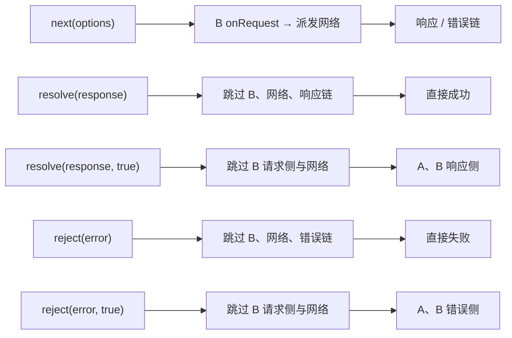

# 62 dio 源码解析：一次 request 穿过的层

> 版本锚点：dio 5.11.0 · 源码路径 `~/.pub-cache/hosted/pub.dev/dio-5.11.0/lib/src/`。本篇是这个系列第一次离开 Flutter SDK 读生态包，锚点行号以 pub cache 里这份源码为准，复核方式同样是 `grep -n`。

> 阅读路线：先运行无网络 Demo，看见“请求提前返回但响应拦截器仍运行”；再沿 `request → fetch → _dispatchRequest` 追踪一个正常请求；最后把成功、短路、错误和取消放回同一条 Future 链里理解。本文只讨论原生端默认 `IOHttpClientAdapter`，版本固定为 5.11.0。

## 一、问题

`dio.get<T>(path)` 是一行代码。它到 `dart:io` 的 `HttpClient` 之间隔着几层？拦截器是怎么"接"进这条链的？

常见错误直觉有两个。一是"`get` 直接发请求"——实际上 `get/post/put/…` 十几个方法全是 `request` 的薄包装（`dio_mixin.dart:63-320`），真正干活的是 `fetch`。二是"拦截器是回调钩子，框架在固定时机回调我"——实际上拦截器不是被回调的，它被**包装成一个 Future 链上的 then 节点**，整条请求就是一串 `future.then(...)` 依次执行出来的。

真实的层次是：**`Dio`（门面）→ `Options.compose`（配置合并）→ 拦截器链（Future 流水线）→ `_dispatchRequest`（变换 + 派发）→ `Transformer`（编码/解码）→ `HttpClientAdapter`（对 `dart:io HttpClient` 的适配）**。六层各管一件事，取消（`CancelToken`）则像一根穿过所有层的线。

```mermaid
flowchart LR
  subgraph fwd["去程 · RequestOptions 与请求字节流"]
    direction LR
    r1["get / request<br/>检查取消与关闭状态"] --> r2["Options.compose<br/>合成 RequestOptions"]
    r2 --> r3["fetch<br/>请求拦截器 Future 链"]
    r3 --> r4["_dispatchRequest<br/>请求体编码成字节流"]
    r4 --> r5["Adapter<br/>openUrl / 写入流"]
    r5 --> r6["dart:io HttpClient"]
  end
  subgraph back["回程 · 字节流经解码成为 Response&lt;T&gt;"]
    direction RL
    s1["ResponseBody<br/>状态码 / 头 / 字节流"] --> s2["状态码判定<br/>决定是否读取错误体"]
    s2 --> s3["Transformer<br/>解码后返回或抛错"]
    s3 --> s4["响应拦截器<br/>按注册顺序处理"]
    s4 --> s5["调用方 await<br/>拿到 Response&lt;T&gt;"]
  end
  r6 --> s1
```



图里“返回”是同一条请求的后半程：Adapter 交回的首先是 `ResponseBody`（状态码、响应头、字节流），还不是业务代码最终拿到的 `Response<T>`。这一区别能解释为什么抓到 HTTP 200，不代表 `await dio.get<T>()` 一定成功：解码、状态码判定和响应拦截器都尚未走完。

## 二、最小 Demo

不用起网络，用拦截器把每层的进出都打出来：

```dart
import 'package:dio/dio.dart';

Future<void> main() async {
  final dio = Dio(BaseOptions(baseUrl: 'https://example.com'));
  // 1. 拦截器按注册顺序执行：请求侧先 A 后 B，响应侧也是先 A 后 B
  dio.interceptors.add(InterceptorsWrapper(
    onRequest: (options, handler) {
      print('A onRequest: ${options.method} ${options.uri}');
      options.headers['x-tag'] = 'from-A';
      handler.next(options); // 2. next = 交给下一个节点
    },
    onResponse: (response, handler) {
      print('A onResponse: ${response.statusCode}');
      handler.next(response);
    },
  ));
  dio.interceptors.add(InterceptorsWrapper(
    onRequest: (options, handler) {
      print('B onRequest: header x-tag=${options.headers['x-tag']}');
      // 3. 短路网络；第二参数 true 允许后续响应拦截器继续执行
      handler.resolve(
        Response(
          requestOptions: options,
          statusCode: 200,
          data: 'mocked',
        ),
        true,
      );
    },
  ));

  final r = await dio.get<String>('/path?q=1');
  print('result: ${r.data}');
  dio.close();
}
```

输出（实测）：

```text
A onRequest: GET https://example.com/path?q=1
B onRequest: header x-tag=from-A
A onResponse: 200
result: mocked
```

三件事被同时暴露出来：`compose` 在拦截器链之前合并配置，但 **`options.uri` 每次读取时才根据当前配置拼接**，这里第一次读取发生在 A 的打印语句；B 的 `handler.resolve(response, true)` 短路了网络层，但**已注册的响应拦截器 A 照样被调用**（这正是 `resolveCallFollowing` 语义）；A 添加的请求头可以在后续请求拦截器 B 中读取，说明前一个节点的配置修改会传递给下一个节点。

**注意：`resolve` 的第二参数默认是 `false`。** 省略它会跳过响应拦截器，输出中也就没有 `A onResponse: 200`。`handler` 只能调一次，重复调用的约束见实验三。

这段 Demo 故意让 B 在 `onRequest` 阶段造出 `Response`。它测的是**拦截器控制流**，没有调用 `_dispatchRequest`、Transformer 或 Adapter；后面分析传输层时，要把 B 改成 `handler.next(options)`，或者继续直接读对应源码。这样不会把“Demo 返回了数据”误解成“请求真的出网了”。

示例源码：`../flutter_doc_test/lib/dio_source/interceptor_demo.dart`；对应测试：`../flutter_doc_test/test/dio_source/interceptor_demo_test.dart`。

## 三、入口锚点

| 锚点 | 说明 |
|---|---|
| `dio/dio_for_native.dart:18` | `class DioForNative with DioMixin implements Dio`，平时 `import package:dio/dio.dart` 拿到的就是它 |
| `dio/dio_for_native.dart:23` | 构造函数里 `httpClientAdapter = IOHttpClientAdapter()`：平台适配在这一个构造点完成 |
| `dio_mixin.dart:383` | `request<T>`：检查 token 已取消 → `compose` → `fetch` |
| `options.dart:315` | `Options.compose`：请求级 Options 覆盖 BaseOptions，产出唯一配置载体 `RequestOptions` |
| `options.dart:662` | `RequestOptions.uri` getter：baseUrl 拼接、去重复斜杠、query 编码、`normalizePath()` |
| `dio_mixin.dart:418` | `fetch<T>`：把拦截器串成 Future 链的总装车间，871 行文件里最核心的 170 行 |
| `dio_mixin.dart:591` | `_dispatchRequest`：变换请求 → adapter.fetch → 校验状态码 → 变换响应 |
| `dio_mixin.dart:681` | `_transformData`：请求体的三条分支（Stream / FormData / 普通对象） |
| `interceptor.dart:13` | `InterceptorState<T>`：拦截器之间传递的信封（data + type） |
| `interceptor.dart:246` | `class Interceptor`：onRequest / onResponse / onError 三槽基类，默认实现都是 `handler.next` |
| `interceptor.dart:429` | `class Interceptors`：`ListMixin` 假装的 List，出厂自带一个 `ImplyContentTypeInterceptor` |
| `interceptor.dart:493` | `class QueuedInterceptor`：带三个任务队列的串行拦截器 |
| `adapters/io_adapter.dart:32` | `IOHttpClientAdapter`：唯一和 `dart:io` 接触的类 |
| `adapters/io_adapter.dart:61` | `adapter.fetch`：openUrl → 连接超时 → abort 挂钩 → 写头 → 写流 |
| `transformers/fused_transformer.dart:47` | `transformResponse`：按 responseType 与 content-type 分路的解码器 |
| `cancel_token.dart:38` | `CancelToken.cancel`：完成一个 `Completer`，全部取消机制都建立在它上面 |

## 四、调用链

`dio.get('/users')` 的完整路径，逐跳展开：

```text
get (dio_mixin.dart:63)
  └→ request (dio_mixin.dart:383)
       ├→ cancelToken.isCancelled 检查：已取消直接 throw，不进链
       ├→ (options ?? Options()).compose(baseOptions, path, ...)   ← 第一层：配置合并
       │    options.dart:315
       │    · queryParameters：先铺 BaseOptions 的，再铺本次的（本次覆盖同名 key）
       │    · headers：大小写不敏感 map 合并，请求级覆盖基础级
       │    · 超时/responseType/validateStatus 等：逐字段 ??，请求级优先
       │    · 产物：一个 RequestOptions，此后全链只认它
       └→ fetch (dio_mixin.dart:418)
            ├→ T != dynamic 时反推 responseType：
            │    T == String → plain，否则 → json          ← 这就是 get<String> 能拿字符串的原因
            ├→ 组链：
            │    Future(InterceptorState(requestOptions))    ← 链的种子
            │    .then(拦截器1.onRequest 的包装)
            │    .then(拦截器2.onRequest 的包装)
            │    ...
            │    .then(派发节点：调 _dispatchRequest)        ← 网络在这里
            │    .then(拦截器1.onResponse 的包装)
            │    .then(拦截器2.onResponse 的包装)
            │    然后按注册顺序追加 catchError，挂上 onError 的包装
            │    （错误先过 A，再过 B；前提是前一个 handler.next 继续传递）
            └→ await future，InterceptorState 拆信封，assureResponse<T> 收尾
```

链上每个节点的包装函数（`requestInterceptorWrapper`，`dio_mixin.dart:431`）只做三件事：检查信封的 `type` 是不是 `next`（不是就原样透传——这就是 resolve/reject 能跳过后续请求拦截器的原因）；新建一个 handler、调用拦截器回调、返回 `handler.future`；用 `listenCancelForAsyncTask` 把 `cancelToken.whenCancel` 与 `handler.future` 做 `Future.any` 竞速——**拦截器里 await 卡死也能被取消**。

### 第一跳：为什么 `get` 会先走 `request`

`get<T>` 只负责把方法设为 `GET`，并把 `path`、query、单次 `Options` 等参数交给 `request<T>`。`request` 先检查传入的 `CancelToken` 是否早已取消；然后调用 `Options.compose`；若 Dio 已关闭，则以 `connectionError` 结束；最后才进入 `fetch`。所以在这里尚未创建 socket，也没有执行用户拦截器。

`compose` 值得慢读，因为三个看似相近的对象在此分工清楚：`BaseOptions` 保存 Dio 实例默认值，`Options` 保存本次请求的覆盖值，`RequestOptions` 是合并结果。query、headers、extra 都先复制基础配置，再叠加请求配置；超时、`responseType`、`validateStatus` 等按“本次不为 null 就用本次，否则用基础值”挑选。headers 用大小写不敏感的键合并，因此本次的 `Authorization` 能覆盖基础配置里的 `authorization`。`method` 最后转为大写，进链后后续节点看到的都是同一个 `RequestOptions` 对象。

这里的“同一个”有实用意义：A 在 `onRequest` 修改 `headers`，B 与 Adapter 会读到修改后的值；A 修改 `path`、`queryParameters`，稍后 Adapter 读取 `options.uri` 时会得到新地址。`uri` 是 getter，每次读取重新拼接 `baseUrl + path`、追加 query 并规范化路径，打印过一次 `uri` 并不会冻结它。要注意，它按源码做字符串拼接，**不要把它误认成 `Uri.resolve` 的相对路径规则**。

还有一个容易遗漏的“第零个拦截器”：`Interceptors` 列表初始化时已包含 `ImplyContentTypeInterceptor`，它排在后来添加的用户拦截器之前。若请求体是 `Map`、`List<Map>` 或 `String`，且还没有设置 content-type，它会推断 JSON content-type；`FormData` 则推断 multipart。`interceptors.clear()` 默认保留它，要彻底移除需使用对应选项或 `removeImplyContentTypeInterceptor()`。因此看到请求头里多了 `application/json`，先不用怀疑是 Adapter 偷偷加的，应先看这个内置请求拦截器。

### 第二跳：为什么 `fetch<T>` 要先改 `responseType`

`fetch` 先看泛型 `T`：当 `T == String`，且当前类型不是 `bytes` / `stream`，把 `responseType` 调成 `plain`；其他非 `dynamic` 的 `T` 调成 `json`。这一步在请求拦截器之前，所以拦截器能看到调整后的值。它只影响“准备怎样解响应”，并不保证 `response.data` 的运行时类型一定是 `T`；例如 JSON 体是数组，却写成 `get<Map<String, dynamic>>`，仍需在业务侧留意类型是否相符。

当请求指定 `ResponseType.bytes` 或 `stream` 时，上述泛型推断不会覆盖它们；这让下载或自定义解码可以绕过默认文本解析。`fetch(RequestOptions)` 本身是公开入口，所以重放请求时也会重新组装拦截器链，但它接收的是已有 `RequestOptions`，不会再运行 `Options.compose`。

### 第三跳：拦截器为何能暂停整条请求

`fetch` 从一个装着 `RequestOptions` 的 `Future<InterceptorState>` 开始，按列表顺序把每个请求拦截器包装进 `.then`，中间插入派发节点，再按列表顺序接响应拦截器的 `.then`，最后接错误拦截器的 `.catchError`。这里的“按顺序”说的是**同一请求的节点顺序**，不是所有请求全局串行；两个并发请求可以同时进入普通 `Interceptor` 的回调。

包装函数调用拦截器时，并不以回调函数自身返回作为“继续”的信号，而是等待 `handler.future`。只有 `handler.next`、`resolve` 或 `reject` 完成这个 Future，链才知道下一步是什么。因此异步拦截器完全可以先等待 token，再调用 handler；如果忘了调用，未取消的请求就会一直挂起。5.11.0 还会观察回调返回的 Future：回调在调用 handler 前抛出的异步异常可被转成错误进入链，但这不等于可以省掉明确的 handler 决策。

### 一张图看懂短路与错误



图里的 A、B 表示注册顺序。以 A 的 `onRequest` 为起点，`next` 让 B 继续；`resolve(response)` 跳过剩余请求节点、网络和响应节点，直接让调用方得到响应；`resolve(response, true)` 同样不出网，但允许后续响应节点处理该响应。`reject(error)` 把错误交给调用方，`reject(error, true)` 才让后续错误节点接手。派发节点内部对正常响应使用 `resolve(value, true)`、对 `DioException` 使用 `reject(e, true)`，所以真实网络请求自然能进入响应或错误拦截器。

响应阶段的 `handler.next(response)` 会继续走后面的响应拦截器；`handler.resolve(response)` 则结束响应侧。错误阶段的 `handler.next(error)` 保持失败并交给下一个错误拦截器；`handler.resolve(response)` 把错误恢复成成功结果。**错误拦截器是在响应拦截器之后才追加到链上**，因此在 `onError` 中恢复的响应会直接交给调用方，不会倒回去补跑先前的 `onResponse`。这一点对 401 刷新后返回重试结果尤其重要。

`InterceptorState` 把业务对象和流转标记装在一起；`next`、`resolveCallFollowing` 等不是 HTTP 状态码，而是 Future 链内部的路由信号。请求侧、响应侧和错误侧各有包装函数，分别只接收自己能处理的标记。读源码时先看 `state.type` 的判断，再看 handler 如何完成 Future，比只盯着 `onRequest` 回调更容易理解“为什么下一个拦截器没运行”。

派发节点 `_dispatchRequest`（`dio_mixin.dart:591`）：

```text
_dispatchRequest
  ├→ _transformData (dio_mixin.dart:681)                    ← 第二层：请求变换
  │    data 的三条分支：
  │    · Stream<List<int>>：直接透传，content-length 靠你自己在 header 里给
  │    · FormData：补 multipart 头 + boundary，finalize() 成流，length 来自 FormData.length
  │    · 其他：transformer.transformRequest（按 content-type 选择编码）→ requestEncoder/utf8 →
  │      切成 1KB 一组的 Stream（为了 onSendProgress 能分段计量）
  │    末尾统一 addProgress 挂上发送进度回调
  ├→ CancelableOperation.fromFuture(httpClientAdapter.fetch(...))   ← 第三层：适配器
  │    · cancelToken.whenCancel 触发时 operation.cancel()（WeakReference 持有）
  ├→ IOHttpClientAdapter.fetch (io_adapter.dart:61)          ← 平台边界
  │    · _configHttpClient：按 connectTimeout 配 HttpClient（有缓存复用）
  │    · httpClient.openUrl(method, options.uri) ← 读取 getter，按当前配置重新计算 uri
  │    · 连接超时：reqFuture.timeout(...)，到点 throw DioException.connectionTimeout
  │    · cancelFuture.whenComplete → request.abort()：取消打到 socket 上
  │    · 写 headers → 写请求流 → 收到 ResponseBody（字节流 + 状态码 + 头）
  ├→ validateStatus(statusCode) 判定
  │    · 通过 或 receiveDataWhenStatusError==true：走响应变换
  │    · 不通过且不收错误体：responseBody.close() 直接丢字节
  ├→ handleResponseStream (response_stream_handler.dart:18)：装上 onReceiveProgress 计量
  └→ transformer.transformResponse (fused_transformer.dart:47)     ← 第四层：响应变换
       · stream → 原样返回 ResponseBody
       · bytes → consolidateBytes 拼成 Uint8List
       · json + 无自定义 decoder → _fastUtf8JsonDecode 快路径
            content-length（或缺头时现拼字节计数）≥ 50KB → compute 切 isolate 解码
       · 有自定义 responseDecoder → 走慢路径 utf8 解码再 jsonDecode
       · 其它 → utf8.decode 当字符串返回
  最后：statusOk 返回 Response；否则 throw DioException.badResponse
```

### 第四跳：请求体如何变成字节流

进入 `_dispatchRequest` 后，`_transformData` 先验证 HTTP method，然后根据 `data` 类型走不同分支。`Stream<List<int>>` 本身就是字节流，dio 直接使用；`FormData` 会设置带 boundary 的 multipart content-type 和长度，再 `finalize()` 成流；`Uint8List` 不做对象序列化；普通对象先由 Transformer 转成文本，再由 `requestEncoder` 或默认 UTF-8 编成字节。普通对象的字节会被切成最多 1 KB 一段的流，随后 `addProgress` 统计发送进度。

“普通对象默认 JSON 编码”要加条件：`Transformer.defaultTransformRequest` 只有在 content-type 是 JSON 且数据不是 `String` 时才调用 `jsonEncode`；非 JSON 的 `Map<String, dynamic>` 会走 URL 表单编码，其他值通常转成字符串。上一步的内置 content-type 推断，正是常见 Map 请求体最终走 JSON 编码的重要原因。若用户拦截器清掉或改掉了 content-type，编码路径也可能跟着改变。

这解释了两个常见现象。第一，`onSendProgress` 看到的是编码后的字节计数，不是 Map 里的字段数；原始流如果没有提供 `content-length`，总量可能未知。第二，请求拦截器修改 `options.data` 仍来得及，因为编码发生在派发节点内，而不是 `compose` 时。相反，适配器已经开始写入请求流后再改 `data`，自然无法改变已经写出的字节。

### 第五跳：Adapter 何时真正碰到网络

`IOHttpClientAdapter.fetch` 接收 `RequestOptions`、请求字节流和取消信号。它先取得或创建 `HttpClient`，在 `openUrl(options.method, options.uri)` 这一步才正式向 `dart:io` 请求连接；拿到 `HttpClientRequest` 后写 headers，配置重定向与连接复用，接着 `addStream` 写请求体、`close` 等待响应。连接、发送和接收阶段分别有对应超时逻辑，抛出的异常被转换为 `DioException`，便于上层按类型处理。

Adapter 返回的 `ResponseBody` 保留响应字节流、状态码、headers 等信息。它**没有**把 JSON 转成 Map。这样同一个传输实现可以服务 `ResponseType.stream`、`bytes`、`plain` 和 `json`；更换 Adapter 时，外层拦截器与 Transformer 不需要跟着改。原生端构造 `DioForNative` 时默认放入 `IOHttpClientAdapter`，浏览器端会选择自己的平台实现，因此本文的 `HttpClient` 路径只对应原生端。

### 第六跳：收到 HTTP 响应后还要做什么

`_dispatchRequest` 先把 `ResponseBody` 的头、状态码、跳转信息装进 `Response`，再调用 `validateStatus`。默认规则只接受 200～299。若状态码不合格但 `receiveDataWhenStatusError == true`，仍会读取并变换响应体，最后抛 `DioException.badResponse`，错误里的 `response.data` 因而可用；若设置为 `false`，源码会关闭响应流，不解析错误体。**“有 HTTP 响应”与“请求 Future 成功”是两回事。**

允许读取响应体时，`handleResponseStream` 包装原始流以统计接收进度，再交给 Transformer。`ResponseType.stream` 直接返回 `ResponseBody`，`bytes` 汇总为 `Uint8List`；默认 `FusedTransformer` 只有在 `responseType == json` 且 content-type 是 JSON 时才解析 JSON。其他文本走 UTF-8 字符串路径。没有自定义 `responseDecoder` 的 JSON 快路径会根据 content-length 或实际字节数判断是否达到 50 KB，达到时可切 isolate 解码。**50 KB 是解码策略阈值，不是网络响应大小限制**；`get<String>` 被改为 `plain` 后也不会因为服务器返回 JSON 就自动变成 Map。

Transformer 结束后，`_dispatchRequest` 再检查取消状态；状态码合格则返回 `Response`，否则抛 `badResponse`。所以调用方最终的 `await` 结果，要经过“收到字节 → 初判状态码 → 可选解码 → 最终返回或抛错 → 对应拦截器”才能形成。

### 把六跳串成一个具体请求

假设 Dio 的 `BaseOptions` 设为 `baseUrl: https://api.example.com`、基础请求头 `x-client: app`、基础 query `lang: zh`；这次发 `post<Map<String, dynamic>>('/users', data: {'name': 'Ada'}, queryParameters: {'page': 2})`。服务端返回 201、`content-type: application/json`，正文是 `{"id": 7}`。先不加用户拦截器，顺着源码推一次：

1. `post` 写入 `POST` 方法并调用 `request`；`compose` 产生 `RequestOptions`，其中 path 是 `/users`，query 合并为 `lang=zh` 与 `page=2`，基础头保留。`RequestOptions.uri` 此时可读成 `https://api.example.com/users?lang=zh&page=2`。
2. `fetch<Map<String, dynamic>>` 确定 `responseType=json`。内置请求拦截器看到 Map 请求体、没有显式 content-type，于是补上 JSON content-type；没有其他请求拦截器时，链进入派发节点。
3. `_transformData` 将 Map 序列化为 JSON 文本、UTF-8 编成字节，补上 content-length，并将字节流交给 `IOHttpClientAdapter`。Adapter 在 `openUrl` 读取最新 `uri`，写 headers 和请求体。
4. Adapter 交回带 201 和 JSON 响应头的 `ResponseBody`；默认 `validateStatus` 接受 201。Transformer 从字节流解析出 Map，并把它放进 `Response.data`。
5. 派发节点以“允许后续响应拦截器”的方式把响应放回链中。链走完后，调用方得到 `Response<Map<String, dynamic>>`，其 `data['id']` 为 7。

如果只把服务端状态码换成 400，流程在第 4 步仍会按默认配置读取并解析 JSON 错误体，但第 5 步改为抛出带 `response` 的 `DioException.badResponse`，进入 `onError` 链；若把 `receiveDataWhenStatusError` 改为 `false`，则会直接关闭响应流，错误响应没有解析后的 data。由此可见，同一个 HTTP 响应经过不同配置，会走向不同的 Future 分支。

错误路径：`_dispatchRequest` 抛出的任何东西先被 `assureDioException` 包成 `DioException`，再沿 Future 链被 `catchError` 挂的 onError 包装逐个处理。注意 `catchError` 的挂载顺序是注册序（A 先挂再挂 B），错误传播时**先过 A 再过 B**——与响应侧一致，不是倒序。onError 里 `handler.resolve(response)` 可以把错误"救活"成一个正常响应返回给调用方。

**关键认知：`InterceptorState` 的五种 type 就是拦截器的全部控制流。** `next` 继续、`resolve`/`reject` 短路收尾、`resolveCallFollowing`/`rejectCallFollowing` 短路但放行后续同侧拦截器。没有回调注册表、没有事件总线，一条 Future 链加一个五值信封，撑起了 dio 全部的拦截语义。

## 五、核心对象

### `Interceptor` 与 `QueuedInterceptor`：同一条链，不同的并发约束

普通 `Interceptor` 只保证**单次请求内部**的节点顺序。假设请求甲、乙几乎同时进入同一个 `onRequest`，甲先开始异步取 token；在甲等待时，乙照样可以进入该回调。于是日志可能出现“甲开始 → 乙开始 → 乙结束 → 甲结束”。`fetch` 的 Future 链没有把不同请求串成一个全局队列。

`QueuedInterceptor` 在每个实例内放了三个独立的 `_TaskQueue`：请求、响应、错误各排各的。一个请求阶段的任务占住请求队列，直到它的 handler 调用 `next`、`resolve`、`reject`，后一个请求阶段任务才开始；同时，响应队列与错误队列仍可处理别的请求。因此它也不是“一个请求从头到尾独占 Dio”。5.11.0 的队列代码还处理了一个边缘情况：活动任务在等待异步结果时被取消，即使回调尚未调用 handler，也要释放队列位置，避免后续请求永久堵住。

它适合保护确实需要排队的共享步骤，例如更新鉴权状态。**排队不自动等于只刷新一次 token**：并发 401 进入错误队列后，后一个任务仍需要检查前一个任务是否已经更新 token，或者复用同一个刷新 Future，否则仍可能重复刷新。这个判断属于业务逻辑，队列只提供执行顺序。

### `Options`、`RequestOptions`：配置何时定稿

`BaseOptions` 是实例级默认值，`Options` 是单次请求的覆盖项，两者在 `request` 入口被 `compose` 合并。`RequestOptions` 才是全链传递、可被拦截器修改的对象。配置合并在进入拦截器之前只做一次，但这不表示 `RequestOptions` 不可修改；它的 `headers`、`path`、`data` 等字段仍可能被请求拦截器改写。读源码时应分清“合并完成”和“最终发出”这两个时刻。

### Transformer 与 Adapter：格式和运输的边界

Transformer 管“对象与可传输内容如何互转”，Adapter 管“字节怎样经过平台网络栈”。在原生端，`dio_for_native.dart:23` 给 `httpClientAdapter` 赋默认的 `IOHttpClientAdapter`；实际操作 `dart:io HttpClient` 的代码位于 `adapters/io_adapter.dart`。把这一字段替换为 mock adapter，就能让上层流程照常执行而完全不碰真实网络。这也是测试拦截器、状态码处理和响应解码的切入点。

### `CancelToken`：取消贯穿多个等待点

`CancelToken` 的核心是一个只完成一次的 `Completer<DioException>`：调用 `cancel(reason)` 后，`isCancelled` 成为 true，`whenCancel` 完成，关联请求收到 `DioExceptionType.cancel`。同一个 token 可用于多次请求，一次取消会通知所有使用它的请求。

沿时间线看，它至少影响四处。请求尚未进入链时，`request` 入口直接抛取消异常；链停在异步拦截器时，包装函数用 `Future.any` 在 handler 完成与取消之间竞速，让调用方及时结束等待；网络操作进行中，`_dispatchRequest` 取消等待中的 `CancelableOperation`，`IOHttpClientAdapter` 同时在 `HttpClientRequest` 上调用 `abort()`；收到响应并解码后，`checkCancelled` 还会做最后检查。这些处理面向不同阶段，不能把取消理解成“仅在 socket 上调用 abort”。

一个重要边界是：`Future.any` 能让调用方停止等待，却不会强行停止任意 Dart `Future` 内部已经开始的工作。自定义拦截器若在取消后继续完成自己的副作用，需要自己检查 token 或在合适时机停止。Adapter 的 `abort()` 才是在网络阶段尝试中止底层请求。

## 六、源码实验

**实验一：验证响应侧拦截顺序。** 保留 Demo 中 B 的 `handler.resolve(response, true)`，只给 B 增加 `onResponse: (r, h) { print('B onResponse'); h.next(r); }`。输出应为 A onRequest → B onRequest → A onResponse → B onResponse，不需要真实网络。B 短路了请求侧，但 `true` 让响应侧继续；响应包装按注册顺序 `.then`，所以 A、B 也按注册顺序执行。

**实验二：验证 uri 拼接时机。** 在第一个拦截器的 `onRequest` 里打印 `options.uri`，再修改 `options.path = '/other'`，再次打印 `options.uri` 后 `handler.next(options)`。预测：第一次打印旧 path 拼出的 uri，第二次打印 `/other?q=1` 对应的完整 uri。**`uri` 是每次读取都会重新计算的 getter，不会缓存第一次的结果。** 因此拦截器里改 path 或 queryParameters 都生效；若进一步让 B 调用 `handler.next(options)` 放行，Adapter 的 `openUrl` 读取到的也是修改后的 URI，但这一步需要真实网络或 mock adapter。

**实验三：验证 handler 单次约束。** 在一个 `onRequest` 里连续调两次 `handler.next(options)`。预测：第二次直接抛 `The handler has already been called`（`interceptor.dart:32` 的 `_throwIfCompleted`）。实测一致——dio 用 Completer 的单次性把"拦截器必须精确表态一次"变成硬约束。

**实验四：区分拒绝与传递错误。** 让 A 的 `onRequest` 直接 `handler.reject(error)`，B 的 `onError` 不会被调用；把它改成 `handler.reject(error, true)`，B 才会收到错误。这里无需出网，比较的是 `reject` 与 `rejectCallFollowing` 两种信封。测试文件里的“错误拦截器按注册顺序执行”已经验证后一条路径。

### 遇到异常时按哪一层查

- **请求根本没有进自定义 `onRequest`**：先检查 token 是否在调用前已取消、Dio 是否已 `close()`，再看 `Options.compose` 是否提前抛错。
- **A 的 `onRequest` 运行了，B 没运行**：检查 A 是否调用了 `resolve` / `reject`，或者异步逻辑是否忘记调用 handler；再看队列中的前一项是否尚未结束。
- **服务端有响应，调用方仍进入 `onError`**：检查 `validateStatus` 的结果、`receiveDataWhenStatusError`、响应体解码是否抛错；不要只凭 HTTP 状态码猜测。
- **`response.data` 是字符串而不是 Map**：先看 `responseType`，再看响应头 content-type 是否属于 JSON，以及是否配置了自定义 `responseDecoder`。
- **取消了却仍看到自定义异步任务的日志**：检查该任务是否已经启动；取消可以结束请求链的等待，无法自动撤销任意业务 Future 的副作用。

## 七、结论

1. **dio 是一条 Future 链，不是一个回调框架。** `fetch` 把 N 个拦截器、一个派发节点串成 `then` 链，错误侧用 `catchError` 追加；五种 `InterceptorState` type 是全部控制流词汇。
2. **配置只合并一次。** `compose` 产出的 `RequestOptions` 是全链唯一事实源；`uri` 是每次读取时重新计算的 getter，adapter `openUrl` 会读取最新配置，所以拦截器里改 path/query/headers 都来得及。
3. **平台入口由 Adapter 决定。** 原生端构造时选择 `IOHttpClientAdapter`，真正的 `HttpClient` 代码在 `io_adapter.dart`。Transformer 处理内容，Adapter 处理传输；默认 JSON 快路径达到 50 KB 时可切 isolate 解码。

一句话总结：`request` 负责把三层配置折叠成一个 RequestOptions，`fetch` 负责把它推进一条由拦截器组成的 Future 流水线，流水线中段的派发节点调用 Transformer 编解码、再交给 Adapter 穿过平台边界。

## 八、边界声明

今天不追 `download` 的文件落盘链路（`dio_for_native.dart:28`，在 adapter 返回流之后接 `RandomAccessFile`，主干一致）、不追 FormData 的 boundary 组装细节、不追浏览器端 `dio_for_browser.dart` 与 XHR 的差异、不追 `LogInterceptor` 与 `DioException` 的七种 type 全表。HTTP/2、证书校验（`validateCertificate`）属于 `dart:io HttpClient` 的领地，交给 SDK 源码——本系列第 26～28 篇讲过 framework 怎么跟原生打交道，dio 的 adapter 是同一件事在纯 Dart 侧的对照。

源码对照：[dio 5.11.0 的 `dio_mixin.dart`](https://github.com/cfug/dio/blob/dio_v5.11.0/dio/lib/src/dio_mixin.dart)、[`interceptor.dart`](https://github.com/cfug/dio/blob/dio_v5.11.0/dio/lib/src/interceptor.dart)、[`options.dart`](https://github.com/cfug/dio/blob/dio_v5.11.0/dio/lib/src/options.dart)、[`io_adapter.dart`](https://github.com/cfug/dio/blob/dio_v5.11.0/dio/lib/src/adapters/io_adapter.dart)、[`fused_transformer.dart`](https://github.com/cfug/dio/blob/dio_v5.11.0/dio/lib/src/transformers/fused_transformer.dart)。
