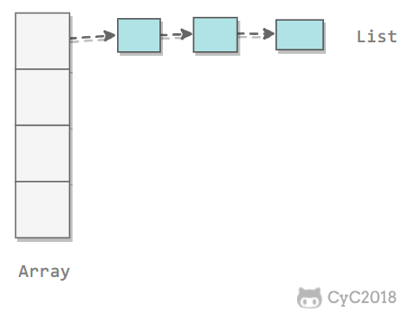
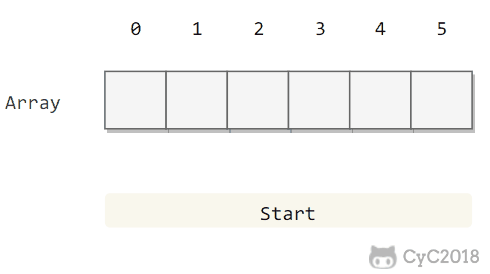
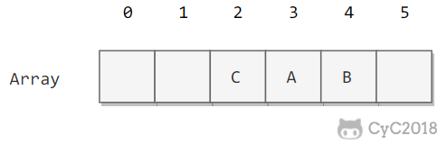
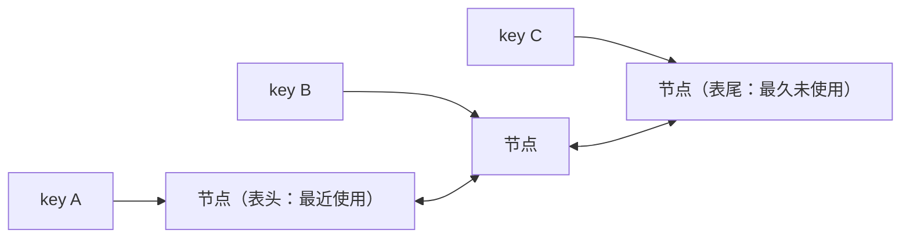

# 算法与数据结构｜05-哈希表

打开手机通讯录，输入一个名字就能跳到对应联系人；服务端处理一条请求，要立刻判断这个 `requestId` 是否已经处理过；统计一段文本里每个单词出现了多少次。这些操作的共同点是：**给出一个键，直接拿到值，或者直接判断它是否存在**，而不是从头扫一遍。

直觉方案是用数组：按下标取元素是常数时间。可数组的下标必须是小范围的整数，而现实中的键是姓名、长整型 ID、复合对象；如果改用"存起来再逐个比较"，每次查询就要付出 O(n) 的代价，n 上万以后延迟会直接反映到用户界面和接口耗时上。

哈希表（Hash Table）要解决的问题就是这件事：把任意键压缩成一个数组下标，让"按键查找"接近"按下标查找"。本文路线是：先明确它要提供哪些操作，再讲哈希函数与相等契约怎样决定正确性；然后把解决冲突的两条路线——拉链法与开放寻址——分别拆开，讨论负载因子、扩容与均摊成本；最后回到 Dart 的 `Map`/`Set` 公开契约、选择边界和常见坑。

<!-- GFM-TOC -->
* [从按位置查找到按键查找](#从按位置查找到按键查找)
* [哈希函数与相等契约](#哈希函数与相等契约)
* [冲突不可避免](#冲突不可避免)
* [拉链法](#拉链法)
* [开放寻址](#开放寻址)
* [复杂度与安全边界](#复杂度与安全边界)
* [Dart 中的 Map 与 Set](#dart-中的-map-与-set)
* [常见组合](#常见组合)
* [什么时候用，什么时候别用](#什么时候用什么时候别用)
* [常见坑与边界](#常见坑与边界)
    * [常见误区](#常见误区)
    * [边界清单](#边界清单)
* [知识点应用](#知识点应用)
    * [1. LeetCode 1 两数之和：用索引把两重循环降成一重](#1-leetcode-1-两数之和用索引把两重循环降成一重)
    * [2. LeetCode 128 最长连续序列：让每个值只被扩展常数次](#2-leetcode-128-最长连续序列让每个值只被扩展常数次)
    * [3. 剑指 Offer 50 第一个只出现一次的字符位置：两遍扫描](#3-剑指-offer-50-第一个只出现一次的字符位置两遍扫描)
* [面试考点与追问](#面试考点与追问)
* [参考资料](#参考资料)
* [小结](#小结)
<!-- GFM-TOC -->

## 从按位置查找到按键查找

先把这个数据结构要提供的能力写清楚，后面所有机制都是为它服务的。它叫**符号表（Symbol Table）**，也叫字典（dictionary）或映射（map），提供四类基本操作：`put(key, value)` 写入或覆盖，`get(key)` 按键取值（键不存在时返回"缺失"），`remove(key)` 按键删除，`contains(key)` 只判断键是否存在。只保留键、不保留值的版本就是**集合（Set）**：内部同样要回答"这个键在不在"，只是把值去掉，Dart 里 `Map<K, V>` 与 `Set<E>` 正好对应这两种抽象。

能不能用"有序数组 + 二分查找"实现？可以，但只适合键集基本不变、以查询为主的场景：插入要在中间腾位置，需要移动元素（单项 O(n)），具体边界见[查找与二分查找](./10-查找与二分查找.md)。哈希表选择了另一条路：它**不比较键的大小**，只用哈希值定位、用相等性判定，因此能做出接近常数时间的按键查找，同时也放弃了顺序能力。

哈希表用顺序能力换取等值操作的开销：它不做 min/max、前驱后继或范围查询，换来的是在合理假设下期望常数的 `put`/`get`/`remove`。

## 哈希函数与相等契约

把键变成下标的函数叫**哈希函数（hash function）**：把任意键映射到 `[0, m-1]` 范围内的整数，m 是桶（bucket）的数量。设计它要同时满足三件事：**一致**（同一个键每次计算得到同一个值，用 `==` 判定相等的两个键必须得到相同的哈希值）、**高效**（计算本身要便宜，否则省下来的比较成本会还回去）、**均匀**（典型输入的哈希值尽量铺满整个取值空间）。均匀性只能针对"实际会出现的键"做统计和测试，没有任何一个函数能对任意输入证明均匀。

工程上的常见构造是"混合 + 取模"：多字段对象把各个字段看成一个 R 进制整数逐位混合（字符串也可以按 `hash = R * hash + 字符` 迭代），最后用除留余数法落到桶范围内；把字符串哈希用于子串比对时的适用条件与碰撞风险属于[字符串算法](./15-字符串算法.md)的范围。Dart 已经提供了官方推荐的混合方式：字段较少的键用 `Object.hash`，字段是集合时用 `Object.hashAll`（与顺序有关）或 `Object.hashAllUnordered`（与顺序无关）。

```dart
class Point {
  const Point(this.x, this.y);

  final int x;
  final int y;

  @override
  bool operator ==(Object other) =>
      other is Point && other.x == x && other.y == y;

  @override
  int get hashCode => Object.hash(x, y);

  @override
  String toString() => 'Point($x, $y)';
}
```
<!-- verify: .work/verify/A05/hash_contract.dart -->

这里的两条契约必须成对出现，方向是单向的：用 `==` 判定相等 ⇒ `hashCode` 必须相同；反过来 `hashCode` 相同 ⇏ 键相等，哈希值只是"缩小查找范围"，最终由 `==` 裁决。第二条正是冲突能够被正确处理的依据；破坏第一条则会让哈希表直接失效。以下片段取自 `A05/hash_contract.dart` 的 `main()`（节选，完整文件通过 `dart analyze` 与 `dart run --enable-asserts`）：

```dart
  // 3. 哈希值相同不等于键相等：冲突由 `==` 继续分辨，两条记录都保留。
  final collisions = <CollidingKey, int>{};
  collisions[CollidingKey('a')] = 1;
  collisions[CollidingKey('b')] = 2;
  assert(collisions.length == 2);
  assert(collisions[CollidingKey('a')] == 1);
  assert(collisions[CollidingKey('b')] == 2);

  // 4. 可变键：条目仍然留在表里，但查找口径已经失效。
  final historical = <MutableKey, String>{};
  final key = MutableKey(1);
  historical[key] = 'value';
  key.id = 2;
  assert(historical.length == 1 && historical.values.single == 'value');
  assert(historical[MutableKey(1)] == null); // 按插入时的值查找已经失败
  assert(key.hashCode != MutableKey(1).hashCode); // 哈希值随状态变化
  final afterMutation = historical[key]; // 用同一对象查找：位置由当前哈希决定
```
<!-- verify: .work/verify/A05/hash_contract.dart -->

`CollidingKey` 的哈希值是常量 `7`，所有键争用同一个哈希值，但两条记录仍然都保留下来——冲突只影响成本，不影响正确性。`MutableKey` 的 id 从 1 改成 2 之后，条目仍在表里（`length == 1`），但按插入时的值已经查不到：哈希值变了，探测路径也跟着变了。所以**键的相等性和哈希值必须在它待在表内的整个期间保持不变**，可变对象不适合直接当键，除非改用身份语义（见后文 `identity` 映射）。

还有一个容易踩的坑：只重写 `==` 而忘记 `hashCode`。Dart 官方明确要求"如果子类重写了 `operator ==`，就应该同时重写 `hashCode`"，否则它不能作为默认 `Set` 和 `Map` 的键。更隐蔽的是 `const` 对象：两个 `const BrokenPoint(1, 2)` 会被规范化为同一个实例，查找"碰巧"成功，缺陷被掩盖；换成运行时构造的等值对象后，100 对等值键里能互相查到的有 0 对。

哈希值只负责把比较范围缩小到一个桶，键是否相等始终由 `==` 决定；`hashCode` 与 `==` 必须表达同一套等价关系。

> **时效信息（核查日期：2026-09）：** `Object.hash` / `Object.hashAll` / `Object.hashAllUnordered` 自 Dart 2.14 起提供，官方文档明确说明它们不保证跨运行、跨 isolate 稳定，且没有分布保证；需要跨进程一致时不能依赖哈希值本身。

> **面试高频：** 自定义对象做键时要注意什么？
> **答题脉络：** 先声明等价关系 → `==` 与 `hashCode` 一起重写并保持相容 → 键的状态在表内不可变 → 说明哈希相等不等于键相等。
> **追问方向：** 忘记 `hashCode` 会怎样、`const` 规范化对调试的干扰、为什么不能拿 `hashCode` 当唯一 ID、身份映射的适用场景。

## 冲突不可避免

给定 m 个桶和 n 个键，只要 n > m，就必然存在两个键落到同一个桶；即使 n ≤ m，冲突也不会消失——把远大于 m 的键空间映射到 m 个下标，函数不可能是一一对应。这就是**鸽巢原理**的直观版本：位置比对象少，就一定有对象要共用位置。

冲突的概率比直觉高得多。把 365 个桶看成"一年 365 天"，只要 23 个键，"至少撞一次"的概率就超过一半：

```text
1 - ∏(i = 0..22) (365 - i) / 365 ≈ 0.507
```

这段概率计算在 `A05/hash_quality.dart` 中以断言固定（`0.5 < p < 0.51`）：哈希表里出现少量冲突是完全正常的现象，而不是实现有 bug。

冲突只影响成本，不影响正确性：桶内再按 `==` 分辨即可。为了看清"分布好坏"如何改变成本，同一个文件把 1000 个键放进 128 个桶，比较两种哈希函数的结果：

```text
均匀哈希：最长桶=17，平均桶=7.8
常量哈希：最长桶=1000，平均桶=7.8
```

哈希函数退化成常量时，所有键挤在一条链上，查找退化为顺序扫描；而分布良好时，最长桶仍与平均桶同阶——"均匀性"之所以是硬指标，原因就在这里。

哈希表的正确性靠的是"能分辨冲突的键"，而不是"避免冲突"：冲突交给 `==` 处理，哈希函数只需要让冲突尽量少。

## 拉链法

**拉链法（separate chaining）**把每个桶做成一个可以放多个键值对的容器，通常是链表（教学里也可以用数组或列表）。查找分两步：先算出桶下标，再在桶内按 `==` 顺序比较。

<div align="center">
  
</div>
<p align="center">图 1：拉链法用桶内链表吸收冲突。来源：CyC2018/CS-Notes（上游 CS-Notes 素材）。</p>

设 n 个键、m 个桶，**负载因子（load factor）**定义为 α = n / m。

教材对拉链法的结论是：在"哈希函数近似理想"的假设下，每条链的长度集中在 N/M 附近，查找与插入的比较次数与 N/M 成正比（Sedgewick《Algorithms》第 3.4 节 Proposition K 与 Property L）。换句话说，**期望成本由负载因子决定**：α 保持在常数级时，`put`/`get`/`remove` 的期望成本也是常数；α 增大时线性变差。α 是否能大于 1 取决于桶内结构——链可以很长，而开放寻址连 α = 1 都到不了。

当 α 超过设定阈值时要**扩容（resize）并重散列（rehash）**：申请更大的桶数组，把已有条目重新按新桶数安放。注意这一步不能"整桶照搬"——桶数变了，`h(key) mod m` 的结果也变了。

核心操作与扩容的实现如下（节选自 `A05/chaining_hash_map.dart`）：

```dart
  // 1. 把任意哈希值折叠到 [0, bucketCount) 的下标；屏蔽符号位避免负数下标。
  int _bucketIndex(K key) => (key.hashCode & 0x7fffffff) % _buckets.length;

  V? operator [](K key) {
    for (final entry in _buckets[_bucketIndex(key)]) {
      if (entry.key == key) return entry.value;
    }
    return null;
  }

  bool containsKey(K key) {
    for (final entry in _buckets[_bucketIndex(key)]) {
      if (entry.key == key) return true;
    }
    return false;
  }

  void operator []=(K key, V value) {
    final bucket = _buckets[_bucketIndex(key)];
    // 2. 先在桶内按 `==` 找同名键：找到就更新，找不到才追加。
    for (final entry in bucket) {
      if (entry.key == key) {
        entry.value = value;
        return;
      }
    }
    bucket.add(_Entry(key, value));
    _size++;
    if (loadFactor > loadFactorLimit) _resize(_buckets.length * 2);
  }
```
<!-- verify: .work/verify/A05/chaining_hash_map.dart -->

扩容只做一件事：换数组、重新散列，成本与当时的条目数成正比。

```dart
  // 3. 扩容后桶数变了，每个键的位置都要用新桶数重算，不能整桶照搬。
  void _resize(int newBucketCount) {
    final oldBuckets = _buckets;
    _buckets = List<List<_Entry<K, V>>>.generate(
      newBucketCount,
      (_) => <_Entry<K, V>>[],
    );
    for (final bucket in oldBuckets) {
      for (final entry in bucket) {
        _buckets[_bucketIndex(entry.key)].add(entry);
        _movedEntries++;
      }
    }
  }
```
<!-- verify: .work/verify/A05/chaining_hash_map.dart -->

单次扩容是 O(n)，但它不是每次都发生：桶数**成倍增长**时，累计搬动量与条目数同阶，摊到每次插入就是常数——这就是均摊分析的结论（推导见[复杂度分析与算法思想](./01-复杂度分析与算法思想.md)）。验证程序往初始 4 个桶的表里插入 100 条记录，统计结果是：

```text
桶数=256，负载因子=0.387
累计搬动条目=195，插入条目数=99
```

195 次搬动换 100 次插入，平均值接近常数，而不是随规模增长。把倍率从 2 改成 1.1，结论立刻失效。

> 负载因子决定的是期望成本，而不是常数保证；"扩容摊还到 O(1)"的前提是桶数至少按固定倍数增长。

## 开放寻址

**开放寻址（open addressing）**不挂链：所有键值对都放在同一个数组里，冲突时按**探测序列（probe sequence）**在表内另找空槽。最简单的是**线性探测（linear probing）**：先看 `h(key)`，被占用就看 `h(key) + 1`、`h(key) + 2`……必要时绕回表头。因为所有元素都在这块连续内存里，开放寻址的缓存局部性通常比拉链法好，代价是**桶数必须严格大于键数**（至少要留出空槽）。

<div align="center">
  
</div>
<p align="center">图 2：线性探测把冲突的键放到探测序列上的第一个空槽。来源：CyC2018/CS-Notes（上游 CS-Notes 素材）。</p>

查找沿探测序列逐个比较，**遇到"真正的空槽"就可以断定键不存在**——这句话决定了删除的实现方式。教学实现用**删除标记（tombstone，墓碑）**表示"这里曾经有记录、但已被删除"：它不是空槽，探测要越过它继续走。

```dart
  // 1. 探测序列：从 home 槽开始逐个向后走；只有真正的空槽才是查找终点。
  int _findSlot(K key) {
    for (var step = 0; step < capacity; step++) {
      final slot = (_hashOf(key) + step) % capacity;
      final stored = _keys[slot];
      if (stored == null && !_tombstones[slot]) return -1;
      if (stored == key) return slot;
    }
    return -1;
  }

  V? operator [](K key) {
    final slot = _findSlot(key);
    return slot < 0 ? null : _values[slot];
  }

  bool containsKey(K key) => _findSlot(key) >= 0;
```
<!-- verify: .work/verify/A05/open_addressing_map.dart -->

删除时如果直接把槽位置空，会把后面键的探测链拦腰截断，那些键就"消失"了。正确做法是只放删除标记；另一种等价做法是把同一聚簇中后续的键重新插入一次（教材中的删除变体），本质都是"保留可继续探测的痕迹"。

```dart
  bool remove(K key) {
    final slot = _findSlot(key);
    if (slot < 0) return false;
    // 4. 删除只放删除标记：直接置空会截断后面键的探测链。
    _keys[slot] = null;
    _values[slot] = null;
    _tombstones[slot] = true;
    _size--;
    _tombstoneCount++;
    if ((_size + _tombstoneCount) * 4 > capacity * 3) {
      _rehash(capacity);
    }
    return true;
  }
```
<!-- verify: .work/verify/A05/open_addressing_map.dart -->

验证程序把 8 个槽、常量哈希（所有键的 home 槽都是 3）作为最坏演示，逐步观察槽位状态（`A05/open_addressing_map.dart`，`-` 为空槽、`x` 为删除标记）：

```text
插入 a、b、c 后： ---abc--
删除 b 之后：     ---axc--
插入 d 之后：     ---adc--
置空后查找 c：    null
```

第一行说明冲突被顺序探测吸收；第二行说明删除留下痕迹而不是空槽；第三行说明新键可以复用删除标记，避免表无谓地变大；最后一行是反例的结论——如果删除时直接置空，同一探测链后面的 `c` 再也找不到（`brokenLookup` 在空槽处就停止了）。

删除标记会**占用槽位但不算有效条目**，让探测路径变长；所以开放寻址的扩容（重散列）判断应该看"已占用槽位的比例"，而不是只看条目数，重散列同时把删除标记一次性清掉。上面的实现按 `(size + tombstoneCount) > 3/4 × capacity` 触发，验证运行中容量从 8 涨到 512，负载因子稳定在 0.39 附近。

线性探测还有一个自我强化的现象：**聚簇（cluster）**。一段连续被占用的槽位会不断吸引新的键，让下一次冲突更容易发生。教材给出的平均探测次数（Sedgewick《Algorithms》第 3.4 节 Proposition M，理想哈希假设下）是：

```text
命中查找  ~ ½ · (1 + 1/(1 - α))
未命中/插入 ~ ½ · (1 + 1/(1 - α)²)
```

代入 α = 1/2：命中约 1.5 次探测，未命中约 2.5 次，看起来很好；但 α → 1 时分母趋近 0，曲线陡然上升。这就是开放寻址必须把负载因子压在 1/2 左右的原因。

<div align="center">
  
</div>
<p align="center">图 3：线性探测中的聚簇；连续占用的槽位会放大后续冲突。来源：CyC2018/CS-Notes（上游 CS-Notes 素材）。</p>

| 维度 | 拉链法 | 开放寻址 |
|---|---|---|
| 额外空间 | 每个桶/节点额外指针开销 | 无指针，槽位自身常带"空/占用/删除"状态 |
| 负载因子上限 | 可以大于 1 | 必须小于 1，实践中约 1/2，否则探测次数暴涨 |
| 删除 | 直接摘链即可 | 需要删除标记或重插后缀 |
| 局部性 | 桶内节点分散 | 全部在连续数组里，通常更快 |
| 退化形式 | 所有键挤进一条链，仍能工作 | 标记积累后表被填满，必须先重散列 |

开放寻址把所有键放在同一块连续内存里，用缓存局部性换取更小的空间开销；代价是容量必须留空，删除必须留下"非空"的痕迹。

> **面试高频：** 开放寻址的删除为什么不能直接把槽位置空？
> **答题脉络：** 查找以"空槽"为终止信号 → 置空会截断后续键的探测链 → 用删除标记或重插后缀保留链 → 说明删除标记的副作用与重散列时机。
> **追问方向：** 聚簇与负载因子、为什么删除标记要计入占用比例、拉链法为什么没有这个问题。

> **面试高频：** 拉链法和开放寻址怎么选？
> **答题脉络：** 先看空间与指针开销 → 再看局部性与吞吐 → 再看负载因子上限与删除成本 → 最后说明两者期望成本都由 α 驱动、最坏都是 O(n)。
> **追问方向：** α = 1 时的行为差异、墓碑堆积、缓存友好性对常数因子的影响、实现可否切换策略。

## 复杂度与安全边界

| 操作 | 期望（均匀哈希、负载因子受控） | 最坏 |
|---|---|---|
| 查找 `get`/`contains` | O(1) | O(n)（所有键落在同一个桶/探测链） |
| 插入 `put` | O(1) 均摊（含扩容） | O(n)（扩容那一次，或冲突退化） |
| 删除 `remove` | O(1) | O(n) |

期望 O(1) 的成立条件可以逐条对上：哈希函数在实际键集上近似均匀；负载因子受控并及时扩容；单次扩容虽然 O(n)，但桶数成倍增长后摊到每次插入仍是 O(1)；键的哈希值在表内保持不变。

最坏 O(n) 不是理论玩具，它有三个现实来源：哈希函数写得差（例如所有键都映射到同一个值）、真随机的碰撞（概率低但存在）、以及**被构造出来的碰撞**。第三类已经被反复验证：

- Crosby 与 Wallach 在 USENIX Security 2003 提出"算法复杂度攻击"，用少量请求让语言自带的哈希表退化成链表；
- 2011 年 Ruby 1.8.7-p352 及更早版本被确认存在该问题（CVE-2011-4815）：字符串哈希是确定性的，攻击者可以预先算出大量碰撞的键，让构表的代价从均摊 O(1) 变成 O(n²)；官方采取的修复是给字符串哈希加入 PRNG 随机化，并明确说明 `String#hash` 只在当前进程内有意义；
- Python 从 3.4 起按 PEP 456 采用 SipHash 作为字符串/字节的默认哈希算法；Java 8 起按 JEP 180 把超长冲突桶从链表换成平衡树，把该桶的最坏查找从 O(n) 降为 O(log n)。

这些例子指向同一条工程结论：**不要把"期望 O(1)"当成"攻击者无法让它变慢"**。涉及外部可控键的系统需要随机化哈希种子、限制单请求的键数量，或要求键本身不可预测。

Dart 这边能确认的是公开契约，而不是内部结构：官方文档明确 `Object.hash` 系列不保证跨运行稳定，同一程序两次运行的 `Object.hashAll([1, 2, 3])` 取值确实不同，所以不要把哈希值持久化或写进协议；Dart 内部用什么探测方式、初始桶数与扩容阈值都没有公开承诺，本文也不做断言。

> **时效信息（核查日期：2026-09）：** Ruby 的碰撞攻击与修复见 Ruby 官方公告（2011-12-28），CVE-2011-4815；Python 的 SipHash 决策见 PEP 456；Java 的平衡树改造见 JEP 180（Java 8，已交付）。Dart 侧的观测基于 Dart SDK 3.12.2（2026-06-09 构建）。

期望 O(1) 是对"哈希分布良好、负载因子受控"这两个前提的结论；去掉前提，哈希表的最坏成本是 O(n)，而且可以被外部输入故意触发。

> **面试高频：** 哈希表的最坏情况是什么，什么时候会被触发？
> **答题脉络：** 先给最坏 O(n) 及其触发条件 → 区分"实现差"与"被构造攻击" → 说明随机种子、平衡树桶等缓解手段 → 指出期望值不等于可承诺的上界。
> **追问方向：** 哈希洪水攻击的构造思路、随机化哈希的代价、为什么删除标记与扩容阈值也和安全相关、什么时候该改用确定上界的数据结构。

## Dart 中的 Map 与 Set

Dart 把"哈希表"拆成了几个公开契约清晰的选择：

| 类型 | 迭代顺序 | 说明 |
|---|---|---|
| `<K, V>{}` 字面量、`Map()`、`Map.of`；`LinkedHashMap` | 键的插入顺序 | 默认实现是 `LinkedHashMap`，哈希定位 + 额外维护插入序 |
| `HashMap`（`dart:collection`） | 不承诺 | 只保证"表未被修改时顺序不变" |
| `SplayTreeMap` | 按键排序 | 有序映射，多数单条操作均摊对数时间 |
| `Map.identity()` | 键的插入顺序 | 用 `identical`/`identityHashCode` 判定，不看 `==` |

`Set` 一一对应：字面量、`Set()`、`Set.of` 是 `LinkedHashSet`（插入顺序），`HashSet` 无序，`SplayTreeSet` 按键排序，`Set.identity()` 走身份判定。`dart:collection` 的 `HashMap`/`HashSet` 还允许传入自定义 `equals` 与 `hashCode`，这是在不修改键类型的前提下实现"忽略大小写查找"之类的等价关系的办法。

以下片段验证了字面量与工厂构造函数的类型、覆盖键后的位置语义（取自 `A05/map_semantics.dart`，节选）：

```dart
  // 1. 字面量、`Map()` 与 `Map.of` 都是 LinkedHashMap：按插入顺序迭代。
  final literal = <String, int>{'b': 2, 'a': 1};
  // ignore: prefer_collection_literals
  final created = Map<String, int>();
  final copied = Map<String, int>.of(literal);
  assert(literal is LinkedHashMap<String, int>);
  assert(created is LinkedHashMap<String, int>);
  assert(copied.keys.join() == 'ba');
  assert(literal.keys.join() == 'ba');
  // 覆盖已有键不会改变它的位置。
  literal['b'] = 20;
  assert(literal.keys.join() == 'ba');
  // 删除后再插入，才会落到末尾。
  literal.remove('b');
  literal['b'] = 2;
  assert(literal.keys.join() == 'ab');
```
<!-- verify: .work/verify/A05/map_semantics.dart -->

另外两个高频坑是"缺失与 null 混淆"和"边遍历边修改"：`map[key] == null` 无法区分"键不存在"与"值为 null"（用 `containsKey`），在遍历 `keys`/`entries` 时增删键会抛 `ConcurrentModificationError`；验证文件对这两种情况都写了断言，Dart 文档也明确禁止在遍历期间修改键集合。至于性能，`Map` 接口没有承诺任何操作的复杂度，Dart 文档也没给出负载因子上限，能写进结论的只是"按哈希表模型推断的期望成本"和 `SplayTreeMap` 文档中"多数单条操作均摊对数时间"这类明确表述；要判断真实性能，用数据测量。

> 说"Dart 的 Map 无序"要分两层：它不按键排序，但默认实现（`LinkedHashMap`）**按插入顺序迭代**；只有 `HashMap` 才不承诺顺序。

> **时效信息（核查日期：2026-09）：** 上述语义按 Dart SDK 3.12.2 的 `dart:core`/`dart:collection` 文档核对：`Map` 的构造函数创建 `LinkedHashMap`，`Set` 的默认实现是 `LinkedHashSet`，`SplayTreeMap` 是伸展树且"多数单条操作均摊对数时间"。

## 常见组合

- **计数与去重**：`Map<T, int>` 保存"值 → 出现次数"，`Set<T>` 先查后写，重复元素不再进入后续处理；
- **索引**：`Map<T, int>` 保存"值 → 位置"，把"再找一次"变成一次查询，Two Sum 就靠它把两重循环降成一重；
- **缓存、记忆化与分组**：`Map<输入, 结果>` 要保证键不可变；`Map<K, List<V>>` 配合 `putIfAbsent` 或 `update` 追加；
- **集合代数与前缀和计数**：`Set` 的 `intersection`/`difference` 表达成员关系运算；`Map<前缀和, 次数>` 把"和为 k 的子数组"这类问题从 O(n²) 降到期望 O(n)。

**LRU 缓存**是"哈希 + 顺序结构"的典型组合：只靠哈希能找到节点，但不知道谁最久未使用；只靠链表能维护访问顺序，但按 key 定位要 O(n)。把两者叠加起来——哈希表保存"键 → 双向链表节点"，链表按访问时间排序——定位节点 O(1)，把节点移动到表头 O(1)，淘汰表尾 O(1)：



链表节点的链接与断开细节见[链表](./03-链表.md)：那里只概述"哈希 + 双链表"，不重复哈希定位的机制。

哈希表只提供"按键定位"这一种能力；一旦需求里出现顺序、范围或优先级，就必须叠加另一种结构，而不是指望哈希表自己解决。

## 什么时候用，什么时候别用

**适合用**的场景有一个共同特征：操作只有"按键相等"这一种判断——只要出现下面任意一条需求，就不应默认用哈希表。

- 等值查找、更新、删除，计数、分组、索引、缓存，以及去重与成员判断（`Set`）；也就是把"再次查找"变成一次查询、从而降低整体复杂度的场景。

- 需要 `min`/`max`、前驱后继、范围查询或有序遍历：这些是有序映射的能力，见[树与二叉树](./06-树与二叉树.md)；
- 键集基本不变且需要按顺序访问：排序数组 + 二分查找通常更简单、常数更小，见[查找与二分查找](./10-查找与二分查找.md)；
- 对最坏时延有硬性要求（例如实时系统、需要给出可承诺上界的场景）：哈希表只能给期望值，平衡树才能给 O(log n)；
- n 很小（几十个元素以内）：线性扫描的常数和内存可能更低；
- 键的等价关系不稳定（可变对象、需要自定义等价又不能改类型）：先重建键模型，或改用 `identity` 语义、不可变包装。

对比两种"映射"结构时，判断依据是操作集合而不是速度排名：

| 能力 | 哈希表 | 有序映射（平衡树/伸展树） |
|---|---|---|
| 按键等值查找/插入/删除 | 期望 O(1) | O(log n) |
| 最小值/最大值/前驱后继 | 不支持 | 支持，O(log n) |
| 范围查询、有序遍历 | 不支持（顺序是插入序或无定义序） | 支持 |
| 最坏单项成本 | O(n) | O(log n) |
| 键的要求 | 哈希值与 `==` 相容且稳定 | 可比较（`Comparable` 或比较器） |

选哈希表还是有序映射，取决于"需要哪些操作"，跟"哪个平均更快"关系不大；只要出现一个有序操作，哈希表就需要叠加或替换结构。

> **面试高频：** 什么情况下用红黑树而不是哈希表？
> **答题脉络：** 列出哈希表不具备的能力（有序遍历、范围、min/max、前驱后继）→ 说明最坏上界的差别 → 指出键不可稳定哈希时树结构更合适 → 补充工程上常见的"两者同时用"。
> **追问方向：** `SplayTreeMap` 与红黑树的差别、动态数据下有序结构的替代方案、哈希表内存开销、为什么语言实现会同时提供两类容器。

## 常见坑与边界

### 常见误区

- ❌ **"哈希表查找一定是 O(1)，负载因子只影响内存。"** ✅ 均匀哈希且负载因子受控时是期望 O(1)；负载因子同时决定链长/探测长度，直接影响时间成本，全部键冲突或负载因子过高时退化为 O(n)，而且可以被外部输入故意构造。
- ❌ **"对象默认的 `hashCode` 就是它的内存地址。"** ✅ Dart 官方只承诺默认哈希按身份取值、同一程序内对同一对象稳定；没有承诺具体算法，也没有承诺地址、跨运行稳定或分布均匀。
- ❌ **"哈希值相同说明键相同。"** ✅ 哈希值只把候选范围缩小到桶，键相等由 `==` 决定；冲突是常态，不是异常。
- ❌ **"哈希表一定无序。"** ✅ Dart 默认 `Map`/`Set` 按插入顺序迭代；"无序"指的只是不按键的顺序排序。
- ❌ **"键插入后改一改字段没关系。"** ✅ 键的哈希值或相等性在表内变化后，条目可能再也搜不到；用在表里的键应当不可变。
- ❌ **"开放寻址删除时置空槽位即可。"** ✅ 空槽是查找终止信号，置空会截断探测链；正确做法是删除标记或重插后缀。
- ❌ **"哈希碰撞只影响性能，不可能被利用。"** ✅ 键来自外部输入且哈希可预测时，攻击者能构造大量同哈希键把构表成本推到 O(n²)；缓解手段是随机化哈希种子、限制单请求键数量或改用有确定上界的结构。

### 边界清单

- **迭代顺序**：只在需要"稳定顺序"时依赖 `LinkedHashMap` 的插入序；换成 `HashMap` 后顺序可能变化，不要写进业务约定或测试断言。
- **键类型与字符编码**：按"字符"统计时先确定口径。Dart 的 `String.length` 与 `codeUnitAt` 是 UTF-16 code unit 计数，与 Unicode 码点、用户感知字符都不同，见[字符编码与乱码](../../01-数据表示/02-字符编码与乱码.md)。

## 知识点应用

### 1. LeetCode 1 两数之和：用索引把两重循环降成一重

目标是在数组中找出两个下标，它们的值相加等于目标值。暴力解要枚举所有下标对，O(n²)；换成哈希表后，扫描到 `numbers[i]` 时只需要知道"补数 `target - numbers[i]` 之前出现过吗、下标是多少"。

```dart
List<int> twoSum(List<int> numbers, int target) {
  // 已见值 -> 下标。
  final indexByValue = <int, int>{};
  for (var index = 0; index < numbers.length; index++) {
    // 1. 先查补数：表里只存了当前下标之前的元素，天然排除自匹配。
    final complement = target - numbers[index];
    final matched = indexByValue[complement];
    if (matched != null) return [matched, index];
    // 2. 再把当前值写入；重复值覆盖旧下标，但不会改变正确性。
    indexByValue[numbers[index]] = index;
  }
  return const [];
}
```
<!-- verify: .work/verify/A05/two_sum.dart -->

顺序必须是"先查再写"：先写后查会让同一个元素和自己配对。重复值（`[3, 3]`）、负数互补（`[-3, 4, 3, 90]` 配 0）和无解（返回空列表）都在 `A05/two_sum.dart` 中做了断言。时间期望 O(n)（每次查找期望 O(1)），空间 O(n)；归档解法见 [LeetCode 哈希表](../02-LeetCode题解/12-哈希表.md)。

### 2. LeetCode 128 最长连续序列：让每个值只被扩展常数次

把数组放进 `Set` 之后，"值 x 是否存在"是一次期望 O(1) 的查询；但直接对每个值向两侧扩展仍可能退化成 O(n²)，关键优化是**只从序列起点开始向右扩展**：如果 `x - 1` 存在，说明 `x` 不是起点，直接跳过。

```dart
int longestConsecutive(List<int> numbers) {
  // 1. 用一个集合把“某个值是否存在”变成期望 O(1) 的判断。
  final present = numbers.toSet();
  var longest = 0;
  for (final number in present) {
    // 2. 只从序列起点向右扩展：前一个值不存在，说明它就是一段的开头。
    if (present.contains(number - 1)) continue;
    var current = number;
    while (present.contains(current + 1)) {
      current++;
    }
    final length = current - number + 1;
    if (length > longest) longest = length;
  }
  return longest;
}
```
<!-- verify: .work/verify/A05/longest_consecutive_sequence.dart -->

"期望 O(n)"的前提是：每个值只会在它所属序列里被扩展一次，所以整个循环的扩展次数与序列长度之和同阶；而这个前提又依赖集合的查询期望 O(1)。重复值、空数组、跨零序列和多段序列都在验证文件中断言（`[5, 1, 2]` 返回 2）。空间 O(n)，因为要用集合复制一份去重后的数据（`toSet()` 不修改输入数组）。

### 3. 剑指 Offer 50 第一个只出现一次的字符位置：两遍扫描

第一遍统计每个字符出现次数，第二遍返回第一个计数为 1 的下标。这正是"计数"与"索引"的组合：计数表是 `Map<int, int>`，键是字符的 code unit。

```dart
int firstUniqueIndex(String text) {
  final counts = <int, int>{};
  // 1. 第一遍统计每个 code unit 的出现次数。
  for (var index = 0; index < text.length; index++) {
    final unit = text.codeUnitAt(index);
    counts[unit] = (counts[unit] ?? 0) + 1;
  }
  // 2. 第二遍返回第一个计数为 1 的下标；两遍都是 O(n)。
  for (var index = 0; index < text.length; index++) {
    if (counts[text.codeUnitAt(index)] == 1) return index;
  }
  return -1;
}
```
<!-- verify: .work/verify/A05/first_unique_char.dart -->

口径要写清：这里按 **UTF-16 code unit** 统计与定位，返回值可以直接用于 `String.codeUnitAt`；增补平面字符（如 emoji）由两个 code unit 组成，`'😀😀'` 的两个 code unit 各出现两次，函数会返回 -1 而不是 0。如果题目只要求返回字符本身而不要求下标，把第二遍的返回值换成 `text[index]` 即可；字符范围有限时（如纯 ASCII），用定长数组代替哈希表更省内存，见[数组与字符串](./02-数组与字符串.md)。归档解法见[第一个只出现一次的字符位置](../03-剑指Offer题解/050-第一个只出现一次的字符位置.md)。

## 面试考点与追问

- **冲突为什么必然**：鸽巢原理 + 生日问题 → 冲突影响成本不影响正确性 → 由 `==` 裁决（见[冲突不可避免](#冲突不可避免)）。
- **拉链法与开放寻址**：桶内结构 vs 探测序列 → 负载因子上限、删除成本、局部性不同 → 期望成本都由 α = n/m 驱动，倍扩才有均摊 O(1)。
- **开放寻址的删除**：空槽是终止信号 → 置空会截断探测链 → 删除标记/重插后缀 → 标记会拖慢后续操作。
- **自定义 Dart 键**：`==` 与 `hashCode` 必须相容 → 键在表内不可变 → `const` 规范化会掩盖"只重写 `==`"的缺陷 → 需要自定义等价时用 `HashMap(equals:, hashCode:)` 或身份语义（默认 `Map` 不支持自定义 `equals`，只能先规范化键）。
- **哈希表与有序结构**：需要范围、min/max、前驱后继时选平衡树 → 最坏上界 O(log n) 更可承诺 → 键不可稳定哈希时也要换模型。
- **最坏复杂度与哈希攻击**：随机化哈希种子、限制单请求键数量、桶内改平衡树 → 不要把期望值当承诺。

## 参考资料

- [R1] [官方文档] [Dart: Map class](https://api.dart.dev/stable/dart-core/Map-class.html) — Dart，默认实现与键相等契约，[核查日期：2026-09]。
- [R2] [官方文档] [Dart: Map() constructor](https://api.dart.dev/stable/dart-core/Map/Map.html) / [LinkedHashMap class](https://api.dart.dev/stable/dart-collection/LinkedHashMap-class.html) — Dart，"Creates an empty LinkedHashMap"与插入顺序迭代，[核查日期：2026-09]。
- [R3] [官方文档] [Dart: HashMap class](https://api.dart.dev/stable/dart-collection/HashMap-class.html) — Dart，无序与自定义 `equals`/`hashCode`，[核查日期：2026-09]。
- [R4] [官方文档] [Dart: SplayTreeMap class](https://api.dart.dev/stable/dart-collection/SplayTreeMap-class.html) — Dart，按键排序与均摊对数时间，[核查日期：2026-09]。
- [R5] [官方文档] [Dart: Object.hash](https://api.dart.dev/stable/dart-core/Object/hash.html) / [Object.hashCode](https://api.dart.dev/stable/dart-core/Object/hashCode.html) — Dart，组合哈希与稳定性说明、默认按身份取值，自 2.14 起提供，[核查日期：2026-09]。
- [R6] [官方文档] [Dart: identityHashCode](https://api.dart.dev/stable/dart-core/identityHashCode.html) — Dart，[核查日期：2026-09]。
- [R7] [官方文档] [Dart: Set class](https://api.dart.dev/stable/dart-core/Set-class.html) — Dart，默认实现 `LinkedHashSet`，[核查日期：2026-09]。
- [R8] [教材] [Algorithms, 4th Edition, Section 3.4 Hash Tables](https://algs4.cs.princeton.edu/34hash/) — Sedgewick & Wayne，Proposition K/L/M 与线性探测平均探测次数，ISBN 978-0-321-57351-3，[核查日期：2026-09]。
- [R9] [论文] [Denial of Service via Algorithmic Complexity Attacks](https://www.usenix.org/conference/12th-usenix-security-symposium/denial-service-algorithmic-complexity-attacks) — Crosby & Wallach，USENIX Security 2003，[核查日期：2026-09]。
- [R10] [官方文档] [Denial of service attack was found for Ruby's Hash algorithm (CVE-2011-4815)](https://www.ruby-lang.org/en/news/2011/12/28/denial-of-service-attack-was-found-for-rubys-hash-algorithm-cve-2011-4815/) — Ruby，2011-12-28，确定性字符串哈希与 O(n²) 构表，[核查日期：2026-09]。
- [R11] [标准] [PEP 456: Secure and interchangeable hash algorithm](https://peps.python.org/pep-0456/) — Python，SipHash 与哈希随机化，[核查日期：2026-09]。
- [R12] [官方文档] [JEP 180: Handle Frequent HashMap Collisions with Balanced Trees](https://openjdk.org/jeps/180) — OpenJDK，Java 8 已交付，桶内链表改平衡树，[核查日期：2026-09]。
- [R13] [题库] [LeetCode 1. Two Sum](https://leetcode.com/problems/two-sum/) / [LeetCode 128. Longest Consecutive Sequence](https://leetcode.com/problems/longest-consecutive-sequence/) — 题面与签名，[核查日期：2026-09]。

## 小结

> 哈希表用哈希函数把键压成桶下标、用相等性判定吸收冲突，从而在分布均匀且负载因子受控的前提下给出等值操作的期望常数成本，代价是放弃顺序能力并把最坏情况留给实现与攻击者。
