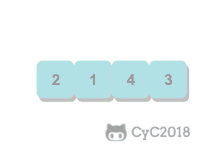
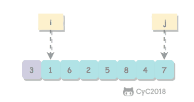

# 算法与数据结构｜09-排序

把订单按金额排名、把日志按时间对齐、在去重前让相同键相邻——这些任务表面各不相同，底层都在做同一件事：把数据重新排列成可预测的顺序。可真到选型时，问题立刻变多：数据已经接近有序，还要不要用通用排序？服务不能接受最坏情况抖动，该选谁？用户要求“金额相同的订单保持原来的提交顺序”，为什么随手挑一个排序可能违反要求？

排序的知识点是一组契约，而不是背诵若干算法的名字：输入是什么、输出必须满足什么、在什么输入下快、何时会变慢、额外空间从哪里来、相等键的相对次序是否保留。把这组契约讲清楚，“该用哪种排序”就是从数据规模、分布、稳定性和内存约束推导出来的结论，而不是记忆题。本文先建立评价维度，再依次拆解基础排序、归并、快速排序、堆排序与非比较排序，最后回到 Dart 的 `List.sort` 与四道例题。

<!-- GFM-TOC -->
* [为什么排序是基础操作](#为什么排序是基础操作)
* [评价排序算法的维度](#评价排序算法的维度)
* [选择、冒泡与插入排序](#选择冒泡与插入排序)
    * [选择排序：每轮把最小值换到已排序区末尾](#选择排序每轮把最小值换到已排序区末尾)
    * [冒泡排序：每轮让最大值上浮到右端](#冒泡排序每轮让最大值上浮到右端)
    * [插入排序：把当前元素插入左侧有序区](#插入排序把当前元素插入左侧有序区)
    * [希尔排序：让元素先大幅跳跃，再收敛到插入排序](#希尔排序让元素先大幅跳跃再收敛到插入排序)
* [归并排序](#归并排序)
    * [合并的不变量与稳定性条件](#合并的不变量与稳定性条件)
    * [自顶向下与自底向上](#自顶向下与自底向上)
    * [复杂度](#复杂度)
* [快速排序](#快速排序)
    * [切分不变量](#切分不变量)
    * [随机枢轴、期望与最坏情况](#随机枢轴期望与最坏情况)
    * [三向切分：把重复键一次性归位](#三向切分把重复键一次性归位)
* [堆排序](#堆排序)
* [非比较排序的适用边界](#非比较排序的适用边界)
* [排序之外的选择问题](#排序之外的选择问题)
* [Dart 的排序接口：List.sort](#dart-的排序接口listsort)
* [什么时候用，什么时候别用](#什么时候用什么时候别用)
* [常见坑与边界](#常见坑与边界)
* [知识点应用](#知识点应用)
    * [例题 1：只含 0、1、2 的数组原地排序](#例题-1只含-012-的数组原地排序)
    * [例题 2：数组中的逆序对](#例题-2数组中的逆序对)
    * [例题 3：把数组排成最小的数](#例题-3把数组排成最小的数)
    * [例题 4：数组中第 K 个最大元素](#例题-4数组中第-k-个最大元素)
* [面试考点与追问](#面试考点与追问)
* [小结](#小结)
* [参考资料](#参考资料)
* [要点](#要点)
<!-- GFM-TOC -->

## 为什么排序是基础操作

很多算法都要求输入有序：二分查找要求候选区间按比较器单调，去重可以把问题缩小为“相同键是否相邻”，区间调度先按结束时间排序，双指针扫描有序数组才能保证不漏解。排序本身不产生业务结果，但它把任意分布的输入变成结构可预测的输入，让这些后继操作有定义、可证明。参见[查找与二分查找](./10-查找与二分查找.md)中对“有序前提”的讨论。

先固定一组术语，后面所有讨论都基于它们：

- **记录（record）**：待排序的元素，可以是一个数字，也可以是包含多个字段的对象。
- **键（key）**：记录中用于比较的字段或派生值。
- **比较器（comparator）**：把两条记录映射为“小于、相等、大于”三选一的函数，通常返回负数、零、正数。
- **排列（permutation）**：输出包含输入的全部元素，只是位置可能改变。

排序的契约可以写成一条精确断言：输出是输入的一个排列，且任意相邻两条记录都满足 `compare(a[i], a[i+1]) <= 0`。**键相等由比较器定义，而不是由对象的 `==` 定义**：比较器返回 0 时两条记录被视为同优先级，即使它们是不同对象。排序稳定（stable）这个附加约定则要求：若两条记录的键相等，排序后它们的相对次序与输入一致。它不影响“结果有序”这一最低要求，却决定了多条记录、多轮排序能否组合使用。

排序的产物是一个满足比较器次序的排列，而不是“看起来整齐”；后续算法依赖的正是这个可预测结构，以及可选的稳定性约定。

## 评价排序算法的维度

两个算法都“能排序”，不代表它们可以互相替换。评价排序至少有六个维度：

1. **最好 / 平均 / 最坏时间复杂度**：只写一个阶会掩盖输入分布的影响。快速排序最坏是 Θ(n²)，但随机化之后期望是 Θ(n log n)。
2. **期望与确定性**：随机化算法给出的界是“期望”，它对任何最坏输入都成立，代价是结果有小概率变差；确定性算法给出的是无条件保证。
3. **额外空间**：原地（in-place）通常指除常量辅助变量外不需要与 n 同阶的空间；递归调用栈也属于额外空间，只是量级不同。
4. **稳定性（stability）**：相等键的记录保持输入相对次序。
5. **自适应性（adaptivity）**：能否利用输入已有的部分有序，例如插入排序在近乎有序时接近线性。
6. **常数因子与访问模式**：同为 Θ(n log n)，顺序扫描与跳跃访问的真实差距可能很大，这一项要单独评估。

稳定性为什么值得单独列一条？假设订单列表先按提交时间排好，现在要“按金额升序，金额相同保持提交时间顺序”：稳定排序再按金额排一次即可；不稳定排序则必须把所有关键字一次写进比较器，否则相等金额的次序不受控。只要把关键字组合齐全，就不依赖底层排序是否稳定：

```dart
/// 按部门升序、部门相同按薪资升序；不依赖底层排序是否稳定。
void sortStaff(List<(String, int)> staff) {
  staff.sort((a, b) {
    final byDepartment = a.$1.compareTo(b.$1);
    if (byDepartment != 0) return byDepartment;
    return a.$2.compareTo(b.$2);
  });
}
```
<!-- verify: .work/verify/A09/list_sort_demo.dart -->

接下来是使用排序时最容易被误用的一条结论：**任何只通过“比较两条记录的键”获取信息的排序算法，最坏情况下至少需要 Ω(n log n) 次比较**。用决策树（decision tree）直观看：n 个互不相同的键有 n! 种排列，每个叶子对应一种输出；每次比较只有两个分支，深度 h 的二叉树最多 2^h 个叶子，于是 2^h ≥ n!，h ≥ log₂(n!) = Θ(n log n)（Stirling 近似：log₂(n!) = n log₂ n − 1.44n + O(log n)）。

这条下界有两处前提必须说清：

- “只通过比较”：非比较排序利用键的数值结构（桶、数位），没有把键当黑盒做两两比较，因此不受该下界约束（见下文“非比较排序的适用边界”）。
- “最坏情况”：下界不否认某些输入只需 n−1 次比较就能确认有序（插入排序在已排序输入上正是如此）；它说的是存在难以区分的输入，使任何比较排序都躲不开足够深的决策路径。

> 稳定性、最坏时间保证与额外空间都是排序契约的一部分；Ω(n log n) 只约束比较模型的最坏情况，既不否定非比较排序，也不否定已有序输入上的线性行为。

## 选择、冒泡与插入排序

三种 Θ(n²) 排序（选择、冒泡、插入）的价值不在性能，而在于它们用最简单的结构展示了“每轮维持什么不变量”；希尔排序则展示怎么改造插入排序。理解这些不变量，是后面读懂归并、快排、堆排序的基础。

### 选择排序：每轮把最小值换到已排序区末尾

每轮开始时的不变量是：`[0, i)` 已经存放了全数组最小的 i 个元素且有序，`[i, n)` 是尚未处理的元素。内层循环在 `[i, n)` 中找到最小值下标，再与位置 i 交换。

```dart
/// 选择排序：每轮在未排序区 [i, n) 中选出最小元素，与位置 i 交换。
void selectionSort<T>(List<T> values, int Function(T, T) compare) {
  for (var i = 0; i < values.length - 1; i++) {
    var minIndex = i; // 1. 先假定未排序区首位最小
    for (var j = i + 1; j < values.length; j++) {
      if (compare(values[j], values[minIndex]) < 0) minIndex = j;
    }
    if (minIndex != i) swapAt(values, i, minIndex); // 2. 最小值归位
  }
}
```
<!-- verify: .work/verify/A09/elementary_sorts.dart -->

选择排序约做 n²/2 次比较、至多 n−1 次交换，且**比较次数与输入顺序无关**——已有序数组也要走完全部比较。交换跨距离进行，可能让相等元素互相越过，因此不稳定。它的现实意义是交换次数最少，“比较便宜、移动昂贵”的场景会看重这一点。

### 冒泡排序：每轮让最大值上浮到右端

第 k 轮结束后，最大的 k 个元素已经位于数组末尾；每轮只在相邻元素之间比较和交换，每交换一次恰好消除一个逆序对（inversion），即满足 `i < j` 且 `a[i] > a[j]` 的一对元素。记录“本轮是否发生交换”，没有交换就说明已经有序，可以提前退出（实现见验证文件 `elementary_sorts.dart` 的 `bubbleSort`）。

冒泡排序稳定：只有严格逆序才交换，相等元素不会越过彼此。最好情况（已有序）比较 n−1 次；平均与最坏是 Θ(n²)。它的主要价值是教学——同样 Θ(n²) 的成本下，插入排序在近乎有序输入上更实用。

### 插入排序：把当前元素插入左侧有序区

不变量是 `[0, i)` 始终有序。取出 `values[i]`，把左侧所有比它大的元素右移一格，再把它放进空位。

```dart
/// 插入排序：把 values[i] 插入左侧有序区 [0, i) 的正确位置。
void insertionSort<T>(List<T> values, int Function(T, T) compare) {
  for (var i = 1; i < values.length; i++) {
    final current = values[i];
    var j = i;
    while (j > 0 && compare(current, values[j - 1]) < 0) {
      values[j] = values[j - 1]; // 1. 比 current 大的元素右移一格
      j--;
    }
    values[j] = current; // 2. 严格小于才左移：相等元素不会越过，保持稳定
  }
}
```
<!-- verify: .work/verify/A09/elementary_sorts.dart -->

插入排序的代价由逆序对数量驱动：交换（移动）次数等于逆序对数，比较次数在“逆序对数”与“逆序对数 + n”之间。因此已有序输入只需 n−1 次比较、0 次移动；全部元素相等时也是线性时间；倒序输入才退化到约 n²/2 次比较。移动只发生在相邻位置，稳定；额外空间 O(1)。这让它成为小数组和近乎有序数据的常用选择，也常被库排序用作小规模时的收尾算法。

<div align="center">
  
</div>
<p align="center">图 1：插入排序把当前元素插入左侧有序区。素材来源：CyC2018 CS-Notes 上游图片（CC BY-NC-SA 4.0，随上游仓库声明）。</p>

插入排序的 Θ(n²) 来自“逆序对数量”驱动的成本，并不是固定开销；近乎有序时它接近线性，这正是自适应性的体现。

### 希尔排序：让元素先大幅跳跃，再收敛到插入排序

插入排序每次只能把元素移动一个位置，一次消除一个逆序对；对大规模乱序数组太慢。希尔排序（Shell sort）先对间隔 h 的子序列做插入排序（称为 h-有序），再不断缩小 h，最后 h=1 时做一次普通插入排序：大间隔阶段让元素长距离移动，后续阶段逆序对已很少。实现结构与插入排序一致，只是外层多了一层间隔循环（见验证文件 `elementary_sorts.dart` 的 `shellSort`）。

希尔排序的复杂度依赖增量序列，**不存在对任意序列都成立的单一紧确界**。本代码使用 1, 4, 13, 40, …（3h+1）序列，Sedgewick & Wayne 对此给出的比较次数上界是 O(n^{3/2})，换用其他序列结论会变。它原地，但跨间隔移动破坏稳定性。

> 说“希尔排序的复杂度是 O(n^{3/2})”时必须带上增量序列；脱离序列谈单一复杂度是不严谨的。增量序列的最后一个间隔必须是 1，否则不能保证最终有序。

## 归并排序

归并排序（merge sort）的动机与前三种不同：它追求稳定的最坏保证。做法是分治（divide and conquer，与[递归、分治与回溯](./11-递归、分治与回溯.md)中的通用框架同源）：把区间对半拆开，分别排序，再合并两个有序区间。真正决定正确性与稳定性的是合并（merge）这一步。

### 合并的不变量与稳定性条件

合并开始时，`[lo, mid]` 与 `[mid+1, hi]` 各自已经有序。合并过程维护一个简单状态：两个指针分别指向两个有序区间的下一个待取元素，每次取走两者中较小者，保证输出前缀是全部剩余元素中的最小若干项。

```dart
/// 合并两个相邻有序区间 [lo, mid]、[mid+1, hi]。
void _merge<T>(
  List<T> values,
  List<T> aux,
  int lo,
  int mid,
  int hi,
  int Function(T, T) compare,
) {
  for (var k = lo; k <= hi; k++) {
    aux[k] = values[k]; // 1. 复制到辅助数组，归并时从 aux 读取
  }
  var i = lo;
  var j = mid + 1;
  for (var k = lo; k <= hi; k++) {
    if (i > mid) {
      values[k] = aux[j++]; // 2. 左半耗尽，取右半
    } else if (j > hi) {
      values[k] = aux[i++]; // 3. 右半耗尽，取左半
    } else if (compare(aux[i], aux[j]) <= 0) {
      values[k] = aux[i++]; // 4. 相等时先取左侧，这是稳定性的唯一来源
    } else {
      values[k] = aux[j++];
    }
  }
}
```
<!-- verify: .work/verify/A09/merge_sort.dart -->

`compare(aux[i], aux[j]) <= 0` 中的等号是关键：相等时先取左侧，原序列中靠前的记录就不会被后者越过。把它改成 `< 0`（相等取右侧），算法仍然正确，却不再稳定。

### 自顶向下与自底向上

实现有两种组织方式：自顶向下版本递归拆分区间，`aux` 在顶层分配一次并全数组共享，避免每层重复分配；自底向上版本不再递归，先两两合并长度为 1 的区间，再合并长度为 2、4……直到覆盖整个数组，省掉递归栈，但辅助数组与时间开销相同。两者都在验证文件 `merge_sort.dart` 中，同一组输入下结果一致。

### 复杂度

设区间长度为 n，递归式 `T(n) = 2T(n/2) + Θ(n)`：递归树每层做 Θ(n) 的合并工作，共有 Θ(log n) 层，因此最好、平均、最坏都是 Θ(n log n)。额外空间 Θ(n)（辅助数组）；自顶向下版本还有 Θ(log n) 的递归栈。基本形式不利用输入的有序性，不自适应。

归并排序的稳定性只来自“相等先取左”这一个条件，与分治结构无关；去掉它算法依然正确，只是不再保留相等键的输入次序。

## 快速排序

快速排序（quicksort）换了一个思路：不预先保证切分点两侧有序，而是把枢轴（pivot）放到它在最终结果中的位置，再递归处理左右两侧。它不需要合并步骤，且切分可以原地完成。

### 切分不变量

以区间最后一个元素为枢轴（随机选中的一个元素先换到末尾），维护区间 `[lo, hi]` 内的三段：`[lo, store)` 全部小于枢轴，`[store, i)` 全部大于等于枢轴，`[i, hi)` 尚未检查。扫描结束后把枢轴与 `values[store]` 交换，枢轴就落在最终位置。

```dart
/// 切分 [lo, hi]：返回枢轴最终下标 p，满足
/// [lo, p) 的元素都小于枢轴，[p] 是枢轴，(p, hi] 的元素都大于等于枢轴。
int partition<T>(
  List<T> values,
  int lo,
  int hi,
  int Function(T, T) compare,
  Random random,
) {
  // 1. 随机挑一个枢轴元素并换到区间末尾，避免固定枢轴被有序输入击穿
  final pivotIndex = lo + random.nextInt(hi - lo + 1);
  _swap(values, pivotIndex, hi);
  final pivot = values[hi];
  var store = lo;
  for (var i = lo; i < hi; i++) {
    if (compare(values[i], pivot) < 0) {
      _swap(values, store, i); // 2. 把小于枢轴的都搬到左侧
      store++;
    }
  }
  _swap(values, store, hi); // 3. 枢轴归位到分界处
  return store;
}

/// 快速排序：切分后左右子区间各自排序。
void quickSort<T>(
  List<T> values,
  int Function(T, T) compare, {
  Random? random,
}) {
  final rng = random ?? Random();
  void sortRange(int lo, int hi) {
    if (hi <= lo) return;
    final p = partition(values, lo, hi, compare, rng);
    sortRange(lo, p - 1);
    sortRange(p + 1, hi);
  }

  sortRange(0, values.length - 1);
}
```
<!-- verify: .work/verify/A09/quick_sort.dart -->

切分不变量决定了递归区间：枢轴位置 p 已经归位，只需递归 `[lo, p-1]` 与 `[p+1, hi]`。若误写成递归 `[lo, p]`，当 p 等于 lo 时会无限递归。

<div align="center">
  
</div>
<p align="center">图 2：快速排序的切分过程，i 与 j 相向扫描，相遇后把枢轴换到分界处（图中枢轴为 3）。素材来源：CyC2018 CS-Notes 上游图片（CC BY-NC-SA 4.0，随上游仓库声明）。</p>

### 随机枢轴、期望与最坏情况

若切分近似对半，递归式 `T(n) = 2T(n/2) + Θ(n)` 给出 Θ(n log n)。随机选择枢轴后，期望比较次数不超过 2n ln n ≈ 1.39 n log₂ n——这是**期望**，对任何输入都成立，而不是“假设输入随机”。

反例同样重要：固定取首元素为枢轴时，已排序输入每次都是 0 与 n−1 的极端划分，比较约 n²/2；本文的验证代码还覆盖了“全部元素相等”的数组，Lomuto 切分下正好退化到 n(n−1)/2 次比较。因此实现通常用随机枢轴或三数取中（median-of-three）。

空间方面，切分本身原地，但递归栈最理想 Θ(log n)、最坏 Θ(n)；快排不保证稳定，切分交换会大范围移动元素。

### 三向切分：把重复键一次性归位

当键大量重复时，二路切分把“等于枢轴”的元素反复留在两侧递归，效率很差。荷兰国旗式三向切分（Dutch national flag）把区间维护成三段：`[lo, lt)` 小于枢轴，`[lt, i)` 等于枢轴，`(gt, hi]` 大于枢轴。等于枢轴的元素不进入任何递归区间，全部相等的输入只做 n−1 次比较。

完整实现见验证文件 `three_way_quick_sort.dart`：`i` 从左推进，遇到大于枢轴的元素与 `gt` 交换后 `gt` 回退且 `i` 不动，遇到等于枢轴的元素则并入中段。例题 1 会把同一套不变量落到只有三个键值的具体场景上。

> 快速排序的 “O(n log n)” 是随机枢轴下的期望界；最坏 Θ(n²) 依然存在。三向切分不改变期望阶，但它让重复键不再参与递归，是处理“键域很小、重复很多”的标准修复。

## 堆排序

堆排序（heapsort）复用二叉堆的两个不变量：数组表示的完全二叉树形状，以及父节点不小于子节点的堆序。堆的结构、上浮下沉与优先队列操作见[堆与优先队列](./07-堆与优先队列.md)，这里只关注如何借它完成排序。0-based 数组中，位置 i 的子节点是 `2i+1`、`2i+2`。

```dart
/// 在 [0, end] 范围内下沉位置 i：0-based 最大堆，i 的子节点是 2i+1、2i+2。
void siftDown<T>(List<T> heap, int i, int end, int Function(T, T) compare) {
  while (true) {
    final left = 2 * i + 1;
    final right = left + 1;
    var largest = i;
    if (left <= end && compare(heap[left], heap[largest]) > 0) {
      largest = left;
    }
    if (right <= end && compare(heap[right], heap[largest]) > 0) {
      largest = right;
    }
    if (largest == i) return; // 父子堆序已满足
    _swap(heap, i, largest);
    i = largest;
  }
}

/// Floyd 自底向上建堆：从最后一个非叶节点开始反向下沉。
void buildMaxHeap<T>(List<T> heap, int Function(T, T) compare) {
  for (var i = heap.length ~/ 2 - 1; i >= 0; i--) {
    siftDown(heap, i, heap.length - 1, compare);
  }
}

/// 堆排序：先建大顶堆，再反复把堆顶换到区间末尾并收缩。
void heapSort<T>(List<T> values, int Function(T, T) compare) {
  buildMaxHeap(values, compare); // 1. O(n) 建堆
  for (var end = values.length - 1; end > 0; end--) {
    _swap(values, 0, end); // 2. 当前最大值归位到 end
    siftDown(values, 0, end - 1, compare); // 3. 在 [0, end-1] 内恢复堆序
  }
}
```
<!-- verify: .work/verify/A09/heap_sort.dart -->

**建堆为什么是 O(n)，而不是 O(n log n)？** 前提是 Floyd 自底向上建堆：从最后一个非叶节点开始下沉。高度 h 的节点约 n / 2^{h+1} 个、每个最多下沉 h 层，总代价 Σ h · n / 2^{h+1} = O(n)——越深的节点越多，可下沉高度越小，求和收敛到常数倍 n。若逐个插入堆再上浮，建堆就是 O(n log n)：前提不同，结论不同。

排序阶段做 n−1 次“交换堆顶与末尾 + 下沉”，每次 O(log n)，总时间 Θ(n log n)（迭代下沉，O(1) 数组额外空间）。对互不相同的键，最好情况也是 Ω(n log n)，不会因输入接近有序而变快；显著例外是重复键：全部元素相等时换到堆顶的元素不小于子节点，下沉立刻停止，比较次数接近线性。堆排序不稳定，且下沉等价于在树上来回跳跃，局部性不如顺序扫描。

建堆 O(n) 依赖 Floyd 自底向上这一实现；堆排序的 Θ(n log n) 覆盖所有输入（互异键），而它“原地 + 最坏保证”的代价是不稳定与较差的局部性。

## 非比较排序的适用边界

前面的算法都只通过比较获取键的信息，受 Ω(n log n) 制约。计数排序（counting sort）走的是另一条路：如果键是已知小范围内的整数，就直接统计每个键出现多少次，再按统计结果把元素摆放回去。

```dart
/// 稳定计数排序：键值必须是 [0, maxKey] 中的整数。
List<T> countingSortByKey<T>(
  List<T> values,
  int Function(T) keyOf,
  int maxKey,
) {
  if (values.isEmpty) return <T>[];
  final counts = List<int>.filled(maxKey + 1, 0);
  for (final value in values) {
    counts[keyOf(value)]++; // 1. 统计每个键出现次数
  }
  for (var key = 1; key <= maxKey; key++) {
    counts[key] += counts[key - 1]; // 2. 前缀和：counts[key] 是键值 <= key 的元素个数
  }
  final output = List<T>.filled(values.length, values.first);
  for (var i = values.length - 1; i >= 0; i--) {
    // 3. 从右往左回填：相等键中原来的后者后放置，从而保持稳定
    final key = keyOf(values[i]);
    counts[key]--;
    output[counts[key]] = values[i];
  }
  return output;
}
```
<!-- verify: .work/verify/A09/counting_radix_sort.dart -->

复杂度 Θ(n + k)（k 为键域大小），额外空间 Θ(n + k)。稳定性有一条容易忽略的条件：回填必须从右往左，让同键记录中靠后者后放置；从左往右会颠倒同键次序，破坏稳定性。

另外两类非比较排序都是在它的基础上扩展：

- **桶排序（bucket sort）**：把值域划分成若干桶，桶内各自排序后按桶序拼接。当键近似均匀分布、桶数量与 n 成正比时，期望 Θ(n)；若全部键落入同一个桶，退化回桶内排序的复杂度（可能 Θ(n²)）。桶内排序稳定且拼接有序时，整体才稳定。
- **基数排序（radix sort，LSD）**：按最低位到最高位做 d 轮稳定计数排序，每轮处理一个 b 进制数位，总时间 Θ(d(n + b))，额外空间 Θ(n + b)。它要求键能按固定宽度拆成数位（整数、定长字符串），且每轮的子排序必须稳定——稳定性保证高位中相等的记录维持低位的相对次序。

三者的共同前提是**键本身带有可用的数值/位结构**，而不是“比较得更快”。键域 k 远大于 n（例如稀疏大整数）时，计数排序的 Θ(k) 空间会先拖垮程序；负数需要先映射偏移，浮点数不能直接当整数下标。

> 非比较排序绕开了比较下界的前提：它们不再把键当黑盒两两比较，代价是键域、额外空间和“子过程必须稳定”等附加条件。

## 排序之外的选择问题

很多需求其实不需要全序，只要“第 k 小的元素”或“最大的 k 个元素”。这时全排序是奢侈的：它把其余 n − k 个元素也排好了，而这些结果没人看。

**快速选择（quickselect）** 复用切分：切分后若枢轴位置正好是目标下标，答案就是它；否则丢弃不含目标的一侧，只在一半区间继续切分。期望代价是 `T(n) = T(n/2) + Θ(n)`，等比求和得到 Θ(n)；最坏情况仍可能每次只划分掉一个元素，退化为 Θ(n²)。它对输入分布不做假设（随机枢轴），但会原地打乱输入。

**大小为 k 的堆** 是另一条路线：扫描数组维护一个容量为 k 的堆，时间 Θ(n log k)、额外空间 Θ(k)，不修改输入，而且天然适合流式数据——数据边到达边处理，不需要保存全部元素。当 k 远小于 n 时 `log k` 很小，实际比快速选择更稳。

| 方案 | 时间 | 额外空间 | 是否修改输入 | 适合的场景 |
| :--- | :--- | :--- | :--- | :--- |
| 全部排序后取下标 | Θ(n log n) | 取决于排序算法 | 原地排序会修改 | 之后还要多次按次序访问元素 |
| 快速选择 | 期望 Θ(n)，最坏 Θ(n²) | O(1)（迭代实现） | 是 | 一次性求第 k 个元素 |
| 大小为 k 的堆 | Θ(n log k) | Θ(k) | 否 | k 很小或数据流式到达 |

补充一点：选择问题存在最坏情况线性时间的确定性算法（CLRS 第 9 章的 median-of-medians），但它常数大、实现复杂；工程中更常见的是随机化快速选择，或直接用小根堆。

快速选择只定位一个次序统计量，不产生全序；用堆还是用快速选择，取决于 k 的大小、是否需要流式处理、以及能否修改输入。

## Dart 的排序接口：List.sort

Dart 的 `List.sort` 是实际工程中的默认答案，它的公开契约有三点最要紧：

- **原地修改**：`sort` 返回 `void`，直接改变列表本身。想保留原列表，先复制再排序。
- **比较器契约**：可以省略比较器（使用元素的 `Comparable` 自然序），也可以传入一个比较函数。官方文档要求它“act as a Comparator”，即返回负数、零、正数分别表示小于、相等、大于，构成一致的全序。
- **不保证稳定**：官方 API 文档明确写着 “The sort function is not guaranteed to be stable”，并给出相等元素可能以任意顺序出现的示例。因此依赖“相等键保持输入次序”的代码不能建立在 `List.sort` 上，要么把关键字写进同一个比较器，要么改用自己实现的稳定排序。

```dart
/// 省略比较器时使用元素的 Comparable 自然序，原地修改列表。
void sortScores(List<int> scores) {
  scores.sort();
}

/// 传入比较器：按字符串长度升序。
void sortWordsByLength(List<String> words) {
  words.sort((a, b) => a.length.compareTo(b.length));
}

/// 返回排序后的副本，原列表保持不变。
List<int> sortedCopy(List<int> values) {
  return List<int>.of(values)..sort();
}
```
<!-- verify: .work/verify/A09/list_sort_demo.dart -->

两个常见的比较器坑：不要用 `a - b` 充当比较结果——非数值类型不适用，而且[原生 int 的溢出会按 64 位回绕](../../01-数据表示/01-二进制表示与位运算.md)，符号可能翻转；统一用 `a.compareTo(b)`。比较器还必须一致：同一对值重复调用返回相同结果且满足传递性，否则排序结果没有定义。

> **时效信息（核查日期：2026-09）：** Dart 3.12.2 中，`List.sort` 的实现（SDK 源码 `lib/internal/sort.dart` 与 `lib/collection/list.dart`）对小数组走插入排序（阈值 32）、其余走 Yaroslavskiy 双枢轴快排。这是该版本的实现事实，用来解释行为差异可以，但不能当成语言保证；API 文档没有承诺稳定性与具体复杂度。

## 什么时候用，什么时候别用

**该用排序的信号：**

- 需要完整次序，或同一批数据会被多次按次序访问：直接 `List.sort`，只有明确理由才手写算法。
- 需要稳定语义（多轮排序、相等键保持原次序）：自写归并排序，或把所有关键字放进一个比较器。
- 空间紧张且要求最坏情况可控：堆排序，原地且 Θ(n log n)。
- 数据近乎有序且规模不大：插入排序接近线性，常数也低。
- 键是受限范围内的整数（分数、年龄、计数）：计数排序或基数排序可以是线性时间。
- 只求第 k 个 / 最大的 k 个：快速选择或大小为 k 的堆，而不是全排序。

**不该用排序的信号：**

- 只需判断是否存在、去重或计数：哈希表 / `Set` 更直接，排序反而多付 O(n log n)。
- 只查一次“包含吗”：线性扫描或哈希即可，不必先排序再二分。
- 键无法定义一致的比较器：排序没有良定义，先修模型。
- 流式输入且内存放不下全部数据：要么用大小为 k 的堆做有界统计，要么做外部排序，不能指望单机全量排序。
- 正例：订单按 (金额升序, 提交时间升序) 全序展示——一个组合比较器即可，不依赖库排序是否稳定。
- 反例：100 万条日志只取耗时最长的 10 条——全排序 Θ(n log n) 中大部分工作被浪费，用大小为 10 的最小堆只需 Θ(n log 10)。

## 常见坑与边界

- **比较器不构成一致的全序。** `(a, b) => a < b ? -1 : 1` 永远不返回 0，把不同记录和自身都判成“不相等”，违反传递性与自反性；排序结果不可预测。排序前先在纸面上验证：反自反、反对称、传递。
- **用减法当比较结果。** 大整数相减可能回绕，符号翻转后次序错乱；`String` 等类型根本不支持减法。用 `compareTo` 或显式返回 −1/0/1。
- **误判稳定。** “我测试的两条相等记录顺序没变”不能证明稳定；`List.sort` 的文档明确不保证稳定。需要稳定就要么自己确保比较器包含全部关键字，要么换稳定的实现。
- **归并的等号写丢。** `_merge` 中把 `<= 0` 写成 `< 0`，算法仍能排序，但相等键会先取右侧，稳定性被破坏，且没人会从输出值上发现。
- **切分区间写错。** 二路切分返回的枢轴已归位，递归区间必须是 `[lo, p-1]` 与 `[p+1, hi]`；写成 `[lo, p]` 会在 `p == lo` 时死循环。三向切分中当 `values[i]` 大于枢轴时换来的元素尚未检查，`i` 不能前进。
- **重复键导致退化。** 大量相等键在 Lomuto 切分下会退化为 Θ(n²)（本文验证了 n(n−1)/2 次比较这一精确值）；应使用三向切分，或改用会停在相等键上的 Hoare 风格切分。
- **把平均当最坏。** 快速选择平均 Θ(n)，但最坏 Θ(n²)；固定枢轴 + 已排序输入是经典反例。对延迟敏感的系统要么接受随机化的概率保证，要么改用手写堆或 median-of-medians。
- **排序破坏输入。** 原地排序会修改调用方的列表；需要保留原始次序时先 `List.of(values)` 复制（见验证文件中 `sortedCopy`），或在接口文档中写明会修改。
- **边界输入。** 空数组、单元素、全相等、全倒序都要过一遍；`partition` 在区间长度为 1 时 `random.nextInt(1)` 合法，但仍要靠递归入口的 `hi <= lo` 兜底。
- **非比较排序的前提。** 键域过大时计数数组会先耗尽内存；负数需要偏移映射；基数排序每轮必须是稳定子排序，否则高位相等时低位次序丢失。

## 知识点应用

下面四道题分别对应三向切分、归并计数、比较器设计和快速选择。正文给出可运行的 Dart 实现。

### 例题 1：只含 0、1、2 的数组原地排序

题目：[LeetCode 75. 颜色分类](https://leetcode.cn/problems/sort-colors/)；旧题解分类：排序。

**问题匹配点**：键只有三种取值，是“荷兰国旗三向切分”的天然场景；题目要求原地、一趟完成，正好用 `[0, low)`、`[low, i)`、`(high, n-1]` 三段不变量描述。

**不变量**：扫描过程中，`[0, low)` 全是 0，`[low, i)` 全是 1，`(high, n-1]` 全是 2，`[i, high]` 尚未分类；循环结束时 `i > high`，三段覆盖整个数组。

```dart
/// 原地排序只含 0、1、2 的列表。
/// 不变量：[0, low) 全是 0，[low, i) 全是 1，(high, n-1] 全是 2。
void sortColors(List<int> nums) {
  var low = 0;
  var i = 0;
  var high = nums.length - 1;
  while (i <= high) {
    final color = nums[i]; // 1. 检查未分类区当前元素
    if (color == 0) {
      _swap(nums, low, i); // 2. 0 并入左段；换来的元素来自 1 段，已检查过
      low++;
      i++;
    } else if (color == 2) {
      _swap(nums, i, high); // 3. 2 并入右段；换来的元素还没检查，i 不前进
      high--;
    } else {
      i++; // 4. 1 留在中段
    }
  }
}
```
<!-- verify: .work/verify/A09/sort_colors.dart -->

**复杂度**：每个元素至多被检查一次、至多参与一次交换，时间 Θ(n)；只用三个下标变量，额外空间 O(1)。不是通用排序：它只按“0 < 1 < 2”的固定次序整理，不能推广到任意比较器。

**边界用例**：空数组、单元素、全是同一种颜色、没有 1（只有 0 和 2）都在验证文件中覆盖；关键分支是 `color == 2` 时 `i` 不前进——换来的元素还没看过。

### 例题 2：数组中的逆序对

题目：[LCR 170. 交易逆序对的总数（原剑指 Offer 51）](https://leetcode.cn/problems/shu-zu-zhong-de-ni-xu-dui-lcof/)；旧题解题名：剑指 Offer 51「数组中的逆序对」。

**问题匹配点**：暴力枚举是 Θ(n²)；归并排序的合并阶段天然会比较左右两半的元素，把“左半剩余元素个数”累加进去即可在 Θ(n log n) 内完成计数，不增加额外复杂度。

**不变量/状态**：`_sortAndCount(lo, hi)` 在把区间排成升序的同时，返回完全落在该区间内的逆序对数量。合并时若取右半元素 `aux[j]`，则左半剩余元素 `aux[i..mid]` 都大于它，一次计入 `mid - i + 1`。

```dart
/// 统计逆序对总数；会原地把 nums 排成升序。
int inversionCount(List<int> nums) {
  final aux = List<int>.filled(nums.length, 0); // 1. 全数组共享一份辅助空间
  return _sortAndCount(nums, aux, 0, nums.length - 1);
}

/// 排序 [lo, hi] 并返回该区间内的逆序对数量。
int _sortAndCount(List<int> nums, List<int> aux, int lo, int hi) {
  if (hi <= lo) return 0;
  final mid = lo + (hi - lo) ~/ 2;
  var count =
      _sortAndCount(nums, aux, lo, mid) + _sortAndCount(nums, aux, mid + 1, hi);
  for (var k = lo; k <= hi; k++) {
    aux[k] = nums[k]; // 2. 复制到辅助数组，之后从 aux 归并
  }
  var i = lo;
  var j = mid + 1;
  for (var k = lo; k <= hi; k++) {
    if (i > mid) {
      nums[k] = aux[j++];
    } else if (j > hi) {
      nums[k] = aux[i++];
    } else if (aux[i] <= aux[j]) {
      nums[k] = aux[i++];
    } else {
      // 3. aux[i..mid] 都大于 aux[j]：一次计入 mid-i+1 个逆序对
      count += mid - i + 1;
      nums[k] = aux[j++];
    }
  }
  return count;
}
```
<!-- verify: .work/verify/A09/inversion_count.dart -->

**复杂度**：时间 Θ(n log n)、额外空间 Θ(n)（共享的辅助数组；递归栈 Θ(log n) 被 Θ(n) 吸收）。计数按 n(n−1)/2 增长：原题规模上限 n = 50000 时最大约 1.25×10⁹，n = 100000 时约 5.0×10⁹ 已超出有符号 32 位；Dart 原生 `int` 是 64 位，本例直接返回精确值。牛客版本的题面要求结果对 10⁹+7 取模，若按该版本提交再对结果取模即可。

**边界用例**：空数组与单元素返回 0；已升序返回 0；相等元素不算逆序（`aux[i] <= aux[j]` 的等号）；全倒序时返回 n(n−1)/2。验证文件覆盖了这些情况，并断言了 n = 50000 与 n = 100000 两个规模的精确计数。

### 例题 3：把数组排成最小的数

题目：[LCR 164. 破解闯关密码（原剑指 Offer 45）](https://leetcode.cn/problems/ba-shu-zu-pai-cheng-zui-xiao-de-shu-lcof/)；旧题解题名：剑指 Offer 45「把数组排成最小的数」。

**问题匹配点**：这是“比较器不是自然序”的典型题——两个数谁该排在前面，取决于 `a + b` 与 `b + a` 的字典序，而不是数值大小。把这一比较关系交给排序即可；字符串拼接的细节可参考[字符串算法](./15-字符串算法.md)。

**不变量/状态**：排序完成后，数组按自定义比较器非降序排列，拼接结果就是最小数。该比较器满足传递性，是一个合法的全序关系（相等时拼接结果相同，任意次序等价）。

```dart
/// 把非负整数数组拼接成字典序最小的字符串。
String minNumber(List<int> numbers) {
  final parts = [for (final number in numbers) '$number'];
  // 1. 比较 a+b 与 b+a：结果为负时 a 应排在 b 前面
  parts.sort((a, b) => (a + b).compareTo(b + a));
  // 2. 直接拼接，不转整数：保留全部数位，包括前导 0
  return parts.join();
}
```
<!-- verify: .work/verify/A09/min_number.dart -->

**复杂度**：比较次数 Θ(n log n)，每次比较最多拼接并比较两个字符串（长度不超过单个数的位数 L），总代价 O(n log n · L)，额外空间 O(n · L) 用于保存字符串。不能把结果转成整数：长度上限 100 个元素时拼接结果最多约 900 位，远超 64 位。

**边界用例**：单元素；全零输入按题面“最后结果不需要去掉前导 0”返回等长全零字符串（`[0, 0]` → `"00"`）；`[0, 3, 30, 34, 5, 9]` → `"03033459"` 验证了前导 0 被保留；结果长度断言覆盖 900 位。若平台题面要求“全零时返回 `0`”，需按其规则在该分支特判——以当前力扣题面为准。

### 例题 4：数组中第 K 个最大元素

题目：[LeetCode 215. 数组中的第 K 个最大元素](https://leetcode.cn/problems/kth-largest-element-in-an-array/)；旧题解分类：排序。

**问题匹配点**：只需要一个次序统计量，用快速选择直接定位，期望线性时间；不需要把整个数组排好。也可改用大小为 k 的堆（见[堆与优先队列](./07-堆与优先队列.md)），对应归档中的另一种解法。

**不变量/状态**：搜索区间为 `[lo, hi]`；每次切分后枢轴归位到它在升序中的最终下标 p。若 p 等于目标下标 `target = n - k`（k 从 1 开始），`nums[p]` 即答案；若 p 小于 target，答案只可能在右侧，反之在左侧。切分函数与快速排序一节相同，验证文件内自带一份实现。

```dart
/// 返回第 k 大元素（k 从 1 开始计）；会原地重排 nums。
int kthLargest(List<int> nums, int k) {
  if (k < 1 || k > nums.length) {
    throw RangeError.range(k, 1, nums.length, 'k');
  }
  final target = nums.length - k; // 1. “第 k 大”在升序里位于下标 n-k
  final random = Random();
  var lo = 0;
  var hi = nums.length - 1;
  while (lo <= hi) {
    final p = _partition(nums, lo, hi, random);
    if (p == target) return nums[p]; // 2. 枢轴归位且正好在目标位置
    if (p < target) {
      lo = p + 1; // 3. 丢弃左半，只保留右半
    } else {
      hi = p - 1;
    }
  }
  throw StateError('unreachable');
}
```
<!-- verify: .work/verify/A09/quick_select.dart -->

**复杂度**：期望比较次数为 n + n/2 + n/4 + … < 2n，即期望 Θ(n)；最坏情况（每次只划分掉一个元素）是 Θ(n²)。迭代实现只用常数个下标，额外空间 O(1)；但会原地重排输入，调用方若不希望原数组被修改，需要先复制。与大小为 k 的堆相比：k 很小时堆更稳且不改输入，expected 常数上快速选择更小。

**边界用例**：k = 1（最大值）与 k = n（最小值）；重复值（`[4,4,4,4]` 取第 3 大）；负数；单元素；k 越界抛出 `RangeError`。验证文件全部覆盖。

## 面试考点与追问

> **面试高频：** 什么是排序的稳定性？业务里什么时候必须关心？
> **答题脉络：** 相等键保持输入相对次序 → 多关键字场景（先按时间、再按金额）→ 稳定排序可以分两轮排，不稳定排序必须把关键字一次写进比较器。
> **追问方向：** 哪些排序稳定、哪些不稳定；`List.sort` 是否保证稳定；稳定版归并和快排分别在哪个条件上成立。

> **面试高频：** 为什么近乎有序的数据用插入排序更合适？
> **答题脉络：** 成本由逆序对数量决定 → 近乎有序时交换/移动接近 O(n)，已有序只需 n−1 次比较 → 选择排序、堆排序对这种输入不敏感，通用库排序也不承诺自适应。
> **追问方向：** 逆序对数量与比较、交换次数的关系；插入排序为什么适合做小数组的收尾算法。

> **面试高频：** 归并排序和快速排序怎么选？
> **答题脉络：** 归并稳定、最坏 Θ(n log n)，但要 Θ(n) 辅助空间；快排原地、期望 Θ(n log n)、常数小，但不稳定且有 Θ(n²) 最坏。需要稳定或最坏保证选归并，追求平均性能且能接受概率保证选快排。
> **追问方向：** 快排递归栈的空间；归并用于链表或外部排序的原因；三向切分处理重复键。

> **面试高频：** 快速排序为什么会退化？怎么缓解？
> **答题脉络：** 枢轴选择导致极不平衡划分（固定首元素 + 已排序输入、重复键 + Lomuto）→ 随机枢轴把最坏情况变成小概率 → 三数取中、三向切分进一步稳定表现。
> **追问方向：** 随机化的期望比较次数（≤ 2n ln n）；Lomuto 与 Hoare 切分对相等键的不同处理；小数组切插入排序。

> **面试高频：** 建堆为什么能是 O(n)？堆排序总复杂度为什么仍是 Θ(n log n)？
> **答题脉络：** Floyd 自底向上，高度 h 的节点约 n / 2^{h+1} 个、每个下沉 h 层，求和 O(n) → 排序阶段 n 次取堆顶各 O(log n) → 两者相加仍是 Θ(n log n)。
> **追问方向：** 逐个插入建堆为什么是 O(n log n)；全部键相等时的退化行为；堆排序为什么不稳定、缓存不友好。

> **面试高频：** 为什么比较排序有 Ω(n log n) 的下界？哪些算法不受它约束？
> **答题脉络：** 决策树：n! 个排列对应叶子，每次比较两个分支，树高 ≥ log₂(n!) = Θ(n log n)，前提是“只利用比较结果”。
> **追问方向：** 计数、桶、基数排序为什么能线性；它们的前提与代价；已有序输入只需 n−1 次比较为什么不矛盾。

> **面试高频：** 标准库的排序能不能假设稳定？
> **答题脉络：** 只按官方文档陈述：Dart `List.sort` 明确“不保证稳定”，且没有承诺具体复杂度 → 需要稳定性就自己控制（组合比较器或稳定实现）→ 不要拿某个版本的实现当语言契约。
> **追问方向：** 多关键字比较器的写法；为什么排序副本能避免修改输入；比较器不一致时的后果。

> **面试高频：** 第 K 大元素用快速选择还是堆？
> **答题脉络：** 快速选择期望 Θ(n)、原地、但要改输入且有 Θ(n²) 最坏；大小 k 的堆 Θ(n log k)、Θ(k) 额外空间、不改输入且适合流式。
> **追问方向：** k 与 n 的量级关系；Top K 是否需要有序输出；median-of-medians 的位置。

## 小结

| 算法 | 最好 | 平均 | 最坏 | 额外空间 | 稳定 |
| :--- | :--- | :--- | :--- | :--- | :--- |
| 选择排序 | Θ(n²) | Θ(n²) | Θ(n²) | O(1) | 否 |
| 冒泡排序 | Θ(n) | Θ(n²) | Θ(n²) | O(1) | 是 |
| 插入排序 | Θ(n) | Θ(n²) | Θ(n²) | O(1) | 是 |
| 希尔排序（3h+1） | 取决于输入 | 无单一定式 | 教科书给出 O(n^{3/2}) 比较上界 | O(1) | 否 |
| 归并排序 | Θ(n log n) | Θ(n log n) | Θ(n log n) | Θ(n)（自顶向下另有 Θ(log n) 栈） | 是 |
| 快速排序（随机枢轴） | Θ(n log n) | 期望 Θ(n log n) | Θ(n²) | 期望 Θ(log n) 栈 | 否 |
| 三向切分快排 | Θ(n)（全部相等时） | 期望 Θ(n log n) | Θ(n²) | 期望 Θ(log n) 栈 | 否 |
| 堆排序 | Θ(n log n)† | Θ(n log n) | Θ(n log n) | O(1)（迭代下沉） | 否 |
| 计数排序（键域 k） | Θ(n + k) | Θ(n + k) | Θ(n + k) | Θ(n + k) | 是（从右往左回填） |
| 基数排序（d 位，基数 b） | Θ(d(n + b)) | Θ(d(n + b)) | Θ(d(n + b)) | Θ(n + b) | 是（每轮子排序稳定） |

† 仅对互不相同的键；全部键相等时下沉立即终止，比较次数接近线性。

选择时按顺序问自己四个问题：第一，真的需要完整次序吗（只要 Top K 或第 k 个，就别全排序）？第二，需要稳定语义吗？第三，能承受多大的最坏时间和额外空间？第四，键是否有可利用的受限取值？工程默认是标准库排序，只有在稳定性、最坏时间、空间或键域这些契约上标准库不满足时，才手写对应算法。

## 参考资料

- [R1] [教材] [Introduction to Algorithms, 4th Edition](https://mitpress.mit.edu/9780262046305/introduction-to-algorithms/) — CLRS，第 2、6、7、8、9 章（排序、堆、快速排序、线性时间排序、中位数与选择），ISBN 978-0-262-04630-5，[核查日期：2026-09]。
- [R2] [教材] [Algorithms, 4th Edition](https://algs4.cs.princeton.edu/home/) — Sedgewick & Wayne，第 2.1 节（选择/插入/希尔排序的比较次数、逆序对与增量序列上界）与第 2.2—2.4 节，ISBN 978-0-321-57351-3，[核查日期：2026-09]。
- [R3] [官方文档] [Dart: List.sort](https://api.dart.dev/dart-core/List/sort.html) — Dart API 文档，稳定性与比较器契约的公开表述，[核查日期：2026-09]。
- [R4] [官方文档] [Dart: Comparator](https://api.dart.dev/dart-core/Comparator.html) — Dart API 文档，比较函数返回值约定，[核查日期：2026-09]。
- [R5] [官方文档] [Dart SDK: lib/internal/sort.dart](https://github.com/dart-lang/sdk/blob/main/sdk/lib/internal/sort.dart) — Dart SDK 源码（版本 3.12.2），双枢轴快排与插入排序阈值，[核查日期：2026-09]。
- [R6] [题目] [LeetCode 75. Sort Colors](https://leetcode.cn/problems/sort-colors/) — [核查日期：2026-09]。
- [R7] [题目] [LeetCode 215. Kth Largest Element in an Array](https://leetcode.cn/problems/kth-largest-element-in-an-array/) — [核查日期：2026-09]。
- [R8] [题目] [LCR 170. 交易逆序对的总数（原剑指 Offer 51）](https://leetcode.cn/problems/shu-zu-zhong-de-ni-xu-dui-lcof/) — [核查日期：2026-09]。
- [R9] [题目] [LCR 164. 破解闯关密码（原剑指 Offer 45）](https://leetcode.cn/problems/ba-shu-zu-pai-cheng-zui-xiao-de-shu-lcof/) — [核查日期：2026-09]。

## 要点

> 排序算法的选择取决于契约——是否需要稳定性、能接受的最坏时间与额外空间、键的取值范围与输入分布——而 Ω(n log n) 只约束把所有键当黑盒比较的算法。
