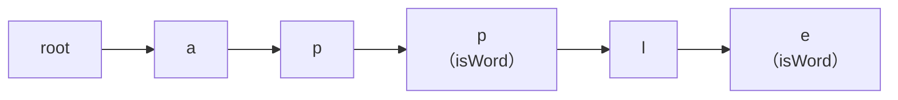

# 算法与数据结构｜15-字符串算法

搜索框里输入两个字母就弹出候选词，日志里按关键词过滤，编辑器按 Ctrl+F 定位子串，词典判断“这个词是否以某前缀开头”——这些功能背后是两类不同的问题：在一个长文本里定位一个模式，和在大量键之间做前缀查询。用最直观的写法都能跑通，但一旦文本变长、键变多、或者输入带着对抗性，直觉版本就会暴露平方级的时间或失控的空间。

更隐蔽的前提是：我们习惯把字符串当成“字符组成的数组”。这个假设在 C 里接近成立，在 Dart、Java、JavaScript 里却会误导人——这些语言的 `String` 是 UTF-16 码元序列，`length` 数的不是“用户看到的字数”，下标也不等于“第几个字符”。字符串算法的复杂度、下标语义和正确性边界，都取决于你数的到底是哪一种单位。

本文的路线：先统一“长度”的口径，再看朴素匹配为什么做重复劳动；然后围绕 KMP 拆解前缀函数（border 表）与失配回跳，并给出可运行的 Dart 实现；接着用 Trie 解决许多键的前缀查询，讨论孩子表示与值聚合的工程取舍；最后用滚动哈希作为拓展，说明“哈希相等”为什么必须复核。

<!-- GFM-TOC -->
* [字符串不是简单的字符数组](#字符串不是简单的字符数组)
    * [四种长度口径](#四种长度口径)
    * [Dart 的 String 在哪一档](#dart-的-string-在哪一档)
* [模式匹配的基线：朴素匹配错在哪里](#模式匹配的基线朴素匹配错在哪里)
* [前缀函数与 border](#前缀函数与-border)
* [KMP 匹配过程：文本指针为什么不回退](#kmp-匹配过程文本指针为什么不回退)
* [Dart 可运行 KMP](#dart-可运行-kmp)
* [Trie 的结构与操作](#trie-的结构与操作)
* [Trie 的工程选择：孩子表示与值聚合](#trie-的工程选择孩子表示与值聚合)
* [字符串哈希与滚动哈希](#字符串哈希与滚动哈希)
* [什么时候用，什么时候别用](#什么时候用什么时候别用)
* [常见坑与边界](#常见坑与边界)
* [知识点应用](#知识点应用)
    * [LeetCode 208：实现 Trie（前缀树）](#leetcode-208实现-trie前缀树)
    * [LeetCode 677：键值映射](#leetcode-677键值映射)
    * [LeetCode 242：有效的字母异位词](#leetcode-242有效的字母异位词)
    * [LeetCode 647：回文子串](#leetcode-647回文子串)
* [面试考点与追问](#面试考点与追问)
* [小结](#小结)
* [参考资料](#参考资料)
* [要点](#要点)
<!-- GFM-TOC -->

本文涉及的语言行为与工具版本按 2026-09-22 核查：Dart 3.12.2（stable）、`characters` 1.4.1。

## 字符串不是简单的字符数组

### 四种长度口径

同一个可见的字符串，可以至少用四种单位来数，数值往往不同：

| 口径 | 单位 | Dart 中怎么取 | `'😀'` 的数量 |
|---|---|---|---|
| 字节 | 某编码下的字节 | `utf8.encode(s)` | UTF-8 下 4 |
| 码元（code unit） | 编码的最小存储单位 | `s.length`、`s.codeUnits` | UTF-16 下 2 |
| 码点（code point） | Unicode 给字符的编号 | `s.runes` | 1 |
| 字素簇（grapheme cluster） | 用户感知的一个字符 | `s.characters` | 1 |

算法题里常写“s 只包含小写英文字母”，这是在声明字母表（alphabet）Σ 只有 26 个符号；复杂度讨论中的 σ = |Σ| 就来自这句约束。声明之外的情况也会遇到，只是多数题目为了避免歧义，把编码与口径问题排除在考点之外。

字符串算法的 n、m、下标和比较次数都必须绑定口径；同一段文本按字节、码元、码点计数会得到不同的长度，后续推导出的复杂度与边界也随之不同。

关于字节与码点的完整关系（UTF-8 变长规则、代理对、乱码成因），属于[字符编码与乱码](../../01-数据表示/02-字符编码与乱码.md)的范围；基本的遍历、拼接、切分操作见[数组与字符串](./02-数组与字符串.md)。

### Dart 的 String 在哪一档

Dart 官方文档对 `String` 的定义是“A sequence of UTF-16 code units”：`length`、下标运算符、`codeUnitAt`、`codeUnits`、`substring` 全部按码元工作；`runes` 才把代理对合并成码点；要在“用户感知字符”这一档操作，需要使用 Dart 团队维护的 `characters` 包（实现 UAX #29 的字素簇边界规则）。下面是 `string_units.dart` 中 `main` 的断言部分（抽取范围：省略末尾的三条打印语句）。

```dart
// 前置条件：Dart 3.12.2；依赖 Dart 官方维护的 characters 包（字素簇处理）。
// 本段只演示“长度”的四种口径，不解决具体算法题。

import 'package:characters/characters.dart';

void main() {
  // 1. '😀' 的码点在 BMP 之外，UTF-16 需要一对代理码元。
  const emoji = '😀';
  assert(emoji.length == 2); // UTF-16 code unit 数
  assert(emoji.runes.length == 1); // Unicode 码点数
  assert(emoji.characters.length == 1); // 字素簇（用户感知字符）数

  // 2. ZWJ 序列由多个码点拼成一个字素簇。
  const family = '👨‍👩‍👧';
  assert(family.length == 8); // 3 个码点 × 2 码元 + 2 个 ZWJ
  assert(family.runes.length == 5);
  assert(family.characters.length == 1);

  // 3. “e + 组合重音符”在字素簇口径下是一个字符。
  const decomposed = 'e\u0301';
  assert(decomposed.length == 2);
  assert(decomposed.runes.length == 2);
  assert(decomposed.characters.length == 1);

  // 4. 索引、codeUnitAt 和 substring 都按码元计数。
  assert('abc'.codeUnitAt(1) == 0x62);
  assert('中'.length == 1 && '中'.runes.first == 0x4E2D);
  assert('a😀b'.codeUnitAt(1) == 0xD83D); // 高代理，单独拿出来不是合法字符
}
```

<!-- verify: .work/verify/A15/string_units.dart -->

companion 文件在断言之后还会打印三行长度对照，例如 `😀: length=2 runes=1 characters=1`。注意第 4 组断言的含义：按码元下标访问 `'a😀b'` 的第 1 位，拿到的是高代理 `0xD83D`，它单独不构成合法字符——这正是“按码元切字素”会切坏文本的微观机制。

本文后续算法默认按码元实现，因为 Dart 的 `String` API 就在这一档；如果你的需求是“用户可见字符”，应先转成 `runes` 或 `characters` 再套同一套算法。

> **面试高频：** 反转字符串、统计字符、判断回文，应该按哪个口径处理？
> **答题脉络：** 先问“字符”指字节、码元、码点还是字素簇 → 说明 Dart/Java/JS 的 `String.length` 数的是 UTF-16 码元 → 涉及用户可见字符时用字素簇（UAX #29），题目声明 ASCII 时按声明处理。
> **追问方向：** 代理对在中间截断会发生什么、组合字符、emoji 的 ZWJ 序列、UTF-8 按字节切分、`characters` 包与 `String` 方法的差异。

## 模式匹配的基线：朴素匹配错在哪里

约定：文本 `text` 长度为 n，模式 `pattern` 长度为 m（均按码元计），字母表为 Σ；目标是在 `text` 中找出 `pattern` 首次出现的下标。最直观的算法枚举每个可能的起点，逐字符比较：

```dart
// 前置条件：Dart 3.12.2；纯 Dart；n 与 m 均按 UTF-16 code unit 计。

/// 朴素匹配：每个起点都重新逐字符比较。
/// 返回 pattern 首次出现的下标；pattern 为空时约定返回 0，未找到返回 -1。
int naiveIndexOf(String text, String pattern) {
  final n = text.length;
  final m = pattern.length;
  for (var start = 0; start + m <= n; start++) {
    var matched = 0;
    while (matched < m &&
        text.codeUnitAt(start + matched) == pattern.codeUnitAt(matched)) {
      matched++;
    }
    if (matched == m) return start;
  }
  return -1;
}
```

<!-- verify: .work/verify/A15/kmp_search.dart -->

朴素匹配的最坏情况出现在“每个起点都能匹配很长一段前缀、最后一位才失配”的输入上。取 `text = a^80`、`pattern = a^40 + b`，每个起点要比较 41 次，共 40 个起点；验证脚本统计到：n=40 时 420 次字符比较，n=80 时 1640 次，输入规模翻倍而比较次数约为 3.9 倍，在最坏情况下趋近 O(n·m)。

> 朴素匹配的问题在于每次换起点后，把刚刚确认过的大段相等前缀全部丢掉，并不是“比较错了”；KMP 复用这份信息，滚动哈希则换用指纹先把候选窗口筛一遍。

需要区分最坏与平均：随机文本上通常前几个字符就失配，朴素匹配接近线性；它的代价出现在长重复串、对抗性输入，以及“必须给出最坏保证”的场景（如安全过滤、流式数据）。另外，Dart 的 `String.indexOf` 公开契约只承诺“返回首次匹配的位置”，不承诺内部算法与最坏复杂度；一次性的普通查找直接用标准库更简单，但不要把“标准库很快”当作可依赖的复杂度保证。

## 前缀函数与 border

把字符串 S 的一个 border 定义为：同时是 S 的真前缀（不允许等于 S 本身）与后缀的字符串。例如 `abacaba` 的 border 有 `a` 和 `aba`，最长 border 的长度是 3。

对模式 P，前缀函数（也叫 LPS 数组，longest proper prefix which is also suffix）在位置 i 上记录：`P[0..i]` 的最长 border 的**长度**。用 P = `ababaca` 逐格算：

```text
i        0  1  2  3  4  5  6
P[i]     a  b  a  b  a  c  a
pi[i]    0  0  1  2  3  0  1
```

读法是：`P[0..4] = ababa` 的最长 border 是 `aba`，长度为 3；`P[0..5] = ababac` 没有非空 border，长度为 0；`P[0..6] = ababaca` 的最长 border 是 `a`，长度为 1。

构造时不需要对每个位置枚举所有长度（那样最直观的写法是 O(m³)）；利用一个事实即可增量计算：任何比当前最长 border 更短的 border，必然也是这个最长 border 的 border，于是失配时可以沿 `pi[border-1]` 链回退。

```dart
/// 前缀函数：lps[i] 是 pattern[0..i] 的最长 border（真前缀兼后缀）的“长度”。
List<int> buildLps(String pattern) {
  final lps = List<int>.filled(pattern.length, 0);
  var border = 0; // 位置 i-1 的最长 border 长度
  for (var i = 1; i < pattern.length; i++) {
    // 1. 失配时沿 border 链回退，直到下一位可能匹配或退到 0。
    while (border > 0 && pattern.codeUnitAt(i) != pattern.codeUnitAt(border)) {
      border = lps[border - 1];
    }
    // 2. 下一位相等，则 border 可以向后扩展一位。
    if (pattern.codeUnitAt(i) == pattern.codeUnitAt(border)) border++;
    lps[i] = border;
  }
  return lps;
}
```

<!-- verify: .work/verify/A15/kmp_search.dart -->

复杂度前提：n、m 按码元计，每次码元比较视为 O(1)。`border` 每轮最多增加 1，全程最多增加 m 次；每次回退都严格减小它，所以回退总次数不超过增加总次数；预处理时间为 O(m)，额外空间为 O(m) 的 `lps` 数组。

`pi[i]` 是长度而不是下标；它只描述模式自身的重复结构，与文本无关。失配跳转的本质，是把“已匹配区间的某个后缀”重新解释成“模式的一个前缀”。

> **面试高频：** KMP 的 LPS 数组到底记录什么？
> **答题脉络：** 先给 border 定义（真前缀兼后缀）→ 说明 `pi[i]` 是最长 border 的长度 → 构造时用 `pi[border-1]` 回退 → 说明失配时也可用它复用已匹配的后缀。
> **追问方向：** 长度与下标相差一的换算、全相同字符串的 `pi`（`aaaa` → `0,1,2,3`）、border 链的势能分析、与 Z 函数（前缀与其他后缀的最长公共前缀）的区别。

## KMP 匹配过程：文本指针为什么不回退

匹配阶段只维护一个量：`matched`，表示“与文本当前位置之前对齐匹配的模式前缀长度”。在进入第 i 轮循环前，循环不变量为：

```text
pattern[0 .. matched-1] == text[i-matched .. i-1]
```

即模式的这一段前缀，正好是文本已扫描部分的一段后缀。每一轮把 `text[i]` 与 `pattern[matched]` 比较：相等则 `matched` 加一；失配且 `matched > 0` 时，把 `matched` 回退到 `lps[matched-1]`，重新建立不变量。文本指针 i 只前进，永不减小。

为什么可以跳过失配点之后的一段起点？失配时，任何以 `i-matched` 之后的某个位置为起点、且可能匹配的对齐，都要求“已匹配区间的某个后缀”等于“模式的前缀”，也就是模式当前已匹配前缀的一个 border；跳转到最长 border（`lps[matched-1]`）只跳过那些连最长 border 都不满足的对齐，更短的候选由 border 链继续覆盖。

```dart
/// KMP 首次出现下标；空模式约定返回 0，未找到返回 -1。
int kmpIndexOf(String text, String pattern) {
  if (pattern.isEmpty) return 0;
  final lps = buildLps(pattern);
  var matched = 0; // 与文本当前位置末尾对齐匹配的模式前缀长度
  for (var i = 0; i < text.length; i++) {
    // 1. 失配时只回退模式指针，文本指针 i 永不减小。
    while (matched > 0 && text.codeUnitAt(i) != pattern.codeUnitAt(matched)) {
      matched = lps[matched - 1];
    }
    // 2. 当前码元相等，则已匹配长度加一。
    if (text.codeUnitAt(i) == pattern.codeUnitAt(matched)) matched++;
    // 3. 整个模式都匹配，返回起始下标。
    if (matched == pattern.length) return i - pattern.length + 1;
  }
  return -1;
}
```

<!-- verify: .work/verify/A15/kmp_search.dart -->

用一个例子走一遍：`text = abcabcabd`、`pattern = abcabd`。扫描到 i=5 时已匹配 `abcab`（`matched = 5`），`text[5] = c` 与 `pattern[5] = d` 失配。`lps[4] = 2`，于是把模式右移，让 `pattern[2] = c` 对齐到当前文本位置，续比 `abd` 后整体匹配，返回起点 3。验证脚本对 `abcabcabd` 同时运行朴素与 KMP，结果一致。

```text
i:        0 1 2 3 4 5 6 7 8
text:     a b c a b c a b d
pattern:  a b c a b d         在 i=5 失配，已匹配 "abcab"，lps[4] = 2
pattern:      a b c a b d     ← 对齐到起点 3 后继续比较，最终匹配
```

复杂度前提：n、m 按码元计，预处理 O(m)、匹配 O(n)，总时间 O(n+m)，额外空间 O(m)。匹配阶段线性的理由是一条摊还账：`matched` 每轮最多加一，加的总量不超过 n；回退会严格减少 `matched`，所以 while 循环的总回退次数也不超过 n。

> KMP 的线性时间来自两点：文本指针不回退，模式指针的回退有摊还上界；仅靠“用前缀函数”而不坚持这两点，很容易写回朴素匹配。

> **面试高频：** 为什么 KMP 是 O(n+m)？
> **答题脉络：** 预处理用 border 链回退的次数被 border 的增量限制在 O(m) → 匹配中 `matched` 的增量不超过 O(n) → 回退总量同样有 O(n) 上界 → 比较总次数 O(n+m)。
> **追问方向：** 失配后 `matched` 的新含义、为什么不用从头比、如何改成“找出所有出现位置”（匹配后令 `matched = lps[matched-1]` 继续）。

## Dart 可运行 KMP

上面三段代码来自同一个 companion 文件 `kmp_search.dart`；完整文件还包含开头展示的 `naiveIndexOf`、一段只统计比较次数的辅助实现，以及主函数中的断言。验证方式（该版本 Dart 默认关闭断言，必须显式开启）：

```bash
cd .work/verify/A15
dart analyze . && dart run --enable-asserts kmp_search.dart
```

```text
朴素比较次数：n=40 → 420，n=80 → 1640
同一组最坏输入上 KMP 返回 -1
```

主函数覆盖的断言包括：空模式返回 0、空文本 + 非空模式返回 -1、`buildLps('ababaca')` 为 `0,0,1,2,3,0,1`、`buildLps('aaaa')` 为 `0,1,2,3`，以及若干用例上 KMP 与朴素实现结论一致。

两个需要显式约定的边界：空模式的处理（本文约定返回 0，与 `String.indexOf('')` 返回 0 的行为一致），以及模式长度按码元计——模式 `'😀'` 的长度是 2，匹配结果落在码元边界上；若业务需要“用户字符”语义，请先在 `runes` 或 `characters` 层面转换。LeetCode 28 “找出字符串中第一个匹配项的下标”是 KMP 的常见应用场景，但仓库的题解归档中没有对应页面，此处只给[题目页面](https://leetcode.cn/problems/find-the-index-of-the-first-occurrence-in-a-string/)，不伪造归档链接。

## Trie 的结构与操作

哈希表能回答“这个键存在吗”，但它不保留任何顺序信息；要在许多键中回答“有多少键以某前缀开头”，要么把键排序后二分，要么换一种组织方式。Trie（前缀树、字典树）把键按字符拆开共享路径：每条边标签是一个字符，每个节点表示从根走到它的路径字符串——也就是一个前缀；根节点代表空串。名称来自 retrieval，1960 年由 Fredkin 提出。



上图中 `app` 与 `apple` 共享前三步路径；`isWord` 标记才区分“某个键在终点结束”与“只是更长键的中间前缀”。这就是 Trie 的三件基本操作：

- `insert(key)`：从根沿 key 的码元逐层走，缺节点就创建，最后把终点标记为 `isWord`。
- `search(key)`：走完整条路径，且终点必须是 `isWord`；路径存在但不是完整键时返回 false。
- `startsWith(prefix)`：只要求路径存在，不要求终点标记。

```dart
// 前置条件：Dart 3.12.2；纯 Dart。
// 键按 UTF-16 code unit 建边：Dart 没有 char 类型，word[i] 是长度为 1 的字符串。

/// Trie 节点：每条边代表一个 code unit；isWord 标记“到这里是一个完整键”。
class TrieNode {
  final Map<String, TrieNode> children = <String, TrieNode>{};
  bool isWord = false;
}

/// LeetCode 208 的实现：insert、search、startsWith 都是 O(L)，L 为键长。
class Trie {
  final TrieNode _root = TrieNode();

  void insert(String word) {
    var node = _root;
    for (var i = 0; i < word.length; i++) {
      node = node.children.putIfAbsent(word[i], TrieNode.new);
    }
    node.isWord = true;
  }

  /// 精确查询：路径必须存在，且终点是完整键的终点。
  bool search(String word) => nodeFor(word)?.isWord ?? false;

  /// 前缀查询：只要求路径存在，不要求终点是单词终点。
  bool startsWith(String prefix) => nodeFor(prefix) != null;

  /// 返回 key 对应的终点节点；路径不存在时返回 null。
  TrieNode? nodeFor(String key) {
    var node = _root;
    for (var i = 0; i < key.length; i++) {
      final next = node.children[key[i]];
      if (next == null) return null;
      node = next;
    }
    return node;
  }
}
```

<!-- verify: .work/verify/A15/trie_208.dart -->

复杂度前提：L 为键长（按码元计），孩子的查找由 `Map` 完成，期望 O(1)，因此三个操作的时间都是 O(L)；空间是 O(总字符数) 个节点，再加每个节点的孩子表示开销。注意 L 的语义：它指单条键的长度，别和“键的数量 N”混在一起；这正是 Trie 适合处理“键很多、单键不长”的场景的原因。

Trie 的复杂度按“单键长度 L”计量，与“键的数量 N”无关；节点只代表前缀，只有终点标记才代表一个完整键，漏掉 `isWord` 会把前缀误判成键。

> **面试高频：** Trie 和哈希表怎么选？
> **答题脉络：** 只看精确查找用哈希表即可 → 需要前缀查询、按字典序遍历、共享公共前缀时 Trie 更直接 → 代价是节点与指针的空间，以及随键数增长的内存占用。
> **追问方向：** 孩子用固定数组还是哈希映射、删除如何回收节点、大字符集（CJK）下空间怎么涨、多模式匹配（Aho-Corasick）与单模式 KMP 的关系。

## Trie 的工程选择：孩子表示与值聚合

**孩子表示。** 小写字母表只有 26 个符号，用 `Node? children[26]` 数组可以直接索引，访问最快，代价是每个节点都占 26 个指针槽位；字符集大或数据稀疏时（CJK、任意码点、URL），数组会大量浪费，改用映射（Dart 的 `Map`）只在有边时才付空间，但每次跳转多一次哈希。Dart 没有 `char` 类型，映射键用单码元字符串（`word[i]`）或 `int` 码元都可以，前者更接近“边标签”的语义，后者更直白；两者都要接受“码元口径”的边界。

**值聚合。** 节点上可以携带统计量：经过该前缀的键计数（用于补全排序）、以该前缀结尾的键值之和（677 的解法）、词频等。核心技巧是“所有修改都沿根到终点的路径做差量更新”，这样查询只需读终点的聚合值，不必遍历子树。

**删除。** 只把终点的 `isWord` 置回 false，节点仍然留在树上是对的（其他键可能共享路径）；要真正回收空间，需要给每个节点维护“被多少键引用”的计数，只有计数归零且无子节点时才剪枝。不要在删除时直接摘掉节点，那会破坏共享同一前缀的其他键。

树结构本身（层级表示、遍历顺序）属于[树与二叉树](./06-树与二叉树.md)的内容；沿子树聚合值这种遍历写法与递归/DFS 同源，见[递归、分治与回溯](./11-递归、分治与回溯.md)。

## 字符串哈希与滚动哈希

KMP 是“结构复用”路线；另一条路是“先过滤再复核”：把字符串映射成较短的哈希值，让大多数不可能相等的窗口在比较哈希时就被排除。常用的多项式哈希把字符串 S 映射为

```text
H(S) = (s0 · B^(L-1) + s1 · B^(L-2) + ... + s(L-1)) mod M
```

其中 B 是基数、M 是模数。对文本预计算前缀哈希后，任意子串的哈希可以在 O(1) 内用 `H(start..start+L-1) = prefix[start+L] - prefix[start] · B^L` 得到。

```dart
// 前置条件：Dart 3.12.2；纯 Dart；哈希按 UTF-16 code unit 计算。
// 本段只演示公式、O(1) 子串哈希与碰撞，不实现完整的 Rabin-Karp 查找。

/// 朴素多项式哈希，用来观察碰撞：h = ((c0)·B + c1)·B + …
int polynomialHash(String s, int base) {
  var hash = 0;
  for (final codeUnit in s.codeUnits) {
    hash = hash * base + codeUnit;
  }
  return hash;
}

/// prefix[i] = text[0..i-1] 取模后的哈希，prefix[0] = 0。
List<int> prefixHashes(String text, int base, int modulus) {
  final prefix = List<int>.filled(text.length + 1, 0);
  for (var i = 0; i < text.length; i++) {
    prefix[i + 1] = (prefix[i] * base + text.codeUnitAt(i)) % modulus;
  }
  return prefix;
}

/// powers[i] = base^i mod modulus。
List<int> basePowers(int maxLength, int base, int modulus) {
  final powers = List<int>.filled(maxLength + 1, 1);
  for (var i = 1; i <= maxLength; i++) {
    powers[i] = (powers[i - 1] * base) % modulus;
  }
  return powers;
}

/// 子串 text[start .. start+length) 的哈希，可在 O(1) 内求出。
int substringHash(
  List<int> prefix,
  List<int> powers,
  int start,
  int length,
  int modulus,
) {
  return (prefix[start + length] - prefix[start] * powers[length]) % modulus;
}
```

<!-- verify: .work/verify/A15/rolling_hash.dart -->

用 `substringHash` 复现同一个碰撞：base = 31 时，`polynomialHash('Aa', 31) == polynomialHash('BB', 31) == 2112`；取模 1000 后两者同为 112，但 `"Aa" != "BB"`。运行输出为 `hash(Aa)=112 hash(BB)=112，但子串是 Aa 与 BB`。

> 滚动哈希只负责把“不可能匹配”的窗口快速过滤掉；哈希相等不蕴含字符串相等，命中后必须逐字符复核，否则就是引入错误。

Rabin-Karp 用这条思路做模式匹配：先比较模式与窗口的哈希，相等才复核子串。若哈希在随机基与模数下足够均匀，期望时间是 O(n+m)；最坏情况是大量窗口都碰巧与模式同哈希、每次都触发复核，退化为 O(n·m)。单哈希的误报概率随窗口数增长：模数为 M、基数随机时，两段不同的等长字符串（长度不超过 L）同哈希的概率不超过约 L/M——把两者之差写成次数不超过 L 的多项式，随机基恰好是它的根；k 次比较的粗略上界约为 kL/M。工程中常用双哈希、更大的模数或在运行时随机选择基数来对抗刻意构造的碰撞。哈希函数的设计、负载因子与碰撞处理属于[哈希表](./05-哈希表.md)的主线内容，这里只保留与字符串相关的公式和边界。

## 什么时候用，什么时候别用

适合用：

- 单模式、长文本、需要最坏 O(n+m) 保证：KMP。典型场景是对抗性输入、流式数据、必须给出上界的过滤逻辑。
- 大量键之上的前缀查询、按字典序遍历、自动补全：Trie。键多而单键不长时收益最大，也能顺带做前缀计数、前缀求和。
- 只需要“是否可能存在”的快速过滤，或需要比较大量等长子串：滚动哈希。配合复核步骤使用。

不该用：

- 只有一次、且模式很短的查找：直接用 `String.indexOf` / `contains`。自己写 KMP 在代码量和出错面上都不划算。
- 只做精确键查找、不关心前缀：`Map` / `Set` 的期望 O(1) 更简单，Trie 只是更贵的哈希表替身。
- 模糊匹配、编辑距离、正则表达式语义：KMP 和普通 Trie 都不解决，需要多模式匹配（Aho-Corasick）、自动机或编辑距离 DP。
- 超大字符集 + 稀疏键：固定字母表数组会按“每个节点 × 字母表大小”浪费空间，先评估 `Map` 表示或改用排序数组/哈希集合。
- 需求落在“用户感知字符”一级：先在字素簇层面做归一化与切分，再考虑算法；直接用码元下标可能切坏代理对或组合字符。

选哪个算法取决于查询形态，跟“哪个更高级”无关：要复用失败中的匹配信息选 KMP，要共享大量键的公共前缀选 Trie，要快速过滤大量候选窗选滚动哈希。

## 常见坑与边界

- **LPS 定义混用（长度还是下标）。** `lps[i]` 是长度：失配时先用 `lps[matched-1]` 拿到上一个位置的最长 border，再把它当作“下一位要比较的模式下标”。混用下标与长度会整体错位一格。
- **失配回退写成 `matched--` 或直接清零。** 这会丢掉可利用的信息，把 KMP 退化回朴素匹配；必须沿 border 链回退（`while` 而非一次 `if` 能处理等价，但语义上要写清循环）。
- **空模式与模式超长。** 空模式按约定返回 0；模式长于文本时循环不进入，返回 -1。两种边界都应在实现里显式写出来，而不是靠调用方保证。
- **全相同字符与重复前缀。** `aaaa` 的 `lps` 是 `0,1,2,3`，失配回退可能连续多级；改成“匹配所有出现位置”时，第一次命中后必须令 `matched = lps[matched-1]` 继续，否则会漏掉重叠出现（如 `aaa` 中 `aa` 出现两次）。
- **Trie 忘记终点标记。** 只有路径存在不等于键存在：`insert("apple")` 之后 `search("app")` 必须为 false，`startsWith("app")` 为 true。
- **用递归 + `substring` 插入 Trie。** 每次取子串都会复制剩余部分，插入一条键退化为 O(L²) 的分配量；按码元下标迭代即可。
- **Trie 空间失控。** 每个节点一个固定长度数组在大字符集下会膨胀到不可接受；先算“节点数 × 每节点孩子开销”再选表示。
- **按码元切字素簇。** 反转、截断、下标访问代理对会得到非法字符；面向用户的逻辑先转 `runes` / `characters`。
- **把哈希相等当作字符串相等。** 不复核的滚动哈希会静默产生错误答案；固定基数与模数还可能被刻意构造碰撞（如本文的 `Aa`/`BB`），随机基或双哈希能提高代价，但不能省掉复核逻辑。

## 知识点应用

四道题分别对应 Trie 的两类用法、频次统计基线和“不是 KMP”的选择边界。题面与完整约束见各自题目页，仓库中的 Java 题解仅作归档，不随本文改动。

### LeetCode 208：实现 Trie（前缀树）

问题匹配点：需要在一组键上支持插入、精确查找、前缀查找三种操作，且操作次数多、键的总长度可控——正是 Trie 的典型形状。题目页见 [LeetCode 208](https://leetcode.cn/problems/implement-trie-prefix-tree/)，归档 Java 版本在[树题解](../02-LeetCode题解/10-树.md)。

不变量：任意节点对应的字符串，等于根到它的路径上的码元序列；该字符串是某个已插入键的前缀。`isWord == true` 表示恰好有键在这个节点结束。`insert` 保持“路径存在、终点标记置位”，`search` 要求路径存在且终点标记为真，`startsWith` 只要求路径存在。

下面是 `trie_208.dart` 中 `main` 的断言部分（抽取范围：类定义见上文 Trie 一节，此处省略 `main` 末尾的打印语句）。

```dart
void main() {
  final trie = Trie();

  // 1. “app”是“apple”的前缀，但不是完整键。
  trie.insert('apple');
  assert(trie.search('apple'));
  assert(!trie.search('app'));
  assert(trie.startsWith('app'));
  assert(!trie.startsWith('apl'));

  // 2. 插入“app”之后两条键同时存在。
  trie.insert('app');
  assert(trie.search('app'));
  assert(trie.search('apple'));
  assert(!trie.search('apples'));

  // 3. 空串策略：insert('') 把根标记为单词，search('') 与 startsWith('') 都为 true。
  assert(!trie.search(''));
  trie.insert('');
  assert(trie.search('') && trie.startsWith(''));
}
```

<!-- verify: .work/verify/A15/trie_208.dart -->

复杂度：`insert`、`search`、`startsWith` 均为 O(L)（L 为键长、按码元计；孩子查找期望 O(1)）；空间 O(总字符数) 个节点，每个节点的 `Map` 只存实际出现的边。边界用例：前缀是已有键（`search("app")` 为 false 直到插入）、键比查询长（`search("apples")` 为 false）、空串策略（`insert("")` 后 `search("")` 为 true）、字符集超出小写字母（`Map` 表示天然支持，题干约束只是限制了测试规模）。

### LeetCode 677：键值映射

问题匹配点：插入和查询的单位落在“前缀”上——`sum(prefix)` 要求所有以该前缀开头的键的最新值之和。这正好对应 Trie 节点上的值聚合。题目页见 [LeetCode 677](https://leetcode.cn/problems/map-sum-pairs/)，归档 Java 版本同样在[树题解](../02-LeetCode题解/10-树.md)。

不变量：`node.value` 是恰好以该节点路径为键的最新值；`node.subtreeSum` 是以该路径为前缀的所有键的最新值之和。每次 `insert(key, val)` 先算出 `delta = val - 旧值`，再把 delta 沿根到终点的整条路径累加，聚合值的不变量在修改后立即恢复；查询 `sum(prefix)` 只需走到前缀终点读取 `subtreeSum`。

```dart
// 前置条件：Dart 3.12.2；纯 Dart；键按 UTF-16 code unit 计。

class _SumNode {
  final Map<String, _SumNode> children = <String, _SumNode>{};
  int value = 0; // 恰好以该节点结尾的键的最新值
  int subtreeSum = 0; // 该节点所代表前缀下所有键的最新值之和
}

/// LeetCode 677：insert 覆盖同名键，sum 返回所有以 prefix 开头的键的最新值之和。
class MapSum {
  final _SumNode _root = _SumNode();

  void insert(String key, int val) {
    // 1. 沿路创建节点，并记录路径上的所有节点。
    var node = _root;
    final path = <_SumNode>[_root];
    for (var i = 0; i < key.length; i++) {
      node = node.children.putIfAbsent(key[i], _SumNode.new);
      path.add(node);
    }
    // 2. 覆盖写：差值等于新值减旧值，而不是直接加新值。
    final delta = val - node.value;
    node.value = val;
    // 3. 把差值累加到每个前缀节点的聚合值上。
    for (final prefixNode in path) {
      prefixNode.subtreeSum += delta;
    }
  }

  int sum(String prefix) {
    var node = _root;
    for (var i = 0; i < prefix.length; i++) {
      final next = node.children[prefix[i]];
      if (next == null) return 0;
      node = next;
    }
    return node.subtreeSum;
  }
}
```

<!-- verify: .work/verify/A15/map_sum_677.dart -->

下面是断言用例（抽取范围：`map_sum_677.dart` 的 `main`，省略末尾打印语句）：

```dart
void main() {
  final mapSum = MapSum();
  mapSum.insert('apple', 3);
  assert(mapSum.sum('ap') == 3);
  mapSum.insert('app', 2);
  assert(mapSum.sum('ap') == 5);

  // 覆盖写：apple 从 3 变为 5，总和应变成 5 + 2，而不是 3 + 2 + 5。
  mapSum.insert('apple', 5);
  assert(mapSum.sum('ap') == 7);
  assert(mapSum.sum('app') == 7);
  assert(mapSum.sum('appl') == 5);
  assert(mapSum.sum('b') == 0);
}
```

<!-- verify: .work/verify/A15/map_sum_677.dart -->

复杂度：`insert` O(L)、`sum` O(P)（P 为前缀长度），因为差值沿路径累加、查询只读节点；空间 O(总字符数)。边界用例：同名键覆盖必须用差值更新（断言里的 `3 → 5` 一步是这个陷阱的核心）；查询不存在的前缀返回 0；键之间互为前缀（`app` 与 `apple`）；空前缀读到全树总和。另一种实现是不做聚合、`sum` 时 DFS 求和子树——`insert` 仍是 O(L)，但 `sum` 变成 O(子树规模)，适合优先保证插入简单的场景；DFS 的通用写法见[递归、分治与回溯](./11-递归、分治与回溯.md)。

### LeetCode 242：有效的字母异位词

问题匹配点：判断两个字符串能否通过重排变一致，等价于“每个符号的出现次数完全相同”，是字符串频次统计的基线题。版本 A 借用题目“只含小写字母”的约束使用 26 个计数器；版本 B 按 Unicode 码点计数，解决约束之外的输入。题目页见 [LeetCode 242](https://leetcode.cn/problems/valid-anagram/)，归档 Java 版本在[字符串题解](../02-LeetCode题解/13-字符串.md)。

不变量（版本 A）：在长度相等的条件下，两个字符串互为异位词当且仅当计数数组逐位抵消为零；版本 B 把等价条件换成“码点计数字典抵消为空”。两个版本不能互相冒名：版本 A 对大小写、非字母输入直接拒绝，版本 B 按码点而不按字素簇判断。

```dart
// 前置条件：Dart 3.12.2；依赖 Dart 官方维护的 characters 包（仅用于说明字素簇）。
// 版本 A 只接受小写 a-z（对应 LeetCode 242 的约束）；版本 B 按 Unicode 码点计数。

import 'package:characters/characters.dart';

/// 版本 A：固定 26 个计数器，O(n) 时间、O(1) 额外空间。
bool isAnagramAscii(String s, String t) {
  if (s.length != t.length) return false;
  final counts = List<int>.filled(26, 0);
  for (var i = 0; i < s.length; i++) {
    final index = s.codeUnitAt(i) - 0x61; // 0x61 是小写字母 a
    if (index < 0 || index >= 26) return false;
    counts[index]++;
  }
  for (var i = 0; i < t.length; i++) {
    final index = t.codeUnitAt(i) - 0x61;
    if (index < 0 || index >= 26) return false;
    counts[index]--;
  }
  return counts.every((count) => count == 0);
}

/// 版本 B：按 Unicode 码点计数，O(n) 期望时间、O(σ) 空间（σ 为不同码点数）。
bool isAnagramByCodePoint(String s, String t) {
  final counts = <int, int>{};
  for (final codePoint in s.runes) {
    counts[codePoint] = (counts[codePoint] ?? 0) + 1;
  }
  for (final codePoint in t.runes) {
    final remaining = counts[codePoint];
    if (remaining == null || remaining == 0) return false;
    if (remaining == 1) {
      counts.remove(codePoint);
    } else {
      counts[codePoint] = remaining - 1;
    }
  }
  return counts.isEmpty;
}
```

<!-- verify: .work/verify/A15/anagram_242.dart -->

复杂度：版本 A 时间 O(n)、额外空间 O(1)（前提是输入只含小写字母）；版本 B 时间 O(n) 期望、额外空间 O(σ)（σ 为不同码点数）。主函数的断言覆盖：`anagram`/`nagaram` 为 true，`rat`/`car` 为 false，长度不等直接拒绝，`A`/`a` 在版本 A 中直接拒绝，`😀a`/`a😀` 在版本 B 中为 true。边界用例还有一个更微妙的：预组合的 `é`（U+00E9）与 `e + U+0301` 是同一个字素簇，但码点不同，版本 B 会判为 false——如果业务要求“用户可见等价”，应先做 Unicode 规范化再比较，这超出本文范围。

### LeetCode 647：回文子串

问题匹配点：题目要统计“所有回文子串的个数”，而不是定位某个模式——这是对“为什么不是 KMP 问题”的选择训练：KMP 解决模式在文本中的定位，回文统计更适合从中心向两侧扩展。题目页见 [LeetCode 647](https://leetcode.cn/problems/palindromic-substrings/)，归档 Java 版本在[字符串题解](../02-LeetCode题解/13-字符串.md)。

不变量：以 `(left, right)` 为一组中心向外扩展时，若当前两个码元相等，则新区间回文，计数加一；一旦不相等或越界，更外层的区间也不可能回文，立即停止。中心分两类：单个码元（奇数长度回文）与相邻码元之间（偶数长度回文），覆盖所有回文子串。

```dart
// 前置条件：Dart 3.12.2；纯 Dart；n 按 UTF-16 code unit 计。

/// LeetCode 647：统计回文子串个数，中心扩展 O(n²) 时间、O(1) 额外空间。
int countSubstrings(String s) {
  var count = 0;
  for (var center = 0; center < s.length; center++) {
    count += _expand(s, center, center); // 奇数长度：center 是唯一中心
    count += _expand(s, center, center + 1); // 偶数长度：中心落在两码元之间
  }
  return count;
}

/// 从 [left, right] 向两边扩展，返回以该中心成立的子串个数。
int _expand(String s, int left, int right) {
  var count = 0;
  while (left >= 0 &&
      right < s.length &&
      s.codeUnitAt(left) == s.codeUnitAt(right)) {
    count++;
    left--;
    right++;
  }
  return count;
}
```

<!-- verify: .work/verify/A15/palindromic_647.dart -->

复杂度：最坏 O(n²) 时间（全相同字符时每个中心都要扩展到底，总扩展次数 O(n²)），额外空间 O(1)（不含输出）；n 按码元计。边界用例：空串 0、单字符 1、`aaa` 6、`abba` 6。按码元实现的坑也在这里显形：`'😀😀'` 会数出 6 个回文码元区间（包括横跨两个表情的三码元区间），而按码点应有 3 个；需要用户字符语义时应先转码点。存在 O(n) 的 Manacher 算法，属于进阶内容；回文与动态规划（如最长回文子序列）的联系见[动态规划](./12-动态规划.md)。

## 面试考点与追问

- **“字符串长度”类题。** 先声明口径：字节、码元、码点还是字素簇；Dart/Java/JS 的 `length` 数是 UTF-16 码元。对应本节[四种长度口径](#四种长度口径)与[常见坑与边界](#常见坑与边界)。
- **KMP 的失败信息。** `pi[i]` 是 border 的长度，构造与匹配都要沿 `pi[border-1]` 链回退；能解释“为什么线性”的摊还账比背模板更重要，见[前缀函数与 border](#前缀函数与-border)与 [KMP 匹配过程](#kmp-匹配过程文本指针为什么不回退)。
- **标准库还不够吗。** `String.indexOf` 只承诺结果，不承诺算法与最坏复杂度；需要最坏线性、流式或对抗输入时才手写 KMP，见 [Dart 可运行 KMP](#dart-可运行-kmp)。
- **Trie 与哈希表的取舍。** 精确查找用哈希；前缀查询、字典序、公共前缀统计用 Trie，代价是空间；多模式匹配引出 Aho-Corasick，见 [Trie 的结构与操作](#trie-的结构与操作)。
- **哈希碰撞的工程后果。** 哈希相等必须复核，固定基数会被构造碰撞；双哈希、随机基只是提高代价，见[字符串哈希与滚动哈希](#字符串哈希与滚动哈希)。
- **口径与算法选择。** 用户感知字符先做归一化/字素切分；回文统计不是 KMP；模糊匹配不是 Trie，见[什么时候用，什么时候别用](#什么时候用什么时候别用)。

## 小结

字符串算法的主线可以压缩成三种“避免重复工作”的方式：KMP 复用比较失败后仍然有效的信息（border），Trie 共享大量键之间的公共前缀，滚动哈希用短指纹先过滤候选窗口。三者的选择由查询形态决定，且都必须先确定“长度”的口径；一旦口径错了，复杂度推导和边界结论都会跟着错。

## 参考资料

- [R1] [教材] [Introduction to Algorithms, Fourth Edition](https://mitpress.mit.edu/9780262046305/introduction-to-algorithms/) — MIT Press，第 32 章 String Matching（含朴素算法、Rabin-Karp、KMP），ISBN 978-0-262-04630-5，需购买或图书馆访问，[核查日期：2026-09]。
- [R2] [教材] [Algorithms, Fourth Edition §5.3 Substring Search](https://algs4.cs.princeton.edu/53substring/) — Sedgewick & Wayne，Princeton 配套站点，公开访问，KMP、Rabin-Karp、Boyer-Moore 的 Java 实现与练习，[核查日期：2026-09]。
- [R3] [论文] [Fast Pattern Matching in Strings](https://epubs.siam.org/doi/10.1137/0206024) — Knuth、Morris、Pratt，SIAM Journal on Computing 6(2): 323–350，1977，需订阅访问，[核查日期：2026-09]。
- [R4] [论文] [Efficient Randomized Pattern-Matching Algorithms](https://doi.org/10.1147/rd.312.0249) — Karp、Rabin，IBM Journal of Research and Development 31(2): 249–260，1987，[核查日期：2026-09]。
- [R5] [论文] [Trie Memory](https://doi.org/10.1145/367390.367400) — Fredkin，Communications of the ACM 3(9): 490–499，1960，[核查日期：2026-09]。
- [R6] [论文] [Efficient String Matching: An Aid to Bibliographic Search](https://doi.org/10.1145/360825.360855) — Aho、Corasick，Communications of the ACM 18(6): 333–340，1975，多模式匹配的经典算法，[核查日期：2026-09]。
- [R7] [论文] [A New Linear-Time “On-Line” Algorithm for Finding the Smallest Initial Palindrome of a String](https://doi.org/10.1145/321892.321896) — Manacher，Journal of the ACM 22(3): 346–351，1975，[核查日期：2026-09]。
- [R8] [官方文档] [Dart: String class](https://api.dart.dev/stable/dart-core/String-class.html) — 定义“A sequence of UTF-16 code units”，并给出 `codeUnits`、`runes` 与代理对的示例，[核查日期：2026-09]。
- [R9] [官方文档] [Dart: String.indexOf](https://api.dart.dev/stable/dart-core/String/indexOf.html) — 返回首次匹配位置的公开契约（不承诺内部算法），[核查日期：2026-09]。
- [R10] [官方包] [characters | Dart package](https://pub.dev/packages/characters) — Dart 团队维护，1.4.1，字素簇遍历与操作；页面标注其表数据基于 Unicode 16.0.0，[核查日期：2026-09]。
- [R11] [标准] [UAX #29: Unicode Text Segmentation](https://www.unicode.org/reports/tr29/) — Unicode Consortium，版本 17.0.0（revision 47），字素簇、词、句边界规则，[核查日期：2026-09]。
- [R12] [题目] [LeetCode 208: Implement Trie (Prefix Tree)](https://leetcode.cn/problems/implement-trie-prefix-tree/)、[677: Map Sum Pairs](https://leetcode.cn/problems/map-sum-pairs/)、[242: Valid Anagram](https://leetcode.cn/problems/valid-anagram/)、[647: Palindromic Substrings](https://leetcode.cn/problems/palindromic-substrings/)、[28: Find the Index of the First Occurrence in a String](https://leetcode.cn/problems/find-the-index-of-the-first-occurrence-in-a-string/) — 题面、约束与函数签名的当前页面，[核查日期：2026-09]。

## 要点

> 字符串算法的共同点是避免重复劳动：KMP 用 border 复用匹配失败的信息，Trie 用共享路径复用公共前缀，滚动哈希用短指纹过滤候选——而所有这些的前提，是先说清楚“一个字符”到底按哪种口径计数。
