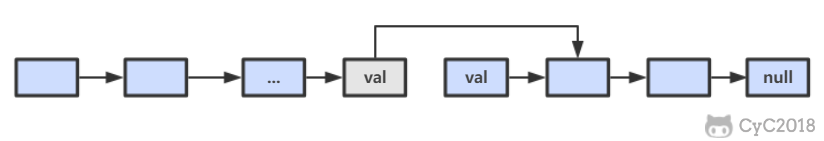
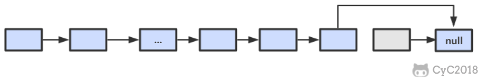

# 18.1 在 O(1) 时间内删除链表节点

## 解题思路

① 如果该节点不是尾节点，那么可以直接将下一个节点的值赋给该节点，然后令该节点指向下下个节点，再删除下一个节点，时间复杂度为 O(1)。

<div align="center">  </div><br>

② 否则，就需要先遍历链表，找到节点的前一个节点，然后让前一个节点指向 null，时间复杂度为 O(N)。

<div align="center">  </div><br>

因此，删除非尾节点的时间复杂度为 O(1)，删除尾节点需要遍历链表，时间复杂度为 O(N)；算法的最坏时间复杂度为 O(N)，空间复杂度为 O(1)。

```java
public ListNode deleteNode(ListNode head, ListNode tobeDelete) {
    if (head == null || tobeDelete == null)
        return head;
    if (tobeDelete.next != null) {
        // 要删除的节点不是尾节点
        ListNode next = tobeDelete.next;
        tobeDelete.val = next.val;
        tobeDelete.next = next.next;
    } else {
        if (head == tobeDelete)
             // 只有一个节点
            head = null;
        else {
            ListNode cur = head;
            while (cur.next != null && cur.next != tobeDelete)
                cur = cur.next;
            if (cur.next == tobeDelete)
                cur.next = null;
        }
    }
    return head;
}
```
