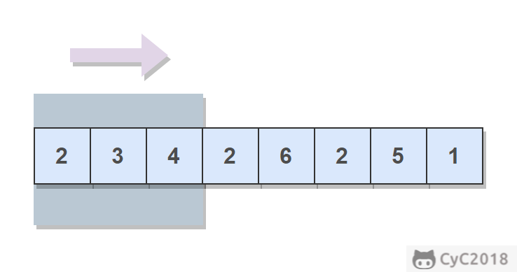

# 59. 滑动窗口的最大值

## 题目链接

[牛客网](https://www.nowcoder.com/practice/1624bc35a45c42c0bc17d17fa0cba788?tpId=13&tqId=11217&tPage=1&rp=1&ru=/ta/coding-interviews&qru=/ta/coding-interviews/question-ranking&from=cyc_github)

## 题目描述

给定一个数组和滑动窗口的大小，找出所有滑动窗口里数值的最大值。

例如，如果输入数组 {2, 3, 4, 2, 6, 2, 5, 1} 及滑动窗口的大小 3，那么一共存在 6 个滑动窗口，他们的最大值分别为 {4, 4, 6, 6, 6, 5}。

<div align="center">  </div><br>

## 解题思路

维护一个单调递减的双端队列，队列中保存数组下标。队首始终是当前窗口的最大值，窗口右移时移除过期下标，并从队尾移除不可能成为最大值的较小元素。

每个下标最多进出队列一次，因此时间复杂度为 O(N)，空间复杂度为 O(M)。

```java
public ArrayList<Integer> maxInWindows(int[] num, int size) {
    ArrayList<Integer> ret = new ArrayList<>();
    if (num == null || size > num.length || size < 1)
        return ret;
    Deque<Integer> deque = new ArrayDeque<>();
    for (int i = 0; i < num.length; i++) {
        while (!deque.isEmpty() && deque.peekFirst() <= i - size)
            deque.pollFirst();
        while (!deque.isEmpty() && num[deque.peekLast()] <= num[i])
            deque.pollLast();
        deque.offerLast(i);
        if (i >= size - 1)
            ret.add(num[deque.peekFirst()]);
    }
    return ret;
}
```
