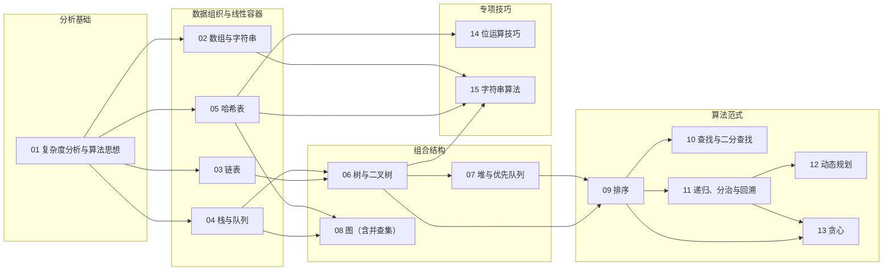

# 算法与数据结构

面试中常见的落差是：题目能用背过的模板写出来，但被追问“复杂度是怎么得到的”“换一个约束还成立吗”“为什么这里必须用哈希表”时讲不清。只记住题解，回答不了“遇到没见过的问题该从哪里想起”。

本板块以知识点主线为核心。15 篇知识点文章负责建立模型、推导性质、给出边界与示例；主线示例统一使用纯 Dart。旧版材料曾引用 LeetCode 与剑指 Offer 的 Java 题解归档，但归档文件目前不在仓库中；正文保留的归档题名仅用于识别题目，不是可访问的本地链接。

建议先看下面的知识点地图与前置关系，再按两条路径之一进入：系统补齐基础走“系统学习”，临时准备面试走“面试速查”。两条路径共用同一批文章与锚点，不需要两套资料。

<!-- GFM-TOC -->
* [定位与边界](#定位与边界)
* [知识点地图](#知识点地图)
* [两条阅读路径](#两条阅读路径)
    * [路径一：系统学习（按四阶段）](#路径一系统学习按四阶段)
    * [路径二：面试速查（按问题）](#路径二面试速查按问题)
* [面试高频分布（定性）](#面试高频分布定性)
* [按问题特征选入口](#按问题特征选入口)
* [题目参考](#题目参考)
* [如何读一篇知识点文章](#如何读一篇知识点文章)
* [术语、代码与来源说明](#术语代码与来源说明)
* [维护与勘误](#维护与勘误)
* [参考资料](#参考资料)
* [小结](#小结)
<!-- GFM-TOC -->

## 定位与边界

- 本板块是知识点教程：先建立模型、不变量与复杂度模型，再讨论适用边界；题目只用于演示概念如何迁移，不是学习目标。
- 学习主线是 `01-算法基础/` 下的 15 篇知识点文章，排布顺序为“分析基础 → 数据组织 → 组合结构 → 算法范式 → 专项技巧”。
- 主线示例为纯 Dart（不依赖第三方包，验证环境 3.12.2），采用 LeetCode 风格函数签名，不从标准输入读取；旧归档不在本仓库中。
- 进度不以题量衡量。能解释机制、能给出复杂度成立的前提、能举出边界反例，才算学完一篇。
- 与相邻板块的分工：位与编码的语义在[二进制表示与位运算](../01-数据表示/01-二进制表示与位运算.md)，本板块只讲位运算在算法中的用法，不重复编码知识。

## 知识点地图

先从整体看层次，再逐篇进入。下面的每一项只写“解决什么问题”和前置知识，进入文章后再看机制与推导。

**分析基础**

- [01 复杂度分析与算法思想](./01-算法基础/01-复杂度分析与算法思想.md)：解决“这段实现随输入规模如何变慢”，并统一最坏、平均、期望与均摊的口径；前置：无。

**数据组织与线性容器**

- [02 数组与字符串](./01-算法基础/02-数组与字符串.md)：连续存储上的定位、双指针、滑动窗口与前缀和；前置：01。
- [03 链表](./01-算法基础/03-链表.md)：非连续存储与指针重连，用一个指针或几个指针维护结构；前置：01。
- [04 栈与队列](./01-算法基础/04-栈与队列.md)：用受限访问换来顺序处理能力，以及单调栈、单调队列的适用条件；前置：01、02。
- [05 哈希表](./01-算法基础/05-哈希表.md)：按键查找、冲突处理与“期望 O(1)”的边界；前置：01、02。
- [05a Dart HashMap 实现](./01-算法基础/05a-Dart-HashMap实现.md)：从 Dart SDK 源码看 `HashMap` 的拉链法、默认 `Map` 的 `LinkedHashMap`、开放寻址与平台差异；前置：05。

**组合结构**

- [06 树与二叉树](./01-算法基础/06-树与二叉树.md)：层次关系、三种遍历与二叉搜索树的退化问题；前置：03、04。
- [07 堆与优先队列](./01-算法基础/07-堆与优先队列.md)：只维护最值的最小结构，上浮、下沉与 O(n) 建堆；前置：06（完全二叉树）。
- [08 图](./01-算法基础/08-图.md)：一般关系的表示、BFS/DFS、最短路、拓扑排序与并查集；前置：04、05。

**算法范式**

- [09 排序](./01-算法基础/09-排序.md)：把重排作为其他算法的前置步骤，比较排序的成本与下界；前置：06、07（堆排序）。
- [10 查找与二分查找](./01-算法基础/10-查找与二分查找.md)：用单调性成倍排除候选，边界模板与答案域二分；前置：09。
- [11 递归、分治与回溯](./01-算法基础/11-递归、分治与回溯.md)：自相似结构的写法、子问题合并与决策树枚举；前置：03、09。
- [12 动态规划](./01-算法基础/12-动态规划.md)：用状态表消掉重复子问题，从决策过程定义状态与转移；前置：11。
- [13 贪心](./01-算法基础/13-贪心.md)：可证明的局部选择，以及它何时必须让位给动态规划；前置：09、11。

**专项技巧**

- [14 位运算技巧](./01-算法基础/14-位运算技巧.md)：掩码、异或抵消与位集合压缩；前置：01、05。
- [15 字符串算法](./01-算法基础/15-字符串算法.md)：KMP 前缀函数、Trie 与字符串哈希的适用边界；前置：02、05、06。

## 两条阅读路径

### 路径一：系统学习（按四阶段）

- 阶段一 `01 → 02 → 03 → 04 → 05`：先建立成本模型，再学线性容器。02—05 之间没有严格先后，但都建议排在 01 之后；完成标准是能为一段实现写出时间/空间成本，并说明 List、Map、Set 的选择依据。
- 阶段二 `06 → 07 → 08`：层次与网络结构。07 需要 06 的完全二叉树概念，08 需要 04 的队列和 05 的哈希基础；完成标准是能写出三种遍历、一次建堆和一次无权图最短路。
- 阶段三 `09 → 10 → 11`：重排数据、成倍缩小搜索空间、系统枚举决策。完成标准是能独立推导一次二分区间不变量，并说明回溯何时可以剪枝、何时只能枚举。
- 阶段四 `12 → 13 → 14 → 15`：优化范式与专项技巧。完成标准是面对一个最优化问题，能判断该用动态规划、贪心还是搜索。
- 允许跳读：有基础时按“前置”列直接进入目标文章；每篇的“什么时候用，什么时候别用”可以先读，再回看机制推导。
- 建议在每阶段结束后用文末的“面试考点与追问”自测：能不看正文复述答题脉络、并给出至少一个边界反例，再进入下一阶段。

### 路径二：面试速查（按问题）

以下只列高频问题与入口锚点，答案在对应文章的“面试考点与追问”与正文中：

- 为什么一次运行的耗时不能替代渐近分析？→ [01](./01-算法基础/01-复杂度分析与算法思想.md#为什么不能只看一次运行时间)
- 滑动窗口在什么条件下会退化成 O(n²)？→ [02](./01-算法基础/02-数组与字符串.md#滑动窗口)
- 快慢指针为什么能判断环，并找到入环点？→ [03](./01-算法基础/03-链表.md#快慢指针)
- 单调栈为什么是摊还 O(n)？→ [04](./01-算法基础/04-栈与队列.md#单调栈)
- “哈希表查询 O(1)”的边界在哪里？→ [05](./01-算法基础/05-哈希表.md#复杂度与安全边界)
- BST 的操作复杂度在什么条件下退化？→ [06](./01-算法基础/06-树与二叉树.md#二叉搜索树)
- 自底向上建堆为什么是 O(n)？→ [07](./01-算法基础/07-堆与优先队列.md#自底向上建堆)
- BFS 为什么给出无权图最短路，Dijkstra 为什么不能有负权？→ [08](./01-算法基础/08-图.md#非负权最短路)
- 比较排序的 Ω(n log n) 下界说明了什么？→ [09](./01-算法基础/09-排序.md#非比较排序的适用边界)
- 二分查找的区间不变量如何避免死循环？→ [10](./01-算法基础/10-查找与二分查找.md#区间不变量)
- 回溯的去重与剪枝依据是什么？→ [11](./01-算法基础/11-递归、分治与回溯.md#去重与剪枝)
- 状态与转移如何定义，为什么要求无后效性？→ [12](./01-算法基础/12-动态规划.md#面试考点与追问)
- 贪心与动态规划的分界线在哪里？→ [13](./01-算法基础/13-贪心.md#贪心与动态规划)
- 位运算技巧在什么字宽与符号前提下成立？→ [14](./01-算法基础/14-位运算技巧.md#本篇边界表示知识到算法工具)
- KMP 的前缀函数为什么让文本指针不回退？→ [15](./01-算法基础/15-字符串算法.md#kmp-匹配过程文本指针为什么不回退)

## 面试高频分布（定性）

按常见的岗位场景做定性排序，只用于安排复习优先级：

- 通用客户端与移动端：数组与字符串、哈希表、栈队列、链表、树遍历、排序与二分查找、复杂度分析最常见；考察重点通常是边界处理、可读性与集合选择，而不是冷门算法。
- 大型互联网通用研发：在上述基础之外，回溯、动态规划、堆、图遍历与拓扑排序的覆盖通常更广。
- 基础设施、搜索、推荐与数据密集岗位：图、堆、Trie、并查集、最短路与复杂度证明的相对权重更高。
- 业务型或规模较小的团队：清楚的基础结构与可靠实现往往比高级算法更常被考察。

> **时效信息（核查日期：2026-09）：** 以上分布是依据公开岗位描述与公开面经讨论做的定性校准，不列具体公司，也不给百分比；实际权重随岗位、团队与年份变化，复习时以目标岗位的公开信息为准。

## 按问题特征选入口

拿到题面先识别特征，再进入对应文章的“什么时候用，什么时候别用”：

- 输入有序，或可以构造单调性 → [10 查找与二分查找](./01-算法基础/10-查找与二分查找.md#什么时候用什么时候别用)、[02 数组与字符串](./01-算法基础/02-数组与字符串.md#什么时候用什么时候别用)
- 连续区间、子数组、可滑动的窗口 → [02 数组与字符串](./01-算法基础/02-数组与字符串.md#什么时候用什么时候别用)
- 求最近更大/更小元素 → [04 栈与队列](./01-算法基础/04-栈与队列.md#什么时候用什么时候别用)
- Top K、动态取最值 → [07 堆与优先队列](./01-算法基础/07-堆与优先队列.md#什么时候用什么时候别用)、[09 排序](./01-算法基础/09-排序.md#什么时候用什么时候别用)
- 按键查找、去重、计数 → [05 哈希表](./01-算法基础/05-哈希表.md#什么时候用什么时候别用)
- 连通性、合并集合 → [08 图](./01-算法基础/08-图.md#什么时候用什么时候别用)
- 前后依赖、拓扑顺序 → [08 图](./01-算法基础/08-图.md#什么时候用什么时候别用)
- 重叠子问题 + 最优子结构 → [12 动态规划](./01-算法基础/12-动态规划.md#什么时候用什么时候别用)
- 局部选择可以证明 → [13 贪心](./01-算法基础/13-贪心.md#什么时候用什么时候别用)
- 前缀匹配、多模式匹配 → [15 字符串算法](./01-算法基础/15-字符串算法.md#什么时候用什么时候别用)
- 位级状态、成对元素去重 → [14 位运算技巧](./01-算法基础/14-位运算技巧.md#什么时候用什么时候别用)

## 题目参考

主线文章中的题目链接指向题目平台。部分段落还保留旧题解的分类名或题名作为检索线索；旧题解文件并未随当前仓库收录。

## 如何读一篇知识点文章

1. 动机：先读开篇“为什么需要”，把知识放进真实问题，而不是从定义开始背。
2. 模型与不变量：找到该结构或算法的判定条件，也就是文中的“核心结论”。
3. 操作与复杂度：注意复杂度结论成立的前提，例如实现方式、边界约定、期望还是均摊。
4. 选择边界：读“什么时候用，什么时候别用”，记住反例；这是最容易在面试中被追问的部分。
5. 例题：只看“问题为何匹配 → 不变量/状态 → 实现 → 复杂度 → 边界用例”，不要背代码。
6. 面试复盘：用“答题脉络 + 追问方向”自测，答不上来就回到对应章节，而不是再刷一道题。

例题不是学习目标。机制没讲清楚之前先看题解，通常只会把理解问题推迟到下一次笔试。

## 术语、代码与来源说明

- 术语：数据结构与算法的定义以 CLRS 与 Sedgewick/Wayne 的用法为准，中文术语首次出现时附英文名。
- 代码：主线为纯 Dart，LeetCode 风格函数签名；每个可运行示例都在 Dart 3.x（验证环境 3.12.2）上通过静态分析与断言运行。
- 复杂度：默认以最坏情况表述；出现期望、均摊、随机化口径时会显式标注前提。
- 时效：题目约束、平台题号与 Dart API 以引用的官方页面为准，核查日期见各篇的参考资料小节。
- 旧题解：正文偶尔保留旧归档中的分类名，作为题目检索线索；归档文件未随当前仓库收录。

## 维护与勘误

- 概念错误：说明文章、章节与期望结论，并附权威来源（教材章节或官方文档）。
- 代码问题：附 Dart 版本、最小复现与实际输出。
- 题目与链接：指出失效题号或链接，尽量给出现行平台的对照。
- 更新原则：校准面试分布、题号或 Dart 版本时同步更新核查日期，不静默修改结论。

## 参考资料

- [R1] [教材] [Introduction to Algorithms, fourth edition](https://mitpress.mit.edu/9780262046305/introduction-to-algorithms/) — MIT Press，ISBN 978-0-262-04630-5，第 3–4 章（渐近记号与分治）、第 6 章（堆）、第 7–8 章（排序与下界）、第 22–24 章（图与最短路），[核查日期：2026-09]。
- [R2] [教材] [Algorithms, 4th edition](https://sedgewick.io/books/algorithms/) — Addison-Wesley，ISBN 978-0-321-57351-3，§1.4（算法分析）、§2（排序）、§4（图）、§5.3（子串查找），[核查日期：2026-09]。
- [R3] [官方文档] [Dart language documentation](https://dart.dev/language) 与 [Dart API reference](https://api.dart.dev/) — Dart，主线示例使用的语言与标准库契约，[核查日期：2026-09]。
- [R4] [教材] 《剑指 Offer：名企面试官精讲编程题》何海涛，电子工业出版社（需购买纸质或电子书）—— 归档题解的题面来源，正文不复刻题面，[核查日期：2026-09]。
- [R5] [上游仓库] [CyC2018/CS-Notes](https://github.com/CyC2018/CS-Notes) — 两个题解归档的来源基线（CC BY-NC-SA 4.0），[核查日期：2026-09]。

## 小结

> 算法板块以 15 篇知识点文章为学习主线，题目平台链接用于查看题面。
