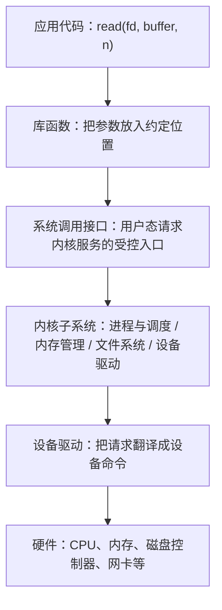
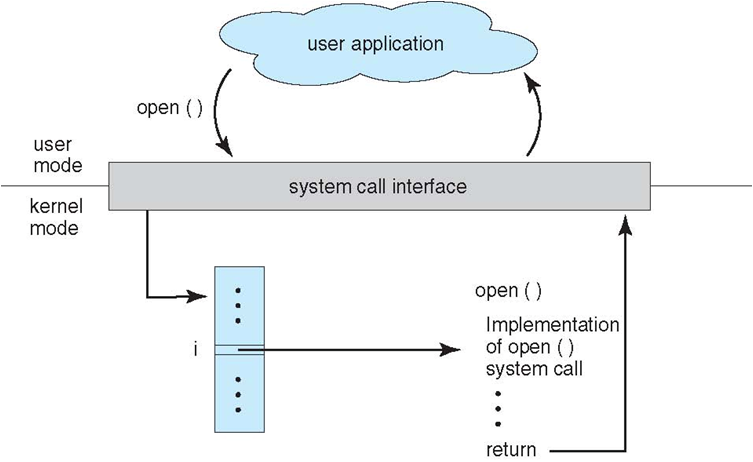
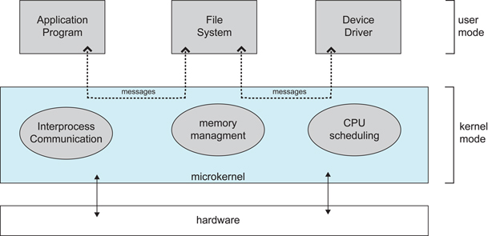

# 操作系统与程序运行｜01-操作系统概述

应用调用一次 `read` 时，既没有指定磁盘扇区，也没有关心此刻 CPU 上还跑着谁；它拿到的是缓冲区里的字节和返回值，而不是设备寄存器。这种“以为自己独占整台机器”的错觉不是自然存在的，而是有人替它挡住了硬件。

如果去掉这层中间件，最先崩掉的不是性能而是正确性：多个应用会互相覆盖内存，一个死循环会永远占住 CPU，一个越界写会让整台机器重启。操作系统（Operating System，OS）要解决的就是这类冲突——它把硬件包装成好用的对象，把这些对象分给多个使用者，并在使用者之间竖起边界。

本文不给 API 清单，而是建立一张统一的地图：先看没有操作系统时应用会遇到什么问题，再用抽象、复用与保护三个角度解释操作系统做了什么，接着把用户态/内核态、系统调用、中断与异常这组边界机制讲清楚，然后用并发、并行、共享、虚拟、异步五个词统一术语，最后落到资源分类、内核架构取舍和一次 `read` 的完整路径。

<!-- GFM-TOC -->
* [为什么应用不能直接管理整台机器](#为什么应用不能直接管理整台机器)
* [操作系统的三重角色](#操作系统的三重角色)
* [用户态、内核态与系统调用](#用户态内核态与系统调用)
* [中断、异常与系统调用如何把控制权交给内核](#中断异常与系统调用如何把控制权交给内核)
* [并发、并行、共享、虚拟与异步](#并发并行共享虚拟与异步)
* [操作系统管理哪些资源](#操作系统管理哪些资源)
* [内核架构为何有不同取舍](#内核架构为何有不同取舍)
* [从一个 read 走向后续几篇](#从一个-read-走向后续几篇)
* [常见误区与面试答题框架](#常见误区与面试答题框架)
* [参考资料](#参考资料)
* [小结](#小结)
<!-- GFM-TOC -->

## 为什么应用不能直接管理整台机器

做一个思想实验：去掉操作系统，让每个应用直接和硬件对话。会立刻遇到四类麻烦。

- **CPU 不能共用。** 一台设备上只有有限个核心，而任意一个应用都可能写出不会结束的循环。没有第三方能强制收回 CPU，其他应用就只能等它结束。
- **内存会互相踩踏。** 程序里的地址如果不经过受控映射，就可能落到别的应用甚至内核的数据上；硬件没有任何理由拦住这次写入。
- **设备只有一份。** 磁盘、网卡、显示器需要排队和状态管理，而两个应用同时把命令写进同一块设备寄存器，结果通常没有意义。
- **硬件形态各异。** 不同厂商的网卡寄存器布局、DMA 描述符格式、闪存命令集都不同，让每个应用各自适配既不现实也不安全。

这四类麻烦可以归纳成三个缺口：资源不够分（复用）、使用者之间互不信任（隔离）、硬件差异太大（抽象）。操作系统的任务就是把它们补上，并因此获得一个特殊的地位——在通常的分层系统里，内核是应用程序访问硬件的主要受控中介；固件、虚拟机监控器和引导程序等也可能直接运行在更低层。

系统启动后，一份典型的访问路径如下（文本示意图，实际组件与命名因系统而异）：



操作系统的核心产出不是“更多的功能”，而是受控的抽象与边界：先决定谁能看到什么，再决定这些东西怎么被使用。

还需要澄清一个常见混淆：操作系统通常指内核加上随它一起提供的系统库与基础服务。终端、桌面、包管理器都不是内核，它们同样运行在用户态，只是离内核更近。

## 操作系统的三重角色

“抽象、复用、保护”这三件事经常被并列成功能清单，但它们是一条链上的三个环节：抽象决定有什么东西可分，复用决定怎么分，保护决定分错时谁来兜底。

### 抽象：把硬件变成好用的对象

- **进程（process）** 把“一段正在执行的程序”抽象成独立实体：应用不需要知道寄存器怎么分配、下一条指令什么时候被执行，只需要知道自己被调用、被调度。进程与线程的细节见 [`./02-进程、线程与调度.md`](./02-进程、线程与调度.md)。
- **虚拟地址空间（virtual address space）** 把物理内存抽象成每个进程私有、连续、可以从零开始的地址范围；真实物理页的分配与映射被藏起来。细节见 [`./04-虚拟内存、地址空间与函数调用.md`](./04-虚拟内存、地址空间与函数调用.md)。
- **文件（file）** 把块设备抽象成“名字 → 字节序列”的对象，屏蔽了扇区大小、分区布局和具体文件系统的差异；设备也被尽量塞进同一套接口（如“打开、读写、关闭”）。细节见 [`./05-I-O、存储与文件系统.md`](./05-I-O、存储与文件系统.md)。

### 复用与调度：把有限资源分给多个使用者

抽象之后，同一份物理资源就有多个使用者。操作系统要在它们之间做取舍。

- **CPU 按时间复用。** 调度器让多个可运行任务轮流获得处理器，并决定谁先跑、跑多久；这要求 CPU 能在任意时刻被打断并恢复现场（见后文“中断”）。
- **内存按空间复用。** 物理页被分配给不同进程或同一进程的不同部分，按需装入；同一份只读代码还可以在多个进程间共享。
- **设备与缓存按需复用。** 页缓存把磁盘上的文件页留在内存里供多次读取共用，设备队列把并发请求排成设备能处理的顺序。

复用的前提是“能被中断和恢复”。没有保存与恢复运行现场的能力，时间复用就无从谈起，这也是调度与中断必须一起理解的原因。

### 保护与隔离：让错误停在边界之内

复用越多，越需要防止一个使用者影响另一个使用者。

- **特权级隔离**：特权指令和内核数据结构只对内核开放，普通应用无法直接访问设备寄存器，也无法修改页表。
- **地址空间隔离**：每个进程只能访问自己的映射，越界访问会触发异常而不是偷偷改写别人的数据。
- **身份与权限**：文件权限、用户身份、访问检查决定“这个请求到底该不该被满足”。这正是系统调用必须经过内核的原因之一：如果应用能直接写磁盘，文件系统就无法在 I/O 之前检查权限。

抽象和隔离是同一套机制的两面。进程看到的是“我独占了一块连续内存”，而内核保证的只是“你看到的那部分地址映射不越界”。

> **面试高频：** 操作系统到底负责什么？
> **答题脉络：** 先给缺口（复用、隔离、抽象）→ 再给抽象产物（进程、地址空间、文件）→ 最后给管理手段（调度、内存管理、I/O 与保护）→ 指出这些职责由内核态代码承担。
> **追问方向：** 用户态与内核态为什么必须分开、系统调用是否一定要陷入内核、内核架构是否可以更小。

## 用户态、内核态与系统调用

### 特权级与两种运行模式

处理器把“当前能做什么”编码进特权级。x86 用 ring 0 到 ring 3 编号（ring 0 权限最高），AArch64 用异常级别（Exception Level，EL）EL0 到 EL3；实际系统的保护模型通常被简化成两级：内核态（kernel mode）与用户态（user mode），[微软的驱动文档](https://learn.microsoft.com/en-us/windows-hardware/drivers/gettingstarted/user-mode-and-kernel-mode)就按这两种模式描述 Windows 的处理器状态。[Arm 的架构文档](https://developer.arm.com/documentation/102412/0103)特别强调：在 AArch64 上，**特权级只能在处理器进入异常或从异常返回时改变**——这正是下面要讲的边界机制存在的原因。

两种模式的能力差别可以这样理解：

- 用户态：只能执行非特权指令，只能访问当前进程被允许访问的映射；想要执行特权操作，通常必须请求内核。
- 内核态：通常可以执行特权指令、配置内存映射并代表进程与设备交互；代价是一旦出错，影响范围可能是整个系统。

<div align="center">
  
</div>
<p align="center">图 1：系统调用接口与用户态/内核态边界；应用只能通过受控入口请求内核服务。来源：原 CS-Notes 笔记仓库迁移配图。</p>

### 库函数、包装器与系统调用不是一回事

库函数、包装器与内核入口不是一回事。一个函数名出现在代码里，并不代表它一定会进入内核。

1. **语言或库函数**：`printf`、`StringBuffer`、`malloc` 这类函数由 C 库或语言运行时实现，大部分工作可以在用户态完成。
2. **包装器（wrapper）与真正的系统调用**：glibc 里的 `open`、`read`、`write` 既是库函数，也是系统调用的包装器，负责把参数搬到规定的寄存器、执行进入内核的指令、把内核返回的负数错误码转成正数写进 `errno` 并返回 `-1`（[syscalls(2)](https://man7.org/linux/man-pages/man2/syscalls.2.html)）。内核入口才是真正的系统调用，包装器做的事可以比一次入口多得多。

以 glibc 为例，[`malloc`](https://man7.org/linux/man-pages/man3/malloc.3.html) 的大多数分配请求在用户态由分配器自己解决，只有需要扩充堆或申请大块内存时才向内核要内存；而 `open` 这个库函数在较新的 glibc 上最终调用的是 `openat` 系统调用——下面的实验可以观察到。也就是说，**库函数名和系统调用名可以不一致，调用次数也不必一一对应**。

系统调用本身是一次跨特权级的跳转，在 x86-64 上由 `syscall` 指令完成：系统调用号放在 `eax`，返回值放在 `rax`，失败时返回负的错误码；参数按各体系结构自己的 ABI 约定传递，并封装在 C 库的包装器里（见 [syscall(2)](https://man7.org/linux/man-pages/man2/syscall.2.html) 的架构调用约定表）。同一份表格显示，i386 传统上使用 `int $0x80`，AArch64 使用 `svc #0`，RISC-V 使用 `ecall`——**系统调用是所有体系结构都有的概念，但指令和寄存器约定各不相同**。这些接口的行为语义由 POSIX 等标准统一描述（[Issue 8 / IEEE Std 1003.1-2024](https://pubs.opengroup.org/onlinepubs/9799919799/)），这是同类系统之间源码级可移植的基础。

系统调用是用户态请求内核服务的主要“受控越权出口”。内核在入口处检查参数与权限，因此它的语义由内核定义，而不是由调用它的那个函数名定义；某些只读的高频服务还可能由 vDSO 等机制在用户态完成。

> **面试高频：** 用户态与内核态为什么必须分开？系统调用为什么不是普通函数调用？
> **答题脉络：** 先说明特权级与隔离的目标（一个应用出错不能拖垮整机、不能越过权限读写别人的数据）→ 再说明普通函数调用不改变特权级，系统调用会按 ABI 约定进入内核 → 最后说明内核在入口处做校验，并解释返回值和 `errno` 的由来。
> **追问方向：** 库函数与系统调用的一对多关系、`errno` 由谁设置、`strace` 里看不到某个函数名的原因、上下文切换与特权级转换不是同一件事、[vdso(7)](https://man7.org/linux/man-pages/man7/vdso.7.html) 为什么能让部分高频调用不进入内核。

### 最小实验：用 strace 观察边界

理论不如一条真实的调用记录直观。下面这个最小程序只做两件事：调用 `write` 写一行字，以及打开一个不存在的文件。

```c
/* 前置条件：Linux x86-64；C11；glibc 2.35；gcc -Wall -Wextra -O0 -static。 */
#include <fcntl.h>
#include <unistd.h>

int main(void) {
  const char message[] = "hello\n";
  /* 1. 直接调用 write，观察内核返回的字节数。 */
  write(STDOUT_FILENO, message, sizeof message - 1);
  /* 2. 打开一个不存在的文件，观察错误如何返回给用户态。 */
  open("no-such-file.txt", O_RDONLY);
  return 0;
}
```
<!-- verify: .work/verify/B01/syscall_boundary.c -->

在 Ubuntu 22.04（WSL1，x86-64，gcc 11.4.0，glibc 2.35，strace 5.16）上执行：

```bash
gcc -std=c11 -Wall -Wextra -O0 -static -o syscall_demo syscall_boundary.c
strace -e trace=write,open,openat ./syscall_demo
```

去掉动态装载器自身的噪声（静态链接）后，只留下三行真实记录：

```text
write(1, "hello\n", 6)                  = 6
openat(AT_FDCWD, "no-such-file.txt", O_RDONLY) = -1 ENOENT (No such file or directory)
+++ exited with 0 +++
```

三个观察点对应本节的关键结论：

1. 代码里调用的是 `open`，记录里出现的是 `openat`：**库函数名不等于系统调用名**，静态链接只是为了排除装载器产生的额外 `openat` 噪声。
2. 失败没有抛异常，而是以 `-1` 加错误码返回；C 库再把它变成 `errno`。这就是“包装器在中间做翻译”。
3. 每条记录都有一组参数和一个返回值，格式与 [strace 手册](https://man7.org/linux/man-pages/man1/strace.1.html)的描述一致：系统调用名、括号里的参数、等号后的返回值；错误额外附上 `errno` 符号与错误字符串。

再换一个程序观察“调用次数不必一一对应”：一个连续调用两次 `printf` 的程序，把标准输出重定向到文件后只产生一次 `write`——C 库先把输出攒在缓冲区里，攒满或退出时才交给内核：

```text
write(1, "A\nB\n", 4)                   = 4
+++ exited with 0 +++
```

只凭“调用了某个函数”推断系统调用次数是不成立的；要确认边界上发生了什么，必须观察入口记录，而不是读函数名。

## 中断、异常与系统调用如何把控制权交给内核

有了特权级，还要回答下一个问题：用户态的代码凭什么主动或被动地进入内核？答案是把控制权转移的原因分成三类。

### 三条进入内核的路径

- **外部中断（interrupt）**：来自处理器外部的异步事件，与当前正在执行的指令没有因果关系。例如时钟到期、磁盘控制器报告 I/O 完成、网卡收到包。它的价值在于让内核可以在用户代码“不配合”的情况下重新拿回 CPU。
- **同步异常（exception）**：由当前指令直接引发，在指令执行过程中同步发生。例如除零、非法指令、访问未映射的地址、断点指令。
- **主动请求（系统调用）**：程序执行一条约定指令（x86-64 的 `syscall`、AArch64 的 `svc`、RISC-V 的 `ecall`）主动请求内核服务；这些入口以及 `int 0x80` 这样的历史兼容入口在 [Linux 内核文档](https://docs.kernel.org/arch/x86/entry_64.html)里有对应条目。

> 中断是“外部发生了事情、与当前指令无因果关系”，异常是“当前指令本身出了问题或需要额外处理”；两者都只是控制权转移的原因，不决定后续如何处置。

### 术语随体系结构和教材变化

- 在 x86-64 的架构手册中，异常按“能不能恢复、恢复到哪条指令”再分为三类（[Intel SDM](https://www.intel.com/content/www/us/en/developer/articles/technical/intel-sdm.html) 卷 3A 第 6 章 Interrupt and Exception Handling）：**fault** 报告时导致异常的指令尚未完成，处理完可以重新执行该指令（缺页是典型）；**trap** 在引发它的指令执行结束后才报告（例如 `INT 3` 断点）；**abort** 表示严重错误，处理器无法可靠定位出错指令，通常不可恢复。
- 很多操作系统教材用“陷入（trap）”表示“程序主动进入内核”，于是有了“陷入即系统调用”的口径。但 [RISC-V 的官方手册](https://docs.riscv.org/reference/isa/v20240411/priv/priv-intro.html)把 trap 当作异常与中断的统称，例如“U 模式下的应用代码会被某个 trap（比如系统调用或时钟中断）打断，交给处理器运行 trap 处理程序”。
- 因此“trap = 系统调用”只在特定教材口径下成立。要做严谨表述时，应指明体系结构与文档来源。

> **面试高频：** 中断和异常有什么区别？系统调用属于哪一类？
> **答题脉络：** 先按“与当前指令是否同步、来源在不在处理器内部”区分中断与异常 → 再说系统调用是主动发起的受控入口，在 x86-64 上是 `syscall` 指令 → 最后强调术语依赖体系结构与教材，不要把“陷入”当成普适定义。
> **追问方向：** 缺页为什么算异常却不是错误、x86 上 `int $0x80` 与 `syscall` 的关系、时钟中断与抢占式调度。

### 缺页：异常也可以是正常机制

异常这个名字容易让人以为程序一定出错了。缺页（page fault）就是反例：进程访问的地址落在一个合法的虚拟内存区域里，但页表项可能尚未建立、对应的物理页此刻不在内存中，或正在执行写时复制；硬件只能把控制权交给内核。内核补建映射、装入数据或复制页面，然后让出错的那条指令重新执行，程序对此毫无感知。

[OSTEP](https://pages.cs.wisc.edu/~remzi/OSTEP/vm-beyondphys.pdf) 在讲虚拟内存时专门吐槽过这个命名：访问一个合法映射只是暂时不在物理内存的页，本该叫“页缺失”（page miss），却被叫成 fault——因为这个名称来自处理它的机制：硬件遇到自己处理不了的情况就转交内核。

> “异常”描述的是控制权如何转移，不描述“程序做错了”。缺页、断点等异常都是被设计的正常机制，只有真正越权或非法访问才会终止进程。

## 并发、并行、共享、虚拟与异步

下面这五个词几乎每场面试都会出现，但它们分属不同层次：并发与并行描述执行在时间上如何重叠，共享描述资源如何被多个使用者触碰，虚拟描述抽象怎么造出来，异步描述事件是否独立于当前执行流或调用是否等待结果。

### 并发与并行不是同义词

- **并发（concurrency）**：在一段时间内，多个任务都在推进，但任一时刻不一定同时执行。单核上的时间片轮转就是并发。
- **并行（parallelism）**：在同一时刻，多个处理单元真的同时执行多条指令；这需要多核、多处理器或分布式系统等硬件支持。

下面这段 Dart 代码（纯 Dart，无第三方依赖）用三个可观察现象把两者摆在一起：前两个任务是异步任务，在同一个执行单元上交错推进；第三个任务把同一个忙等放进另一个 isolate，当前执行单元仍能响应定时器。

```dart
// 前置条件：Dart 3.x；纯 Dart，仅依赖 dart:async 与 dart:isolate。
// 运行：dart run B01/concurrency_vs_parallel.dart
import 'dart:async';
import 'dart:isolate';

/// 并发：两个异步任务在同一个执行单元上交错推进。
Future<List<String>> interleavedOnEventLoop() async {
  final trail = <String>[];
  final slowTask = Future<void>(() async {
    trail.add('A-开始');
    await Future<void>.delayed(const Duration(milliseconds: 30));
    trail.add('A-结束');
  });
  final fastTask = Future<void>(() async {
    trail.add('B-开始');
    await Future<void>.delayed(const Duration(milliseconds: 10));
    trail.add('B-结束');
  });
  // 1. 等两个任务都结束，再看事件发生的先后。
  await Future.wait([slowTask, fastTask]);
  return trail;
}
```
<!-- verify: .work/verify/B01/concurrency_vs_parallel.dart -->

```dart
/// 忙等：占满当前执行单元，期间不向事件循环让出控制权。
void busyWait(Duration duration) {
  final stopwatch = Stopwatch()..start();
  while (stopwatch.elapsed < duration) {}
}

/// 串行：忙等占住当前执行单元，20 毫秒的定时器只能排在它之后。
Future<List<String>> busyWaitOnSameThread() async {
  final trail = <String>[];
  final timer = Future<void>.delayed(
    const Duration(milliseconds: 20),
    () => trail.add('定时器回调'),
  );
  busyWait(const Duration(milliseconds: 150));
  // 1. 忙等期间事件循环无法推进，回调只能排到这一步之后。
  trail.add('忙等结束');
  await timer;
  return trail;
}

/// 并行：同一个忙等放进另一个 isolate，当前执行单元仍能推进定时器。
Future<List<String>> busyWaitInIsolate() async {
  final timer = Future<void>.delayed(const Duration(milliseconds: 20));
  var workDone = false;
  // 1. 另一个 isolate 有自己的执行单元，可以真正同时运行。
  final work =
      Isolate.run(() {
        busyWait(const Duration(milliseconds: 300));
        return 'isolate 工作完成';
      }).then((message) {
        workDone = true;
        return message;
      });
  // 2. 主执行单元只等 20 毫秒，随后检查工作是否已经结束。
  await timer;
  return [if (!workDone) '定时器先触发' else '工作先完成', await work];
}
```
<!-- verify: .work/verify/B01/concurrency_vs_parallel.dart -->

三个观察点的输出（`dart run`，Dart 3.12.2）：

```text
事件交错：A-开始 -> B-开始 -> B-结束 -> A-结束
同一个 isolate 上忙等：忙等结束 -> 定时器回调
isolate 上忙等：定时器先触发 -> isolate 工作完成
```

第一行说明两个任务确实并发：先开始的任务后结束。第二行说明并发不等于并行：忙等占住执行单元时，20 毫秒的定时器回调只能排在 150 毫秒的忙等之后。第三行说明真正的并行：忙等搬到另一个 isolate 后，主执行单元在忙等期间照常推进定时器。

并发描述“任务在时间上重叠”，并行描述“同一时刻真的同时执行”。单核也能并发，但没有并行。

> **面试高频：** 并发和并行有什么区别？异步会带来并行吗？
> **答题脉络：** 先给判定标准（某一时刻是否真的同时执行）→ 再给单核时间片与多核同时执行的对照 → 最后区分“异步”与“并行”：异步只是不等待结果，CPU 密集的忙等放在同一个执行单元上依然会拖住其他任务。
> **追问方向：** 上下文切换成本、I/O 密集与 CPU 密集任务该选哪种并发单位、多线程是否一定能利用多核。

### 异步有两种常见含义

同一个词在两个语境里指不同的东西，混用是很多误解的源头。

- **硬件/操作系统的语境**：事件的发生不依赖当前执行流的具体进度、到达时间不可预测，例如设备中断；这不是“任务交错”的同义词。
- **编程接口的语境**：发起一个操作后立即返回，结果稍后再取——这是调用方式。

异步只承诺“不等待结果”，既不等于并行，也不保证任务在推进。真正决定推进速度的是执行单元是否空闲，以及有没有别的代码在占着它。

### 共享：临界资源与同步责任

共享有两种形态。只读的数据、可重入的代码可以同时被多个执行流使用；而打印机、设备命令队列、共享内存中的计数器在同一时刻只能被一个使用者修改，这类资源称为临界资源（critical resource）。操作系统要提供互斥与同步的原语，并为需要的场景提供公平、超时或取消等活性策略；单个原语本身通常不保证等待者一定在有限时间内获得资源。竞争、锁、信号量、死锁的细节见 [`./03-同步、进程通信与死锁.md`](./03-同步、进程通信与死锁.md)。

共享带来的问题不是“能不能用”，而是“什么时候能用、谁先改、改到一半被打断怎么办”。抽象与调度做得越好，越需要同步机制来兜底。

### 虚拟：把一份物理资源变成多个视图

虚拟技术把一份物理实体变成多个逻辑实体，常见形式包括：

- **处理器虚拟化**：多个任务轮流使用同一个 CPU，各自以为自己一直在运行（时间复用）。
- **内存虚拟化**：每个进程拥有独立的地址空间，各自的虚拟页映射到物理页或磁盘上的数据（空间复用，细节见 [`./04-虚拟内存、地址空间与函数调用.md`](./04-虚拟内存、地址空间与函数调用.md)）。
- **设备与存储虚拟化**：多进程共享一块显卡、一个网卡，日志文件系统把同一个块设备呈现为一棵目录树等。

“时分复用/空分复用”只是教学的粗分类。真正让虚拟成立的是一整套机制：映射表、缓存、状态保存与恢复、权限检查，以及出错时的回收路径。

## 操作系统管理哪些资源

把前面几节的概念落到具体职责上，内核的工作大致分成五块，每一块都值得单独展开。

- **进程与调度**：进程和线程的创建、退出、状态转换、上下文切换与调度策略。→ [`./02-进程、线程与调度.md`](./02-进程、线程与调度.md)
- **并发与同步**：互斥锁、信号量、条件变量、进程间通信，以及死锁的预防、避免和检测。→ [`./03-同步、进程通信与死锁.md`](./03-同步、进程通信与死锁.md)
- **内存管理**：虚拟地址与物理地址的映射、页表与 TLB、缺页处理、页面置换、栈与堆的布局。→ [`./04-虚拟内存、地址空间与函数调用.md`](./04-虚拟内存、地址空间与函数调用.md)
- **文件与设备 I/O**：文件系统、页缓存、设备驱动、磁盘调度与 I/O 模型。→ [`./05-I-O、存储与文件系统.md`](./05-I-O、存储与文件系统.md)
- **程序的生命周期**：编译、链接、可执行文件格式与装载，也就是“一个程序怎样变成进程”。→ [`./06-程序从源码到运行.md`](./06-程序从源码到运行.md)

资源管理的目标不是“把资源分完”，而是在利用率、延迟、公平与隔离之间取舍；不同工作负载会得到不同答案，这也是调度策略与页面置换算法存在的理由。

## 内核架构为何有不同取舍

前几节的机制需要有人实现。把所有功能放进一个内核、还是拆成用户态服务，就是内核架构要回答的问题。判断标准只有一条：**哪些代码必须运行在内核态，模块之间靠什么通信**。

### 宏内核与可加载模块

宏内核（monolithic kernel）把调度、内存管理、文件系统和大部分驱动放在同一个内核地址空间里，模块之间直接函数调用、直接共享数据结构，因此路径短、状态传递方便。代价是它们共享同一个地址空间：一个驱动写错一个地址，就可能破坏无关模块的数据，甚至直接让系统崩溃。Linux 属于这种结构，同时支持可加载内核模块：驱动既可以在构建时编译进内核镜像，也可以在运行时装入内核空间——[`init_module(2)`](https://man7.org/linux/man-pages/man2/init_module.2.html) 写明它把一个 ELF 映像装入内核空间、运行模块的初始化函数，并且需要特权。模块化提高了灵活性，但并没有改变“共享内核空间”这个前提。

### 微内核与用户态服务

微内核（microkernel）把内核收缩到只保留最基本的能力，把文件系统、设备驱动、网络协议栈等移出内核，作为用户态服务运行，彼此通过消息传递通信。

<div align="center">
  
</div>
<p align="center">图 2：微内核结构——文件系统、设备驱动等作为用户态服务，通过消息传递与内核交互。来源：原 CS-Notes 笔记仓库迁移配图，文件名沿用原图编号。</p>

官方描述可以帮助理解设计意图：[MINIX 3](https://www.minix3.org/) 项目主页称自己“基于一个运行在内核态的极小内核，操作系统的其余部分以多个隔离的、受保护的进程形式运行在用户态”；[QNX 的文档](https://qnx.com/developers/docs/7.1/com.qnx.doc.neutrino.sys_arch/topic/intro_MICROKERNELARCH.html)则强调微内核的目标不是“变小”，而是模块化，并且“由于 IPC 服务把操作系统本身粘合起来，它的性能与灵活性决定了整个系统的性能”。

由此得到两点权衡：

- **收益**：内核更小、可审计面更小；服务之间相互隔离，某个服务崩溃可以重启，而不必重启整机；权限可以按服务最小化。
- **成本**：原本的函数调用变成跨特权级的消息传递，需要额外拷贝或共享内存设计、更多的调度与协议开销，系统复杂度也随之上升。

> “微内核一定比宏内核慢”不是结论。IPC 的实现质量、是否批处理请求、是否共享内存都会显著改变结果；而宏内核用“一切都在一起”换来的性能优势，也可能被一次驱动错误引起的整机崩溃抵消。工程上是取舍，不是排名。

### 混合结构，以及标签的边界

现实系统往往介于两端之间，而且官方文档通常不愿意给自己贴标签：

- **Darwin/XNU**：[Apple 的文档](https://developer.apple.com/library/archive/documentation/Darwin/Conceptual/KernelProgramming/Architecture/Architecture.html)把它描述为基于 BSD、Mach 3.0 与 Apple 技术组合而成，既有微内核来源的 Mach 消息机制，也有 BSD 的文件系统与网络栈。
- **Windows**：[微软官方文档](https://learn.microsoft.com/en-us/windows-hardware/drivers/gettingstarted/user-mode-and-kernel-mode)按模式描述结构——内核态代码共享同一个虚拟地址空间，用户态应用各自拥有私有的虚拟地址空间和句柄表；因此内核驱动之间没有相互隔离，“写错地址就可能破坏操作系统或其他驱动”。
- **Linux**：官方文档描述的是机制（内核态组件、可加载模块、模块装入需要特权），并不自称“宏内核”。

> **时效信息（核查日期：2026-09）：** 上述架构描述以各系统官方文档当前表述为准（Linux 内核文档、Microsoft Learn、Apple Developer 归档文档、MINIX 3 与 QNX 官方站点）。宏内核/微内核/混合内核是教材层面的分类词（如 [Tanenbaum, Modern Operating Systems 第 5 版](https://www.pearson.com/en-us/subject-catalog/p/modern-operating-systems/P200000003295/9780137618880) 第 1 章），具体实现细节会随版本变化，判断时应以官方文档为准。

> **面试高频：** 宏内核和微内核的区别与取舍是什么？
> **答题脉络：** 先给判断维度（哪些功能在内核态、模块之间怎么通信）→ 再说宏内核的直接调用与共享地址空间、微内核的消息传递与用户态服务 → 最后各给一条收益与成本，并说明现实系统多为混合结构、标签只是概括。
> **追问方向：** 可加载模块是否改变了宏内核的本质、微内核的 IPC 成本如何被优化、驱动程序放在内核态与用户态的安全边界差异。

## 从一个 read 走向后续几篇

把本节之前的所有概念串起来，只需要看一次普通的文件读取。下面是一次 `read` 在内核里可能经过的步骤（教学概括，实际路径受缓存状态、文件系统与设备类型影响）：

1. **进入内核**：库函数完成参数搬运后执行 `syscall`，处理器切到内核态，内核按系统调用号分发到 `read` 的实现。
2. **文件系统与页缓存**：内核先通过文件描述符找到打开的文件，再到页缓存里查找需要的文件页。
3. **命中缓存就直接返回**：如果页已经在内存里，内核把数据拷贝到用户缓冲区，`read` 返回读到的字节数——**这次调用并没有访问磁盘**。
4. **未命中则发起 I/O**：内核向块设备提交请求，当前任务离开运行状态去等待；调度器这时可以运行别的任务，这段时间 CPU 并不会被“读磁盘”占住。
5. **地址翻译可能触发缺页**：用户缓冲区所在的内存页如果尚未装入物理内存，写回数据前还要经过地址映射，缺页异常按需分配物理页。
6. **设备完成后唤醒任务**：设备通过中断报告完成，中断处理程序唤醒等待的任务，调度器再次调度它，`read` 才回到用户态返回。

`read(2)` 的返回值约定在这里很关键（见 [read(2)](https://man7.org/linux/man-pages/man2/read.2.html)）：成功返回实际读取的字节数，返回 0 表示已经到文件末尾，返回 `-1` 表示出错；而且**返回的字节数可以少于请求的数量**——管道、终端、接近文件末尾或被信号打断时都会发生短读。所以读文件的正确写法是循环读直到返回 0，而不是调用一次就假定读满了。页缓存的角色由 [Linux VFS 文档](https://docs.kernel.org/filesystems/vfs.html)描述：它用 address space 对象把文件页留在内存里，供后续读取直接复用。

一次 `read` 是否访问磁盘，取决于页缓存是否命中、请求大小与设备状态，而不取决于它是不是系统调用；系统调用只保证“请求被检查并被正确执行”。

> **面试高频：** 一次 `read` 一定会访问磁盘吗？系统调用一定会导致进程切换吗？
> **答题脉络：** 先说明系统调用只是一次进入内核的入口，随后走哪条路径由缓存与设备状态决定 → 给出命中页缓存直接返回、需要 I/O 则阻塞并让出 CPU 两种分支 → 再区分“特权级转换”（每次系统调用都有）与“进程切换”（是否有别的任务被调度，取决于是否存在等待）。
> **追问方向：** 短读为什么要循环、页缓存与 `mmap` 的关系、`read` 的阻塞与非阻塞语义、I/O 模型与事件通知（见 [`../04-计算机网络/10-Socket与I-O模型.md`](../04-计算机网络/10-Socket与I-O模型.md)）。

## 常见误区与面试答题框架

### 常见误区

- ❌ 系统调用就是一次普通函数调用。
  ✅ 库函数调用不改变特权级；系统调用要按 ABI 约定进入内核，由内核校验参数并返回结果或错误码，只是 C 库把它包装得和普通函数一样。
- ❌ 进入内核态就等于切换进程。
  ✅ 特权级转换和进程切换是两件事：前者是“同一条执行流换了权限”，后者是“处理器换了另一个任务”，是否需要切换由调度决定。
- ❌ 异步就等于并行。
  ✅ 异步只表示调用不等待结果；同一个执行单元上的忙等会拖住所有异步回调，上面那个定时器实验就是反例。
- ❌ 中断和异常是一回事，都是“出错”。
  ✅ 中断来自处理器外部、与当前指令异步；异常由当前指令同步引发；缺页这类异常还是正常机制。
- ❌ 操作系统只负责硬件驱动，其他都是应用层的事。
  ✅ 驱动只是其中一块，进程与调度、内存管理、文件系统、权限与隔离同样属于内核职责。
- ❌ 微内核肯定比宏内核慢。
  ✅ 这是取舍问题：IPC 实现、批处理与共享内存都会改变结果；隔离与可恢复性本身也是收益。

### 面试答题框架

被问到“操作系统有什么用”“用户态和内核态”“系统调用与中断”这类问题时，可以按下面的顺序复述，保证既讲清机制又不变成背答案：

1. **缺口**：复用、隔离、抽象——先说明没有操作系统会发生什么。
2. **抽象**：进程、虚拟地址空间、文件与设备。
3. **分工**：内核态与用户态的权利差别，以及为什么特权级只能在受控入口切换。
4. **入口**：外部中断、同步异常、主动系统调用三类控制流转移，各自举一个例子。
5. **管理**：调度、内存、I/O、保护各自的取舍，并指出细节在前面的对应文章里。
6. **边界**：说明教学简化在哪里失效——术语随体系结构变化、缓存会改变“是否访问磁盘”、标签不能代替官方文档。

追问通常会落在细节上，例如并发与并行、缺页、短读、库函数与系统调用的关系、宏内核与微内核的取舍。把上面这些结论当作锚点，再按上表追问方向展开即可。

## 参考资料

- [R1] [教材] [Operating Systems: Three Easy Pieces](https://pages.cs.wisc.edu/~remzi/OSTEP/) — 第 6 章 Limited Direct Execution（陷阱指令、用户态与内核态、时钟中断），第 21 章 Beyond Physical Memory: Mechanisms（缺页与页缺失术语），[核查日期：2026-09]。
- [R2] [官方文档] [Linux man-pages: syscall(2)](https://man7.org/linux/man-pages/man2/syscall.2.html) 与 [syscalls(2)](https://man7.org/linux/man-pages/man2/syscalls.2.html) — man-pages 6.19，各体系结构系统调用指令与寄存器表（x86-64 使用 `syscall`、i386 使用 `int $0x80`、AArch64 使用 `svc #0`、RISC-V 使用 `ecall`），以及库包装器如何把负错误码写入 `errno`，[核查日期：2026-09]。
- [R3] [官方文档] [Linux man-pages: read(2)](https://man7.org/linux/man-pages/man2/read.2.html) — 返回值、短读与 `errno`，[核查日期：2026-09]。
- [R4] [官方文档] [Linux man-pages: strace(1)](https://man7.org/linux/man-pages/man1/strace.1.html) — 输出格式：系统调用名、参数、返回值与错误符号，[核查日期：2026-09]。
- [R5] [官方文档] [Linux Kernel Documentation: Kernel Entries](https://docs.kernel.org/arch/x86/entry_64.html) — x86-64 的 `syscall` 入口、`int 0x80` 兼容入口以及各类中断/异常入口，[核查日期：2026-09]。
- [R6] [官方文档] [Linux Kernel Documentation: Building External Modules](https://docs.kernel.org/kbuild/modules.html) 与 [Linux man-pages: init_module(2)](https://man7.org/linux/man-pages/man2/init_module.2.html) — 内核模块的构建方式与“装入内核空间、需要特权”，[核查日期：2026-09]。
- [R7] [官方文档] [Linux Kernel Documentation: The Virtual File System](https://docs.kernel.org/filesystems/vfs.html) — address space 对象与页缓存如何管理文件页，[核查日期：2026-09]。
- [R8] [官方文档] [Linux man-pages: vdso(7)](https://man7.org/linux/man-pages/man7/vdso.7.html) — 部分高频调用可在用户态完成，避免进入内核的开销，[核查日期：2026-09]。
- [R9] [标准] [The Open Group Base Specifications Issue 8（IEEE Std 1003.1-2024）](https://pubs.opengroup.org/onlinepubs/9799919799/) — POSIX 对进程、文件与系统接口的定义所在，[核查日期：2026-09]。
- [R10] [官方文档] [Arm: Learn the architecture - AArch64 Exception Model](https://developer.arm.com/documentation/102412/0103) — AArch64 的异常级别与“特权级只在进入或返回异常时改变”，[核查日期：2026-09]。
- [R11] [官方文档] [RISC-V Ratified Specifications: Privileged Architecture](https://docs.riscv.org/reference/isa/v20240411/priv/priv-intro.html) — trap 作为异常与中断的统称（U 模式代码被系统调用或时钟中断打断），[核查日期：2026-09]。
- [R12] [官方文档] [Intel 64 and IA-32 Architectures Software Developer's Manual](https://www.intel.com/content/www/us/en/developer/articles/technical/intel-sdm.html) — 卷 3A 第 6 章 Interrupt and Exception Handling：异常分类与 fault/trap/abort，[核查日期：2026-09]。
- [R13] [官方文档] [Microsoft Learn: User Mode and Kernel Mode](https://learn.microsoft.com/en-us/windows-hardware/drivers/gettingstarted/user-mode-and-kernel-mode) — 内核态共享单一虚拟地址空间、用户态进程拥有私有地址空间与句柄表，[核查日期：2026-09]。
- [R14] [官方文档] [Apple Developer (archive): Kernel Architecture Overview](https://developer.apple.com/library/archive/documentation/Darwin/Conceptual/KernelProgramming/Architecture/Architecture.html) — Darwin 基于 BSD、Mach 3.0 与 Apple 技术，[核查日期：2026-09]。
- [R15] [官方文档] [MINIX 3](https://www.minix3.org/) 与 [Overview of MINIX 3 architecture](https://wiki.minix3.org/doku.php?id=developersguide%3Aoverviewofminixarchitecture) — 微内核与用户态服务进程，[核查日期：2026-09]。
- [R16] [官方文档] [QNX Neutrino RTOS: Microkernel architecture](https://qnx.com/developers/docs/7.1/com.qnx.doc.neutrino.sys_arch/topic/intro_MICROKERNELARCH.html) — 微内核的定义目标与 IPC 对整体性能的影响，[核查日期：2026-09]。
- [R17] [教材] [Modern Operating Systems](https://www.pearson.com/en-us/subject-catalog/p/modern-operating-systems/P200000003295/9780137618880) — Andrew S. Tanenbaum，第 5 版，Pearson，第 1 章（操作系统结构与宏内核/微内核取舍），ISBN 978-0-13-761888-0，[核查日期：2026-09]。

## 小结

操作系统的价值在于用受控的抽象与边界把一份硬件变成多个互不干扰、可以同时推进的使用者视图，而用户态与内核态、系统调用、中断与异常就是这套边界的具体形状。
