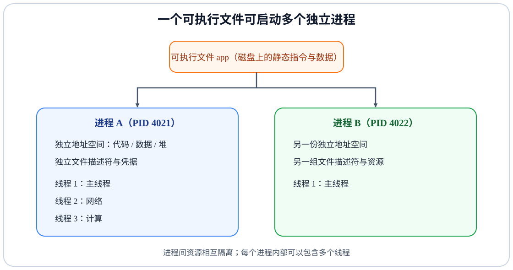
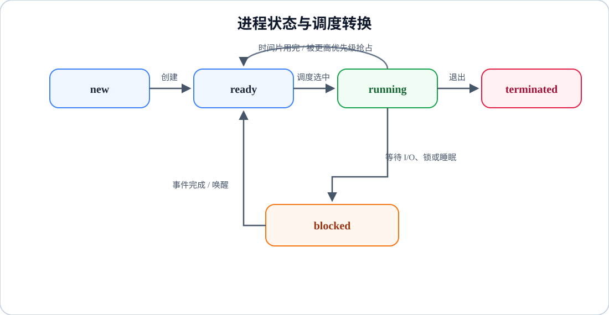
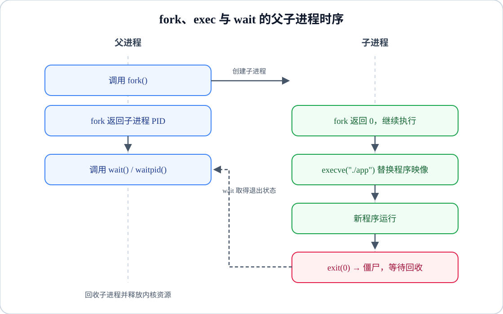

# 操作系统与程序运行｜02-进程、线程与调度

同一个客户端 App 启动两次，会得到两个互不干扰的实例：一个崩溃不会拖垮另一个。可界面一旦卡住，问题往往又发生在同一个进程内部——渲染线程在等锁，计算线程占着 CPU 不松手，网络线程等在事件上。要同时解释"隔离"和"卡住"，只背"进程是资源分配单位、线程是调度单位"远远不够：这句话没有说清执行现场由谁维护、状态为什么会变化、切换成本从哪来。

本文沿一条主线推进：一个磁盘上的静态程序怎样变成可被调度器挑选的执行实体，多个执行实体又怎样分享有限的 CPU。先划清程序、进程、线程和协程的边界，再看状态与生死，然后拆解上下文切换的成本，用同一组任务对比经典调度算法，最后把视角落到现代 Linux 的公平调度与多核负载均衡。

<!-- GFM-TOC -->
* [从可执行文件到多个执行现场](#从可执行文件到多个执行现场)
* [进程拥有什么，线程共享什么](#进程拥有什么线程共享什么)
* [生命周期与状态转换](#生命周期与状态转换)
* [进程如何创建、替换与回收](#进程如何创建替换与回收)
* [用户级线程、内核级线程与映射模型](#用户级线程内核级线程与映射模型)
* [协程不是更轻的操作系统线程](#协程不是更轻的操作系统线程)
* [上下文切换保存了什么](#上下文切换保存了什么)
* [调度目标决定算法](#调度目标决定算法)
    * [指标先于算法](#指标先于算法)
    * [用同一组任务比较五种算法](#用同一组任务比较五种算法)
    * [教科书模型与真实调度器的三处差异](#教科书模型与真实调度器的三处差异)
* [从教科书算法到现代 Linux 公平调度](#从教科书算法到现代-linux-公平调度)
    * [CFS 的基础模型：vruntime 与红黑树](#cfs-的基础模型vruntime-与红黑树)
    * [EEVDF：从 6.6 起的过渡](#eevdf从-66-起的过渡)
    * [调度类是分层的](#调度类是分层的)
* [多核、亲和性与负载均衡](#多核亲和性与负载均衡)
* [面向客户端面试的答题顺序](#面向客户端面试的答题顺序)
* [常见误区](#常见误区)
* [参考资料](#参考资料)
* [小结](#小结)
<!-- GFM-TOC -->

## 从可执行文件到多个执行现场

可执行文件（例如 ELF 格式的 `app`）是静态的指令和数据，它不会自己"运行"。把同一份文件启动两次，得到的是两个互不相干的运行实例：不同的进程 ID（Process ID，PID）、各自独立的地址空间、各自打开的文件。这个运行实例就是进程，它是操作系统做资源归属和隔离的单位。

一个进程内部还可以有多个执行流。每个执行流有自己的程序计数器和调用栈，等待 I/O 时可以各自挂起，唤醒后继续——这就是线程。线程是内核实际调度的单位：调度器挑选的是某个线程，而不是抽象的"进程"。

<figure class="diagram-scroll"></figure>

教材用进程控制块（Process Control Block，PCB）和线程控制块（Thread Control Block，TCB）描述这两层管理信息。它们只是概念模型：Linux 内核并不存在叫 PCB 的结构，进程和线程都由同一个 `struct task_struct` 描述，线程与进程的区别在于创建时通过 `clone` 共享了哪些部分资源 [R12][R4]。这个实现细节很重要——它说明"进程"和"线程"并不是两种完全不同的内核对象，它们是同一套机制在不同共享程度下的两个配置。还有一点：进程与程序也不是绑定关系——同一进程可以通过 `execve` 换成另一个程序（见第四节），PID 不变而映像全变。

由此还得到一个可观察的推论：Linux 上同一进程的所有线程属于同一个线程组、共享同一个 PID（`getpid()` 返回相同的值），但每个线程有各自的内核任务号（TID，`gettid()` 返回不同的值）[R4]。所以"一个进程"与"一个可调度任务"并不对等。

进程是资源归属与隔离的单位，线程是内核调度的执行单位；两者回答的是不同的问题，所以"谁比谁重要"式的比较没有意义。

线程与进程的关系细节（每线程栈、页表、写时复制）由 [虚拟内存、地址空间与函数调用](./04-虚拟内存、地址空间与函数调用.md) 主讲；可执行文件如何被装载成进程映像由 [程序从源码到运行](./06-程序从源码到运行.md) 主讲。

## 进程拥有什么，线程共享什么

先给结论：线程共享"进程的资源集合"，但每个线程必须拥有自己的"执行现场"和一组每线程属性。下面按 POSIX 的划分列出边界 [R4]：

| 维度 | 边界 |
|---|---|
| 代码段、全局数据、堆 | 进程内共享 |
| 进程 ID、父进程 ID、进程组与会话、控制终端 | 进程级共享 |
| 用户/组 ID、已打开的文件描述符、`umask`、当前工作目录与根目录 | 进程级共享 |
| 信号处置（disposition）、记录的锁（record lock） | 进程级共享 |
| 进程级资源限制（如 `RLIMIT_*`）与进程级汇总统计 | 资源限制通常进程级；CPU 时间也可按线程分别统计 |
| 栈（自动变量）、寄存器、程序计数器 | 每线程独立 |
| 线程 ID、`errno`、信号掩码、备用信号栈 | 每线程独立 |
| 调度策略与实时优先级 | 每线程独立 |
| 线程本地存储（Thread-Local Storage，TLS） | 每线程独立 |
| capabilities 与 CPU 亲和性（Linux 特有） | 每线程独立 |

"线程不拥有资源"是过度简化。线程确实不单独拥有地址空间和文件表，但栈、寄存器、调度状态、信号掩码、`errno` 和 TLS 都是每线程独立维护的——没有这些，它就无法充当一个独立的执行现场。

`errno` 与信号掩码之所以必须独立，是因为它们描述"当前这个执行流发生了什么、暂时屏蔽什么"，若跨线程共享，一个线程的错误码会覆盖另一个线程的。相反，文件描述符与信号处置描述的是"这个进程持有和使用什么资源"，所以自然进程级共享。

每线程栈的来源也不同：主线程的栈是进程启动时建立的映射，可以在资源限制内增长；`pthread_create` 创建的线程，其栈在创建时就确定大小（glibc 的默认值取自启动时的 `RLIMIT_STACK`），之后不再增长 [R4]。栈的内容与分配方式都是实现细节，观察与排查方法见 [虚拟内存、地址空间与函数调用](./04-虚拟内存、地址空间与函数调用.md)。

共享可变数据带来便利，也直接引出数据竞争 [R11]：两个线程同时读写同一个变量，结果取决于调度顺序。竞争、锁与内存可见性由 [同步、进程通信与死锁](./03-同步、进程通信与死锁.md) 主讲，这里只需要记住一点：共享是便利的来源，也是正确性问题的来源。由此可以得到两条实用的边界规则：只读数据尽量放进程级共享，可变状态尽量每线程私有，跨线程只传递消息或不可变对象；每减少一个共享可变量，就少一类难以调试的竞态。

这张表里有一个容易翻车的细节：POSIX 规定 nice 值是进程级属性，而 Linux 把它当作每线程属性，同一进程的不同线程可以有不同 nice 值 [R3]。这是一处**平台实现与标准不一致**的地方，写调度相关代码时不要按 POSIX 的直觉推断 Linux 行为。

> **面试高频：** 进程与线程的区别到底该怎么答？
> **答题脉络：** 先划隔离与共享边界（地址空间、文件、凭据 vs 栈、寄存器、TLS）→ 再说是谁被调度 → 再说通信与切换代价的差别 → 最后点出"进程与线程是同一执行模型的两个共享配置"。
> **追问方向：** 每线程栈的分配方式、`fork` 在多线程程序中的行为、进程组与线程组、nice 值归属的平台差异。

## 生命周期与状态转换

执行实体在"愿意运行"和"能运行"之间来回摆动。教材用五态模型描述这条轨道：新建（new）、就绪（ready）、运行（running）、阻塞（blocked，也称等待 waiting）与终止（terminated）[R11]。模型从 `new` 开始而不是从 `running` 开始：创建一个执行实体需要分配 PID、建立控制结构与地址空间等资源，大量短命进程的性能问题往往出在这一步，而不在调度本身。

<figure class="diagram-scroll"></figure>

三条关键转换路径决定了大多数性能现象：

1. **运行 → 就绪**：时间片用完或被抢占。任务没有消失、没有等外部事件，只是暂时失去 CPU。
2. **运行 → 阻塞**：主动等待 I/O、锁或定时器。此时它不再占用 CPU，也拿不到 CPU 就跑不了，直到事件完成被唤醒。
3. **阻塞 → 就绪**：唤醒只让任务重新获得"可以被调度"的资格，并不保证立刻运行——还得排队等调度器选中。

这三条路径能直接映射到用户可见的症状：主线程长时间停在"运行"并占满一核，是计算或死循环；主线程停在"阻塞"等锁，界面不响应但 CPU 很低——两种卡顿的排查方向完全不同，先从 CPU 占用区分它们比先猜代码更有效。

就绪态缺的是 CPU，阻塞态缺的是事件或资源。把两者混为一谈，就无法解释"明明不是 CPU 瓶颈，程序还是不响应"。

还要区分两个层次的生命周期：状态模型描述的是单个执行流的处境；进程本身还有另一条线——创建、执行、退出、被父进程回收。一个线程退出不影响同进程的其他线程；进程一旦退出，它的所有线程也随之终止。

Linux 的 `ps` 用另一套面向观察的状态字母：`R` 运行或可运行、`S` 可中断睡眠、`D` 不可中断睡眠（通常与 I/O 相关）、`T` 被作业控制信号或调试器停止、`Z` 僵尸 [R9]。它们与教材五态**不能逐项等同**：`D` 与 `S` 都是阻塞，`T` 是"被停住"而不是"等资源"。

> **时效信息（核查日期：2026-09）：** 状态字母的含义以 procps-ng 的 `ps(1)` 手册为准，不同工具与版本的展示方式可能不同；Linux 内核内部的 `TASK_*` 状态机比这十个字母细得多，不要把 `ps` 输出当成完整状态机。

两者对照起来看：

| 教材状态 | `ps` 常见可观察对应 | 说明 |
|---|---|---|
| running | `R` | 正在运行或已就绪，`ps` 不区分两者 |
| ready | `R` | 同上；等待调度器选中 |
| blocked | `S`（可中断）或 `D`（不可中断） | 等待事件；`D` 通常出现在等待 I/O 的深层路径上 |
| terminated | `Z` | 已终止但尚未被回收，仍占进程表槽位 |
| （无直接对应） | `T` | 被作业控制信号或调试器停住，等待恢复而不是等资源 |

教学模型是连续状态机的抽象，真实转换通常在几步内核动作中完成：`terminated` 与"被父进程回收"之间就隔着僵尸态这一段时间，终止不等于资源立即归还。

> **面试高频：** 阻塞状态和就绪状态有什么区别？
> **答题脉络：** 缺 CPU 还是缺事件 → 各自从哪些转换进入 → 唤醒后为什么还要排一次队 → 用一个"锁等待"例子落地。
> **追问方向：** 时间片用完与主动让出的区别、`D` 状态为何不可中断、阻塞会不会占着 CPU。

## 进程如何创建、替换与回收

进程不会凭空出现。Unix 传统提供了三个各司其职的系统调用：`fork` 复制出子进程，`execve` 替换正在运行的程序映像，`wait` 由父进程回收子进程的退出信息 [R10]。

为什么不是一个"创建新程序"的系统调用？因为 Unix 选择把"复制执行流"与"换程序"拆开：`fork` 只负责复制，子进程在调用 `execve` 之前还有一段可自由行动的时间——重定向文件描述符、建立管道、修改工作目录或权限。shell 的管道 `a | b` 和重定向 `> out` 都建立在这段窗口上。

<figure class="diagram-scroll"></figure>

**`fork` 创建副本，`execve` 才是换程序。** `fork` 后子进程拥有父进程地址空间的一份副本，并从 `fork` 的返回点继续执行；父子通过返回值区分（父得到子进程 PID，子得到 0）。Linux 用写时复制（Copy-On-Write，COW）推迟物理页复制，代价主要在复制页表和建立子进程的内核结构，并不是零成本 [R5]。还有一个常被忽略的边界：在多线程程序中调用 `fork`，子进程只包含调用线程一个执行流的副本，其他线程不会跟着复制 [R5]。

`execve` 的作用完全不同：它把当前进程正在运行的程序替换成新程序，栈、堆和数据段重新初始化，进程 ID 保持不变 [R6]。正是 `fork` 与 `execve` 的组合（复制出子进程，再让子进程"变身"成目标程序）构成了 shell 启动命令的经典方式。

两者之间有一个著名陷阱：在多线程程序中 `fork`，子进程只复制了调用线程，如果它在 `execve` 之前调用了需要锁的非 async-signal-safe 函数，而该锁恰好被其他线程持有，子进程就会永久卡住。POSIX 的约束是：多线程程序 `fork` 之后、`execve` 之前，子进程只应调用 async-signal-safe 函数 [R5]。如果只是想启动一个程序，POSIX 还提供了把创建与替换合二为一的 `posix_spawn()`，避免在这个窗口里运行额外代码；手册明确它只覆盖 `fork`+`exec` 的子集功能，不能替代两个系统调用 [R13]。

**回收：`wait` 负责释放内核保留的信息。** 子进程调用 `exit` 后，内核不会立刻扔掉它的全部信息——退出状态、资源使用统计等要留给父进程取走。父进程调用 `wait`（等价于 `waitpid(-1, &status, 0)`）会阻塞直到某个子进程状态改变，并回收它；`waitpid` 的 `WNOHANG` 选项可以改为非阻塞轮询 [R7]。

`wait` 拿到的 `status` 不能直接当退出码用，需要用宏解码：`WIFEXITED`/`WEXITSTATUS` 判断是否正常退出及其返回码，`WIFSIGNALED`/`WTERMSIG` 判断是否被信号终止以及是哪个信号 [R7]。这也解释了一个常见现象：进程"没有返回码、只有信号号"，说明它是被信号终止的，而不是自己正常返回。按惯例，退出码 0 表示成功、非 0 表示某种失败，但具体取值由程序自己定义，不属于内核语义。

由此得到两个必须分清的概念：

- **僵尸进程**：子进程已终止，但父进程还没有 `wait`，内核保留 PID、终止状态和资源使用信息，进程表中占用一个槽位；大量僵尸可能耗尽可用的进程号，使系统无法创建新进程 [R7]。
- **孤儿进程**：父进程先退出，子进程还在运行；它会被 `init(1)` 或最近的 subreaper 进程收养，收养者负责后续回收 [R7]。

排查时记住一条：僵尸的"父亲"是仍活着的那个父进程，所以 `ps` 看到 `Z` 状态时应去处理父进程的回收逻辑，而不是对僵尸本身做动作；孤儿则应关注收养者的回收行为是否正常。

子进程状态变化时父进程会收到 `SIGCHLD`，默认处置是"忽略"，但这是一个"会产生的通知"，不是"已被回收"。POSIX 规定：把 `SIGCHLD` 显式设为 `SIG_IGN`，或设置 `SA_NOCLDWAIT` 标志，子进程退出后就不会进入僵尸状态 [R7]。这才是"如何避免僵尸"的正解——父进程必须回收，或显式声明不保留。典型做法是在 `SIGCHLD` 处理器（或专用回收线程）里循环调用 `waitpid` 直到无子进程可收，而不是在信号处理器里做其它重活。

> **历史机制（不推荐）：** "杀掉父进程来清理僵尸"曾是流传很广的兜底做法：父进程死后，僵尸由 `init` 收养并回收 [R7]。它只是把回收责任转移给了收养者，不是常规修复手段；正确做法是父进程自己 `wait`，或按规范设置 `SIGCHLD`。

> **面试高频：** `fork`、`execve`、`wait` 各自解决什么问题？
> **答题脉络：** `fork` 复制执行流 → `execve` 替换程序映像（PID 不变）→ `wait` 取回退出状态并释放内核记录 → 用 shell 启动命令串起来。
> **追问方向：** 写时复制、多线程程序里的 `fork`、僵尸与孤儿的区别、`SIGCHLD` 与 `SA_NOCLDWAIT`。

## 用户级线程、内核级线程与映射模型

"线程"在 API 层与内核层可能是两种规模不同的实体。用户线程由线程库或运行时在用户态管理，内核线程才是调度器能看到的执行单元；两者之间可以有不同的映射：

| 模型 | 映射 | 并行能力 | 阻塞一个线程 | 切换开销 | 典型场景 |
|---|---|---|---|---|---|
| N:1 | 多个用户线程 → 1 个内核线程 | 无法利用多核 | 阻塞系统调用会拖住整个进程 | 用户态切换，最便宜 | 历史实现（绿色线程等） |
| 1:1 | 1 个用户线程 → 1 个内核线程 | 可多核并行 | 只阻塞自己 | 需内核参与 | Linux 的 glibc/NPTL |
| M:N | M 个用户线程 → N 个内核线程 | 可多核并行 | 通常不拖住全部 | 两层调度的组合 | 用户态调度运行时（如 Go 的 GMP） |

POSIX threads（pthreads）只规定了 API 与语义，**不规定实现必须采用哪种映射** [R4]：标准把可移植的"线程对象"与具体的内核调度实体解耦，实现方可以按平台能力选择。在 Linux 上，glibc 的 NPTL 采用 1:1：每个线程映射到一个内核调度实体，同步原语基于 futex 实现 [R4]。这也解释了为什么无竞争的加锁通常很快：乐观路径可以在用户态用原子操作完成，只有真正争用时才通过 futex 进入内核。

"用户级线程切换不进内核所以更快"只在 N:1 的一小部分路径上成立；代价是一个线程阻塞可能拖住整个进程，且无法利用多核。1:1 用内核参与换来了独立阻塞与并行能力。选择映射模型，本质是在切换成本与调度能力之间权衡。

M:N 看起来是两者的折中，代价是复杂度：用户态调度器必须了解哪些内核线程被阻塞，避免把任务派到"跑不动"的线程上，还要处理阻塞系统调用与抢占等一系列边界。这也是为什么它多次淡出主流，又在新的运行时中重新出现。

那么 Linux 为什么把 pthread 做成 1:1？因为 POSIX 对线程语义的要求（信号、`fork`、调度属性等）在 N:1 下很难完整满足，而阻塞式 I/O 与多核并行又需要内核看得见每个执行流；代价是每个线程对应一个内核对象，创建量和内存开销比用户态线程大。这是一次以语义完整性和并行能力优先于极限轻量的取舍。

映射模型也没有随 1:1 的胜利而固化：近年的语言运行时重新把 M:N 带回工程前沿——JDK 21 的虚拟线程（JEP 444）把大量轻量线程映射到少量平台线程，Go 的调度器也在这条路线上 [R14]。讨论"用户级/内核级线程"时，要先确认说的是 API 层的线程对象，还是内核能调度的执行实体。

> **历史机制（已废弃）：** 早期 glibc 使用 LinuxThreads 实现，它在语义上有诸多偏离 POSIX 之处；glibc 2.4 起不再支持，NPTL 从 glibc 2.3.2 起提供 [R4]。在今天的 Linux 上谈 pthread 实现，指的是 NPTL 的 1:1 模型。

> **面试高频：** 用户级线程与内核级线程的区别？
> **答题脉络：** 定义两层的"谁能被调度" → N:1/1:1/M:N 的并行与阻塞代价 → POSIX 只规定 API → Linux NPTL 是 1:1 实现。
> **追问方向：** 绿色线程、协程与 M:N 的关系、futex 的作用、一个阻塞调用会阻塞谁。

## 协程不是更轻的操作系统线程

阻塞式线程模型有一个昂贵之处：等待 I/O 时线程被挂起，但它占用的栈和内核调度对象仍在。协程换了一条路：**任务在等待点主动让出执行权，运行时在用户态选下一个任务继续跑**，把"等"变成"换一件事做"。

协程可以暂停和恢复，让出点由 `await`、`yield` 一类语法标记。这里要分清三个常被混为一谈的维度：

- **有栈与无栈**：有栈协程保存自己的调用栈；无栈协程把状态编译进状态机，由运行时的调度器驱动。
- **协作与抢占**：协程通常需要显式让出，长计算不让出，其他协程就得一起等；操作系统线程是抢占式的。
- **并发与并行**：并发是"多个任务都在推进"，并行是"同一时刻真的同时在跑"。协程天然提供前者，是否提供后者取决于运行时把协程映射到几个内核线程、跑在几个核上。

协程不自带内核执行权。它的"轻"来自用户态切换和复用内核线程，不来自"不需要栈"或"自动并行"；一旦运行时长跑不让出，同一事件循环上的其他协程都会被饿死。

`async/await` 是语言与运行时的机制，不是操作系统的统一原语：操作系统只认识线程，协程的调度器通常由语言运行时实现，再把协程映射到线程池上。反过来还有一个常见事故模式：在事件循环里调用同步阻塞 API（同步文件读写、同步网络请求），调度器没有机会让出，所有排队任务一起等——它等价于线程模型里的"一个线程卡住"，只是影响面换成了整个事件循环。要判断某个回调是否拖住了事件循环，可以看两件事：单次回调的耗时是否远超正常心跳，以及它运行期间的 CPU 占用是否被计算占满。

下面用 Dart 亲手验证这两层关系。以下函数与 `.work/verify/B02/concurrency_demo.dart` 中的对应函数逐字一致（`cpuHeavySum` 助手见该文件）：

```dart
Future<void> interleavingDemo() async {
  final trace = <String>[];
  Future<void> steps(String name, int count) async {
    for (var i = 1; i <= count; i++) {
      trace.add('$name$i');
      // 1. 主动让出事件循环，让另一个任务继续推进。
      await Future<void>.delayed(Duration.zero);
    }
  }

  // 2. 两个任务在同一 isolate 上交错执行。
  await Future.wait([steps('A', 3), steps('B', 3)]);
  print('事件循环交错顺序：${trace.join(' -> ')}');
  assert(trace.join(',') == 'A1,B1,A2,B2,A3,B3');
}

void blockingDemo() {
  var ticks = 0;
  final timer = Timer.periodic(
    const Duration(milliseconds: 10),
    (_) => ticks++,
  );

  // 3. 同步计算期间事件循环无法处理定时器。
  final result = cpuHeavySum(12000000);

  // 4. 计算一结束立即取消定时器，不再给事件循环处理它的机会。
  timer.cancel();
  print('主 isolate 同步计算 result=$result；定时器触发 $ticks 次');
  assert(ticks == 0);
}
```
<!-- verify: .work/verify/B02/concurrency_demo.dart -->

运行结果：两个任务确实交错推进（`A1 -> B1 -> A2 -> B2 -> A3 -> B3`），说明 `await` 提供了协作式让出；而把同样规模的计算同步执行时，`ticks == 0`——事件循环连一次定时器回调都没机会执行。**阻塞的线程不等于占满 CPU，而占满 CPU 的代码也不等于"忙得值得"：它让同一执行单元上的其他任务全部停摆。**

并行需要独立的执行实体。把计算交给另一个 isolate，主 isolate 的事件循环照常运转：

```dart
Future<void> parallelDemo() async {
  var ticks = 0;
  // 1. 主 isolate 的定时器：主线程若被 CPU 密集计算卡住，它就不会触发。
  final timer = Timer.periodic(
    const Duration(milliseconds: 10),
    (_) => ticks++,
  );

  // 2. 两个 CPU 密集任务分别交给独立 isolate 执行。
  final results = await Future.wait([
    Isolate.run(() => cpuHeavySum(12000000)),
    Isolate.run(() => cpuHeavySum(12000000)),
  ]);
  timer.cancel();

  print('两个 isolate 的结果：$results；主 isolate 定时器触发 $ticks 次');
  assert(results[0] == cpuHeavySum(12000000));
  assert(results[1] == results[0]);
  assert(ticks > 0); // 主 isolate 没有被其他 isolate 的计算阻塞
}
```
<!-- verify: .work/verify/B02/concurrency_demo.dart -->

运行输出显示：两个 isolate 的计算结果一致（本例为 `[983797, 983797]`），且主 isolate 的定时器在计算期间多次触发（本文多次运行观察到 3–5 次，具体次数随机器与负载变化）：计算被移到了别的执行实体上，主事件循环没有被卡住。注意 isolate 之间默认不共享可变内存，这一点与"同进程线程共享堆"不同，是 Dart 运行时的选择，不要反过来推断操作系统线程的语义。

落到工程判断上：**I/O 密集型任务**主要花时间等外部事件，适合用协程或"少量线程 + 异步"来承载，等待本身不消耗 CPU；**CPU 密集型任务**要真正缩短墙钟时间，必须增加并行执行实体（多进程、多线程或 isolate），单纯换成 `async` 只会让代码更复杂。判定靠观察：CPU 占用高、时间花在计算上就偏 CPU 密集；CPU 占用低但延迟高、时间花在等待上就偏 I/O 密集。

选并发单位时可以依次问三个问题：任务会不会长时间不放手（→ 是否 CPU 密集，需要并行实体）？任务之间是否需要频繁共享可变状态（→ 是则线程更自然，否则进程/isolate 用隔离换掉整类竞争问题）？需要跨机器扩展吗（→ 是则并发边界应放在进程/服务，而不是线程）？三个答案不同时，优先选择能屏蔽最多故障模式的边界。

协程与 Flutter 事件循环的细节不在本文展开；I/O 多路复用的内核机制见 [Socket 与 I/O 模型](../04-计算机网络/10-Socket与I-O模型.md)。

> **面试高频：** 线程与协程怎么选？
> **答题脉络：** 先区分并发与并行 → 协程是运行时层的协作式执行单元，不是内核调度实体 → 按任务类型选：等待型用协程，计算型用多核并行实体 → 给出一个反例（CPU 计算放进协程不会变快）。
> **追问方向：** 有栈/无栈协程、事件循环被阻塞的后果、isolate 与线程的内存模型差异、M:N 调度与 Go runtime。

## 上下文切换保存了什么

调度器把 CPU 从一个执行实体交给另一个，要完成一次上下文切换（Context Switch）。触发时机包括时间片用完、当前任务阻塞、更高优先级任务被唤醒等。成本分两部分。

**直接成本：保存与恢复执行现场。** 当前实体的寄存器（包括程序计数器和栈指针）、内核栈指针、调度与统计信息要保存到它的控制结构里，新实体的同类信息要恢复；如果切换跨越地址空间，还要切换页表。例如 x86-64 上页表基址由 CR3 寄存器指出，进程切换需要更新它。

这里要分清一个容易混淆的点：**进入内核态不等于发生切换**。系统调用会从用户态陷入内核，但大部分系统调用（读、写、获取时间等）执行完就返回当前线程，并没有换人；只有内核在调度点做出"换个执行实体"的决定时，才有上下文切换。习惯上把前者称为模式切换（mode switch），把后者称为上下文切换；**模式切换来回两次，也不会保存另一个任务的现场**。

切换并不是随时发生的：内核只在选定的调度点上做决策——时钟中断、任务主动阻塞、更高优先级任务被唤醒等；两次调度点之间，当前线程会持续运行。这正是"不让出的长任务会拖住同核其他线程"的原因。

**间接成本：缓存与 TLB 的局部性被破坏。** 新执行的实体有自己的一套热数据；缺页异常处理、TLB（Translation Lookaside Buffer）条目失效、CPU 缓存工作集被替换，都要在切换后重新"热"起来。跨核迁移更严重：目标核的缓存与 TLB 对当前任务几乎是冷的。

同进程内的线程共享地址空间，切换通常不需要更换页表，这确实省掉一部分工作——但它绝不等于零成本。内核仍要陷入特权态、保存恢复寄存器、执行调度逻辑，缓存局部性也依然会被另一个线程的工作集干扰。

上下文切换的成本 = 直接保存恢复 + 缓存/TLB 局部性损失，二者都依赖 CPU 架构、内核版本、工作集大小与迁移路径。不存在一个可以背下来的通用纳秒数；要引用数字，必须给出可复现的基准环境与统计方法。

网上流传的"切换 X 纳秒"之所以不能直接引用，是因为测量条件常隐去了内核版本、CPU 型号、是否跨核、工作集大小与系统负载；同样的机制在不同条件下会得到差异很大的结果，不可复现的数字不具备参考价值。因此优化切换开销的正道是减少不必要的调度点（批量处理、合并锁操作、降低跨核迁移），而不是寻找一条更快的切换指令。

因此"时间片设小一点更公平"并不是免费的：时间片越小，切换在总时间中的占比越高；时间片过大，交互任务的响应就会变差。调度的许多权衡都从这里出发。切换开销在两类负载上会被放大：一是大量短命任务（创建与切换频繁），二是高竞争锁或频繁阻塞唤醒（调度点密集）；相反，CPU 密集且长时间不阻塞的任务，切换次数本身就少。

> **面试高频：** 上下文切换到底在切换什么？为什么"线程切换一定比进程切换便宜"不严谨？
> **答题脉络：** 直接成本（寄存器、PC/SP、页表）→ 间接成本（TLB、缓存、跨核迁移）→ 同进程线程省掉了哪一层 → 结论：省的是地址空间相关部分，不是全部。
> **追问方向：** CR3 与页表切换、TLB 刷新范围、工作集大小的影响、为何不能背固定数字。

## 调度目标决定算法

### 指标先于算法

讨论"哪个调度算法最好"之前，先要有度量：

- **周转时间**：完成时刻 − 到达时刻，衡量一个任务从提交到做完的总耗时。
- **等待时间**：周转时间 − 实际运行时间，衡量在就绪队列里耗掉的时间。
- **响应时间**：第一次被运行的时刻 − 到达时刻，衡量用户多久能看到"开始有反应"。
- **吞吐**：单位时间内完成的任务数量。
- **公平与截止时间**：每个任务能否得到合理的份额；对实时任务，是否满足截止时间。

这些指标经常互相冲突：让短任务先跑能显著降低平均周转，却让长任务无限等待。吞吐是最容易与公平冲突的一对：批量场景的"最优"（少切换、按提交顺序跑完）恰好是交互场景的最差——等待中的交互任务拿不到任何进度。**没有同时优化所有指标的调度算法**，只有针对场景侧重的算法。

还要记住调度对象是谁：就绪队列里排的是线程（Linux 的 1:1 模型下每个线程都是独立任务），所以同一进程的两个线程可以同时在不同核上运行，也会彼此竞争 CPU；"进程调度"在 Linux 上更准确的说法是"任务调度"。

### 用同一组任务比较五种算法

经典算法各自针对一组指标（经典定义与推导见 [R11]）：

- **先来先服务（First-Come First-Served，FCFS）**：非抢占，按到达顺序执行。实现最简单，但长任务会挡住后面的短任务（护航效应），平均等待时间可能很差。
- **短作业优先（Shortest Job First，SJF）**：非抢占，每次选择预计运行时间最短的任务。**在运行时间已知的前提下**，SJF 最小化平均等待时间；抢占版本是**最短剩余时间优先（Shortest Remaining Time First，SRTF）**。现实约束是运行时间必须估计，估计偏差会直接放大。
- **时间片轮转（Round Robin，RR）**：就绪队列按 FCFS 排队，每个任务执行一个时间片后回到队尾。响应时间通常更好，代价是切换更频繁、周转时间可能变差。
- **优先级调度**：每任务一个优先级，高者先跑；低优先级可能饿死，常见补救是**老化（aging）**——等待越久优先级越高。
- **多级反馈队列（Multi-Level Feedback Queue，MLFQ）**：多个不同优先级与时间片长度的队列，新任务先入最高队列，用完时间片降级，等待过久则升级。它是不掌握运行时长信息时的折中方案，属于教学上的重要模型，真实系统会用类似思想做实现。

在这之前还有一个更基本的问题：为什么需要抢占？非抢占调度无法阻止一个长时间不让出的任务——如果某个计算进入死循环，FCFS/SJF 只能眼睁睁看着 CPU 被占住。抢占式算法用时钟中断获得强制换人的能力，代价是任务可能在任意指令边界被停下，因此共享数据才需要同步保护；而协作式调度（如协程、早期多任务系统）只能依赖任务自觉在合适的时机让出。

下面用同一组任务，让程序算出四种策略的指标。任务为 `P1(到达 0, 运行 7)`、`P2(2, 4)`、`P3(4, 1)`、`P4(5, 4)`；以下代码与 `.work/verify/B02/sched_sim.dart` 的 `main` 逐字一致，调度循环与指标计算见该文件：

```dart
void main() {
  // 长任务先到，随后三个短任务陆续到达。
  final jobs = [
    const Job('P1', 0, 7),
    const Job('P2', 2, 4),
    const Job('P3', 4, 1),
    const Job('P4', 5, 4),
  ];

  final fcfs = simulate('FCFS', jobs);
  final sjf = simulate('SJF', jobs);
  final srtf = simulate('SRTF', jobs);
  final rr = simulate('RR', jobs, quantum: 1);
  final rr2 = simulate('RR', jobs, quantum: 2);

  for (final metrics in [fcfs, sjf, srtf, rr, rr2]) {
    print(metrics);
  }

  // 断言模拟结果与正文中的手算值一致。
  assert(fcfs.avgTurnaround == 8.75 && fcfs.avgResponse == 4.75);
  assert(sjf.avgTurnaround == 8.0 && sjf.avgResponse == 4.0);
  assert(srtf.avgTurnaround == 7.0 && srtf.avgResponse == 0.5);
  assert(rr.avgTurnaround == 9.5 && rr.avgResponse == 0.75);
  assert(rr.avgResponse < fcfs.avgResponse); // RR 优先照顾响应时间
  assert(rr.avgTurnaround > fcfs.avgTurnaround); // 但切换更频繁
  assert(srtf.avgTurnaround < fcfs.avgTurnaround); // SRTF 优化周转，但可能饿死长任务
  assert(rr2.avgTurnaround == 9.0 && rr2.avgResponse == 1.5); // 时间片调大的量化结果
  assert(rr2.avgResponse > rr.avgResponse); // 时间片调大，响应变差
  print('全部断言通过');
}
```
<!-- verify: .work/verify/B02/sched_sim.dart -->

同一组任务下的平均指标（四种策略、五种配置；时间刻度为任意单位）：

| 策略 | 平均周转时间 | 平均等待时间 | 平均响应时间 |
|---|---|---|---|
| FCFS | 8.75 | 4.75 | 4.75 |
| SJF | 8.00 | 4.00 | 4.00 |
| SRTF | 7.00 | 3.00 | 0.50 |
| RR（时间片 1） | 9.50 | 5.50 | 0.75 |
| RR（时间片 2） | 9.00 | 5.00 | 1.50 |

这张表把权衡讲得很直白。SRTF 的周转与响应都领先，但它把 P1 拖到了最后，长任务有饥饿风险。RR 是另一组对照：时间片为 1 时平均响应 0.75，把时间片放大到 2 后响应恶化到 1.50，周转却从 9.50 改善到 9.00——时间片越大，切换与排队开销越少，代价是等待更久的任务更晚被看见。RR 的时间片要明显大于切换成本，又要明显小于应用可感知的间隔，具体取值由系统权衡，不存在"最佳时间片"。

平均值还有一个陷阱：平均指标好不代表没人受苦。SRTF 的平均响应是 0.5，但 P1 直到第 11 个单位才第二次获得 CPU；真实系统往往还要额外关注最坏情况（最大响应/最大等待）与饥饿风险，不能只看均值。

再看单个任务的遭遇：P3 只需运行 1 个单位，却在第 4 个单位时刻才到达。FCFS 下它要等 P1 跑完才开始，响应时间为 7；SRTF 在它到达时立刻抢占 P1，响应时间为 0。短任务体验的巨大差异，正是抢占式算法用复杂性与长任务饥饿风险换来的。

多级反馈队列把上面几个想法装进一个方案：以三层队列（时间片依次为 2、4、8）为例，交互任务每次只运行 1 个单位就去等待输入，因此始终留在最高队列，得到低延迟；计算任务在最高队列用满 2 个单位后降到第二层，再用满 4 个单位降到最低层，把高优先级让给新任务；为避免长任务饿死，系统周期性把所有任务提回最高层。MLFQ 不需要预先知道运行时间，代价是规则更多、行为更像启发式，而不是可证明的最优。

MLFQ 还有一个经典难题：任务可以在时间片即将用完时主动让出，从而一直留在高优先级队列——调度器被"表演"出来的让步行为欺骗。真实实现往往还要记录任务的历史累计用量，而不只看单次是否用满时间片。

**拓展（不作主线必背）：** 实时调度是另一套目标：硬实时任务必须在截止时间前完成（超时即失败），软实时可以容忍偶尔超时。周期性任务的经典教学模型包括按周期分配静态优先级的速率单调（Rate-Monotonic，RM）和动态选择最早截止任务的 EDF（Earliest Deadline First）。它们只用于建立"截止时间优先于公平"的直觉，Linux 的对应实现见下一节。

SJF/SRTF 的"最优"是有条件的：运行时间已知，且目标只是最小化平均等待/周转。一旦考虑公平或饥饿，结论就不成立；真实调度器必须先解决"不知道运行多久"这一前提。

### 教科书模型与真实调度器的三处差异

把以上算法直接对照内核实现，会发现三处结构性差异：

1. **运行时间未知**：FCFS/SJF/SRTF 都需要预测运行时长，真实调度器只能用"过去用了多少 CPU""唤醒后预计还要多久"这类可观测量做启发式。
2. **任务不是一次算完**：真实任务在"运行—阻塞—唤醒"之间反复横跳，调度器还要处理唤醒抢占、保持缓存局部性这些动态因素。
3. **目标不止一个**：服务器要吞吐与公平，桌面要交互响应，实时任务要截止时间；同一个内核要服务这些互相冲突的目标，才有了分层的调度类。

> **面试高频：** 时间片设得太短或太长分别有什么问题？怎么比较调度算法？
> **答题脉络：** 先定义周转/等待/响应/吞吐 → 说明指标冲突 → 时间片过短切换开销占比升高、过长退化为 FCFS 且响应变差 → 用同一组任务给量化对比。
> **追问方向：** SJF 的运行时间从哪来、老化如何防止饥饿、MLFQ 的降级与升级规则、实时调度与公平调度的目标差异。

## 从教科书算法到现代 Linux 公平调度

经典算法用于建立权衡模型，真实内核则用**调度类分层**处理不同需求。普通进程的公平调度是最常被问的一层，它的实现也经历了明显演进。

### CFS 的基础模型：vruntime 与红黑树

完全公平调度器（Completely Fair Scheduler，CFS）自 Linux 2.6.23 引入 [R1][R3]，它用一个思想模型驱动实现：假设存在一台"理想多任务 CPU"，能按 1/n 的速率同时运行 n 个任务；真实硬件做不到，就用**虚拟运行时间（vruntime）**记录按任务权重归一化后的已运行时间。调度器通常挑选 vruntime 最小的任务，在红黑树上维护这个顺序；nice 值通过权重改变 vruntime 增长的速度，从而近似出份额差异 [R1]。

CFS 的选取依据是 vruntime 顺序而不是固定的轮转时间片，这一点常被用于对比 RR；不过它仍有可调的时间片粒度与调度参数，具体值随内核版本与配置变化。补充一段历史：CFS 取代的是更早的 O(1) 调度器，后者依赖较重的交互启发式，行为不易解释 [R3]。

### EEVDF：从 6.6 起的过渡

> **时效信息（核查日期：2026-09）：** Linux 内核自 6.6 起开始向 EEVDF（Earliest Eligible Virtual Deadline First）过渡，内核文档同时记录 CFS "正在为 EEVDF 让位"；本节描述的是写作时的官方文档状态，具体行为以目标内核版本与文档为准 [R1][R2]。

EEVDF 的直觉是：给每个任务维护一个 **lag**，正值表示"欠它的 CPU 时间"，负值表示"已经超出应得份额"；只有 lag ≥ 0 的任务才有资格（eligible）运行，在合格者中选择**虚拟截止时间（virtual deadline）最早**的任务。由于时间片长短会影响虚拟截止时间，延迟敏感、时间片较短的任务可以更早被选中，交互响应因此受益；睡眠任务的 lag 会随时间衰减，避免"小睡一下重置欠账"的取巧行为 [R2]。

用一个双任务情景感受这两个概念：任务 A 刚睡醒，之前欠它一段 CPU 时间，lag 为正；任务 B 一直在运行，已经超出应得份额，lag 为负，此时 B 不会进入候选集。若 A 与 C 都有正 lag，则按虚拟截止时间排序；EEVDF 允许任务通过 `sched_setattr(2)` 申请时间片，**在其他条件相近时，时间片越短、虚拟截止时间越早，越先被选中**，延迟敏感任务因此受益 [R2]。

这个模型仍是"公平份额"思路的延续，但把"选谁"从单一 vruntime 顺序扩展成了 deadline 比较。把两者放在一起对比：

| 维度 | CFS | EEVDF |
|---|---|---|
| 选择依据 | vruntime 最小的任务 | lag ≥ 0 的任务中虚拟截止时间最早者 |
| 时间片的作用 | 由权重与调度粒度间接决定 | 任务可申请时间片，越短虚拟截止时间越早 |
| 状态（核查日期：2026-09） | 2.6.23 起的经典公平模型 | 自 6.6 起内核向其过渡 [R1][R2] |

**不要背"Linux 用 CFS"这一句话**：普通进程的公平类算法是随内核演进的实现细节，而内核对外承诺的是调度类与策略的名字与语义。

### 调度类是分层的

Linux 把调度策略分给不同调度类，普通任务、实时任务和截止时间任务的保障完全不同 [R3]。可以粗略理解为优先级分层：截止时间类高于实时类，实时类高于普通类；实时类与截止时间类可通过带宽限制减少长期独占 CPU 的风险，但限制受默认值、配置与权限影响，不能把普通任务不被饿死当成无条件保证。各策略的定位与约束如下：

| 策略 | 定位 | 关键约束 |
|---|---|---|
| `SCHED_OTHER`（源码中称 `SCHED_NORMAL`） | 默认分时调度 | 静态优先级固定为 0，由 nice 值影响份额 |
| `SCHED_BATCH` | 批处理倾向 | 减少抢占、照顾缓存，牺牲交互性 |
| `SCHED_IDLE` | 最低优先级 | 比 nice 19 还弱；不是严格的"只在 CPU 空闲时运行" |
| `SCHED_FIFO`、`SCHED_RR` | 实时策略 | 优先级 1–99，高于任何普通任务；`FIFO` 无时间片，`RR` 有时间片 |
| `SCHED_DEADLINE` | 截止时间调度 | 自 Linux 3.14 提供 [R3]，基于 GEDF + CBS，设策略时做准入测试，可抢占包括实时任务在内的其他策略 |

"Linux 的调度算法"不是单一算法。普通公平类、实时类、截止时间类各管一段，先按任务需求选类，再谈该类内部的公平或优先级规则；把某版本的公平类实现当成全体定义，是常见的面试错误。

nice 值的现代范围是 −20（高优先级）到 +19（低优先级）[R3]；Linux 还把 nice 视为每线程属性（见第二节的平台差异说明）。**不要混淆两种优先级体系**：nice 只影响普通分时策略内部的份额，实时策略用的是另一套 1–99 的静态优先级，两者不能直接横向比较。实时任务如果不加限制地占用 CPU，会饿死其他一切任务，因此内核提供带宽限制手段 [R3]，这也是 `SCHED_DEADLINE` 需要准入测试的原因。

优先级反转问题（低优先级任务持锁挡住高优先级任务）属于同步问题，详见 [同步、进程通信与死锁](./03-同步、进程通信与死锁.md)。

**拓展（不作主线必背）：** 调度组（cgroup 的 CPU 控制器）在普通公平类之上再套一层公平：先按组分配份额，再在组内按任务公平。云与容器环境常用它隔离"多个服务抢 CPU"的场景，内核文档中的 group scheduling 扩展描述了这套机制 [R1]。

## 多核、亲和性与负载均衡

单核调度只在一个队列里做选择；多核系统里，每个 CPU 有自己的运行队列，调度器还要决定任务该在哪个队列里排队、要不要迁移 [R1]。

**迁移是收益与代价的交换。** 把任务从忙核挪到闲核能提高吞吐，但迁移破坏了缓存局部性：新核上的缓存与 TLB 需要重新填充，频繁迁移可能越调越慢。调度器因此倾向让任务留在原核（保持局部性），只在负载明显不均时迁移。

实现上，多核调度不是把所有任务塞进一个全局队列再加一把大锁：每个 CPU 维护自己的运行队列，负载不均时由调度器在 CPU 之间迁移任务；迁移还要考虑 NUMA 距离与缓存热度，因此真实实现里往往带有阈值与滞回，避免"一有空闲就搬"造成抖动 [R1]。两种基本组织方式的取舍如下：

| 组织方式 | 优点 | 代价 |
|---|---|---|
| 单一全局队列 | 天然不缺负载均衡 | 所有 CPU 抢同一把锁，扩展性差 |
| 每 CPU 运行队列 | 选任务在本地完成，几乎无锁竞争 | 需要额外的负载均衡与迁移机制 |

Linux 的公平调度采用后者，这也是本节讨论迁移、亲和性与 NUMA 的前提 [R1]。

两个平台概念会影响这个选择（拓展，不作主线必背）：

- **SMT**：同一物理核上的多个逻辑 CPU 共享执行单元，逻辑并行不等于性能翻倍；把两个计算密集任务放在同一物理核的两个 SMT 线程上，收益远小于放在两个物理核上。
- **NUMA**：不同 CPU 访问不同内存节点的延迟不同；调度器需要兼顾任务与其内存的"距离"，把任务迁移到远端节点可能损失比负载均衡带来的收益更大。

**CPU 亲和性（affinity）限制任务能跑在哪些 CPU 上**，内核提供 `sched_setaffinity(2)` 系统调用，命令行工具是 `taskset` [R3][R8]。它常被用来减少迁移、保持缓存，也常被用来把一个任务限制在某个核上观察行为。要注意两点：一是亲和性不保证性能收益，线程数与核内竞争仍是瓶颈；二是限制到某核也不等于核内独占——除非配合 CPU 隔离等系统级设置，其他任务仍可能在同一个核上被调度。`taskset` 手册还明确说明，设置亲和性成功并不保证线程已经迁移到目标 CPU，只保证它不会迁移到掩码之外 [R8]。

在 Linux 上做只读观察（`<pid>` 用实际进程号替换）：

```bash
# 1. 列出某进程的全部线程：TID 是线程 ID，PSR 是当前 CPU，STAT 是状态字母
ps -L -o pid,tid,psr,stat,comm -p <pid>

# 2. 查看该进程当前的 CPU 亲和性；只读时省略掩码参数
taskset -pc <pid>
```

> **时效信息（核查日期：2026-09）：** `ps -L` 的线程展示（LWP/NLWP 列）与 `psr`、`stat` 等输出关键字以 procps-ng 的 `ps(1)` 手册为准 [R9]；`taskset -pc` 的用法以 util-linux 的 `taskset(1)` 手册为准 [R8]。不同发行版/版本的工具选项可能有差异，执行前以本机 `man` 与 `--help` 为准。

亲和性是一个"禁止迁出"的约束，不是"独占该 CPU"的承诺：任务仍要和其他任务分享这些 CPU，迁移到掩码内的时机也由调度器决定。

更多 Linux 进程观察与排查命令见 [Linux 命令行与进程排查](../07-工程工具与代码质量/01-Linux命令行与进程排查.md)。

## 面向客户端面试的答题顺序

被问到"进程、线程、协程怎么选"时，按下面的顺序展开，比罗列定义更接近真实工作：

1. **先划边界**：要隔离的放进程，要共享地址空间的放线程；共享换通信便利，也换来了同步责任。
2. **再说执行与调度**：内核调度的是线程，进程是资源归属单位；`pthread` 是 API 标准，Linux 上 glibc/NPTL 是 1:1，映射模型会影响阻塞行为与多核利用。
3. **再谈生命周期**：`fork` 复制、`execve` 替换、`wait` 回收；僵尸与孤儿是回收责任的问题，不是"内存泄漏"。
4. **然后谈切换成本**：直接成本是现场保存恢复，间接成本是缓存/TLB；跨进程切换多一步地址空间切换，同进程线程切换省掉它但仍有成本。
5. **最后谈调度与多核**：经典算法给权衡模型（响应 vs 周转 vs 公平），真实 Linux 用分层的调度类（普通公平类从 CFS 向 EEVDF 演进、实时类、截止时间类）；多核下追加亲和性与负载均衡的取舍。
6. **落到任务类型**：等待型任务用协程/异步 + 少量线程，计算型任务用并行执行实体，不要用"进程重、线程轻、协程更轻"的口号收尾——重量取决于你要买到的能力。

如果只允许三句话回答，可以说：进程是隔离与资源边界，线程是共享同一地址空间的可调度执行单元，协程是运行时层面对线程的复用；对由内核管理的线程来说，调度切换需要进入内核，区别在于是否更换地址空间并破坏缓存/TLB；具体选型按任务类型定——等事件用异步/协程，要算力用多核并行实体。

常见的反向追问是"线程一定比进程快吗"：创建和销毁线程确实比进程便宜，但线程切换同样要进内核，且共享地址空间意味着必须处理数据竞争；进程在"用隔离换掉整类共享状态问题"的场景里仍有位置。另一类追问是"CPU 密集任务该开多少线程"：并行度上限受核数约束，线程数超过可并行执行单元后通常是排队和切换开销；而阻塞型任务可以明显多于核数，因为等待期间不占 CPU。

高频追问方向速查：进程与线程的资源边界、并发与并行的区别、时间片长短的影响、用户线程与内核线程、`fork` 与 `exec` 的分工、僵尸进程的成因与处理、`SIGCHLD` 语义、协程为什么需要运行时、为何线程切换也要进内核、亲和性的保证边界。

答题时还要避免一种幻觉：把"并发单位"当成性能开关。隔离、共享、调度、成本四件事才是判断依据；语言或框架提供的并发原语，只是这些边界包在不同层上的封装。

## 常见误区

- ❌ 一个进程只有一个线程。
- ✅ 进程启动时有一个主线程，还可以创建更多；"进程"与"线程"是资源边界与执行单元两个层次，不是一对一关系。
- ❌ 线程不拥有任何资源，所以线程是零成本的。
- ✅ 线程不单独拥有地址空间与文件表，但栈、寄存器、调度状态、`errno`、信号掩码、TLS 均为每线程所有；创建线程同样要分配栈并执行内核操作。
- ❌ 协程天然并行、天然更快。
- ✅ 协程默认只提供并发；并行取决于运行时把它映射到几个内核线程与核上。CPU 密集任务换用协程不会变成并行。
- ❌ 阻塞就是"占着 CPU 干等"。
- ✅ 阻塞的任务不占 CPU；真正让同一执行单元停摆的是长时间不让出的计算。
- ❌ 线程切换不涉及内核，所以可以随意切换。
- ✅ 内核调度的线程切换必须进入内核执行保存与恢复；同进程切换省的是地址空间切换，不是整次切换。
- ❌ Linux 的普通进程调度"就是 CFS"。
- ✅ 正常 Linux 用调度类分层；普通公平类自 Linux 6.6 起向 EEVDF 过渡，实际行为以目标内核版本与官方文档为准。
- ❌ 僵尸进程占着内存和 CPU，杀掉父进程是标准解法。
- ✅ 僵尸只保留少量内核信息并占用进程表槽位，不占 CPU；正确处理是父进程回收（`wait`/`waitpid`）或按规范设置 `SIGCHLD`。
- ❌ 线程越多，程序吞吐越高。
- ✅ 并行度受可并行执行单元（核/SMT 线程）约束；超过之后新增的多是排队与切换开销。阻塞型任务因为等待不占 CPU，线程数可以多于核数，但也不是越多越好。
- ❌ 设置 CPU 亲和性就能独占某个核。
- ✅ 亲和性只限制迁移范围，不提供独占保证，任务仍与其他任务共享这些 CPU。

## 参考资料

- [R1] [官方文档] [Linux kernel documentation: CFS Scheduler](https://docs.kernel.org/scheduler/sched-design-CFS.html) — Linux kernel，含 CFS 模型、vruntime、红黑树与"为 EEVDF 让位"说明，[核查日期：2026-09]。
- [R2] [官方文档] [Linux kernel documentation: EEVDF Scheduler](https://docs.kernel.org/scheduler/sched-eevdf.html) — Linux kernel，含 6.6 起过渡、lag、eligible 与虚拟截止时间，[核查日期：2026-09]。
- [R3] [手册] [sched(7) — overview of CPU scheduling](https://man7.org/linux/man-pages/man7/sched.7.html) — Linux man-pages，含调度策略、nice 值范围与 SCHED_DEADLINE 语义，[核查日期：2026-09]。
- [R4] [手册] [pthreads(7) — POSIX threads](https://man7.org/linux/man-pages/man7/pthreads.7.html) — Linux man-pages，含线程共享/独立属性清单与 NPTL 的 1:1 实现说明，[核查日期：2026-09]。
- [R5] [手册] [fork(2) — create a child process](https://man7.org/linux/man-pages/man2/fork.2.html) — Linux man-pages，含写时复制与多线程程序中的 fork 语义，[核查日期：2026-09]。
- [R6] [手册] [execve(2) — execute program](https://man7.org/linux/man-pages/man2/execve.2.html) — Linux man-pages，含程序映像替换与栈/堆重新初始化，[核查日期：2026-09]。
- [R7] [手册] [wait(2) — wait for process to change state](https://man7.org/linux/man-pages/man2/wait.2.html) — Linux man-pages，含僵尸、孤儿收养与 SIGCHLD 规则，[核查日期：2026-09]。
- [R8] [手册] [taskset(1) — set or retrieve a process's CPU affinity](https://man7.org/linux/man-pages/man1/taskset.1.html) — util-linux，含 `-pc` 用法与"不保证已迁移"的说明，[核查日期：2026-09]。
- [R9] [手册] [ps(1) — report a snapshot of the current processes](https://man7.org/linux/man-pages/man1/ps.1.html) — procps-ng，含 `-L` 线程展示与 STAT 状态字母，[核查日期：2026-09]。
- [R10] [教材] [Computer Systems: A Programmer's Perspective](https://csapp.cs.cmu.edu/) — 第 3 版，第 8 章 Exceptional Control Flow，ISBN 978-0-13-409266-9，[核查日期：2026-09]。
- [R11] [教材] [Operating Systems: Three Easy Pieces](https://pages.cs.wisc.edu/~remzi/OSTEP/) — Version 1.10（2023-11），第 4、7、26 章，免费在线，[核查日期：2026-09]。
- [R12] [源码] [Linux kernel: include/linux/sched.h（torvalds/linux 官方仓库镜像）](https://github.com/torvalds/linux/blob/master/include/linux/sched.h) — Linux kernel，`struct task_struct` 定义，[核查日期：2026-09]。
- [R13] [手册] [posix_spawn(3) — spawn a process](https://man7.org/linux/man-pages/man3/posix_spawn.3.html) — Linux man-pages，含 fork+exec 组合与功能子集说明，[核查日期：2026-09]。
- [R14] [标准/提案] [JEP 444: Virtual Threads](https://openjdk.org/jeps/444) — OpenJDK，虚拟线程在 JDK 21 定稿，[核查日期：2026-09]。

## 小结

进程提供隔离与资源边界，线程提供可调度的执行现场，协程把调度搬到运行时；理解状态、切换成本与目标冲突，才能在现代 Linux 的公平、实时与多核调度之间做出有依据的选择。
