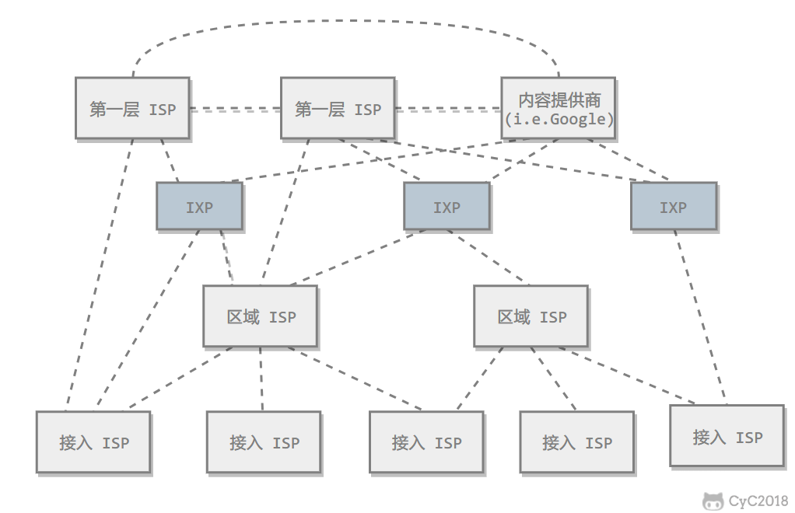
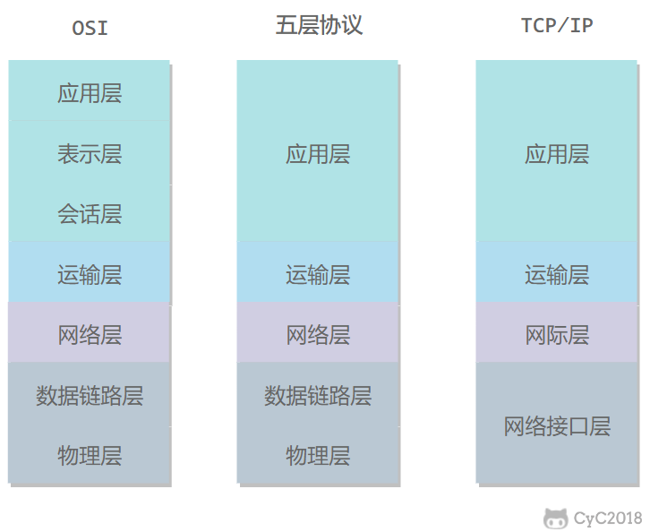

# 网络全景与分层

打开手机里的应用发一个请求，或者在浏览器里输入一个网址，你可能只看到“加载中”，或者一条看不懂的报错。是域名没有解析出来，还是连接建不起来、证书校验失败、服务端响应太慢？只把这些问题笼统地归为“网络不好”，排查就只能靠反复重试和猜。

网络知识常见的碎片化后果是：记住了“三次握手”“七层模型”这些名词，却说不清一次通信为什么要跨过这么多设备和网络，也分不清带宽、时延、吞吐量这些经常被混用的指标。结果是遇到问题不知道该看哪一层，优化性能时也不知道瓶颈可能在哪一段。

本文先建立一张全景图：一次通信经过哪些设备、哪些网络，它们为什么采用分组交换；接着用一组可以自己复算的指标，把带宽、吞吐量、四种时延和抖动分开；然后解释分层为什么必要，OSI、TCP/IP 与五层教学模型各自解决什么问题；最后跟随一个消息走完封装、逐跳转发与解封装，并给出一条按层定位故障的路线。

读完之后，你应该能把后面每篇文章里的协议，挂到这张骨架的对应位置上。

<!-- GFM-TOC -->
* [从两台设备通信到“网络的网络”](#从两台设备通信到网络的网络)
    * [端系统、接入网与网络核心](#端系统接入网与网络核心)
    * [互联网是“网络的网络”](#互联网是网络的网络)
* [为什么采用分组交换](#为什么采用分组交换)
    * [电路交换：用预留换确定性](#电路交换用预留换确定性)
    * [分组交换：按需共享与存储转发](#分组交换按需共享与存储转发)
    * [代价：排队、丢包与首部开销](#代价排队丢包与首部开销)
* [先建立四个性能概念](#先建立四个性能概念)
    * [带宽、吞吐量与有效吞吐量](#带宽吞吐量与有效吞吐量)
    * [四种时延：从公式到可复算例子](#四种时延从公式到可复算例子)
    * [抖动，以及 RTT 的物理下限](#抖动以及-rtt-的物理下限)
* [为什么网络需要分层](#为什么网络需要分层)
    * [不分层的代价](#不分层的代价)
    * [服务、接口、协议与对等实体](#服务接口协议与对等实体)
    * [分层的收益与代价](#分层的收益与代价)
* [OSI、TCP/IP 与五层教学模型](#ositcpip-与五层教学模型)
    * [三种模型各自解决什么问题](#三种模型各自解决什么问题)
    * [各层职责、数据单元与地址](#各层职责数据单元与地址)
    * [TLS、QUIC 与“在第几层”的问题](#tlsquic-与在第几层的问题)
* [封装、解封装与一次逐跳转发](#封装解封装与一次逐跳转发)
    * [哪些字段每跳变化，哪些端到端保持](#哪些字段每跳变化哪些端到端保持)
    * [交换机、路由器与负载均衡器分别看到什么](#交换机路由器与负载均衡器分别看到什么)
* [两种通信组织方式](#两种通信组织方式)
* [按层定位一次故障](#按层定位一次故障)
* [从全景图继续阅读](#从全景图继续阅读)
* [常见误区](#常见误区)
* [参考资料](#参考资料)
* [一句话总结](#一句话总结)
<!-- GFM-TOC -->

## 从两台设备通信到“网络的网络”

先看最小的问题：一部手机要访问远端的服务器。手机和服务器都运行应用程序，它们在网络术语里叫端系统（end system），也叫主机（host）。网络的最终目的不是让两台设备“连上”，而是让运行在端系统上的进程交换数据。

### 端系统、接入网与网络核心

把端系统接进互联网的第一段网络叫接入网（access network）：家庭 Wi-Fi、光纤宽带、办公以太网、蜂窝网络都属于接入网，它们把端系统交给某个网络运营商。接入网的另一侧，是互联网服务提供商（Internet Service Provider，ISP）维护的网络。

用户数据离开接入网后，进入由分组交换机和链路组成的网络核心（network core）；分组沿路径经过一台台路由器（router），每台路由器把分组从入接口转发到通向目的地的出接口。链路（link）是连接相邻节点的物理或逻辑通道；一台端系统通常只有一条接入链路，而核心里的路由器往往有许多条链路。

> **关键认知：** 端系统负责产生和消费数据，路由器负责转发；接入网解决“怎么进入互联网”，网络核心解决“怎么跨过互联网”。

### 互联网是“网络的网络”

互联网不是一张由某个机构统一建设和运营的大网，而是大量独立管理的网络互相连接的结果。其中由网络运营商管理、对外采用统一且清晰路由策略的网络集合，称为自治系统（Autonomous System，AS）；AS 是域间路由的基本单位，一个 ISP、大型内容提供商或企业网络都可能拥有自己的 AS [R3]。

用户所在的接入 ISP 通常不会直连所有目的地，而是与更大的 ISP 或内容网络互联。教材常用的概念模型按覆盖范围和互联角色，把 ISP 分为接入 ISP、区域 ISP 和一级 ISP；互联网交换点（Internet Exchange Point，IXP）则是多个网络在同一设施内直连、直接交换流量、避免绕行第三方 ISP 的常见做法 [R4]。

<div align="center">
  
</div>
<p align="center">图 1：ISP 与 IXP 的角色示意；现实互联由商业合同与路由策略决定，不是固定的三层树。来源：本库旧版《计算机网络 - 概述》配图（CyC2018/CS-Notes）。</p>

> **时效信息（核查日期：2026-09-22）：** 教材中的 ISP 分层只是理解角色关系的概念模型。实际互联关系随商业与技术持续变化，Internet Society 把 IXP 描述为不同网络在本地直接交换流量的中立设施 [R4]；本文不把任何具体拓扑写成全球现状。

另外两个容易混淆的词：小写 internet 泛指“网络的网络”，任何互连起来的网络集合都可以叫 internet；大写 Internet 特指全球互联网。中文通常都译作“互联网”，阅读英文材料时需要靠上下文区分。

## 为什么采用分组交换

互联网要同时承载全球大量设备之间的通信，必须先回答一个资源分配问题：通信期间，要不要为每条数据流预留一段固定的传输能力？这是电路交换与分组交换的分水岭。

### 电路交换：用预留换确定性

电路交换（circuit switching）的经典场景是电话通话：在通信开始之前，网络先为这次通信建立一条端到端的电路，沿途为它预留固定速率（在数字系统里通常表现为频段或时隙）。通话期间，即使没有数据传输，这段资源也被占用，其他通信不能使用。

预留换来了确定性：只要电路建立成功，通信就有一条速率已知的通道，时延主要由传播时延决定，不会因为别人此刻也在使用网络而排队。代价是效率：人的语音大部分时间是静默的，为一条安静的通话保留整段资源并不划算；当所有电路都被占用时，新呼叫只能被拒绝。

### 分组交换：按需共享与存储转发

分组交换（packet switching）不做预留。发送方把数据切成一个个分组（packet），每个分组带上首部，标出目的地址等控制信息；路由器按存储转发（store-and-forward）方式工作：先完整收下分组、校验，查看目的地址并查表，再从合适的出接口把它发送出去。

链路的传输能力不预先分配，而是按到达顺序被各个分组共享：一个分组在被发送的那一刻以链路速率独占这条链路，发送完立即释放，下一个分组才能使用。这种资源按需分配、多个流竞争复用的方式叫统计复用（statistical multiplexing）。突发流量到来时，只要链路还有空闲，就能以全速发送；空闲时段也不会浪费任何预留资源 [R5]。

> **关键认知：** 分组交换的“共享”不是多个分组在同一时刻叠在同一条链路上，而是它们轮流占用发送时间；正在发送的分组仍然独占链路速率，只是不会长期占用。

### 代价：排队、丢包与首部开销

统计复用把不确定性引入了网络。路由器每个出接口都有缓冲区：如果短期内到达该接口、要经它转发的分组速率超过了它的发送速率，等待发送的分组就会在缓冲区里排队；缓冲区满时，新到的分组会被丢弃。也就是说，分组交换的代价是排队时延、丢包和乱序，这些在电路交换的预留模型里基本不会出现。

分组交换还引入固定开销：每个分组都要携带首部，首部占用的比特同样要花链路时间；一个大的应用消息被切成许多分组后，有效载荷占比进一步下降。此外，存储转发让每一跳都增加“完整收下一个分组”的时间，端到端时延因此随跳数累加。

| 维度 | 电路交换 | 分组交换 |
| --- | --- | --- |
| 资源分配 | 建立阶段预留固定速率 | 不预留，发送时按需占用 |
| 速率保证 | 有（按预留值） | 没有，取决于竞争与拥塞 |
| 时延 | 建链后主要是传播时延 | 处理、排队、传输、传播四部分叠加，随负载波动 |
| 突发流量 | 空闲容量被浪费 | 统计复用，利用率更高 |
| 失败模式 | 无空闲电路时拒绝建立 | 排队、丢包、乱序 |
| 典型对照 | 电话网的传统模型 | 互联网的整体设计 |

> **面试高频：** 分组交换和电路交换各自的优缺点是什么？为什么互联网选择分组交换？
> **答题脉络：** 先对比资源预留与统计复用 → 说明突发流量的效率差异 → 再说明代价是排队、丢包和时延不确定 → 最后解释端系统用可靠传输与拥塞控制来补偿。
> **追问方向：** 统计复用为什么必然引入排队、实时音视频如何应对丢包与抖动、虚电路与数据报的区别。

## 先建立四个性能概念

“网络慢”是模糊的说法。要判断慢在哪，至少需要四个独立的量：链路能提供的速率、实际达到的吞吐量、应用真正收到的有效数据速率，以及时延与它的波动。

### 带宽、吞吐量与有效吞吐量

带宽（bandwidth）在不同语境下含义不同：在模拟信号领域它指频带宽度（赫兹），在数字网络的口语里通常指链路速率（link rate），也就是链路每秒能推出的比特数。本文统一用链路速率或容量，单位是 bit/s，例如 100 Mbit/s 表示每秒 $10^8$ 比特。链路速率是链路的属性，不代表用户实际能拿到这么多。

吞吐量（throughput）是一次传输实际达到的速率，单位同样是 bit/s。端到端吞吐量由路径上最慢的那一段决定，这一段叫瓶颈链路（bottleneck link）：本地 Wi-Fi 是 100 Mbit/s、服务端出口限速 10 Mbit/s 时，这条路径的吞吐量上限接近 10 Mbit/s，而不是 100 Mbit/s。

有效吞吐量（goodput）是应用真正有用的数据对应的速率。协议首部、传输层的重传和 TLS 记录层的封装都不算有效载荷；下载一个文件时，文件体的字节数除以时间得到的就是 goodput，它通常低于吞吐量。测速网站给出的通常是吞吐量级别的数字，而用户感知更接近 goodput。

> **关键认知：** 链路速率是每一段各自的属性，吞吐量由整条路径的瓶颈决定，goodput 还要再扣掉协议开销与重传；三者可以相差很大。

> **面试高频：** 带宽、吞吐量、goodput 和抖动分别指什么？
> **答题脉络：** 先区分链路速率（链路属性）、吞吐量（实际达到）、goodput（应用有效载荷）→ 吞吐量由瓶颈链路决定 → 抖动来自排队，影响实时业务 → 指出测速数字与用户体验的差别。
> **追问方向：** 测速很高但接口仍然慢可能卡在哪一段、为什么下载速度总低于签约带宽、实时音视频为什么需要播放缓冲。

### 四种时延：从公式到可复算例子

分组从一台设备到下一台设备，会在每个节点上经历四段不同的等待，它们的公式和量纲都不一样：

$$d_{nodal} = d_{proc} + d_{queue} + d_{trans} + d_{prop}$$

- 处理时延 $d_{proc}$：节点检查首部、查转发表、做差错校验的时间，通常很小，与流量关系不大。
- 排队时延 $d_{queue}$：分组在输出缓冲区等待发送的时间，随负载剧烈变化，是四类时延中最不可预测的一项。
- 传输时延（也称发送时延、序列化时延）$d_{trans} = L / R$：把分组的所有比特推上链路所需的时间，$L$ 是分组长度（bit），$R$ 是链路速率（bit/s）。它与距离无关。
- 传播时延 $d_{prop} = d / s$：一个比特在介质中跑完全程的时间，$d$ 是链路长度（m），$s$ 是信号在该介质中的传播速度（m/s），光纤中约为 $2 \times 10^8$ m/s。它与数据量无关。

把数字代进去就能看清区别：一个 1500 B 的分组经 100 Mbit/s 链路发送，传输时延是 $1500 \times 8 / 10^8 = 120\,\mu s$；同一条链路若是 2000 km 的光纤，传播时延是 $2 \times 10^6 / (2 \times 10^8) = 10\,ms$。两者相差近两个数量级；把链路升级到 1 Gbit/s 后，传输时延只剩 $12\,\mu s$，传播时延仍是 10 ms。

下面用 Dart 复算这组数字：

```dart
// 前置条件：Dart 3.x；纯 Dart，无第三方依赖；确定性算术，不模拟真实排队与拥塞。
// 运行：dart run lib/network/link_delay.dart
import 'dart:io';

// 1. 传输时延：把分组的所有比特推上链路的时间，只由分组长度和链路速率决定。
double transmissionDelay(int bytes, double bitPerSecond) =>
    bytes * 8 / bitPerSecond;

// 2. 传播时延：一个比特跑完整条链路的时间，只由距离和介质传播速度决定。
double propagationDelay(double meters, double metersPerSecond) =>
    meters / metersPerSecond;

void main() {
  // 3. 复算正文例子：1500 B 分组、2000 km 光纤、100 Mbit/s 链路。
  const sizeInBytes = 1500;
  const rate = 100e6;
  final transmission = transmissionDelay(sizeInBytes, rate);
  final propagation = propagationDelay(2000e3, 2.0e8);
  final upgraded = transmissionDelay(sizeInBytes, 10 * rate);

  // 4. 断言：带宽提升只会压缩传输时延，传播时延由距离与介质速度决定。
  assert((transmission - 120e-6).abs() < 1e-12, '传输时延应为 120 µs');
  assert((propagation - 10e-3).abs() < 1e-12, '传播时延应为 10 ms');
  assert((upgraded - 12e-6).abs() < 1e-12, '10 倍速率下传输时延应为 12 µs');

  // 5. 打印毫秒值，与正文数值对照。
  String ms(double seconds) => (seconds * 1000).toStringAsFixed(3);
  stdout.writeln('传输时延 1500 B @ 100 Mbit/s = ${ms(transmission)} ms');
  stdout.writeln('传播时延 2000 km @ 2.0e8 m/s = ${ms(propagation)} ms');
  stdout.writeln('带宽提升 10 倍后传输时延 = ${ms(upgraded)} ms');
}
```
<!-- verify: .work/verify/B07/lib/network/link_delay.dart -->

运行输出是 `0.120 ms`、`10.000 ms` 和 `0.012 ms`。这解释了为什么“加带宽”经常救不了延迟：它只能压缩传输时延和排队时延；跨洲链路的传播时延由物理距离决定，光在光纤里也不会走得更快。

一次端到端传输的总时延，是路径上每一跳的 $d_{nodal}$ 之和，再加上端系统自身的处理时间。跳数越多，处理与存储转发的累加越明显；排队时延是否出现，则取决于每条输出链路的负载。往返时延（Round-Trip Time，RTT）是一次探测或请求从发出到收到对应响应所经历的时间，通常包含两个方向的传输、传播、处理和排队。这里的“响应”不必特指 TCP ACK：`ping` 对应 ICMP 回显应答，应用请求则可能对应应用层响应。

### 抖动，以及 RTT 的物理下限

抖动（jitter）指分组之间时延的波动，主要来自排队时延随负载变化。对文件下载来说，抖动只影响完成时间的稳定性；对语音、视频和实时游戏来说，时延忽高忽低比“稳定的高时延”更难处理，所以接收端常用播放缓冲（jitter buffer）先攒一小段数据再播放，用增加的固定延迟换取平滑。

RTT 也有物理下限。北京到纽约的直线距离约 1.1 万千米，即使按光纤中 $2 \times 10^8$ m/s 的直连路径计算，单程传播下限也约 55 ms，往返超过 110 ms；真实光缆要绕行、还要经过路由与排队，只会更慢。所以“升级带宽”永远无法把一个跨洲 RTT 降到局域网的量级。

> **关键认知：** 传播时延由距离和介质速度决定，是带宽买不来的部分；抖动来自排队，可以通过缓冲吸收，但只能以增加延迟为代价。

> **面试高频：** 传输时延和传播时延有什么区别？为什么升级带宽无法降低 ping？
> **答题脉络：** 先给出两个公式与量纲 $L/R$、$d/s$ → 代入 1500 B、2000 km 的例子 → 说明带宽提升只改变传输时延和拥塞程度 → 给出跨洲 RTT 的物理下限。
> **追问方向：** 卫星链路、慢启动与 RTT 的关系、为什么“测速很快”但打开网页仍然慢。

## 为什么网络需要分层

### 不分层的代价

假设没有分层：每个应用都要自己处理网卡差异、寻址、路由、重传、加密和字符编码。一个要在 Wi-Fi、以太网和蜂窝网络上运行的应用，就得为每种链路写一套通信代码；每更换一项底层技术，所有应用都要跟着改。网络协议的组合数量会爆炸，正确性也无从验证。

分层（layering）是应对这种复杂度的分解方法：把“应用语义”“进程间传输”“主机间寻址与转发”“相邻节点传输”“比特信号”拆成不同层次，每层只解决一类问题，只依赖下一层提供的服务，并向上层提供稳定的接口。

### 服务、接口、协议与对等实体

理解分层需要四个词：

- 服务（service）：下层向上层提供的能力，例如“可靠的字节流”“无连接的数据报”。服务是垂直的，在同一台机器内相邻层之间发生。
- 接口（interface）：上层使用下层服务的方式，也就是服务访问点（Service Access Point，SAP），例如“通过 socket 读写字节流”。
- 协议（protocol）：同一层上两个对等实体（peer entity）交换消息的规则集合——消息的格式、含义以及发送和响应的时机。协议是水平的，发生在两台主机的同一层之间。
- 对等实体：分处两端、位于同一层的两个实现，例如两个 TCP 模块。

这个区分解决了一个常见困惑：编写 HTTP 的开发者并没有“调用 TCP 的函数”跨过网络，它只是在本机通过接口把数据交给本机 TCP；真正与对端 TCP 交换报文的是本机 TCP 模块，对端应用看到的则是自己的应用层数据。

> **关键认知：** 协议规定同一层对等实体之间如何交流，服务描述下层为上层做什么；把协议当成“函数调用链”是分层模型最常见的误读。

### 分层的收益与代价

分层的收益是隔离与可替换：只要接口稳定，换掉底层的链路技术不影响应用；换掉应用协议不影响路由器。厂商可以各自实现同一层的协议并通过标准互操作，这也是互联网能容纳大量异构网络的前提。

代价同样明确。每层都要加首部、做处理，带来固定开销；层与层之间刻意隐藏信息，上层看不到下层的细节，跨层优化只能靠显式“打洞”；某些功能还会在多层重复实现，例如差错检测在链路层和传输层都存在，只是覆盖范围不同。

> **面试高频：** 网络为什么要分层？分层有什么缺点？
> **答题脉络：** 先说明不分层时组合爆炸 → 用服务、接口、协议、对等实体四个概念说明分层的分解方式 → 再讲隔离与可替换的收益 → 最后承认开销、信息隐藏与功能重复的代价。
> **追问方向：** 端到端原则为什么把可靠性放在端系统、NAT 与中间盒为什么破坏分层、TLS 与 QUIC 算不算跨层设计。

## OSI、TCP/IP 与五层教学模型

### 三种模型各自解决什么问题

OSI 参考模型（Open Systems Interconnection Reference Model）由 ISO 提出，把通信功能划分为七层，用于讨论协议应该承担哪些职责，是设计和教学用的参考框架，不是互联网实际部署的协议栈。互联网实际运行的是 TCP/IP 协议族：RFC 1122 把它描述为应用层、传输层、网际层和链路层四层，并指出它的应用层合并了 OSI 参考模型中表示层与应用层的功能 [R1]。五层模型（物理层、数据链路层、网络层、传输层、应用层）是把 TCP/IP 的链路层拆成两层之后的教学版本，本文与后续文章默认使用五层模型。

<div align="center">
  
</div>
<p align="center">图 2：OSI 七层、五层教学模型与 TCP/IP 四层的对应关系。来源：本库旧版《计算机网络 - 概述》配图（CyC2018/CS-Notes）。</p>

三者的关系可以概括成：OSI 提供职责清单，TCP/IP 描述互联网真实协议族的组织，五层模型用于教学和分工。OSI 的会话层与表示层没有独立出现在互联网协议族中：会话管理、压缩、加密、字符编码等职责，通常由应用协议和它使用的库承担。

### 各层职责、数据单元与地址

每一层都有自己服务的对象、典型协议、数据单元（Protocol Data Unit，PDU）和寻址方式：

| 层 | 服务对象 | 典型协议 | 数据单元 | 主要地址 |
| --- | --- | --- | --- | --- |
| 应用层 | 应用进程之间的语义 | HTTP、DNS、SMTP | 报文（message） | 域名、URL 等应用标识（不一定直接是网络地址） |
| 传输层 | 进程到进程 | TCP、UDP、QUIC | TCP 报文段（segment）、UDP 用户数据报（user datagram） | 端口号 |
| 网络层 | 主机到主机 | IP、ICMP | 分组 / 数据报（packet / datagram） | IP 地址 |
| 链路层 | 同一链路上的相邻节点 | 以太网、Wi-Fi、PPP | 帧（frame） | MAC 地址等链路地址 |
| 物理层 | 相邻设备之间的比特流 | 介质与信号规范 | 比特（bit） | 无 |

两个记忆点：地址的作用范围随层收窄——IP 地址标识主机与网络，端口标识主机上的进程，MAC 地址只在当前链路内有效；数据单元的名字也按层区分——传输层是报文段或用户数据报，网络层是分组，链路层是帧。

> **关键认知：** 应用层是“进程之间的语义”，传输层是“进程到进程的数据通道”，网络层是“主机到主机的转发”，链路层是“相邻节点之间的交付”；层与层的服务对象不同，这是判断一个问题属于哪一层最可靠的标准。

### TLS、QUIC 与“在第几层”的问题

分层模型最容易引起的争论是“某个协议到底在第几层”。TLS 提供的是安全通道：RFC 8446 只要求下层提供可靠、有序的字节流，再把数据组织成记录加以保护 [R11]——它既不是应用层协议，也不能简单归入 TCP 所在的位置。QUIC 是一种传输协议，但它的报文承载在 UDP 数据报里 [R9]。隧道（把一层协议封装进另一层）和代理会进一步打乱“一层只处理一种协议”的直观认识。

> **时效信息（核查日期：2026-09-22）：** 本文把 TLS 与 QUIC 标注为常见归类：TLS 通常被放在传输层之上、应用层之下，QUIC 通常被归入传输层并以 UDP 承载 [R9][R11]。这是描述惯例，不是标准强制的层次编号。

> **面试高频：** OSI 七层、TCP/IP 四层、五层模型如何对应？各层的数据单元是什么？
> **答题脉络：** OSI 是参考模型 → TCP/IP 是互联网实际分层（RFC 1122 的四层）→ 五层是教学拆分 → 按表说出数据单元与地址 → 补一句表示层与会话管理的职责由应用层及应用库承担（RFC 1122 明确应用层合并了表示层功能）[R1]。
> **追问方向：** TLS 与 QUIC 在第几层、VPN 隧道为什么让层号不唯一、路由器是否只实现下面三层。

## 封装、解封装与一次逐跳转发

分层是垂直的：数据从应用层往下走时，每一层都会在前面加上自己的首部，这个过程叫封装（encapsulation）；到达对端后逐层检查并剥掉首部，叫解封装（decapsulation）。一个应用消息变成链路帧的过程如下：

```text
应用数据
  ↓ 传输层加上 TCP/UDP 首部
[ TCP 首部 | 应用数据 ]                        TCP 报文段 / UDP 用户数据报
  ↓ 网络层加上 IP 首部
[ IP 首部 | TCP 首部 | 应用数据 ]              IP 分组
  ↓ 链路层加上帧首部，以太网还会在末尾加 FCS
[ 帧首部 | IP 首部 | TCP 首部 | 应用数据 | FCS ]   帧
  ↓ 物理层编码成信号
0101…                                          比特
```

每层的首部只对同层有意义：IP 首部由两端的 IP 模块以及沿途路由器解读，链路帧首部由相邻节点的链路层解读。

### 哪些字段每跳变化，哪些端到端保持

分组每经过一台路由器，都要经历“收帧 → 检查 → 查表 → 重新封装成新帧 → 发送”。在这条逐跳路径上，只有一部分信息会改变：

| 字段 | 是否每跳变化 | 说明 |
| --- | --- | --- |
| 链路层源、目的地址 | 变化 | 标识当前链路的发送方与下一跳，帧首部每跳重建 |
| IPv4 的 TTL / IPv6 的 Hop Limit | 变化 | IPv6 规定每跳减 1 [R6]，IPv4 规定每跳至少减 1 [R8]；减到 0 时分组被丢弃，通常还会向源端发送 ICMP 超时报文 [R7][R12] |
| IPv4 首部校验和 | 变化 | 首部字段变了就必须重新计算 |
| 源、目的 IP 地址 | 通常不变 | 无 NAT 时端到端保持；NAT 会改写地址甚至端口 |
| 传输层端口与序号等 | 通常不变 | 无 NAT、无代理时由两端维护 |
| 应用数据 | 不变 | 由应用协议决定语义；代理、压缩、加密会在端点之上再次转换 |

> **关键认知：** 链路层首部只在一跳内有效，每跳重建；IP 地址和传输层信息在不经过 NAT、代理时端到端保持，TTL/Hop Limit 则每跳递减。判断“什么会变”的依据是作用范围，而不是字段名字。

### 交换机、路由器与负载均衡器分别看到什么

“设备属于第几层”通常按它转发时检查的信息来划分：

- 交换机（switch）工作在链路层，按目的 MAC 地址转发帧，不关心 IP 地址。
- 路由器（router）工作在网络层，按目的 IP 地址查转发表（最长前缀匹配）决定下一跳，并把 TTL/Hop Limit 减 1。
- 负载均衡器、反向代理、防火墙可能工作在传输层或应用层：前者按端口或连接分发，后者能读 HTTP 头甚至请求体，因此可以终止连接、改写内容。

“路由器只有下面三层协议”是教学简化。典型转发路径确实只看链路层与网络层（再加上必要的管理与控制协议），但隧道、MPLS、NAT、中间盒以及运行在 TCP 之上的路由协议（如 BGP [R13]）都会让真实设备跨越更多层次 [R8]。教学模型描述职责划分，不描述某台设备实现了哪些模块。

> **面试高频：** 封装与解封装的过程是什么？交换机、路由器、负载均衡器通常查看哪些字段？
> **答题脉络：** 从应用数据逐层加首部讲到帧 → 说明接收端逆向剥离 → 交换看目的 MAC、路由看目的 IP 并递减 TTL、L4/L7 设备看端口或应用内容 → 补一句隧道与中间盒会让“层”不再严格对应设备。
> **追问方向：** NAT 改变了哪些字段、为什么交换机不能代替路由器、隧道封装的额外开销。

> **面试高频：** 什么是端到端与逐跳？为什么可靠性放在端系统而不是每跳？
> **答题脉络：** 先区分逐跳功能（转发、TTL 递减、链路校验）和端到端功能（重传、去重、排序、加密）→ 再用端到端原则说明复杂功能放在端系统、网络内部保持简单更利于演进 [R2] → 最后指出代价：端系统要自己处理网络的不确定性。
> **追问方向：** 为什么不在每跳重传、链路 CRC 与 TCP 校验的分工、QUIC 为什么把更多状态放到端系统。

## 两种通信组织方式

从应用视角看，端系统之间的协作方式主要有两种：客户-服务器（Client-Server，C/S）与对等（Peer-to-Peer，P2P）。

C/S 模式下，服务器长期在线、拥有固定地址并等待请求，客户端主动发起通信。它简单、容易管理，但服务器容量决定服务上限，用户越多越需要扩容。P2P 模式下，参与节点既请求资源也提供资源，文件分发这类场景可以随节点增加而提高总上传能力；代价是节点随时可能离线，定位资源、保持一致性都更复杂。

无论哪种方式，都只是应用层的组织形式，并不改变网络层和传输层：P2P 节点之间仍然通过 IP 寻址，通过 TCP、UDP 或 QUIC 传输数据；现实中往往是混合形态，例如即时通信用中心服务器做信令、用 P2P 或中继传媒体流。

> **关键认知：** C/S 与 P2P 描述的是“谁发起、谁提供资源”的应用层组织方式，不是两种网络层协议；把 P2P 理解成“不需要服务器”也是误解，它只是把角色分散到了节点之间。

> **面试高频：** C/S 与 P2P 有什么区别？
> **答题脉络：** 从角色是否对称、容量如何扩展、可用性来源讲差异 → 强调两者都在 IP 与传输层之上 → 补充混合架构与 NAT 穿越带来的现实复杂度。
> **追问方向：** P2P 与 CDN 的取舍、NAT 对 P2P 连接的影响、内容分发的典型做法。

## 按层定位一次故障

有了分层模型，排查就不必从“网络有问题”开始。下面是一条由外到内、由便宜到昂贵的检查路线；每一步的完整工具与命令属于各主文，这里只说明它对应哪一层：

1. 先确认范围：是单个应用、单个域名出问题，还是整台设备都无法上网？只有某个应用失败，优先怀疑应用协议或服务端，而不是链路。
2. 解析：域名能不能解析成 IP 地址。解析失败停留在 DNS（应用层，见 [应用层：DNS 与基础协议](./05-应用层：DNS与基础协议.md)）。
3. 可达：拿到 IP 后能不能到达，路径在哪一跳开始异常。这属于网络层与地址解析（见 [网络层：IP、路由与地址解析](./03-网络层：IP、路由与地址解析.md)）。
4. 连接：目标端口能否建立连接，是超时、拒绝还是重置。这属于传输层（见 [传输层：UDP、TCP 与 QUIC](./04-传输层：UDP、TCP与QUIC.md)）。
5. 加密：握手能否完成、证书是否有效。这属于 TLS（见 [HTTPS 与 TLS](./08-HTTPS与TLS.md)）。
6. 应用：HTTP 状态码、响应时间与服务端日志。这属于应用层与业务逻辑（见 [HTTP 语义、缓存与版本演进](./07-HTTP语义、缓存与版本演进.md)）。

这条路线不是规定顺序，而是把“现象”归因到能解释它的最小范围：解析慢与带宽无关，握手失败不是拥塞，服务端排队也不该由增加带宽解决。

> **关键认知：** 一次网络故障通常只在某一层成立；先确定“哪一层能解释这个现象”，再决定看什么指标，比笼统地怀疑带宽有效得多。

## 从全景图继续阅读

本文建立的骨架可以这样继续展开：

- 比特如何在介质上传输、帧如何在一段链路上交付：[物理层与数据链路层](./02-物理层与数据链路层.md)
- IP 地址、子网、路由选择、ARP 与 NAT：[网络层：IP、路由与地址解析](./03-网络层：IP、路由与地址解析.md)
- 进程间通信、可靠传输、流量与拥塞控制：[传输层：UDP、TCP 与 QUIC](./04-传输层：UDP、TCP与QUIC.md)
- 域名解析、DHCP、邮件等基础协议：[应用层：DNS 与基础协议](./05-应用层：DNS与基础协议.md)
- 从 URL 到响应的完整旅程与排障：[一次网络请求的完整旅程](./06-一次网络请求的完整旅程.md)
- HTTP 方法、状态码、缓存与版本演进：[HTTP 语义、缓存与版本演进](./07-HTTP语义、缓存与版本演进.md)
- 证书链、TLS 握手与安全边界：[HTTPS 与 TLS](./08-HTTPS与TLS.md)
- 登录状态如何保持：[身份认证：Cookie、Session 与 JWT](./09-身份认证：Cookie、Session与JWT.md)
- 在代码里读写字节流：[Socket 与 I/O 模型](./10-Socket与I-O模型.md)

## 常见误区

- ❌ 分组交换“不占用传输线路”。
- ✅ 分组在被发送的那一刻以链路速率独占链路，发送完立即释放；不存在连接期间的长期预留，“共享”指的是轮流使用发送时间。
- ❌ 升级带宽能降低所有时延。
- ✅ 带宽只影响传输时延和排队时延；传播时延由距离与介质速度决定，跨洲 RTT 有物理下限。
- ❌ OSI 七层就是互联网实际运行的分层。
- ✅ OSI 是参考模型；互联网实际运行的是 TCP/IP 协议族，RFC 1122 把它分为应用层、传输层、网际层与链路层，五层模型是教学拆分 [R1]。
- ❌ 路由器“只有三层”，永远看不到传输层和应用层。
- ✅ 典型转发路径看链路层与网络层，但隧道、NAT、中间盒和控制协议会让真实设备涉及更高层。
- ❌ IP 地址和 MAC 地址在每个转发跳都会变。
- ✅ 无 NAT 时 IP 地址端到端保持；每跳重建的是链路层帧首部，变化的是 MAC 地址与 TTL/Hop Limit。
- ❌ 吞吐量取决于路径上最快的一段。
- ✅ 吞吐量由最慢的瓶颈链路决定；goodput 还要再扣除协议开销与重传。

## 参考资料

- [R1] [RFC] [RFC 1122: Requirements for Internet Hosts — Communication Layers](https://www.rfc-editor.org/rfc/rfc1122) — IETF，第 1.1.3 节描述互联网协议族的四层结构与 OSI 参考模型的关系，[核查日期：2026-09]。
- [R2] [RFC] [RFC 1958: Architectural Principles of the Internet](https://www.rfc-editor.org/rfc/rfc1958) — IETF，第 2.3 节讨论端到端原则，[核查日期：2026-09]。
- [R3] [RFC] [RFC 1930: Guidelines for creation, selection, and registration of an Autonomous System (AS)](https://www.rfc-editor.org/rfc/rfc1930) — IETF，第 3 节给出 AS 的现代定义与路由策略背景，[核查日期：2026-09]。
- [R4] [官方文档] [Internet Exchange Points (IXPs)](https://www.internetsociety.org/issues/ixps/) — Internet Society，含 IXP 的中立设施定义与本地流量交换的作用，[核查日期：2026-09]。
- [R5] [教材] [Computer Networking: A Top-Down Approach](https://www.pearson.com/en-gb/subject-catalog/p/computer-networking-global-edition/P200000004686/9781292405469) — Kurose & Ross，第 8 版（Global Edition），第 1 章“网络核心、时延与分层”，ISBN 9781292405469，[核查日期：2026-09]。
- [R6] [RFC] [RFC 8200: Internet Protocol, Version 6 (IPv6) Specification](https://www.rfc-editor.org/rfc/rfc8200) — IETF，第 3 节定义 Hop Limit 的逐跳递减与丢弃规则，[核查日期：2026-09]。
- [R7] [RFC] [RFC 791: Internet Protocol](https://www.rfc-editor.org/rfc/rfc791) — IETF，第 3.1 节定义 IPv4 的 Time to Live 语义，[核查日期：2026-09]。
- [R8] [RFC] [RFC 1812: Requirements for IP Version 4 Routers](https://www.rfc-editor.org/rfc/rfc1812) — IETF，第 4.2.2.9 节规定转发时 TTL 至少减 1，第 5.2 节描述转发算法与最长匹配，[核查日期：2026-09]。
- [R9] [RFC] [RFC 9000: QUIC: A UDP-Based Multiplexed and Secure Transport](https://www.rfc-editor.org/rfc/rfc9000) — IETF，第 1 节说明 QUIC 是传输协议且报文承载于 UDP 数据报，[核查日期：2026-09]。
- [R10] [RFC] [RFC 9293: Transmission Control Protocol (TCP)](https://www.rfc-editor.org/rfc/rfc9293) — IETF，第 2.2 节描述 TCP 的可靠有序字节流服务，[核查日期：2026-09]。
- [R11] [RFC] [RFC 8446: The Transport Layer Security (TLS) Protocol Version 1.3](https://www.rfc-editor.org/rfc/rfc8446) — IETF，第 1 节定义握手协议与记录层，并说明 TLS 只要求下层提供可靠有序字节流，[核查日期：2026-09]。
- [R12] [RFC] [RFC 792: Internet Control Message Protocol](https://www.rfc-editor.org/rfc/rfc792) — IETF，定义 Time Exceeded 报文的类型与用途，[核查日期：2026-09]。
- [R13] [RFC] [RFC 4271: A Border Gateway Protocol 4 (BGP-4)](https://www.rfc-editor.org/rfc/rfc4271) — IETF，第 3 节说明 BGP 使用 TCP 作为传输协议，[核查日期：2026-09]。

## 一句话总结

> 分层把端到端通信拆成可替换的职责，分组交换用统计复用换取效率、用排队和丢包换来灵活，而传播时延与 RTT 的物理下限，决定了哪些问题只能靠减少往返、优化协议来缓解。
