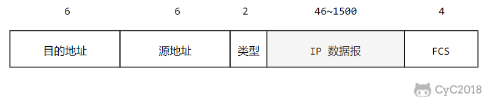

# 计算机网络｜02-物理层与数据链路层

把一根网线插进交换机，几秒钟后网页就能打开。最先发生的事情并不在 IP 或 TCP 中：网卡把一个个比特变成双绞线上的电压跳变，接收方的交换机再把电平还原成比特、拼成一条条帧，判断这一帧该从哪个端口送出去。如果只记住“物理层传比特、链路层传帧”，遇到下面这些问题依然答不上来：为什么帧有大小限制？为什么抓包里 MAC 地址逐跳在变、IP 地址不变？为什么同一条网线换一种接入方式，MTU 就从 1500 变成 1492？

本文按“信号 → 共享介质 → 帧 → 检错 → 以太网与 MAC → 交换机 → VLAN 与 MTU → PPP”的顺序推进：先说明比特如何在有噪声的介质上变成可传播的信号，再解释链路层如何把比特流切成可辨认、可校验的帧，最后把帧放进交换机和路由器组成的真实网络里，观察它怎样逐跳到达下一站。读完应当能解释一块网卡发送一帧时经历了哪些变换、交换机为什么“即插即用”，以及链路层的能力边界在哪里；更上层的分层与封装关系可以随后对照[网络全景与分层](./01-网络全景与分层.md)。

<!-- GFM-TOC -->
* [从“0 和 1”到可传播的信号](#从0-和-1到可传播的信号)
    * [信号、码元与比特率](#信号码元与比特率)
    * [编码与调制](#编码与调制)
    * [单工、半双工与全双工](#单工半双工与全双工)
* [多个通信者如何共享介质](#多个通信者如何共享介质)
    * [五种复用方式怎么选](#五种复用方式怎么选)
    * [码分复用：正交码片怎么分离用户](#码分复用正交码片怎么分离用户)
* [链路层为何要把比特组成帧](#链路层为何要把比特组成帧)
    * [三种定界方式](#三种定界方式)
    * [透明传输与填充](#透明传输与填充)
* [差错检测不是可靠交付](#差错检测不是可靠交付)
    * [CRC 为什么能发现错误](#crc-为什么能发现错误)
    * [CRC 的能力边界](#crc-的能力边界)
* [以太网帧与 MAC 地址](#以太网帧与-mac-地址)
    * [以太网帧的字段](#以太网帧的字段)
    * [MAC 地址的构成与作用域](#mac-地址的构成与作用域)
* [交换机如何转发一帧](#交换机如何转发一帧)
    * [自学习与转发决策](#自学习与转发决策)
    * [广播域与环路](#广播域与环路)
* [从共享以太网到交换式全双工](#从共享以太网到交换式全双工)
    * [CSMA/CD 的工作前提](#csmacd-的工作前提)
    * [为什么现代以太网不再碰撞](#为什么现代以太网不再碰撞)
    * [Wi-Fi 不是 CSMA/CD](#wi-fi-不是-csmacd)
* [VLAN、MTU 与一次跨网交付](#vlanmtu-与一次跨网交付)
    * [802.1Q 标签与 VLAN](#8021q-标签与-vlan)
    * [MTU 取决于当前链路](#mtu-取决于当前链路)
    * [一次跨网交付逐跳看](#一次跨网交付逐跳看)
* [PPP 与其他点到点链路：保留到什么程度](#ppp-与其他点到点链路保留到什么程度)
    * [PPP 做什么](#ppp-做什么)
    * [PPPoE 与宽带接入](#pppoe-与宽带接入)
* [常见误区](#常见误区)
* [参考资料](#参考资料)
* [一句话总结](#一句话总结)
<!-- GFM-TOC -->

## 从“0 和 1”到可传播的信号

网卡里的数据是 0 和 1，但双绞线、光纤和空气只能传递能量变化：电压高低、光强明暗、电磁波相位。把比特送上介质，第一步是把比特变成信号；而信号在介质上会衰减、会被噪声干扰，还受到介质可用频带宽度（带宽）的限制。物理层要回答的正是“用什么样的电、光或电磁信号，以多高、多可靠的速率承载比特”。

> **时效信息（核查日期：2026-09）：** IEEE 802.3-2022 是当前有效的以太网标准（2022-07 发布，IEEE 状态为 Active Standard），覆盖 1 Mbit/s 到 400 Gbit/s 的多种速率与介质。本文引用的以太网行为以该版本为准，[来源](https://standards.ieee.org/ieee/802.3/10422/)。

### 信号、码元与比特率

信号在时间轴上的每一段可区分状态，称为一个码元（Symbol）。接收端并不直接“看见”比特，它看到的是码元序列；一个码元能表示多少比特，取决于发送端准备了多少个可区分的状态：

```text
比特率（bit/s） = 码元率（Baud） × 每个码元承载的比特数
```

如果每个码元只有两个电平，一个码元只能区分 1 比特，此时比特率与码元率数值相等；如果使用 4 个电平（2 位映射到一个电平），每个码元携带 2 比特，码元率不变而比特率翻倍。这也是提高速率的两个方向：让信号变化得更快（提高码元率），或让每次变化携带更多信息（更多电平、更多相位组合）。

> **关键认知：** 比特率与波特率不是同一个量：码元率描述信号每秒变化多少次，比特率还要乘上每个码元承载的比特数。

### 编码与调制

把比特映射成信号有两条常见路线：

- 编码（line coding，基带）：直接在电平上表示比特，信号占用从 0 Hz 开始的频带。典型如不归零（NRZ）编码，用一个高电平表示 1、低电平表示 0；缺点是长串相同的比特会让信号长时间不变，接收端难以从中提取时钟。曼彻斯特（Manchester）编码在每一个比特周期的中间强制一次跳变，接收端可以从跳变中恢复时钟，代价是码元率翻倍——10BASE-T 在 10 Mbit/s 速率下使用曼彻斯特编码，码元率是 20 MBd。
- 调制（modulation，带通）：先产生一个高频载波，再用比特去改变载波的幅度、频率或相位（ASK、FSK、PSK，以及组合多种状态的 QAM）。无线和很多宽带介质只能传递特定频段的信号，因此必须把数字信息“搬”到载波上。

用同一串比特观察两种编码的码元数量，并复算 1000BASE-T 的数值关系：

```text
比特串 10110010
NRZ        : 1 0 1 1 0 0 1 0          （8 个码元，比特率 = 码元率）
Manchester : 10 01 10 10 01 01 10 01  （16 个码元，码元率是比特率的两倍）
1000BASE-T : 125 MBd × 2 bit/码元 × 4 对线 = 1 Gbit/s
```

1000BASE-T 的 1 Gbit/s 不是靠“码元率更高”，而是多电平调制与多对线并行凑出来的（[IEEE 802.3-2022](https://standards.ieee.org/ieee/802.3/10422/)，[UNH-IOL 1000BASE-T PMA 资料](https://www.iol.unh.edu/sites/default/files/knowledgebase/ge/1000BASE-T_PMA_July2004.pdf)）。两类映射的共同点是把比特变成码元，区别在于是否借助载波。

除了电平方案，介质本身的带宽和信噪比也给可靠速率设了上限：香农公式 `C = B × log₂(1 + S/N)` 说明带宽越宽、信噪比越高，链路能可靠承载的比特率上限越高。光纤能比双绞线跑出高得多的速率，不是因为“0 和 1 跑得更快”，而是因为它的可用带宽和抗干扰能力更好。

### 单工、半双工与全双工

按信号方向，链路分为三种工作方式：

- 单工（simplex）：只能单向传输，例如广播电台到收音机；
- 半双工（half-duplex）：双方可收发，但不能同时，例如对讲机，一方说话时另一方必须按住不发；
- 全双工（full-duplex）：双向可同时进行，例如电话，以及今天交换机与终端之间的以太网链路——发送和接收走不同的线对（双绞线）或不同的波长（光纤），互不干扰。

> **关键认知：** 物理链路的“全双工”指两端能同时收发信号；TCP 的“全双工”指一条连接上两个方向的数据流可以独立并行推进。两者在不同层次描述不同事实，不能互相推导。

> **面试高频：** 单工、半双工、全双工怎么区分？
> **答题脉络：** 按信号方向分三类 → 各给一个典型例子 → 说明现代交换以太网属于全双工、共享介质以太网属于半双工 → 区分物理双工与 TCP 全双工。
> **追问方向：** 共享介质为什么必须半双工、双工不匹配会出现什么现象、Wi-Fi 属于哪一类。

## 多个通信者如何共享介质

一条同轴电缆、一段无线电频段、一根光纤，容量都远大于一个用户的平均需求。让多个通信者共用同一条介质的方式称为复用（multiplexing）：把介质的可用容量按某个维度切分成多个逻辑信道，每个信道交给一路使用者。按使用者数量，介质又分为两类：多个站点挂在同一段的广播信道（共享总线、无线频段）需要协调谁先发送，只有两端的点对点信道（串行线路、专线）则不需要。

### 五种复用方式怎么选

| 方式 | 切分维度 | 资源分配 | 典型场景与特点 |
| --- | --- | --- | --- |
| 频分复用 FDM | 频率 | 固定：每路独占一段频带 | 模拟广播、早期载波电话；各路的信号同时存在 |
| 时分复用 TDM | 时间 | 固定：每路轮流占用固定时隙 | 传统数字电话干线；用户空闲时它的时隙也被浪费 |
| 统计时分复用 | 时间 | 按需：有数据才分配时隙 | 分组网络；需要标识区分来源，突发流量下利用率高 |
| 波分复用 WDM | 波长（光的“频率”） | 固定：每路一个波长 | 光纤骨干；一根光纤里多路光载波并行传输 |
| 码分复用 CDM/CDMA | 编码 | 共享：所有用户同时同频，用正交码区分 | 扩频通信、3G 蜂窝系统；接收端用相关运算分离信号 |

- FDM 与 TDM 都是**固定分配**：一个用户不说话时，分给它的频段或时隙也不能给别人用，突发流量下利用率低。
- 统计时分复用按需分配，代价是每段数据必须携带标识（来自谁、交给谁），并且多个用户的数据可能要在发送端排队。
- 波分复用本质上是光的频分复用：光的频率极高，习惯上用波长来标注所使用的光载波。
- 码分复用让所有用户在同一时间、同一频段上发送，靠码片的正交性在接收端把信号分离开。

> **关键认知：** 复用的本质是按维度切分一条共享介质的容量；固定切分（FDM/TDM）简单但浪费突发流量，按需分配（统计时分复用）利用率高但需要标识与排队。

### 码分复用：正交码片怎么分离用户

码分复用的核心是正交（orthogonal）的码片序列：给每个用户分配 m 比特的码片，任意两个用户码片的归一化内积为 0。用户发送比特 1 时发送自己的码片，发送 0 时发送码片的反码；接收端用目标用户的码片对收到的叠加信号做内积，就能判断该用户发了什么。

取 m = 8，码片 S 为 00011011，按 0 → -1、1 → +1 映射成向量 (-1, -1, -1, +1, +1, -1, +1, +1)：

- S 与自己的归一化内积是 1：对应本人发送的比特 1；
- S 与自己反码的内积是 -1：对应比特 0；
- S 与任何正交码片 T 的内积是 0：其它用户的数据在做内积时被“抵消”。

```dart
// 前置条件：Dart 3.x（验证环境 3.12.2）；纯 Dart，无第三方依赖。
// 运行：dart run .work/verify/B08/cdma_orthogonality.dart

/// 归一化内积：两个码片向量逐位相乘求和后除以码片长度 m。
double normalizedDot(List<int> a, List<int> b) {
  var sum = 0;
  for (var i = 0; i < a.length; i++) {
    sum += a[i] * b[i];
  }
  return sum / a.length;
}

void main() {
  // 1. 取 m = 8，把码片 00011011 映射为 S：0 记作 -1，1 记作 +1。
  const s = [-1, -1, -1, 1, 1, -1, 1, 1];
  const sInverted = [1, 1, 1, -1, -1, 1, -1, -1];

  // 2. 另取一个与 S 正交的码片 T，要求归一化内积为 0。
  const t = [1, -1, -1, 1, -1, 1, -1, 1];

  // 3. 自相关为 1，与反码相关为 -1，接收端据此区分比特 1 和比特 0。
  assert(normalizedDot(s, s) == 1);
  assert(normalizedDot(s, sInverted) == -1);
  assert(normalizedDot(s, t) == 0);

  // 4. 两个用户同时发送，接收端仍能从叠加信号中分离出各自的数据。
  final mixed = [for (var i = 0; i < s.length; i++) s[i] + t[i]];
  assert(normalizedDot(mixed, s) == 1);
  assert(normalizedDot(mixed, t) == 1);

  print('dot(S,S)=${normalizedDot(s, s)}');
  print('dot(S,T)=${normalizedDot(s, t)}');
  print('decode S from mixed=${normalizedDot(mixed, s)}');
}
```

<!-- verify: .work/verify/B08/cdma_orthogonality.dart -->

输出确认 `dot(S,S)=1.0`、`dot(S,T)=0.0`：两个用户叠加后的信号，用 S 和 T 分别做内积都能得到 1。代价也同样明显——每个比特要发送 m 个码片，占用带宽扩展到原来的 m 倍。

> **关键认知：** CDMA 不靠频率或时间分割用户，而是靠码片正交性：接收端与谁的码片对齐，就相当于只“听见”谁；代价是扩频带来的带宽开销与码片同步要求。

## 链路层为何要把比特组成帧

物理层向上提供的是一条“比特管道”：发送端的 0/1 序列能到达对端，但接收端看到的是连续比特流，不知道哪里是一条消息的开始、哪里是结束，也不知道这段数据属于谁、该交给哪个上层协议。链路层要做的第一件事就是成帧（framing）：在比特流中划出边界，并加上地址、类型等控制信息，把裸比特变成一条可辨认、可校验的帧。

### 三种定界方式

不同的链路协议用不同办法标记帧边界：

1. **定界符（flag）+ 填充**：用一个数据中不会出现的特殊字节或位模式标记帧首尾，例如 HDLC、PPP 使用 0x7E（01111110）作为定界符。数据里一旦出现这个模式，就通过填充（stuffing）让它“变形”，接收端再还原。
2. **长度字段**：帧头里写明本帧多长，接收端按长度切分；IEEE 802.3 格式可以使用长度字段，但常见的 Ethernet II 格式把同一位置解释为 EtherType，并不靠它声明帧长。
3. **固定时隙或物理层同步**：接收端依靠时钟同步，在固定的时间窗口里划帧，TDM 系统常用这种方式。

以太网不属于“长度字段定界”的典型：它用 7 字节前导码（通常写作重复的 `0x55`）加 1 字节 SFD（`0xD5`）让接收端对齐比特边界，再由物理层的帧边界与帧间间隔确定这一帧的接收范围。802.3 格式在类型/长度字段取值 ≤1500 时按长度解释，Ethernet II 则把取值 ≥1536 的字段按 EtherType 解释（中间区间未定义）；所以不能把这个 2 字节字段笼统都叫长度，也不需要在数据区插入转义字符。

> **关键认知：** 帧的边界不是接收端“猜”出来的，而是由定界机制显式或隐式给出；透明传输要保证任意数据都不会破坏这个定界。

### 透明传输与填充

透明传输（transparent transmission）是指链路层对上层数据“看起来不存在”：上层给出的任意字节组合都能原样穿过链路。接收端的定界机制不能因为数据里恰好出现和定界符相同的内容而误判。

以 PPP 使用的字节填充为例：定界符是 0x7E，转义字符是 0x7D；发送端把数据里的 0x7E 替换成 0x7D 0x5E，把 0x7D 替换成 0x7D 0x5D，接收端再逐一还原。经典 HDLC 常用的是比特填充：数据中每出现 5 个连续 1，就插入一个 0，保证 01111110 只会作为定界符出现。下面的代码实现字节填充的发送/接收过程，并演示不填充的反例：

```dart
// 前置条件：Dart 3.x（验证环境 3.12.2）；纯 Dart，无第三方依赖。
// 运行：dart run .work/verify/B08/hdlc_byte_stuffing.dart

const int _flag = 0x7E, _escape = 0x7D; // 定界符与转义字符

/// 发送端：转义载荷中的定界符与转义字符，再在两端补定界符。
List<int> stuff(List<int> payload) {
  final body = <int>[];
  for (final byte in payload) {
    // 1. 定界符或转义字符拆成“转义字符 + 异或 0x20”，避免数据被误判为帧界。
    if (byte == _flag || byte == _escape) {
      body.addAll([_escape, byte ^ 0x20]);
    } else {
      body.add(byte);
    }
  }
  // 2. 帧体两端各放一个定界符，接收端据此找到帧的起止。
  return [_flag, ...body, _flag];
}

/// 接收端：去掉两端定界符，再还原被转义的字节。
List<int> unStuff(List<int> frame) {
  final payload = <int>[];
  var escaping = false;
  for (final byte in frame.sublist(1, frame.length - 1)) {
    // 3. 处于转义状态时，与 0x20 异或得到原始字节。
    if (escaping) {
      payload.add(byte ^ 0x20);
      escaping = false;
    } else if (byte == _escape) {
      escaping = true;
    } else {
      payload.add(byte);
    }
  }
  return payload;
}

void main() {
  // 1. 载荷里故意放定界符和转义字符本身。
  const payload = [0x41, _flag, 0x42, _escape, 0x43];
  final frame = stuff(payload);

  // 2. 帧体内部不应再出现未转义的定界符；接收端逐字节还原，即透明传输。
  assert(!frame.sublist(1, frame.length - 1).contains(_flag));
  assert(unStuff(frame).toString() == payload.toString());

  // 3. 反例：不转义时，接收端把载荷里的 0x7E 误判成帧结束，后续字节全部丢失。
  const unescapedFrame = [_flag, 0x41, _flag, 0x42, _flag];
  final truncated = <int>[];
  for (final byte in unescapedFrame.sublist(1, unescapedFrame.length - 1)) {
    if (byte == _flag) break;
    truncated.add(byte);
  }
  assert(truncated.toString() == '[65]');

  print('frame=${frame.map((b) => b.toRadixString(16)).join(" ")}');
  print('decoded=${unStuff(frame)}');
  print('naive decode=$truncated（丢失了字节 0x42）');
}
```

<!-- verify: .work/verify/B08/hdlc_byte_stuffing.dart -->

输出显示填充后的帧体内部没有再出现未转义的 0x7E，接收端完整还原出 `[65, 126, 66, 125, 67]`；反例中不做转义的接收端把数据里的 0x7E 当成了帧结束，只拿到第一个字节。

> **关键认知：** 透明传输的目标是“任意数据都能通过”，实现手段不唯一：字节填充、比特填充、长度字段、物理层控制码都是常见方案。把透明传输等同于“插入转义字符”，是以 PPP/HDLC 一种实现代替了全部。

## 差错检测不是可靠交付

比特在介质上传输时可能被噪声翻转：铜线上的电磁干扰、光纤上的信号劣化、无线信道的衰落都会改变个别比特。链路层需要让接收端判断“这一帧的内容还能不能信”，常用做法是在帧尾附加一段冗余校验码。

### CRC 为什么能发现错误

以太网使用的循环冗余校验（Cyclic Redundancy Check，CRC）把比特串看作一个多项式，发送端和接收端约定同一个生成多项式 G(x)。发送端用 G(x) 去除“数据 + 补零”，把余数作为帧检验序列（Frame Check Sequence，FCS）附在帧尾；接收端用同样的 G(x) 去除“收到的数据 + FCS”，余数不为零就判定出错。以太网的 FCS 是 32 位，使用标准 CRC-32 多项式：

```text
x³² + x²⁶ + x²³ + x²² + x¹⁶ + x¹² + x¹¹ + x¹⁰ + x⁸ + x⁷ + x⁵ + x⁴ + x² + x + 1
```

实现时通常使用它的反射形式 0xEDB88320 做逐位或查表计算。帧尾的 4 字节 FCS 从目的地址一直校验到载荷结束，前导码不参与计算。

```dart
// 前置条件：Dart 3.x（验证环境 3.12.2）；纯 Dart，仅依赖 dart:convert。
// 运行：dart run .work/verify/B08/crc32_fcs.dart
import 'dart:convert';

/// 使用以太网 CRC-32 生成多项式（反射形式 0xEDB88320）计算校验值。
int crc32(List<int> bytes) {
  // 1. 寄存器初值全 1，避免前导零不参与运算。
  var crc = 0xFFFFFFFF;

  // 2. 每个字节先异或进寄存器，再逐位移出；最低位为 1 时除以多项式。
  for (final byte in bytes) {
    crc ^= byte;
    for (var bit = 0; bit < 8; bit++) {
      crc = (crc & 1) != 0 ? (crc >> 1) ^ 0xEDB88320 : crc >> 1;
    }
  }

  // 3. 结果再按位取反，得到标准 CRC-32 输出。
  return crc ^ 0xFFFFFFFF;
}

/// 按低字节在前的顺序把 32 位校验值追加为帧尾 FCS。
List<int> appendFcs(List<int> payload) {
  final fcs = crc32(payload);
  return [...payload, for (var i = 0; i < 4; i++) (fcs >> (8 * i)) & 0xFF];
}

void main() {
  // 1. 先过标准自测向量：CRC-32 对 ASCII "123456789" 的已知值是 0xCBF43926。
  final checkValue = crc32(ascii.encode('123456789'));
  assert(checkValue == 0xCBF43926, 'CRC-32 自测向量不匹配');

  // 2. 发送端把校验值放进帧尾；接收端重算载荷的 CRC 与帧尾比较。
  final payload = ascii.encode('frame-payload');
  final frame = appendFcs(payload);
  int readFcs(List<int> bytes) =>
      bytes[bytes.length - 4] |
      (bytes[bytes.length - 3] << 8) |
      (bytes[bytes.length - 2] << 16) |
      (bytes[bytes.length - 1] << 24);
  assert(crc32(payload) == readFcs(frame));

  // 3. 翻转载荷中的 1 个比特后，重算值与携带的 FCS 不再相等。
  final corrupted = List<int>.of(payload)..[3] ^= 0x01;
  assert(crc32(corrupted) != readFcs(frame));

  print('checkValue=0x${checkValue.toRadixString(16).toUpperCase()}');
  print('fcs=0x${readFcs(frame).toRadixString(16).toUpperCase()}');
  print('bitFlipDetected=true');
}
```

<!-- verify: .work/verify/B08/crc32_fcs.dart -->

### CRC 的能力边界

CRC 的检测能力来自生成多项式的数学性质，但不是什么错误都能发现（检测能力的分类见 Peterson & Davie《Computer Networks》第 2.4 节）：

- 生成多项式同时含最高次项和常数项时，所有单比特错误必被检出；
- 余数的位数等于生成多项式的阶，因此长度不超过 32 位的突发错误必被检出，更长的突发错误也大多能检出；
- 存在漏检的可能：当错误多项式恰好是生成多项式的倍数时，接收端会误判为正确。这个概率很低，但不是零；
- CRC 只负责“发现”，不负责“纠正”。以太网收到校验失败的帧后直接丢弃，不做修复，也不自己重传。

> **关键认知：** CRC 只回答“这一帧在传输中大概率没有变样”；检测到错误后以太网直接丢帧，是否重传由上层决定——TCP 用确认与重传补齐（见[传输层：UDP、TCP与QUIC](./04-传输层：UDP、TCP与QUIC.md)），链路协议（如 802.11）也可以有自己的帧级确认与重传，但那属于协议设计，不是 CRC 的功能。

> **面试高频：** 封装成帧、透明传输、CRC 分别解决什么问题？
> **答题脉络：** 比特流没有边界 → 成帧显式标记帧的起止；数据可能与定界符撞车 → 透明传输保证任意数据可穿过；介质会翻转比特 → CRC 让接收端发现错误并丢帧。
> **追问方向：** 检错与纠错的区别、CRC 与简单校验和的强度差异、丢帧之后谁来重传、为什么 TCP 还需要自己的校验和。

## 以太网帧与 MAC 地址

以太网（Ethernet）是目前最主流的局域网技术。它把要发送的数据封装成帧，在同一段链路（同一个广播域）内用 MAC 地址标识接收方，由交换机把帧送到目的端口。

### 以太网帧的字段

<div align="center">
  
</div>
<p align="center">图 1：以太网帧的字段布局；图中未画出 7 字节前导码与 1 字节 SFD，它们不计入帧长。来源：本库旧版《计算机网络 - 链路层》配图（CyC2018/CS-Notes）；字段定义按 IEEE 802.3-2022 核对。</p>

- **前导码（7 字节）+ SFD（1 字节）**：让接收端对齐比特边界，不计入帧长；
- **目的 MAC（6 字节）、源 MAC（6 字节）**：这一段链路上的收件人和发件人；
- **类型/长度（2 字节）**：Ethernet II 里表示上层协议，例如 0x0800 是 IPv4、0x86DD 是 IPv6、0x0806 是 ARP；当取值 ≤1500 时按长度解释（后面通常跟 LLC/SNAP 头），≥1536 时按 EtherType 解释为上层协议，两者之间是未定义区间；
- **载荷（46–1500 字节）**：上层数据。不足 46 字节时补零，保证整个帧（从目的 MAC 到 FCS）不小于 64 字节；
- **FCS（4 字节）**：上一节的 CRC-32 校验值。

由此得到几个常被引用的数字：帧长（不含前导码）最小 64 字节、最大 1518 字节；插入 802.1Q 标签后增加 4 字节，最长 1522 字节。这类“最大帧长”是 IEEE 802.3 为了互操作划定的边界；很多设备支持 jumbo frame（常见约 9000 字节），但它不是 IEEE 802.3 定义的标准，只适合在端到端都支持且受控的网络里启用。

### MAC 地址的构成与作用域

MAC 地址通常写作 48 位、6 组十六进制，例如 `00:1A:2B:3C:4D:5E`（IEEE 称其为 EUI-48）：

- 高 24 位是组织唯一标识符（Organizationally Unique Identifier，OUI），由 IEEE 分配给厂商；低 24 位由厂商自行分配；
- 第一个字节的最低位是单播/组播位（I/G）：0 表示单播，1 表示组播；全 1 的 `FF:FF:FF:FF:FF:FF` 是广播地址；
- 第一个字节的次低位是全局/本地位（U/L）：0 表示全局管理地址（由 IEEE 分配），1 表示本地管理地址（由软件指定）。随机化隐私地址就是把这一位置 1。

MAC 地址的作用域是一段链路，而不是整个互联网：它不需要全球唯一（虚拟化、随机化都会让不同链路出现相同地址），只在同一广播域内的转发过程中需要唯一可识别。

> **关键认知：** MAC 地址只在同一段链路（同一广播域）内有意义；把数据送到目的主机是 IP 的职责。跨路由器时 IP 地址通常保持不变，而帧的源、目的 MAC 会被逐跳替换。

> **关键认知：** “MAC 地址烧写在网卡里、永久唯一”只是常见情况：软件可以改写网卡地址，现代终端为保护隐私还会对每个网络使用随机地址。Apple 从 iOS 14 起为每个 Wi-Fi 网络使用私密地址，iOS 18 起提供关闭/固定/轮换三种选项；Android 从 Android 10 起默认启用 MAC 随机化，Android 12 起对部分网络使用非持久随机化（核查日期：2026-09）。

下面的代码直接拼出两种帧，并验证两个容易记错的边界：无标签最小帧含 FCS 恰好 64 字节，以及 802.1Q 标签的位布局：

```dart
// 前置条件：Dart 3.x（验证环境 3.12.2）；纯 Dart，无第三方依赖。
// 运行：dart run .work/verify/B08/ethernet_frame.dart

/// 把 "aa:bb:cc:dd:ee:ff" 形式的 MAC 地址解析为 6 字节。
List<int> parseMac(String text) =>
    text.split(':').map((part) => int.parse(part, radix: 16)).toList();

void main() {
  final dst = parseMac('00:11:22:33:44:55');
  final src = parseMac('66:77:88:99:aa:bb');
  final payload = List<int>.filled(46, 0xAB);

  // 1. 无标签 IPv4 帧：目的 MAC + 源 MAC + EtherType + 载荷，帧数据共 60 字节。
  final plain = <int>[...dst, ...src, 0x08, 0x00, ...payload];
  assert(plain.length + 4 == 64); // 加上 4 字节 FCS，恰好是最小帧长。

  // 2. 802.1Q 标签插在源地址之后（前 12 字节）：16 位 TPID=0x8100 + 16 位 TCI。
  //    TCI 高 3 位是 PCP、接着 1 位是 DEI、低 12 位是 VLAN ID。
  const vlanId = 100;
  final tci = vlanId & 0x0FFF;
  final tagged = <int>[
    ...plain.sublist(0, 12),
    0x81,
    0x00,
    tci >> 8,
    tci & 0xFF,
    ...plain.sublist(12),
  ];
  final readTci = (tagged[14] << 8) | tagged[15];
  assert(tagged[12] == 0x81 && tagged[13] == 0x00);
  assert(readTci & 0x0FFF == 100 && tagged.length == plain.length + 4);

  print('无标签帧长（含 FCS）= ${plain.length + 4} 字节');
  print('有标签帧长（含 FCS）= ${tagged.length + 4} 字节，VID=${readTci & 0x0FFF}');
}
```

<!-- verify: .work/verify/B08/ethernet_frame.dart -->

> **面试高频：** MAC 地址与 IP 地址分别解决什么问题？
> **答题脉络：** IP 负责跨网络定位与路由，MAC 负责同一段链路内的交付 → 一段链路内用 MAC 找收件人，跨网络由路由器逐跳换帧 → 跨路由器时 IP 不变，MAC 逐跳重写（NAT 会改 IP 和端口）。
> **追问方向：** 为什么不用 MAC 直接全球寻址、ARP/NDP 的作用、虚拟化和随机 MAC 带来的影响。搜索下一跳链路地址的过程见[网络层：IP、路由与地址解析](./03-网络层：IP、路由与地址解析.md)。

## 交换机如何转发一帧

以太网最基础的连接设备是交换机（switch），标准中称为网桥（bridge）。它工作在链路层，按 MAC 地址转发帧，不需要人工配置就能工作——这就是“即插即用”的来源。

### 自学习与转发决策

交换机的转发表（也称 MAC 地址表）记录“MAC 地址 → 端口”的映射，它通过观察每一帧的源地址来自学习：

1. **学习**：收到一帧后，把“源 MAC → 入端口”写进转发表，登记发件人在哪；
2. **查表**：在转发表中查目的 MAC：
   - 命中且出端口不是入端口：只向该端口转发（单播）；
   - 命中但出端口就是入端口：丢弃，不需要绕回去；
   - 未命中，或目的是广播/未知组播：除入端口外向所有端口泛洪（flooding）；
3. **老化**：表项有生存时间，长时间不再出现的映射会被删除。否则设备换端口、下线后，表项会一直指向错误的位置。

```dart
// 前置条件：Dart 3.x（验证环境 3.12.2）；纯 Dart，无第三方依赖。
// 运行：dart run .work/verify/B08/switch_learning.dart

/// 教学用交换机：只维护源 MAC 到入端口的映射，忽略表项老化。
class LearningSwitch {
  LearningSwitch(this.portCount);

  final int portCount;
  final Map<String, int> _macToPort = {};

  /// 处理一帧，返回该帧被转发的出端口列表。
  List<int> processFrame({
    required String src,
    required String dst,
    required int inPort,
  }) {
    // 1. 先自学习：源地址出现在哪个端口，就记下哪个端口。
    _macToPort[src] = inPort;

    // 2. 再查目的地址：命中且不在同一端口时单播转发。
    final outPort = _macToPort[dst];
    if (outPort != null && outPort != inPort) {
      return [outPort];
    }

    // 3. 未知单播或广播：除入端口外全部泛洪。
    return [
      for (var port = 1; port <= portCount; port++)
        if (port != inPort) port,
    ];
  }

  Map<String, int> get table => Map.unmodifiable(_macToPort);
}

void main() {
  final sw = LearningSwitch(4);

  // 1. A 从 1 口发给未知的 B：泛洪到 2、3、4 口，同时学习 A 的位置。
  final flood = sw.processFrame(src: 'A', dst: 'B', inPort: 1);
  assert(flood.toString() == '[2, 3, 4]');
  assert(sw.table['A'] == 1);

  // 2. B 从 2 口回帧：学习 B 后，查表把帧单播转发到 1 口。
  final unicast = sw.processFrame(src: 'B', dst: 'A', inPort: 2);
  assert(unicast.toString() == '[1]');
  assert(sw.table['B'] == 2);

  // 3. 广播帧永远泛洪，但不会发回入端口。
  final broadcast = sw.processFrame(
    src: 'A',
    dst: 'FF:FF:FF:FF:FF:FF',
    inPort: 3,
  );
  assert(broadcast.toString() == '[1, 2, 4]');

  print('table=${sw.table}');
  print('flood=$flood unicast=$unicast broadcast=$broadcast');
}
```

<!-- verify: .work/verify/B08/switch_learning.dart -->

输出对应了这条时间线：A 从 1 口发给未知的 B 时泛洪到 2、3、4 口，同时学到 A 在 1 口；B 从 2 口回复 A 时先学到 B 在 2 口，再命中 A 的表项，单播转发到 1 口；广播帧永远泛洪，但不回灌到入端口。

### 广播域与环路

交换机把“冲突域”缩小到每个端口，却不会自动隔离“广播域”：默认情况下，广播帧和未知单播都会被泛洪到全部端口，它们属于同一个广播域。广播域越大，泛洪流量和 ARP 之类的广播越多，因此需要用 VLAN 或路由器把广播域划小（下一节展开）。

另一个天然问题是环路：如果交换机之间连成环，广播帧会沿着环无限循环并被复制，形成广播风暴，转发表里同一台设备的映射也会被同一个帧在不同端口上来回“刷新”。二层网络用生成树协议（STP、RSTP、MSTP）在逻辑上剪掉环路，让任意两台交换机之间只保留一条活动路径。生成树的选举细节超出本篇范围，只需记住它解决的是“环路 + 广播”的组合问题。

> **关键认知：** 交换机是透明设备：终端不需要知道内部路径，转发只依赖目的 MAC 与转发表；但它在默认状态下不隔离广播，所有端口仍属于同一个广播域。

> **面试高频：** 交换机的自学习、泛洪和广播域/冲突域怎么讲？
> **答题脉络：** 学习源地址、查目的地址 → 未命中和广播泛洪 → 每个端口一个冲突域、默认全部端口一个广播域 → 表项会老化。
> **追问方向：** 环路如何造成广播风暴、生成树/快速生成树的作用、VLAN 如何切分广播域。

## 从共享以太网到交换式全双工

早期以太网的所有站点共享一段同轴电缆或一个集线器（hub），处于同一个冲突域：同一时刻只能有一个站点发送，否则信号会互相叠加而损坏。为了在共享介质上协调发送，以太网设计了 CSMA/CD。

### CSMA/CD 的工作前提

CSMA/CD（Carrier Sense Multiple Access with Collision Detection，载波监听多路访问/碰撞检测）的要点是：

- **载波监听**：发送前先听信道，忙则等待；
- **碰撞检测**：发送过程中继续监听，一旦发现自己的信号和别的信号重叠，立即停止发送，并发出一段加强干扰信号通知其他站点；
- **退避重发**：发生碰撞的站点各自等待一段随机时间后重试。等待时间用截断二进制指数退避计算：第 k 次碰撞后，从 `{0, 1, ..., 2^k - 1}` 中随机取一个数 r，等待 r 倍的争用期（k 增大到 10 后不再增长）。

由于信号传播需要时间，两个站点可能都“听到空闲”后几乎同时发送。在最坏情况下，最先发送的站点要经过 2τ（τ 是端到端传播时延）才能确知没有碰撞，这段最坏时间称为争用期。它给帧长提出了要求：站点必须在争用期内持续发送，才能确保碰撞会被检测到，否则可能发完才发现出错。IEEE 802.3 在 10 Mbit/s 速率下的争用期是 512 位时间，也就是 51.2 µs、64 字节；这正是不含前导码的最小帧长 64 字节的来源。小于最小帧长的残帧称为 runt，通常被当作碰撞碎片丢弃。

> **历史机制（不推荐）：** 总线型以太网、集线器、令牌环网和 FDDI 属于早期局域网形态：集线器工作在物理层，把收到的比特放大后广播到所有端口，所有端口共享一个冲突域。集线器与共享总线现在基本被交换机取代。[核查日期：2026-09]

### 为什么现代以太网不再碰撞

今天办公网络里的以太网几乎都是交换式全双工：交换机每个端口与终端（或另一台交换机）之间是一条点对点链路，收发使用不同的线对；交换机为每个端口维护独立的冲突域，同一时刻多个端口可以同时收发。链路上只有两个设备、两端都能同时发送，不会出现多个站点争抢同一段介质的情况，CSMA/CD 也就不再被使用。

判断这一点的关键不是“交换机速度更快”，而是拓扑：共享介质 + 半双工才需要碰撞检测；点对点 + 全双工不需要。IEEE 802.3-2022 仍保留 CSMA/CD 用于共享介质（半双工）操作，但现代部署几乎不再走这条分支。

> **关键认知：** 碰撞检测只在“共享介质 + 半双工”下有意义；交换式全双工链路上两端独占收发通道，MAC 不需要也不运行 CSMA/CD。全双工端口如果出现冲突计数，通常意味着双工不匹配（一侧配置成半双工）或物理层问题，而不是正常的碰撞。

> **面试高频：** CSMA/CD 的工作前提是什么，为什么现代交换网络不需要它？
> **答题脉络：** 共享介质 → 先听后发、边发边听、碰撞后随机退避 → 争用期决定最小帧长 → 交换机每端口独立冲突域且全双工 → 现代链路不再运行碰撞检测。
> **追问方向：** 为什么 10 Mbit/s 的最小帧是 64 字节、冲突域与广播域的区别、双工不匹配的表现。

### Wi-Fi 不是 CSMA/CD

无线局域网（Wi-Fi）的介质访问不是 CSMA/CD，而是 CSMA/CA（Carrier Sense Multiple Access with Collision Avoidance，载波监听多路访问/碰撞避免）：无线站点发送前先监听并随机退避，很难像有线那样“边发边听”（发送时本地信号会盖住远端弱信号），而且存在隐藏终端问题——两个站彼此听不到，却同时发给了同一个接入点。802.11 用确认帧（ACK）告诉发送方这一帧是否被成功接收，必要时用 RTS/CTS 预约信道来降低碰撞概率。IEEE 802.11-2024 是当前有效的 Wi-Fi 标准版本（2025-04 发布；[来源](https://standards.ieee.org/ieee/802.11/10548/)，核查日期：2026-09）。

> **关键认知：** “无线也用载波监听”不等于“Wi-Fi 使用 CSMA/CD”：CSMA/CA 在发送前避免碰撞，并用 ACK 在事后确认成功；CSMA/CD 在有线共享介质上检测并处理碰撞。两者机制不同。

## VLAN、MTU 与一次跨网交付

### 802.1Q 标签与 VLAN

默认情况下，一台交换机上的所有端口属于同一个广播域：任何广播帧都会被送到所有端口。把设备按逻辑分组、只在本组内转发广播，这就是虚拟局域网（Virtual LAN，VLAN）要解决的问题。VLAN 让同一台交换机（或一组交换机）上的端口划分成多个独立的二层广播域：同一个 VLAN 内的主机可以直接二层互通；不同 VLAN 之间必须经过路由器或三层交换机。

跨交换机传帧时必须知道每个帧属于哪个 VLAN，这由 IEEE 802.1Q 标签实现——在源地址之后插入 4 字节：

| 字段 | 长度 | 含义 |
| --- | --- | --- |
| TPID | 16 位 | 固定 0x8100，表示后面是 802.1Q 标签 |
| PCP | 3 位 | 优先级，供 QoS 使用 |
| DEI | 1 位 | 丢弃指示（早期标准中称为 CFI） |
| VID | 12 位 | VLAN ID，取值 0–4095；0 表示“仅优先级”，4095 保留，实际可用的通常是 1–4094 |

终端与交换机之间的端口叫接入（access）口：发往终端的帧不带标签，交换机负责按端口所在的 VLAN 打上或剥掉标签；交换机与交换机之间的端口叫干线（trunk）口，多个 VLAN 的帧打上标签后共用这条链路。不打标签的“本征 VLAN”（native VLAN）怎么处理，属于部署细节，本篇不展开。

> **关键认知：** VLAN 切分的是二层广播域，提供的是隔离而不是安全边界：同一 VLAN 内的主机默认可以互相通信，不同 VLAN 之间的流量必然经过三层设备；要限制访问仍要依赖三层策略。

> **面试高频：** VLAN 与 802.1Q 标签是怎么回事？
> **答题脉络：** 默认所有端口一个广播域 → VLAN 在逻辑上切成多个 → 跨交换机时用 802.1Q 的 4 字节标签标识 VLAN → access 口对终端不发标签、trunk 口携带多 VLAN 标签。
> **追问方向：** VID 为什么可用约 4094 个、native VLAN 与本征帧、跨 VLAN 通信为什么要三层转发。

### MTU 取决于当前链路

MTU（Maximum Transmission Unit，最大传输单元）指一条链路一次能承载的最大上层载荷。对以太网来说，这就是帧里载荷字段的上限：最常见的取值是 1500 字节，因为它与最小 64 字节、最大 1518 字节一起构成了互操作基线。

但 1500 不是协议常量，也不是所有链路的固定值：

- 802.1Q 标签让以太网帧最长变成 1522 字节，但载荷上限仍是 1500；
- jumbo frame 把帧放大到约 9000 字节，没有 IEEE 标准统一定义，只在端到端受控环境使用；
- 隧道和拨号类封装会占掉载荷空间：PPPoE 因为封装开销，把 PPP 的 MTU 限制在 1492 字节（RFC 2516）；
- IPv6 要求链路的 MTU 至少为 1280 字节（RFC 8200 第 5 节），更小的链路必须在底层做分段与重组。

> **关键认知：** MTU 是“某条链路一次能承载的最大载荷”，不是设备或协议的全局常量；1500 只是以太网最常见的取值，换链路、加封装、开 jumbo 都会让这个数字变化。

> **面试高频：** 为什么抓包里常见 1500 字节的 MTU？
> **答题脉络：** 1500 = 以太网载荷上限，与 64–1518 的帧长基线配套 → 802.1Q 插标签让帧变长但载荷不变 → jumbo/PPPoE/IPv6 最小 MTU 证明它不是固定值 → 端到端的可用大小取路径上的最小值。
> **追问方向：** 分片与路径 MTU 发现（PMTUD）、隧道封装后 MTU 为什么变小。分片、PMTUD 与路由器处理细节见[网络层：IP、路由与地址解析](./03-网络层：IP、路由与地址解析.md)。

### 一次跨网交付逐跳看

把前面几节串起来：主机 A 向远端服务器发送一个 IP 分组，链路层负责的只是“从 A 到下一跳”这一小段。

1. 如果目的地址不在本地子网，A 的路由表决定下一跳是默认网关；A 用 ARP/NDP 得到网关的 MAC 地址。若目的地址就在本地子网，则解析目的主机本身的 MAC 地址；
2. A 组装一帧：目的 MAC 是网关，源 MAC 是 A，载荷是 IP 分组；交换机按目的 MAC 把帧转发到连着网关的端口；
3. 路由器收到帧后剥掉链路层帧头，查路由表决定下一跳，按出接口重新封装一个新的帧（新的源、目的 MAC），IP 首部的跳数计数减一；
4. 这个过程在每个路由器上重复，直到最后一段链路把帧送到服务器。

```text
A 主机 --[帧 DA=网关]--> 交换机 --[帧 DA=网关]--> 路由器 --[帧 DA=下一跳]--> ... --> 服务器
```

整条路径上，IP 地址描述“最终去哪里”，MAC 地址描述“这一段交给谁”。ARP、NDP、路由表、NAT、分片与 PMTUD 都由网络层章节展开；本篇只需要记住：帧只走一段链路，IP 才是端到端的标识。完整的先后关系与失败定位见[一次网络请求的完整旅程](./06-一次网络请求的完整旅程.md)。

## PPP 与其他点到点链路：保留到什么程度

### PPP 做什么

PPP（Point-to-Point Protocol，点对点协议）是为“两个对等实体之间的点对点链路”设计的数据链路层协议，定义在 RFC 1661（STD 51）中。它包含三部分：

- **多协议封装**：把不同网络层的报文封装进同一条链路，帧中带有协议标识；
- **链路控制协议（LCP）**：建立、配置、测试数据链路，协商最大接收单元、认证方式等参数；
- **网络控制协议（NCP）**：为 IP 等具体网络层协议协商参数，例如拨号时代分配 IP 地址。

PPP 的默认成帧是类 HDLC 格式（RFC 1662）：首尾用 0x7E 定界，数据里出现 0x7E 或 0x7D 时用 0x7D 转义——这正是前面字节填充例子的出处。PPP 曾长期用于拨号接入，并配套 PAP/CHAP 认证。

### PPPoE 与宽带接入

PPPoE（PPP over Ethernet，RFC 2516）把 PPP 帧装进以太网帧，让多台主机能通过一个桥接型设备与运营商侧建立各自的 PPP 会话：发现阶段先找到对端并协商会话 ID，然后进入 PPP 会话阶段。它主要面向 DSL 等“桥接以太网”接入；运营商是否使用取决于接入技术与地区，配置 PPPoE 的链路上常见 MTU 1492（封装占用 8 字节；[RFC 2516](https://www.rfc-editor.org/rfc/rfc2516)，核查日期：2026-09）。

同样属于点到点链路的还有 HDLC 的厂商变体、以太网专线，以及直接跑 IP 的 IPoE/DHCP 接入。PPP 不是所有点对点链路的通用控制协议；它提供的是“链路建立 + 参数协商 + 认证”这套框架，适合需要这种会话模型的接入方式。

> **历史机制（不推荐）：** 拨号上网（配合 PPP）与 PPPoA 属于逐步退场的接入方式；PPP 协议本身并未废弃，仍在 RFC 1661 中定义（Internet Standard，STD 51），今天更常见的形式是 PPPoE，或被 IPoE 取代。[核查日期：2026-09]

> **关键认知：** PPP 的价值不只是点对点成帧：它还提供链路参数协商与认证；今天它更多以 PPPoE 的形式出现在宽带接入链路中，而不是直接运行在串行线上。

## 常见误区

- ❌ CRC 能发现所有比特错误，甚至能纠正错误。
  ✅ 生成多项式只能保证覆盖一部分错误模式（如单比特错误、长度不超过阶数的突发错误），极端情况下存在漏检；CRC 只检测不纠正，以太网对错误帧直接丢弃。
- ❌ 透明传输就是“插入转义字符”。
  ✅ 转义只是 PPP 这类协议的一种实现；经典 HDLC 常用比特填充，长度字段、物理层控制码同样可以实现透明传输，关键是不让数据内容干扰定界。
- ❌ MAC 地址永久不变、全球唯一。
  ✅ 软件可以设置网卡地址；Apple 与 Android 等平台默认对 Wi-Fi 网络使用随机化私密地址，跨网络追踪因此更难。
- ❌ 交换机不会碰撞，是因为它比集线器快。
  ✅ 原因是每个端口是独立的冲突域，且现代链路工作在全双工；共享介质 + 半双工场景依旧需要 CSMA/CD。
- ❌ 以太网的 MTU 就是 1500 字节。
  ✅ 1500 是最常见的取值；802.1Q、jumbo frame、PPPoE、隧道和 IPv6 最小 MTU 都会改变这个数字。
- ❌ Wi-Fi 用 CSMA/CD 检测碰撞。
  ✅ Wi-Fi 用 CSMA/CA：发送前退避避免碰撞，事后用 ACK 确认；无线电无法可靠地“边发边听”。

## 参考资料

- [R1] [标准] [IEEE 802.3-2022: IEEE Standard for Ethernet](https://standards.ieee.org/ieee/802.3/10422/) — IEEE，2022-07 发布，Active Standard；摘要说明 CSMA/CD MAC 面向共享介质（半双工）操作，[核查日期：2026-09]。
- [R2] [标准] [IEEE 802.1Q-2022: Bridges and Bridged Networks](https://standards.ieee.org/ieee/802.1Q/10323/) — IEEE，2022-12 发布，Active Standard；经 IEEE GET 计划可免费获取，[核查日期：2026-09]。
- [R3] [标准] [IEEE 802.11-2024: Wireless LAN MAC and PHY Specifications](https://standards.ieee.org/ieee/802.11/10548/) — IEEE，2025-04 发布，Active Standard；CSMA/CA 为关键字之一，[核查日期：2026-09]。
- [R4] [RFC] [RFC 1661: The Point-to-Point Protocol (PPP)](https://www.rfc-editor.org/rfc/rfc1661) — IETF，STD 51，1994-07；摘要与第 1 节列出封装、LCP、NCP 三部分，[核查日期：2026-09]。
- [R5] [RFC] [RFC 1662: PPP in HDLC-like Framing](https://www.rfc-editor.org/rfc/rfc1662) — IETF，1994-07；第 4.1 节定义 0x7E 定界，第 4.2 节定义 0x7D 字节填充，[核查日期：2026-09]。
- [R6] [RFC] [RFC 2516: A Method for Transmitting PPP Over Ethernet (PPPoE)](https://www.rfc-editor.org/rfc/rfc2516) — IETF，1999-02；因封装开销规定 PPP MTU 不超过 1492，[核查日期：2026-09]。
- [R7] [RFC] [RFC 8200: Internet Protocol, Version 6 (IPv6) Specification](https://www.rfc-editor.org/rfc/rfc8200) — IETF，STD 86，2017-07；第 5 节规定最小链路 MTU 为 1280 字节，[核查日期：2026-09]。
- [R8] [RFC] [RFC 8201: Path MTU Discovery for IP version 6](https://www.rfc-editor.org/rfc/rfc8201) — IETF，STD 87，2017-07，[核查日期：2026-09]。
- [R9] [官方文档] [IEEE SA: MAC Addresses](https://standards.ieee.org/products-programs/regauth/mac/) — IEEE Registration Authority；[Guidelines for Use of EUI, OUI, and CID](https://standards.ieee.org/wp-content/uploads/import/documents/tutorials/eui.pdf) 说明 EUI-48 的 I/G 与 U/L 位，[核查日期：2026-09]。
- [R10] [官方文档] [Apple: Use private Wi-Fi addresses on Apple devices](https://support.apple.com/en-us/102509) — Apple，iOS 14 起支持私密 Wi-Fi 地址，iOS 18 起提供 Off/Fixed/Rotating，[核查日期：2026-09]。
- [R11] [官方文档] [Android: MAC randomization behavior](https://source.android.com/docs/core/connect/wifi-mac-randomization-behavior) — Android，Android 10 起默认随机化，Android 12 起部分场景非持久随机化，[核查日期：2026-09]。
- [R12] [官方文档] [Cisco: Troubleshooting Ethernet](https://www.cisco.com/en/US/docs/internetworking/troubleshooting/guide/tr1904.pdf) — 全双工不使用 CSMA/CD、槽时间为 64 字节等，[核查日期：2026-09]。
- [R13] [官方文档] [Cisco: Inter-Switch Link and IEEE 802.1Q Frame Format](https://www.cisco.com/c/en/us/support/docs/lan-switching/8021q/17056-741-4.html) — TPID=0x8100、PCP/CFI/VID（VID 12 位），[核查日期：2026-09]。
- [R14] [教材] [Computer Networks: A Systems Approach, 2.4 Error Detection](https://book.systemsapproach.org/direct/error.html) — Peterson & Davie，第 2.4 节 CRC 检错能力的分类，[核查日期：2026-09]。
- [R15] [白皮书] [Ethernet Jumbo Frames](https://ethernetalliance.org/wp-content/uploads/2011/10/EA-Ethernet-Jumbo-Frames-v0-1.pdf) — Ethernet Alliance，v0.1；802.3 帧长 64–1518、VLAN 后 1522、jumbo 无统一标准，[核查日期：2026-09]。
- [R16] [官方文档] [UNH-IOL: 1000BASE-T PMA](https://www.iol.unh.edu/sites/default/files/knowledgebase/ge/1000BASE-T_PMA_July2004.pdf) — PAM-5 每码元 2 比特、125 MBd、4 对线，[核查日期：2026-09]。

## 一句话总结

> 物理层把比特映射为可在介质上传播的信号并管理复用与双工方式，数据链路层再把比特流封装成带地址与校验的帧，由交换机在同一广播域内逐段交付，而把跨网络的定位与寻址留给 IP。
