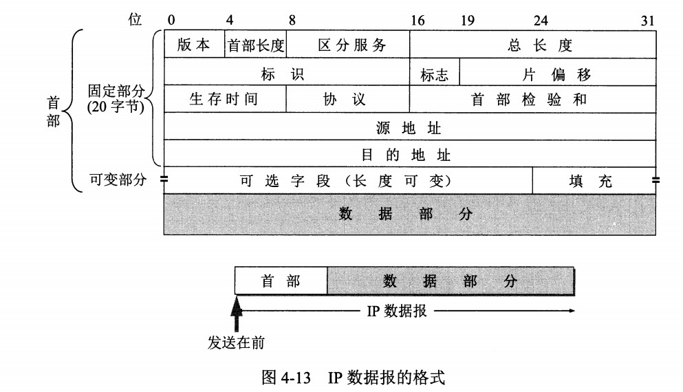
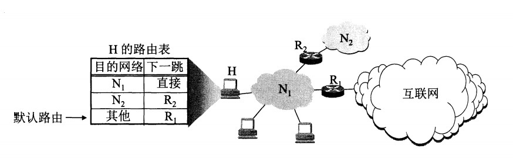
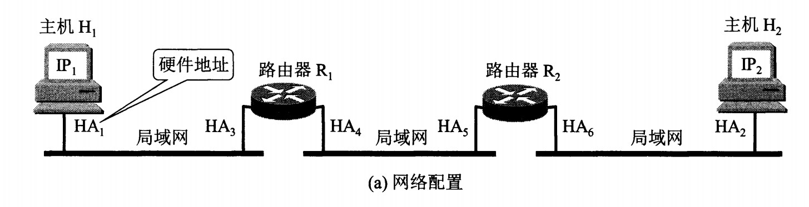
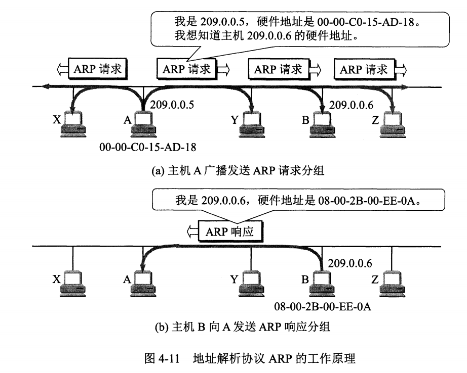
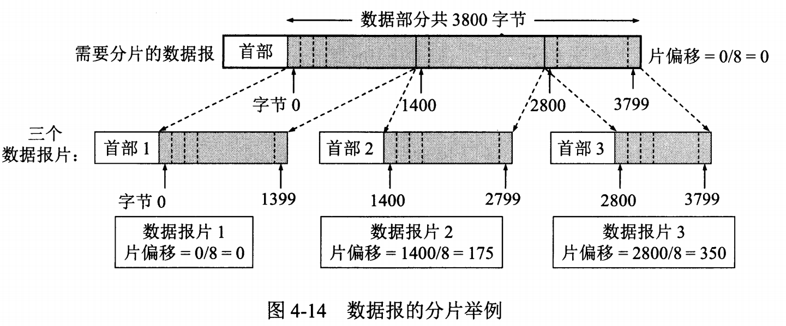
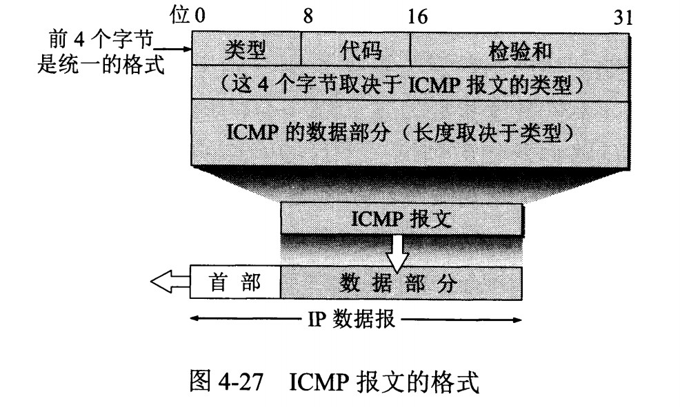
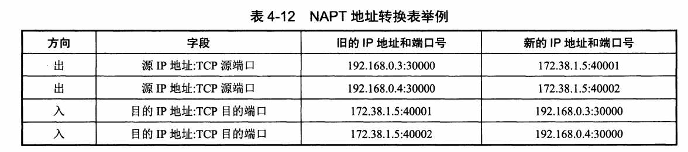
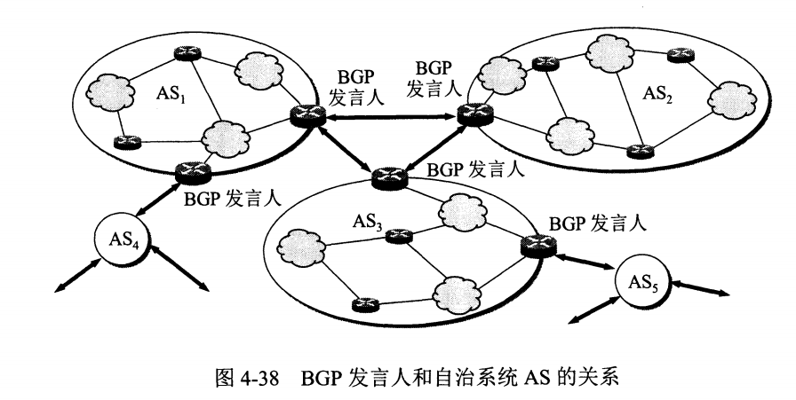

# 网络层：IP、路由与地址解析

一个分组从手机发到远端服务器，要经过本机网卡、几台交换机、多个路由器和多张不同的网络。
如果把 IP 地址理解成“设备编号”，排障时就会得到一连串误导：以为 ARP 要解析远端服务器的 MAC 地址，以为 ping 不通就等于主机离线，以为 NAT 能替代防火墙。

网络层要解决的核心问题是：**在任意形状、彼此异构的多段网络之上，给主机一套统一的地址，让分组可以被一段一段接力送到目的地**。
本文先划清 IP 的服务边界，再看首部中真正影响转发和排障的字段，然后依次解释前缀判断、路由表转发、ARP/NDP 地址解析、MTU 与分片、ICMP，最后落到 NAT、VPN 和路由选择协议。

<!-- GFM-TOC -->
* [IP 提供的服务边界](#ip-提供的服务边界)
* [IPv4 与 IPv6 首部只看关键字段](#ipv4-与-ipv6-首部只看关键字段)
* [地址、前缀与子网判断](#地址前缀与子网判断)
* [从路由表到逐跳转发](#从路由表到逐跳转发)
* [IPv4 ARP 与 IPv6 NDP](#ipv4-arp-与-ipv6-ndp)
* [MTU、分片与路径 MTU](#mtu分片与路径-mtu)
* [ICMP 是控制与诊断，不是“端口协议”](#icmp-是控制与诊断不是端口协议)
* [私有地址、NAT 与 VPN](#私有地址nat-与-vpn)
* [路由选择：RIP、OSPF 与 BGP 各解决哪一级问题](#路由选择ripospf-与-bgp-各解决哪一级问题)
* [常见误区](#常见误区)
* [参考资料](#参考资料)
* [一句话总结](#一句话总结)
<!-- GFM-TOC -->

## IP 提供的服务边界

互联网由无数张异构网络组成：以太网、Wi-Fi、蜂窝网络、光纤骨干。IP（Internet Protocol，网际协议）的设计取向是“核心保持简单，复杂度留给端系统”，由此得到三条基本性质：

- **无连接**：每个分组独立查找路由，发送前不需要在沿途路由器上建立连接状态；两条方向相反的分组可以走不同路径。
- **尽力而为（best-effort）**：路由器尽当前能力转发，队列满、校验失败、TTL 到期时都可以直接丢弃。
- **异构互联**：IP 之上可以承载各种链路技术，各种链路又能承载 IP，网络层因此看到一张“统一的网”。

这三条性质同时是服务承诺的边界。IP **不保证**分组一定送达、不保证不重复、不保证按序到达，也不提供时延上界或最小带宽。

> **关键认知：** “尽力而为”是 IP 服务契约的一部分，不是实现缺陷；分组丢失、重复、乱序之后的补偿要由使用它的上层机制决定，而不是由 IP 层负责。

因此端到端的可靠性是**按需叠加**的：需要可靠有序字节流的应用使用 TCP，容忍轻微丢包、追求低时延的应用使用 UDP 并自行处理，两者都由[传输层：UDP、TCP 与 QUIC](./04-传输层：UDP、TCP与QUIC.md)统一展开。
网络层本身只解决“把分组交给目的主机的 IP 层”这件事，进程到进程的复用、流量控制和拥塞控制都留给传输层。

与 IP 配套工作的还有一组网络层辅助协议：ARP 与 IPv6 NDP 负责把下一跳的 IP 地址映射成链路层地址，ICMP 负责报告转发过程中的异常和做诊断，组播的成员管理由 IGMP（IPv4）和 MLD（IPv6）承担。
它们不提供额外传输能力，却是理解“分组为什么到不了”的关键。

## IPv4 与 IPv6 首部只看关键字段

首部字段不需要逐位背诵，理解分组“从哪来、到哪去、能活多久、被谁处理”这几个问题，就已经抓住了排障所需的全部信息。

<div align="center">
  
</div>
<p align="center">图 1：IPv4 首部结构；固定部分 20 字节，总长度字段覆盖首部与数据部分。来源：谢希仁《计算机网络》教材插图（图 4-13），经上游 CS-Notes 迁移入本库。</p>

### IPv4 首部中真正影响排障的字段

- **版本与首部长度**：版本为 4；首部长度以 4 字节为单位，取值 5 表示 20 字节固定首部，最大 15 表示 60 字节（含选项）。
- **总长度**：首部加数据的总字节数，字段 16 位，因此 IPv4 数据报最大 65535 字节；路由器分片时它会随每个分片变小。
- **标识、标志与片偏移**：分片相关字段，片偏移以 8 字节为单位，详见 [MTU、分片与路径 MTU](#mtu分片与路径-mtu)。
- **生存时间（Time to Live，TTL）**：防止分组在环路中永久打转。名字里是“时间”，但现代实现按跳数处理：每经过一个路由器减 1，减到 0 就丢弃并回送 ICMP 超时报文。IPv6 直接把该字段更名为跳数限制（Hop Limit）。
- **协议（Protocol）**：指出数据部分应交给哪个上层协议，例如 1 是 ICMP、6 是 TCP、17 是 UDP；IPv6 用下一首部（Next Header）承担同样职责，附加值 58 表示 ICMPv6。
- **区分服务（Differentiated Services）**：原来的 ToS 字段现按 DiffServ 解释为 DSCP 与 ECN 标记（RFC 2474），用于流量分类与拥塞通知；是否启用、按什么策略处理取决于网络域，不能概括为“不使用”。
- **首部校验和**：只覆盖首部，不覆盖数据部分。

> **关键认知：** IPv4 首部校验和只覆盖首部：TTL 每跳变化后，路由器只需重算 20 字节左右的首部校验和，而不必遍历整个数据报；数据部分的完整性由上层校验（如 TCP/UDP 校验和）和链路层帧校验（FCS）分别负责。

下面用一个可运行的例子确认“只覆盖首部”和“每跳重算”两个结论。例中的报文是 `192.168.0.1` 发往 `192.168.0.199` 的 UDP 数据报首部。

```dart
// 前置条件：Dart 3.12.2；纯 Dart，只依赖 dart:core；校验和算法见 RFC 1071。

/// 16 位反码求和：按大端序两两成字相加，进位回卷到低位。
int onesComplementSum(List<int> data) {
  var sum = 0;
  for (var index = 0; index + 1 < data.length; index += 2) {
    sum += (data[index] << 8) | data[index + 1]; // 1. 取一个 16 位字。
    sum = (sum & 0xFFFF) + (sum >> 16); // 2. 高 16 位的进位回卷相加。
  }
  return sum;
}

/// IPv4 首部校验和：校验和字段先置 0；只覆盖首部，不覆盖数据部分。
int headerChecksum(List<int> header) => (~onesComplementSum(header)) & 0xFFFF;

void main() {
  // 例：192.168.0.1 发给 192.168.0.199 的 UDP 数据报首部（首部 20 字节）。
  final header = <int>[
    0x45, 0x00, 0x00, 0x73, // 版本 4、首部 20 字节、总长度 115
    0x00, 0x00, 0x40, 0x00, // 标识 0、不分片
    0x40, 0x11, 0x00, 0x00, // TTL 64、协议 17（UDP）、校验和待填
    0xC0, 0xA8, 0x00, 0x01, // 源地址 192.168.0.1
    0xC0, 0xA8, 0x00, 0xC7, // 目的地址 192.168.0.199
  ];
  final checksum = headerChecksum(header);
  print('首部校验和: 0x${checksum.toRadixString(16)}');

  header[10] = (checksum >> 8) & 0xFF; // 3. 把校验和写回首部第 11、12 字节。
  header[11] = checksum & 0xFF;
  if (checksum != 0xB861) throw StateError('与已知例题结果不一致');
  // 接收方把校验和字段一起求和，结果应为 0xFFFF，取反后为 0 表示通过。
  if (onesComplementSum(header) != 0xFFFF) throw StateError('验证求和不等于 0xFFFF');
  if (headerChecksum(header) != 0) throw StateError('自校验失败');

  final mutated = List<int>.of(header)..[8] = 0x3F; // 转发时 TTL 从 64 减到 63
  if (headerChecksum(mutated) == 0) throw StateError('首部变化后校验和不应为 0');
  print(
      'TTL 减 1 后校验和: 0x${headerChecksum(mutated).toRadixString(16).padLeft(4, '0')}');
  print('全部检查通过');
}
```

<!-- verify: .work/verify/B09/lib/network/ipv4_checksum.dart -->

```text
首部校验和: 0xb861
TTL 减 1 后校验和: 0x0100
全部检查通过
```

校验和结果 `0xb861` 与公开例题一致；填入校验和后整段首部的反码和为 `0xFFFF`，再取反得 0，说明校验通过。
变更 TTL 后校验和随之改变，这正是路由器每跳重算的逻辑，而与数据部分无关。

### IPv6 重新设计了什么

IPv6 保持“无连接、尽力而为”的服务模型，但把首部固定为 40 字节：版本、流量类别（Traffic Class）、流标签（Flow Label）、载荷长度、下一首部、跳数限制，以及 128 位的源地址和目的地址。
可选项从基本首部中移出，改用可以串联的扩展首部（Extension Header），由下一首部字段逐个指向。

两个容易混淆的改动需要单独强调：

- **取消了首部校验和**。链路层已有 FCS，上层已有校验和；在 IPv6 中 UDP 校验和通常是强制的，只有特定隧道场景经专门规范允许使用零校验和。删掉该字段后，路由器每跳不必再重算校验和，转发路径更简单。
- **分片方式改变了**。IPv4 允许沿途路由器分片，IPv6 只允许源节点分片，路由器遇到超过出口 MTU 的分组时回送 ICMPv6“报文太大”（Packet Too Big）。

> **时效信息（核查日期：2026-09）：** IPv6 基本规范为 RFC 8200，已进入 Internet Standard（STD 86），替代 RFC 2460；路径 MTU 发现规范为 RFC 8201（STD 87）。来源见文末 R1、R10。
>
> **历史机制（已移除）：** IPv6 早期规范曾在“报文太大且报告的 MTU 小于 1280”时要求发送方把报文包成一个单分片（原子分片，atomic fragment）。RFC 6946 讨论了这类分片带来的安全问题，RFC 8021 论证了生成行为有害，RFC 8200 已移除这一要求：分片创建过程不再生成整报文分片，收到这种分片时按已重组报文处理。[核查日期：2026-09]

> **面试高频：** IPv4 与 IPv6 的首部、分片差异有哪些？
> **答题脉络：** 首部长度与字段组织（定长 40 字节、扩展首部、无校验和）→ 分片执行者（路由器 vs 源节点）→ 差错反馈（ICMPv4“需要分片” vs ICMPv6 Packet Too Big）→ 地址长度与最小 MTU（IPv4 接收下限 576，IPv6 最小链路 MTU 1280）。
> **追问方向：** IPv6 是否完全不允许分片；为什么去掉首部校验和；扩展首部的顺序；双栈与隧道的首部开销。

## 地址、前缀与子网判断

### 从分类编址到 CIDR

早期 IPv4 用 A/B/C 类固定划分网络号与主机号，地址的“类别”由首字节决定。这种方案在地址浪费和路由表膨胀上代价太大，已经被无类别编址取代。

> **历史上常见：** 分类编址是 1980—1990 年代早期的分配与识别方式；RFC 4632（BCP 122）确立的无类别域间路由（Classless Inter-Domain Routing，CIDR）成为现行做法后，一个地址属于哪一“类”不再决定它的网络号，分类只在教材语境和历史设备行为中出现。[核查日期：2026-09]

CIDR 用“网络前缀 + 前缀长度”描述一个地址块，写作 `192.0.2.0/24`：前 24 位是网络前缀，后 8 位是主机号。
掩码是把前缀部分置 1、主机部分置 0 得到的 32 位值，`/24` 对应 `255.255.255.0`。
前缀长度相同的连续地址块可以在路由表中聚合为一条表项（路由聚合），这是控制互联网路由表规模的基本手段。

### 本机如何决定“本地交付还是交给网关”

主机配置了 IP 地址、前缀长度和默认网关。发送分组前，它把目的地址与前缀掩码做与运算，判断目的主机是否与自己处于同一前缀：

- **同一前缀**：目的主机在同一链路上，直接交付，只需解析目的主机自己的链路层地址。
- **不同前缀**：目的主机在远端，把分组交给默认网关（第一跳路由器），由它继续转发。

`192.0.2.10/24` 与 `192.0.2.130/24` 落在同一子网，`192.0.2.10/26` 与 `192.0.2.130/26` 则不同（下面例题会算出原因）：同一个 `/26` 前缀是 `192.0.2.128/26`，不包含 `.10`。

> **关键认知：** 前缀在主机侧决定“本地交付还是交给网关”，在路由器侧决定“查表命中哪条路由”——同一个概念在两个环节承担不同职责，不能把主机的子网判断和路由器的转发决策混为一谈。

IPv6 地址为 128 位，通常用于标识接口而不是抽象的“整台主机”，写成 8 组 16 位十六进制数；一组或多组连续的 0 可以用 `::` 压缩，但只能出现一次。
主机接口通常把前 64 位作为子网前缀，后 64 位作为接口标识；`/64` 也因此成为最常见的子网边界。

### IPv4 前缀例题

求 `192.0.2.130/26` 的网络地址、广播地址和可用主机范围。

- `/26` 掩码最后 8 位是 `1100 0000`，即 `255.255.255.192`；
- `130` 的二进制是 `1000 0010`，与前两位 `11` 相与后剩下 `1000 0000`，即 `128`，所以网络地址是 `192.0.2.128`；
- 广播地址是网络地址的主机位全置 1：`192.0.2.191`；
- 可用主机范围是 `192.0.2.129` 到 `192.0.2.190`，共 `2^6 - 2 = 62` 个。

下面的代码把判断逻辑写清楚，并顺带验证同一对地址在 `/24` 下同网段、在 `/26` 下不同网段。

```dart
// 前置条件：Dart 3.12.2；纯 Dart，只依赖 dart:core。

// 把点分十进制文本解析成 32 位地址值。
int parseIpv4(String text) {
  final parts = text.split('.');
  if (parts.length != 4) throw FormatException('IPv4 必须有 4 组: $text');
  var value = 0;
  for (final part in parts) {
    final octet = int.tryParse(part);
    if (octet == null || octet < 0 || octet > 255) {
      throw FormatException('非法八位组: $part');
    }
    value = (value << 8) | octet; // 1. 逐个八位组左移拼接。
  }
  return value;
}

String formatIpv4(int value) {
  final address = value.toUnsigned(32);
  return '${(address >> 24) & 0xFF}.${(address >> 16) & 0xFF}.'
      '${(address >> 8) & 0xFF}.${address & 0xFF}';
}

// 前缀长度对应的掩码：/0 得到 0，/32 得到 0xFFFFFFFF。
int prefixMask(int prefixLength) {
  if (prefixLength < 0 || prefixLength > 32) {
    throw RangeError.range(prefixLength, 0, 32, 'prefixLength');
  }
  // 2. 高 prefixLength 位置 1，其余位为 0。
  if (prefixLength == 0) return 0;
  return ((1 << prefixLength) - 1) << (32 - prefixLength);
}

// 判断两个地址是否落在同一个 prefixLength 位前缀内。
bool isSameSubnet(String left, String right, int prefixLength) {
  final mask = prefixMask(prefixLength);
  // 3. 掩码后比较网络部分。
  return (parseIpv4(left) & mask) == (parseIpv4(right) & mask);
}

void main() {
  // 例题：192.0.2.130/26 的网络地址、广播地址与可用主机范围。
  final network = parseIpv4('192.0.2.130') & prefixMask(26);
  final broadcast = network | (0xFFFFFFFF ^ prefixMask(26));
  print('网络地址: ${formatIpv4(network)}');
  print('广播地址: ${formatIpv4(broadcast)}');
  print('可用主机范围: ${formatIpv4(network + 1)} ~ ${formatIpv4(broadcast - 1)}');

  // 同子网判断决定本地交付还是交给默认网关。
  for (final prefix in [24, 26]) {
    print('192.0.2.10 与 192.0.2.130 在同一 /$prefix: '
        '${isSameSubnet('192.0.2.10', '192.0.2.130', prefix)}');
  }

  if (formatIpv4(network) != '192.0.2.128') throw StateError('网络地址错');
  if (formatIpv4(broadcast) != '192.0.2.191') throw StateError('广播地址错');
  if (!isSameSubnet('192.0.2.10', '192.0.2.130', 24)) throw StateError('应同网段');
  if (isSameSubnet('192.0.2.10', '192.0.2.130', 26)) throw StateError('应跨网段');
  print('全部检查通过');
}
```

<!-- verify: .work/verify/B09/lib/network/ipv4_cidr.dart -->

```text
网络地址: 192.0.2.128
广播地址: 192.0.2.191
可用主机范围: 192.0.2.129 ~ 192.0.2.190
192.0.2.10 与 192.0.2.130 在同一 /24: true
192.0.2.10 与 192.0.2.130 在同一 /26: false
全部检查通过
```

### IPv6 前缀例题

`2001:db8:1::10/64` 与哪些地址同前缀？把 `::` 展开后比较前 4 组即可，前 4 组相同就是同一子网。

- 与 `2001:db8:1:0:1234:5678:9abc:def0`：前 4 组都是 `2001:0db8:0001:0000`，同一 `/64`；
- 与 `2001:db8:2::10`：第 3 组 `0001` 与 `0002` 不同，不同 `/64`；
- 与 `2001:db8:1:ffff::`：前 3 组相同，因此同一 `/48`，但后 4 组不同，不属于同一 `/64`。

（下列代码块为文件上半部分，抽取范围：`ipv6_prefix.dart` 第 1—32 行。）

```dart
// 前置条件：Dart 3.12.2；纯 Dart，只依赖 dart:core。
// 教学简化：只支持 16 的整数倍前缀长度，不支持内嵌 IPv4 写法与 % 区域标识。

// 把 IPv6 文本解析成 8 个 16 位组。
List<int> parseIpv6(String text) {
  if (text.contains('%')) throw FormatException('不支持区域标识: $text');
  final halves = text.split('::');
  if (halves.length > 2) throw FormatException(':: 只能出现一次: $text');

  List<int> parseGroups(String part) {
    if (part.isEmpty) return const [];
    return part.split(':').map((group) {
      if (group.isEmpty || group.length > 4) {
        throw FormatException('非法 16 位组: $group');
      }
      final value = int.tryParse(group, radix: 16);
      if (value == null) throw FormatException('非法十六进制: $group');
      return value;
    }).toList();
  }

  final head = parseGroups(halves[0]);
  if (halves.length == 1) {
    if (head.length != 8) throw FormatException('未压缩地址必须含 8 组: $text');
    return head;
  }
  final tail = parseGroups(halves[1]);
  if (head.length + tail.length > 7) throw FormatException(':: 至少压缩一组: $text');
  // 1. 用 0 补齐 :: 省略的组，凑满 8 组。
  final zeros = List<int>.filled(8 - head.length - tail.length, 0);
  return [...head, ...zeros, ...tail];
}
```

<!-- verify: .work/verify/B09/lib/network/ipv6_prefix.dart -->

下面是比较函数与例题验证部分（抽取范围：同一文件第 34—71 行）。

```dart
// 判断两个地址是否落在同一个前缀内；只支持前缀长度是 16 的整数倍。
bool isSameIpv6Prefix(String left, String right, int prefixLength) {
  if (prefixLength < 0 || prefixLength > 128 || prefixLength % 16 != 0) {
    throw ArgumentError('教学简化：只支持 16 的整数倍前缀: /$prefixLength');
  }
  final a = parseIpv6(left);
  final b = parseIpv6(right);
  // 2. 逐个比较前缀覆盖的完整 16 位组。
  for (var index = 0; index < prefixLength ~/ 16; index++) {
    if (a[index] != b[index]) return false;
  }
  return true;
}

void main() {
  // 例题：2001:db8:1::10/64 与哪些地址同前缀？
  const host = '2001:db8:1::10';
  const same64 = '2001:db8:1:0:1234:5678:9abc:def0';
  print('::1 展开: ${parseIpv6('::1')}');
  print('与 $same64 同一 /64: ${isSameIpv6Prefix(host, same64, 64)}');
  print('与 2001:db8:2::10 同一 /64: '
      '${isSameIpv6Prefix(host, '2001:db8:2::10', 64)}');
  print('与 2001:db8:1:ffff:: 同一 /48: '
      '${isSameIpv6Prefix(host, '2001:db8:1:ffff::', 48)}');

  if (parseIpv6('::1').last != 1) throw StateError('::1 解析错误');
  if (!isSameIpv6Prefix(host, same64, 64)) throw StateError('同一 /64 判断错');
  if (isSameIpv6Prefix(host, '2001:db8:2::10', 64)) {
    throw StateError('跨 /64 判断错');
  }
  if (!isSameIpv6Prefix(host, '2001:db8:1:ffff::', 48)) {
    throw StateError('跨 /48 判断错');
  }
  if (isSameIpv6Prefix(host, '2001:db8:1:ffff::', 64)) {
    throw StateError('跨 /64 判断错');
  }
  print('全部检查通过');
}
```

<!-- verify: .work/verify/B09/lib/network/ipv6_prefix.dart -->

```text
::1 展开: [0, 0, 0, 0, 0, 0, 0, 1]
与 2001:db8:1:0:1234:5678:9abc:def0 同一 /64: true
与 2001:db8:2::10 同一 /64: false
与 2001:db8:1:ffff:: 同一 /48: true
全部检查通过
```

### 只用于特定用途的地址块

日常排障中最常遇到的地址块如下。文档保留地址（`192.0.2.0/24`、`198.51.100.0/24`、`203.0.113.0/24`、`2001:db8::/32`）专门用于文档与示例，本文例子都来自这些块。

| 地址块 | 用途 | 说明 |
|---|---|---|
| `10.0.0.0/8`、`172.16.0.0/12`、`192.168.0.0/16` | 私有地址 | 只在内部网络使用，不被公网路由，RFC 1918 |
| `100.64.0.0/10` | 共享地址 | 运营商级 NAT（CGNAT）场景，RFC 6598 |
| `169.254.0.0/16` | 链路本地 | 未取到地址时的自动配置范围，RFC 3927 |
| `127.0.0.0/8` | 环回 | 本机内部通信，不出网卡 |
| `fc00::/7` | 唯一本地地址 | IPv6 私有地址，RFC 4193 |
| `fe80::/10` | IPv6 链路本地 | 每个接口自动产生，只在链路内有效 |
| `ff00::/8` | IPv6 组播 | IPv6 没有广播地址，用组播承担对应功能 |

> **面试高频：** 给定地址和前缀，如何手算网络地址、广播地址和可用主机数？路由器如何选择多条匹配路由？
> **答题脉络：** 掩码与二进制边界 → 网络地址与广播地址 → 主机数与边界情况（RFC 3021 的 `/31` 点对点约定、`/32` 主机路由）→ 路由侧用最长前缀匹配，而不是“第一条命中”或“任意命中”。
> **追问方向：** `192.0.2.130/26` 划出几个子网；IPv6 为什么没有广播；默认路由 `0.0.0.0/0` 和 `::/0` 的含义。

## 从路由表到逐跳转发

### 控制平面与数据平面

路由器内部有两个时间尺度完全不同的活动：

- **控制平面**：运行 RIP、OSPF、BGP 等路由协议，与邻居交换信息，计算路由表（Routing Information Base，RIB）。它只每隔一段时间（如几十秒）更新一次，关心的是可达性和策略。
- **数据平面**：对每个经过的分组做查表与转发。它必须在线速下运行，使用由路由表安装出来的转发表（Forwarding Information Base，FIB）。

<div align="center">
  
</div>
<p align="center">图 2：主机路由表与默认路由；目的网络不同的分组交给不同下一跳，未命中的交给默认网关。来源：谢希仁《计算机网络》教材插图，经上游 CS-Notes 迁移入本库。</p>

一台路由器的转发决策可以归纳为一条流水线：

1. 取出目的 IP 地址，在 FIB 中做**最长前缀匹配**：在所有覆盖该地址的表项里选前缀最长的一条；没有命中的表项则使用默认路由 `0.0.0.0/0`（IPv6 为 `::/0`）。
2. 若表项指向直连网络，解析目的主机的链路层地址并直接交付；否则得到下一跳 IP 与出接口。
3. 把 TTL（IPv6 为 Hop Limit）减 1；减到 0 就丢弃，并向源地址回送 ICMP 超时报文。
4. IPv4 需重算首部校验和，然后剥掉旧链路层首尾，按出接口重新封装成帧，发给下一跳。

> **关键认知：** 路由器只对“下一跳”负责，不对整条路径负责；逐跳决策加上路由协议在控制平面的状态同步，才让互联网在没有中心调度的情况下可扩展地工作。

### 最长前缀匹配示例

下面的例子用 `192.0.2.0/24`、其中更具体的 `192.0.2.128/26` 和主机路由 `192.0.2.7/32` 来说明“命中多条时选最长”。

```dart
// 前置条件：Dart 3.12.2；纯 Dart；同目录 ipv4_cidr.dart 提供地址解析与前缀掩码。

import 'ipv4_cidr.dart';

/// 一条路由表项：目的前缀、前缀长度与下一跳。
class Route {
  const Route(this.prefix, this.prefixLength, this.nextHop);

  final String prefix;
  final int prefixLength;
  final String nextHop;
}

/// 最长前缀匹配：命中多条表项时取前缀最长的一条，其余忽略。
Route? longestPrefixMatch(List<Route> table, String destination) {
  final address = parseIpv4(destination);
  Route? best;
  for (final route in table) {
    // 1. 用该表项的前缀长度做掩码比较，判断它是否覆盖目的地址。
    final mask = prefixMask(route.prefixLength);
    if ((address & mask) != (parseIpv4(route.prefix) & mask)) continue;
    // 2. 命中多条时保留前缀最长的一条。
    if (best == null || route.prefixLength > best.prefixLength) best = route;
  }
  return best;
}

void main() {
  const table = [
    Route('192.0.2.0', 24, '203.0.113.1'), // 整段 /24 走这一跳
    Route('192.0.2.128', 26, '203.0.113.9'), // 其中 /26 走另一跳
    Route('192.0.2.7', 32, '203.0.113.5'), // 主机路由
    Route('0.0.0.0', 0, '198.51.100.254'), // 默认路由
  ];

  for (final destination in [
    '192.0.2.130', // 同时命中 /24 与 /26
    '192.0.2.7', // 主机路由最长
    '192.0.2.200', // 只落在 /24 里
    '198.51.100.9', // 只有默认路由覆盖
  ]) {
    final route = longestPrefixMatch(table, destination);
    print('$destination -> ${route?.nextHop} (/${route?.prefixLength})');
  }

  const expected = {
    '192.0.2.130': '203.0.113.9',
    '192.0.2.7': '203.0.113.5',
    '192.0.2.200': '203.0.113.1',
    '198.51.100.9': '198.51.100.254',
  };
  for (final entry in expected.entries) {
    if (longestPrefixMatch(table, entry.key)?.nextHop != entry.value) {
      throw StateError('${entry.key} 的匹配结果错误');
    }
  }
  print('全部检查通过');
}
```

<!-- verify: .work/verify/B09/lib/network/longest_prefix_match.dart -->

```text
192.0.2.130 -> 203.0.113.9 (/26)
192.0.2.7 -> 203.0.113.5 (/32)
192.0.2.200 -> 203.0.113.1 (/24)
198.51.100.9 -> 198.51.100.254 (/0)
全部检查通过
```

真实系统表项还包含度量值、出接口和策略信息，展示格式与字段名不承诺一致；但“覆盖 + 最长优先”这层语义是共同的。

> **面试高频：** 路由器转发分组与路由协议计算路由，是同一件事吗？
> **答题脉络：** 控制平面计算 RIB → 安装为数据平面 FIB → 转发查 FIB 而不跑协议 → 收敛期间旧 FIB 仍在使用。
> **追问方向：** RIB/FIB 差异；ECMP 如何选择；路由收敛窗口内丢包；黑洞路由与默认路由的取舍。

## IPv4 ARP 与 IPv6 NDP

### 为什么 IP 之外还需要链路层地址

IP 地址标识主机在网络中的位置，作用范围是整条端到端路径；链路层地址（如以太网的 MAC 地址）只在一段链路内有意义，且不同链路技术使用不同格式和长度。
一个帧要从本机送到同链路的下一个节点，就必须填上那个节点的链路层地址。

<div align="center">
  
</div>
<p align="center">图 3：IP 地址在整条路径上保持不变，硬件地址随链路改变。来源：谢希仁《计算机网络》教材插图，经上游 CS-Notes 迁移入本库。</p>

> **关键认知：** 一台主机只会解析**同链路下一跳**的链路层地址：目的在本网段就解析目的主机，目的在远端就解析默认网关。远端服务器的 MAC 地址永远不会出现在本机 ARP 表里，因为它和本机不在同一条链路上。

### ARP 的工作流程

IPv4 使用地址解析协议（Address Resolution Protocol，ARP）完成“下一跳 IP → 硬件地址”的映射：

1. 先查本地 ARP 缓存，命中则直接使用；
2. 未命中就广播一个 ARP 请求：包含发送方 IP 和硬件地址、目标 IP，目标硬件地址字段留空；
3. 链路上所有主机都会收到广播，只有目标 IP 匹配的主机回应一个单播 ARP 应答，报告自己的硬件地址；
4. 请求方把映射写入缓存，后续通信复用；缓存条目老化后重新解析。

ARP 报文直接封装在以太网帧中（以太类型 `0x0806`），没有 IP 首部。因此“ARP 属于网络层还是链路层”没有唯一答案：它用网络层地址工作，但按链路层方式承载，跨越了两层的边界。

<div align="center">
  
</div>
<p align="center">图 4：ARP 请求广播、应答单播（图中为接收方视角示例）。来源：谢希仁《计算机网络》教材插图，经上游 CS-Notes 迁移入本库。</p>

还有一个常见变体：免费 ARP（gratuitous ARP），主机主动广播自己的映射，用于检测地址冲突或通知地址变更；IPv4 地址冲突检测的规范见 RFC 5227。

### NDP 不只是“IPv6 版 ARP”

IPv6 把地址解析、路由器发现、重定向和可达性检测统一放进邻居发现协议（Neighbor Discovery Protocol，NDP），它工作在 ICMPv6 之上（下一首部值 58），消息类型包括路由器请求/通告（RS/RA，133/134）和邻居请求/通告（NS/NA，135/136）以及重定向（137）。

与 ARP 的关键差异：

- **用组播替代广播**：NS 发往目标的请求节点组播地址（`ff02::1:ffXX:XXXX`），通常只会打搅真正的目标，而不是整条链路；
- **带上路由器发现与地址配置**：RA 携带前缀、路由寿命与链路参数，配合无状态地址自动配置（SLAAC）使用户无需 DHCP 也能获得地址（RFC 4862）；地址配置前的重复地址检测（DAD）也用 NS/NA 完成；
- **用跳数限制 255 防链外伪造**：收到跳数限制不是 255 的 NDP 报文时直接丢弃，链外攻击者无法伪造邻居通告（RFC 4861）。

不过，NDP 与 ARP 一样**默认没有内建认证**：收到通告就更新邻居缓存，同样存在欺骗与投毒风险。标准中定义了用密码学方式保护 NDP 的 SEND（RFC 3971），但需要额外的信任基础设施；实际网络中更常见的缓解手段是第一跳安全、RA Guard 之类的交换机/网络设备策略。

### 欺骗与缓解

ARP/NDP 欺骗的本质是“信任未经认证的映射通告”。防御思路分三类：静态绑定关键网关的映射；在交换机上启用动态 ARP 检测（DAI）、端口安全、RA Guard 等第一跳策略；用 VLAN 或网络分段缩小攻击面。本节只讨论机制层面的边界，不展开攻击实现。

> **面试高频：** 为什么有了 IP 地址还需要 MAC 地址？ARP 请求会到达远端服务器吗？
> **答题脉络：** IP 是端到端的逻辑地址、链路层地址只在链路内有意义 → 每段链路都需要下一跳硬件地址 → 主机只解析同链路下一跳 → 远端服务器 MAC 不进入本机 ARP 表。
> **追问方向：** ARP 跨网段如何工作（代理 ARP）；ARP 欺骗为何难以根治；NDP 与 ARP 的差异。

## MTU、分片与路径 MTU

### 为什么报文不能无限大

每条链路都有一个最大传输单元（Maximum Transmission Unit，MTU）：以太网的标准 MTU 是 1500 字节，隧道与拨号链路可能更小。
超过出口 MTU 的数据报要么被分片，要么由发送方缩小，要么被丢弃并回报错误。

### IPv4 分片：路由器可以拆包

IPv4 允许沿途路由器把过大的数据报分成多个分片，字段对应关系是：同一数据报的所有分片共享**标识**；**标志**中的 DF（Don't Fragment）表示禁止分片，MF（More Fragments）表示后面还有分片；**片偏移**以 8 字节为单位记录该分片在原始数据报中的位置。

<div align="center">
  
</div>
<p align="center">图 5：数据报分片与片偏移（以 8 字节为单位）。来源：谢希仁《计算机网络》教材插图（图 4-14），经上游 CS-Notes 迁移入本库。</p>

图中 3800 字节数据被拆成 1400、1400、1000 三个分片：片偏移分别是 0、`1400/8=175`、`2800/8=350`。
分片只有在**最终目的主机**才重组；任何一片丢失，整个数据报都会被丢弃，而 IP 层不重传，重传要等上层超时。

> **关键认知：** 分片是“最后手段”而不是常态：路由器分片把重组成本推给端系统，还会放大丢包概率；RFC 8900（BCP 230）因此建议应用避免依赖 IP 分片。

### IPv6 分片：只有源节点能拆

IPv6 取消了路由器分片：源节点使用扩展首部中的分片首部（Fragment Header，下一首部值 44）自行分片；沿途路由器遇到超出 MTU 的分组时，丢弃并回送 ICMPv6“报文太大”，MTU 字段告诉源节点下一次该用多大。

> **关键认知：** “IPv6 不允许分片”是常见误读；准确说法是**路由器不再分片**，源节点仍可分片，只是路径 MTU 发现（PMTUD）和避免依赖分片是更被推荐的路线。IPv6 要求链路最小 MTU 为 1280 字节，任何链路的实现都必须能传递 1280 字节的报文。

### 路径 MTU 发现与黑洞

路径 MTU（Path MTU，PMTU）是路径上所有链路 MTU 的最小值。发送方从本接口 MTU 出发，把 DF 位置 1 发送（IPv6 天然不做路由器分片），收到“需要分片/报文太大”的 ICMP 后调小重发，逐步收敛到真实 PMTU，这就是路径 MTU 发现。

现实中的一个经典故障是 **PMTUD 黑洞**：路径上的防火墙或路由器过滤了全部 ICMP，发送方永远收不到“太大”的通知，于是持续丢弃大包。表现是：小报文（握手、DNS、短页面）正常，大报文（文件传输、大响应）卡死或超时。

排障时可以利用分片与大小探测缩小范围（具体命令选项因平台而异）：

```text
# 观察点，不是万能修法：
1. 用带 DF 的 ping 逐步调大报文，找到“刚好不通”的临界大小。
2. 用 traceroute/tracert 看路径是否包含隧道、VPN 或 MTU 更小的链路。
3. 检查 ICMP 是否被过滤；若不能依赖 ICMP，改用 PLPMTUD（RFC 8899）探测。
4. 对隧道场景调低隧道接口 MTU，或在网关做 TCP MSS 钳制。
```

`ping` 的 DF 选项、`traceroute` 的输出格式和可用的探测方式在不同平台上不同，示例只陈述机制，不把某一平台命令当作通用答案。

> **面试高频：** 网页能打开但大文件传输卡死，可能是什么问题？
> **答题脉络：** 小包通过、大包失败 → 怀疑 MTU/PMTUD 黑洞 → 路径中有小 MTU 链路或 ICMP 被过滤 → 验证（DF 探测、隧道检查）→ 缓解（PLPMTUD、MSS 钳制、调 MTU）。
> **追问方向：** IPv4 的“需要分片”与 IPv6 的 Packet Too Big；隧道为何额外消耗首部；为什么中间设备过滤 ICMP 会破坏 PMTUD。

## ICMP 是控制与诊断，不是“端口协议”

ICMP（Internet Control Message Protocol，网际控制报文协议）是 IP 的伴随协议：IPv4 中由 IP 首部协议号为 1 承载，IPv6 中由下一首部值 58 承载。它没有端口号，也不是传输层协议。

<div align="center">
  
</div>
<p align="center">图 6：ICMP 报文封装在 IP 数据报中；IPv6 的 ICMPv6 由 IPv6 的下一首部承载。来源：谢希仁《计算机网络》教材插图（图 4-27），经上游 CS-Notes 迁移入本库。</p>

它承担两类任务：**差错报告**（如目的不可达、超时、参数问题）和**诊断/控制查询**（如回显请求与回显应答），IPv6 中还包括邻居发现和组播监听发现等功能。

常用的报文类型可以记成两组：

- **IPv4**：终点不可达（类型 3）、时间超过（11）、参数问题（12）、重定向（5）；回显请求/应答（8/0）。
- **IPv6**：目的地不可达（1）、报文太大（2）、时间超过（3）、参数问题（4）；回显请求/应答（128/129）；以及 NDP 的 133—137。

### ping：链路可达性的探针

`ping` 发送 ICMP 回显请求，等待回显应答，用往返时间（RTT）和成功次数估算时延与丢包。它是一个“网络层可达 + ICMP 被允许”的双重测试：目标存在但 ICMP 被过滤或限速时，同样会没有回应。

> **关键认知：** ping 不通不等于主机离线；它只说明没有收到 ICMP 回显应答。RFC 1812 允许路由器提供“静默忽略所有回显请求”的配置选项（默认应允许应答），防火墙出于策略过滤 ICMP 也很常见，因此判断服务可用性要靠传输层/应用层探测。

### traceroute：用 TTL 递增逐跳探测

`traceroute`（Windows 上为 `tracert`）利用同一条转发规则：发送 TTL 从 1 开始递增的探测报文，第 n 跳路由器把 TTL 减到 0 后回送 ICMP 超时报文，源端据此得到每一跳的地址和往返时间；探测报文到达目的端后，再用目的端的回应确认结束。

平台差异集中在**探测报文类型**上：

- Windows `tracert` 用 ICMP 回显请求作为探测报文，依赖中间路由器的 ICMP 超时报文；
- 经典 Unix `traceroute` 默认用高端口 UDP 数据报（默认起始端口 33434）探测，等 ICMP 超时报文，到达目的端后依赖“端口不可达”结束；多数实现也支持 `-I`（改用 ICMP）或 `-T`（改用 TCP）等选项；
- IPv6 场景同样依靠 ICMPv6 的时间超过与端口不可达报文；探测类型由实现的默认值或选项决定，命令与可用选项因发行版而异。

两者共同的细节是：路径上某些路由器可能配置为不回送 ICMP（输出中出现 `*`），或路径因负载均衡而变化（同一目标的不同探测走不同路径），所以 traceroute 输出是“探测当时的视图”，不是确定的路由拓扑。

> **面试高频：** ping 和 traceroute 的原理是什么？为什么 Windows 和 Unix 的 traceroute 探测报文可能不同？
> **答题脉络：** ICMP 回显请求/应答 → TTL 递减触发超时报文 → 逐跳拼路径 → 平台差异在探测报文类型（ICMP Echo vs UDP）与结束条件（回显应答 vs 端口不可达）。
> **追问方向：** 输出中的 `*` 代表什么；负载均衡下路径为何变化；禁 ping 环境下怎么确认主机在线。

## 私有地址、NAT 与 VPN

### 私有地址的动机

公网 IPv4 地址是有限资源。内部网络的很多主机并不需要被互联网直接访问，用 RFC 1918 定义的私有地址（`10/8`、`172.16/12`、`192.168/16`）编号既节省公网地址，也让内部编号规划自由。代价是：私有地址不能被公网路由，内网主机要访问互联网（或反向被访问）时需要转换或隧道。

### NAT 与 NAPT

网络地址转换（Network Address Translation，NAT）在数据报经过转换设备时改写地址。用端口号辅助的传统形式称为 NAPT（也常叫 PAT 或 NAT 重载）：多个内网主机的连接共用同一个公网地址，用不同的源端口区分。

<div align="center">
  
</div>
<p align="center">图 7：NAPT 转换表示例：同一公网地址的不同端口映射到不同内网主机。来源：谢希仁《计算机网络》教材插图（表 4-12），经上游 CS-Notes 迁移入本库。</p>

常见的 NAPT 是**状态化**的：出站连接先创建映射，回包按映射改写回去；也存在按规则直接改写地址的无状态转换，不能把所有 NAT 都等同于会话表。入站连接通常需要预先配置端口映射、借助中继，或利用打洞技术（STUN/TURN/ICE 体系，见 [R29]）建立。运营商在接入侧再叠加一层 NAT，就形成运营商级 NAT（CGNAT），共享地址 `100.64.0.0/10` 常用于此场景。IPv4 与 IPv6 并存的过渡期还有 NAT64/DNS64 这样的翻译机制（RFC 6146、RFC 6147），让 IPv6-only 客户端访问 IPv4 服务。

NAT 的代价集中在“打破了端到端的透明性”：

- 应用内嵌 IP 地址（如 SIP、FTP 主动模式）可能失效，需要 ALG 或改用其他模式；
- 端到端连接不再对称，P2P、VoIP、游戏联机需要穿透机制；
- 端口资源、映射表容量、会话老化时间都会成为规模瓶颈；
- 日志分散在转换设备上，溯源更复杂。

> **关键认知：** NAT 降低入站流量的可达性，是“没有映射就没有入口”的副作用，不等于防火墙：它不做策略判断、不审计内到外流量、也不阻止入站映射建立后的攻击。需要访问控制和入侵防护时应使用真正的防火墙，安全边界不能靠 NAT 承担。

### VPN：用隧道在公网上构造逻辑网络

虚拟专用网（Virtual Private Network，VPN）在公共网络上建立一条逻辑隧道：隧道入口把内层数据报（可能是私有地址）加密封装，再套上新的外层 IP 首部发送；隧道出口拆掉外层，解密还原内层数据报。

```text
内层：| 源 IP 10.1.0.1 | 目的 IP 10.2.0.3 | 传输层/数据 |
               ↓ 隧道入口加密并封装
外层：| 外层首部：隧道入口公网地址 -> 隧道出口公网地址 | 加密后的内层数据报 |
```

沿途路由器只看得到外层地址，把数据当作普通 IP 载荷转发；两端因此像处于同一个逻辑网络。VPN 可以是站点到站点（两个固定网关之间），也可以是远程接入（单台设备拨入）。封装与加密的具体实现包括 IPsec（RFC 4301）、WireGuard、基于 TLS 的方案等；加密认证的强度、密钥协商与攻击面由各自的协议决定，参见 [HTTPS 与 TLS](./08-HTTPS与TLS.md) 与安全板块的讨论，本文只保留“隧道改变可见范围”的网络层视角。

> **关键认知：** NAT 改写地址，VPN 封装数据报，两者都会让“源/目的 IP 端到端不变”的教学模型出现例外。遇到这两类设备时，必须先确认看的是内层还是外层地址，再谈转发与排障。

> **面试高频：** NAT 带来了什么收益和代价？NAT 能当防火墙用吗？
> **答题脉络：** 收益（节省地址、内部编号自由、入站默认不可达）→ 代价（端到端透明性、应用兼容、穿透、端口资源）→ 安全边界（状态映射非策略、无审计）→ 结论：安全职责交给防火墙与认证加密。
> **追问方向：** NAT 穿透（STUN/TURN/ICE）；CGNAT 与双重 NAT；NAT64/DNS64 的过渡作用；双栈环境下 NAT 是否需要。

## 路由选择：RIP、OSPF 与 BGP 各解决哪一级问题

路由器要按一整张网络的拓扑算出下一跳，这个过程由路由选择协议完成。互联网按**自治系统**（Autonomous System，AS）划分管理域：同一 AS 内使用统一的路由策略和协议（内部网关协议），AS 之间交换可达性信息（外部网关协议）。

三种协议代表了三种认知骨架：

| 协议 | 作用域 | 交换的信息 | 算法与度量 | 收敛速度 | 典型位置 |
|---|---|---|---|---|---|
| RIP | 小型 AS 内部 | 邻居的整张路由表 | 距离向量；跳数，16 视为不可达 | 慢 | 教学、小规模或遗留网络 |
| OSPF | AS 内部（可划分区域） | 链路状态，洪泛到同区域 | Dijkstra 最短路径；链路代价 | 快 | 企业、园区、运营商 IGP |
| BGP | AS 之间 | 到达各前缀的路径（含 AS 序列） | 路径向量；策略优先 | 慢且受策略影响 | 互联网域间路由 |

- **RIP**（RFC 2453，STD 56）：基于距离向量，路由器周期性（默认 30 秒）把整张路由表发给邻居，邻居把距离加 1、下一跳改成本路由器后比较更新；180 秒未收到邻居更新就把对应表项置为 16（不可达）。跳数上限 15 限制了网络规模，水平分割、毒性逆转用于缓解“计数到无穷”。RIPng 是它的 IPv6 版本。
- **OSPF**（RFC 2328，STD 54）：基于链路状态。路由器发现邻居、建立邻接，把链路状态通告（LSA）洪泛到整个区域，每台路由器据此维护一致的链路状态数据库，再各自用最短路径算法计算路由；更新按需触发（拓扑变化时洪泛，另有周期性老化刷新），收敛比 RIP 快。AS 可以划分区域，骨干区域负责区域间汇总。OSPFv3（RFC 5340）是 IPv6 版本。
- **BGP**（RFC 4271）：基于路径向量。BGP 发言人之间通过 TCP 179 端口建立会话，交换到达各前缀的路径信息，路径中携带 AS 序列（AS_PATH），出现自身 AS 号即可判定环路。BGP 选路的首要依据是策略而不是最短跳数，因此选出的往往不是全局最优路径；互联网规模、策略需求和跨域信任问题决定了它必须这样工作。

<div align="center">
  
</div>
<p align="center">图 8：BGP 发言人与自治系统的关系；域间路由在边界路由器之间交换。来源：谢希仁《计算机网络》教材插图（图 4-38），经上游 CS-Notes 迁移入本库。</p>

> **关键认知：** RIP、OSPF、BGP 不是“落后—先进”的替代关系，而是作用域和目标不同：度量决定了域内的最短路径计算，策略决定了域间的路径选择。把 BGP 当成“OSPF 的互联网版”会得出错误结论。

> **面试高频：** RIP、OSPF、BGP 有什么区别？为什么 BGP 不按跳数选路？
> **答题脉络：** 作用域（域内 vs 域间）→ 信息与算法（距离向量/链路状态/路径向量）→ 度量与策略 → 收敛与规模 → 各自适用场景。
> **追问方向：** RIP 为什么限制 15 跳；OSPF 为什么收敛快；BGP 为什么基于 TCP；AS_PATH 如何防环；路由收敛期间转发会发生什么。

## 常见误区

- ❌ 要访问远端服务器，所以 ARP 要解析远端服务器的 MAC 地址。
- ✅ 只解析同链路下一跳的 MAC：本地目的主机的，或默认网关的；远端地址与链路层地址不在同一命名空间。
- ❌ TTL 保证数据报在一个精确的时间上限内被丢弃。
- ✅ TTL 的名字保留“时间”含义，但现代实现按跳数递减，作用是防止环路，不是精确计时器；IPv6 直接命名为 Hop Limit。
- ❌ IPv6 完全不允许分片。
- ✅ 源节点仍可分片；路由器不再分片，并回送 ICMPv6 Packet Too Big；PMTUD/避免依赖分片是推荐路线。
- ❌ 路由器会转接 ARP 广播，让跨网段的 ARP 请求到达目的网络。
- ✅ ARP 请求是链路层广播，默认止步于本链路；跨网段通信靠的是转发，解析对象始终是下一跳。
- ❌ NAT 就是防火墙，内网因此安全。
- ✅ NAT 的入站阻断是状态映射的副作用；它没有策略、审计和攻击检测能力，不能替代防火墙。
- ❌ ping 不通，说明主机一定离线。
- ✅ ICMP 回显可被策略过滤或限速；要用 TCP/UDP 探测确认服务与主机可达性。
- ❌ 子网掩码只影响地址配置，不影响转发。
- ✅ 掩码既决定主机“本地还是交给网关”，又参与路由聚合和最长前缀匹配，是两处决策的共同基础。

## 参考资料

- [R1] [RFC] [RFC 8200: Internet Protocol, Version 6 (IPv6) Specification (STD 86)](https://www.rfc-editor.org/rfc/rfc8200.html) — IETF，[核查日期：2026-09]。
- [R2] [RFC] [RFC 791: Internet Protocol](https://www.rfc-editor.org/rfc/rfc791.html) — IETF，后被 RFC 1349、2474、6864 更新，[核查日期：2026-09]。
- [R3] [RFC] [RFC 1071: Computing the Internet Checksum](https://www.rfc-editor.org/rfc/rfc1071.html) — IETF，[核查日期：2026-09]。
- [R4] [RFC] [RFC 826: An Ethernet Address Resolution Protocol](https://www.rfc-editor.org/rfc/rfc826.html) — IETF，[核查日期：2026-09]。
- [R5] [RFC] [RFC 4861: Neighbor Discovery for IP version 6 (IPv6)](https://www.rfc-editor.org/rfc/rfc4861.html) — IETF，被 RFC 9131 等更新，[核查日期：2026-09]。
- [R6] [RFC] [RFC 4862: IPv6 Stateless Address Autoconfiguration](https://www.rfc-editor.org/rfc/rfc4862.html) — IETF，[核查日期：2026-09]。
- [R7] [RFC] [RFC 5227: IPv4 Address Conflict Detection](https://www.rfc-editor.org/rfc/rfc5227.html) — IETF，[核查日期：2026-09]。
- [R8] [RFC] [RFC 792: Internet Control Message Protocol](https://www.rfc-editor.org/rfc/rfc792.html) — IETF，[核查日期：2026-09]。
- [R9] [RFC] [RFC 4443: ICMPv6 (STD 89)](https://www.rfc-editor.org/rfc/rfc4443.html) — IETF，[核查日期：2026-09]。
- [R10] [RFC] [RFC 8201: Path MTU Discovery for IPv6 (STD 87)](https://www.rfc-editor.org/rfc/rfc8201.html) — IETF，[核查日期：2026-09]。
- [R11] [RFC] [RFC 8899: Packetization Layer Path MTU Discovery for Datagram Transports](https://www.rfc-editor.org/rfc/rfc8899.html) — IETF，[核查日期：2026-09]。
- [R12] [RFC] [RFC 8900: IP Fragmentation Considered Fragile (BCP 230)](https://www.rfc-editor.org/rfc/rfc8900.html) — IETF，[核查日期：2026-09]。
- [R13] [RFC] [RFC 4632: Classless Inter-domain Routing (CIDR) (BCP 122)](https://www.rfc-editor.org/rfc/rfc4632.html) — IETF，[核查日期：2026-09]。
- [R14] [IANA] [IPv4 Special-Purpose Address Registry](https://www.iana.org/assignments/iana-ipv4-special-registry/) — IANA，[核查日期：2026-09]。
- [R15] [IANA] [IPv6 Special-Purpose Address Registry](https://www.iana.org/assignments/iana-ipv6-special-registry/) — IANA，[核查日期：2026-09]。
- [R16] [RFC] [RFC 3022: Traditional IP Network Address Translator](https://www.rfc-editor.org/rfc/rfc3022.html) — IETF，[核查日期：2026-09]。
- [R17] [RFC] [RFC 4787: NAT Behavioral Requirements for Unicast UDP](https://www.rfc-editor.org/rfc/rfc4787.html) — IETF，[核查日期：2026-09]。
- [R18] [RFC] [RFC 6888: Common Requirements for Carrier-Grade NATs](https://www.rfc-editor.org/rfc/rfc6888.html) — IETF，[核查日期：2026-09]。
- [R19] [RFC] [RFC 6146: Stateful NAT64](https://www.rfc-editor.org/rfc/rfc6146.html) — IETF，[核查日期：2026-09]。
- [R20] [RFC] [RFC 4864: Local Network Protection for IPv6](https://www.rfc-editor.org/rfc/rfc4864.html) — IETF，[核查日期：2026-09]。
- [R21] [RFC] [RFC 4924: Reflections on Internet Transparency](https://www.rfc-editor.org/rfc/rfc4924.html) — IETF，[核查日期：2026-09]。
- [R22] [RFC] [RFC 2453: RIP Version 2 (STD 56)](https://www.rfc-editor.org/rfc/rfc2453.html) — IETF，[核查日期：2026-09]。
- [R23] [RFC] [RFC 2328: OSPF Version 2 (STD 54)](https://www.rfc-editor.org/rfc/rfc2328.html) — IETF，[核查日期：2026-09]。
- [R24] [RFC] [RFC 5340: OSPF for IPv6](https://www.rfc-editor.org/rfc/rfc5340.html) — IETF，[核查日期：2026-09]。
- [R25] [RFC] [RFC 4271: A Border Gateway Protocol 4 (BGP-4)](https://www.rfc-editor.org/rfc/rfc4271.html) — IETF，[核查日期：2026-09]。
- [R26] [RFC] [RFC 4301: Security Architecture for the Internet Protocol](https://www.rfc-editor.org/rfc/rfc4301.html) — IETF，[核查日期：2026-09]。
- [R27] [官方文档] [tracert — Microsoft Learn](https://learn.microsoft.com/en-us/windows-server/administration/windows-commands/tracert) — Microsoft，[核查日期：2026-09]。
- [R28] [官方文档] [traceroute(8) — Linux man-pages](https://man7.org/linux/man-pages/man8/traceroute.8.html) — man7.org，[核查日期：2026-09]。
- [R29] [RFC] [RFC 8445: Interactive Connectivity Establishment (ICE)](https://www.rfc-editor.org/rfc/rfc8445.html) — IETF，[核查日期：2026-09]。
- [R30] [RFC] [RFC 6147: DNS64](https://www.rfc-editor.org/rfc/rfc6147.html) — IETF，[核查日期：2026-09]。
- [R31] [教材] [Computer Networking: A Top-Down Approach](https://gaia.cs.umass.edu/kurose_ross/index.php) — 第 8 版，ISBN 978-0-13-668155-7，[核查日期：2026-09]。
- [R32] [教材] 谢希仁《计算机网络（第 7 版）》（第 4 章网络层，本文图 1—图 8 来源）— [电子工业出版社](https://www.phei.com.cn/)，ISBN 978-7-121-30295-4，[核查日期：2026-09]。
- [R33] [RFC] [RFC 3021: Using 31-Bit Prefixes on IPv4 Point-to-Point Links](https://www.rfc-editor.org/rfc/rfc3021.html) — IETF，[核查日期：2026-09]。
- [R34] [RFC] [RFC 6946: Processing of IPv6 “Atomic” Fragments](https://www.rfc-editor.org/rfc/rfc6946.html) — IETF，[核查日期：2026-09]。
- [R35] [RFC] [RFC 8021: Generation of IPv6 Atomic Fragments Considered Harmful](https://www.rfc-editor.org/rfc/rfc8021.html) — IETF，[核查日期：2026-09]。

## 一句话总结

> IP 用统一的地址和逐跳转发把异构网络连成一张网，ARP/NDP 解决“下一跳交给谁”，ICMP 报告转发中的异常，而 NAT、VPN 与路由选择协议决定了这张网在现实中如何被划分、穿透与扩展。
