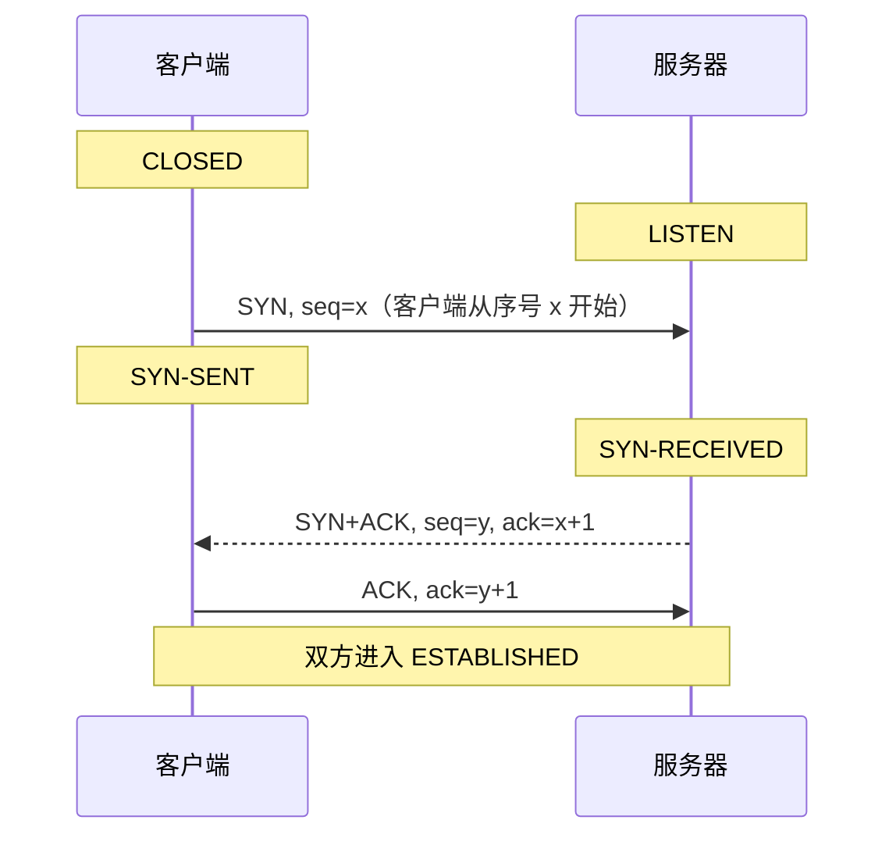
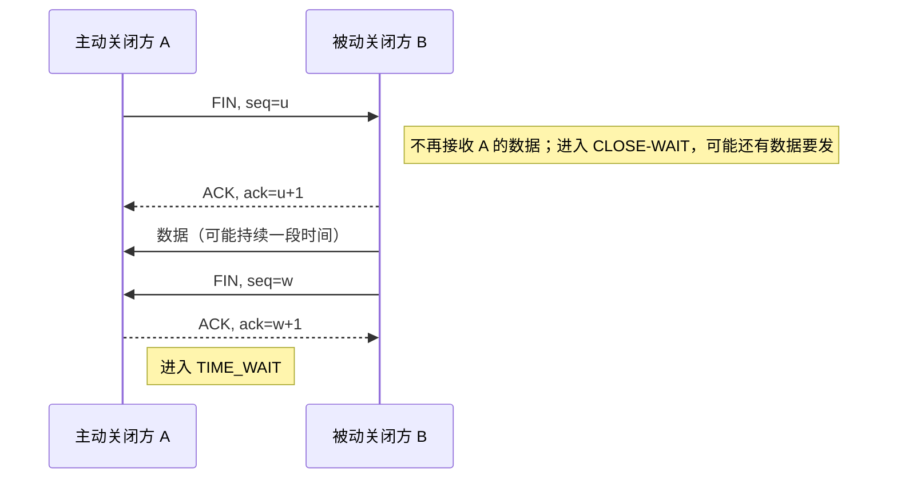

# 计算机网络｜04-传输层：UDP、TCP 与 QUIC

打开一台联网的笔记本：浏览器挂着十几个标签页，视频会议在传音频，下载器在拉一个大文件，它们共用同一个 Wi-Fi 接口、同一个 IP 地址。网络层只负责把分组送到这台主机，它不知道"这个分组该交给哪个进程"，也不保证分组不丢、不重、不乱序。补上这两个缺口，正是传输层的职责。

只记住"TCP 可靠、UDP 快"会带来一连串解释不了的困惑：为什么代码里一次 `write` 可能对应对面两次 `read`？为什么服务器只监听一个 443 端口，却能同时服务十万个客户端？为什么把接收方缓存调大之后，下载速度还是上不去？为什么 QUIC 明明跑在 UDP 之上，却说自己解决了 TCP 的队头阻塞？

本文按"端口与分用 → UDP → TCP 的连接与字节流 → 首部字段 → 握手与挥手 → 可靠传输 → 流量控制 → 拥塞控制 → QUIC → 如何选择与验证"的顺序推进。Socket API、事件循环与内核 I/O 模型属于本板块另一篇的主题，这里只讲协议想解决什么问题、状态如何变化、边界在哪里。

<!-- GFM-TOC -->
* [从主机到进程：端口与套接字端点](#从主机到进程端口与套接字端点)
    * [问题：一个 IP 地址不够用](#问题一个-ip-地址不够用)
    * [复用与分用](#复用与分用)
    * [最小可观察示例：四元组分用](#最小可观察示例四元组分用)
* [UDP：最小传输服务与应用责任](#udp最小传输服务与应用责任)
    * [数据报模型](#数据报模型)
    * [它不提供什么](#它不提供什么)
    * ["没有拥塞控制"不等于"可以随便发"](#没有拥塞控制不等于可以随便发)
    * [三种典型的使用方式](#三种典型的使用方式)
* [TCP：可靠、有序的双向字节流](#tcp可靠有序的双向字节流)
    * [连接是一条有状态的字节流](#连接是一条有状态的字节流)
    * [字节流最容易被误解的一点](#字节流最容易被误解的一点)
    * [最小可观察示例：长度前缀成帧](#最小可观察示例长度前缀成帧)
* [读懂 TCP 首部中的关键状态](#读懂-tcp-首部中的关键状态)
* [建立连接：三次握手确认了什么](#建立连接三次握手确认了什么)
    * [三个报文做了什么](#三个报文做了什么)
    * [为什么不是两次，也不是四次](#为什么不是两次也不是四次)
    * [SYN 也要消耗资源，于是有了 SYN flood 与 SYN cookie](#syn-也要消耗资源于是有了-syn-flood-与-syn-cookie)
* [终止连接、半关闭与 TIME_WAIT](#终止连接半关闭与-time_wait)
    * [FIN 只关闭一个方向](#fin-只关闭一个方向)
    * [TIME-WAIT 为什么必须存在](#time-wait-为什么必须存在)
    * [两种堆积对应的两种问题](#两种堆积对应的两种问题)
* [可靠传输：序号、累计确认、超时与选择确认](#可靠传输序号累计确认超时与选择确认)
    * [序号与确认号构成基本框架](#序号与确认号构成基本框架)
    * [三种重传触发方式](#三种重传触发方式)
    * [RTO 怎么算：平均 RTT 不够，还要跟踪抖动](#rto-怎么算平均-rtt-不够还要跟踪抖动)
    * [最小可观察示例：RTO 估计](#最小可观察示例rto-估计)
    * [现代实现不只看重复 ACK](#现代实现不只看重复-ack)
    * [可靠性的边界](#可靠性的边界)
* [滑动窗口与流量控制](#滑动窗口与流量控制)
    * [发送窗口是一个区间](#发送窗口是一个区间)
    * [rwnd：接收方的自我保护](#rwnd接收方的自我保护)
    * [最小可观察示例：窗口右沿锚定在累计确认号上](#最小可观察示例窗口右沿锚定在累计确认号上)
* [拥塞控制：不要把接收方慢与网络堵混为一谈](#拥塞控制不要把接收方慢与网络堵混为一谈)
    * [两种"慢"的成因完全不同](#两种慢的成因完全不同)
    * [经典基线：四个算法](#经典基线四个算法)
    * [最小可观察示例：拥塞窗口演化](#最小可观察示例拥塞窗口演化)
    * [现代算法的地位（不是一个线性替代史）](#现代算法的地位不是一个线性替代史)
* [QUIC：在 UDP 之上重建现代传输](#quic在-udp-之上重建现代传输)
    * [三个动机](#三个动机)
    * [它带来了什么](#它带来了什么)
    * [代价与边界](#代价与边界)
* [TCP、UDP、QUIC 如何选择](#tcpudpquic-如何选择)
* [用抓包验证而不是背图](#用抓包验证而不是背图)
* [常见误区](#常见误区)
* [参考资料](#参考资料)
* [小结](#小结)
<!-- GFM-TOC -->

## 从主机到进程：端口与套接字端点

### 问题：一个 IP 地址不够用

IP 地址标识的是主机（更准确地说是主机上的一个网络接口），而真正通信的是进程。同一台服务器上可能有 Web 服务、数据库、日志采集器同时在收数据；同一台手机上可能有几十个连接指向不同的 App 后端。如果网络层交付完就结束，操作系统无法判断该把这段字节交给谁。

传输层引入两个概念补上这一层：**端口（Port）** 是 16 位无符号整数（取值 0–65535），用于标识主机内的通信端点；**套接字端点（Socket Endpoint）** 是 `IP 地址 + 端口` 的组合，用来定位"哪个进程在哪个地址上通信"。

端口号的分段由 IANA 定义；RFC 6335 把 0–1023 划给系统端口（System Ports，即众所周知的知名端口），1024–49151 划给用户端口（User Ports），49152–65535 划给动态端口（Dynamic Ports，也叫私有端口或临时端口）。真正约束"普通进程不能绑定 1024 以下端口"的是操作系统权限，而客户端实际使用的临时端口范围由内核参数决定（Linux 默认 `32768–60999`，见 `net.ipv4.ip_local_port_range`）。

### 复用与分用

这两个方向的动作要分开理解：

- **复用（Multiplexing）**：多个进程的数据经过传输层封装后，共享同一个 IP 层的发送出口；
- **分用（Demultiplexing）**：收到的 IP 分组，按传输层首部里的信息交给正确的套接字。

分用的匹配规则，UDP 和 TCP 并不相同，这是后面很多现象（"一个端口能接多个客户端"、"同一端口能同时跑 UDP 和 TCP"）的根源：

| 传输协议 | 分用依据 | 结果 |
| --- | --- | --- |
| UDP | 目的端口（加目的 IP） | 一个套接字接收来自任意对端的数据报 |
| TCP 监听套接字 | 目的端口 + 未确认的对端 | 用它接受新连接 |
| TCP 已建立连接 | 本地 IP、本地端口、对端 IP、对端端口组成的四元组 | 一个端口上并存大量互相独立的连接 |

> 端口只在本机范围内有意义，它标识的是本机上的一个通信端点，既不能标识协议本身，也不能证明对端身份——理解这一点，就不会把"端口号"当成"应用类型"或"安全边界"。

### 最小可观察示例：四元组分用

下面的片段从 companion file 的 `TransportDemux` 类（第 39–66 行）抽取，模拟两个客户端同时访问服务端的 443 端口，以及三个不同对端向同一个 UDP 端口发数据报；该类内部用 `_tcpConnections` 列表存连接、用 `_udpByLocalPort` 表存 UDP 套接字。

```dart
  /// 收到一个 TCP 报文段：先找完全匹配的四元组，再退化到监听套接字。
  String onTcpSegment(Endpoint from, Endpoint to, String payload) {
    for (final connection in _tcpConnections) {
      // 1. 匹配时忽略监听态的地址，只保留对端地址 + 本地端口这一必要维度。
      if (connection.local.port != to.port) continue;
      if (connection.remote.port == from.port &&
          connection.remote.address == from.address) {
        return '${connection.state} 上的既有连接收到 $payload';
      }
    }
    for (final connection in _tcpConnections) {
      // 2. 只有 LISTEN 才接受新对端；其余情况说明四元组不存在。
      if (connection.local.port == to.port && connection.state == 'LISTEN') {
        _tcpConnections.add(TcpConnection(to, from, 'ESTABLISHED'));
        return '接受新连接：$from -> $to，$payload';
      }
    }
    // 3. 没有匹配的连接时，规范要求回 RST，而不是把数据交给别的连接。
    return '无匹配连接 -> 回 RST（丢弃 $payload）';
  }

  /// 收到一个 UDP 数据报：只按本地端口找套接字，对端地址不参与匹配。
  String onUdpDatagram(Endpoint from, Endpoint to, String payload) {
    final socket = _udpByLocalPort[to.port];
    if (socket == null) return '本地端口 ${to.port} 未绑定 -> 回 ICMP 端口不可达并丢弃';
    socket.received.add('$from: $payload');
    return '投递给本地端口 ${to.port} 上的套接字';
  }
```
<!-- verify: .work/verify/B10/port_demux.dart -->

完整可运行文件：`.work/verify/B10/port_demux.dart`（含 `Endpoint`、`TcpConnection`、`UdpSocket` 定义与 `main` 断言）。运行后可以看到三个结论同时成立：

```text
接受新连接：192.0.2.10:51001 -> 10.0.0.7:443，请求 A
接受新连接：192.0.2.11:51002 -> 10.0.0.7:443，请求 B
连接表：[10.0.0.7:443 <- 192.0.2.10:51001 (ESTABLISHED), 10.0.0.7:443 <- 192.0.2.11:51002 (ESTABLISHED)]
ESTABLISHED 上的既有连接收到 请求 A2
无匹配连接 -> 回 RST（丢弃 未知请求）
同一套接字收到 3 个数据报：[203.0.113.1:40000: query X, 203.0.113.2:40001: query Y, 203.0.113.3:40002: query Z]
本地端口 9999 未绑定 -> 回 ICMP 端口不可达并丢弃
```

同一服务端端口上并存两条 `ESTABLISHED` 连接，靠的是四元组不同；同一个 UDP 端口聚合并来自三个不同对端的数据报；四元组不匹配的 TCP 报文段回 RST 而不是"猜"一个连接。TCP 与 UDP 并存同一端口号也不冲突，因为 IP 首部的协议字段在分用前就已经把它们分开了。

> **面试高频：** 服务器只监听一个端口，为什么能同时处理成千上万个客户端？
> **答题脉络：** 监听套接字只负责接受新连接 → 建立后连接由四元组标识 → 服务端本地端口相同但对端端口/IP 不同 → 内核按四元组把报文交给对应连接 → 因此瓶颈在文件描述符、内存与 CPU，不在端口数量。
> **追问方向：** 为什么同一台机器上两个进程不能同时绑定同一端口（除非用 SO_REUSEPORT）、临时端口耗尽会发生什么、NAT 表如何复用同一个公网端口。

## UDP：最小传输服务与应用责任

### 数据报模型

UDP（User Datagram Protocol，用户数据报协议）在 IP 之上只做两件事：加一组端口用于分用，加一个校验和用于检错。它的首部固定 8 字节：

```text
 0                   1                   2                   3
 0 1 2 3 4 5 6 7 8 9 0 1 2 3 4 5 6 7 8 9 0 1 2 3 4 5 6 7 8 9 0 1
+-+-+-+-+-+-+-+-+-+-+-+-+-+-+-+-+-+-+-+-+-+-+-+-+-+-+-+-+-+-+-+-+
|          源端口 (16)          |        目的端口 (16)          |
+-+-+-+-+-+-+-+-+-+-+-+-+-+-+-+-+-+-+-+-+-+-+-+-+-+-+-+-+-+-+-+-+
|           长度 (16)           |          校验和 (16)          |
+-+-+-+-+-+-+-+-+-+-+-+-+-+-+-+-+-+-+-+-+-+-+-+-+-+-+-+-+-+-+-+-+
|                            数据 ...                           |
+-+-+-+-+-+-+-+-+-+-+-+-+-+-+-+-+-+-+-+-+-+-+-+-+-+-+-+-+-+-+-+-+
```

字段很少，但每个都有边界：

- **长度**覆盖首部与数据，因此普通 IPv4/IPv6 数据报的 UDP 总长上限是 65535 字节；IPv6 jumbogram 使用扩展的长度语义，是专门的例外；
- **校验和**计算时会临时拼接一个"伪首部"（含源 IP、目的 IP、协议号等），目的是让传输层有机会发现"分组被投递到了错误的主机"。它在 IPv4 中是可选的，全 0 表示发送方没有计算；在 IPv6 中通常必须计算，只有特定隧道场景经专门规范允许使用零校验和（[RFC 8200 第 8.1 节](https://www.rfc-editor.org/rfc/rfc8200#section-8.1)）。

UDP 是**面向报文**的：应用交给它一个数据报，它就发一个；接收方一次 `receive` 对应一个数据报，边界被保留下来。若接收缓冲区太小，具体 API 可能截断报文或报告截断，而不会像 TCP 那样把后续字节拼到下一次接收里。UDP 协议本身没有连接状态；操作系统虽然可以提供“已连接 UDP 套接字”来固定默认对端、过滤其他来源，但这不等于 UDP 获得了 TCP 的握手、可靠性或有序性。

### 它不提供什么

RFC 768 只定义了上述内容，以下机制 UDP 本身一概没有：

- 不建立连接、不做握手、不维护对端状态；
- 不重传、不排序、不查重，丢了就是丢了；
- 没有流量控制，接收方缓冲满了只能丢弃；
- 没有拥塞控制，UDP 不根据网络状况调整发送速率。

UDP 的价值在于"不替应用做决定"，而不是"更快"；代价是可靠性、拥塞控制、可达性判断全部落到应用自己身上，用不到这些机制的场景确实省掉了成本，用得到的场景必须自己补齐。

### "没有拥塞控制"不等于"可以随便发"

这是最容易出错的因果链。UDP 不提供拥塞控制是事实，但把它推导成"用 UDP 就能无限提速"是错的：不做拥塞控制的流量会在链路队列溢出时挤掉别人的包，最终所有人都变慢，这就是拥塞崩溃（congestion collapse）。[RFC 8085 第 3.1 节](https://www.rfc-editor.org/rfc/rfc8085#section-3.1) 是 UDP 的使用指南，明确要求：应用若选择不使用带拥塞控制的传输协议，就应该对自己发往同一目的的 UDP 流量做拥塞控制，而且要对多个进程/套接字产生的**总量**做控制。

同一份文档还提醒不要制造 IP 分片：丢一片就要重传整个报文，部分 NAT 与防火墙还会直接丢弃分片报文，因此应用应把消息控制在路径 MTU 之内，路径未知时用较保守的默认值（第 3.2 节）。

### 三种典型的使用方式

| 场景 | 应用自己做了什么 | 为什么不用 TCP |
| --- | --- | --- |
| DNS 查询 | 一问一答、超时重试、必要时换 TCP | 单次请求通常只有一个来回，握手成本占比过高 |
| 实时音视频 | 容忍丢失、丢帧优先、按带宽预估调节码率 | 重传旧帧已经错过播放时间，反而浪费带宽 |
| QUIC / HTTP/3 | 在 UDP 之上实现可靠传输、流控、拥塞控制与加密 | 需要用户态可演进、可多路复用、可迁移的连接抽象 |

这三行说明"用 UDP"从来不等于"没有可靠性"，只等于"可靠性不由 UDP 提供"。

> **面试高频：** UDP 一定比 TCP 快吗？UDP 是不是可以不做拥塞控制？
> **答题脉络：** 无连接省掉握手与状态 → 单次小请求确实更省往返 → 但"快"取决于是否重传、是否排队、是否被丢包拖累 → 应用仍需按 RFC 8085 自行实现拥塞控制。
> **追问方向：** UDP 校验和在 IPv4/IPv6 的差异、为什么实时媒体还能用 UDP 却要求"丢得起"、QUIC 为什么又要在 UDP 上补回可靠性。

## TCP：可靠、有序的双向字节流

### 连接是一条有状态的字节流

TCP（Transmission Control Protocol，传输控制协议）要先建立连接，再在这条连接上传数据。连接的"建立"意味着双方各自维护一份状态：初始序号、已确认到哪个字节、接收缓冲还剩多少空间、当前能发多快。这些状态不在 IP 首部里，也不在应用里，而在两端的内核里。

TCP 提供三件事：

1. **面向连接、点对点**：一条连接只有两个端点，不会像 UDP 那样一个套接字混收多个对端；
2. **全双工**：两个方向各自独立维护序号、窗口和重传，可以同时收发；
3. **可靠、有序的字节流**：应用写入的字节会在对端按同样顺序、不重复地出现。

### 字节流最容易被误解的一点

"字节流（byte stream）"意味着 TCP 不保留任何消息边界。[RFC 9293 第 3.7 节](https://www.rfc-editor.org/rfc/rfc9293#section-3.7) 写得很直白：TCP 发送的报文段边界与接收方读缓冲的边界之间没有任何对应关系，应用层按消息写入，但 TCP 不保证对端按同样的消息边界读到。

因此下面这些都是正常现象，而不是"TCP 出 bug 了"：

- 一次 `write(1000 字节)`，对端第一次 `read` 只拿到 400 字节，剩下 600 字节在下一次；
- 两次 `write` 的字节被合并到一次 `read` 里返回（中文语境常称作"粘包"）；
- 中间某个报文段丢失后重传，接收方按序号把数据重新拼回正确顺序。

消息边界必须由应用层自己定义，常见四种做法：

| 成帧方式 | 做法 | 失效条件 |
| --- | --- | --- |
| 定长消息 | 每条消息长度固定 | 消息长度天然可变时不适用 |
| 长度前缀 | 先写长度字段，再写负载 | 长度字段本身的长度与字节序要约定一致 |
| 分隔符 | 用换行、`\r\n` 等分隔 | 负载内部出现分隔符时会切错，必须转义或改用长度前缀 |
| 自描述格式 | 如 JSON、Protobuf 等带完整结构的格式 | 只是"框架帮你解决"，本质仍是上面某一种 |

### 最小可观察示例：长度前缀成帧

下面的片段抽取自 companion file 的 `LengthPrefixedDecoder` 类（第 18–52 行），实现"4 字节大端长度前缀 + UTF-8 负载"的成帧方案。文件头部导入 `dart:convert` 与 `dart:typed_data`。

```dart
/// 从任意切分的字节流中还原完整消息；不完整的前缀/负载留在缓冲里等下一次。
class LengthPrefixedDecoder {
  final BytesBuilder _buffer = BytesBuilder(copy: false);

  /// 追加一段「刚从连接读到」的字节，返回本次能完整还原的消息。
  List<String> add(List<int> chunk) {
    // 1. 把新到的字节并入缓冲，模拟内核把数据交给应用的顺序性。
    _buffer.add(chunk);
    final data = _buffer.toBytes();
    final messages = <String>[];
    var offset = 0;

    // 2. 只要缓冲里还有一条完整消息，就取出来并前移游标。
    while (data.length - offset >= 4) {
      final length = ByteData.sublistView(
        data,
        offset,
        offset + 4,
      ).getUint32(0, Endian.big);
      if (data.length - offset - 4 < length) break; // 负载未到齐，继续等
      final start = offset + 4;
      messages.add(
        utf8.decode(Uint8List.sublistView(data, start, start + length)),
      );
      offset = start + length;
    }

    // 3. 剩下的是半个前缀或半个负载，必须保留到下一次读取。
    _buffer.clear();
    if (offset < data.length) {
      _buffer.add(Uint8List.sublistView(data, offset));
    }
    return messages;
  }
}
```
<!-- verify: .work/verify/B10/byte_stream_framing.dart -->

完整可运行文件：`.work/verify/B10/byte_stream_framing.dart`。它演示了三个边界：

```text
一次交付全部字节 -> 3 条消息
按 1/3/7 字节切分后还原 -> [PING, hello, tcp, 最后一条消息]
前 13 字节只够还原 1 条消息，剩余字节仍留在缓冲中
按分隔符成帧：发送 2 条，接收方看到 3 段
```

把同一段字节按 1、3、7 字节切片反复投喂，还原出的消息完全一致；切片点落在前缀中间时，剩下的半个前缀必须留在缓冲里等下一次数据；换成换行分隔符时，负载里自带换行的那条消息会被切成两条——这就是"成帧方式选择依赖负载内容"的失败案例。

TCP 保证的是"连接内的字节内容与顺序"，不保证"一次写对应一次读"，也不保证"对方应用已经处理了这条消息"；前者要靠应用层成帧解决，后者要靠应用层确认或幂等设计解决。

> **面试高频：** 为什么会粘包/拆包，怎么处理？
> **答题脉络：** TCP 是字节流没有消息边界 → 内核按 MSS 和发送时机切分，与写入次数无关 → 应用层必须自己定义边界 → 长度前缀最通用，分隔符需要转义，定长最简单。
> **追问方向：** UDP 为什么没有这个问题、TCP_NODELAY 与 Nagle 算法、HTTP/1.1 与 HTTP/2 各自的成帧方式。

## 读懂 TCP 首部中的关键状态

TCP 首部最短 20 字节，最长 60 字节（首部长度字段 4 位，以 4 字节为单位）：

```text
 0                   1                   2                   3
 0 1 2 3 4 5 6 7 8 9 0 1 2 3 4 5 6 7 8 9 0 1 2 3 4 5 6 7 8 9 0 1
+-+-+-+-+-+-+-+-+-+-+-+-+-+-+-+-+-+-+-+-+-+-+-+-+-+-+-+-+-+-+-+-+
|          源端口 (16)          |        目的端口 (16)          |
+-+-+-+-+-+-+-+-+-+-+-+-+-+-+-+-+-+-+-+-+-+-+-+-+-+-+-+-+-+-+-+-+
|                          序号 (32)                            |
+-+-+-+-+-+-+-+-+-+-+-+-+-+-+-+-+-+-+-+-+-+-+-+-+-+-+-+-+-+-+-+-+
|                        确认号 (32)                            |
+-+-+-+-+-+-+-+-+-+-+-+-+-+-+-+-+-+-+-+-+-+-+-+-+-+-+-+-+-+-+-+-+
| 首部长度(4) | 保留(4) |C|E|U|A|P|R|S|F|         窗口 (16)      |
+-+-+-+-+-+-+-+-+-+-+-+-+-+-+-+-+-+-+-+-+-+-+-+-+-+-+-+-+-+-+-+-+
|          校验和 (16)          |        紧急指针 (16)          |
+-+-+-+-+-+-+-+-+-+-+-+-+-+-+-+-+-+-+-+-+-+-+-+-+-+-+-+-+-+-+-+-+
|                        选项 (0 ~ 40 字节)                     |
+-+-+-+-+-+-+-+-+-+-+-+-+-+-+-+-+-+-+-+-+-+-+-+-+-+-+-+-+-+-+-+-+
|                            数据 ...                           |
+-+-+-+-+-+-+-+-+-+-+-+-+-+-+-+-+-+-+-+-+-+-+-+-+-+-+-+-+-+-+-+-+
```

字段虽多，真正决定"能否可靠传输"和"能传多快"的只有下面几组：

- **序号（Sequence Number）**：本报文段第一个数据字节的编号。SYN 报文不携带数据，但它**占用一个序号**，所以对 SYN 的确认号是 `ISN + 1`；
- **确认号（Acknowledgment Number）**：期望收到的下一个字节序号。它是**累计确认**：`ack = N` 表示 N 之前的字节全部收到。累计确认的优点是丢一个 ACK 不会导致误判，缺点是只丢失中间一个段时，接收方只能反复确认"最后一个连续字节"；
- **窗口（Window）**：接收方愿意接受的字节数，从确认号开始算起。配合窗口扩大选项，它决定了接收方能承受的在途数据量；
- **标志位**：`SYN`（同步序号，建连）、`FIN`（发送方没有更多数据，关一个方向）、`ACK`（确认号有效，连接建立后一直为 1）、`RST`（复位连接，通常意味着"没有这个连接"或"数据不应被接受"）、`PSH`（提示尽快上交应用，现代实现中作用有限）、`URG` 与紧急指针（历史机制，现代几乎不用）、`CWR`/`ECE`（ECN 用，见拥塞控制一节）；
- **校验和**：与 UDP 一样是 16 位反码和，并覆盖伪首部。它能发现常见的比特错误，但不是密码学强度或专用的错误检测算法。

选项区只在首部长度大于 5 时存在，常见的四个选项都在握手阶段协商：

| 选项 | 作用 | 关键边界 |
| --- | --- | --- |
| MSS | 声明本报文段能接收的最大数据长度 | 只在 SYN 中出现；不发则默认 536 字节（IPv4）；它与 MTU 的关系是 `MSS = MTU - IP 首部 - TCP 首部`，只约束 TCP 数据部分 |
| 窗口扩大（Window Scale） | 把 16 位窗口字段左移最多 14 位 | 双方必须都在 SYN 中发送才生效，之后固定；上限 2^30 ≈ 1 GiB |
| 时间戳（Timestamps） | 更精确的 RTT 测量 + 防止序号回绕（PAWS） | 需要双方协商；时间戳会占用首部空间 |
| SACK | 选择性确认已收到的字节块 | 需要双方协商；RFC 9293 把它列为推荐实现但不影响基本互操作的高性能选项 |

> 标志位只是状态标签，真正让 TCP"可靠"的是序号与确认号，真正决定吞吐的是窗口与选项协商；背下标志位却说不清确认号语义，等于没读懂首部。

MSS 与 MTU 常被混为一谈：MTU 是链路层能承载的最大载荷，由路径上最小的一跳决定，属于网络层/链路层问题（细节见 [网络层：IP、路由与地址解析](./03-网络层：IP、路由与地址解析.md)）；MSS 是 TCP 自己给自己设的数据上限，用来把报文段控制在路径 MTU 之内，避免 IP 分片。也正因为 TCP 事先不知道自己会被哪条路径承载，才需要双方在握手中互相声明能接收的最大段长。

## 建立连接：三次握手确认了什么

### 三个报文做了什么



三个报文分别确认了：

1. **客户端发出的字节能到达服务器**（服务器用 `ack = x + 1` 回答）；
2. **服务器发出的字节能到达客户端**（客户端用 `ack = y + 1` 回答）；
3. **两个方向的初始序号都完成同步**：序号是各自生成、由对方确认后才生效的随机数，而不是从 0 开始。

第三点常被忽略。如果没有第三次确认，服务器只知道"我发出去了"，无法确认客户端收到了自己的 ISN；而客户端之后要用这个序号接收数据、判断重复与乱序。三次握手恰好让每个方向都走完"我发给你 → 你收到并回我 → 我确认你收到"这一轮。

### 为什么不是两次，也不是四次

**两次不够**：只剩 SYN 与 SYN+ACK 时，服务器发出 SYN+ACK 后无法确认客户端是否收到，于是无法确认自己的 ISN 是否同步，也无法判断连接是否真的可用。

**四次多余**：`ACK` 与 `SYN` 塞进同一个报文段（即 SYN+ACK）之后，同一个能力不需要额外的往返。把确认与序号同步合并，是协议设计的正常优化，不是"简化掉的步骤"。

**"防止旧连接的失效 SYN 导致误建连"是历史解释之一，不是唯一原因**。互联网早期确实出现过"延迟很久的旧 SYN 到达服务器，服务器单方面建立连接"的问题，RFC 9293 也保留了对同时打开、旧重复 SYN 的处理说明；但把三次握手全部归因于防攻击，会漏掉序号同步这个更基本的理由。

### SYN 也要消耗资源，于是有了 SYN flood 与 SYN cookie

服务器收到 SYN 后，在发送 SYN+ACK 之前就要为这个尚未完成的连接分配资源（半连接队列）。Linux 上用 `net.ipv4.tcp_max_syn_backlog` 限制这个队列的长度，`somaxconn` 限制完成握手后被 accept 的队列长度。攻击者伪造源地址海量发送 SYN，服务端回应的 SYN+ACK 全部发往不存在的主机，半连接队列被占满，正常客户端就无法建立连接。

常见的缓解手段是 **SYN cookie**：服务器不为未确认的连接保存状态，而是把连接信息编码进自己的初始序号，只有客户端回来发第三个报文时才重建状态（RFC 4987 第 3.6 节介绍了原理与代价）。Linux 的 `net.ipv4.tcp_syncookies` 默认值为 1，即队列溢出时启用；官方文档同时提醒它只是兜底手段，会牺牲部分 TCP 选项能力，正常的连接速率过高应该先调整队列与 accept 逻辑。

三次握手的本质是"双向可达性验证 + 双向序号同步"；SYN flood 是"握手需要服务端提前分配资源"这一实现事实带来的攻击面，不是握手存在的理由。

两个容易被追问的细节：RFC 9293 允许握手中的报文段（包括第三次确认）携带数据，但要求接收方在连接进入 ESTABLISHED 之前不得把数据交给应用；TCP Fast Open（RFC 7413，实验性）更进一步允许在 SYN 中携带数据，需双方支持，部署范围小于 QUIC 的 0-RTT。

> **面试高频：** TCP 为什么需要三次握手，三次握手确认了什么？
> **答题脉络：** 每个方向都要同步初始序号 → 两次只能确认单向可达 → SYN+ACK 合并节省一次往返 → 第三次确认客户端已收到服务器 ISN → 补充半连接队列与 SYN flood 的边界。
> **追问方向：** 初始序号怎么选、同时打开会怎样、SYN 重传几次放弃、ACK 丢失会重传什么。

## 终止连接、半关闭与 TIME_WAIT

### FIN 只关闭一个方向

数据发送完毕后，一方发送 `FIN=1` 表示"我没有更多数据要发了"。这只关闭它自己的发送方向，对端仍然可以继续发送数据，这种状态叫**半关闭（half-closed）**。RFC 9293 允许在收到 FIN 之后继续在另一个方向发送数据。

所以一次完整的关闭通常长这样：



**"四次挥手"是常见序列，不是不可变的报文数**：被动方的确认 ACK 与它自己的 FIN 常常被合并成一个报文段（延迟确认、数据先发完都会促成合并），此时线路上只看到三个报文。把挥手报文数量当成协议规定，会在抓包里看到"少了一次"时判断错误。

状态迁移可以按角色记忆：

| 角色 | 状态路径 | 含义 |
| --- | --- | --- |
| 主动关闭方 | FIN-WAIT-1 → FIN-WAIT-2 → TIME-WAIT → CLOSED | 发出 FIN、收到 ACK、等待 2×MSL 后释放 |
| 被动关闭方 | CLOSE-WAIT → LAST-ACK → CLOSED | 等应用调用 close 后才发 FIN |
| 同时关闭 | FIN-WAIT-1 → CLOSING → TIME-WAIT | 双方同时发 FIN |

收到 `RST` 会直接进入 CLOSED，这不是正常关闭，通常意味着对端认为连接不存在、端口未监听或数据被拒绝。

### TIME-WAIT 为什么必须存在

TIME-WAIT 只有主动关闭方（以及同时关闭的情况）会进入，它有两个不可替代的作用：

1. **保证最后一个 ACK 有机会重传**：如果这个 ACK 丢失，对端会重传 FIN；主动方只要还在 TIME-WAIT，就能再次确认。否则对端会一直卡在 LAST-ACK，最终因超时失败，连接无法干净地关闭。
2. **隔离旧连接的报文**：同一条四元组很快被复用时，网络中可能还残留着上一条连接的报文；等待一段时间让这些报文消亡，新连接才不会收到"上一个会话"的数据。

[RFC 9293 第 3.6 节](https://www.rfc-editor.org/rfc/rfc9293#section-3.6)要求主动关闭方必须在 2×MSL（Maximum Segment Lifetime，最大报文段生存时间）内保持 TIME-WAIT，并把 MSL 取为 2 分钟——同时明确这是工程选择，可以随经验修改。不同系统的实现并不统一：Linux 内核把 TIME-WAIT 时长固定为 60 秒（`TCP_TIMEWAIT_LEN`），而 `net.ipv4.tcp_fin_timeout` 控制的是**孤儿连接在 FIN-WAIT-2 停留多久后被回收**，与 TIME-WAIT 无关。

TIME-WAIT 是一个"等对端确认收到最后的 FIN，并让旧报文在网络中消亡"的保护期，而不是错误状态；它属于主动关闭方，服务器主动关闭连接时服务器同样会进入 TIME-WAIT。

### 两种堆积对应的两种问题

线上排查时，`ss -tan state time-wait` 和 `ss -tan state close-wait` 给出的信号完全不同：

- **大量 CLOSE-WAIT**：连接已经被动收到 FIN，但应用没有调用 `close()`（或连接池没有归还），代码里存在连接泄漏。这是应用问题，改内核参数没用。
- **大量 TIME-WAIT**：主动关闭太频繁（短连接多、压测、连接池设置不当）加上临时端口有限（Linux 默认 `32768–60999`，约 2.8 万个），可能出现临时端口耗尽或 `tcp_max_tw_buckets` 限流。方向是复用连接、减少主动关闭，而不是简单把 TIME-WAIT 调短——调短会削弱上面的两个保护作用。

> **面试高频：** 为什么 TIME_WAIT 要等 2MSL，为什么必须是主动关闭方等待？
> **答题脉络：** 最后 ACK 可能丢失 → 需要留时间重传 → 旧报文需要时间消亡以免污染新连接 → 只有主动关闭的一方能感知到对端是否收到 ACK → 所以等待责任落在主动方。
> **追问方向：** CLOSE_WAIT 与 TIME-WAIT 的排查方向、临时端口耗尽、`tcp_fin_timeout` 控制的是什么、为什么不能简单关闭 TIME-WAIT。

## 可靠传输：序号、累计确认、超时与选择确认

### 序号与确认号构成基本框架

TCP 把字节流按字节编号：序号是"这批字节的第一个字节的编号"，确认号是"我期望你下一个发来的字节编号"。接收方只按序把数据交给应用，乱序到达的数据先放在缓冲里等缺口补齐，重复数据直接丢弃。

由此得到三个基础规则：

- `ack = N` 是**累计确认**：N 之前的全部字节都已收到，发送方可以安全释放这些数据的重传缓冲；
- 接收方只对"连续收到的最后一个字节"确认，所以中途丢一个段时会反复发送同一个确认号（重复 ACK）；
- 发送方收到旧确认、超出范围的确认都要按规范做防御性处理（不能盲目前移窗口）。

### 三种重传触发方式

| 触发方式 | 依据 | 特点 |
| --- | --- | --- |
| 超时重传（RTO） | 定时器到期仍未确认 | 最可靠但最慢；是最终防线，代价是等待 |
| 快速重传 | 收到若干重复 ACK | 经典基线：3 个重复 ACK 认为后续段丢失，不等超时立即重传 |
| SACK 辅助 | 接收方通告已收到的字节块 | 一个窗口内丢多个段时，只重传真正缺失的部分 |

SACK 由 RFC 2018 定义，RFC 9293 把它列为"推荐实现、但不影响基本互操作"的高性能选项；RFC 6675 进一步描述了基于 SACK 的丢失恢复。没有 SACK 时，发送方在一个窗口丢多个段时只能一轮一轮地重传，效率很低。

超时重传是可靠性的最终保障，重复 ACK 与 SACK 只是"更早知道该重传什么"的加速手段；把可靠性等同于"三个重复 ACK"，会同时误解超时的作用与现代实现的丢失检测方式。

### RTO 怎么算：平均 RTT 不够，还要跟踪抖动

[RFC 6298 第 2 节](https://www.rfc-editor.org/rfc/rfc6298#section-2)定义了现行的 RTO 计算方式：

$$
\text{RTTVAR} \leftarrow (1-\beta)\cdot\text{RTTVAR} + \beta\cdot|\text{SRTT} - R'|
$$

$$
\text{SRTT} \leftarrow (1-\alpha)\cdot\text{SRTT} + \alpha\cdot R'
$$

$$
\text{RTO} = \text{SRTT} + \max(G,\; K\cdot\text{RTTVAR}),\qquad K = 4
$$

其中 $R'$ 是本次 RTT 测量值，$\alpha = 1/8$，$\beta = 1/4$，$G$ 是时钟粒度；规范要求先更新 RTTVAR（用旧的 SRTT），再更新 SRTT。初始 RTO 取 1 秒，计算结果小于 1 秒时向上取到 1 秒，并允许设置一个不小于 60 秒的上限；每次超时后 RTO 必须翻倍（指数退避），并把退避后的值保留到新发送的数据被确认为止。

注意公式里两项的分工：**SRTT 跟踪平均往返时间，RTTVAR 跟踪抖动幅度**。只按平均 RTT 的固定倍数设置超时，在抖动大的路径上会频繁误判丢包并触发无谓重传。

### 最小可观察示例：RTO 估计

下面片段抽取自 companion file 的常量与 `RtoEstimator` 类（第 6–50 行），用整数微秒实现上述公式，便于观察数值变化。

```dart
const int _microsecondsPerSecond = 1000000;
const int _k = 4; // RFC 6298: RTO = SRTT + max(G, K * RTTVAR)，K = 4
const int _alphaShift = 3; // alpha = 1/8
const int _betaShift = 2; // beta = 1/4
const int _minRtoMicros = 1 * _microsecondsPerSecond; // RFC 6298 的 1 秒下限

class RtoEstimator {
  /// 初始状态：还没有任何 RTT 样本，RTO 采用 RFC 6298 的 1 秒初始值。
  int _srttMicros = 0;
  int _rttvarMicros = 0;
  int _rtoMicros = _minRtoMicros;
  bool _hasSample = false;

  int get srttMicros => _srttMicros;
  int get rttvarMicros => _rttvarMicros;
  int get rtoMicros => _rtoMicros;

  /// 收到一次有效 RTT 测量后更新估计值。
  void onRttSample(int sampleMicros) {
    if (!_hasSample) {
      // 1. 第一个样本：SRTT = R，RTTVAR = R / 2。
      _srttMicros = sampleMicros;
      _rttvarMicros = sampleMicros ~/ 2;
      _hasSample = true;
    } else {
      // 2. 后续样本：RTTVAR 先吸收本次偏差，SRTT 再吸收本次样本。
      final deviation = (_srttMicros - sampleMicros).abs();
      _rttvarMicros =
          _rttvarMicros -
          (_rttvarMicros >> _betaShift) +
          (deviation >> _betaShift);
      _srttMicros =
          _srttMicros -
          (_srttMicros >> _alphaShift) +
          (sampleMicros >> _alphaShift);
    }
    // 3. 按 SRTT + K * RTTVAR 计算，并夹到 1 秒下限。
    _rtoMicros = math.max(_minRtoMicros, _srttMicros + _k * _rttvarMicros);
  }

  /// 超时重传：RFC 6298 要求按指数退避，避免在拥塞时加剧冲击。
  void onTimeout() {
    _rtoMicros = math.min(60 * _microsecondsPerSecond, _rtoMicros * 2);
  }
}
```
<!-- verify: .work/verify/B10/rto_estimator.dart -->

完整可运行文件：`.work/verify/B10/rto_estimator.dart`（文件顶部还有只用平均值做对照的 `naiveRto` 函数与断言）。运行结果：

```text
初始 RTO（无样本）= 1000.0 ms
稳定路径：SRTT=102.4 ms，RTTVAR=18.7 ms，RTO=1000.0 ms
抖动路径：SRTT=287.0 ms，RTTVAR=433.0 ms，RTO=2018.8 ms
只按 2 × 平均 RTT 估计 = 805.0 ms，远小于含偏差项的 2018.8 ms
连续 8 次超时后的 RTO 序列：4037.7 ms, 8075.3 ms, 16150.6 ms, 32301.2 ms, 60000.0 ms, 60000.0 ms, 60000.0 ms, 60000.0 ms
```

稳定路径的 RTO 被 1 秒下限"夹住"；抖动路径的 SRTT 只有 287 ms，但偏差项把 RTO 抬到 2 秒以上。如果只按平均 RTT 的 2 倍估计（805 ms），在同样的抖动下会频繁超时重传——这就是 RTTVAR 存在的意义。最后一段展示指数退避：连续超时让 RTO 翻倍直到 60 秒上限。

### 现代实现不只看重复 ACK

- **Karn 算法**：重传过的报文段不能用于 RTT 采样，否则会把"重传后的确认"误算成一次很长的 RTT（RFC 9293 第 3.8.1 节要求 RTO 计算遵循 RFC 6298，并包含 Karn 算法）。
- **RACK-TLP**（RFC 8985）：用每个报文段的发送时间与 SACK 信息做基于时间的丢失判定，再用尾部丢失探测（Tail Loss Probe）触发一次探测包，尽量避免走到 RTO。它在"应用受限、重传又丢、轻度乱序"等场景下比固定重复 ACK 阈值更准确。
- **QUIC 沿用同样思路**：包号阈值（建议 3）加时间阈值决定何时判定丢包（[RFC 9002 第 6.1 节](https://www.rfc-editor.org/rfc/rfc9002#section-6.1)）。

### 可靠性的边界

TCP 的"可靠"有明确范围，越界之后要靠应用自己：

- 它保证字节流在**连接存续期间**按序不重复地送达对端应用，但**不保证**服务端业务处理成功、也不保证响应一定回来：服务端进程崩溃、连接被中间设备复位时，客户端可能永远不知道请求是否被执行过；
- 它**不提供**密码学完整性：16 位校验和只能发现部分随机错误，不能防篡改，机密性与完整性要靠 TLS 等上层协议（本板块的 HTTPS/TLS 一篇负责，安全视角见 [常见应用攻击与防护](../06-安全基础/01-常见应用攻击与防护.md)）。

## 滑动窗口与流量控制

### 发送窗口是一个区间

发送方为每条连接维护一个发送窗口，它的两个边界决定了谁能发：


- 左沿 `snd.una`：最早的未确认字节，收到累计确认就向前移；`snd.nxt` 是下一个要发送的字节；右沿是 `snd.una + min(rwnd, cwnd)`，即"接收方容得下"与"网络容得下"两者取小。

**在途数据（in-flight）**是已发出但未被确认的字节数；**可用窗口**是右沿减去 `snd.nxt`。窗口滑动的动力来自累计确认：确认把左沿推向前，右沿随之向右移动。

> `rwnd` 与 `cwnd` 是两个独立来源的限制——前者由接收方按自己的缓冲余量通告，后者由发送方按网络拥塞状况调整；实际发送量取两者较小值，所以"窗口很小"必须先分清是哪一侧造成的。

### rwnd：接收方的自我保护

接收方在每个 ACK 里用窗口字段通告自己还能接收多少字节：

- 缓冲快满时把 `rwnd` 调小，发送方随之降速；
- `rwnd = 0` 时发送方必须停发。但发送方不能就此睡死：窗口更新本身可能丢失，所以需要 **persist 定时器**周期发送探测，让接收方有机会重新通告窗口；
- 接收方**不应该收缩窗口**（把右沿向左移），RFC 9293 第 3.8.6 节要求接收方不要这样做，同时要求发送方具备鲁棒性：一旦遇到窗口收缩导致可用窗口变成负数，就不发新数据，但可以正常重传区间内的旧数据。

窗口字段只有 16 位，最大 65535 字节；要支持更大的窗口就必须在握手时协商窗口扩大选项（左移最多 14 位，上限约 1 GiB）。

### 最小可观察示例：窗口右沿锚定在累计确认号上

下面片段抽取自 companion file 的 `SendWindow` 类（第 23–46 行），构造函数与 `rwnd`、`cwnd`、`sndUna`、`sndNxt` 字段定义在文件开头。它用简化模型演示窗口滑动，包括一个容易被忽略的边界。

```dart
  /// 可继续发送却尚未发送的字节数：受收发两侧窗口共同限制。
  int get usableWindow {
    final rightEdge = math.min(sndUna + rwnd, sndUna + cwnd);
    return math.max(0, rightEdge - sndNxt);
  }

  /// 在途字节数：已发出但未被累计确认。
  int get inFlight => sndNxt - sndUna;

  /// 一次尽量填满可用窗口的发送；返回实际发送的段数。
  int pump() {
    var sent = 0;
    while (usableWindow >= segSize) {
      sndNxt += segSize; // 1. 只有落在窗口内的字节才允许发出
      sent++;
    }
    return sent;
  }

  /// 收到累计确认号 ack：所有小于 ack 的字节都不再需要重传。
  void onAck(int ack) {
    // 2. 超出已发送范围的 ACK 无效，不能推动任何窗口边界。
    if (ack <= sndUna || ack > sndNxt) return;
    sndUna = ack; // 3. 合法累计确认只前移左沿，不回退。
  }
```
<!-- verify: .work/verify/B10/send_window.dart -->

完整可运行文件：`.work/verify/B10/send_window.dart`。关键输出：

```text
第 1 轮：发送 4 段，在途=4000 B，可用=0 B
收到 ACK=3001 后：发送 3 段，send window 左沿=3001，右沿=7001
重复 ACK=3001：左沿保持 3001（尝试前为 3001）
rwnd=0：本轮发送 0 段，可用窗口=0 B
窗口恢复但 cwnd=2000：右沿=5001，sndNxt=7001，本轮发送 0 段（右沿追不上在途数据时发不出新数据）
累计确认到 6001 后：可发送 1 段，受 cwnd=2000 B 限制
```

`rwnd = 8000`、`cwnd = 4000` 时只能发 4 段，说明实际限速来自两者较小值；重复 ACK 不会推动左沿；最有价值的是倒数第二行：**窗口右沿的位置是"累计确认号 + 窗口"，而不是"已发送位置 + 窗口"**，所以即便接收方通告了很大的窗口，只要累计确认没前移，已发送位置就可能已经越过右沿，此时不能再发新数据。这也是"窗口明明恢复了却还是发不动"的常见原因之一。

> **面试高频：** 流量控制和拥塞控制有什么区别？
> **答题脉络：** 保护对象不同——流量控制保护接收方缓冲，拥塞控制保护网络路径 → 信号不同——`rwnd` 由接收方通告，`cwnd` 由发送方推测 → 结果相同——都通过限制在途数据量生效 → 实际发送量取 `min(rwnd, cwnd)`，还要考虑已发送未确认数据与窗口右沿锚定。
> **追问方向：** 零窗口与 persist 定时器、延迟确认与 Nagle 的相互作用、窗口扩大选项为什么最大只有 14 位。

## 拥塞控制：不要把接收方慢与网络堵混为一谈

### 两种"慢"的成因完全不同

`rwnd` 小表示**接收方**消化不了；`cwnd` 小表示**发送方**判断网络正在拥塞。两者都会让下载变慢，但处理方向相反：前者要查服务端是否在慢慢处理、缓冲是否太小，后者要查链路是否丢包、是否被人抢带宽。

拥塞控制要解决的是这样一个正反馈坏事：链路队列满了 → 丢包 → 发送方重传 → 更多流量进入本来已满的链路 → 丢得更多。[RFC 2914（BCP 41）](https://www.rfc-editor.org/rfc/rfc2914)把这一正反馈解释为"拥塞崩溃"（congestion collapse）的根源，并指出没有端到端拥塞控制的流量会威胁互联网稳定；它讨论的是原则，而不是对所有传输的逐条强制。真正的强制要求落在具体协议规范里——对 TCP 来说，[RFC 9293 第 3.8.2 节](https://www.rfc-editor.org/rfc/rfc9293#section-3.8.2)规定端点必须实现慢开始、拥塞避免和 RTO 指数退避。

### 经典基线：四个算法

RFC 5681 定义了四个相互配合的算法，它们都是围绕 `cwnd` 的取值规则：

1. **慢开始（slow start）**：`cwnd` 从较小的初始值起步，每收到一个确认就增加一个 MSS，一个 RTT 内近似翻倍，直到越过慢开始门限 `ssthresh`；
2. **拥塞避免（congestion avoidance）**：进入这个阶段后每个 RTT 只把 `cwnd` 加一个 MSS，改为线性增长，避免把网络推向过载；
3. **快速重传（fast retransmit）**：收到若干重复 ACK 时不等待超时，立即重传疑似丢失的报文段；
4. **快速恢复（fast recovery）**：把 `ssthresh` 与 `cwnd` 都减半后直接进入拥塞避免——理由是"个别丢失"不等于"网络已经崩溃"。

超时的处理更保守：`ssthresh` 同样减半，但 `cwnd` 直接回落到初始窗口重新探测，因为发送方无法判断后续数据是否也已经丢失。

> **历史机制（不推荐）：** "慢开始从 `cwnd = 1` 个 MSS 起步"是早期规范的教学模型，按它描述现代实现会得到错误的初始发送量；RFC 6928（Experimental）提出把初始窗口提高到 10 个 MSS，Linux 的 `TCP_INIT_CWND` 也取 10。

### 最小可观察示例：拥塞窗口演化

下面片段抽取自 companion file 的常量与 `RenoLikeSender` 类（第 6–56 行）。它是**教学基线**，不是任何真实内核的实现。

```dart
const int mss = 1000; // 单位为字节的教学 MSS
const int initialCwndMss = 10; // RFC 6928 / Linux TCP_INIT_CWND：初始窗口 10 个 MSS

class RenoLikeSender {
  RenoLikeSender({required this.rwndBytes})
    : cwndBytes = initialCwndMss * mss,
      ssthreshBytes = 1 << 30; // RFC 5681：初始阈值可任意大

  int cwndBytes;
  int ssthreshBytes;
  int rwndBytes;
  final List<String> log = <String>[];

  /// 有效发送窗口：收发两侧窗口的较小值（这里忽略实现侧的在途限制）。
  int get effectiveWindowBytes => math.min(cwndBytes, rwndBytes);

  int get effectiveWindowMss => effectiveWindowBytes ~/ mss;

  /// 每个 RTT 轮次的窗口增长：慢开始翻倍，拥塞避免每轮 +1 MSS。
  void onRoundTrip() {
    if (cwndBytes < ssthreshBytes) {
      // 1. 慢开始：每收到一个 ACK 就把窗口加 1 个 MSS，一轮下来近似翻倍。
      cwndBytes = math.min(cwndBytes * 2, ssthreshBytes);
      log.add('慢开始 -> cwnd=${cwndBytes ~/ mss} MSS');
    } else {
      // 2. 拥塞避免：每轮只加 1 个 MSS，避免把网络推向过载。
      cwndBytes += mss;
      log.add('拥塞避免 -> cwnd=${cwndBytes ~/ mss} MSS');
    }
  }

  /// 快速重传/快速恢复：由重复 ACK 触发，说明发生了个别丢失而非整段拥塞崩溃。
  void onTripleDupAck() {
    // 3. 阈值减半，窗口直接落到阈值并进入拥塞避免（快恢复的关键取舍）。
    ssthreshBytes = math.max(cwndBytes ~/ 2, 2 * mss);
    cwndBytes = ssthreshBytes;
    log.add(
      '3 个重复 ACK -> ssthresh=${ssthreshBytes ~/ mss} MSS，cwnd=${cwndBytes ~/ mss} MSS',
    );
  }

  /// 超时：无法判断后续数据是否也已丢失，必须回到起点重新探测。
  void onTimeout() {
    // 4. 阈值减半后把窗口压回慢开始起点；现代实现用 IW10 而不是 1 个 MSS。
    ssthreshBytes = math.max(cwndBytes ~/ 2, 2 * mss);
    cwndBytes = initialCwndMss * mss;
    log.add(
      '超时 -> ssthresh=${ssthreshBytes ~/ mss} MSS，cwnd 重置为 $initialCwndMss MSS',
    );
  }
}
```
<!-- verify: .work/verify/B10/congestion_window.dart -->

完整可运行文件：`.work/verify/B10/congestion_window.dart`。运行结果：

```text
初始 cwnd=10 MSS，受 rwnd 限制时可发送 10 段
慢开始 -> cwnd=640 MSS
3 个重复 ACK -> ssthresh=320 MSS，cwnd=320 MSS
拥塞避免 -> cwnd=321 MSS
rwnd 缩小到 100 MSS 时有效窗口=100 MSS，cwnd 仍为 321 MSS
超时前 cwnd=321 MSS，超时后 cwnd=10 MSS，ssthresh=160 MSS
```

最后两行区分了两种降速：`rwnd` 缩小只改变有效窗口，`cwnd` 不动；超时才会重置 `cwnd`。这两行也解释了线上排查的一个常见陷阱——把接收方变慢当成网络拥塞，会去调 TCP 参数，而真正的瓶颈在服务端。

### 现代算法的地位（不是一个线性替代史）

> **时效信息（核查日期：2026-09）：** 下列陈述涉及标准状态与平台默认值，来源见参考资料；不同内核版本与发行版配置可能不同，实际取值请在目标机器上查询。

- **Reno / NewReno（RFC 5681、RFC 6582）** 仍是规范层面的基线，也是理解其他算法的坐标系；RFC 9002 给 QUIC 定义的默认控制器就是 NewReno 风格。
- **CUBIC（RFC 9438，Standards Track，2023-08）** 用三次函数代替线性增长，在高带宽长时延链路上更稳定。[RFC 9438](https://www.rfc-editor.org/rfc/rfc9438) 的摘要明确指出：Linux、Windows、Apple 协议栈都已把它作为默认的 TCP 拥塞控制算法（该文档取代 RFC 8312）。
- **BBR** 不再把"丢包"当成唯一拥塞信号，而是通过测量带宽和最小 RTT 建立发送速率模型。截至核查日期它仍是 IETF 草案（`draft-ietf-ccwg-bbr-06`，2026-07-06 更新，目标状态为 Experimental），尚未成为 RFC；Linux 上通常需要显式启用，是否可用取决于内核版本与模块配置。
- **RACK-TLP（RFC 8985）** 改变的是丢失检测，不是窗口增长曲线；两者可以并存。
- **ECN（RFC 3168）** 让路由器用标记代替丢弃来通知拥塞，避免无谓重传，但需要端到端和路径上的支持；**L4S**（RFC 9330 为信息性文档，RFC 9331 为实验性文档）是更近一步的低时延方案，仍处于需要网络配合的推进阶段。

平台默认值可以直接查：Linux 用 `sysctl net.ipv4.tcp_congestion_control`（默认值在编译内核时由 `DEFAULT_TCP_CONG` 一类的配置项选定，`cubic` 是主流发行版内核的编译默认），可用算法列表见 `sysctl net.ipv4.tcp_available_congestion_control`；Windows 用 `Get-NetTCPSetting | Select SettingName, CongestionProvider`，其中部分模板受版本影响（Server 2019 起 CUBIC 成为默认拥塞控制提供程序，个别模板仍会显示 DCTCP 等取值，需要按实际版本核对）。

> 慢开始、拥塞避免、快速重传、快速恢复描述的是"`cwnd` 如何变化"这一组调度规则，不是"网络一定在拥塞"的事实描述；不同算法的真正区别在于**用什么信号判断带宽上限**——丢包、时延、还是显式的拥塞标记。

> **面试高频：** 慢开始/拥塞避免/快速重传/快速恢复分别在干什么？为什么现在不背 Reno 曲线？
> **答题脉络：** `cwnd` 从初始窗口指数增长到阈值 → 转线性增长 → 重复 ACK 触发减半并快恢复 → 超时则回到初始窗口 → 现代实现默认可能是 CUBIC/BBR，丢失检测可能是 RACK-TLP，所以 Reno 曲线是基线不是现实全貌。
> **追问方向：** CUBIC 与 Reno 的差异、BBR 为什么不用丢包当信号、ECN 与 L4S 想解决什么、初始窗口为什么是 10。

## QUIC：在 UDP 之上重建现代传输

### 三个动机

把时间拉长看，TCP 面临三个不太好改的问题：

1. **建连太慢**：HTTPS 场景需要 TCP 三次握手（1 个 RTT）加上 TLS 握手（TLS 1.3 又是 1 个 RTT），应用数据最早要等到两轮往返之后才能发送；
2. **队头阻塞跨流传播**：TCP 只提供一条严格有序的字节流。HTTP/2 在这条流上复用多条逻辑流，任何一个报文段丢失，所有流都要等它重传，即使它们的数据早已到达；
3. **难以演进**：TCP 在内核协议栈中实现，升级需要操作系统和中间设备跟进；而中间设备恰恰最喜欢解析 TCP 首部做各种"优化"，导致协议增量改动很难真正落地（协议僵化）。

QUIC 的答案是：**在 UDP 之上、用户态里，重新实现一套可靠、加密、多路复用的传输协议**。

### 它带来了什么

```text
HTTP/3 / 其他应用协议
------------------------------------------  用户态
QUIC：流（stream）多路复用 + 流控 + 可靠性 + 拥塞控制
      TLS 1.3 集成（握手与密钥派生）
      连接 ID、地址迁移、版本协商、抗放大
------------------------------------------  内核态
UDP（提供端口分用与校验和）
IP
```

- **独立的流**：QUIC 在一条连接上并发多条流，每条流内部保持有序可靠；流 ID 是 62 位，区分单向/双向与发起方，连接内不复用同一 ID。丢包只阻塞**数据所在的那些流**，其他流继续推进——[RFC 9000 第 13 节](https://www.rfc-editor.org/rfc/rfc9000#section-13)的措辞是"避免跨多个流的队头阻塞"，并且提醒：若一个 QUIC 包内混装了多条流的数据，这个包丢失就会一起阻塞它们，因此实现应尽量缩小每个包承载的流数量；
- **以连接 ID 标识连接**：不再依赖"四元组"，端点在 IP 或端口变化后可以继续使用同一条连接（连接迁移），迁移前需要做路径验证。这一步在移动网络里价值很高：从 Wi-Fi 切到蜂窝网络时，连接不必重建；
- **TLS 1.3 集成且加密范围更大**：握手即密钥协商，完整握手 1 个 RTT 就能发应用数据，恢复会话时可以 0-RTT 直接发送数据（但 0-RTT 数据**存在重放风险**，只适合幂等操作，见 [RFC 9001 第 9.2 节](https://www.rfc-editor.org/rfc/rfc9001#section-9.2)）；除少数必要字段外，QUIC 包整体受加密保护，包头也做了保护，中间设备看不到流号、序号等细节，这既提升隐私，也减少协议僵化；
- **流控与拥塞控制分离**：流级与连接级流控限制接收方需要缓冲的数据量，还限制对端能创建的流数量；拥塞控制仍由发送方负责，RFC 9002 给出的是 NewReno 风格的控制律，同时允许发送方改用其他符合规范的控制器（例如 CUBIC）；
- **抗放大与地址验证**：服务器在验证客户端地址之前，发送的数据量不得超过收到数据量的 3 倍（[RFC 9000 第 8.1 节](https://www.rfc-editor.org/rfc/rfc9000#section-8.1)），客户端发起的 Initial 数据报 UDP 载荷至少 1200 字节，防止被用来放大攻击；
- **可演进**：用户态实现让协议更新不必等操作系统。

QUIC 把原本由内核 TCP 承担的可靠传输、流控、拥塞控制搬进用户态，并与 TLS 1.3 强绑定，而不是"让 UDP 变可靠"。它消除的是 **TCP 造成的跨流队头阻塞**；单条流内部依然按序等待，丢失的包依然要重传。

### 代价与边界

| 代价 | 具体表现 |
| --- | --- |
| 网络可达性 | 仍有网络阻断全部 UDP 流量。RFC 9308（2022）引用的测量显示这一比例约 3%–5%（数据来自 2016 年前后的研究，属历史测量），因此基于 QUIC 的应用必须准备回退方案，HTTP/3 通常回退到 HTTP/2 或 HTTP/1.1 over TLS/TCP |
| CPU 与内存 | 用户态协议栈、逐包加密与解密带来额外开销，需要批处理、卸载等手段弥补 |
| 状态超时 | NAT 与防火墙为 UDP 维护的状态普遍比 TCP 更短，连接空闲过久可能被中间设备丢弃，需要 keep-alive |
| 迁移不万能 | 负载均衡器、防火墙可能仍按四元组转发或拦截，迁移能否成功依赖路径上的设备；载荷加密也让普通抓包看不到应用数据，排障要靠 qlog、连接 ID 与客户端诊断日志 |

> **时效信息（核查日期：2026-09-22）：** QUIC v1 由 RFC 9000/9001/9002 定义（2021-05 发布）；RFC 9369 定义了 QUIC v2（2023-05），主要用于对抗僵化并检验版本协商，v1 仍可继续使用。部署方面，W3Techs 的统计口径是"网站是否使用 HTTP/3"，截至该日期为全部网站的 40.7%——它衡量的是网站支持比例，不是请求数或流量占比；不同测量源的口径差异很大，引用具体数字时必须同时说明口径。

> **面试高频：** QUIC 与 TCP+TLS 的差异是什么？为什么它还需要拥塞控制？
> **答题脉络：** 承载从 TCP 换成 UDP → 可靠性与流控在用户态重做 → 0-RTT/1-RTT 更快建连 → 以连接 ID 支持迁移 → 流级多路复用减少跨流阻塞 → 但只要在共享网络上发送，就必须有拥塞控制，否则会挤垮其他流量。
> **追问方向：** 0-RTT 重放风险与应用如何规避、连接迁移在什么情况下失败、QUIC 与 HTTP/2 队头阻塞的差别、QUIC 为什么要把 TLS 握手拆成 Initial/Handshake 两级密钥。

## TCP、UDP、QUIC 如何选择

把选择依据写成"快慢口诀"没有意义，下面是一组按约束排序的问题与三种传输的对照。

| 维度 | UDP | TCP | QUIC |
| --- | --- | --- | --- |
| 消息边界 | 保留（面向报文） | 不保留（字节流） | 流内不保留（字节流），但流边界明确 |
| 可靠性 | 无 | 有（连接内） | 有（流内），可让流失败而不影响其他流 |
| 有序性 | 无 | 全局有序 | 每个流内有序，流之间无顺序关系 |
| 握手成本 | 无 | 1 RTT（+ 上层握手） | 1 RTT；恢复时可 0-RTT |
| 加密 | 无（应用自选） | 无（TLS 在上层） | 内置 TLS 1.3 |
| 连接标识 | 无连接概念 | 四元组 | 连接 ID（支持迁移） |
| 多路复用 | 应用自己实现 | 无（HTTP/1.1 靠多连接） | 原生多流 |
| 运营与排障 | 最简单，抓包可见 | 内核实现成熟，工具链完善 | 用户态、加密，需要专门工具 |
| 中间设备 | 可能被整体阻断 | 兼容性最好 | 可能被阻断 UDP 的网络拦截 |

按约束判断，依次问自己几个问题。**需要消息边界还是字节流？** 需要保留消息、丢一条不至于影响整体，选 UDP 或应用层自建（如 RTP）；需要严格按序交付、边界可以自己定义，选 TCP 或 QUIC。**丢包时希望重传还是跳过？** 越"实时"越倾向跳过，越"完整"越倾向重传。**能否接受至少一个往返的建连成本？** 短连接、单次小请求用 UDP 更划算（这正是 DNS 的取舍），长连接下握手成本可以忽略。**是否需要多路复用与连接迁移？** 需要就在 QUIC 上做，但要评估 UDP 被阻断时的回退路径。**网络与运维能承受什么？** 需要成熟观测与抓包能力时，TCP 工具链仍是最成熟的。

两个反例正好说明"结论取决于约束"：**实时音视频**在弱网下可能切到 TCP（丢包严重时重传反而比花屏体验好），**"必须可靠"的业务**也可能跑在自研 UDP 协议或 QUIC 之上。选择依据是丢包容忍度、网络形态、可观测性与实现成本，不是协议名字。

> 传输协议的选择是约束匹配问题，不是性能口号。"实时"不等于必须 UDP，"可靠"不等于必须 TCP；真正要做的是把丢包容忍、建连成本、网络可达性和排障能力逐项对照。

## 用抓包验证而不是背图

时序图能帮助记忆，但每条结论都应该能被实际观测验证。以下命令在 Linux 上可直接执行，Windows 可用 Wireshark 完成等价观察。

```bash
# 1. 只看握手与挥手：-n 不做名字解析，避免 DNS 流量干扰观察。
sudo tcpdump -ni any 'tcp[tcpflags] & (tcp-syn|tcp-fin) != 0'

# 2. 观察一个具体连接：-S 显示绝对序号，便于核对 ack 是否等于 seq + 数据长度。
sudo tcpdump -ni any -S -vv host example.com and port 443

# 3. 观察重传与窗口：tshark 直接过滤分析字段，ss -tin 输出内核里的 rwnd/cwnd/rtt。
tshark -i any -Y 'tcp.analysis.retransmission' -T fields -e frame.number -e tcp.seq -e tcp.ack
ss -tin state established dst 93.184.216.34
```

观察边界只有四条要点：抓包能看到握手、挥手、窗口字段、重复 ACK、重传与 RST，看不到发送方的 `cwnd`（要从 `ss -ti` 的 `cwnd:` 字段读）；QUIC 的应用数据被加密，要分析流级行为得靠 qlog 与客户端诊断工具；同一现象在客户端与服务端抓包的位置不同，容器、VPN、代理场景中抓到的字节可能已被重新封装。

抓包能证实"链路上发生了什么"，但 `cwnd`、应用层消息边界、QUIC 的应用数据都必须从端点内部状态（`ss`、qlog、应用日志）获取；两者结合才能定位"到底慢在哪一层"。

## 常见误区

- ❌ UDP 比 TCP 快，所以实时场景一定用 UDP。
  ✅ 无连接省掉了握手成本，但丢包容忍度、重传策略、网络形态决定实际体验；实时业务也可能选择 TCP 或 QUIC。
- ❌ 一次 `send`/`write` 对应一次 `recv`/`read`。
  ✅ TCP 是字节流，内核按 MSS 与发送时机切分，消息边界必须由应用层成帧定义。
- ❌ 三次握手是为了防止 SYN flood 或旧报文重复。
  ✅ 主要目的是双向可达性验证与双向序号同步；旧报文重复只是历史风险之一，SYN flood 针对的是"握手需要提前分配资源"这一实现事实。
- ❌ "四次挥手"必须正好四个报文。
  ✅ 它是常见序列，被动方的 ACK 与 FIN 经常合并；关键是 FIN 只关闭一个方向。
- ❌ `tcp_fin_timeout` 控制 TIME-WAIT 时长。
  ✅ Linux 上它控制孤儿连接在 FIN-WAIT-2 的停留时间；TIME-WAIT 由内核常量决定（60 秒），RFC 9293 要求的是 2×MSL，MSL 取值属工程选择。
- ❌ `rwnd` 变小就说明网络拥塞。
  ✅ 接收窗口反映接收方缓冲余量；网络拥塞由 `cwnd` 体现，实际限速是两者较小值，还可能受窗口右沿锚定等实现状态影响。
- ❌ QUIC 基于 UDP，所以消除了队头阻塞、也不需要拥塞控制。
  ✅ 它消除的是 TCP 造成的跨流队头阻塞，单条流内仍按序等待；只要占用共享网络，就必须实现拥塞控制。

## 参考资料

规范基线（协议定义与算法）：

- [R1] [RFC] [RFC 768: User Datagram Protocol](https://www.rfc-editor.org/rfc/rfc768) — IETF，[核查日期：2026-09]。
- [R2] [RFC] [RFC 9293: Transmission Control Protocol (TCP)](https://www.rfc-editor.org/rfc/rfc9293) — IETF（取代 RFC 793），第 3.1、3.4、3.5、3.6、3.7、3.8 节，[核查日期：2026-09]。
- [R3] [RFC] [RFC 6298: Computing TCP's Retransmission Timer](https://www.rfc-editor.org/rfc/rfc6298) — IETF，[核查日期：2026-09]。
- [R4] [RFC] [RFC 2914: Congestion Control Principles](https://www.rfc-editor.org/rfc/rfc2914) — IETF，BCP 41（由 RFC 7141 更新），第 2、3.1、5 节，[核查日期：2026-09]。
- [R5] [RFC] [RFC 5681: TCP Congestion Control](https://www.rfc-editor.org/rfc/rfc5681) — IETF，[核查日期：2026-09]。
- [R6] [RFC] [RFC 6928: Increasing TCP's Initial Window](https://www.rfc-editor.org/rfc/rfc6928) — IETF，Experimental，[核查日期：2026-09]。
- [R7] [RFC] [RFC 7323: TCP Extensions for High Performance](https://www.rfc-editor.org/rfc/rfc7323) — IETF，第 2.2、2.3 节，[核查日期：2026-09]。
- [R8] [RFC] [RFC 2018: TCP Selective Acknowledgment Options](https://www.rfc-editor.org/rfc/rfc2018) — IETF，[核查日期：2026-09]。
- [R9] [RFC] [RFC 6675: A Conservative Loss Recovery Algorithm Based on Selective Acknowledgment (SACK) for TCP](https://www.rfc-editor.org/rfc/rfc6675) — IETF，[核查日期：2026-09]。
- [R10] [RFC] [RFC 8985: The RACK-TLP Loss Detection Algorithm for TCP](https://www.rfc-editor.org/rfc/rfc8985) — IETF，[核查日期：2026-09]。
- [R11] [RFC] [RFC 9438: CUBIC for Fast and Long-Distance Networks](https://www.rfc-editor.org/rfc/rfc9438) — IETF（取代 RFC 8312），摘要与第 1 节，[核查日期：2026-09]。
- [R12] [RFC] [RFC 3168: The Addition of Explicit Congestion Notification (ECN) to IP](https://www.rfc-editor.org/rfc/rfc3168) — IETF，[核查日期：2026-09]。
- [R13] [RFC] [RFC 8085: UDP Usage Guidelines](https://www.rfc-editor.org/rfc/rfc8085) — IETF，第 3.1、3.2、3.4 节，[核查日期：2026-09]。
- [R14] [RFC] [RFC 8200: Internet Protocol, Version 6 (IPv6) Specification](https://www.rfc-editor.org/rfc/rfc8200) — IETF，第 8.1 节（UDP 校验和必须计算），[核查日期：2026-09]。
- [R15] [RFC] [RFC 6335: Internet Assigned Numbers Authority (IANA) Procedures for the Management of the Service Name and Transport Protocol Port Number Registry](https://www.rfc-editor.org/rfc/rfc6335) — IETF，第 6 节（端口范围划分），[核查日期：2026-09]。
- [R16] [RFC] [RFC 4987: TCP SYN Flooding Attacks and Common Mitigations](https://www.rfc-editor.org/rfc/rfc4987) — IETF，Informational，第 3.6 节（SYN cookie），[核查日期：2026-09]。
- [R17] [RFC] [RFC 7413: TCP Fast Open](https://www.rfc-editor.org/rfc/rfc7413) — IETF，Experimental，[核查日期：2026-09]。
- [R18] [RFC] [RFC 9000: QUIC: A UDP-Based Multiplexed and Secure Transport](https://www.rfc-editor.org/rfc/rfc9000) — IETF，第 2、5.1、7.4.1、8、9、13 节，[核查日期：2026-09]。
- [R19] [RFC] [RFC 9001: Using TLS to Secure QUIC](https://www.rfc-editor.org/rfc/rfc9001) — IETF，第 9.2 节（0-RTT 的重放风险），[核查日期：2026-09]。
- [R20] [RFC] [RFC 9002: QUIC Loss Detection and Congestion Control](https://www.rfc-editor.org/rfc/rfc9002) — IETF，第 6.1、7 节，[核查日期：2026-09]。
- [R21] [RFC] [RFC 9308: Applicability of the QUIC Transport Protocol](https://www.rfc-editor.org/rfc/rfc9308) — IETF，Informational，第 2、3 节（UDP 阻断与迁移边界），[核查日期：2026-09]。
- [R22] [RFC] [RFC 9369: QUIC Version 2](https://www.rfc-editor.org/rfc/rfc9369) — IETF，[核查日期：2026-09]。
- [R23] [草案] [draft-ietf-ccwg-bbr-06: BBR Congestion Control](https://datatracker.ietf.org/doc/draft-ietf-ccwg-bbr/) — IETF Internet-Draft，2026-07-06 更新，目标状态 Experimental（不是已发布 RFC），[核查日期：2026-09]。
- [R24] [RFC] [RFC 9330: Low Latency, Low Loss, and Scalable Throughput (L4S) Internet Service: Architecture](https://www.rfc-editor.org/rfc/rfc9330) — IETF，Informational；配套 [RFC 9331](https://www.rfc-editor.org/rfc/rfc9331) 为 Experimental，[核查日期：2026-09]。

平台实现与观测（默认值、参数与测量）：

- [R25] [官方文档] [Linux kernel: IP Sysctl](https://docs.kernel.org/networking/ip-sysctl.html) — `tcp_congestion_control`、`tcp_fin_timeout`、`tcp_max_syn_backlog`、`tcp_syncookies`、`ip_local_port_range`，[核查日期：2026-09]。
- [R26] [源码] Linux 内核 [include/net/tcp.h](https://github.com/torvalds/linux/blob/master/include/net/tcp.h) 与 [net/ipv4/Kconfig](https://github.com/torvalds/linux/blob/master/net/ipv4/Kconfig) — `TCP_TIMEWAIT_LEN`（60 秒）、`TCP_INIT_CWND`（10）与 `DEFAULT_TCP_CONG` 的编译期默认选项，[核查日期：2026-09]。
- [R27] [官方文档] [Microsoft Learn: Get-NetTCPSetting](https://learn.microsoft.com/en-us/powershell/module/nettcpip/get-nettcpsetting) — `CongestionProvider` 可选值与模板说明，[核查日期：2026-09]。
- [R28] [官方博客] [Microsoft Tech Community: Top 10 Networking Features in Windows Server 2019](https://techcommunity.microsoft.com/blog/networkingblog/top-10-networking-features-in-windows-server-2019-8-a-faster-safer-internet/339749) — "Cubic is now the default congestion control provider"（2019-02），[核查日期：2026-09]。
- [R29] [测量] [W3Techs: Usage Statistics of HTTP/3 for Websites](https://w3techs.com/technologies/details/ce-http3) — 口径为"使用 HTTP/3 的网站比例"，每日更新，截至 [核查日期：2026-09-22] 为 40.7%。
- [R30] [教材] [Computer Networking: A Top-Down Approach](https://openlibrary.org/isbn/9780133594140) — Kurose & Ross，第 7 版（2016），第 3 章，ISBN 978-0-13-359414-0，[核查日期：2026-09]。

## 小结

> 传输层用端口把主机间的分组交给正确的进程，UDP 只提供最小的报文封装与弱校验，TCP 用连接状态、序号、窗口和拥塞控制把不可靠的 IP 网络变成一条端到端的可靠字节流，而 QUIC 把可靠、加密与多路复用搬到 UDP 之上的用户态，用连接 ID、独立流和 0-RTT 换取更快的建连、连接迁移与可持续演进的能力。
