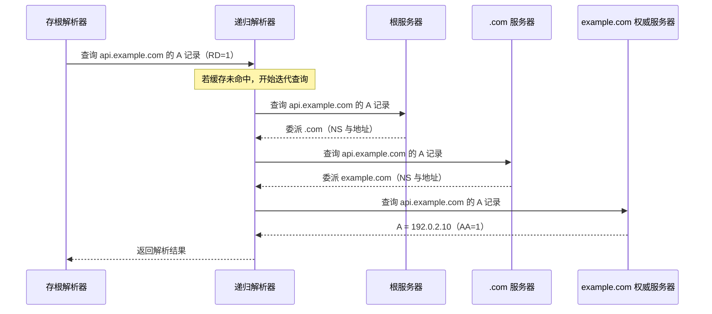
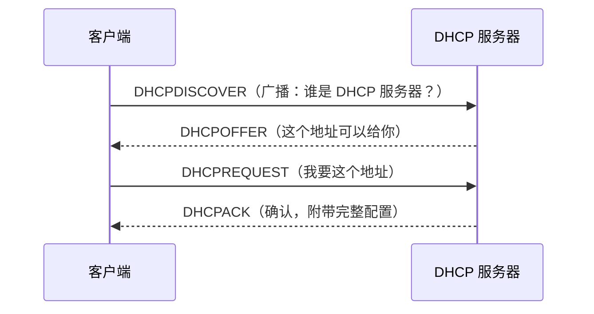

# 计算机网络｜05-应用层：DNS 与基础协议

客户端写下 `https://api.example.com/v1/articles` 时，真正要解决的第一个问题不是 HTTP，而是“`api.example.com` 是谁”；设备第一次连上 Wi-Fi 时，甚至连自己的 IP 地址、子网掩码和网关都还没有。DNS（Domain Name System，域名系统）与 DHCP（Dynamic Host Configuration Protocol，动态主机配置协议）负责的正是这些发生在业务请求之前、却决定业务请求能否成立的事情。

常见的做法是把它们背成口诀：“DNS 用 UDP 53，超过 512 字节才用 TCP”“DHCP 就是自动分配 IP”“FTP 有 21 和 20 两个端口”。只要环境稍微偏离教科书，口诀就会误导你：改了解析记录却不生效、抓包看到 TC 位、内网解析结果和企业网络不一致、邮件只能发不能收，都需要“角色 + 状态 + 记录语义”的模型来解释。

本文先说明应用层协议到底约定什么，再把 DNS 拆成命名、解析、记录与缓存、传输选择、加密五组问题，随后用同样的视角扫过 DHCP、FTP/SSH、邮件与端口表，最后用 `dig`、`nslookup` 和 DoH 把这些结论变成可观察的现象。

<!-- GFM-TOC -->
* [应用层协议到底约定什么](#应用层协议到底约定什么)
* [名字系统为什么必须分布式分层](#名字系统为什么必须分布式分层)
* [一次解析：存根、递归解析器与迭代](#一次解析存根递归解析器与迭代)
    * [三个角色的分工](#三个角色的分工)
    * [迭代查询的典型路径](#迭代查询的典型路径)
    * [多个地址与 Happy Eyeballs](#多个地址与-happy-eyeballs)
* [记录、别名、TTL 与缓存](#记录别名ttl-与缓存)
    * [记录类型回答什么问题](#记录类型回答什么问题)
    * [CNAME 的边界](#cname-的边界)
    * [TTL 是上限而不是承诺](#ttl-是上限而不是承诺)
    * [负缓存](#负缓存)
    * [用字节读一条真实响应](#用字节读一条真实响应)
    * [用代码复现 TTL 语义](#用代码复现-ttl-语义)
* [DNS 的传输选择：UDP、TCP 与 EDNS](#dns-的传输选择udptcp-与-edns)
    * [经典 DNS 的两种传输](#经典-dns-的两种传输)
    * [EDNS(0) 改变了什么](#edns0-改变了什么)
    * [用代码写一次查询](#用代码写一次查询)
* [加密 DNS 与 DNSSEC 解决不同问题](#加密-dns-与-dnssec-解决不同问题)
    * [三种加密传输：DoT、DoH、DoQ](#三种加密传输dotdohdoq)
    * [DNSSEC 管认证不管保密](#dnssec-管认证不管保密)
    * [严格与机会式两种部署姿态](#严格与机会式两种部署姿态)
* [DHCP：设备如何获得地址、网关与解析器](#dhcp设备如何获得地址网关与解析器)
    * [DORA 四步](#dora-四步)
    * [为什么必须广播](#为什么必须广播)
    * [租约与中继](#租约与中继)
    * [IPv6 的配置方式](#ipv6-的配置方式)
* [FTP、SSH 与 Telnet：名字相近不等于同一种协议](#ftpssh-与-telnet名字相近不等于同一种协议)
    * [FTP 的两个连接](#ftp-的两个连接)
    * [主动与被动模式](#主动与被动模式)
    * [FTPS、SFTP 与 Telnet](#ftpssftp-与-telnet)
* [电子邮件：发送、存储与读取是三件事](#电子邮件发送存储与读取是三件事)
    * [SMTP 负责投递](#smtp-负责投递)
    * [MIME、8BITMIME 与 SMTPUTF8](#mime8bitmime-与-smtputf8)
    * [POP3 与 IMAP](#pop3-与-imap)
* [默认端口是一张索引，不是协议定义](#默认端口是一张索引不是协议定义)
* [用 dig 观察 DNS，而不是猜缓存](#用-dig-观察-dns而不是猜缓存)
    * [查询与观察命令](#查询与观察命令)
    * [读输出：四个区与 flags](#读输出四个区与-flags)
    * [用 DoH 端到端复现](#用-doh-端到端复现)
    * [一个可复核的验证路径](#一个可复核的验证路径)
* [常见误区](#常见误区)
* [参考资料](#参考资料)
* [小结](#小结)
<!-- GFM-TOC -->

## 应用层协议到底约定什么

传输层交付的是字节流（TCP）或数据报（UDP）：[传输层：UDP、TCP与QUIC](./04-传输层：UDP、TCP与QUIC.md) 已经说明，TCP 不保留“一条消息”的边界，也完全不知道两个字节之间的内容代表什么。因此每个应用都需要自己约定四件事：

1. **消息如何起止**：是长度前缀、分隔符，还是定长结构。DNS 用首部里的计数字段和长度前缀的域名，SMTP 用“一行一条命令、`CRLF` 结束”，HTTP 用起始行 + 字段 + 空行 + 主体（语义与缓存细节见 [HTTP 语义、缓存与版本演进](./07-HTTP语义、缓存与版本演进.md)）。
2. **字段的语义**：同一条 `53` 字节里，哪些位是消息类型、哪些是“请递归”、哪些是错误码。
3. **角色与状态**：谁先说话、必须按什么顺序、失败后如何重试。SMTP 必须先 `EHLO` 再 `MAIL FROM`，FTP 的控制连接和数据连接状态是分开的，DNS 的存根解析器只管发问和等答复。
4. **错误模型**：错误码、超时、重试和回退路径。DNS 的 RCODE、TC 位与 TCP 回退就是一套完整的错误约定，后面会展开。

端口号只是“默认哪个服务监听哪个端口”的注册约定，不是协议的身份。同一个协议可以换端口传输（DNS 的 53、853、443），同一个端口也可能承载不同协议（443 上既可能是 HTTPS，也可能是 DNS over HTTPS）。

协议、服务、实现是三个不同的概念：协议是 RFC 定义的语义；服务是网络里部署的端点；实现是 BIND、Unbound、Windows DNS 客户端这类具体软件。理解了这一点，“内网 DNS 和公网 DNS 返回不同结果”“代理终止了 HTTP 连接”就不奇怪了——你面对的是同一协议的不同服务与中间设备，而中间设备可以按自己的策略改变可见行为。

## 名字系统为什么必须分布式分层

今天的直觉是“域名当然要有一张全球统一的地图”。但在 DNS 之前，主机名到地址的映射由网络信息中心（NIC）维护在**唯一一份文件** `HOSTS.TXT` 中，所有主机靠 FTP 下载它；一个组织想让自己的改动对全互联网可见，必须等 NIC 更新这份文件。随着主机数量增长，这种集中式方案既无法承载规模，也无法满足各组织独立管理名字空间的需求，DNS 因此诞生。[R1]

DNS 的做法是把名字空间切成一棵树，并把管理权下放：

```mermaid
flowchart TB
flowchart TB
  root["根区 .：13 个根服务器标识，部署为大量任播实例"]
  root --> com["com.（顶级域）"]
  root --> cn["cn.（顶级域）"]
  com --> examplecom["example.com.（zone 起点）"]
  examplecom --> www["www.example.com."]
  examplecom --> api["api.example.com."]
  cn --> examplecn["example.cn."]
```

- **区（zone）**是权威数据的实际管理单位，一个区把自己的子域“委派”给另一个区，靠的是父区里的 NS 记录指向子区的权威服务器。
- **根区**只负责委派顶级域；根服务器是“网络中有数百台、配置为 13 个名字”的一组实例，而不是 13 台物理机器。[R18]
- 域名不等于主机名：DNS 名称可以标识主机、邮箱域、服务、任意文本（TXT），主机名只是其中一部分。[R3]

DNS 的层次结构是**委派与管理边界**，不是“查询必须从根逐层走完”。查询路径上的每一层只对自己区内的数据权威，其余部分它只能告诉你“下一步该问谁”；缓存会把大部分层级直接剪掉。

## 一次解析：存根、递归解析器与迭代

### 三个角色的分工

| 角色 | 所在位置 | 职责 |
|---|---|---|
| 存根解析器（stub resolver） | 操作系统/应用内 | 按系统配置把查询发给一个递归解析器，等答复；自己不做迭代 |
| 递归解析器（recursive resolver） | 运营商、企业、公共 DNS | 代替客户端完成迭代查询，按 TTL 缓存结果 |
| 权威服务器（authoritative server） | 域名持有者的区 | 对指定区内数据给出权威答复（AA 位） |

终端发出去的那一次查询，标志位里通常带 `RD=1`（Recursion Desired），“递归”与“迭代”这两个术语在 RFC 1034/1035 与 DNS 术语表 RFC 8499 中有明确区分。[R1][R3]

递归与迭代发生在不同的一对角色之间：终端向递归解析器发出一次带 RD=1 的请求后就不再参与；真正的迭代查询由递归解析器完成。把“浏览器逐台询问根服务器”当模型，会把一次请求误判成几十次往返。

### 迭代查询的典型路径

以 `api.example.com` 的 A 记录为例（真实实现会有缓存、QNAME 最小化等优化，这里给出教学模型）：



几个容易被忽略的细节：

- 根和 TLD 通常不直接给出最终 A/AAAA，而是返回**委派信息**：AUTHORITY 区里的 NS 记录，外加 ADDITIONAL 区里的“胶水”（glue）地址，避免解析器为了找 NS 的地址再递归一次。
- 权威服务器可能返回 CNAME（别名），解析器需要沿链继续查，直到拿到地址记录或失败。
- 每一步都可能命中缓存而提前结束。

> **面试高频：** 根服务器会不会直接返回最终 IP？递归和迭代分别发生在哪一段？
> **答题脉络：** 先分角色（存根/递归解析器/权威）→ 客户端只发一次 RD=1 的查询 → 解析器逐级迭代，根与 TLD 多给委派 → 权威给最终记录 → 缓存如何短路。
> **追问方向：** 胶水记录、CNAME 链、QNAME 最小化、根服务器任播实例。

### 多个地址与 Happy Eyeballs

一个名字可能同时有 A（IPv4）和 AAAA（IPv6）记录，客户端拿到的是一个地址列表。某个地址族在当前网络里不通（例如 IPv6 只有本地链路地址）时，如果串行尝试，用户就要先等第一个地址超时。RFC 8305 描述的做法是并发/快速轮换尝试：先试列表中靠前的地址，等待一小段时间没有进展就发起下一个，谁先握手成功用谁。RFC 8305 建议的默认等待是 250 ms，但这是**默认建议值**，实现可以基于历史 RTT 或配置调整，不要把它当成浏览器的固定常数。[R25] DNS 只负责给出候选地址，之后的连接、加密与 HTTP 语义见 [一次网络请求的完整旅程](./06-一次网络请求的完整旅程.md)。

## 记录、别名、TTL 与缓存

### 记录类型回答什么问题

| 记录 | 类型号 | 回答的问题 | 关键边界 |
|---|---|---|---|
| A | 1 | 名字对应的 IPv4 地址 | 一个名字可以有多条 A（负载均衡/就近调度） |
| AAAA | 28 | 名字对应的 IPv6 地址 | 没有 AAAA 不等于解析失败[R7] |
| CNAME | 5 | “这个名字其实是另一个名字” | 是别名不是地址；同一节点通常不能再有其他数据[R4] |
| NS | 2 | 哪个区/服务器对该名字权威 | 委派靠它；根区只用它指向 TLD |
| MX | 15 | 发往该域的邮件交给谁 | 带优先级，小的先试 |
| TXT | 16 | 任意文本 | SPF、DKIM、DMARC、域名验证都借用它 |
| SOA | 6 | 区的权威元数据 | 负缓存 TTL 从它的 MINIMUM 字段派生[R5] |
| PTR | 12 | 地址对应的名字（反查） | 需要专门的 `in-addr.arpa` / `ip6.arpa` 区[R7] |
| SRV | 33 | 某服务在哪台主机、哪个端口 | 下划线前缀（如 `_sip._tcp`） |
| HTTPS / SVCB | 65 / 64 | 服务参数（ALPN、端口、IP 提示等） | 2023 年才成为标准，客户端支持并不统一[R13] |

### CNAME 的边界

CNAME 的语义是“把这个名字当作另一个名字处理”。规范明确：CNAME 记录的节点上不应再出现其他数据（历史上允许伴随 DNSSEC 相关记录），否则同名数据的“别名来源”会互相矛盾。[R1][R4] 这条规则带来两个后果：

- 需要 NS/SOA 的区顶点（例如 `example.com` 本身）通常不能是 CNAME；一些厂商提供的“CNAME 拉平/ALIAS”是平台自己合成的行为，不是标准特性。
- 解析器拿到 CNAME 后必须继续追链，客户端不能只用第一条回答，也不能假设链只有一跳。

### TTL 是上限而不是承诺

TTL（Time To Live，生存时间）是一个 32 位无符号数（有效范围 0 到 2^31−1），表示**记录最多可以被缓存多久**；规范强调它是“maximum time to live, not a mandatory time to live”。[R4] 实施语义上有三点：

1. 解析器可以**少缓存**（例如按上限裁剪、内存压力下提前淘汰），但不能超过 TTL 继续使用。
2. 从缓存里答出来时，TTL 通常已被递减；所以 `dig` 看到的 TTL 一般小于权威服务器上的配置值。
3. `TTL=0` 的语义是“不要缓存”，常用于需要快速切换的场景。

“改了解析记录却不生效”不是 DNS 出错，而是旧副本还在各级缓存的 TTL 之内。TTL 决定的是**最坏情况下要等多久**，不同网络、不同解析器命中不同副本，看到新值的时间自然不同。

### 负缓存

“这个名字不存在”（NXDOMAIN）和“这个名字存在但没有该类型的记录”（NODATA）同样是昂贵的查询结果，可以缓存。RFC 2308 规定负缓存时间取该区 SOA 的 MINIMUM 字段与 SOA 自身 TTL 的**较小值**；RFC 9520 进一步要求缓存解析失败（例如解析器收不到任何有用答复）与 DNSSEC 验证失败的结果，避免失败查询被反复放大。[R5][R6]

### 用字节读一条真实响应

下面这条 61 字节响应是 2026-09-22 用 DoH 查询 `example.com` 时捕获的原始报文（首次查询的 ID 设为 0）：

```text
00000000: 0000 8180 0001 0002 0000 0000 0765 7861
00000010: 6d70 6c65 0363 6f6d 0000 0100 01c0 0c00
00000020: 0100 0100 0000 3700 0468 1417 9ac0 0c00
00000030: 0100 0100 0000 3700 04ac 4293 f3
```

逐段读出来：

- 前 12 字节是首部：`0x0000` 是 ID，`0x8180` 中 QR=1、RD=1、RA=1、RCODE=0，QDCOUNT=1、ANCOUNT=2。
- 偏移 `0x0c` 开始是问题：`07 65 78 61 6d 70 6c 65` 是长度前缀的 `example`，`03 63 6f 6d` 是 `com`，`00` 是根标签；后面 4 字节是 QTYPE=A、QCLASS=IN。
- 偏移 `0x1d` 起是第一条答案：名字是 `c0 0c`——两个字节的**压缩指针**，指向偏移 12 已经出现过的 `example.com`；接着是 TYPE=A、CLASS=IN、TTL=`0x00000037`（55 秒）、RDLENGTH=4 和 4 字节地址 `68 14 17 9a`（104.20.23.154）。
- 第二条答案复用同一个指针，地址是 `ac 42 93 f3`（172.66.147.243）。每条答案占 16 字节：2 字节压缩指针 + 10 字节固定字段（类型 2、类 2、TTL 4、RDLENGTH 2）+ 4 字节地址数据。

地址和 TTL 会随时间变化，但报文结构不变；这也解释了为什么“重复出现的名字”要用压缩指针，否则答案区会被域名反复撑大。

### 用代码复现 TTL 语义

把缓存规则写成代码，能直观看出“上限”意味着什么：

```dart
// 前置条件：Dart 3.x；纯 Dart。时钟通过构造函数注入，便于演示 TTL 到期。
// 目标：演示解析器缓存的核心语义——未过期命中，到期即失效。
class DnsCacheEntry {
  DnsCacheEntry({required this.address, required this.expiresAt});

  final String address;
  final DateTime expiresAt;
}

/// 按键存取的极简缓存，只保留命中与过期两条规则。
class DnsCache {
  DnsCache({required this.clock});

  /// 注入的时钟：固定它就能观察 TTL 到期。
  final DateTime Function() clock;
  final Map<String, DnsCacheEntry> _entries = {};

  int get length => _entries.length;

  void put(String name, String address, {required int ttlSeconds}) {
    _entries[name.toLowerCase()] = DnsCacheEntry(
      address: address,
      expiresAt: clock().add(Duration(seconds: ttlSeconds)),
    );
  }

  String? get(String name) {
    final key = name.toLowerCase();
    final entry = _entries[key];
    if (entry == null) return null;

    // 1. 到期即视为不存在，下一次访问必须重新查询。
    //    相等也算过期：TTL 是“最多可缓存多久”，不是“保底缓存多久”。
    if (!clock().isBefore(entry.expiresAt)) {
      _entries.remove(key);
      return null;
    }
    return entry.address;
  }
}
```

<!-- verify: .work/verify/B11/lib/dns_cache.dart -->

验证脚本里 `TTL=300` 的条目在 `+299s` 命中、`+300s` 失效，`TTL=0` 的条目从未命中（见文末验证记录）。

> **面试高频：** 为什么改了 DNS 记录，不同用户看到新值的时间不同？
> **答题脉络：** TTL 是缓存上限 → 各级缓存（系统、解析器、必要时浏览器）持有不同副本 → 谁先过期谁先看到新值 → 极长的 TTL 与负缓存会放大等待。
> **追问方向：** 负缓存 TTL 从哪来、CNAME 链刷新、TTL=0 的代价、权威服务器改 TTL 是否影响已有缓存。

## DNS 的传输选择：UDP、TCP 与 EDNS

### 经典 DNS 的两种传输

RFC 1035 把 DNS 放到两种传输上：

- 普通查询用 **UDP 53**，轻量、无需握手；报文被限制在 512 字节以内，超长就截断并置 **TC 位**。
- **TCP 53** 用于区域传送（AXFR/IXFR）和超长消息；UDP 不适合区域传送。[R2][R10]

“响应超过 512 字节 → 一定改用 TCP”是这份古老约定的粗糙记忆版。现代的完整链路是：

1. 服务器发现应答放不下（无 EDNS 时按 512 字节算），截断并置 TC=1；
2. 客户端看到 TC 位后**改用 TCP 重试**。[R9]
3. 支持 EDNS(0) 的客户端可以在查询里声明自己能接收的 UDP 载荷大小，服务器在这个范围内直接发大 UDP 响应，不必截断；但声明过大可能触发 IP 分片，反而不安全。

RFC 7766 之后还有一个关键变化：**完整实现必须支持 TCP**，区域传送仍必须走 TCP，TCP 连接复用、查询流水线也成为正规做法。[R9]

### EDNS(0) 改变了什么

EDNS(0)（Extension Mechanisms for DNS，版本 0）通过一条 **OPT 伪记录**扩展协议，它不携带数据，只承载元信息：[R8]

| OPT 字段 | 含义 |
|---|---|
| 记录类型 41 | 标记这是 EDNS(0) 的 OPT 记录 |
| CLASS | 请求方的 UDP 载荷上限；**缺少 OPT 时按 512 字节处理**，小于 512 的值按 512 处理 |
| TTL 字段 | 不表示缓存时间，被复用为扩展 RCODE、版本号和 DO 位（请求 DNSSEC 记录） |
| 附加数据 | 各类 EDNS 选项，例如 Cookie、EDE 错误明细 |

决定“要不要用 TCP”的是截断与实现约定，不是“响应是否大于 512 字节”这一条。实践中的推荐做法是申请一个能避免 IP 分片的保守载荷（DNS Flag Day 2020 的建议值是 1232 字节），分片在现实中不可靠，也更容易被滥用。[R19]

### 用代码写一次查询

把前面的规则写成代码，可以看到 12 字节首部、长度前缀域名与 EDNS 记录的真实布局。

前置条件：Dart 3.x；纯 Dart，只使用 `dart:typed_data`。下面是 `.work/verify/B11/lib/dns_message.dart` 中 `buildQuery` 的逐字节选（`import` 与记录类型常量在文件开头，`DnsHeader.parse` 与 `decodeName` 在文件后部）：

```dart
/// 构造查询消息：QR=0、Opcode=0、RD=1。
/// [udpPayloadSize] 非空时追加一条 EDNS(0) OPT 伪记录。
Uint8List buildQuery({
  required int id,
  required String name,
  int qtype = typeA,
  int? udpPayloadSize,
}) {
  final message = BytesBuilder();

  // 1. 12 字节首部：ID、flags 和四个计数字段（ARCOUNT 取决于是否带 OPT）。
  message.add(
    (ByteData(12)
          ..setUint16(0, id)
          ..setUint16(2, 0x0100) // QR=0、Opcode=0、RD=1
          ..setUint16(4, 1) // QDCOUNT
          ..setUint16(10, udpPayloadSize == null ? 0 : 1)) // ARCOUNT
        .buffer
        .asUint8List(),
  );

  // 2. QNAME：长度前缀标签，最后以 0 长度的根标签收尾。
  //    这个教学构造器只接受 ASCII 域名；非 ASCII 名称应先经过 IDNA/Punycode。
  final labels = name == '.'
      ? <String>[]
      : (name.endsWith('.')
          ? name.substring(0, name.length - 1).split('.')
          : name.split('.'));
  if (name.isEmpty || labels.any((label) => label.isEmpty)) {
    throw ArgumentError('域名标签不能为空：$name');
  }
  var wireLength = 1; // 末尾根标签的一个字节。
  for (final label in labels) {
    final codeUnits = label.codeUnits;
    if (codeUnits.any((unit) => unit > 0x7f)) {
      throw ArgumentError('教学构造器只接受 ASCII 标签，请先做 IDNA/Punycode：$label');
    }
    if (codeUnits.length > 63) {
      throw ArgumentError('标签长度必须在 1—63 字节之间：$label');
    }
    wireLength += 1 + codeUnits.length;
    if (wireLength > 255) throw ArgumentError('域名线格式长度超过 255 字节：$name');
    message.addByte(codeUnits.length);
    message.add(codeUnits);
  }
  message.addByte(0);

  // 3. QTYPE 与 QCLASS。
  message.add(
    (ByteData(4)
          ..setUint16(0, qtype)
          ..setUint16(2, classIn))
        .buffer
        .asUint8List(),
  );

  // 4. 可选 EDNS(0)：OPT 伪记录，CLASS 字段携带请求方 UDP 载荷上限。
  if (udpPayloadSize != null) {
    final opt = ByteData(11)
      ..setUint16(1, typeOpt)
      ..setUint16(3, udpPayloadSize);
    // 名字为根（单字节 0）；TTL 字段保存扩展 RCODE 与 DO 位，此处全 0。
    message.add(opt.buffer.asUint8List());
  }
  return message.toBytes();
}
```

<!-- verify: .work/verify/B11/lib/dns_message.dart -->

同一个文件里还有 `DnsHeader.parse`（读取 TC、RA、RCODE 等位）和 `decodeName`（处理后面的压缩指针）。运行结果：`buildQuery(id: 0x1234, name: 'example.com')` 恰好 29 字节，`udpPayloadSize: 1232` 的版本 40 字节且 ARCOUNT=1。

> **面试高频：** DNS 为什么同时用 UDP 和 TCP？
> **答题脉络：** UDP 承担绝大多数无状态的普通查询；TCP 承担区域传送、截断后的重试与加密传输的承载 → EDNS(0) 让 UDP 携带的响应更大 → TC 位是唯一的“请改用 TCP”信号 → RFC 7766 起 TCP 支持是硬要求。
> **追问方向：** 512 字节从哪来、EDNS 载荷大小与分片、AXFR 为什么必须 TCP、DoH/DoT 让 DNS 变成什么形态。

## 加密 DNS 与 DNSSEC 解决不同问题

### 三种加密传输：DoT、DoH、DoQ

传统 DNS 查询在链路上明文可见：同网络的人能看到你查了哪些域名，也能伪造响应——原协议对响应的认证基本只依赖源 IP，而源 IP 可以伪造。[R20] 三种标准化方案把 DNS 消息放进加密传输：DNS over TLS（DoT）、DNS over HTTPS（DoH）与 DNS over QUIC（DoQ）。

| 方案 | RFC | 传输与端口 | 形态 |
|---|---|---|---|
| DoT | RFC 7858 | TLS over TCP，默认 853 | 专用加密连接；RFC 7858 明确要求默认端口 853，且禁止在该端口上走明文 |
| DoH | RFC 8484 | HTTPS，443 | DNS 消息是 HTTP 请求/响应体，媒体类型 `application/dns-message`，GET（`?dns=` base64url）与 POST 都必须支持 |
| DoQ | RFC 9250 | QUIC，IANA 登记 853/udp | 每条查询一个独立双向流，天然并行、支持连接迁移 |

DoH 的 GET 形式对 HTTP 缓存友好，RFC 8484 因此建议客户端把 DNS ID 设为 0，让等价查询产生相同的缓存键。[R11] 三种方案复用的都是已有的 TLS/QUIC 安全通道，握手、证书与信任模型属于 [HTTPS 与 TLS](./08-HTTPS与TLS.md) 的主题。

### DNSSEC 管认证不管保密

DNSSEC（DNS Security Extensions）不是加密传输，而是给**数据本身**签名：区用私钥对记录集生成 RRSIG，公钥以 DNSKEY 发布，父区用 DS 记录“担保”子区公钥的哈希，从而把信任链一路连到根区——根区的信任锚（KSK）从 2010 年起就已经在验证链上工作。[R12][R20]

它保证的是来源真实性与完整性：数据没有在传输或缓存中被篡改。它**不保证机密性**：查询名、响应内容在传统传输上仍然可见。反过来，DoT/DoH/DoQ 保证的是客户端到解析器之间链路的机密性与完整性，**不保证数据本身是对的**——你仍然要信任所选的解析器。

加密 DNS 与 DNSSEC 是两套正交机制。DoH 只是把“谁能看到你的查询”从本地链路转移到了你选择的解析器；DNSSEC 则是让被篡改的数据能被检测出来，两者可以同时启用，但都不能替代对方。

> **面试高频：** DoH/DoT 和 DNSSEC 有什么区别？
> **答题脉络：** 先分保护对象（链路 vs 数据）→ DoT/DoH/DoQ 的端口与形态 → DNSSEC 的信任链（RRSIG/DNSKEY/DS）与“不加密”结论 → 为什么启用 DoH 后解析器仍然看得到查询名。
> **追问方向：** Strict/Opportunistic 的区别、DoH 的 HTTP 缓存、DNSSEC 验证失败为什么先缓存、根区信任锚。

### 严格与机会式两种部署姿态

RFC 8310 把客户端使用加密 DNS 的方式分成两种姿态：**Strict Privacy**（必须加密且验证服务器身份，失败就拒绝解析）与 **Opportunistic Privacy**（尝试加密，失败可以退回明文）。[R11]

> **时效信息（核查日期：2026-09）：** 加密 DNS 的默认策略随系统与浏览器版本、地区变化，不能写成“现在默认都开”。可核查的例子：Android 9 起提供 Private DNS，默认会“在网络 DNS 服务器支持时自动升级到 DNS over TLS”，即机会式 DoT；[R23] Windows Server 2022 起，DNS 客户端支持 DoH，但只有在所选 DNS 服务器位于“已知 DoH 服务器”列表时才能启用，并要求管理员选择“仅加密”或“优先加密、允许回退”。[R22] 浏览器侧（Chrome 的“安全 DNS”、Firefox 的 DNS over HTTPS）都提供显式开关，具体默认行为请以你所用版本的官方说明为准。

## DHCP：设备如何获得地址、网关与解析器

### DORA 四步

设备接入网络时，需要的不只是 IP 地址，还有子网掩码、默认网关和解析器地址。DHCPv4 用四个报文完成自动协商：[R14]



| 项 | DHCPv4 事实 |
|---|---|
| 传输与端口 | UDP；客户端 68、服务器 67 |
| 固定字段 | 236 字节 BOOTP 结构：op/htype/hlen/hops、xid、secs、flags、ciaddr/yiaddr/siaddr/giaddr、chaddr、sname、file |
| 魔术字 | 固定字段后是 4 字节魔术字 `99.130.83.99`（`0x63825363`），再往后是 TLV 选项 |
| 常用选项 | 53 消息类型、55 参数请求列表、1 子网掩码、3 路由器、6 解析器 |
| 租约时间 | 默认 T1 = 0.5 × 租期，T2 = 0.875 × 租期[R14] |

### 为什么必须广播

客户端此时没有可用 IP，因此源地址是 `0.0.0.0`、目的地址是受限广播（`255.255.255.255`）或子网广播，链路层用广播 MAC；服务器的答复可以按 `chaddr` 单播，也可以按 flags 里的广播位走广播。[R14] 广播范围由子网划分决定；二层泛洪与交换机转发见 [物理层与数据链路层](./02-物理层与数据链路层.md)，相关计算与转发路径见 [网络层：IP、路由与地址解析](./03-网络层：IP、路由与地址解析.md)。

DHCP 的分配范围是**一条链路（一个子网）**。客户端用广播找到的是同一链路内的服务器；跨子网必须由 DHCP 中继把请求转发出去，中继地址写在 `giaddr` 字段里，服务器据此选地址池、决定把答复发到哪里。

### 租约与中继

- 地址不是永久归属，而是租约：到 T1 客户端开始单播续租，T2 之后改用广播向任意服务器请求，租约到期未续上就释放地址。
- 请求与续租的区别在于前者用广播寻找“任意服务器”，后者已经知道具体服务器，可以直接单播。
- 中继代理让 DHCP 不依赖“服务器和客户端同网段”：路由器上配置的中继把广播转成单播交给中心 DHCP 服务器，并把接收接口地址写进 `giaddr`。
- DHCP 只负责**分发配置**。解析器地址从这里来，名字解析仍然由 DNS 完成，两者不能互相替代。

### IPv6 的配置方式

IPv6 主机可以完全不依赖 DHCPv6：**SLAAC（Stateless Address Autoconfiguration，无状态地址自动配置）**根据路由器通告（RA）里的前缀加接口标识生成地址，并通过邻居发现（NDP）完成重复地址检测。[R17] 需要下发 DNS、NTP 等更多参数或需要集中地址管理时，可以同时使用 DHCPv6：它的报文（SOLICIT/ADVERTISE/REQUEST/REPLY）与端口（客户端 546、服务器 547）和 v4 不同，但“请求—提供—确认”的骨架类似。RA 中的 M/O 标志告诉主机“要不要去要 DHCPv6”。[R15][R16]

> **面试高频：** DHCPv4 的 DORA 与中继分别在解决什么？
> **答题脉络：** 还没有地址所以必须广播 → 先 Discover/Offer 选择服务器，再 Request/Ack 确认 → 同网段不需要中继，跨网段用 giaddr → 租约 T1/T2 续租。
> **追问方向：** 客户端无地址时源/目的地址怎么填、为什么需要 xid、IPv6 的 SLAAC 与 DHCPv6 如何共存。

## FTP、SSH 与 Telnet：名字相近不等于同一种协议

### FTP 的两个连接

FTP（File Transfer Protocol，文件传送协议）最独特的设计是**控制连接与数据连接分离**：[R24]

- 控制连接：客户端连服务器 21，发送命令、接收应答（命令行协议，和 SMTP 类似）。
- 数据连接：每次传输文件/目录列表时另开一条，传输结束即关闭。

> 控制连接与数据连接是两条独立的 TCP 连接：命令与应答都走控制连接，文件内容只在数据连接上流动。这也决定了防火墙要同时考虑“谁发起连接、连哪个端口”。

### 主动与被动模式

| 模式 | 谁发起数据连接 | 端口 | 典型问题 |
|---|---|---|---|
| 主动（PORT/EPRT） | 服务器 → 客户端 | 服务器通常从 20 发起；客户端通过 `PORT`/`EPRT` 指定接收端口（历史实现常用控制连接端口 + 1） | 客户端防火墙会拦入站连接，需要放行 |
| 被动（PASV/EPSV） | 客户端 → 服务器 | 服务器在一个临时端口上监听，端口由服务器指定 | 服务器需要开放一段端口范围；旧式“被动更不安全”的说法把运维配置问题当成了协议属性 |

被动模式之所以在 NAT 与防火墙环境更常见，是因为它把数据连接变成客户端发起的出站连接；代价是服务器要暴露一段可用的临时端口。EPSV/EPRT 是 IPv6 与 NAT 场景下扩展的命令形式。[R24]

### FTPS、SFTP 与 Telnet

- **FTPS** 是“FTP over TLS”，在现有 FTP 协议上加 TLS（RFC 4217），仍然保留双连接结构。
- **SFTP** 和 FTP 没有血缘关系：它是 SSH 连接里的一个子系统，由 SSH 通道承载文件操作。OpenSSH 的 sftp 与 sftp-server 实现的是 SSH 文件传输协议草案的 revision 3。[R24b]
- **Telnet**（RFC 854）提供了“网络虚拟终端”（NVT）抽象，让不同终端系统用统一的换行与字符约定通信；它明文传输且无强认证，属于历史机制，现代远程登录应使用 SSH（RFC 4251 等）。[R26] 不过 Telnet 客户端作为“裸 TCP 调试器”仍有价值，比如 `telnet example.com 80` 观察服务器返回的响应头。

> **面试高频：** FTP 为什么要两条连接？主动和被动模式怎么选？
> **答题脉络：** 控制连接承载命令、数据连接承载文件 → 主动模式服务器回连客户端，容易被客户端防火墙拦 → 被动模式客户端出站连服务器，运维要用端口范围控制暴露面 → 别把 FTPS 与 SFTP 混为一谈。
> **追问方向：** 数据连接复用、EPSV/EPRT、TLS 与 SSH 的信任模型差别。

## 电子邮件：发送、存储与读取是三件事

邮件系统里“发信”和“收信”用的是两套协议、两台服务、两类状态。用户代理（MUA）把邮件提交给邮件服务器，服务器之间用 SMTP（Simple Mail Transfer Protocol，简单邮件传输协议）中继投递，收件人再用取信协议把邮件从邮箱同步到本地。

发送与读取是两组独立协议：SMTP 只负责把邮件推进下一台服务器，邮件真正留在收件人的邮箱里；POP3/IMAP 才是收件人取信与同步的协议。

### SMTP 负责投递

SMTP（RFC 5321）是**推送**协议，一次典型会话就是一条命令—应答流水线（示意会话，域名为文档保留域）：[R27]

```text
S: 220 mail.example.com ESMTP
C: EHLO sender.example.org
S: 250-mail.example.com
S: 250-SIZE 10485760
S: 250-STARTTLS
S: 250 8BITMIME
C: MAIL FROM:<alice@example.org>
S: 250 OK
C: RCPT TO:<bob@example.net>
S: 250 OK
C: DATA
S: 354 End data with <CR><LF>.<CR><LF>
C: Subject: hello
C: (邮件数据，单行 "." 表示结束)
C: .
S: 250 OK: queued
C: QUIT
S: 221 Bye
```

端口分工是这套机制里最容易被背错的部分：**25 是中继端口**（MTA 之间投递，历史上也用于提交）；**587 是提交端口**（客户端把邮件交给自己的服务器，RFC 6409 定义的标准提交端口）；**465 是同一种提交的隐式 TLS 版本**。[R28][R29] RFC 8314 把“明文访问邮件提交与收取服务”称为已被淘汰（obsolete）的做法，并推荐对 POP3、IMAP、SMTP 提交分别使用 995、993、465 这类“一连接上就握手”的隐式 TLS 端口。[R29]

### MIME、8BITMIME 与 SMTPUTF8

“SMTP 只能发送 ASCII”是另一个过期的绝对句。原始 SMTP 确实以 7 位 ASCII 为基准，但：

- **MIME（Multipurpose Internet Mail Extensions，多用途互联网邮件扩展）**（RFC 2045 等）在消息格式层解决了二进制与多语言内容的表示问题：`Content-Type`、`Content-Transfer-Encoding`、多部分消息等，**不修改也不取代 SMTP**。[R30]
- **8BITMIME**（RFC 6152）让服务器在 `EHLO` 中声明支持 8 位清洁的邮件体，不再强制转码。[R31]
- **SMTPUTF8**（RFC 6531）扩展 SMTP，允许信封与头部中出现非 ASCII 的 UTF-8 字符串。[R32]

消息的语法本身由 RFC 5322 定义，SMTP 负责的是“把它送到哪台服务器”，两者是不同层次的事。[R27b]

### POP3 与 IMAP

POP3（Post Office Protocol Version 3）与 IMAP（Internet Message Access Protocol）负责取信：

| 协议 | 端口（明文/TLS） | 模型 | 典型行为 |
|---|---|---|---|
| POP3 | 110 / 995 | 下载式会话：锁定邮箱、列出、取信、`DELE` 标记删除 | `DELE` 只是标记，真正删除发生在 `QUIT` 后进入 UPDATE 状态时；不同客户端的“保留副本”策略不同 |
| IMAP | 143 / 993 | 服务器端邮箱：文件夹、已读/标记、按需取部分内容 | 多设备同步的基础；协议已从 IMAP4rev1 更新到 IMAP4rev2（RFC 9051 取代 RFC 3501） |

RFC 1939 对 POP3 的删除行为写得很明确：`DELE` **标记**为删除，任何后续引用都报错，但直到会话进入 UPDATE 状态才真正执行删除。[R33] 所以“POP3 一读就删”是旧客户端默认策略的残留印象，不是协议规定。IMAP 侧的实现细节（文件夹语义、IDLE、部分抓取）则由服务器与客户端能力协商决定。[R34]

> **面试高频：** SMTP、POP3、IMAP 与 MIME 各自负责什么？
> **答题脉络：** SMTP 推送（提交 587、中继 25、隐式 TLS 465）→ 消息格式 RFC 5322 + MIME 内容编码 → POP3 下载式会话 vs IMAP 服务器侧同步 → 加密访问端口与“明文已淘汰”的现状。
> **追问方向：** STARTTLS 与隐式 TLS、8BITMIME/SMTPUTF8、DKIM/SPF/DMARC 借 TXT 记录的原因。

## 默认端口是一张索引，不是协议定义

下表只保留本文涉及的服务，端口与传输协议取自 IANA 的注册表；“默认/注册端口”意味着这是约定俗成的监听端口，**可以配置**。[R18b]

| 服务 | 端口与传输 | 用途 | 备注 |
|---|---|---|---|
| DNS | 53 UDP / 53 TCP | 普通查询 / 截断重试与区域传送 | 无 EDNS(0) 时 UDP 假定的上限是 512 字节 |
| DoT / DoQ | 853 TCP / 853 UDP | 加密 DNS（TLS / QUIC） | 明文 DNS 不允许出现在 853 |
| DHCPv4 | 67 UDP（服务器）/ 68 UDP（客户端） | 地址与网络配置 | 跨子网需要中继（giaddr） |
| DHCPv6 | 547 UDP（服务器）/ 546 UDP（客户端） | IPv6 配置 | 与 SLAAC 可以并存 |
| FTP | 21 TCP（控制）/ 20 TCP（主动模式数据） | 文件传输 | 被动模式的数据端口由服务器临时指定 |
| SSH | 22 TCP | 远程登录、文件传输、隧道 | SFTP 运行在 SSH 之上 |
| Telnet | 23 TCP | 远程终端（历史） | 明文，当前不推荐 |
| SMTP | 25 TCP | 服务器间中继 | 历史上也用于客户端提交 |
| Submission | 587 TCP | 邮件提交（STARTTLS） | RFC 6409 |
| Submissions | 465 TCP | 邮件提交（隐式 TLS） | RFC 8314 |
| POP3 | 110 TCP / 995 TCP | 收信 | 995 为隐式 TLS |
| IMAP | 143 TCP / 993 TCP | 收信与同步 | 993 为隐式 TLS |
| HTTP / HTTPS | 80 TCP / 443 TCP、443 UDP | Web 与 HTTP/3 | 443 上还可能承载 DoH 等基于 HTTPS 的协议 |

三点提醒：

1. 端口是可以改的。把 SSH 放到 2222、把 HTTP 放到 8080 都是常见操作；端口冲突时也可以靠 socket 的“四元组”（源地址、源端口、目的地址、目的端口）区分连接。
2. 同一端口不等于同一协议。443 既可能承载普通 HTTPS，也可能是 DoH 端点；QUIC 的 HTTP/3 走 443/UDP。
3. 用端口猜协议只适合做**第一跳排查**：`netstat` 里看到一个 853 端口，先把“可能是 DoT”当作线索，而不是结论。

> **面试高频：** 看端口号就能判断协议吗？
> **答题脉络：** 端口是 IANA 注册的默认值 → 可配置、可被代理终止、可跑非标准协议 → 判断协议要看握手与消息格式（TLS ClientHello、DNS 首部、HTTP 起始行）→ 端口只用于缩小范围。
> **追问方向：** 知名端口与临时端口、中间设备如何用 SNI/ALPN 分流、为什么 DoH 选择 443。

## 用 dig 观察 DNS，而不是猜缓存

### 查询与观察命令

`dig` 是 BIND 自带的诊断工具，最常用的形式如下（Windows 默认不带 `dig`，可用 `nslookup` 或 `Resolve-DnsName`）：[R21][R22b]

```bash
# 1. 查询 A 记录：问题、答案、TTL 与 flags 一眼可见
dig example.com A

# 2. 查询 AAAA 记录；没有 AAAA 记录是正常结果，不是故障
dig example.com AAAA

# 3. 指定解析器，绕开系统配置，确认不同解析器的差异
dig @1.1.1.1 example.com A

# 4. 从根提示开始自己迭代，观察委派链（与普通解析路径不同，需要能直连根/TLD）
dig +trace example.com

# 5. Windows 自带工具：不显示 TTL，但不需要额外安装
nslookup -type=MX gmail.com
```

上面的 `dig A` 会输出四个区（下例为示例输出；地址、顺序与 TTL 随解析器与时间变化，这里是 2026-09-22 对 `example.com` 的观测值）：

```text
; <<>> DiG 9 <<>> example.com A
;; ->>HEADER<<- opcode: QUERY, status: NOERROR, id: 1234
;; flags: qr rd ra; QUERY: 1, ANSWER: 2, AUTHORITY: 0, ADDITIONAL: 1

;; QUESTION SECTION:
;example.com.			IN	A

;; ANSWER SECTION:
example.com.		55	IN	A	104.20.23.154
example.com.		55	IN	A	172.66.147.243
```

`nslookup -type=MX gmail.com` 的真实输出（节选，顺序与偏好值来自本机观察）：

```text
gmail.com       MX preference = 10, mail exchanger = alt1.gmail-smtp-in.l.google.com
gmail.com       MX preference = 20, mail exchanger = alt2.gmail-smtp-in.l.google.com
gmail.com       MX preference = 30, mail exchanger = alt3.gmail-smtp-in.l.google.com
```

PowerShell 的等价入口是 `Resolve-DnsName`，输出字段为 `Name`、`Type`、`TTL`、`IPAddress` 等：

```powershell
Resolve-DnsName -Name example.com -Type A
```

### 读输出：四个区与 flags

一条 DNS 响应分四个区，排查时各有用处：

- **QUESTION**：你问的是什么（名字、类型）。
- **ANSWER**：最终答案；看 TTL 和记录类型。多条 A/AAAA 说明有多个候选地址。
- **AUTHORITY**：谁对这个区权威；负响应通常在这里带 SOA。
- **ADDITIONAL**：辅助数据（胶水地址、OPT 记录等）。

首部 flags 中最值得关注的是：`qr`（响应）、`aa`（权威）、`rd`（请求递归）、`ra`（服务器可递归）、`tc`（被截断，需要换 TCP）。`dig` 默认走系统的解析器，除非用 `@服务器` 指定；`+trace` 则绕过它，像递归解析器那样从根开始逐级发问。

### 用 DoH 端到端复现

把 DNS 消息装进 HTTP 请求体就是 DoH。先用已验证的代码生成查询（ID=0），再做一次真实调用：

```bash
# 1. 用 buildQuery(id: 0, name: "example.com") 生成的 29 字节查询，base64url（无填充）
#    AAABAAABAAAAAAAAB2V4YW1wbGUDY29tAAABAAE
curl -s -H 'accept: application/dns-message' \
  'https://cloudflare-dns.com/dns-query?dns=AAABAAABAAAAAAAAB2V4YW1wbGUDY29tAAABAAE' \
  -o response.bin
```

本机运行（2026-09-22）返回 `HTTP 200`，`Content-Type: application/dns-message`，响应体 61 字节，与前面的十六进制转储结构一致。查询也可以换成 POST：请求体是 DNS 线格式消息，`Content-Type` 同为 `application/dns-message`；两种方法服务端都必须支持。[R11]

### 一个可复核的验证路径

如果怀疑“是缓存还是服务器返回”的差异，按这个顺序排查：

1. `dig @指定解析器 名字 类型` 与 `dig @另一解析器 名字 类型` 对比，确认差异来自解析器而不是你的客户端缓存；
2. 看 ANSWER 里的 TTL：明显小于权威配置值时，说明命中了缓存；
3. `dig +trace 名字 类型` 直接观察委派链，验证是不是委派/胶水问题；
4. 换了记录后等待 `TTL` 时间再复测，而不是反复刷新客户端。

## 常见误区

- ❌ “DNS 解析成功就说明网页能打开。”
  ✅ DNS 只返回地址；建立连接、TLS 验证、HTTP 状态码与业务逻辑都在后面。解析失败只是请求旅程第一段的失败。

- ❌ “改了记录，所有人都应该立刻看到新的地址。”
  ✅ 各级缓存会保留旧副本直到 TTL 到期；不同网络、不同解析器看到变化的时间不同，负缓存也遵循自己的 TTL。

- ❌ “响应超过 512 字节就一定改用 TCP。”
  ✅ 512 是**没有 EDNS(0) 时** UDP 的原始上限；真正的信号是 TC 位触发的 TCP 重试。EDNS(0) 允许在声明范围内直接发更大的 UDP 响应，而避免分片通常比“越大越好”更重要。[R8][R19]

- ❌ “DNSSEC 会加密 DNS 查询。”
  ✅ DNSSEC 给数据签名，提供来源真实性/完整性；保密是 DoT/DoH/DoQ 的职责，两者互不替代。[R12]

- ❌ “用了 DoH，就没人知道我查了什么。”
  ✅ 本地链路看不到了，但你选择的解析器（以及它向外的查询）仍然能看到域名；隐私边界发生了转移，而不是消失。

- ❌ “DHCP 负责解析域名。”
  ✅ DHCP 分发的是地址、掩码、网关和**解析器地址**；把名字变成地址始终是 DNS 的工作。

- ❌ “端口 53 一定是 DNS，853 一定是 DoT。”
  ✅ 这些是 IANA 注册的默认端口，可以配置；判断协议要看握手与消息格式，而不是端口号。[R18b]

- ❌ “明文 FTP/Telnet 只是‘老一点’的做事方式。”
  ✅ 它们缺少机密性与现代认证强度，属于当前不推荐的方案；邮件侧 RFC 8314 也把明文提交/收取称为已淘汰的做法，推荐隐式 TLS 端口。[R29]

## 参考资料

- [R1] [RFC] [RFC 1034: Domain Names — Concepts and Facilities](https://www.rfc-editor.org/rfc/rfc1034) — IETF，[核查日期：2026-09]。
- [R2] [RFC] [RFC 1035: Domain Names — Implementation and Specification](https://www.rfc-editor.org/rfc/rfc1035) — IETF，[核查日期：2026-09]。
- [R3] [RFC] [RFC 8499: DNS Terminology](https://www.rfc-editor.org/rfc/rfc8499) — IETF，BCP 219，[核查日期：2026-09]。
- [R4] [RFC] [RFC 2181: Clarifications to the DNS Specification](https://www.rfc-editor.org/rfc/rfc2181) — IETF，[核查日期：2026-09]。
- [R5] [RFC] [RFC 2308: Negative Caching of DNS Queries](https://www.rfc-editor.org/rfc/rfc2308) — IETF，[核查日期：2026-09]。
- [R6] [RFC] [RFC 9520: Negative Caching of DNS Resolution Failures](https://www.rfc-editor.org/rfc/rfc9520) — IETF，[核查日期：2026-09]。
- [R7] [RFC] [RFC 3596: DNS Extensions to Support IP Version 6](https://www.rfc-editor.org/rfc/rfc3596) — IETF，[核查日期：2026-09]。
- [R8] [RFC] [RFC 6891: Extension Mechanisms for DNS (EDNS(0))](https://www.rfc-editor.org/rfc/rfc6891) — IETF，[核查日期：2026-09]。
- [R9] [RFC] [RFC 7766: DNS Transport over TCP](https://www.rfc-editor.org/rfc/rfc7766) — IETF，[核查日期：2026-09]。
- [R10] [RFC] [RFC 5936: DNS Zone Transfer Protocol (AXFR)](https://www.rfc-editor.org/rfc/rfc5936) — IETF；另见 [RFC 1995: Incremental Zone Transfer in DNS](https://www.rfc-editor.org/rfc/rfc1995)，[核查日期：2026-09]。
- [R11] [RFC] [RFC 7858: DNS over TLS](https://www.rfc-editor.org/rfc/rfc7858)、[RFC 8484: DNS Queries over HTTPS](https://www.rfc-editor.org/rfc/rfc8484)、[RFC 9250: DNS over Dedicated QUIC Connections](https://www.rfc-editor.org/rfc/rfc9250)、[RFC 8310: Usage Profiles for DNS over TLS and DNS over DTLS](https://www.rfc-editor.org/rfc/rfc8310) — IETF，[核查日期：2026-09]。
- [R12] [RFC] [RFC 4033](https://www.rfc-editor.org/rfc/rfc4033)、[RFC 4034](https://www.rfc-editor.org/rfc/rfc4034)、[RFC 4035](https://www.rfc-editor.org/rfc/rfc4035)：DNSSEC 引入与协议修改 — IETF，[核查日期：2026-09]。
- [R13] [RFC] [RFC 9460: Service Binding and Parameter Specification via the DNS (SVCB and HTTPS Resource Records)](https://www.rfc-editor.org/rfc/rfc9460) — IETF，[核查日期：2026-09]。
- [R14] [RFC] [RFC 2131: Dynamic Host Configuration Protocol](https://www.rfc-editor.org/rfc/rfc2131) — IETF，[核查日期：2026-09]。
- [R15] [RFC] [RFC 9915: Dynamic Host Configuration Protocol for IPv6 (DHCPv6)](https://www.rfc-editor.org/rfc/rfc9915) — IETF，STD 102，取代 RFC 8415，[核查日期：2026-09]。
- [R16] [RFC] [RFC 4861: Neighbor Discovery for IP version 6 (IPv6)](https://www.rfc-editor.org/rfc/rfc4861) — IETF，[核查日期：2026-09]。
- [R17] [RFC] [RFC 4862: IPv6 Stateless Address Autoconfiguration](https://www.rfc-editor.org/rfc/rfc4862) — IETF，[核查日期：2026-09]。
- [R18] [官方文档] [IANA: Root Servers](https://www.iana.org/domains/root/servers) — IANA，[核查日期：2026-09]。
- [R18b] [官方文档] [IANA: Service Name and Transport Protocol Port Number Registry](https://www.iana.org/assignments/service-names-port-numbers/service-names-port-numbers.xhtml) — IANA，[核查日期：2026-09]。
- [R19] [官方文档] [DNS Flag Day 2020](https://dns-violations.github.io/dnsflagday/2020/) — DNS Flag Day 社区，建议 EDNS 缓冲 1232 字节，[核查日期：2026-09]。
- [R20] [官方文档] [ICANN: DNSSEC — What Is It and Why Is It Important?](https://www.icann.org/resources/pages/dnssec-what-is-it-why-important-2019-03-05-en) — ICANN，[核查日期：2026-09]。
- [R21] [官方文档] [BIND 9: dig — manual page](https://bind9.readthedocs.io/en/latest/manpages.html#dig-dns-lookup-utility) — ISC，[核查日期：2026-09]。
- [R22] [官方文档] [Microsoft Learn: Secure DNS Client over HTTPS (DoH) on Windows Server](https://learn.microsoft.com/en-us/windows-server/networking/dns/doh-client-support) — Microsoft，[核查日期：2026-09]。
- [R22b] [官方文档] [Microsoft Learn: Resolve-DnsName](https://learn.microsoft.com/en-us/powershell/module/dnsclient/resolve-dnsname) — Microsoft，[核查日期：2026-09]。
- [R23] [官方文档] [Android Developers Blog: DNS over TLS support in Android P](https://android-developers.googleblog.com/2018/04/dns-over-tls-support-in-android-p.html) — Google，2018-04 发布；默认“机会式升级”的描述自该版本起，[核查日期：2026-09]。
- [R24] [RFC] [RFC 959: File Transfer Protocol](https://www.rfc-editor.org/rfc/rfc959) 与 [RFC 2428: FTP Extensions for IPv6 and NATs](https://www.rfc-editor.org/rfc/rfc2428) — IETF，[核查日期：2026-09]。
- [R24b] [官方文档] [OpenSSH: PROTOCOL（sftp 与 sftp-server 实现 SSH 文件传输协议 revision 3）](https://github.com/openssh/openssh-portable/blob/master/PROTOCOL) — OpenSSH，[核查日期：2026-09]。
- [R25] [RFC] [RFC 8305: Happy Eyeballs Version 2](https://www.rfc-editor.org/rfc/rfc8305) — IETF；默认连接尝试延迟为建议值，[核查日期：2026-09]。
- [R26] [RFC] [RFC 854: TELNET Protocol Specification](https://www.rfc-editor.org/rfc/rfc854) 与 [RFC 4251: The Secure Shell (SSH) Protocol Architecture](https://www.rfc-editor.org/rfc/rfc4251) — IETF，[核查日期：2026-09]。
- [R27] [RFC] [RFC 5321: Simple Mail Transfer Protocol](https://www.rfc-editor.org/rfc/rfc5321) — IETF，[核查日期：2026-09]。
- [R27b] [RFC] [RFC 5322: Internet Message Format](https://www.rfc-editor.org/rfc/rfc5322) — IETF，[核查日期：2026-09]。
- [R28] [RFC] [RFC 6409: Message Submission for Mail](https://www.rfc-editor.org/rfc/rfc6409) — IETF，STD 72，[核查日期：2026-09]。
- [R29] [RFC] [RFC 8314: Cleartext Considered Obsolete](https://www.rfc-editor.org/rfc/rfc8314) — IETF，[核查日期：2026-09]。
- [R30] [RFC] [RFC 2045: Multipurpose Internet Mail Extensions (MIME) Part One](https://www.rfc-editor.org/rfc/rfc2045) — IETF，[核查日期：2026-09]。
- [R31] [RFC] [RFC 6152: SMTP Service Extension for 8-bit MIME Transport](https://www.rfc-editor.org/rfc/rfc6152) — IETF，[核查日期：2026-09]。
- [R32] [RFC] [RFC 6531: SMTP Extension for Internationalized Email](https://www.rfc-editor.org/rfc/rfc6531) — IETF，[核查日期：2026-09]。
- [R33] [RFC] [RFC 1939: Post Office Protocol — Version 3](https://www.rfc-editor.org/rfc/rfc1939) — IETF，[核查日期：2026-09]。
- [R34] [RFC] [RFC 9051: IMAP Version 4rev2](https://www.rfc-editor.org/rfc/rfc9051) — IETF，取代 RFC 3501，[核查日期：2026-09]。

## 小结

> 应用层协议用消息格式、角色状态与错误约定把传输层的字节流变成可互操作的服务；DNS 用委派、缓存与 TTL 把全球命名变成可能，而理解和排错的关键始终是分清“谁在这个角色上、数据这一跳从哪来、它还能被信任多久”。
