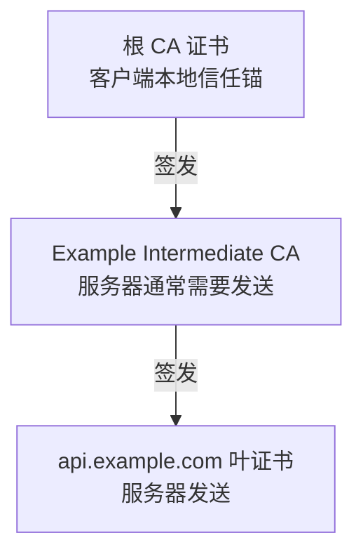
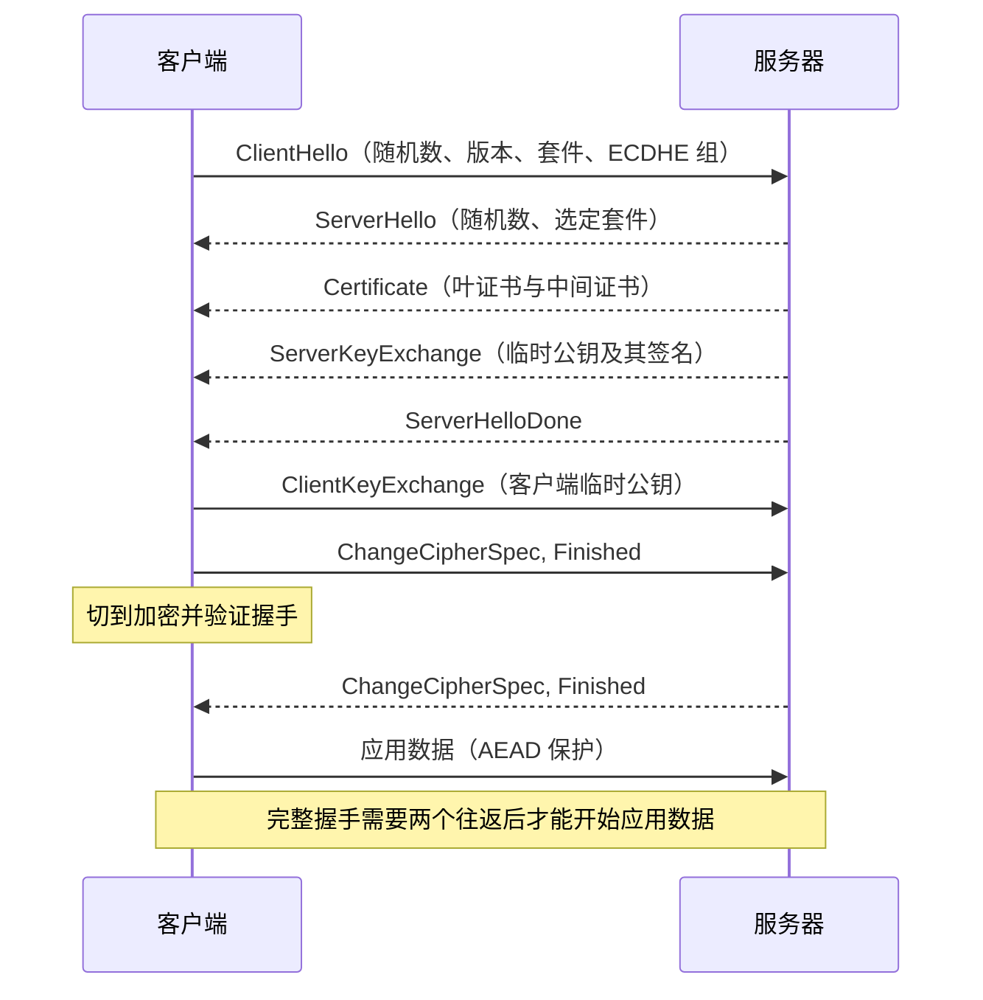
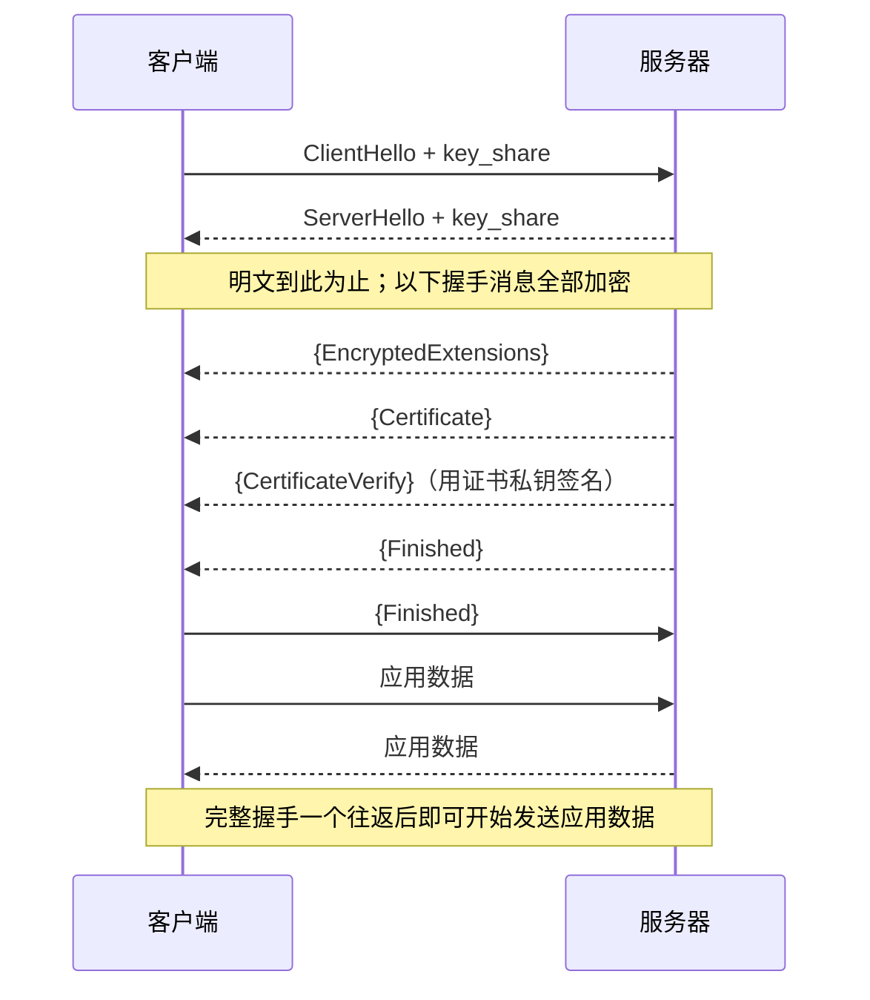

# 计算机网络｜08-HTTPS 与 TLS

浏览器地址栏里那个锁形图标，背后是整条链路都可能在偷看或改写的现实：咖啡店的 Wi-Fi、运营商的中间设备、被劫持的 DNS 应答，任何一段都可能让你收到的网页不是服务器发出的那一个。HTTPS 就是在这种不可信路径上，把普通的 HTTP 请求变成一条“能确认对方身份、且中途改不了”的通道。

很多人对它的印象停留在“会加密”，于是把证书、公钥、会话密钥混成一团：以为证书里装着加密好的网页，以为签名就是“用私钥加密”，也解释不了为什么换台电脑同一张证书就报警。本文先把 HTTPS 要对抗的威胁讲清楚，再按“密码学工具 → 证书与信任 → 握手 → 扩展与恢复 → 排错”的顺序展开，最后用真实命令观察一次握手，并给出按错误信息定位问题的路径。

<!-- GFM-TOC -->
* [HTTP 需要一条怎样的安全通道](#http-需要一条怎样的安全通道)
* [TLS 组合了哪些密码学工具](#tls-组合了哪些密码学工具)
    * [随机数、密钥交换与密钥派生](#随机数密钥交换与密钥派生)
    * [证书公钥与数字签名](#证书公钥与数字签名)
    * [记录保护：AEAD 同时提供机密性与完整性](#记录保护aead-同时提供机密性与完整性)
* [PKI 与证书链：信任从哪里开始](#pki-与证书链信任从哪里开始)
    * [一张证书里有什么](#一张证书里有什么)
    * [从终端证书到信任锚](#从终端证书到信任锚)
* [客户端实际验证哪些条件](#客户端实际验证哪些条件)
    * [主机名匹配的规则](#主机名匹配的规则)
    * [吊销检查的现实差异](#吊销检查的现实差异)
* [TLS 1.2 完整握手：两端如何得到同一会话密钥](#tls-12-完整握手两端如何得到同一会话密钥)
    * [为什么 ECDHE 能防住中间人](#为什么-ecdhe-能防住中间人)
    * [静态 RSA：历史机制](#静态-rsa历史机制)
* [TLS 1.3：更少往返、更少遗留算法](#tls-13更少往返更少遗留算法)
    * [握手后半段为什么能全部加密](#握手后半段为什么能全部加密)
    * [前向保密在 1.3 中如何成立](#前向保密在-13-中如何成立)
* [SNI 与 ALPN：先找证书，再选 HTTP 版本](#sni-与-alpn先找证书再选-http-版本)
* [会话恢复与 0-RTT 的收益和代价](#会话恢复与-0-rtt-的收益和代价)
    * [从 session ID 到 PSK 票据](#从-session-id-到-psk-票据)
    * [0-RTT 为什么必须配反重放](#0-rtt-为什么必须配反重放)
* [HTTPS 部署中的客户端议题](#https-部署中的客户端议题)
    * [mTLS：双向认证不等于应用登录](#mtls双向认证不等于应用登录)
    * [证书固定的收益与维护成本](#证书固定的收益与维护成本)
* [TLS 版本现状与淘汰应怎样表述](#tls-版本现状与淘汰应怎样表述)
* [用命令查看真实握手与证书链](#用命令查看真实握手与证书链)
* [按错误信息定位 TLS 问题](#按错误信息定位-tls-问题)
* [常见误区](#常见误区)
* [参考资料](#参考资料)
* [小结](#小结)
<!-- GFM-TOC -->

## HTTP 需要一条怎样的安全通道

HTTP 把请求和响应写成可读文本，在两端之间逐跳转发。这个设计没有为“路径上可能存在攻击者”预留任何保护：

- **被动窃听**：同一链路上的观察者能直接读出 URL、Cookie、表单内容和响应正文。
- **主动篡改**：中间设备可以改掉页面里的脚本、插入广告，甚至改写接口返回值。
- **冒充服务器**：攻击者用自己的证书或伪造的 DNS 应答，把客户端引到一台完全受控的机器上；客户端如果无法区分它和真服务器，加密本身毫无意义。

TLS（Transport Layer Security，传输层安全）要同时补上这三个缺口，对应三组属性：机密性（content confidentiality）、完整性（integrity）、以及基于证书的服务器身份认证（server authentication）。前两者由对称加密与认证机制提供，第三者由数字签名和 PKI（Public Key Infrastructure，公钥基础设施）提供。它们在一次握手内共同完成，不是三个独立的开关。现代 ECDHE 握手中，证书主要用于身份认证；只有历史上的静态 RSA 密钥传输才直接用证书公钥封装预主密钥。

HTTPS 先完成身份认证与密钥协商，再用这次协商出的对称密钥保护每一条记录，而不是“用一个公钥加密全部 HTTP 数据”；证书主要参与认证，在历史静态 RSA 模式中还参与密钥传输，但从不承载业务数据。

HTTPS 也有明确的保护边界，越过边界就会得出错误结论：

- **元数据不隐藏。** 目标 IP、端口、连接时间和流量大小对路径上的观察者可见；传统 SNI 还会暴露你要访问的域名（见后文 ECH）。
- **端点不保护。** 客户端或服务器一旦失陷，恶意扩展、调试工具或本地木马可以直接读取明文，TLS 无法阻止。
- **不替代应用授权。** 传输层只回答“对面是不是这个域名背后的服务”，不回答“这个用户有没有权限做这件事”。认证、签发凭证和权限判断是另一层问题。
- **无法对抗已被改写的信任。** 如果用户把企业代理的根证书装进系统，或点击“继续前往不安全页面”，中间人就合法地站在了连接中间——这是信任决策被改变，不是 TLS 被攻破。

> **面试高频：** HTTPS 相比 HTTP 提供了哪些保护？边界在哪？
> **答题脉络：** 三类链路威胁 → 机密性/完整性/服务器认证 → 混合使用对称与非对称密码学 → 元数据、端点与应用授权都不在其中。
> **追问方向：** 目标 IP 与域名是否可见、流量大小是否暴露、企业代理拦截是否算攻击。

## TLS 组合了哪些密码学工具

把 TLS 拆开看，它没有发明新的密码学算法，只是把几类已有工具按职责拼在一起：算力和带宽留给对称加密，稀缺的公钥运算只用来证明身份和协商密钥。

### 随机数、密钥交换与密钥派生

握手中双方各自贡献一个随机数（ClientHello 与 ServerHello 各带一个），它们和后文协商出的共享秘密一起，喂给密钥派生函数（TLS 1.2 用 PRF，TLS 1.3 用 HKDF）生成会话密钥。随机数的作用是让每次连接即使参数相同也得到不同密钥，避免重放历史流量。

真正让双方走到同一个秘密上的是密钥交换：

- **(EC)DHE**：双方各自生成临时密钥对，交换公钥后在自己一侧算出同一个共享秘密。共享秘密从不出现在网络上，而且临时私钥用完即弃。
- **签名绑定**：临时公钥本身不带身份信息，必须由服务器用证书私钥对握手内容签名，客户端才能确认交换来的公钥确实属于该域名，而不是被中间人替换。

> 密钥交换负责“协商出一个只有双方知道的秘密”，证书签名负责“证明正在协商的是谁”。少了签名，密钥交换对中间人完全不设防。

### 证书公钥与数字签名

签名和加密不是同一件事。加密的目标是隐藏内容，签名的目标是证明“这段数据确实由持有私钥的一方产生”：

1. 签名方对消息做哈希，得到固定长度的摘要；
2. 按具体签名方案（如 RSA-PSS、ECDSA）用私钥生成签名；
3. 验证方用公钥执行对应的验证算法，检查签名确实对应这条消息，而不是笼统地“用公钥解密”。

“私钥加密、公钥解密”不是签名的安全解释。签名方案（如 RSA-PSS、ECDSA）在摘要之外还有填充、随机化和域参数，直接把消息当 RSA 输入既慢又不安全。

完整性为什么必须带密钥？如果只把明文做一次公开哈希，攻击者改完数据可以顺手把哈希值一起改掉，接收方无从判断。下面的最小示例模拟同一场景：攻击者能改写密文，也能重新计算摘要，但算不出带密钥的 MAC。

```dart
// 前置条件：Dart 3.12；依赖 package:crypto（Dart 团队维护，dart:core 未内置摘要算法）。
// 用途：《HTTPS 与 TLS》中“完整性为什么必须带密钥”的最小可观察示例。
import 'dart:convert';

import 'package:crypto/crypto.dart';

// 1. 玩具流密码：只用来演示密文可以被逐位改写，没有任何真实安全性。
List<int> toyXorStream(int seed, List<int> bytes) => List<int>.generate(
  bytes.length,
  (index) => bytes[index] ^ ((seed + index * 31) & 0xff),
);

// 2. 无密钥摘要：算法公开，任何拿到密文的人都能算出同一个值。
String keylessDigest(List<int> bytes) => sha256.convert(bytes).toString();

/// 3. 接收方用无密钥摘要校验时，body 与 tag 都由网络到达，攻击者可同时替换。
bool verifyKeyless(List<int> body, String tag) => keylessDigest(body) == tag;

// 4. 带密钥的认证码：没有 secret 就算不出改写后数据对应的 tag。
String keyedMac(List<int> secret, List<int> bytes) =>
    Hmac(sha256, secret).convert(bytes).toString();

/// 5. 接收方用带密钥 MAC 校验时，tag 是自己用 secret 重算出来的。
bool verifyMac(List<int> secret, List<int> body, String tag) =>
    keyedMac(secret, body) == tag;

void main() {
  // 6. 双方事先约定一个只有彼此知道的密钥。
  final secret = utf8.encode('shared-secret-only-peers-know');
  final ciphertext = toyXorStream(0x5a, utf8.encode('transfer=100&account=A'));

  // 7. 攻击者改写第 9 个字节，把明文里的 '1' 变成 '9'。
  final tampered = List<int>.of(ciphertext);
  tampered[9] ^= 0x08;

  // 8. 攻击者按公开算法重算摘要，再把它当作 tag 一起发出。
  final forgedTag = keylessDigest(tampered);

  print('接收方解出的明文：${utf8.decode(toyXorStream(0x5a, tampered))}');
  print('无密钥摘要校验通过：${verifyKeyless(tampered, forgedTag)}');
  print('带密钥 MAC 校验通过：${verifyMac(secret, tampered, forgedTag)}');

  assert(utf8.decode(toyXorStream(0x5a, tampered)) == 'transfer=900&account=A');
  assert(verifyKeyless(tampered, forgedTag));
  assert(!verifyMac(secret, tampered, forgedTag));
}
```
<!-- verify: .work/verify/B14/lib/unkeyed_digest_vs_mac.dart -->

运行结果如下（`dart run .work/verify/B14/lib/unkeyed_digest_vs_mac.dart`）：

```text
接收方解出的明文：transfer=900&account=A
无密钥摘要校验通过：true
带密钥 MAC 校验通过：false
```

攻击者成功把转账金额从 100 改成 900，并且无密钥摘要完全阻止不了；带密钥的校验立刻失败。这正是 TLS 必须使用带密钥的完整性机制、而不能依赖“攻击者拿不到明文所以算不出摘要”的原因——哈希算法是公开的，真正保密的是密钥。

### 记录保护：AEAD 同时提供机密性与完整性

握手结束后，业务数据被切成记录（Record）。TLS 1.3 只允许 AEAD（Authenticated Encryption with Associated Data，带关联数据的认证加密）算法：AES-GCM、ChaCha20-Poly1305 和 AES-CCM。AEAD 一次运算同时完成加密与认证，避免了“先加密再单独做 MAC”带来的组合失误空间。

每条记录的保护过程可以概括为：

1. 由会话密钥和记录序号派生出本次记录的唯一 nonce；
2. 用 AEAD 加密载荷，同时把记录头作为“关联数据”参与认证；
3. 对端用同样的密钥与序号解密并验证标签，失败即丢弃连接。

序号参与 nonce 意味着记录不能重排或重复。TLS 1.3 还把真实的记录类型藏在密文里，外层统一表现为 application_data，抓包只能看到长度和时间，看不到这条记录是握手还是业务数据。

> **面试高频：** 对称加密、非对称加密、签名、哈希在 TLS 里各做什么？为什么不直接用 RSA 加密全部数据？
> **答题脉络：** 非对称运算慢且不提供前向保密 → 只用它做身份认证与密钥交换 → 会话数据交给对称 AEAD → 完整性必须有密钥。
> **追问方向：** RSA 签名与 RSA 加密的区别、HMAC 与哈希、AEAD 相比“加密 + MAC”的优势。

## PKI 与证书链：信任从哪里开始

密钥交换解决“怎么算出一个秘密”，但客户端凭什么相信交换来的临时公钥属于 `api.example.com`？答案是证书：由客户端本来就信任的第三方，把“域名”和“公钥”绑定起来并签名。

### 一张证书里有什么

X.509 证书是结构化数据加一段签名，关键字段包括：

- **subject**：这张证书给谁（现代校验中不用于服务器身份判断）；
- **issuer**：谁签发了它；
- **公钥**：subject 持有的公钥，用于验签或密钥交换；
- **有效期**：`notBefore` 与 `notAfter`；
- **subjectAltName（SAN）**：这张证书真正覆盖的域名或 IP 列表；
- **basicConstraints / keyUsage / extendedKeyUsage**：它是不是 CA、能不能签证书、用途是否为服务器认证；
- **签名**：CA 用自己私钥对该证书内容（TBSCertificate）做的签名。

CA（Certificate Authority，证书认证机构）签发的动作就是对证书内容做哈希再用自己私钥签名；验证方拿 issuer 的公钥验证签名，确认内容没有被改动。

> 主机名身份只看 subjectAltName，不看 Common Name。RFC 9525 明确要求不得把 CN 当域名来匹配；老证书“CN 匹配即可”的做法已经过时。[核查日期：2026-09-22]

### 从终端证书到信任锚

证书自己不能证明自己，需要一条能连到本地信任锚（Trust Anchor）的链：


**图 1：`api.example.com` 的证书链：根自签名并作为信任锚，中间 CA 与叶证书逐级向下签发。**

验证是一条自下而上的路径：叶证书由中间 CA 签发，中间证书由根签发，根的公钥早就在客户端的信任库里。根证书通常是自签名的，客户端已经拥有它，服务器一般不必发送；少发一张中间证书则会让客户端无法完成路径构建，这是生产环境最常见的证书配置事故。

下面的示例用最小的数据结构复现路径构建过程：沿着 issuer 一环环向上找，直到命中本地信任锚。它不做签名验证，只展示链的拓扑约束。

```dart
// 前置条件：Dart 3.12；纯 Dart。
// 用途：《HTTPS 与 TLS》中证书链路径构建的教学实现。
// 边界：只演示 subject/issuer 链接与信任锚判定，不做签名、有效期、用途与吊销校验。

/// 只保留链验证所需的两个字段，真实证书还有公钥、SAN、有效期等。
class CertificateStub {
  const CertificateStub({required this.subject, required this.issuer});

  final String subject;
  final String issuer;
}

/// 从终端证书出发，沿 issuer 找到本地信任锚；链不完整时返回 null。
List<CertificateStub>? buildChain({
  required CertificateStub leaf,
  required List<CertificateStub> intermediates,
  required List<CertificateStub> trustAnchors,
}) {
  final path = <CertificateStub>[leaf];
  final used = <CertificateStub>{leaf};
  var current = leaf;

  // 1. 信任锚只需要出现在本地库里，服务器不必把它发过来。
  bool anchored(CertificateStub cert) =>
      trustAnchors.any((anchor) => anchor.subject == cert.issuer);

  // 2. 沿 issuer 一环环向前找；中间证书的顺序不影响结果。
  while (!anchored(current)) {
    CertificateStub? next;
    for (final candidate in intermediates) {
      if (candidate.subject == current.issuer && !used.contains(candidate)) {
        next = candidate;
        break;
      }
    }
    // 3. 没有可用的下一环说明链断了：缺中间证书或锚点未知。
    if (next == null) return null;
    used.add(next); // 4. 记录走过的证书，避免构造出的环导致死循环。
    path.add(next);
    current = next;
  }
  return path;
}
```
<!-- verify: .work/verify/B14/lib/certificate_chain_path.dart -->

配套的 `main()`（同一文件的第 45–89 行）构造三个场景：正常链、漏发中间证书、自签名证书：

```dart
void main() {
  const root = CertificateStub(
    subject: 'Example Root CA',
    issuer: 'Example Root CA',
  );
  const inter = CertificateStub(
    subject: 'Example Intermediate CA',
    issuer: 'Example Root CA',
  );
  const leaf = CertificateStub(
    subject: 'api.example.com',
    issuer: 'Example Intermediate CA',
  );
  const rogue = CertificateStub(
    subject: 'rogue.example.com',
    issuer: 'rogue.example.com',
  );

  // 5. 场景一：服务器发来中间证书，链完整；根不在链里。
  final ok = buildChain(
    leaf: leaf,
    intermediates: [inter],
    trustAnchors: [root],
  );
  // 6. 场景二：漏发中间证书，无法到达信任锚。
  final missing = buildChain(
    leaf: leaf,
    intermediates: const [],
    trustAnchors: [root],
  );
  // 7. 场景三：自签名证书的 issuer 不是受信任锚点。
  final selfSigned = buildChain(
    leaf: rogue,
    intermediates: [inter],
    trustAnchors: [root],
  );

  print('完整链：${ok?.map((cert) => cert.subject).toList()}');
  print('缺少中间证书：$missing');
  print('自签名证书：$selfSigned');

  assert(ok != null && ok.length == 2);
  assert(missing == null);
  assert(selfSigned == null);
}
```
<!-- verify: .work/verify/B14/lib/certificate_chain_path.dart -->

```text
完整链：[api.example.com, Example Intermediate CA]
缺少中间证书：null
```

信任锚本身从哪里来？操作系统和浏览器各自维护受信任根证书库：Firefox 使用 Mozilla 维护的根证书程序，Chrome 使用 Chrome Root Store，同时仍会接受管理员通过平台策略安装的企业根证书。根证书更新走的是软件或系统更新通道，而不是每次连接时向网络查询。企业内网自签 CA、私有 PKI 也与公有体系同理，只是根证书由组织自己分发。

## 客户端实际验证哪些条件

拿到服务器发来的证书链之后，客户端不会“看到 CA 签名就放行”，它会逐项检查以下条件，任何一项失败都会终止连接或显示警告：

| 检查项 | 具体内容 | 失败时的典型后果 |
| --- | --- | --- |
| 路径与签名 | 链上每张证书由上一张签发，签名有效，最终到达本地信任锚 | 未知根或链断裂，连接被拒绝 |
| 约束与用途 | basicConstraints 允许签证书、路径长度合规、extendedKeyUsage 包含 serverAuth | 被误当作 CA 的证书无法扩展路径，用途不符被拒绝 |
| 有效期 | 当前时间落在 notBefore 与 notAfter 之间 | 过期或尚未生效 |
| 主机名 | 连接的域名与证书 SAN 匹配 | 名称不匹配，即使证书本身可信 |
| 吊销 | 通过 CRL、OCSP、CRLSet、CRLite 等判断证书是否已撤销 | 现实差异很大，见下文 |

客户端验证的是“服务器发来的链 + 本地信任锚 + 本次连接的目标主机名”三者的组合；证书可信只说明签发流程合规，不代表该站点值得信任——钓鱼站点同样能拿到合法的 DV 证书。

> **面试高频：** 证书链是怎么验证的？为什么看 SAN 而不是 CN？
> **答题脉络：** 服务器发叶证书与中间证书 → 逐级验签直到本地信任锚 → 检查有效期、用途与 SAN 主机名 → 根证书通常不在链里。
> **追问方向：** 通配符匹配范围、缺中间证书的表现、忽略证书错误为什么不可接受。

### 主机名匹配的规则

主机名匹配容易写错，规则来自 RFC 9525：只比较大小写不敏感的 ASCII 名称，只检查 SAN 中的 dNSName（IP 地址走 iPAddress），通配符 `*` 只能占最左标签的全部内容，且只匹配一个标签。

```dart
// 前置条件：Dart 3.12；纯 Dart。
// 用途：《HTTPS 与 TLS》中证书主机名校验的最小实现，规则来自 RFC 9525 第 6.3 节。
// 边界：输入假定已是 A-label（IDN 需先转成 A-label）；证书路径校验与撤销状态不在此例。
// 注意：本文件不是生产实现，只用于复现规范中的匹配规则；它只处理 SAN.dNSName。

/// 判断证书中的一个 dNSName 标识符是否覆盖要访问的主机名。
bool dnsNameMatches(String presented, String reference) {
  // 1. 统一转小写：RFC 9525 要求按大小写不敏感的 ASCII 比较。
  final pattern = presented.toLowerCase();
  final target = reference.toLowerCase();
  // dNSName 不承载 IP 地址；IP literal 必须改走 SAN.iPAddress 的地址匹配。
  final ipv4 = RegExp(r'^\d{1,3}(?:\.\d{1,3}){3}$');
  if (ipv4.hasMatch(pattern) || ipv4.hasMatch(target) ||
      pattern.contains(':') || target.contains(':')) {
    return false;
  }

  // 2. 通配符只允许一个，且必须是最左标签的全部内容。
  if (pattern.contains('*')) {
    if (!pattern.startsWith('*.') || pattern.indexOf('*', 1) != -1) {
      return false;
    }
    final suffix = pattern.substring(1); // ".example.com"
    if (!target.endsWith(suffix)) return false;

    // 3. 通配符只匹配一个非空标签，跨不出点号。
    final label = target.substring(0, target.length - suffix.length);
    return label.isNotEmpty && !label.contains('.');
  }

  // 4. 无通配符时逐字符精确比较；Common Name 不参与校验。
  return pattern == target;
}

/// 5. 只要 subjectAltName 中有一项匹配就算成功，全部不匹配才拒绝连接。
bool certificateMatches(List<String> sanDnsNames, String reference) =>
    sanDnsNames.any((name) => dnsNameMatches(name, reference));

void main() {
  const cases = <(String, String, bool)>[
    ('*.example.com', 'a.example.com', true),
    ('*.example.com', 'a.b.example.com', false),
    ('*.example.com', 'example.com', false),
    ('*.example.com', '192.0.2.10', false),
    ('a*b.example.com', 'axb.example.com', false),
    ('*.*.example.com', 'a.b.example.com', false),
    ('WWW.Example.COM', 'www.example.com', true),
    // IP 地址必须按 SAN.iPAddress 的地址字节匹配，不能走 dNSName 分支。
    ('192.0.2.10', '192.0.2.10', false),
  ];

  var failures = 0;
  for (final (presented, reference, expected) in cases) {
    final actual = dnsNameMatches(presented, reference);
    if (actual != expected) failures++;
    print('$presented vs $reference -> $actual（期望 $expected）');
  }

  // 6. 只有 Common Name 匹配也必须拒绝：现代校验只看 subjectAltName。
  final cnOnlyAccepted = certificateMatches(['other.example'], 'example.com');
  print('仅 CN 匹配时是否放行：$cnOnlyAccepted');

  assert(failures == 0);
  assert(!cnOnlyAccepted);
}
```
<!-- verify: .work/verify/B14/lib/hostname_verification.dart -->

```text
*.example.com vs a.example.com -> true（期望 true）
*.example.com vs a.b.example.com -> false（期望 false）
*.example.com vs example.com -> false（期望 false）
*.example.com vs 192.0.2.10 -> false（期望 false）
a*b.example.com vs axb.example.com -> false（期望 false）
*.*.example.com vs a.b.example.com -> false（期望 false）
WWW.Example.COM vs www.example.com -> true（期望 true）
192.0.2.10 vs 192.0.2.10 -> false（期望 false）
仅 CN 匹配时是否放行：false
```

几个容易踩的点：`*.example.com` 覆盖 `a.example.com`，却不覆盖 `a.b.example.com`，也不覆盖裸域名 `example.com`；dNSName 分支不能匹配 IP 地址，IP 必须在 SAN.iPAddress 中按地址匹配；证书里出现 `a*b` 这类非最左完整标签的通配符按非法处理。

在 Dart/Flutter 里遇到证书错误时，把 `HttpClient.badCertificateCallback` 写成永远返回 `true` 不是修复方案。它的效果是对所有证书放弃验证，等于请中间人进门；正确做法是补齐链、修正域名或系统时间，仅在受控的测试环境短暂使用例外逻辑。

### 吊销检查的现实差异

证书可能因为私钥泄露在到期前被 CA 撤销，但“客户端会主动联网查吊销状态”是一个理想化假设：

- **CRL**：CA 发布撤销列表，文件可能很大，浏览器很少在线下载完整 CRL。
- **OCSP**：客户端向 CA 的 OCSP 响应器查询单张证书状态；存在隐私泄露、响应器不可用和延迟问题。
- **OCSP Stapling**：服务器代客户端查询并把带时间戳的签名响应装进握手的 Certificate Status 扩展，既省一次请求又避免泄露访问记录。
- **浏览器侧的替代方案**：Chrome 官方文档说明其默认不普遍执行在线 OCSP/CRL 检查，撤销拦截依赖 CRLSet 这类本地化列表，并由企业策略决定是否启用在线 OCSP（参考资料 R12）；Firefox 在 145 起不再对 WebPKI 证书使用 OCSP，改用 CRLite 等本地化方案。

> **时效信息（核查日期：2026-09-22）：** “所有客户端都会硬失败地检查 OCSP”不成立；不同浏览器策略不同，且会随版本变化。不要把吊销检查当作唯一防线，短有效期证书正在成为更主要的补救手段。

此外，证书透明度（Certificate Transparency，CT，RFC 9162）解决的是另一个问题：让所有公开信任的证书出现在可审计的日志中，使错误签发能被发现。Chrome 要求 2018-04-30 之后签发的公开可信 TLS 证书满足 CT 要求才会被视为有效。

## TLS 1.2 完整握手：两端如何得到同一会话密钥

理解了工具与信任，就可以把一次完整握手串起来。以现代 TLS 1.2 的 ECDHE + 证书认证为例（省略 Hello 扩展细节）：


**图 2：TLS 1.2 完整握手（ECDHE + 证书认证），完整握手需要两个往返。**

双方各自持有自己的临时私钥，交换公钥后算出同一个共享秘密，再结合两个随机数通过 PRF 派生出主密钥和会话密钥。`Finished` 消息携带对整段握手记录的认证值，任何一方发现对不上都会中止连接——它同时确认了密钥协商成功、握手过程未被篡改。

### 为什么 ECDHE 能防住中间人

只看密钥交换，双方是“匿名”的：任何人都能和任意人完成 ECDHE。防住中间人的关键在 `ServerKeyExchange` 里的签名——服务器用证书私钥给临时公钥签名，客户端用证书里的公钥验证。中间人替换临时公钥就必须重新签名，而它没有证书私钥。

临时私钥用完即弃带来了**前向保密（Forward Secrecy）**：即使攻击者在若干年后拿到服务器的证书私钥，也无法解密当时录下的流量，因为会话密钥依赖的临时私钥早已销毁。

前向保密保护的是“历史会话”，与“当前连接”无关；它成立的前提是本次握手真的用了临时密钥交换（DHE/ECDHE），而不是静态密钥或纯 PSK。

### 静态 RSA：历史机制

> **历史机制（不推荐）：** 早期 TLS 1.2 常用静态 RSA 密钥传输（套件名形如 `TLS_RSA_*`）：客户端用证书里的 RSA 公钥加密 pre-master secret 发给服务器。它不提供前向保密，且对填充预言类攻击更敏感；TLS 1.3 已完全移除该能力。看到“非对称加密传输对称密钥”的描述时，要意识到它只描述了这段历史。[核查日期：2026-09-22]

## TLS 1.3：更少往返、更少遗留算法

TLS 1.3（RFC 8446）把握手的“第一个往返”用满：客户端在 ClientHello 里直接带上密钥交换素材（key_share 扩展），因为算法列表被大幅精简，客户端可以预判服务器支持的群组。服务器选定参数后立刻能算出握手密钥，之后的握手消息全部加密；如果客户端没有提供服务器接受的群组，服务器会先发 `HelloRetryRequest`，完整握手会额外增加一个往返。


**图 3：TLS 1.3 完整握手，花括号表示已加密，应用数据一个往返后即可发送。**

### 握手后半段为什么能全部加密

TLS 1.2 中证书是明文传输的，路径观察者能看到对端用了哪张证书；TLS 1.3 只要 ServerHello 里带了 key_share，双方就能导出握手流量密钥，把 EncryptedExtensions、Certificate、CertificateVerify 和 Finished 一起加密。服务器仍需通过 `CertificateVerify` 用证书私钥签名，客户端验证后确认对方身份，否则这条“加密通道”可能正连着中间人。

TLS 1.3 顺带移除了大量历史包袱，只保留 AEAD 套件，并把密钥派生统一到 HKDF：

- 移除静态 RSA 密钥传输、CBC 模式、RC4、SHA-1、压缩、重协商和自定义 DH 群；
- 套件只描述记录保护算法与哈希（如 TLS_AES_128_GCM_SHA256）；
- 主密钥、握手密钥、应用数据密钥按 HKDF 的“提取—扩展”流程分层派生，双向流量密钥相互独立，还支持握手中途 KeyUpdate 换密钥。

TLS 1.3 的“更快”来自少一个往返和精简的算法集，并没有降低加密强度；RFC 8446 同时为 TLS 1.2 实现补充了新要求，也没有把 1.2 判为不可用。

### 前向保密在 1.3 中如何成立

完整握手中双方必须使用临时 (EC)DHE，临时私钥同样用完即弃，因此完整握手天然具备前向保密。会话恢复使用 PSK 时，分为两种模式：`psk_dhe_ke` 把 PSK 与新的 (EC)DHE 结合，仍然保留前向保密；只有 `psk_ke` 的恢复会失去这一属性，现代实现通常优先协商前者。

> **面试高频：** TLS 1.2 与 TLS 1.3 的握手差在哪？前向保密是什么？
> **答题脉络：** 1.2 完整握手 2-RTT、证书明文 → 1.3 客户端先发 key_share、1-RTT、ServerHello 后全加密 → 静态 RSA/CBC 被移除 → 前向保密依赖临时密钥交换，PSK 模式要看是否叠加 DHE。
> **追问方向：** 证书在 TLS 1.3 何时开始加密、1.3 是否允许没有 DHE 的恢复、0-RTT 是否具备前向保密。

## SNI 与 ALPN：先找证书，再选 HTTP 版本

一个 IP 上可以托管几百个域名，服务器必须在证明“我是谁”之前先知道客户端想访问哪个域名，否则连该出示哪张证书都不知道。这正是 SNI（Server Name Indication，服务器名称指示，RFC 6066）的职责：客户端在 ClientHello 里带上目标主机名，服务器据此选择证书。

SNI 出现在握手的明文部分，路径观察者可以据此知道你在访问哪个域名。加密客户端问候（Encrypted Client Hello，ECH）正是为此设计：把 SNI 等敏感握手信息包进一层加密，符合条件时服务器与客户端照常完成握手，中间人只能看到“有一台开启了 ECH 的服务器”。

> **时效信息（核查日期：2026-09-22）：** ECH 已在 2026-03 发布为 Proposed Standard（RFC 9849）；Cloudflare 官方文档说明其免费套餐默认开启 ECH，能否真正用上还取决于 DNS 中 HTTPS 记录的分发与浏览器支持，因此不能假设所有连接都已隐藏 SNI。

选完证书之后，双方还要决定证书保护的是哪种应用协议。ALPN（Application-Layer Protocol Negotiation，RFC 7301）让客户端在 ClientHello 中按优先级列出协议（如 `h2`、`http/1.1`），服务器选一个并在握手结果中确认。HTTP/2 就是靠 ALPN 与 HTTP/1.1 区分；HTTP/3 运行在 QUIC 上，其 ALPN 是 `h3`，QUIC 自身集成了 TLS 1.3 握手，这部分细节见[传输层：UDP、TCP 与 QUIC](./04-传输层：UDP、TCP与QUIC.md)，HTTP 版本语义见[HTTP 语义、缓存与版本演进](./07-HTTP语义、缓存与版本演进.md)。

> SNI 决定“给哪张证书”，ALPN 决定“握手之后说哪种 HTTP”；两者都只是协商信息，不改变 TLS 本身提供的保护。

> **面试高频：** 一个 IP 上多个域名、多个 HTTP 版本是如何协商的？
> **答题脉络：** SNI 决定服务器出示哪张证书 → ALPN 决定之后用 h2 还是 http/1.1 → QUIC 用 h3 → SNI 明文与 ECH 的边界。
> **追问方向：** 默认虚拟主机、ECH 与 DNS HTTPS 记录、HTTP/3 的证书协商差异。

## 会话恢复与 0-RTT 的收益和代价

完整握手要花一个或多个往返，还要做证书验证和密钥交换运算。用户第二次访问同一站点时这些成本可以省掉，办法是复用上一次协商出的会话状态。

### 从 session ID 到 PSK 票据

> **历史机制（已被取代）：** TLS 1.2 的会话恢复有两种做法：session ID 让服务器为每个会话保存状态；session ticket（RFC 5077）把状态加密后交给客户端保管。RFC 8446 已用新的 PSK 票据机制取代它们。[核查日期：2026-09-22]

TLS 1.3 的恢复流程是：握手结束后服务器发送 NewSessionTicket，其中包含 PSK 标识与由服务器加密、客户端当作不透明数据保存的票据；下次连接时客户端在 ClientHello 里带上 PSK 标识并用派生出的密钥加密早期数据（可选）。结合前文，`psk_dhe_ke` 模式会叠加新的 (EC)DHE，恢复连接仍然具备前向保密。

### 0-RTT 为什么必须配反重放

0-RTT（early data）允许客户端在收到 ServerHello 之前就发送应用数据，用 PSK 派生的早期密钥加密，把恢复访问的首字节延迟再压掉一个往返。代价同样明显：

1. **可重放。** 早期数据没有参与新的握手随机数，攻击者录下这段密文后可以原样重发，服务器看到的是两个完全一样的请求。
2. **无前向保密。** 早期密钥可以由 PSK 单独派生，拿到 PSK 的一方就能解密早期数据。
3. **服务器可以拒绝。** 服务端何时接受早期数据由策略决定，客户端不能假设它一定被处理。

因此 RFC 8446 要求应用自行判断哪些数据可以安全地重放。默认思路是把 0-RTT 限制在“重放也不产生额外副作用”的请求上，例如只读查询；对支付、下单、发消息这类操作，要么禁用 0-RTT，要么让服务端用单次票据和有限时间窗口做反重放。

下面的示例实现服务端的反重放状态：同一张票据在覆盖其有效期的窗口内只能被接受一次。

```dart
// 前置条件：Dart 3.12；纯 Dart。
// 用途：《HTTPS 与 TLS》中 0-RTT 早期数据为什么必须配“单次票据 + 有界重放窗口”。
// 边界：这里只模拟服务端反重放状态，不涉及密钥派生与票据加密方式。

/// 服务端记录已接受的票据 ID 及其失效时刻（秒），用于拒绝重复的 0-RTT 数据。
class EarlyDataReplayWindow {
  EarlyDataReplayWindow({
    required this.ticketLifetimeSeconds,
    int? windowSeconds,
  }) : windowSeconds = windowSeconds ?? ticketLifetimeSeconds;

  /// 票据有效期：窗口短于它，过期前的重放就会漏过去。
  final int ticketLifetimeSeconds;

  /// 实际保留重放记录的时长。
  final int windowSeconds;

  final Map<String, int> _acceptedUntil = <String, int>{};

  /// 为反重放而保留的条目数，可用来估算服务端内存成本。
  int get retainedTickets => _acceptedUntil.length;

  /// 返回 true 表示这是该票据的首次使用，重复提交返回 false。
  bool accept(String ticketId, int nowSeconds) {
    // 1. 先清掉已经出窗口的记录。
    _acceptedUntil.removeWhere((_, until) => until <= nowSeconds);

    // 2. 窗口内出现过的同一票据一律按重放拒绝。
    if (_acceptedUntil.containsKey(ticketId)) return false;

    // 3. 首次使用后登记到窗口末尾。
    _acceptedUntil[ticketId] = nowSeconds + windowSeconds;
    return true;
  }
}

void main() {
  const lifetime = 60;

  // 场景一：窗口内重放被拒绝，窗口过期后同一票据又能被“首次使用”。
  final guard = EarlyDataReplayWindow(ticketLifetimeSeconds: lifetime);
  final firstUse = guard.accept('ticket-1', 0);
  final replayed = guard.accept('ticket-1', 1);
  final afterWindow = guard.accept('ticket-1', lifetime + 1);
  print('首次使用：$firstUse，窗口内重放：$replayed，窗口过期后重放：$afterWindow');

  // 场景二：窗口长度直接决定服务端要保留多少条记录。
  final busy = EarlyDataReplayWindow(ticketLifetimeSeconds: lifetime);
  for (var index = 0; index < 1000; index++) {
    busy.accept('ticket-$index', 0);
  }
  print('1000 张票据在窗口内的保留条目：${busy.retainedTickets}');

  // 场景三：窗口覆盖票据有效期时，过期前的重放仍被拒绝。
  final covered = EarlyDataReplayWindow(ticketLifetimeSeconds: lifetime);
  final accepted = covered.accept('ticket-2', 100);
  final beforeExpiry = covered.accept('ticket-2', 100 + lifetime - 1);
  final atExpiry = covered.accept('ticket-2', 100 + lifetime);
  print('首次：$accepted，过期前一秒重放：$beforeExpiry，过期时刻重放：$atExpiry');

  // 场景四：窗口短于票据有效期时，重放会漏进来。
  final tooShort = EarlyDataReplayWindow(
    ticketLifetimeSeconds: lifetime,
    windowSeconds: 10,
  );
  tooShort.accept('ticket-3', 0);
  final leaked = tooShort.accept('ticket-3', 11);
  print('窗口只有 10 秒时，11 秒后的重放被接受：$leaked');

  assert(firstUse && !replayed && afterWindow);
  assert(busy.retainedTickets == 1000);
  assert(accepted && !beforeExpiry && atExpiry);
  assert(leaked);
}
```
<!-- verify: .work/verify/B14/lib/early_data_replay_window.dart -->

```text
首次使用：true，窗口内重放：false，窗口过期后重放：true
1000 张票据在窗口内的保留条目：1000
首次：true，过期前一秒重放：false，过期时刻重放：true
窗口只有 10 秒时，11 秒后的重放被接受：true
```

示例同时暴露了反重放的代价：保留窗口越长、恢复流量越大，服务端要缓存的状态就越多；窗口短于票据有效期时重放会漏过去。工程上要在内存成本、可用性和安全性之间取舍，而不是简单开启 0-RTT。

“HTTP 方法幂等”不等于“可以安全地走 0-RTT”。幂等描述的是重复执行对资源状态的影响，而重放会不会被接受、请求和票据是否绑定、服务端是否有反重放窗口，都需要应用层显式设计。

> **面试高频：** 0-RTT 为什么有重放风险？它能用在哪些请求上？
> **答题脉络：** 早期数据不参与新的随机数 → 密文可被原样重发 → 无前向保密 → 只对重放无副作用的请求开启，服务端配单次票据与有限窗口。
> **追问方向：** 与 HTTP 幂等语义的区别、PSK 票据如何轮换、TLS 1.2 的 ticket 恢复是否也有同样风险。

## HTTPS 部署中的客户端议题

### mTLS：双向认证不等于应用登录

mTLS（mutual TLS）在服务器认证之外要求客户端也出示证书（CertificateRequest → Certificate → CertificateVerify）。它常见于服务网格、企业设备接入和 API 网关，用来在传输层确认“调用方是哪台机器/哪个应用”。

客户端证书认证证明的是“这个连接用了某个受信任证书”，它不回答“证书持有者对应哪个用户、有没有权限”。应用层的登录、Token 与权限模型仍然必需，两者的信任来源和失效流程都不一样。

> **面试高频：** mTLS 能替代登录吗？证书报错能不能直接忽略？
> **答题脉络：** 客户端证书只证明传输层身份 → 应用授权仍需登录与权限模型 → 忽略证书错误等于接受中间人 → 正确做法是修链、改配置或使用受控信任库。
> **追问方向：** 客户端证书撤销、pinning 的轮换成本、企业代理证书的识别。

客户端证书撤销同样依赖 CRL/OCSP，很多系统干脆用短有效期证书替代撤销机制。

### 证书固定的收益与维护成本

证书固定（Certificate Pinning）把信任范围从“任何受该 CA 信任的证书”收窄到“特定公钥/证书/CA”，能抵御 rogue CA 签发错误证书的风险。代价是运维复杂度：固定对象必须预留备份 pin，否则换证当天所有客户端失联；固定的粒度越细（叶证书 > 公钥 > 中间 CA），轮换频率越高；平台还可能对 pinning 的实现方式有额外政策要求。

> **历史机制（已废弃）：** HTTP Public Key Pinning（HPKP，RFC 7469）尝试用响应头把 pin 下发给浏览器，但配置错误和锁死风险过高，Chrome 72 与 Firefox 72 先后移除该能力（参考资料 R19）。现代做法是把 pinning 放在应用或平台配置里，而不是让它成为全网协议。[核查日期：2026-09-22]

移动端的常见组合是“系统信任库 + 应用内 pinning”。企业管理员安装自建根证书会让代理具备合法中间人能力，这是预期行为而非漏洞；诊断时看到 issuer 是公司 CA，就应顺着企业代理链路排查，而不是寻找“破解”方法。

## TLS 版本现状与淘汰应怎样表述

TLS 的历史版本关系需要精确表述，否则容易得出“旧版本已被全面禁止”或“新版本必须马上切”的错误结论：

- **SSL 2.0/3.0 与 TLS 1.0/1.1 已成历史。** SSL 协议早已被淘汰；TLS 1.0 和 1.1 由 RFC 8996 正式弃用并移入 Historic 状态（2021-03）。
- **TLS 1.2 仍是合规的最低版本。** 当前 BCP 195（RFC 9325，2022-11，取代 RFC 7525）把 TLS 1.2 作为最低要求并建议迁移到 1.3；浏览器自 2020 年起默认关闭 1.0/1.1（Chrome 84、Firefox 74）。
- **TLS 1.3 是现行推荐版本。** RFC 8446（2018-08）取代了 RFC 5246（TLS 1.2）、RFC 5077 和 RFC 6961，并更新了 RFC 5705 与 RFC 6066。注意“取代”是规范层面的演进，不等于全球部署立刻禁用 TLS 1.2——大量设备与旧客户端仍以 1.2 为唯一选择。

> **时效信息（核查日期：2026-09-22）：** 版本占比要写明指标与采样范围。Scott Helme 团队 2026-06-13 对 Tranco Top 1M 中 819,002 个可响应站点的探测显示：支持 TLS 1.3 的站点 576,464 个（70.4%），仅支持 TLS 1.2 的 70,395 个（8.6%），TLS 1.1 为 0，TLS 1.0 仅 106 个。这是“站点支持率”，不是“流量占比”；Cloudflare Radar 等平台按流量统计的口径会给出另一组数字。

密码套件与参数不做永久性“最佳清单”，需要时按三条路径核查：当前 BCP 195（RFC 9325）、Mozilla Server Side TLS 配置建议、以及所在行业的合规基线（如 NIST SP 800-52）。写“推荐套件”必须同时标注版本与核查日期。

> **时效信息（核查日期：2026-09-22）：** 证书最长有效期正在缩短。CA/Browser Forum 基线要求规定：2026-03-15 起为 200 天，2027-03-15 起为 100 天，2029-03-15 起为 47 天。证书自动化续期（如 ACME）不再是可选项。

> **时效信息（核查日期：2026-09-22）：** 后量子密钥交换已进入生产。OpenSSL 3.5 默认支持混合群 X25519MLKEM768（example.com 的握手即协商出该群）；Apple 官方文档说明 iOS/iPadOS/macOS Tahoe/visionOS 26 起自动在 ClientHello 中宣告该群（参考资料 R20）；Cloudflare Radar 2025 年度回顾称加密流量中后量子协商占比从年初约 29% 升至 12 月初约 52%（参考资料 R16）。证书签名算法的后量子迁移仍是另一条较慢的战线。

## 用命令查看真实握手与证书链

协议文档之外，最可靠的学习方式是亲眼看一次真实握手。OpenSSL 的 `s_client` 和 curl 都能做到，注意不同版本输出与参数可能不同；以下均在 OpenSSL 3.5.4、curl 8.17.0 上运行（2026-09-22）。

```bash
# 指定 SNI、ALPN，只看 TLS 1.3；-showcerts 会打印完整证书链
openssl s_client -connect example.com:443 -servername example.com -alpn h2 -showcerts -tls1_3
openssl s_client -connect example.com:443 -servername example.com -verify_hostname example.com  # 默认只验链，不验名字
openssl s_client -connect example.com:443 -servername example.com -alpn h2,http/1.1 -tls1_2    # 强制 TLS 1.2 对比
curl -v --tlsv1.3 https://example.com/                                                          # 输出因 TLS 后端而异
```

一次运行输出的关键片段（已截断，实际输出会随站点与时间变化）：

```text
Certificate chain
 0 s:CN=example.com
   i:C=US, O=SSL Corporation, CN=Cloudflare TLS Issuing ECC CA 3
 1 s:C=US, O=SSL Corporation, CN=Cloudflare TLS Issuing ECC CA 3
   i:C=US, O=SSL Corporation, CN=SSL.com TLS Transit ECC CA R2
New, TLSv1.3, Cipher is TLS_AES_256_GCM_SHA384
Protocol: TLSv1.3
Negotiated TLS1.3 group: X25519MLKEM768
Verify return code: 0 (ok)
```

要看的四个点：

1. **Certificate chain**：服务器实际发了哪些证书，叶证书在最前；这一例里服务器没有发送根证书。
2. **Protocol / Cipher**：协商出的版本与套件；TLS 1.3 下应只出现 AEAD 套件。
3. **ALPN protocol**：协商出的应用协议（通常 `h2`）。
4. **Verify return code**：链验证结果，`0 (ok)` 才正常；主机名要配合 `-verify_hostname` 才会被检查。

抓包（tcpdump/Wireshark）能看到的信息与上一条命令互补：握手消息类型、TLS 版本、SNI、ALPN、记录长度与时间模式都可见；TLS 1.3 中 ServerHello 之后的内容（包括证书）都是密文。`SSLKEYLOGFILE` 之类的密钥日志能让抓包工具解密流量，但它等于把会话密钥交给持有文件的进程，只适合本地受控实验，绝不能出现在生产环境。

> 抓包看到的“加密”不是黑箱：能看到谁在何时向哪个 IP 发起了多大流量的连接；看不到的是 URL、Header、正文，以及 TLS 1.3 中从 ServerHello 之后的握手细节。

## 按错误信息定位 TLS 问题

排错的第一步是把错误分到“链、名称、时间、协议、策略”中的一类，而不是急于关掉验证。下面是最常见的几类及其证据：

| 典型表现 | 常见原因 | 检查证据 |
| --- | --- | --- |
| `verify error:num=10:certificate has expired` | 证书过期或系统时钟错误 | `notBefore`/`notAfter` 与本地时间 |
| `verify error:num=62:hostname mismatch` | CN 匹配但 SAN 不覆盖目标名 | 访问域名与 SAN 列表、通配符规则 |
| `verify error:num=20:unable to get local issuer certificate` | 服务器漏发中间证书 | 服务器证书链配置，`-showcerts` 输出 |
| `verify error:num=18:self-signed certificate` | 自签名或未知根，常见于内网服务 | 是否应把该根加入受控信任库 |
| 浏览器报 `ERR_CERT_DATE_INVALID` | 证书时间与客户端时钟不一致 | 客户端时间、NTP 同步 |
| `no protocols available` / handshake failure | 版本或套件不兼容，或被中间设备裁剪 | 双方支持的 TLS 版本、套件与代理策略 |
| 证书 issuer 是企业根证书 | 企业代理在做 TLS 拦截 | 代理策略与设备信任设置，无需绕过 |
| 双向 TLS 报 unknown CA 或未发送客户端证书 | 客户端证书缺失、过期或不受服务端信任 | CertificateRequest 中的 CA 列表与客户端证书 |

关闭证书验证、忽略主机名错误或让 `badCertificateCallback` 永远返回 `true` 都不是修复：它们把一次可观测的配置错误变成了无法察觉的中间人风险。正确路径永远是把链补全、把名称配对、把时间校准，或者明确地把某张证书纳入受控信任库。

## 常见误区

- ❌ “HTTPS 用非对称加密保护全部数据。” ✅ 非对称运算只用于身份认证和密钥交换，业务数据由对称 AEAD 保护。
- ❌ “签名就是私钥加密、公钥解密。” ✅ 签名是对摘要做带方案的私钥运算；直接用 RSA 私钥运算既慢又不符合现代签名标准。
- ❌ “摘要安全是因为攻击者拿不到明文。” ✅ 无密钥摘要可被随便重算；完整性必须依赖密钥或 AEAD。
- ❌ “证书有效就说明网站可信，所以要花高额费用。” ✅ 证书只证明域名控制权与签发流程，钓鱼站点也能拿到 DV 证书；免费自动化签发（如 ACME）已使成本趋近于零，成本转移到了运维与监控。
- ❌ “忽略证书错误只是省事。” ✅ 它等于接受任意中间人；`onBadCertificate`/`badCertificateCallback` 返回 `true` 不是修复方案。
- ❌ “HTTPS 隐藏了访问的域名和流量大小。” ✅ IP、SNI（除 ECH 外）、连接时间与记录长度都可能被观察。
- ❌ “TLS 1.2 已被淘汰。” ✅ 它被 1.3 在规范上取代，但仍是 BCP 195 认可的最低版本，实际部署中大量存在。

## 参考资料

- [R1] [RFC] [RFC 8446: The Transport Layer Security (TLS) Protocol Version 1.3](https://www.rfc-editor.org/rfc/rfc8446) — IETF，2018-08 发布，取代 RFC 5246/5077/6961，第 2 节握手、第 4.4.2 节证书与 CertificateVerify、第 4.2.10 节早期数据、第 7.1 节密钥调度，[核查日期：2026-09-22]。
- [R2] [RFC] [RFC 5246: The Transport Layer Security (TLS) Protocol Version 1.2](https://www.rfc-editor.org/rfc/rfc5246) — IETF，2008-08 发布，[核查日期：2026-09-22]。
- [R3] [RFC] [RFC 8996: Deprecating TLS 1.0 and TLS 1.1](https://www.rfc-editor.org/rfc/rfc8996) — IETF，2021-03 发布，将 TLS 1.0/1.1 移入 Historic，[核查日期：2026-09-22]。
- [R4] [RFC] [RFC 9325: Recommendations for Secure Use of TLS and DTLS](https://www.rfc-editor.org/rfc/rfc9325) — IETF，BCP 195，2022-11 发布，取代 RFC 7525，[核查日期：2026-09-22]。
- [R5] [RFC] [RFC 5280: Internet X.509 Public Key Infrastructure Certificate and CRL Profile](https://www.rfc-editor.org/rfc/rfc5280) — IETF，第 6 节证书路径验证，[核查日期：2026-09-22]。
- [R6] [RFC] [RFC 9525: Service Identity in TLS](https://www.rfc-editor.org/rfc/rfc9525) — IETF，2023-11 发布，第 6.3 节名称匹配与通配符规则，[核查日期：2026-09-22]。
- [R7] [RFC] [RFC 6066: TLS Extensions: Extension Definitions](https://www.rfc-editor.org/rfc/rfc6066) — IETF，第 3 节 SNI、第 8 节 Certificate Status Request（OCSP Stapling）；OCSP 本身见 [RFC 6960](https://www.rfc-editor.org/rfc/rfc6960)，[核查日期：2026-09-22]。
- [R8] [RFC] [RFC 7301: TLS ALPN Extension](https://www.rfc-editor.org/rfc/rfc7301) — IETF，2014-07 发布，[核查日期：2026-09-22]。
- [R9] [RFC] [RFC 9849: TLS Encrypted Client Hello](https://www.rfc-editor.org/rfc/rfc9849) — IETF，Proposed Standard，2026-03 发布，[核查日期：2026-09-22]。
- [R10] [RFC] [RFC 9162: Certificate Transparency Version 2.0](https://www.rfc-editor.org/rfc/rfc9162) — IETF，2021-12 发布；Chromium 的 [Certificate Transparency in Chrome](https://googlechrome.github.io/CertificateTransparency/) 说明 2018-04-30 之后的公开可信证书要求 CT 合规，[核查日期：2026-09-22]。
- [R11] [标准] [CA/Browser Forum: Baseline Requirements for TLS Server Certificates](https://cabforum.org/working-groups/server/baseline-requirements/requirements/) — 2026-03-15 起最长有效期 200 天、2027-03-15 起 100 天、2029-03-15 起 47 天，[核查日期：2026-09-22]。
- [R12] [官方文档] [Chromium: CRLSets](https://www.chromium.org/Home/chromium-security/crlsets/) — 说明 Chrome 默认不普遍执行在线 OCSP/CRL 检查，[核查日期：2026-09-22]。
- [R13] [官方文档] [Mozilla Bug 1988900 / 1988002: Firefox 145 起 WebPKI 证书不再使用 OCSP](https://bugzilla.mozilla.org/show_bug.cgi?id=1988900) — Mozilla，[核查日期：2026-09-22]。
- [R14] [官方文档] [Cloudflare: Encrypted Client Hello (ECH)](https://developers.cloudflare.com/ssl/edge-certificates/ech/) — 免费套餐默认开启说明，[核查日期：2026-09-22]。
- [R15] [数据] [Scott Helme: Top 1 Million Analysis – June 2026](https://scotthelme.co.uk/top-1-million-analysis-june-2026-the-state-of-crypto/) — 2026-06-13 对 Tranco Top 1M 中 819,002 个可响应站点的 TLS 版本统计，[核查日期：2026-09-22]。
- [R16] [数据] [Cloudflare Radar: Adoption and Usage](https://radar.cloudflare.com/adoption-and-usage) 与 [2025 年度回顾](https://blog.cloudflare.com/radar-2025-year-in-review/) — 按流量统计的 TLS 版本与后量子协商占比，[核查日期：2026-09-22]。
- [R17] [官方文档] [OpenSSL: s_client 手册](https://docs.openssl.org/3.5/man1/openssl-s_client/) — 命令参数与验证返回码，[核查日期：2026-09-22]。
- [R18] [官方文档] [Chrome 84 弃用说明：移除 TLS 1.0/1.1](https://developer.chrome.com/blog/chrome-84-deps-rems) — Google，[核查日期：2026-09-22]；[Firefox 74 发行说明](https://www.firefox.com/en-US/firefox/74.0/releasenotes/) — Mozilla，[核查日期：2026-09-22]。
- [R19] [官方文档] [Chrome 72 弃用说明：移除 HPKP](https://developer.chrome.com/blog/chrome-72-deps-rems) — Google，[核查日期：2026-09-22]；[Firefox Bug 1412438: 移除 HPKP](https://bugzilla.mozilla.org/show_bug.cgi?id=1412438) — Mozilla，[核查日期：2026-09-22]。
- [R20] [官方文档] [Apple: Prepare your network for quantum-secure encryption in TLS](https://support.apple.com/en-us/122756) — Apple，iOS/macOS 26 起默认宣告 X25519MLKEM768，[核查日期：2026-09-22]。

## 小结

HTTPS 先用证书把身份认证和密钥协商绑在一起，再用协商出的对称 AEAD 密钥保护逐条记录，它的保护止于链路，且依赖客户端对证书链、主机名与信任库的正确验证。
