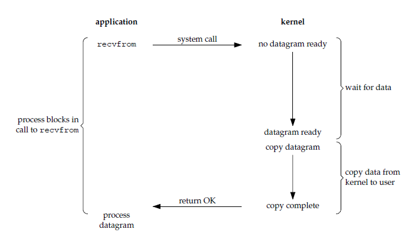
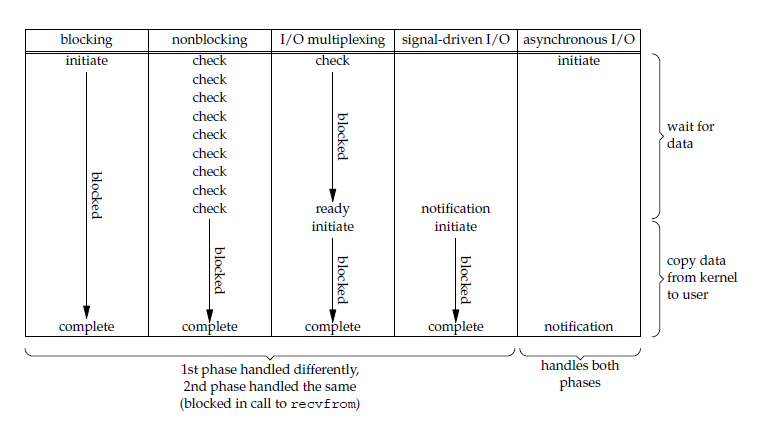
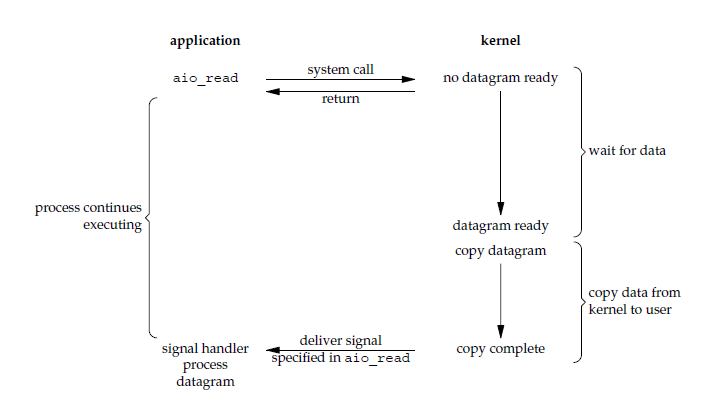

# 计算机网络｜10-Socket 与 I/O 模型

用高层网络库发一个请求只要一行代码：`Socket.connect(...)`、`HttpClient.get(...)`。正因为太容易，出问题时几乎没有抓手——服务端拿到的数据被切成两段、`EAGAIN` 抛出来看不懂、连接数一上去 CPU 空转、线程数一上去内存先崩。这些现象不在“三次握手”或“HTTP 字段”的知识范围内，而在**操作系统把网络 I/O 暴露给应用的方式**里。

另一种常见的学习方式是记住 `select`、`poll`、`epoll` 三个名字和一句“epoll 最快”，但遇到边缘触发、半包、`flush` 卡住时仍然解释不了。原因也很简单：它们不是三个可以互换的 API，而是同一种等待机制在不同历史阶段、不同平台上的表达方式；不理解“谁在等、等到什么、谁负责继续”，换哪个 API 都会踩坑。

本文按这条线索推进：先把 Socket 放回它真正的位置——操作系统提供的端点与接口，再看一条 TCP 连接从监听到关闭经历了什么，接着处理字节流没有消息边界的问题；然后比较“等数据”的几种态度（阻塞、非阻塞、就绪通知、完成通知），展开 `select`/`poll`/`epoll` 与 LT/ET，最后落到部分读写、`EAGAIN`、超时与背压，并给出选型依据。

通用 I/O 术语（同步/异步、缓冲、页缓存）和文件 I/O 栈由 [I/O、存储与文件系统](../03-操作系统与程序运行/05-I-O、存储与文件系统.md) 负责，本文只讲 Socket 语境下的语义。

<!-- GFM-TOC -->
* [Socket 是操作系统提供的通信端点](#socket-是操作系统提供的通信端点)
    * [一条连接由一对套接字端点定义](#一条连接由一对套接字端点定义)
    * [内核里的套接字不是一根线](#内核里的套接字不是一根线)
* [一条 TCP 连接的生命周期](#一条-tcp-连接的生命周期)
    * [监听、连接与 accept 各自做什么](#监听连接与-accept-各自做什么)
    * [用 Dart 观察四元组与 accept](#用-dart-观察四元组与-accept)
* [字节流没有消息边界](#字节流没有消息边界)
    * [半包与“粘包”是同一个问题](#半包与粘包是同一个问题)
    * [成帧：应用自己定义消息边界](#成帧应用自己定义消息边界)
* [等待数据：阻塞与非阻塞](#等待数据阻塞与非阻塞)
    * [把一次输入拆成两个阶段](#把一次输入拆成两个阶段)
    * [非阻塞不等于不等待](#非阻塞不等于不等待)
* [同步、异步、就绪与完成：先把词用对](#同步异步就绪与完成先把词用对)
    * [五种经典模型与两类术语](#五种经典模型与两类术语)
    * [就绪通知与完成通知](#就绪通知与完成通知)
* [I/O 多路复用：把等待集中到一个调用](#io-多路复用把等待集中到一个调用)
    * [select：三个集合，每次重传](#select三个集合每次重传)
    * [poll：数组与 revents](#poll数组与-revents)
    * [epoll：注册一次，返回就绪项](#epoll注册一次返回就绪项)
    * [多路复用没有解决的问题](#多路复用没有解决的问题)
* [LT 与 ET：通知策略，不是性能口号](#lt-与-et通知策略不是性能口号)
* [平台对照：kqueue、IOCP 与 io_uring](#平台对照kqueueiocp-与-io_uring)
* [部分读写、EAGAIN、超时与背压](#部分读写eagain超时与背压)
    * [一次调用不代表一条消息](#一次调用不代表一条消息)
    * [超时要由应用定义](#超时要由应用定义)
    * [背压：写不进去时会发生什么](#背压写不进去时会发生什么)
* [怎么选：连接数、活跃度与运行时](#怎么选连接数活跃度与运行时)
* [常见误区](#常见误区)
* [参考资料](#参考资料)
* [一句话总结](#一句话总结)
<!-- GFM-TOC -->

## Socket 是操作系统提供的通信端点

应用进程与协议栈不在同一个世界：TCP 状态机、重传定时器、收发缓冲区全部在内核里，应用能拿到的只是一个受控入口。**套接字（Socket）就是这个入口**：一组系统调用加上一个内核对象，让进程可以请求内核代替自己完成网络收发。

术语要一次说清：Socket 不是协议，也不是“连接”本身，更不是一根虚拟的线。协议（TCP/UDP）定义了字节怎么传输；Socket 定义的是“应用如何请求这些传输”。请求成功不代表对端已经处理，接口返回也不代表对端已经收到。

### 一条连接由一对套接字端点定义

`socket()` 系统调用创建一个套接字并返回文件描述符（file descriptor，fd），调用时要指定三个维度：

- 地址族（address family）：`AF_INET` / `AF_INET6`，或不需要 IP 的 `AF_UNIX`；
- 套接字类型：`SOCK_STREAM`（字节流）或 `SOCK_DGRAM`（数据报）；
- 协议：通常由前两者推断，也可以显式写 `IPPROTO_TCP` / `IPPROTO_UDP`。

TCP 服务器在某个端口上监听，这个端口是**所有连接的共享入口**。区分不同客户端靠的是四元组：客户端 IP、客户端端口、服务端 IP、服务端端口。RFC 9293 的措辞是“一条连接由一对套接字定义”：每个套接字是“IP 地址 + 端口”的端点，两者配对才唯一确定一条 TCP 连接 [R1]。客户端通常不指定本地端口（`bind` 传 0），由内核在临时端口范围内分配 [R19]，所以每次连接的四元组都不同。

> **关键认知：** Socket 是操作系统提供的接口与端点表示，不是一种协议；一条 TCP 连接由两端的四元组唯一标识，同一个服务端口可以同时承载成千上万条连接。

> **面试高频：** Socket 是协议吗？TCP 连接用什么标识？
> **答题脉络：** 先区分协议与接口 → 说明 `socket()` 返回 fd、本质是内核对象 → 给出四元组 → 说明监听端口只是入口、连接由四元组区分。
> **追问方向：** 为什么客户端端口由内核分配、两台机器上 `(IP, 端口)` 相同是否算同一条连接、Unix 域套接字为什么不需要 IP。

### 内核里的套接字不是一根线

从内核视角看，一个套接字对象包含：收发缓冲区、连接状态（`ESTABLISHED`、`TIME_WAIT` 等）、序号与窗口变量（TCP 时）、等待队列。这些状态的迁移规则属于传输层协议，[UDP、TCP 与 QUIC](./04-传输层：UDP、TCP与QUIC.md) 已经讲清；本文只关心它们如何被应用触发和观察。

这里有一个对后文很重要的细节：fd 只是进程对内核对象的引用。`dup()`、`fork()` 会让多个 fd 指向同一个“打开的文件描述”（open file description），而 `epoll` 的注册键是“fd 编号 + 打开的文件描述”的组合 [R3]。这解释了为什么“关闭一个 fd”不等于“从事件监听里立刻消失”——后文「多路复用没有解决的问题」会用到这个结论。

Unix 域套接字（`AF_UNIX`）使用同一套 socket API，但不经过 IP 网络，属于进程间通信，选型视角见 [同步、进程通信与死锁](../03-操作系统与程序运行/03-同步、进程通信与死锁.md)。

## 一条 TCP 连接的生命周期

### 监听、连接与 accept 各自做什么

服务端与客户端的调用序列不同，但每一步的职责边界很清楚：

```text
服务端：socket() → bind() → listen() → accept() → recv()/send() → close()
客户端：socket() → connect() →            recv()/send() → close()
```

- `listen()` 把套接字标记为被动套接字，此后内核才为它接受连接请求；`backlog` 参数限定“待处理连接”队列的最大长度。队列满时，新连接请求可能被拒绝（客户端看到 `ECONNREFUSED`），也可能被忽略以便稍后重试，取决于底层协议是否重传 [R6]。
- `connect()` 在阻塞模式下会一直等到连接建立；对 TCP 而言，返回成功意味着三次握手已经完成。若套接字是非阻塞的且连接不能立即完成，返回 `EINPROGRESS`，随后要用 `select`/`poll` 等它可写，再通过 `SO_ERROR` 判断成功还是失败 [R8]。
- `accept()` 从队列里取出一条已经建立的连接，返回一个**新的** fd；原来的监听套接字不受影响，继续接受后续连接 [R7]。在 Linux 上，新 fd 不会继承监听套接字的 `O_NONBLOCK` 等文件状态标志，需要显式设置 [R7]。
- `close()` 释放 fd；`shutdown()` 可以只关闭一个方向，对应 TCP 的半关闭。关闭次序、`TIME_WAIT` 的原因已在 [UDP、TCP 与 QUIC](./04-传输层：UDP、TCP与QUIC.md) 展开 [R1]。
- 高并发下还有一个容易忽略的上限：`accept()` 可能因为进程 fd 用尽（`EMFILE`）或系统 fd 用尽（`ENFILE`）而失败 [R7]，“连接数上限”往往先撞到这里。

> **关键认知：** `listen`/`accept` 管理的是连接队列，不是数据；阻塞式 `connect` 成功返回时三次握手已经完成，但服务端可能还没有调用 `accept`，更没有开始处理业务。连接建立与应用接管是两件事。

### 用 Dart 观察四元组与 accept

下面用 Dart 复现这套生命周期。Dart 的 `Socket` 是异步接口：数据以 `Stream<Uint8List>` 事件到达，写入通过 `IOSink` 接口完成，不提供阻塞式 `read` [R16]，等待交给运行时的事件循环（§等待数据）。示例在 Dart 3.12（windows_x64）验证通过。

```dart
  // 1. 服务端绑定回环地址；端口传 0 表示由内核分配一个临时端口。
  final server = await ServerSocket.bind(
    InternetAddress.loopbackIPv4,
    0,
    backlog: 16,
  );
  stdout.writeln('listen: ${server.address.address}:${server.port}');

  // 2. 内核接受连接后，把它作为 Stream 事件交给应用层回调。
  final serverSideText = Completer<String>();
  final serverSubscription = server.listen((socket) {
    final buffer = <int>[];
    socket.listen(
      buffer.addAll,
      onDone: () {
        // 3. 前 4 字节是长度前缀，内容从第 4 字节开始。
        serverSideText.complete(utf8.decode(buffer.sublist(4)));
        socket.destroy();
      },
      onError: serverSideText.completeError,
    );
  });
```

<!-- verify: .work/verify/B16/b16_tcp_lifecycle.dart -->

```dart
  // 4. connect 返回时三次握手已完成，此时服务端业务代码还没有 accept 它。
  final client = await Socket.connect(
    InternetAddress.loopbackIPv4,
    server.port,
  );
  stdout.writeln(
    'client: ${client.address.address}:${client.port} -> '
    '${client.remoteAddress.address}:${client.remotePort}',
  );
  // 5. 关闭 Nagle 合并；请求-响应型小消息通常这样做。
  client.setOption(SocketOption.tcpNoDelay, true);

  // 6. 分两次 add 写长度前缀和内容；TCP 不保留“两次 add”的边界。
  final payload = utf8.encode('ping');
  final header = ByteData(4)..setUint32(0, payload.length, Endian.big);
  client.add(header.buffer.asUint8List());
  client.add(payload);
  await client.flush();
  await client.close();
```

<!-- verify: .work/verify/B16/b16_tcp_lifecycle.dart -->

两段分别摘自 `.work/verify/B16/b16_tcp_lifecycle.dart` 的服务端与客户端部分；完整文件还包含最终断言与资源释放。运行输出（临时端口每次不同）：

```text
listen: 127.0.0.1:13946
client: 127.0.0.1:13947 -> 127.0.0.1:13946
server received: ping
```

其中 `client.close()` 只关闭发送方向，这正是 TCP 半关闭在 API 上的映射；`destroy()` 才双向销毁 [R16]。示例故意分两次写入长度前缀和内容，服务端仍然正确还原了 `ping`——因为服务端自己按“前 4 字节是长度”解析，而不是依赖收发次数。这就是下一节的主题。

## 字节流没有消息边界

先建立一个容易验证的事实：用同一个连接连续 `send` 两次，服务端可能一次就收到全部字节，也可能分三次收到；反过来，一次 `send` 的全部字节也可能被拆开。从应用视角看这像随机行为，但它完全符合 TCP 的承诺。

### 半包与“粘包”是同一个问题

TCP 提供的是“可靠的、按序的字节流”服务 [R1]：它保证字节不丢、不重、不乱序，但**不保留发送方调用的边界**。TCP 报文段的切分由 MSS、发送窗口和 Nagle 算法等实现细节决定，接收端内核缓冲区与应用缓冲区的读取时机又各自决定一次 `recv` 收到多少。于是：

- 一次写、多次读：常被称为“半包”；
- 多次写、一次读：常被称为“粘包”。

两者不是两个缺陷，而是同一件事的两种表现：**流没有消息边界**。“TCP 粘包”这个说法本身有误导性——TCP 从来不知道什么是消息，也就谈不上把消息粘起来；要修的是应用层协议的成帧。UDP 保留数据报边界，代价是可能丢失、重复、乱序，选择依据见传输层主文。

### 成帧：应用自己定义消息边界

既然边界不在传输层，就必须由应用层协议定义。三种常见方案的适用边界：

| 方案 | 边界来源 | 失效条件 |
| --- | --- | --- |
| 固定长度 | 每条消息长度相同 | 消息长度变化时需要填充，协议扩展困难 |
| 分隔符 | 特殊字符序列 | 负载本身含分隔符时必须转义或先编码 |
| 长度前缀 | 头部若干字节记录负载长度 | 头部本身可能被切断，解析器必须能保存半条消息 |

下面是一个可直接运行的解析器核心：它把“4 字节大端长度 + 负载”的字节流还原成消息，并且对任意切分方式都成立。

```dart
/// 把无消息边界的字节流还原成“4 字节大端长度 + 内容”的消息帧。
class LengthPrefixDecoder {
  final _pending = <int>[];

  /// 追加 Socket 读到的一段字节，返回本次凑齐的完整消息。
  List<Uint8List> addChunk(List<int> chunk) {
    _pending.addAll(chunk);
    final messages = <Uint8List>[];
    while (_pending.length >= 4) {
      // 1. 从 4 字节大端长度字段读出本条消息的长度。
      final length =
          (_pending[0] << 24) |
          (_pending[1] << 16) |
          (_pending[2] << 8) |
          _pending[3];
      // 2. 内容不完整就先停在这里，等下一次 addChunk。
      if (_pending.length < 4 + length) break;
      // 3. 取出完整消息，并从待处理缓冲区移除已消费的字节。
      messages.add(Uint8List.fromList(_pending.sublist(4, 4 + length)));
      _pending.removeRange(0, 4 + length);
    }
    return messages;
  }
}
```

<!-- verify: .work/verify/B16/b16_frame_decoder.dart -->

`.work/verify/B16/b16_frame_decoder_check.dart` 用同一段字节流、按 1/3/7/全长四种粒度切分，结果都是完整的 `['first', '第二条', 'third message']`；只喂半个帧时不产出消息。这正是成帧器必须满足的性质：**解码结果只取决于字节内容，不取决于到达方式**。

> **关键认知：** TCP 交付的是字节序列，不是消息；任何“消息”的边界都由应用层协议定义，解析器必须能处理任意切分，并保存未完成的部分。

## 等待数据：阻塞与非阻塞

### 把一次输入拆成两个阶段

Stevens 在《UNIX Network Programming》里把一次套接字输入拆成两个阶段 [R2]：

1. **等待数据就绪**：数据从网络到达内核缓冲区；
2. **复制数据**：从内核缓冲区复制到应用缓冲区。

五种经典模型的区别，本质上是“这两个阶段由谁承担、什么时候阻塞”的不同组合：

- **阻塞 I/O**：两阶段都在 `recvfrom` 调用内完成，调用睡到数据复制完。
- **非阻塞 I/O**：阶段 1 不等待，数据没到就返回 `EAGAIN`；应用需要轮询。阶段 2 仍由应用调用 `recvfrom` 完成，在非阻塞 fd 上不会因等待数据而睡眠，但仍可能部分读取或再次得到 `EAGAIN`。
- **I/O 多路复用**：先用 `select`/`poll`/`epoll_wait` 等等待“某个 fd 就绪”，再调用 `recvfrom`；等待调用本身不复制数据，复制阶段仍由应用发起，阻塞 fd 在就绪与读取之间的竞态下仍可能阻塞，因此通常配合非阻塞 fd。
- **信号驱动 I/O**：注册 `SIGIO`，数据到达时内核发信号，处理程序里再 `recvfrom`；复制阶段仍由应用调用完成 [R11]。
- **异步 I/O**：在支持该语义的 API（如 IOCP、`io_uring`，或特定平台的 AIO）中，提交请求后立即返回，内核完成包括复制在内的操作后再通知；POSIX `aio_read` 对 Socket 的支持并不跨平台一致 [R2]。

<div align="center">
  
</div>
<p align="center">图 1：阻塞 I/O——等待数据与复制数据都在同一个系统调用内完成。来源：Stevens《UNIX Network Programming》I/O 模型图（本库本地化副本）。</p>

阻塞并不意味着整台机器停住：其他进程仍可运行，被阻塞的进程不消耗 CPU。代价是**一个执行流被绑定在一条连接上**，连接数一多就只能靠更多执行流分摊。

### 非阻塞不等于不等待

`EAGAIN` / `EWOULDBLOCK` 的含义是“现在执行这个操作会阻塞”，而不是失败。下面的片段把套接字设为非阻塞后立刻 `recv`，验证无数据时的返回值：

```c
    /* 3. 把客户端套接字设为非阻塞。 */
    int flags = fcntl(client, F_GETFL, 0);
    if (flags < 0)
        die("fcntl F_GETFL");
    if (fcntl(client, F_SETFL, flags | O_NONBLOCK) < 0)
        die("fcntl F_SETFL");

    /* 4. 没有数据时，非阻塞 recv 返回 -1/EAGAIN，而不是睡眠等待。 */
    unsigned char buf[BUF_SIZE];
    errno = 0;
    ssize_t n = recv(client, buf, sizeof buf, 0);
    if (n != -1 || (errno != EAGAIN && errno != EWOULDBLOCK)) {
        fprintf(stderr, "expected EAGAIN, got n=%zd errno=%d\n", n, errno);
        return EXIT_FAILURE;
    }
    printf("nonblocking recv with no data: -1 EAGAIN\n");
```

<!-- verify: .work/verify/B16/linux/b16_stream_edges.c -->

C 片段抽取自 `.work/verify/B16/linux/b16_stream_edges.c`。POSIX 系统调用本身就是知识点，所以这里保留 C 而不是翻译成 Dart；示例在 Ubuntu 22.04（WSL）+ gcc 11.4.0 下用 `gcc -std=c11 -D_GNU_SOURCE -Wall -Wextra` 编译运行通过，完整程序还验证了部分读、读到流结束与 `poll` 等待。

非阻塞只是让调用不睡，应用仍要决定“什么时候再来问”。反复轮询的代价是大量系统调用和 CPU 空转；自己写循环又很难同时等多条连接——这正是 I/O 多路复用要解决的问题。Linux 上还有一个陷阱：`select` 可能报告某个 fd 可读，但随后的 `read` 仍然阻塞（例如数据校验失败被丢弃），man 页的建议是对不该阻塞的 Socket 一律设置 `O_NONBLOCK` [R4]。

Dart 这类托管语言把“非阻塞 + 事件通知”封装进了运行时：`Socket` 的数据通过 Stream 事件到达，等待由事件循环统一处理。**但封装不会消除阻塞点**——在同一个 isolate 里调用同步 `sleep()`，整个事件循环都停住：

```dart
void _showBlockingSleep() {
  var timerFired = false;
  Timer(const Duration(milliseconds: 20), () => timerFired = true);
  // 同步 sleep 让整个 isolate 停住，事件循环里的定时器无法执行。
  sleep(const Duration(milliseconds: 200));
  if (timerFired) {
    throw StateError('timer fired during sleep(); sleep() must block');
  }
  stdout.writeln('sleep() 阻塞期间，事件循环中的定时器没有执行');
}
```

<!-- verify: .work/verify/B16/b16_event_loop.dart -->

同一个文件里两个客户端请求的处理回调会交错执行，输出时间线为 `start A -> start B -> end A -> end B`：在 `await` 处让出控制权，事件循环就能继续服务其他连接。用 `await Future.delayed` 与 `sleep` 的区别，就是这个模型的全部要点。

> **关键认知：** 阻塞/非阻塞只描述“条件不满足时这次调用怎么办”；它不描述谁来等待、也不决定吞吐量。非阻塞的一个连接并不会自己变快，只是把等待的调度权交回应用（或运行时）。

> **面试高频：** 阻塞 I/O 和非阻塞 I/O 有什么区别？
> **答题脉络：** 给出“等待数据 + 复制数据”两阶段模型 → 阻塞在哪些阶段睡 → 非阻塞用 `EAGAIN` 表达“现在不行” → 说明轮询代价与事件循环的动机。
> **追问方向：** `EAGAIN` 与 `EWOULDBLOCK`、`O_NONBLOCK` 与 `MSG_DONTWAIT`、为什么高性能服务器不大量使用阻塞 `recv`。

## 同步、异步、就绪与完成：先把词用对

“同步/异步”是这套知识里最容易被混用的两个词，因为存在两套口径：POSIX/教材口径，以及 JavaScript/Node.js 等语言与框架口径。讨论前先对齐口径，才不会被追问绕进去。

### 五种经典模型与两类术语

按 Stevens 的口径：**只要“从内核缓冲区复制到应用缓冲区”这个阶段由发起调用的执行流承担，就是同步 I/O**。因此阻塞 I/O、非阻塞 I/O、I/O 多路复用、信号驱动 I/O 都属于同步 I/O；只有具备完成通知语义的异步 I/O（例如支持该语义的 AIO、IOCP 或 `io_uring`）把两个阶段都交给内核，完成后才通知应用 [R2]。

<div align="center">
  
</div>
<p align="center">图 2：五种 I/O 模型对比——前四种都是同步 I/O，复制阶段仍由应用发起；只有异步 I/O 把复制也交给内核。来源：Stevens《UNIX Network Programming》I/O 模型图（本库本地化副本）。</p>

<div align="center">
  
</div>
<p align="center">图 3：异步 I/O——`aio_read` 立即返回，数据就绪与复制都由内核完成，最后通知应用。来源：Stevens《UNIX Network Programming》I/O 模型图（本库本地化副本）。</p>

语言/框架口径则宽松得多：在 Node.js、Dart 里说“异步 I/O”，通常指“不阻塞事件循环的 I/O”。它的实现基础往往是非阻塞 + 就绪通知（也就是教材口径里的同步 I/O 多路复用）。两个口径都合理，但**不能混着用**：`epoll` 在 POSIX 口径下不是异步 I/O。

### 就绪通知与完成通知

抛开词汇，接口只有两类事件语义：

- **就绪通知（readiness）**：内核告诉你“现在读或写不会阻塞”。读由应用发起，仍可能是部分读、仍可能失败；`select`、`poll`、`epoll`、`kqueue` 都属于这一类。
- **完成通知（completion）**：应用提交请求，内核把操作做完并把结果（成功/失败/实际长度）放进完成队列；Windows 的 I/O 完成端口（I/O Completion Port，IOCP）与 Linux 的 `io_uring` 属于这一类（§平台对照）。

需要留意就绪通知的边界：`select` 在 Linux 上可能“伪就绪”，就绪只是一个建议而不是保证 [R4]。完成通知则把结果绑在事件上，`io_uring` 的 CQE 里直接带 `res` 字段，等于对应系统调用的返回值 [R13]。

> **关键认知：** 就绪不等于完成：`epoll` 只告诉你“可以读了”，成功与否取决于随后的 `read`；完成通知才把结果一并交给你。把多路复用直接称为“异步 I/O”，只在语言/框架口径下成立。

> **面试高频：** 同步/异步与阻塞/非阻塞是什么关系？
> **答题脉络：** 先按 POSIX 口径给出“复制阶段谁承担”的判据 → 指出前四种模型都是同步 → 说明语言口径的差异 → 再用就绪/完成划出接口语义。
> **追问方向：** `epoll` 算不算异步、`io_uring` 为什么被称为完成式、`async/await` 与内核异步 I/O 是不是一回事。

## I/O 多路复用：把等待集中到一个调用

假设有一万条长连接，其中大多数时间没有数据。阻塞 + 每连接一线程的代价见「怎么选：连接数、活跃度与运行时」；每个连接自己轮询又会烧掉 CPU。多路复用提供的折中是：**把“等谁”从每个 fd 的 I/O 调用里抽出来，交给一个调用统一等待**，等到了再对具体的 fd 做真正的读写。

### select：三个集合，每次重传

`select` 接收集合、返回哪些 fd 就绪：

```c
    /* 1. select：监听两个服务端 fd，空闲时超时返回 0。 */
    fd_set readfds;
    struct timeval timeout;
    int maxfd = s1 > s2 ? s1 : s2;
    FD_ZERO(&readfds);
    FD_SET(s1, &readfds);
    FD_SET(s2, &readfds);
    timeout.tv_sec = 0;
    timeout.tv_usec = 200000;
    ready = select(maxfd + 1, &readfds, NULL, NULL, &timeout);
    if (ready != 0) {
        fprintf(stderr, "select idle: %d\n", ready);
        return EXIT_FAILURE;
    }
    printf("select: idle -> 0 ready fds\n");
```

<!-- verify: .work/verify/B16/linux/b16_multiplexing.c -->

要点：

- `nfds` 必须是“三个集合中最大 fd + 1”，`select` 检查范围以内集合里的 fd；
- 返回后**集合被就地修改**，只留下就绪项，因此每次调用前必须用 `FD_ZERO`/`FD_SET` 重建 [R4]；
- 超时是 `struct timeval`（秒 + 微秒字段），但会被向上取整到系统时钟粒度，实际精度受调度影响 [R4]；“select 微秒精度所以适合硬实时”不是可靠结论；
- glibc 把 `fd_set` 实现为固定大小数组，`FD_SETSIZE` 默认 1024，只能监听编号小于它的 fd；内核本身没有这个固定上限，是用户态实现带来的限制 [R4]。验证环境（Ubuntu 22.04 + glibc）实测 `FD_SETSIZE=1024`。

### poll：数组与 revents

`poll` 用数组表达“关注哪些事件”，输入输出分离：

```c
    /* 3. poll：events 是输入，revents 是输出，调用不会破坏输入。 */
    struct pollfd fds[2] = {
        {.fd = s1, .events = POLLIN},
        {.fd = s2, .events = POLLIN},
    };
    int pr = poll(fds, 2, 0);
    if (pr != 0) {
        fprintf(stderr, "poll idle: %d\n", pr);
        return EXIT_FAILURE;
    }
    printf("poll: idle -> 0 ready fds\n");
```

<!-- verify: .work/verify/B16/linux/b16_multiplexing.c -->

- `events` 是关注的事件掩码，`revents` 由内核填充实际发生的事件；`POLLERR`、`POLLHUP`、`POLLNVAL` 只在 `revents` 中出现 [R5]；
- 超时单位是毫秒，负值表示无限等待，0 表示立即返回 [R5]；
- 没有 `FD_SETSIZE` 限制，但 `nfds` 超过 `RLIMIT_NOFILE` 会报 `EINVAL` [R5]；
- `select`/`poll` 每次调用都需要把整个集合从用户态传入内核并扫描一遍，这是它们在 fd 很多时的固有成本。

### epoll：注册一次，返回就绪项

`epoll` 把监听集合放进内核对象，调用分三步：

```c
    /* 4. epoll：先注册，epoll_wait 只返回就绪项。 */
    int epfd = epoll_create1(EPOLL_CLOEXEC);
    if (epfd < 0)
        die("epoll_create1");
    struct epoll_event ev;
    ev.events = EPOLLIN;
    ev.data.fd = s1;
    if (epoll_ctl(epfd, EPOLL_CTL_ADD, s1, &ev) < 0)
        die("epoll_ctl s1");
    ev.data.fd = s2;
    if (epoll_ctl(epfd, EPOLL_CTL_ADD, s2, &ev) < 0)
        die("epoll_ctl s2");
```

<!-- verify: .work/verify/B16/linux/b16_multiplexing.c -->

- `epoll_create1()` 创建 epoll 实例；`epoll_create()` 的 `size` 参数自 Linux 2.6.8 起被忽略，新代码用 `epoll_create1` [R12]；
- `epoll_ctl()` 用 `EPOLL_CTL_ADD`/`MOD`/`DEL` 增删改关注项，这些项构成**兴趣列表**（interest list）；`epoll_wait()` 从**就绪列表**（ready list）取事件 [R3]；
- 因此关注集合只在变更时传入一次内核，`epoll_wait` 也只返回就绪项，不必扫描全部集合——这正是它在“大量长连接、少量活跃”场景下的优势来源；
- 它不是没有上限：受 `RLIMIT_NOFILE` 和 `/proc/sys/fs/epoll/max_user_watches`（每用户可注册总数）限制，每个注册 fd 都占内核内存（man 页给出的量级是 32 位内核约 90 字节、64 位内核约 160 字节，随版本与配置变化）[R3]；频繁增删关注项还要付出 `epoll_ctl` 系统调用的成本。

完整程序依次验证了三种接口都只在对应 fd 上报告就绪，输出如下：

```text
FD_SETSIZE=1024
select: idle -> 0 ready fds
select: only s1 is readable
poll: idle -> 0 ready fds
poll: only s2 has POLLIN in revents
epoll: idle -> 0 ready fds
epoll: only s1 reported
epoll LT: unread bytes reported again
all checks passed
```

### 多路复用没有解决的问题

- **不搬数据**：就绪只是许可，真正的读写仍由 `recv`/`send` 完成；`epoll` 不会替你把数据放进应用缓冲，也不减少一次 I/O 的复制开销（零拷贝与页缓存由 [I/O、存储与文件系统](../03-操作系统与程序运行/05-I-O、存储与文件系统.md) 负责）。
- **不消除部分读写与背压**：事件只说明“现在可以试”，读多少、写不写得进去仍取决于缓冲区。
- **跨线程关闭 fd 是竞态，不是谁的“特性”**：`select(2)` 明确写了“在另一个线程关闭被监视的 fd，结果未规定”——Linux 上的行为是对已经阻塞的 `select` 没有影响，但依赖任何特定行为都被视为 bug [R4]；`epoll` 的移除语义是“所有指向同一个打开的文件描述的 fd 都关闭后，才从兴趣列表移除”，所以可能继续收到已 `close` 的 fd 的事件 [R3]。正确做法是显式 `EPOLL_CTL_DEL`，或让拥有该 fd 的线程统一关闭，而不是相信某个 API“更友好”。

> **关键认知：** 多路复用只回答“现在哪些 fd 可以不妨碍地读写”；真正的读写、错误处理、缓冲与背压仍由应用承担。

> **面试高频：** `select`、`poll`、`epoll` 有什么区别，为什么大并发用 `epoll`？
> **答题脉络：** 从接口形态（集合/数组/内核注册）→ 每次调用是否重传集合与扫描 → 数量限制来源（`FD_SETSIZE` vs `RLIMIT_NOFILE`）→ 就绪返回方式 → 说明“大量长连接、少量活跃”才是 `epoll` 的主场。
> **追问方向：** `epoll` 的内核实现（红黑树与就绪链表属于实现细节）、`EPOLLONESHOT`、`epoll_ctl` 频繁调用的代价、为什么小规模场景 `select` 也可以。

## LT 与 ET：通知策略，不是性能口号

`epoll` 有两种通知策略：

- **水平触发（level-triggered，LT）**：默认模式。只要条件成立（缓冲区可读/可写），每次 `epoll_wait` 都会再次报告；语义上等价于更快的 `poll` [R3]。
- **边缘触发（edge-triggered，ET）**：只在状态**变化**时报告一次。登记 `EPOLLET` 后，如果一次事件对应的数据没有读空，剩余数据不会再触发事件，直到有新数据到达 [R3]。

man 页给的标准场景是：管道写入 2 KB，`epoll_wait` 报告可读；应用只读走 1 KB；ET 模式下下一次 `epoll_wait` **会一直阻塞**，尽管缓冲区里还有 1 KB [R3]。要避免卡死，就必须非阻塞 + 读到 `EAGAIN`：

```c
    /* 2. ET：同样只读一半，下一次 epoll_wait 不再报告剩余数据。 */
    int et[2];
    int et_fd = make_pipe_with_data(et);
    ev.events = EPOLLIN | EPOLLET;
    ev.data.fd = et_fd;
    if (epoll_ctl(epfd, EPOLL_CTL_ADD, et_fd, &ev) < 0)
        die("epoll_ctl ET");
```

<!-- verify: .work/verify/B16/linux/b16_epoll_lt_et.c -->

```c
    /* 3. ET 的正确读法：一次通知对应一次读空，直到 EAGAIN。 */
    size_t drained = 0;
    for (;;) {
        ssize_t r = read(et_fd, buf, sizeof buf);
        if (r > 0) {
            drained += (size_t)r;
            continue;
        }
        if (r == -1 && (errno == EAGAIN || errno == EWOULDBLOCK))
            break;
        die("read ET");
    }
```

<!-- verify: .work/verify/B16/linux/b16_epoll_lt_et.c -->

该程序在同一份数据上对比两种模式，输出：

```text
LT: read half, still reported by next epoll_wait
ET: read half, no further event for the remaining bytes
ET: drain until EAGAIN, 1024 bytes left consumed
ET: new data triggers a new event
```

| 维度 | LT（默认） | ET（`EPOLLET`） |
| --- | --- | --- |
| 通知时机 | 条件成立就报告 | 只在变化时报告 |
| 未读空时 | 下一次继续报告 | 不再报告，直到新数据到达 |
| 编程要求 | 没有强制要求非阻塞 | 必须非阻塞，并读到 `EAGAIN` |
| 适用场景 | 事件循环处理粒度较大、逻辑简单 | 一次事件内做批量读取、希望减少重复通知 |

还有 `EPOLLONESHOT`：事件报告一次后自动禁用该 fd，处理完成要用 `EPOLL_CTL_MOD` 重新武装，适合“一个 fd 同一时间只应由一个线程处理”的多线程场景 [R3]。

> **关键认知：** ET 不是“更快的 LT”，它把“缓冲区里还有没有未读数据”的责任从内核移交给应用循环；代价是必须读到 `EAGAIN`，否则会永久丢失通知。

> **面试高频：** LT 和 ET 有什么区别？为什么 ET 要一直读到 `EAGAIN`？
> **答题脉络：** 先说通知条件（条件 vs 变化）→ 用“只读一半”的场景说明 ET 会静默 → 给出非阻塞 + 读空的做法 → 最后说明收益是减少重复事件、代价是编程复杂度。
> **追问方向：** ET 下只读一半又来了新数据会怎样、`EPOLLONESHOT` 解决什么问题、LT 会不会导致惊群。

## 平台对照：kqueue、IOCP 与 io_uring

三个平台的对应接口解决同一类问题，但语义不必相同：

| 平台 | 接口 | 事件语义 | 一次调用的作用 |
| --- | --- | --- | --- |
| Linux | `epoll` | 就绪通知 | `epoll_ctl` 注册，`epoll_wait` 取就绪项 |
| BSD/macOS | `kqueue`/`kevent` | 就绪通知 | `kevent` 同时提交变更并取回事件 |
| Windows | IOCP | 完成通知 | 绑定句柄到完成端口，用 `GetQueuedCompletionStatus` 取完成包 |
| Linux | `io_uring` | 完成通知 | 共享 SQ 提交请求，共享 CQ 取回结果 |

- **kqueue**：事件用 `(ident, filter)` 对描述，一次 `kevent()` 调用既能提交 `changelist` 又能取回 `eventlist`；同一 fd 上多次触发会聚合成一个 `kevent`；`close()` 会移除引用该 fd 的 kevent [R15]。
- **IOCP**：为多处理器系统提供“异步 I/O + 线程池”的模型；完成的 I/O 请求以完成包形式进入队列，线程用 `GetQueuedCompletionStatus` 领取；创建端口时指定的并发值限制可同时运行的线程数，避免线程数随 I/O 数增长 [R14]。
- **io_uring**：用户态与内核态通过共享的提交队列（submission queue，SQ）与完成队列（completion queue，CQ）通信；应用把描述请求的 SQE 放进 SQ，内核把结果 CQE 放进 CQ，队列项本身可共享而无需来回复制。业务数据是否复制仍取决于缓冲区注册、操作类型和内核实现，不能把 `io_uring` 自动等同于零拷贝 [R13]。它是完成式接口，适合批量提交与需要真实异步语义的场景，但不是 `epoll` 的 drop-in 替代——就绪模型在大量既有代码与框架里仍然是主流。

> **时效信息（核查日期：2026-09-21）：** `io_uring` 随内核版本持续演进，不同特性所要求的最低内核版本与安全策略（如 `io_uring_disabled`）需要按目标环境逐项核对 [R13]。本文只讲模型差异，不再给出特指某个内核版本的默认值。

> **关键认知：** 换平台或换接口前先确认它是就绪通知还是完成通知；两者的状态机、错误处理和缓冲管理方式都不同，只换函数名会写出错误的程序。

## 部分读写、EAGAIN、超时与背压

### 一次调用不代表一条消息

接口层还有几组必须处理的返回值，它们在文档里都有明确语义：

- `recv()` 返回“当前可用的数据”，最多不超过请求的字节数，**不会**等到请求量满足才返回 [R9]；
- 非阻塞且无数据：返回 -1，`errno` 为 `EAGAIN` 或 `EWOULDBLOCK` [R9]；
- 对端有序关闭：返回 0，即流结束（EOF）；这里的 0 不是“收到空数据” [R9]；
- `write()`/`send()` 也可能只写出一部分；非阻塞写不下时返回 `EAGAIN`，对端关闭后写会得到 `EPIPE`（并可能伴随 `SIGPIPE`）[R10]。

所以完整的读取逻辑永远是“循环 + 记账 + 成帧”：记住已经读了多少、还缺多少，把 §成帧 的解析器喂满。任何“读一次就能拿到完整请求”的假设，都是半包问题的来源。

### 超时要由应用定义

内核提供的超时是**单次调用**级别的：设置 `SO_RCVTIMEO`/`SO_SNDTIMEO` 后，阻塞超过阈值且没有数据时返回 -1，`errno` 为 `EAGAIN`/`EWOULDBLOCK`，行为与非阻塞套接字相同；这些超时只对执行 Socket I/O 的系统调用有效，对 `select`/`poll`/`epoll_wait` 没有影响 [R11]。

一个请求的等待时间通常横跨建连、写入、读取和重试，因此正确的做法是在应用层定义覆盖整个操作的 deadline，而不是只给某一次 `recv` 设超时。Dart 的 `Socket.connect` 提供了超时参数：超时会抛出 `SocketException` 并取消所有进行中的连接尝试；如果系统级超时更短，可能提前失败 [R18]。下面验证连接被拒绝时的错误形态：

```dart
  // 1. 先占用一个端口再释放，得到一个当前无监听者的端口号。
  final probe = await ServerSocket.bind(InternetAddress.loopbackIPv4, 0);
  final port = probe.port;
  await probe.close();

  try {
    // 2. 连接没有监听的端口：内核返回 RST，Dart 侧抛出 SocketException。
    await Socket.connect(
      InternetAddress.loopbackIPv4,
      port,
      timeout: const Duration(seconds: 2),
    );
    throw StateError('connect should have failed');
  } on SocketException catch (error) {
    // 3. osError 里的错误码是平台相关的系统错误码。
    stdout.writeln(
      'connect failed: ${error.message} '
      '(osError=${error.osError?.errorCode})',
    );
  }
```

<!-- verify: .work/verify/B16/b16_connect_error.dart -->

还要区分两种“超时”：TCP 自己的重传超时（RTO）由内核根据 RTT 估计与退避策略决定，处理的是丢包；应用层的 deadline 处理的是“用户不想等”，两者不在一个层面 [R1]。

### 背压：写不进去时会发生什么

内核收发缓冲区是有限的，TCP 还有接收窗口机制控制在途数据量。当接收方不读数据时，窗口收缩，发送方的内核缓冲区最终写满，此时：

- 阻塞写可能持续等待，直到缓冲区有空间、连接出错或对端关闭；
- 非阻塞写（或托管运行时里待完成的 `flush`）只能等条件变化。

Dart 里可以稳定复现这个现象：接收端 `pause()` 后，发送端写 64 MiB 并 `flush()`，在观察窗口内 `flush` 不会完成；接收端 `resume()` 后发送继续推进，`flush` 完成：

```dart
  final server = await ServerSocket.bind(InternetAddress.loopbackIPv4, 0);
  server.listen((socket) {
    final subscription = socket.listen(
      (data) => receivedByServer += data.length,
      onDone: serverDone.complete,
    );
    // 1. 立刻暂停读取：应用不消费，数据只能堆在内核缓冲区里。
    subscription.pause();
    accepted.complete(subscription);
    acceptedSocket.complete(socket);
  });
```

<!-- verify: .work/verify/B16/b16_backpressure.dart -->

运行输出为 `flush still pending while reader is paused` 与 `server received 64 MiB`。需要注意 `IOSink.flush` 的定义是“所有缓冲数据被底层消费者接受”，官方文档明确注明这不等于操作系统已经把数据发出 [R17]——它观察的是运行时与内核之间的边界，不是对端的 ACK。

把背压当成异常去“重试 or 丢弃”，往往会破坏流控；正确做法是尊重它：等 `flush`、暂停生产、或按业务定义丢弃/降级策略。

> **关键认知：** `EAGAIN` 与“`flush` 未完成”都不是错误，而是“现在不能继续”的信号；超时必须由应用自己定义并覆盖整个请求，内核的 TCP 重传不替你解决等待太久的问题。

> **面试高频：** 为什么一次 `read` 可能读不满？`EAGAIN` 是错误吗？
> **答题脉络：** 字节流没有消息边界 → `recv` 返回“最多这么多” → `EAGAIN` 表示“现在不行” → 0 表示对端有序关闭 → 由应用维护记账与成帧循环。
> **追问方向：** `MSG_WAITALL` 为什么仍可能短读、非阻塞写返回的字节数含义、`SIGPIPE` 默认终止进程的影响。

## 怎么选：连接数、活跃度与运行时

三种典型方案的取舍：

1. **阻塞 I/O + 每连接一线程/进程**：代码直观，适合连接数有限、每条连接都在持续干活的场景（内部工具、传统请求-响应服务）。代价是每个执行流独立的栈空间与调度成本，连接数多而活跃度低时最不划算；连接上限还受 fd 限制约束。
2. **就绪多路复用 + 事件循环**：少量线程管理大量空闲连接，是“大量长连接、少量活跃”的标准答案。前提是遵守纪律：非阻塞 fd、按 LT/ET 各自的要求读写、回调里不做长时间同步计算（否则整条事件循环被饿死，§非阻塞不等于不等待 的 `sleep` 就是最小反例）。
3. **完成式接口（IOCP、`io_uring`）**：把结果直接交给应用，适合批量、高吞吐或需要真实异步语义的场景；代价是平台/内核版本约束、生态与调试工具的适配程度。

选择依据是**连接数 × 活跃度 × 每连接状态 × 平台 × 运行时**，而不是“哪个 API 更新”。在 Dart、Java、Go 这类运行时里，多路复用已经被封装：你写 `await` 时用的仍是同一批系统调用语义，部分读写、`EAGAIN`、背压一个都不会消失，只是不再由你直接处理。

> **面试高频：** 一个连接一个线程的代价是什么？
> **答题脉络：** 每线程独立栈与上下文切换成本 → 大量空闲连接时的资源浪费 → fd 与调度上限 → 多路复用把等待成本从“每连接”变成“每活跃事件” → 给出适用边界。
> **追问方向：** 线程池能缓解什么、不能消除什么；`epoll` 与线程池如何配合；协程/虚拟线程改变了哪些成本。

## 常见误区

- ❌ Socket 是一种协议。
- ✅ Socket 是操作系统提供的接口与端点；协议是 TCP/UDP，Socket 只是请求这些协议服务的入口，`AF_UNIX` 套接字甚至可以不用 IP。
- ❌ `accept` 返回时才完成三次握手。
- ✅ 内核完成后把连接放进队列，`accept` 只是从队列取出一条已建立的连接并返回新 fd；`connect` 成功返回时对端可能还没 `accept`。
- ❌ TCP 会“粘包”，需要靠设置 `tcpNoDelay` 解决。
- ✅ TCP 是字节流，本来就没有消息边界，“半包/粘包”是应用层缺少成帧；`tcpNoDelay` 只影响发送时机，不定义边界。
- ❌ ET 比 LT 效率高，所以应该默认用 ET。
- ✅ ET 减少重复通知，但要求非阻塞并读到 `EAGAIN`；选哪种取决于事件循环的读写策略，不是效率口号。
- ❌ `epoll` 没有数量限制，可以无限注册 fd。
- ✅ 它摆脱了 `FD_SETSIZE`，但仍受 `RLIMIT_NOFILE` 与 `max_user_watches` 限制，且每个注册项占内核内存。
- ❌ `epoll` 会帮你把数据读进缓冲区。
- ✅ 多路复用只报告就绪，读写仍要应用自己发起；它也不减少一次 I/O 的复制开销。
- ❌ 非阻塞 I/O 就是异步 I/O。
- ✅ 非阻塞只让第一阶段不等待，复制阶段仍由应用承担，按 POSIX 口径属于同步 I/O；异步 I/O 指完成通知。
- ❌ `EAGAIN` 说明程序出错了，应该重试到成功为止。
- ✅ 它表示“现在不行”，配合事件循环等待条件变化即可；无脑忙等只会消耗 CPU。
- ❌ 一次 `read` 读到的就是一条完整消息。
- ✅ `recv` 只保证“最多返回请求量”，解析器必须处理任意切分并保存未完成部分。

## 参考资料

- [R1] [RFC] [RFC 9293: Transmission Control Protocol (TCP)](https://www.rfc-editor.org/rfc/rfc9293) — IETF（取代 RFC 793），第 2.2 节“Key TCP Concepts”、第 3.4.1 节“连接由一对套接字定义”与术语表，[核查日期：2026-09]。
- [R2] [教材] [UNIX Network Programming, Volume 1: The Sockets Networking API](https://www.pearson.com/en-us/subject-catalog/p/unix-network-programming-volume-1-the-sockets-networking-api/P200000003410) — Stevens、Fenner、Rudoff，第 3 版（2003），第 6 章“I/O 模型”（两阶段模型与五种模型分类），ISBN 978-0-13-141155-5，[核查日期：2026-09]。
- [R3] [man] [epoll(7)](https://man7.org/linux/man-pages/man7/epoll.7.html) — Linux man-pages 6.18，兴趣列表与就绪列表、LT/ET 语义、`EPOLLONESHOT`、`max_user_watches` 与跨线程关闭语义，[核查日期：2026-09]。
- [R4] [man] [select(2)](https://man7.org/linux/man-pages/man2/select.2.html) — Linux man-pages 6.18，集合就地修改、`FD_SETSIZE`、伪就绪、超时取整与跨线程关闭的未规定行为，[核查日期：2026-09]。
- [R5] [man] [poll(2)](https://man7.org/linux/man-pages/man2/poll.2.html) — Linux man-pages 6.18，`pollfd` 与 `revents`、毫秒超时、`POLLERR`/`POLLHUP`/`POLLNVAL`，[核查日期：2026-09]。
- [R6] [man] [listen(2)](https://man7.org/linux/man-pages/man2/listen.2.html) — Linux man-pages 6.18，被动套接字与 `backlog` 队列满时的行为，[核查日期：2026-09]。
- [R7] [man] [accept(2)](https://man7.org/linux/man-pages/man2/accept.2.html) — Linux man-pages 6.18，返回新 fd、监听套接字不受影响、新 fd 不继承文件状态标志与 `EMFILE`/`ENFILE`，[核查日期：2026-09]。
- [R8] [man] [connect(2)](https://man7.org/linux/man-pages/man2/connect.2.html) — Linux man-pages 6.18，`EINPROGRESS` 与非阻塞连接的完成判定，[核查日期：2026-09]。
- [R9] [man] [recv(2)](https://man7.org/linux/man-pages/man2/recv.2.html) — Linux man-pages 6.18，部分读、`EAGAIN`/`EWOULDBLOCK`、对端有序关闭返回 0，[核查日期：2026-09]。
- [R10] [man] [write(2)](https://man7.org/linux/man-pages/man2/write.2.html) — Linux man-pages 6.18，非阻塞写与 `EAGAIN`、`EPIPE` 与 `SIGPIPE`，[核查日期：2026-09]。
- [R11] [man] [socket(7)](https://man7.org/linux/man-pages/man7/socket.7.html) — Linux man-pages 6.18，`SO_RCVTIMEO`/`SO_SNDTIMEO` 语义、`SIGIO` 事件表与 `SO_REUSEPORT`，[核查日期：2026-09]。
- [R12] [man] [epoll_create(2)](https://man7.org/linux/man-pages/man2/epoll_create.2.html) — Linux man-pages 6.18，`size` 参数自 Linux 2.6.8 起被忽略、`epoll_create1` 与 `EPOLL_CLOEXEC`，[核查日期：2026-09]。
- [R13] [man] [io_uring(7)](https://man7.org/linux/man-pages/man7/io_uring.7.html) 与 [io_uring_setup(2)](https://man7.org/linux/man-pages/man2/io_uring_setup.2.html) — liburing 项目 man 页，共享 SQ/CQ 环、SQE/CQE 与 `res` 字段、`io_uring_disabled` 策略，[核查日期：2026-09]。
- [R14] [官方文档] [I/O Completion Ports](https://learn.microsoft.com/en-us/windows/win32/fileio/i-o-completion-ports) — Microsoft Learn，完成包、`GetQueuedCompletionStatus` 与并发值语义，[核查日期：2026-09]。
- [R15] [man] [kqueue(2)](https://man.freebsd.org/cgi/man.cgi?query=kqueue&sektion=2) — FreeBSD man 页，`(ident, filter)`、`changelist`/`eventlist`、事件聚合与 `close()` 移除 kevent，[核查日期：2026-09]。
- [R16] [官方文档] [Dart: Socket class](https://api.dart.dev/dart-io/Socket-class.html) — Dart API，Stream 与 IOSink 接口、`tcpNoDelay`、[Socket.destroy](https://api.dart.dev/dart-io/Socket/destroy.html)（双向销毁）与 [Socket.close](https://api.dart.dev/dart-io/Socket/close.html)（只关闭发送方向），[核查日期：2026-09]。
- [R17] [官方文档] [Dart: IOSink.flush](https://api.dart.dev/dart-io/IOSink/flush.html) — Dart API，“完成于缓冲数据被底层消费者接受，不必然等于操作系统已发出”，[核查日期：2026-09]。
- [R18] [官方文档] [Dart: Socket.connect](https://api.dart.dev/dart-io/Socket/connect.html) — Dart API，`timeout` 参数与超时时的行为，[核查日期：2026-09]。
- [R19] [man] [bind(2)](https://man7.org/linux/man-pages/man2/bind.2.html) — Linux man-pages 6.18，端口号为 0 时由内核选择临时端口，[核查日期：2026-09]。

## 一句话总结

> Socket 是操作系统提供给应用的通信端点与接口：它把传输层的状态机、缓冲区和事件通知暴露出来，而阻塞/非阻塞、就绪/完成、LT/ET、部分读写与背压这些语义决定了应用必须自己承担多少“等待、搬运与边界”的责任。
