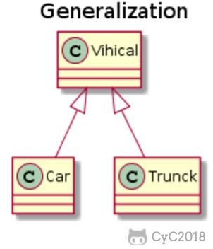
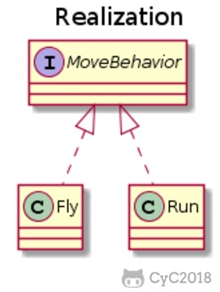
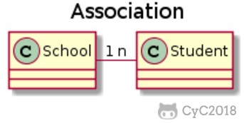
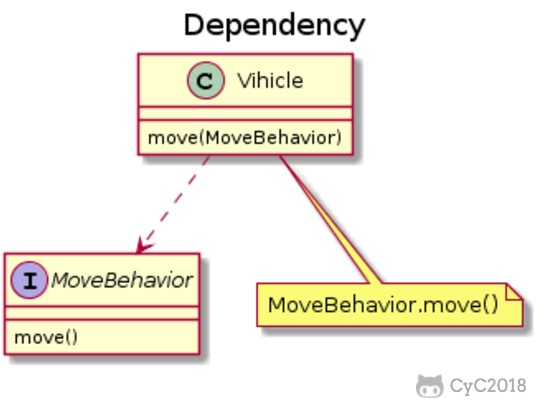
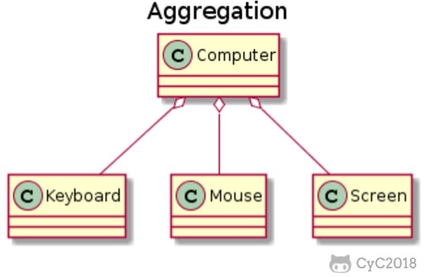
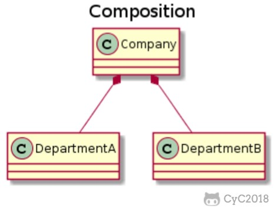

# 程序设计与软件设计｜面向对象与设计原则

接手一段半年没人动的结算代码时，最先出问题的往往不是算法：同一份折扣规则散落在三个文件里，新增一种通知渠道要改五处 `switch`，某个 `set` 方法能把账户余额改成负数。这些问题的共同点不是"没有用面向对象"，而是没人在变化面前把边界划对。

把面向对象记成"封装、继承、多态"三句口诀，很容易把它当成给现实名词建类：`User`、`UserManager`、`UserManagerHelper` 一路套下去，继承当复用首选，SOLID 当成必须逐条满足的规则。真正决定维护成本的是另一件事：谁持有状态、谁能改动它、需求变化时哪些代码必须跟着改。

本文按"变化 → 机制 → 表达 → 原则 → 判断"推进：先建立"对象是不变量边界"的模型，再看封装、抽象、继承、多态各自控制哪一类变化，然后用 UML 把类之间的关系说清楚，接着逐条拆开 SOLID 与依赖注入，最后用一次完整的设计判断演练收口。所有 Dart 代码都在验证项目中通过 `dart analyze` 与带断言的运行。

> **关键认知：** 面向对象的收益来自"把状态和修改它的规则放进同一个边界"，而不是"把现实世界里的名词都建成类"。

<!-- GFM-TOC -->
* [从变化与边界理解面向对象](#从变化与边界理解面向对象)
* [封装、抽象、继承与多态](#封装抽象继承与多态)
* [继承的能力与成本](#继承的能力与成本)
* [Dart 的接口、抽象类与类修饰符](#dart-的接口抽象类与类修饰符)
* [用 UML 表达对象关系](#用-uml-表达对象关系)
* [SOLID 不是五条口号](#solid-不是五条口号)
* [依赖注入是装配方式，不是框架](#依赖注入是装配方式不是框架)
* [函数式思想对现代对象设计的影响](#函数式思想对现代对象设计的影响)
* [其他实用原则与冲突](#其他实用原则与冲突)
* [一次设计判断示例](#一次设计判断示例)
* [常见误区与面试答题路径](#常见误区与面试答题路径)
* [参考资料](#参考资料)
* [一句话总结](#一句话总结)
<!-- GFM-TOC -->

## 从变化与边界理解面向对象

先看没有边界时代码会变成什么样。购物车要支持折扣，最直接的写法是把规则写成条件分支：`if (类型 == 满减 && 小计 >= 门槛) 总价 -= 减免`、`else if (类型 == 打折) 总价 *= 折扣率`，再加一条会员日分支。

问题不在写法，而在**依赖方向**：折扣参数散落在调用方，新增规则要回到计算总价处改分支；同一份门槛判断在结算页和下单流程各写一遍，迟早不一致；如果有人把折扣率算成负数，没有任何一层会拦下它。对象模型要解决的就是这三件事：把数据与作用于它的操作放进同一个边界，把不变量写成可执行的检查，把依赖方向调转过来。

对象不是"现实名词的映射"。判断一个概念要不要建类，看它是否满足其中之一：有需要一起维护的状态与约束（"余额永不为负"），有值得命名、会被反复调用的行为（`withdraw`），或者是独立的变化单元（折扣规则、通知渠道）。三者都不满足的概念，用函数或简单数据结构就够了。只持有字段、把规则留给外部代码的类是**数据袋子**：它的约束由谁维护并不确定，任何一处改写都可能破坏它。设计模式就是这些边界划分经验的名字，索引见[设计模式目录](./04-设计模式/README.md)。

> **关键认知：** 对象的价值边界是"状态 + 行为 + 不变量"；数据袋子式的类只借用了对象的语法，没有获得对象的好处。

## 封装、抽象、继承与多态

### 封装：把不变量关进边界内

以下两段代码合起来是完整文件 `encapsulation_demo.dart`（第一段是文件正文，第二段截取 `main` 主体，省略其中的断言与异常捕获）。验证环境：Dart 3.12.2；纯 Dart，无第三方依赖；`dart analyze` 无问题，`dart run --enable-asserts` 通过。

```dart
/// 反例：余额是公开可写字段，任何人都能写出非法状态。
final class NaiveAccount {
  NaiveAccount(this.balanceInCents);

  int balanceInCents;
}

/// 正例：余额只能通过业务行为改变，不变量在边界内维持。
final class BankAccount {
  BankAccount(this.owner, {int openingBalanceInCents = 0})
    : _balanceInCents = _requireNonNegative(openingBalanceInCents);

  final String owner;
  int _balanceInCents;

  // 1. 只读出口：外部能观察余额，不能直接改写它。
  int get balanceInCents => _balanceInCents;

  // 2. 业务动作负责校验与维护不变量。
  void withdraw(int amountInCents) {
    if (amountInCents <= 0) {
      throw ArgumentError.value(amountInCents, 'amountInCents', '取款金额必须为正');
    }
    if (amountInCents > _balanceInCents) {
      throw StateError('余额不足：当前 $_balanceInCents 分');
    }
    _balanceInCents -= amountInCents;
  }

  static int _requireNonNegative(int value) {
    if (value < 0) {
      throw ArgumentError.value(value, 'openingBalanceInCents', '开户余额不能为负');
    }
    return value;
  }
}
```

<!-- verify: .work/verify/B17/encapsulation_demo.dart -->

```dart
void main() {
  final account = BankAccount('Ada', openingBalanceInCents: 10000);
  account.withdraw(2500);
  print('余额：${account.balanceInCents} 分');

  final naive = NaiveAccount(500);
  naive.balanceInCents = -500; // 编译通过，状态已经不合法
  print('反例余额：${naive.balanceInCents} 分');
}
```

<!-- verify: .work/verify/B17/encapsulation_demo.dart -->

运行输出是 `余额：7500 分` 与 `反例余额：-500 分`：`NaiveAccount` 允许把余额写成负数，编译器不阻止，测试也未必覆盖；`BankAccount` 把"余额 ≥ 0"写进构造与每次变更，非法状态在进入边界时就被拒绝，内部用"分"存储这个实现细节也不再泄漏到调用方。

这里最容易混淆的是：**信息隐藏不等于给每个字段套一层 getter/setter**。封装的判据是"调用方是否需要知道"，而不是"成员是否可见"。给内部字段配一对无校验的 getter/setter，只是把公开字段换个写法，外部仍能写进非法状态。Effective Dart 的建议也是如此：不要为形式上的封装无意义地包一层，只读属性优先用 `final` 字段表达（[R9]，[核查日期：2026-09]）。真正的封装会主动**减少**可见的东西：能用构造参数一次定好就不再提供可变入口，能用业务动作表达（`withdraw`）就不暴露字段级修改能力。

> **关键认知：** 封装衡量的是"外部能否绕过规则把对象改成非法状态"，不是"字段是否私有、是否配了 getter/setter"。

> **面试高频：** 封装与信息隐藏有什么区别？
> **答题脉络：** 封装强调状态与操作同处一个边界并维护不变量 → 信息隐藏强调外部只看到必要接口 → 私有字段只是手段，判据是"外部能否构造非法状态" → 用 getter/setter 反例说明二者不等价。
> **追问方向：** 不可变对象与封装的关系、`final` 字段是否等于不可变、防御性复制（见[对象复制、所有权与深浅拷贝](./02-对象复制、所有权与深浅拷贝.md)）。

### 抽象：只暴露调用者需要的那部分

抽象回答的是"调用者必须先知道什么"：签名越贴合调用者的需要，调用方对实现的依赖就越少。抽象还有一层常被忽略的作用：它**决定依赖方向**。结算服务依赖"支付网关"这个抽象而不是某个 HTTP 客户端时，测试可以塞替身、生产可以换渠道，结算逻辑不必改；直接 `new HttpPaymentGateway()` 则把"何时换实现"变成了"何时改结算代码"。

边界也要说清：抽象会**泄漏**。任何非平凡的协议都会带上实现痕迹（"网络请求可能失败"必须体现在签名里）。好的抽象不假装这些细节不存在，而是把细节收敛到少数位置，并在契约里写明：可恢复的失败怎么表达、是否幂等、输入范围多大。

> **关键认知：** 抽象决定依赖方向：调用点依赖协议而不是实现，才能在不改调用点的前提下替换实现；泄漏的实现细节应写进契约，而不是藏起来。

### 子类型多态：同一协议，多种实现

多态让同一段调用代码在运行时作用在不同实现上。以下抽取自 `polymorphism_demo.dart`：

```dart
/// 基类只声明协议：能被演奏，返回一段描述。
abstract class Instrument {
  const Instrument(this.name);

  final String name;

  String play();
}

final class Wind extends Instrument {
  const Wind() : super('Wind');

  @override
  String play() => 'Wind is playing...';
}

final class Percussion extends Instrument {
  const Percussion() : super('Percussion');

  @override
  String play() => 'Percussion is playing...';
}
```

<!-- verify: .work/verify/B17/polymorphism_demo.dart -->

调用侧只认识基类协议：把 `Wind` 与 `Percussion` 放进 `List<Instrument>` 后，`instruments.map((instrument) => instrument.play())` 里没有任何类型判断；`const Instrument solo = Wind();` 的静态类型是基类，执行的是子类实现；新增乐器只需新增子类，调用点不动。

```text
Wind is playing...
Percussion is playing...
```

<!-- verify: .work/verify/B17/polymorphism_demo.dart -->

**"运行时多态需要哪几个条件"是语言相关的实现细节，不是定义。** C++ 需要虚函数机制配合继承与覆盖，Java 的实例方法默认虚调用；Dart 的实例方法同样按运行时类型分派，且 `implements`、`with` 得到的实现也参与其中，不必非走 `extends`。跨语言的通用表述是：调用点依赖协议，运行时的实际接收者决定执行哪段实现。

被删除的旧结论是"编译时多态主要指方法重载"：Dart 没有 Java 式重载，类成员按名字唯一标识，同名成员重复声明会被分析器拒绝。下面是 Dart 3.12.2 实际执行 `dart analyze` 的输出（文件名按文章示例改写）：

```text
error - lib\overload.dart:4:8 - The name 'send' is already defined. Try renaming one of the declarations. - duplicate_definition
           - The first definition of this name at lib\overload.dart:2:8.
```

需要"同一操作、不同参数"时，Dart 用可选位置参数、命名参数或不同方法名表达。这也说明**重载与重写不在同一维度**：重载是同一作用域内的名字复用（编译期按实参选签名），重写是子类替换父类实现（运行期按接收者分派）。

> **关键认知：** 多态让调用点依赖协议而不是具体类型；Dart 中实现多态不要求走 `extends`，`implements` 得到的实现同样参与运行时分派。

> **面试高频：** 重载与重写有什么区别？Dart 为什么没有方法重载？
> **答题脉络：** 重载在同作用域按参数签名区分（编译期选择）→ 重写是子类替换父类实现（运行期按接收者分派）→ Dart 用命名参数或不同名字替代重载 → 因此"编译时多态 = 重载"不是 OOP 定义。
> **追问方向：** 可选参数与默认值、`@override` 的作用、泛型方法为何不算重载。

## 继承的能力与成本

继承同时买到两样东西：**实现复用**（父类的字段与方法）与**类型替换**（子类可当作父类使用）。但"Cat is an Animal"这类结构判断不足够，子类还必须满足父类的**行为契约**——父类承诺的结果、允许的输入范围、不变量都不能偷工减料，否则调用方按父类型写出的代码会在某个子类上突然失效。

### 脆弱基类：基类改动怎样破坏子类

继承把子类与父类的实现细节绑在一起，即使子类只覆盖了一个方法。以下抽取自 `fragile_base_class.dart`：

```dart
/// 基类：只负责压栈与弹栈。
class Stack<T> {
  final List<T> _items = <T>[];

  void push(T value) => _items.add(value);

  int get length => _items.length;

  // 1. 基类后来新增了便利方法，它直接写入自己的内部列表。
  void pushAll(Iterable<T> values) => _items.addAll(values);
}

/// 子类通过覆盖 push 约束容量上限。
class BoundedStack<T> extends Stack<T> {
  BoundedStack(this.capacity);

  final int capacity;

  @override
  void push(T value) {
    if (length >= capacity) {
      throw StateError('容量已满：上限 $capacity');
    }
    super.push(value);
  }
}
```

验证运行（`dart run --enable-asserts B17/fragile_base_class.dart`）的关键输出（省略部分行）：

```text
继承版本长度=5，上限只有 2
组合版本拒绝了越界写入：容量不足：上限 2，当前 1，追加 2
组合版本长度=2
```

`BoundedStack` 覆盖了 `push`，单次入栈被正确拦截；但当基类后来新增 `pushAll` 时，它直接操作自己的 `_items`，**没有经过被子类覆盖的 `push`**，容量上限静默失效——长度 5 超过了容量 2，没有编译错误也没有警告。这就是脆弱基类（Fragile Base Class）问题：基类一次"纯增量"改动，破坏了子类维持的约束。

### 组合是默认偏好，不是禁令

同一份约束改用组合表达后（同一文件的后半部分，映射注释在代码块之后），它不再依赖"基类是否恰当地调用了我覆盖的方法"：

```dart
/// 组合版本：容量约束由自己持有的存储和唯一入口保证。
final class BoundedStackByComposition<T> {
  BoundedStackByComposition(this.capacity);

  final int capacity;
  final List<T> _items = <T>[];

  int get length => _items.length;

  void push(T value) {
    _ensureRoom(1);
    _items.add(value);
  }

  void pushAll(Iterable<T> values) {
    final incoming = values.toList(growable: false);
    _ensureRoom(incoming.length);
    _items.addAll(incoming);
  }

  void _ensureRoom(int additional) {
    if (_items.length + additional > capacity) {
      throw StateError('容量不足：上限 $capacity，当前 ${_items.length}，追加 $additional');
    }
  }
}
```

<!-- verify: .work/verify/B17/fragile_base_class.dart -->

组合版本还顺手得到两个性质：批量写入被拒绝时容器状态没有部分修改（先检查、后写入），内部列表私有且没有第二条写入路径。代价是要自己转写 `push`/`pop`/`length` 这些委托方法，多写一些样板代码（"组合优于类继承"是 GoF 总结的通用设计原则 [R1]）。换来的收益是：实现可替换（内部存储换成环形缓冲只影响这个类）、不被父类新增成员影响、委托对象可运行时替换——这也是[策略](./04-设计模式/22-策略.md)、[装饰](./04-设计模式/10-装饰.md)与[组合](./04-设计模式/09-组合.md)三类模式的基础。

不过这不是禁令。当**变化只发生在固定几个步骤、调用顺序由框架决定**时，继承仍是干净的表达：模板方法模式把骨架放在基类、把差异放进钩子，调用方只需提供一个子类（见[模板方法](./04-设计模式/23-模板方法.md)）。判断依据是三个问题：子类是否需要父类的全部实现？父类将来新增方法会不会绕开子类的约束？同一份差异是否需要在运行时替换？第一问答"是"、后两问答"否"时，用继承。

> **关键认知：** 继承的隐藏成本是"子类依赖父类的实现细节"；脆弱基类问题的根源是基类新增方法可能绕过子类的覆盖，而编译器无法发现。

> **面试高频：** 为什么常说组合优于继承？什么时候模板方法式继承仍然合理？
> **答题脉络：** 继承把子类绑定到父类实现（脆弱基类、层级膨胀）→ 组合只依赖被委托对象的接口且可运行时替换 → 固定骨架 + 少量钩子时继承更直接（模板方法）→ 按"是否需要父类全部实现、差异是否需要运行时替换"权衡。
> **追问方向：** 模板方法与策略的区别、装饰器如何叠加行为、`super` 调用的顺序风险、继承可变集合的经典反例。

## Dart 的接口、抽象类与类修饰符

上一节的结论是"优先组合"，但组合仍需要协议：委托对象的类型用什么表达？Dart 里面向接口编程有三个入口，分别复用不同的东西。

### 三种复用方式各自继承了什么

- `extends`：复用父类的**实现**并继承其接口，是真正的子类型；`super`、覆盖、向上转型都适用。
- `implements`：只复用**接口**（一组必须实现的成员签名），不继承任何实现。Dart 中每个类都隐式定义了一个接口，因此 `implements` 的目标可以是任意类，不必是抽象类或专门的接口声明（[R12]，[核查日期：2026-09]）。
- `with`：复用 **mixin 的实现片段**，把成员拼进当前类的接口；它不是传统的父类关系，运行期也不能像委托对象一样替换。

选择顺序可以概括为：需要共享实现且存在真实子类型关系 → `extends`；只需要契约 → `implements`；只需要拼装实现 → `with`。

### 类修饰符把扩展权限写进类型系统

Dart 3.0 起，类声明可以带修饰符来表达"库外能做什么"（[R5]，[R6]）。以下抽取自 `class_modifiers_demo.dart`（只取三个声明）：

```dart
/// 抽象接口：库外可以实现，不能继承默认实现。
abstract interface class PaymentGateway {
  String authorize(String orderId, int amountInCents);
}

/// base：库外可以继承（基类构造函数一定会被调用），但不能实现。
base class Channel {
  Channel(this.name);

  final String name;

  String describe() => 'channel=$name';
}

/// final：类型层次到此封闭，库外既不能继承也不能实现。
final class HttpChannel extends Channel {
  HttpChannel() : super('http');
}
```

<!-- verify: .work/verify/B17/class_modifiers_demo.dart -->

这些"库外不能做"的规则是编译期错误，不是约定。下面三行是另一个库里违反修饰符限制时，Dart 3.12.2 实际报出的分析器错误：

```text
error - lib\extends_interface.dart:3:25 - The class 'PaymentGateway' can't be extended outside of its library because it's an interface class. - invalid_use_of_type_outside_library
error - lib\implements_final.dart:3:29 - The class 'ClosedConfig' can't be implemented outside of its library because it's a final class. - invalid_use_of_type_outside_library
error - lib\extends_sealed.dart:3:24 - The class 'PaymentResult' can't be extended, implemented, or mixed in outside of its library because it's a sealed class. - invalid_use_of_type_outside_library
```

<!-- verify: .work/verify/B17/class_modifiers_demo.dart -->

各修饰符的核心语义（依据 Dart 官方文档 [R5]，[核查日期：2026-09]）：

| 修饰符 | 库外可以继承 | 库外可以实现 | 主要用途 |
|---|---|---|---|
| 无修饰符 | 是 | 是 | 普通开放类 |
| `abstract` | 是 | 是 | 不能实例化，允许抽象成员 |
| `interface` | 否 | 是 | 只做契约；避免库外覆盖被库内调用的方法 |
| `base` | 是（子类必须也是 `base`/`final`/`sealed`） | 否 | 保证基类构造与私有成员始终存在 |
| `final` | 否 | 否 | 彻底封闭类型层次 |
| `sealed` | 否 | 否（子类型必须同库） | 可枚举的子类型集合，支持穷尽检查 |

> **时效信息（核查日期：2026-09）：** Dart 类修饰符中除 `abstract` 外都要求语言版本不低于 3.0；修饰符只能出现在类或 mixin 声明前，mixin 声明只允许 `base` 这一个修饰符。本文验证环境为 Dart 3.12.2 稳定版。来源：Dart 官方 "Class modifiers" 与 "Modifier reference"。

### sealed 与穷尽 switch

`sealed` 的独特价值在子类型"可枚举"：所有子类型都在同一个库里，编译器就能判断 `switch` 是否覆盖全部情况，漏掉分支直接报错。

```dart
/// sealed：子类型集合封闭且必须同库，于是 switch 可以静态穷尽。
sealed class PaymentResult {
  const PaymentResult();
}

final class Approved extends PaymentResult {
  const Approved(this.authorizationCode);

  final String authorizationCode;
}

final class Declined extends PaymentResult {
  const Declined(this.reason);

  final String reason;
}

/// 穷尽 switch：漏掉任何一个子类型都会编译失败。
String describeResult(PaymentResult result) => switch (result) {
  Approved(:final authorizationCode) => '已批准：$authorizationCode',
  Declined(:final reason) => '被拒绝：$reason',
};
```

<!-- verify: .work/verify/B17/class_modifiers_demo.dart -->

**这是双向的**：`sealed` 让"新增子类型"成为**破坏性变化**——新增 `Pending` 或 `Refunded` 后，所有穷尽 `switch` 都会编译报错，迫使你逐处补齐。支付结果、页面状态这类"分支必须处理完整"的封闭集合，这个报错是资产；如果某个扩展点本来就设计给外部实现，用 `sealed` 会把每次内部扩展变成别人的编译失败，此时该用 `abstract interface class`。

`sealed` 与 `final` 的区别也在这里：两者都禁止库外子类型，但 `sealed` 允许库内子类型可枚举，因此支持穷尽检查；`final` 只是封闭，没有"子类型可枚举"的承诺。修饰符的选择因此是**契约设计问题**：先想清楚"库外应该能继承、能实现，还是都不行"，再选关键字。

> **关键认知：** 类修饰符描述"库外可以怎样使用这个类"，是契约的一部分；`sealed` 的收益（穷尽检查）与代价（新增子类型破坏所有 switch）来自同一件事。

> **面试高频：** 抽象类与接口在 Dart 中怎么选？`sealed` 与 `final` 有什么区别？
> **答题脉络：** 有共享实现 + 真实子类型关系用 `extends` 抽象类 → 只要契约用 `implements`（隐式接口，任意类都可）→ `interface` 禁止库外继承以免除脆弱基类问题 → `sealed` 封闭且可枚举（穷尽 switch），`final` 只封闭。
> **追问方向：** `mixin` 与 `abstract class` 的差异、`base` 约束的传递性、`mixin class` 的用途、新增 sealed 子类型为何是破坏性变更。

## 用 UML 表达对象关系

类图的价值是让"谁依赖谁"在评审时能被快速看懂，而不是把代码翻译成图片。六类关系按耦合强度排列，箭头形状本身说明了方向：

<div align="center">  </div>
<p align="center">图 1：泛化（Generalization）——空心三角箭头指向父类，对应 Dart 的 <code>extends</code>；原图类名拼写有误，正确为 Vehicle / Truck。</p>

<div align="center">  </div>
<p align="center">图 2：实现（Realization）——虚线加空心三角指向接口，对应 Dart 的 <code>implements</code>，只承诺契约、不继承实现。</p>

<div align="center">  </div>
<p align="center">图 3：关联（Association）——实线表示类级别的结构性连接，端点多重度说明数量关系；代码里通常表现为持有引用的字段。</p>

<div align="center">  </div>
<p align="center">图 4：依赖（Dependency）——虚线箭头表示"临时使用"，例如作为方法参数或局部变量；对象不长期持有对方。</p>

关联与依赖的差别不是"运行前"与"运行中"的对立，而是**连接是否长期存在**：`Order` 持有 `Customer` 字段是关联；某方法只在执行期间用传入的 `Formatter` 格式化一次，是依赖。两类关系在编译期都能看到，区别在于谁持有谁、活多久。

<div align="center">  </div>
<p align="center">图 5：聚合（Aggregation）——空心菱形在"整体"一侧，表示整体由部分组成，但部分可以独立存在。</p>

<div align="center">  </div>
<p align="center">图 6：组合（Composition）——实心菱形表示更强的整体-部分关系：部分由整体负责存在与存储，整体被删除时部分一并删除。</p>

**聚合与组合的菱形在实践中最容易被误用**，因为它们的语义边界比图示更强。UML 2.5.1 对共享聚合（空心菱形）的描述是"精确语义随应用领域与建模者而不同"；对组合则明确"整体对象对部分的存在与存储负责""部分最多同时属于一个组合对象""组合对象被删除时其部分对象一并删除"，同时声明**组合聚合的生命周期语义有意不作规定**（[R11]，[核查日期：2026-09]）。

两条合起来意味着：菱形表达的是模型层面的语义，不等于运行时内存管理。Dart 里没有析构式的所有权，`Company` 被回收时 `Department` 是否还存在取决于还有谁引用它——垃圾回收器按可达性判断，不读类图。所以评审时更值得写清的是文字约定：谁负责创建、谁负责释放、部分能否被共享、整体销毁时是否级联清理；涉及文件、连接、订阅等资源句柄时还要说明由谁关闭。

> **关键认知：** 聚合与组合的菱形表达语义强弱（部分能否独立存在、由谁负责生命周期），不是内存管理方式；涉及资源所有权时必须写清规则。

## SOLID 不是五条口号

SOLID 是五条约束依赖与变化影响范围的启发式规则，每条都有可检验的判据。把它们当口号背下来，最常见的后果是接口越来越多、抽象越来越早，而不是耦合越来越少。

### 单一职责：按变化原因划分

"一个类只做一件事"太模糊，因为"一件事"的粒度可以任意解释。原始表述更接近：**一个类应该只有一个引起它变化的原因**，即只对一类责任主体（需求来源）负责（[R3]）。判据是回答三个问题：这个类同时被哪些角色使用？它们的需求会一起变吗？改其中一方，是否迫使另一方重新测试？如果订单类同时承担"业务规则计算"与"数据库读写"，那么"改表结构"和"改折扣规则"就会撞在同一个类里——拆分的依据不是方法数量，而是"谁的变更要求会推动它变化"；函数与命名层面的同类判断见[代码可读性与风格](../07-工程工具与代码质量/04-代码可读性与风格.md)。

### 开闭原则：在稳定的变化轴上留扩展点

"对扩展开放、对修改关闭"（Meyer 在 *Object-Oriented Software Construction* 中提出 [R2]）常被误读成"不许改旧代码"。它的真实含义是：**在已知的变化轴上预留扩展点，让新增能力以新增代码为主**，而不是每次都在同一处分支集合里插 `if`。所以关键动作是先识别"哪一维会变"：结算的变化轴是折扣规则，通知的变化轴是渠道，报表的变化轴是导出格式。反过来，**变化轴还未知时提前抽出的扩展点会限制后续设计**：把一个可能只出现一次的差异做成三层接口，是最典型的过早抽象。开闭原则要求"变化已被观察到"，不是"假设将来一定会变"。

### 里氏替换：行为契约比类型兼容更严格

里氏替换原则（Liskov Substitution Principle，LSP）的字面版"子类必须能替换父类对象"容易被降级成"子类能赋给父类变量"，而类型兼容只是必要条件。Liskov 与 Wing 给出的行为子类型判据更严格（[R4]）：子类型必须保持父类型的**不变量**，**前置条件不能加强**（不能要求调用方多给东西），**后置条件不能削弱**（不能少承诺结果），异常行为也要可比。一个真实例子：`InvoiceRepository.loadById(String id)` 的契约是"找不到时返回 `null`、不抛异常、永不返回半初始化对象"，某个实现为了"性能"改成找不到即抛 `NotFoundException`——类型上完全合法，但调用方按契约写的代码在替换后失效。修复方式不是禁止子类，而是把契约写清楚（文档、测试、断言）。反过来，**当 `if (x is 某子类)` 遍布调用点时，通常是继承被用错了**：调用方被迫知道具体类型，说明父类型契约不足以表达行为差异。

> **关键认知：** LSP 约束行为契约：不变量必须保持、前置条件不能加强、后置条件不能削弱；"能赋给父类型变量"只是类型层面的必要条件。

> **面试高频：** LSP 为什么比"子类能赋给父类变量"更严格？
> **答题脉络：** 类型兼容只是编译层条件 → 调用方依赖契约（返回值、不变量、异常）→ 子类加强前置/削弱后置即违约 → 用仓库契约说明违约如何让调用方失效 → "到处 is 判断"是继承误用的信号。
> **追问方向：** 契约式设计的断言、可变对象作为 `Map` 键、包装对象的继承陷阱。

### 接口分离：按客户端需要切分契约

"不应强迫客户依赖它们不用的方法"。这条原则的真正受益者是**改动传播**：一个巨型"全能接口"被十个类实现时，任何新增方法都会迫使所有实现跟着改（Dart 中 `implements` 要求实现全部成员，成本尤其明显）；调用方为了测试还得为自己只用到的一个方法准备整套替身。合理的拆法是**按客户端**而不是按技术分类：报表导出只需要读数据，管理后台需要读写，那么"读"和"写"就是两个协议。要警惕反向做法——把每个方法都拆成单方法接口，再让调用方同时依赖五个接口。接口的目标不是多，而是"每个调用方只看到它需要的契约"。

### 依赖倒置：高层策略与细节共同依赖抽象

依赖倒置原则（Dependency Inversion Principle，DIP）的两句话是：高层模块不应依赖低层模块，二者都应依赖抽象；抽象不应依赖细节，细节应依赖抽象（[R3]）。这里的"倒置"是相对传统分层而言：不再是"业务逻辑直接调用数据库代码"，而是两边都依赖一个由**高层策略定义**的接口。因此常见误读是把所有变量类型都改成接口，判据应该反过来看**抽象的所有权归谁**：如果"订单存储"协议的签名由订单业务的需要决定（`saveOrder`、`loadOrder`），而不是照数据库驱动的 API 抄出来，那么即使只有一个实现，依赖方向也是对的。原文中"任何变量都不应持有具体类的引用"过于绝对：值对象、集合、标准库类型本就不必抽象，只有"会在编译期锁死策略"的依赖才值得倒置。

## 依赖注入是装配方式，不是框架

把上面的原则用起来，最后都会落到同一个动作：**在某个位置决定"用哪个实现"，并把它交给需要它的对象**。这就是依赖注入（Dependency Injection，DI）。它与 DIP 的关系是：DIP 说的是依赖方向（依赖抽象），DI 说的是传递方式（从外部传入而不是自己创建）。`new` 一个具体类本身不违规，**在高层策略内部 `new` 一个即将成为变化点的低层实现**才是问题。

以下抽取自 `dip_di_demo.dart`（省略两个具体实现 `HttpPaymentGateway` 与 `FakeGateway`，它们都遵守同一契约）：

```dart
/// 抽象：高层策略与低层实现都依赖它，签名由高层策略的需要决定。
abstract interface class PaymentGateway {
  String charge(int amountInCents);
}

/// 高层策略：构造时注入依赖，自己 new 具体实现会把它钉死在编译期。
final class CheckoutService {
  CheckoutService(this._gateway);

  final PaymentGateway _gateway;

  String pay(int amountInCents) {
    if (amountInCents <= 0) {
      throw ArgumentError.value(amountInCents, 'amountInCents', '金额必须为正');
    }
    return _gateway.charge(amountInCents);
  }
}

/// 组合根：只有这一处知道「当前用哪个实现」。
CheckoutService buildCheckoutService() => CheckoutService(HttpPaymentGateway());
```

<!-- verify: .work/verify/B17/dip_di_demo.dart -->

测试里把 `HttpPaymentGateway` 换成记录调用的 `FakeGateway`，`CheckoutService` 一行不改（两种装配都验证通过）。三种装配方式的差别在"谁需要知道什么"：

- **构造函数注入**（上面的写法）与**字段/属性注入**：前者依赖在创建时确定、对象建好即可用，依赖是 `final` 字段，不可能在生命周期中被换掉导致状态不一致，默认选它；后者允许后置设置，代价是对象存在"半初始化"状态，适合框架回调场景而不是业务对象。
- **Service Locator**：对象自己去全局注册表取依赖（`locator.get<PaymentGateway>()`）。它同样能解耦命名，但把"需要什么依赖"从构造函数这个最显眼的位置移走：读一个类的签名不再知道它依赖谁，测试也更容易受注册表全局状态影响。Fowler 把容器与定位器都归为控制反转（IoC）的实现，并强调它们是**可选工具**（[R8]，[核查日期：2026-09]）。

绝大多数项目不需要 DI 容器：几个构造函数参数加一个组合根（composition root，通常就是 `main` 或应用启动函数）已能覆盖常见需求。容器解决的是"对象图规模大、生命周期规则多"的场景，代价是要为每个实现注册绑定，并接受运行期解析失败的风险。至于分层、状态持有者与 View 的边界，属于架构层问题，见[MVC、MVVM与单向数据流](./03-MVC、MVVM与单向数据流.md)。

> **关键认知：** DI 是"把依赖从外部传进来"的装配方式，DIP 是"依赖抽象"的设计原则；组合根里出现具体类型是正常的，容器只是可选工具。

> **面试高频：** DIP 与 DI 是什么关系？为什么直接 `new` 不天然违规？
> **答题脉络：** DIP 管依赖方向（两边都依赖高层定义的抽象）→ DI 管传递方式（构造注入为主）→ 具体类型集中在组合根，业务对象内部 new 出变化点才是问题 → 容器是工具，Service Locator 会隐藏依赖。
> **追问方向：** 构造注入与 setter 注入的取舍、生命周期与作用域、循环依赖说明什么、测试中如何替换依赖。

## 函数式思想对现代对象设计的影响

对象设计与函数式编程不是二选一。函数式里的几个想法已成为现代对象设计的常规工具：不可变数据减少共享可变状态，纯函数降低推理成本，高阶函数让"策略"不必依赖类层次，密封层次与模式匹配让"按类型分支"变成可穷尽检查的表达式。

### 不可变数据与纯函数

```dart
/// 无状态策略就是一个函数类型：不需要为每种算法建一个类。
typedef DiscountPolicy = int Function(int subtotalInCents);

int noDiscount(int subtotalInCents) => subtotalInCents;

int halfOff(int subtotalInCents) => subtotalInCents ~/ 2;

/// 不可变数据：构造后字段不再变化，方法返回新值而不是修改自身。
final class Cart {
  const Cart(this.itemsInCents);

  final List<int> itemsInCents;

  int get subtotal =>
      itemsInCents.fold(0, (sum, priceInCents) => sum + priceInCents);

  /// 纯函数：同样输入得到同样输出，且不修改自身状态。
  int total(DiscountPolicy policy) => policy(subtotal);
}
```

<!-- verify: .work/verify/B17/functional_design_demo.dart -->

两个直接效果：`Cart` 没有可变方法，因此不存在"谁改了它"的追踪成本；无状态折扣算法用函数表达，不必为每种算法各建一个类——这是策略模式最轻的实现（见[策略](./04-设计模式/22-策略.md)），需要携带配置的策略则用对象或闭包表达（闭包捕获配置，等价于"策略实例带状态"）。边界要写清：`final` 字段只保证**引用不可变**，`itemsInCents` 指向的列表仍可能被外部改写，真正的不可变需要防御性复制或只读视图（见[对象复制、所有权与深浅拷贝](./02-对象复制、所有权与深浅拷贝.md)）。另外，"不可变"不等于"无状态"：对象可以有状态，只是构造后不再变化；无状态指的是不持有跨调用共享的数据。

### 密封层次与模式匹配

函数式的代数数据类型（Algebraic Data Type，ADT）在 Dart 里对应 `sealed` 层次加模式匹配，官方文档把它直接称作 ADT 的建模方式（[R7]，[核查日期：2026-09]）。

```dart
/// 模式匹配 + 穷尽检查：把「按类型分支」写成表达式而不是类型判断链。
int shippingFee(ShippingRule rule, int subtotalInCents) => switch (rule) {
  FreeShipping() => 0,
  FlatFee(:final feeInCents) => feeInCents,
  FeeWaivedAbove(:final thresholdInCents, :final feeInCents) =>
    subtotalInCents >= thresholdInCents ? 0 : feeInCents,
};
```

<!-- verify: .work/verify/B17/functional_design_demo.dart -->

与"用类型判断链处理不同子类"相比，`switch` 表达式有两个工程收益：编译器保证分支完整；解构模式（`:final feeInCents`）把"取出字段"写在匹配位置，读者不必回看类定义。这也解释了为什么**封闭且数值化**的规则适合"密封层次 + 模式匹配"：判断逻辑集中在一处，新增规则时编译器会提醒所有相关判断。

> **关键认知：** 无状态策略用函数类型表达就够了；密封层次 + 模式匹配适合封闭的规则集合，收益是穷尽检查，代价是新增子类型必须同步改所有 `switch`。

## 其他实用原则与冲突

- **迪米特法则**（Law of Demeter，又称最少知识原则）：对象应尽量少了解其他对象的内部结构。`order.customer.address.city` 这种连续取值（"火车失事"写法）把调用方与被穿过对象的内部结构绑在一起，`Customer` 换成多地址结构就会波及调用方。修正方式通常是提供面向需求的封装方法（`order.shippingCity()`）。
- **共同封闭原则**（Common Closure Principle）：一起变化的类放在一起，一次需求改动尽量落在一个包内，这与单一职责是同一思路在不同粒度上的表现。
- **稳定依赖/稳定抽象原则**（Stable Dependencies / Stable Abstractions）：依赖方向应指向更稳定的模块；越稳定（被依赖越多、改动成本越高）的模块越应该抽象。实践含义很直接：**别让底层工具模块反向依赖业务模块**。

在此基础上还有三条常被引用的口号式原则：

- **KISS** 要求在满足需求的前提下选择更简单的方案，不把可读性当成本支出。
- **YAGNI**（You Aren't Gonna Need It）要求不为假想需求提前设计：Fowler 的观点是只有当重构能力足够强时它才安全——不预先抽象的前提是"需要时能快速补上"（[R10]，[核查日期：2026-09]）。**DRY**（Don't Repeat Yourself）的原文是"每一项知识在系统里只有一个权威表述"：两段相似的代码如果**将来会一起变化**，它是重复；如果只是碰巧相似、变化原因不同，合并反而制造耦合。

三条原则会正面冲突：DRY 要求抽出重复，YAGNI 要求不建多余抽象，KISS 要求方案简单。可行的判断顺序是：这段知识**现在**出现在几处（一处 → 不抽象）→ 它们的变化原因是否相同（不同 → 不合并）→ 抽象后调用方要多知道什么（更多概念 → 记账）→ 第三次重复出现时再抽（三次法则），此时已能观察到真实的变化模式。

> **关键认知：** 原则之间会冲突，冲突时按上下文判断：DRY 的判据是"变化原因是否相同"，YAGNI 的前提是"重构能力足够强"，二者共同约束的是抽象时机而不是抽象本身。

## 一次设计判断示例

把上面的内容用一遍。需求是给构建系统加通知：构建失败时按用户配置的渠道（邮件、短信、Slack）发消息。

**第一步：能跑的分支。** 一个 `switch` 就能工作，代价是每加一个渠道都要改这段代码，渠道配置也开始侵入调用点（`notify_baseline.dart`）：

```dart
enum Channel { email, sms, slack }

final class Notifier {
  final List<String> sent = <String>[];

  void notify(Channel channel, String message) {
    switch (channel) {
      case Channel.email:
        sent.add('email:$message');
      case Channel.sms:
        sent.add('sms:$message');
      case Channel.slack:
        // 1. Slack 需要 webhook、限流与重试，这个分支会越来越长。
        sent.add('slack:$message');
    }
  }
}
```

<!-- verify: .work/verify/B17/notify_baseline.dart -->

**第二步：把变化的一维变成参数。** 观察到的变化轴只有一个——"怎么发消息"，各渠道实现是一进一出、配置也简短，此时用函数类型注入就够，不需要协议、不需要类：

```dart
typedef SenderFn = void Function(String message);

/// 渠道自己的配置由闭包捕获，注入点只看到统一签名。
SenderFn slackSender({
  required String webhookUrl,
  required List<String> transport,
}) {
  return (String message) => transport.add('$webhookUrl|$message');
}
```

<!-- verify: .work/verify/B17/notify_function.dart -->

这个方案的失败条件是**渠道需要自带状态或生命周期**：重试计数、连接池、限流窗口、需要释放的资源，都不是一个函数签名能承载的。

**第三步：出现第二个变化轴，才升级为接口 + 组合。** 需求变成"渠道自带失败处理，且重试次数可配"。重试与渠道实现无关，因此做成包装器叠在任意渠道上（`notify_composition.dart`）：

组合与重试的结果是：瞬时故障被第二次尝试吞掉，始终失败的渠道在重试耗尽后把错误抛给调用方。

```dart
/// 组合：重试是横切策略，叠加在任意 Sender 上，不需要改渠道实现。
abstract interface class Sender {
  void send(String message);
}

final class RetryingSender implements Sender {
  RetryingSender(this._inner, {this.maxAttempts = 3});

  final Sender _inner;
  final int maxAttempts;

  @override
  void send(String message) {
    for (var attempt = 1; ; attempt++) {
      try {
        _inner.send(message);
        return;
      } on StateError {
        if (attempt >= maxAttempts) rethrow;
      }
    }
  }
}
```

<!-- verify: .work/verify/B17/notify_composition.dart -->

走到这一步接口才有存在理由：`Sender` 契约被两种实现和一个包装器共享，重试策略对渠道实现一无所知。整个演化里每一步都由**已经出现的变化**驱动：先是渠道分支、再是"渠道需要配置"、最后是"渠道需要失败策略"。如果一开始就按第一版需求设计三接口加抽象工厂，后续需求很可能落在抽象之外，抽象反而成为负担——这正是"接口越多越 SOLID"的翻车方式。

> **关键认知：** 抽象升级的触发条件是"已经出现第二个变化轴"，而不是"将来可能有变化"；先写分支、再抽函数、最后才上接口。

## 常见误区与面试答题路径

- ❌ 把继承当复用首选：`extends` 同时买了实现和契约，代价是子类依赖父类实现细节。✅ 默认组合，只有"需要父类全部实现 + 差异固定"时才用继承。
- ❌ 认为给每个字段加 getter/setter 就叫封装。✅ 判据是外部能否绕过规则写出非法状态；只读属性用 `final` 字段表达即可。
- ❌ 认为接口越多越符合 SOLID。✅ 接口按客户端需要切分，目标是"每个调用方只看到需要的契约"，不是数量。
- ❌ 认为用了 DI 容器才算解耦。✅ 构造函数注入 + 组合根已满足大多数场景；容器解决对象图与生命周期规模问题。
- ❌ 认为 `final` 字段等于不可变。✅ 它只禁止重新绑定引用，被引用对象仍可能可变。
- ❌ 把"运行时多态的三个条件（继承、覆盖、向上转型）"当成跨语言定义。✅ 那是某类语言的实现路径，Dart 中 `implements`、`with` 也参与运行时分派。
- ❌ 用 SOLID 要求所有代码，包括纯函数、值对象与一次性脚本。✅ 原则约束依赖与变化，没有可变状态或变化轴的类型本就无需抽象。

面试答题时先给**判据**再给结论，比直接背定义更有区分度：封装谈"外部能否构造非法状态"，抽象谈"依赖方向"，继承谈"行为契约与脆弱基类"，DI 谈"谁在组合根决定实现"，SOLID 谈"变化轴在哪里"。上文每个"面试高频"块给出的是复述顺序，不是标准答案；把对应正文的边界例子讲出来，比堆名词更能说明你真的用过这些原则。

## 参考资料

- [R1] [教材] [Design Patterns: Elements of Reusable Object-Oriented Software](https://www.informit.com/store/design-patterns-elements-of-reusable-object-oriented-9780201633610) — Addison-Wesley，第 1 版，1994，ISBN 978-0-201-63361-0，"组合优于类继承"见第 1 章，[核查日期：2026-09]。
- [R2] [教材] [Object-Oriented Software Construction, Second Edition](https://bertrandmeyer.com/oosc2/) — Bertrand Meyer，Prentice Hall，1997，ISBN 978-0-13-629155-8（作者公开全文），开闭原则与契约式设计见第 11、12 章，[核查日期：2026-09]。
- [R3] [文章] [Design Principles and Patterns](https://web.archive.org/web/20150906155800/http://www.objectmentor.com/resources/articles/Principles_and_Patterns.pdf) — Robert C. Martin，2000（Object Mentor 原文存档，PDF 可直接下载），SRP/OCP/LSP/ISP/DIP 的原始表述，[核查日期：2026-09]。
- [R4] [论文] [A Behavioral Notion of Subtyping](https://www.cs.cmu.edu/~wing/publications/LiskovWing94.pdf) — Barbara H. Liskov, Jeannette M. Wing，ACM TOPLAS 16(6), 1994（作者主页公开 PDF；ACM 版本需订阅），[核查日期：2026-09]。
- [R5] [官方文档] [Dart: Class modifiers](https://dart.dev/language/class-modifiers) — Dart，修饰符语义与 `sealed` 穷尽检查，[核查日期：2026-09]。
- [R6] [官方文档] [Dart: Class modifiers reference](https://dart.dev/language/modifier-reference) — Dart，修饰符组合与限制，[核查日期：2026-09]。
- [R7] [官方文档] [Dart: Patterns](https://dart.dev/language/patterns#algebraic-data-types) — Dart，密封层次与代数数据类型建模、模式匹配，[核查日期：2026-09]。
- [R8] [文章] [Inversion of Control Containers and the Dependency Injection pattern](https://martinfowler.com/articles/injection.html) — Martin Fowler，2004，依赖注入与服务定位器对比，[核查日期：2026-09]。
- [R9] [官方文档] [Effective Dart: Usage](https://dart.dev/effective-dart/usage#members) — Dart，"不要无意义地包 getter/setter、只读属性优先用 final 字段"，[核查日期：2026-09]。
- [R10] [文章] [Yagni](https://martinfowler.com/bliki/Yagni.html) — Martin Fowler，[核查日期：2026-09]。
- [R11] [标准] [OMG Unified Modeling Language (UML) 2.5.1](https://www.omg.org/spec/UML/2.5.1/About-UML) — OMG，§9.5.3 AggregationKind（共享聚合语义随领域而变、组合的生命周期语义有意不作规定），页面可免费下载 PDF，[核查日期：2026-09]。
- [R12] [官方文档] [Dart: Classes](https://dart.dev/language/classes#implicit-interfaces) — Dart，类的隐式接口，[核查日期：2026-09]。

## 一句话总结

> 面向对象设计只有一条主线：让状态、规则和依赖边界对齐变化的原因，SOLID、DI 与函数式工具都是这条主线上按需取用的手段，而不是越多越好的目标。
