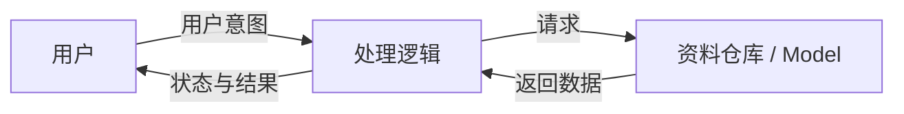
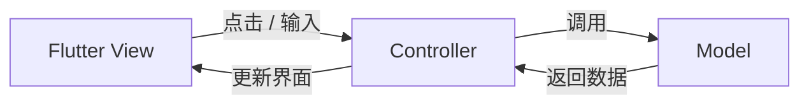
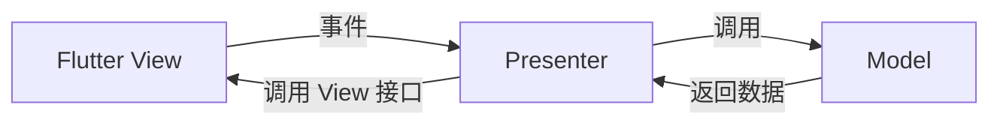
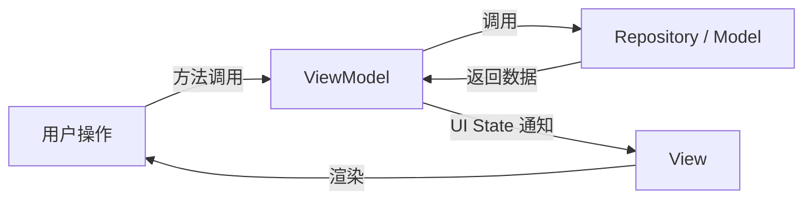
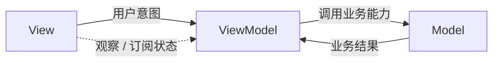

# 程序设计与软件设计｜03-MVC、MVP、MVVM 与单向数据流

一个用户卡片页面只有三样东西：一句加载提示、一块用户信息、一个重试按钮。可它背后要处理"还没开始时显示什么"、"请求进行中按钮能不能点"、"失败时错误文案放哪儿"、"用户连点两次重试会怎样"。把这些逻辑全写在按钮的点击回调里，页面就同时承担了界面绘制、状态保存、网络调用和业务判断。难改的地方在于：同一段代码同时知道两件事——业务事实是什么，以及这个屏幕此刻该画什么。

如果你刚接触这些词，先看前面的 Flutter 用户页示例：同一个"加载用户资料"功能分别怎么用 MVC、MVP、MVVM 组织，以及 MVVM 为什么更适合把 Flutter 界面逻辑从 Widget 中拆出来。后半部分再深入 MVC 的不同变体、Presentation Model、状态建模、单向数据流与测试。文中的 Flutter 示例只用 Flutter SDK 自带能力，不依赖第三方状态管理包；纯 Dart 示例则进一步说明这些边界并不依赖某个 UI 框架。

<!-- GFM-TOC -->
* [一个简单页面为什么会失控](#一个简单页面为什么会失控)
* [先用 Flutter 用户页认识 MVC、MVP 与 MVVM](#先用-flutter-用户页认识-mvcmvp-与-mvvm)
    * [先认识四个词：数据、界面、状态、用户意图](#先认识四个词数据界面状态用户意图)
    * [MVC：控制器协调 Model 和 View](#mvc控制器协调-model-和-view)
    * [MVP：Presenter 通过 View 接口更新界面](#mvppresenter-通过-view-接口更新界面)
    * [MVVM：View 观察 ViewModel 的状态](#mvvmview-观察-viewmodel-的状态)
    * [为什么 Flutter 项目会需要 MVVM](#为什么-flutter-项目会需要-mvvm)
    * [什么时候先别上 MVVM](#什么时候先别上-mvvm)
* [MVC：三个角色，多种拓扑](#mvc三个角色多种拓扑)
    * [Web MVC 与客户端 MVC](#web-mvc-与客户端-mvc)
    * [Massive View Controller 不是 MVC 的必然结果](#massive-view-controller-不是-mvc-的必然结果)
* [从 MVP 到 Presentation Model，再到 MVVM](#从-mvp-到-presentation-model再到-mvvm)
    * [MVP 与 Presentation Model：中间层是否碰控件](#mvp-与-presentation-model中间层是否碰控件)
    * [MVVM：Presentation Model 加平台数据绑定](#mvvmpresentation-model-加平台数据绑定)
    * [三种中间层的判别方法](#三种中间层的判别方法)
* [Model、View、ViewModel 的边界](#modelviewviewmodel-的边界)
    * [引用方向是硬边界](#引用方向是硬边界)
    * [导航、格式化与副作用放在哪一层](#导航格式化与副作用放在哪一层)
* [绑定只负责同步，不负责业务](#绑定只负责同步不负责业务)
* [MVVM 与单向数据流不是同义词](#mvvm-与单向数据流不是同义词)
* [用有限状态消除矛盾布尔值](#用有限状态消除矛盾布尔值)
    * [三个布尔值的组合爆炸](#三个布尔值的组合爆炸)
    * [sealed 家族让非法状态无法构造](#sealed-家族让非法状态无法构造)
* [纯 Dart 最小可运行示例](#纯-dart-最小可运行示例)
    * [Model：只提供业务事实与取数约定](#model只提供业务事实与取数约定)
    * [ViewModel：状态的唯一出口](#viewmodel状态的唯一出口)
    * [View：状态向下，意图向上](#view状态向下意图向上)
* [为什么它更容易测试](#为什么它更容易测试)
* [三种模式怎么选](#三种模式怎么选)
* [跨平台实现只看边界，不背注解](#跨平台实现只看边界不背注解)
* [常见误区：六种失败形态](#常见误区六种失败形态)
* [参考资料](#参考资料)
* [小结](#小结)
<!-- GFM-TOC -->

## 一个简单页面为什么会失控

假设点击"重试"要做四件事：校验输入、调用接口并把结果整理成可显示文字、决定是否跳转、把错误文案与按钮可用性同步到界面。四种职责挤在一个回调里，会同时出现三个症状：

- **状态没有家**：`isLoading` 若是回调里的局部变量，下拉刷新、深层链接这些新入口根本改不到它，只能各自再存一份。
- **依赖方向反了**：业务判断为了更新界面而依赖具体控件，于是它无法复用，也无法在无界面环境里运行。
- **更新入口太多**：任何方法都能直接改状态，出问题时没人能回答"最后一次是谁改的"。

架构模式要解决的重点在于把"业务事实"和"这个屏幕此刻该画什么"分开放，并规定谁可以改后者，而不是纠结"界面怎么画"。

## 先用 Flutter 用户页认识 MVC、MVP 与 MVVM

先不用背缩写。我们做一个很小的 Flutter 页面：打开后加载用户资料；加载中显示转圈；成功后显示姓名；失败后显示错误和重试按钮。

### 先认识四个词：数据、界面、状态、用户意图

| 词 | 在这个例子里是什么 | 可以先这样记 |
|---|---|---|
| Model（模型） | 用户资料、获取资料的规则或数据仓库 | 应用要处理的业务数据与能力 |
| View（视图） | Flutter 的 `Widget` 组合出来的页面 | 用户看见并操作的东西 |
| UI State（界面状态） | 初始、加载中、成功、失败 | 现在这张页面应该呈现哪种样子 |
| User Intent（用户意图） | 用户点了重试 | 用户希望应用做什么 |

同一条交互可以画成：



这里的箭头表示"谁把消息交给谁"，不是网络请求的具体协议。MVC、MVP、MVVM 都在安排这些角色，只是中间层和界面更新方式不同。它们是组织代码的办法，不是 Flutter 提供的三个基类，也不要求一个项目同时使用三套。

先把共同的数据约定写出来，后面的三个版本都围绕它展开：

下面两个 Dart 代码块按顺序放在同一个 `main.dart` 里：先定义资料和仓库，再定义状态、ViewModel 和页面。

```dart
import 'package:flutter/material.dart';

class Profile {
  const Profile({required this.name});

  final String name;
}

abstract interface class ProfileRepository {
  Future<Profile> fetchProfile();
}

class DemoProfileRepository implements ProfileRepository {
  @override
  Future<Profile> fetchProfile() async {
    await Future<void>.delayed(const Duration(milliseconds: 400));
    return const Profile(name: '小林');
  }
}
```

`Profile` 是业务数据；`ProfileRepository` 是"能拿到用户资料"的约定；`DemoProfileRepository` 是一个演示实现。真实项目可以把最后一个换成请求服务器或读取本地数据库的实现，而页面不必知道数据来自哪里。

### MVC：控制器协调 Model 和 View

MVC 是 Model-View-Controller 的缩写。它最常见的讲法是：View 把操作交给 Controller，Controller 调用 Model，再把结果交回 View。注意 MVC 历史上有多个变体，Flutter 项目里的 `StatefulWidget + State` 也常被叫作 MVC；不要只按类名判断。



在一个简单 Flutter MVC 写法里，`State` 既画界面，也保留这页的加载状态；Controller 负责协调动作和数据：

```dart
class ProfileController {
  ProfileController(this.repository);

  final ProfileRepository repository;

  Future<Profile> loadProfile() => repository.fetchProfile();
}

// 省略 Widget 声明和 build 中的布局。
// _loading、_profile、_error 放在 State 里；按钮点击时调用 Controller。
Future<void> reload() async {
  setState(() {
    _loading = true;
    _error = null;
  });

  try {
    final profile = await controller.loadProfile();
    if (!mounted) return;
    setState(() => _profile = profile);
  } catch (_) {
    if (!mounted) return;
    setState(() => _error = '资料加载失败');
  } finally {
    if (mounted) setState(() => _loading = false);
  }
}
```

这比把 HTTP 请求直接写在按钮回调里好一些：数据获取有了单独入口。但页面状态仍由 `State` 保存，页面也要自己决定加载、成功、失败时怎么更新。页面逻辑变多后，`State` 容易同时承担 View 和 Controller 的职责，这就是常说的"胖页面"。

### MVP：Presenter 通过 View 接口更新界面

MVP 是 Model-View-Presenter。View 把事件交给 Presenter；Presenter 调用 Model，并通过 View 接口要求界面显示加载、成功或失败。Presenter 持有的是一个抽象接口，不一定是具体的 `Widget`：



```dart
abstract interface class ProfilePageView {
  void showLoading();
  void showProfile(Profile profile);
  void showError(String message);
}

class ProfilePresenter {
  ProfilePresenter(this.view, this.repository);

  final ProfilePageView view;
  final ProfileRepository repository;

  Future<void> loadProfile() async {
    view.showLoading();
    try {
      final profile = await repository.fetchProfile();
      view.showProfile(profile);
    } catch (_) {
      view.showError('资料加载失败');
    }
  }
}
```

Flutter 的 `State` 可以实现 `ProfilePageView`，并在 `showLoading` 等方法里调用 `setState`。Presenter 因此容易单独测试，但它依然要通过接口"指挥 View 做什么"。这适合喜欢显式界面契约的团队；代价是接口和更新方法会增加，Presenter 的测试也需要一个 fake View 来记录这些调用。

### MVVM：View 观察 ViewModel 的状态

MVVM 是 Model-View-ViewModel。ViewModel 不持有 View，也不调用 `setState` 或控件方法；它保存这张页面要呈现的状态，并提供用户操作可调用的方法。View 观察状态变化，再按当前状态构建 Widget。



下面是一个可放进 Flutter 项目的最小示例。它只用 `ChangeNotifier` 和 `ListenableBuilder`，都来自 Flutter SDK：

```dart
sealed class ProfileUiState {
  const ProfileUiState();
}

final class ProfileIdle extends ProfileUiState {
  const ProfileIdle();
}

final class ProfileLoading extends ProfileUiState {
  const ProfileLoading();
}

final class ProfileLoaded extends ProfileUiState {
  const ProfileLoaded(this.profile);

  final Profile profile;
}

final class ProfileFailed extends ProfileUiState {
  const ProfileFailed(this.message);

  final String message;
}

class ProfileViewModel extends ChangeNotifier {
  ProfileViewModel(this._repository);

  final ProfileRepository _repository;
  ProfileUiState _state = const ProfileIdle();
  bool _disposed = false;

  ProfileUiState get state => _state;

  Future<void> loadProfile() async {
    _state = const ProfileLoading();
    notifyListeners();

    try {
      final profile = await _repository.fetchProfile();
      if (_disposed) return;
      _state = ProfileLoaded(profile);
    } catch (_) {
      if (_disposed) return;
      _state = const ProfileFailed('资料加载失败，请重试');
    }

    if (!_disposed) notifyListeners();
  }

  @override
  void dispose() {
    _disposed = true;
    super.dispose();
  }
}

class ProfilePage extends StatefulWidget {
  const ProfilePage({super.key});

  @override
  State<ProfilePage> createState() => _ProfilePageState();
}

class _ProfilePageState extends State<ProfilePage> {
  late final ProfileViewModel _viewModel =
      ProfileViewModel(DemoProfileRepository());

  @override
  void initState() {
    super.initState();
    _viewModel.loadProfile();
  }

  @override
  void dispose() {
    _viewModel.dispose();
    super.dispose();
  }

  @override
  Widget build(BuildContext context) {
    return Scaffold(
      appBar: AppBar(title: const Text('用户资料')),
      body: Center(
        child: ListenableBuilder(
          listenable: _viewModel,
          builder: (context, child) => switch (_viewModel.state) {
            ProfileIdle() => const Text('准备加载'),
            ProfileLoading() => const CircularProgressIndicator(),
            ProfileLoaded(:final profile) => Text('你好，${profile.name}'),
            ProfileFailed(:final message) => Column(
                mainAxisSize: MainAxisSize.min,
                children: [
                  Text(message),
                  FilledButton(
                    onPressed: () => _viewModel.loadProfile(),
                    child: const Text('重试'),
                  ),
                ],
              ),
          },
        ),
      ),
    );
  }
}

void main() {
  runApp(const MaterialApp(home: ProfilePage()));
}
```

顺着代码走一遍：

1. 页面创建 ViewModel，并调用 `loadProfile()`。
2. ViewModel 先把状态改成 `ProfileLoading`，再调用 `notifyListeners()`。
3. `ListenableBuilder` 收到通知，重新执行 `builder`，于是画出转圈。
4. Repository 返回资料后，ViewModel 把状态改为 `ProfileLoaded` 并再次通知。
5. `builder` 根据新状态画出问候文本。

这个过程叫声明式 UI：代码描述"当前状态对应什么界面"，状态变化后 Flutter 重新计算相关 Widget。`ProfileViewModel` 完全不知道 `Scaffold`、`Text`、颜色或 `BuildContext`；它只知道 Repository 和自己的状态。

初学时容易把 Widget 想成屏幕上长期存在的按钮或文本。更准确地说，Widget 是一份不可变的界面描述；Flutter 可以多次调用 `build`，再根据新旧描述更新实际绘制结果。所以 `build` 里适合根据状态组合 Widget，不适合每次执行时都发网络请求、重复写数据库或推进业务流程。ViewModel 给这些会变化的状态和动作一个明确归属。

| 同一件事 | MVC | MVP | MVVM |
|---|---|---|---|
| 中间角色 | Controller 协调操作；View 常参与状态保存 | Presenter 调用 Model，并通过 View 接口更新页面 | ViewModel 更新自己的 UI State |
| 中间角色是否引用 View | 变体不同；常会协调或调用 View | 是，通过 View 接口 | 否 |
| Flutter 如何刷新 | 常由 `State.setState` 更新 | View 接口方法内部常调用 `setState` | `ChangeNotifier` 通知，Builder 重建 |
| 逻辑单测是否需要 Widget | 取决于 Controller 与 View 的耦合 | 通常准备 fake View | 通常只注入 fake Repository |

**记忆窍门：** MVC 看 Controller 如何协调；MVP 看 Presenter 怎样"命令 View"；MVVM 看 View 怎样"观察 ViewModel 的状态"。团队可以采用不同变体，判断时看真实依赖和更新路径，不要只看文件名。

### 为什么 Flutter 项目会需要 MVVM

MVVM 不是为了多造几个类。它适合解决一类实际问题：**页面要处理的展示状态和交互流程变多了，Widget 开始既画 UI、又请求数据、又维护业务规则。**

还是用户资料页。如果都堆在 `_ProfilePageState`，这个类可能需要理解：网络接口、请求何时开始、失败如何重试、旧请求是否过期、成功数据怎么显示、按钮什么时候禁用。界面改版时，你可能只想换卡片样式，却被迫接触请求流程；测试错误分支时，又要启动 Widget 和整套界面环境。

MVVM 把这件事分为两份清晰的问题：

- View 只回答：**当前状态应该画成什么 Widget？用户点了按钮时调用哪个方法？**
- ViewModel 只回答：**现在是什么 UI State？收到重试意图后怎么调用 Repository、如何处理结果？**
- Repository / Model 只回答：**资料从哪里来，业务数据如何读取和更新？**

这样做的原因和收益：

1. **减少职责打架。** Widget 经常重建，适合描述界面；异步请求、校验和状态转换放在有明确职责的类里，页面更容易读。
2. **让状态有唯一归属。** 加载、成功、失败由 ViewModel 持有，不用在 View、弹窗和按钮回调里各存一份，减少互相不同步。
3. **让逻辑可以脱离界面测试。** 给 ViewModel 注入假 Repository，直接断言"加载后从 loading 变成 loaded"，不用模拟点击真实屏幕。
4. **更容易替换数据来源。** Repository 的接口不变，真实网络、缓存或测试假数据可以互换，ViewModel 和 Widget 不必跟着改。
5. **让单向路径更容易追踪。** 用户操作进入 ViewModel；状态从 ViewModel 向下给 View；出问题时能沿这条路径找是谁发起、谁改状态、谁负责绘制。

Flutter 官方架构指南也把清楚分离 UI 层和数据层、使用 View 与 ViewModel、避免把逻辑塞进 Widget 列为推荐实践；官方同时强调这些是适合大多数应用的建议，应按项目复杂度调整。`ChangeNotifier` 是 Flutter SDK 中的一种通知手段，不等于 MVVM 本身，也不是唯一状态管理方案。[Flutter 架构建议](https://docs.flutter.dev/app-architecture/recommendations) · [Flutter 架构概念](https://docs.flutter.dev/app-architecture/concepts) · [UI 层案例](https://docs.flutter.dev/app-architecture/case-study/ui-layer)

### 什么时候先别上 MVVM

一个只有静态标题和一个跳转按钮的页面，用 `StatelessWidget` 直接写完全合理。为了"架构完整"而给每个文字创建 ViewModel，会多出文件、构造和转发，却没有把真正复杂的逻辑隔离开。

可以用这个简单信号决定：

| 页面情况 | 建议 |
|---|---|
| 静态内容、少量本地交互，没有异步状态 | 先用普通 Widget 或 `StatefulWidget` |
| 有加载/空数据/失败/重试/分页等多种状态 | 考虑提取 ViewModel |
| 业务规则需要在多个页面或平台复用 | ViewModel 之外再判断是否需要 Domain / Use Case 层 |
| ViewModel 已经接近"上帝类"，依赖过多、职责说不清 | 按业务职责拆分；不要继续往里面塞方法 |

分层带来的好处要大于新增的间接层。先让最复杂、最常变化的那条流程有清楚的状态归属，再决定是否扩大到整个项目。

## MVC：三个角色，多种拓扑

| 角色 | 负责什么 |
|---|---|
| Model | 业务世界的数据与规则，例如用户实体、价格计算、取数接口 |
| View | 呈现界面，并把用户操作交给控制层 |
| Controller | 接收输入，协调 Model 与 View |

这三个名字的含义在所有 MVC 变体里都稳定，但角色之间的连线并不稳定。

### Web MVC 与客户端 MVC

传统 Web MVC 的 Controller 生命周期通常只有一次请求：解析参数、调用 Model、选定模板、生成 HTML，然后结束；View 在服务端被渲染成一次性响应，谈不上"持续观察"。客户端 MVC 的 Controller 是长生命周期对象，View 是屏幕上真实存在的控件树，连线因此可以双向：Controller 可能直接操作控件，View 的事件也可能绕过 Controller 直接改 Model。

MVC 是职责划分，不是固定拓扑。"项目是不是真正的 MVC"不能靠类名判断，只能靠"谁依赖谁、谁负责更新界面"判断。

### Massive View Controller 不是 MVC 的必然结果

MVC 没有回答一个问题：**"这一页现在是不是加载中"这类只跟界面有关的状态，该放在哪儿？** 它既是业务事实，又不该由 View 自己保存（View 可能被重建）。于是它被塞进 Controller，Controller 同时承担输入分发、展示状态、业务编排和导航，成了几千行的巨型类。这是**边界缺失**，不是 MVC 要求的结果。

> **面试高频：** MVC 和 MVVM 的本质差异是类名还是依赖方向？
> **答题脉络：** 两者都要分层 → 中间角色的更新方式不同（Controller 直接调控件 API，ViewModel 只改自己的状态）→ 依赖方向不同（ViewModel 不引用 View）→ 同一份代码换个类名什么都不会变。
> **追问方向：** Web MVC 的一次请求生命周期、Massive View Controller 的成因、MVP 的位置。

## 从 MVP 到 Presentation Model，再到 MVVM

"中间层"不止一种写法。Martin Fowler 在 [GUI Architectures](https://martinfowler.com/eaaDev/uiArchs.html) 里梳理了这些家族，关键差别只有一条：**中间层怎么让界面更新**。

### MVP 与 Presentation Model：中间层是否碰控件

MVP（Model-View-Presenter）家族的共性是中间层持有 View 引用。以 Fowler 描述的 Supervising Controller 形态为例：简单字段同步交给数据绑定，复杂更新仍由 Presenter 直接调用控件 API；更极端的 Passive View 里，View 几乎完全被动，所有渲染都由 Presenter 驱动。代价是"测 Presenter"离不开一套假的控件实现。

2004 年，Fowler 总结了 [Presentation Model](https://martinfowler.com/eaaDev/PresentationModel.html)：把展示层的状态和行为放进一个自包含的类，这个类不依赖任何具体的 GUI 控件，View 只负责把它的状态投影到屏幕上。原文里有一句冷静的自我批评：相比 Passive View 与 Supervising Controller，这个模式让逻辑完全独立于显示方式，但你**必须额外建立一套同步机制**。

### MVVM：Presentation Model 加平台数据绑定

2005 年 10 月 8 日，微软 WPF 团队架构师 John Gossman 在 [Introduction to Model/View/ViewModel pattern for building WPF apps](https://web.archive.org/web/20100125220430/http:/blogs.msdn.com/johngossman/archive/2005/10/08/478683.aspx) 中给出 MVVM 的第一手定义，要点有三条：

1. **它是 MVC 的一个变体**，针对"View 由设计师负责"的平台定制：设计师用 XAML、HTML 这类声明式语言和所见即所得工具做界面，开发者用代码写业务和数据。
2. **它隐含一个前提**：原文写道，Model/View/ViewModel "还依赖一样东西：一种通用的数据绑定机制"。
3. **ViewModel 意为 "Model of a View"**：它既是 View 的抽象，又是 Model 面向绑定的一次特化——包含把 Model 类型转换成可绑定类型的数据转换器、View 可调用的 Commands（实现上就是一个[命令模式](./04-设计模式/15-命令.md)），以及"下拉框选中了哪一项"这类视图状态。

Fowler 后来在 Presentation Model 原文里加注：这个模式如今更常被称为 MVVM，其中 "ViewModel" 指的就是 presentation model 这个元素。所以可以粗略记成：Presentation Model（Fowler，2004）加上平台级通用数据绑定（WPF/XAML），就是 MVVM（Gossman，2005）。

### 三种中间层的判别方法

| 对比点 | MVP（Supervising Controller） | Presentation Model | MVVM |
|---|---|---|---|
| 中间层叫什么 | Presenter | Presentation Model | ViewModel |
| 中间层做什么 | 接收事件、更新 Model、必要时直接操纵 View | 自包含的展示状态与行为 | 状态 + 数据转换器 + Commands |
| 谁更新 View | Presenter 调用控件 API，简单部分交给绑定 | View 自己从中间层同步 | View 通过平台数据绑定同步 |
| 数据绑定的地位 | 可选的辅助手段 | 可选的简化手段 | 原始定义中的前提 |
| 出处 | Fowler 梳理的家族 | Fowler，2004 | Gossman，2005（WPF） |

**直接持有并调用 View 的是 Presenter；只改自己的状态、由 View 观察或绑定来同步的是 ViewModel。**

> **面试高频：** 数据绑定是不是 MVVM 的必要条件？
> **答题脉络：** 原始定义把"通用数据绑定机制"列为前提 → 绑定解决的是同步成本，不是职责划分 → 换成手写订阅或回调，只要依赖方向不变，模式主张仍然成立 → 绑定是原始实现的前提，不是模式本身。
> **追问方向：** 双向绑定隐藏副作用、变更通知的簿记开销、声明式绑定更难调试。

## Model、View、ViewModel 的边界

| 角色 | 知道 | 不知道 |
|---|---|---|
| Model | 业务实体、规则、取数接口 | 页面上有没有按钮、错误文案用什么颜色 |
| View | 当前状态怎么显示、用户刚做了什么 | 请求该发到哪个地址、失败后哪个字段该更新 |
| ViewModel | 页面需要哪些展示状态、用户意图怎么处理 | 具体控件、具体路由、控件树的位置 |

> ViewModel 不该是"复制了一份 Model 字段"的类，也不是 Controller 改个名字。Model 回答"用户是什么"，ViewModel 回答"这一页此刻该显示什么"。

### 引用方向是硬边界



> View 持有并订阅 ViewModel，ViewModel 不持有 View。这条依赖方向是硬边界，不是风格偏好。

原因主要是生命周期。Android 的 ViewModel 要在屏幕旋转等配置变更中比 Activity 活得更久；SwiftUI 的 View 是值类型，系统随时可以丢弃重建；Flutter 的 Widget 树每次重建都会生成新对象。一旦反向持有：轻则内存泄漏（旧界面无法回收），重则向早已销毁的界面推送更新。

两个官方来源把这条边界写成了硬性要求。.NET MAUI 文档用一句对称的话概括——"模型不知道 ViewModel，ViewModel 不知道 View"（[Data binding and MVVM](https://learn.microsoft.com/en-us/dotnet/maui/xaml/fundamentals/mvvm)，[核查日期：2026-09]）；Android 文档则直接禁止持有生命周期相关类型——"ViewModel 通常不应引用 view、`Lifecycle` 或任何可能持有 activity context 的类"（[Recommendations for Android architecture](https://developer.android.com/topic/architecture/views/recommendations-views)，[核查日期：2026-09]）。

> **面试高频：** ViewModel 为什么不应持有 View？
> **答题脉络：** 生命周期长度差（ViewModel 比 View 活得久）→ 反向引用导致的两类故障（泄漏、向已销毁界面推送）→ 可测试性（没有 View 也能实例化）→ 依赖方向才是判断 MVVM 的核心，不是类名。
> **追问方向：** 事件总线能否替代直接引用、ViewModel 需要 Context 时该依赖什么、配置变更与进程死亡的区别。

### 导航、格式化与副作用放在哪一层

这类问题没有一刀切答案，但可以用"可测试边界"裁决：

- **纯格式化**（把 `editor` 显示成"编辑"）放 ViewModel 或独立 Formatter（本质是一个可替换的[策略](./04-设计模式/22-策略.md)），都能脱离界面测试；放进 View 也不算错，只要它是纯粹的显示决定。
- **导航**：本质是"意图 + 环境"，环境（路由栈、是否需登录）属于界面侧。常见做法有两种：ViewModel 发出 `onLoginSucceeded` 这类意图，由 View 决定去哪儿；或让 ViewModel 依赖抽象的 `Navigator` 接口（依赖倒置，参见[面向对象与设计原则](./01-面向对象与设计原则.md)）。关键是 ViewModel 不认识具体路由 API。
- **一次性副作用**（弹提示、埋点）不要和持久状态挤在同一个状态流里，否则界面重建时会被重放；把它建模成独立事件通道，或让状态带上"只展示一次"的标记。

## 绑定只负责同步，不负责业务

数据绑定让状态变化反映到界面、让界面事件写回状态，底层机制是变更通知（属性变更事件、可观察对象或流），实现上通常就是一个观察者（参见[观察者模式](./04-设计模式/20-观察者.md)）——注意它与 MVC/MVVM 不在同一层级，后者是架构模式，前者是对象协作模式，层级关系见[设计模式](./04-设计模式/README.md)。绑定方向在多数框架里要显式配置：以 .NET MAUI 为例，`OneWay` 是显示型控件的默认值，可编辑控件常用 `TwoWay`，此外还有 `OneWayToSource` 和 `OneTime`。遇到"改了 ViewModel 界面没刷新"，第一件要查的事就是绑定方向与变更通知是否生效。

> 绑定是同步机制，不是架构。绑定的存在只说明"值能到地方"，不说明"业务逻辑在哪一层"。

下面这段代码（前置条件是 Dart 3.x、纯 Dart、无第三方依赖）把差别摆出来：同样是"用户逐字输入 c、ca、cat"，一边只同步值，另一边在绑定回调里偷偷发请求。

```dart
// 绑定只负责把值同步进状态持有者，业务动作必须由显式命令承担。
import 'dart:async';

/// 真实项目里这里会是网络或数据库；示例用一个计数的假实现代替。
class CountingSearcher {
  int calls = 0;

  Future<List<String>> search(String keyword) async {
    calls++;
    return <String>['$keyword-1', '$keyword-2'];
  }
}

/// 正确做法：同步和业务是两个入口。
class SearchViewModel {
  SearchViewModel(this.searcher);

  final CountingSearcher searcher;

  String _keyword = '';
  List<String> _results = const <String>[];

  String get keyword => _keyword;
  List<String> get results => _results;

  /// 输入框绑定走这里：只同步值，不发请求、不改业务数据。
  void syncKeywordFromView(String value) {
    _keyword = value;
  }

  /// 业务动作由显式命令触发，调用时机由 View 上的按钮决定。
  Future<void> submitSearch() async {
    _results = await searcher.search(_keyword);
  }
}

/// 反例：覆写绑定入口，在里面偷偷发请求。
class LeakyBindingViewModel extends SearchViewModel {
  LeakyBindingViewModel(super.searcher);

  @override
  void syncKeywordFromView(String value) {
    super.syncKeywordFromView(value);
    unawaited(submitSearch());
  }
}
```

<!-- verify: .work/verify/B18/lib/field_binding.dart（代码块为第 3–48 行） -->

```text
$ dart run lib/field_binding.dart
search calls before submit: 0
search calls after submit: 1
leaky binding calls: 3
```

正确接法下三次输入产生零次请求，用户按下提交才产生一次；反例里逐字输入直接变成逐字查询。这就是"UDF 反对绑定藏业务"的具体含义：**业务动作应当由显式入口进入状态持有者**，而不是由控件值变化隐式触发。

## MVVM 与单向数据流不是同义词

双向绑定能减少样板代码，代价是"谁改了状态"变得模糊。应用变大后，很多团队会在 MVVM 骨架上再加一条纪律：单向数据流（Unidirectional Data Flow，UDF）。它的形状很简单——**状态向下流（数据层 → UI、父组件 → 子组件），事件向上流（UI → 状态的拥有者）**。

Android 官方架构指南的定义是：状态只朝一个方向流动（通常从数据层流向 UI、从父组件流向子组件），修改状态的事件朝相反方向流动（从 UI 流回状态的拥有者）。状态的拥有者叫单一数据源（Single Source of Truth，SSOT）：某份数据只有一个所有者，只有它能改，对外只暴露不可变类型（[Guide to app architecture](https://developer.android.com/topic/architecture)，[核查日期：2026-09]）。

SwiftUI 的官方说法是"single source of truth"（唯一数据源）。WWDC19 的 [Data Flow Through SwiftUI](https://developer.apple.com/videos/play/wwdc2019/226/) 反复强调：每份被读取的数据都应该有唯一的数据源，重复的数据源会逼你手工保持同步、从而产生不一致 bug；界面更新靠的是某个状态变化让 view 的 `body` 重新求值，并不通过修改视图树完成。

传统 MVVM 本身不规定数据流方向。Gossman 2005 年那篇文章里，View 既被单向绑定到 Model，也被双向绑定到可编辑控件——那同样是标准 MVVM。UDF 是叠加在 MVVM 之上的一条额外纪律：View 不直接写状态，只上报事件；所有状态修改集中在状态持有者内部。

| 对比点 | MVVM（双向绑定形态） | MVVM + UDF |
|---|---|---|
| 状态方向 | 状态与界面值互相写 | 状态向下，单向快照 |
| 修改入口 | 绑定、命令、代码都可能改 | 只有状态持有者内部的出口能改 |
| 适合 | 表单密集、控件值本身就是状态 | 状态多、异步多、需要追溯变化来源 |
| 代价 | 修改来源不易追踪 | 需手写事件入口，样板略多 |

双向绑定并没有被禁用。表单输入这类"控件值就是状态本身"的场景，`TwoWay` 仍然实用，SwiftUI 也用 `@Binding` 提供受控的写路径。UDF 真正反对的是两件事：让绑定悄悄完成业务动作，以及让多个入口都能改同一份状态。

> **面试高频：** UDF 与 MVVM 能同时使用吗？SSOT 意味着什么？
> **答题脉络：** 澄清 MVVM 不管数据流方向 → UDF 只规定状态向下、事件向上 → SSOT 指"状态有唯一所有者，对外只暴露不可变快照" → 双向绑定在受控场景仍可用。
> **追问方向：** 不可变快照的实现代价（参见[对象复制、所有权与深浅拷贝](./02-对象复制、所有权与深浅拷贝.md)）、一次性事件与持久状态的区分、多个状态持有者之间如何共享数据。

## 用有限状态消除矛盾布尔值

### 三个布尔值的组合爆炸

页面状态常被写成 `isLoading`、`hasError`、`hasData` 三个独立布尔值。三个布尔值一共 2³ = 8 种组合，其中 4 种要求页面同时处于两种互相排斥的处境——例如"正在加载"和"有错误"同时为真。

```dart
// 对照实验：三个布尔值能表达的组合数是同一页面合法状态数的两倍。
import 'ui_state.dart';

/// 旧写法：用三个互相独立的布尔值描述「这一页现在怎么了」。
class LegacyFlags {
  LegacyFlags({
    required this.isLoading,
    required this.hasError,
    required this.hasData,
  });

  final bool isLoading;
  final bool hasError;
  final bool hasData;

  /// 三个布尔值中同时为 true 的数量超过 1 时，页面自相矛盾。
  bool get isContradictory =>
      (isLoading ? 1 : 0) + (hasError ? 1 : 0) + (hasData ? 1 : 0) > 1;
}

List<LegacyFlags> allFlagCombinations() => <LegacyFlags>[
  for (final isLoading in <bool>[false, true])
    for (final hasError in <bool>[false, true])
      for (final hasData in <bool>[false, true])
        LegacyFlags(isLoading: isLoading, hasError: hasError, hasData: hasData),
];
```

<!-- verify: .work/verify/B18/lib/boolean_soup_vs_sealed.dart（代码块为第 3–28 行） -->

运行结果是 `flag combinations: 8`、`contradictory: 4`、`sealed states: 4`。问题不在于要不要写防御性判断，而在于**这些矛盾状态本来就不该能被构造出来**。

### sealed 家族让非法状态无法构造

Dart 3 的 `sealed` 类只能在同一库内被继承，编译器因此知道子类型是"封闭集合"，`switch` 可以做成穷尽的、不需要 `default` 的匹配（[Class modifiers](https://dart.dev/language/class-modifiers)，[核查日期：2026-09]）。

```dart
// 展示状态用一个 sealed 家族表达，非法组合在类型层面就不存在。
/// 界面此刻应该显示什么。四个成员互斥，不存在「既加载中又有错误」。
sealed class UserUiState {
  const UserUiState();
}

final class UserUiStateIdle extends UserUiState {
  const UserUiStateIdle();
}

final class UserUiStateLoading extends UserUiState {
  const UserUiStateLoading();
}

final class UserUiStateReady extends UserUiState {
  const UserUiStateReady({required this.displayName, required this.roleLabel});

  final String displayName;
  final String roleLabel;
}

final class UserUiStateFailed extends UserUiState {
  const UserUiStateFailed(this.message);

  final String message;
}

/// View 只需要这一个函数就能覆盖全部状态，不需要写 default 兜底。
String renderUserCard(UserUiState state) => switch (state) {
  UserUiStateIdle() => '准备就绪，等待加载',
  UserUiStateLoading() => '正在加载……',
  UserUiStateReady(:final displayName, :final roleLabel) =>
    '$displayName（$roleLabel）',
  UserUiStateFailed(:final message) => '出错了：$message',
};
```

<!-- verify: .work/verify/B18/lib/ui_state.dart（代码块为第 3–37 行） -->

`dart run lib/ui_state.dart` 依次打印 `准备就绪，等待加载`、`正在加载……`、`林一（编辑）`、`出错了：网络不可用`——同一份渲染逻辑覆盖全部状态，没有一个"不可能出现"的分支需要兜底。

sealed 家族的价值在于让不可能的状态无法被构造出来，并让编译器在你新增一个成员时**列出所有需要修改的地方**——把"记得改全"从人的注意力转移到类型检查上，而不只是"少写 if"。

状态多了，它自然成了一张状态转移图，这正是[状态模式](./04-设计模式/21-状态.md)处理的问题；区别在于页面级状态持有者关心的是"当前快照 + 意图"，不必为每个状态写一个类。

拆分依据是"状态边界"而不是"界面区域"。两个区域若有共享状态（例如顶部筛选器决定下方列表内容），就该由同一个状态持有者管理；彼此完全无关的两块，各配一个小的状态持有者。

> **面试高频：** 为什么 sealed 状态优于多个布尔值？什么时候该拆多个状态持有者？
> **答题脉络：** 先算组合数，说明"非法状态可构造"是 bug 来源 → sealed + 穷尽匹配把检查交给编译器 → 拆分依据是状态边界不是界面区域 → 一个状态持有者要能被一句话说清它在管什么。
> **追问方向：** 状态转移图与[状态模式](./04-设计模式/21-状态.md)的关系、跨区域共享状态怎么放、状态类要不要实现相等性比较。

## 纯 Dart 最小可运行示例

下面三段代码拼出完整的 MVVM 骨架：Model 只提供业务事实，ViewModel 是状态的唯一出口，View 把状态翻译成显示内容、把操作翻译成意图。View 用"文本行缓冲"代替真实控件，其余部分与在框架里写完全一样；完整可运行文件在 `.work/verify/B18/`，三个片段都只用 `dart:*`。

### Model：只提供业务事实与取数约定

```dart
// Model 层：业务事实与取数约定。这里没有任何按钮、颜色或页面字段。
import 'dart:async';

/// 业务实体：一个用户。
class UserProfile {
  const UserProfile({required this.displayName, required this.role});

  final String displayName;
  final String role;
}

/// 数据层可以预期的失败，ViewModel 只翻译它，不猜测网络细节。
class RepositoryException implements Exception {
  const RepositoryException(this.message);

  final String message;
}

/// 抽象接口让 ViewModel 只依赖「取数据的约定」，不依赖具体实现。
abstract interface class UserRepository {
  Future<UserProfile> fetchProfile();
}
```

<!-- verify: .work/verify/B18/lib/user_repository.dart（代码块为第 3–24 行） -->

`abstract interface class` 是 Dart 的纯接口：外部库可以 `implements` 但不能 `extends`。它让 ViewModel 依赖"能取到用户"这个约定，而不是某个网络客户端。同文件里还有三个假实现：固定成功的 `FakeUserRepository`、固定失败的 `FailingUserRepository`，以及由测试控制完成时机的 `ControllableUserRepository`。

### ViewModel：状态的唯一出口

```dart
// ViewModel：只保存展示状态、接收意图、调用 Model，并给状态一个唯一出口。
import 'dart:async';

import 'ui_state.dart';
import 'user_repository.dart';

class UserViewModel {
  UserViewModel(this.repository);

  final UserRepository repository;
  final StreamController<UserUiState> _states =
      StreamController<UserUiState>.broadcast();
  UserUiState _current = const UserUiStateIdle();
  int _requestId = 0;
  bool _disposed = false;

  /// 只暴露快照和只读流：View 能读、能订阅，不能直接写。
  UserUiState get current => _current;
  Stream<UserUiState> get states => _states.stream;

  Future<void> load() async {
    // 1. 每次加载领一个编号，用于识别「过期的结果」。
    final requestId = ++_requestId;
    if (_disposed) return;
    _emit(const UserUiStateLoading());
    try {
      final profile = await repository.fetchProfile();
      // 2. 结果回来时先确认它仍然是最新一次请求，否则直接丢弃。
      if (_disposed || requestId != _requestId) return;
      _emit(
        UserUiStateReady(
          displayName: profile.displayName,
          roleLabel: profile.role,
        ),
      );
    } on RepositoryException catch (error) {
      if (_disposed || requestId != _requestId) return;
      _emit(UserUiStateFailed(error.message));
    } catch (_) {
      if (_disposed || requestId != _requestId) return;
      _emit(const UserUiStateFailed('加载失败，请稍后重试'));
    }
  }

  void _emit(UserUiState next) {
    // 3. 状态只有一个出口：任何变化都先落到 _current，再通知订阅者。
    _current = next;
    _states.add(next);
  }

  Future<void> dispose() async {
    // 4. 先让在途请求失效，再关闭流：广播流关闭后不能再 add。
    _disposed = true;
    _requestId++;
    await _states.close();
  }
}
```

<!-- verify: .work/verify/B18/lib/user_view_model.dart（代码块为第 3–56 行） -->

四点设计决定值得单独说明：

1. **构造函数注入**：`UserViewModel(this.repository)` 只要求一个接口，测试可以换成任意假实现。
2. **请求编号**：用户连点两次重试时两个请求并发在途，先发的若后返回，编号不匹配，结果被直接丢弃——避免"新数据被旧数据覆盖"。
3. **单一出口**：所有状态变化都经过 `_emit`，先更新快照再推送。想追踪"谁改了状态"，只需看这一个方法。
4. **先失效再关闭**：`dispose` 先把 `_disposed` 置真并递增编号让在途请求失效，再 `close()`。广播流一旦关闭就不能再 `add`，否则抛异常。

> 状态持有者必须能回答两个问题：**"这是第几次请求"** 和 **"我还活着吗"**。少了这两条信息，异步结果回来时就无法判断该不该更新界面——这就是"页面销毁后仍在更新状态"的根因。

这里用广播流而不是手写监听列表，是因为 Dart 已经为广播流规定了冲突场景的语义：事件触发时在场的监听者才会收到该事件，派发过程中新增的监听者不会收到本次事件，取消订阅后立即停止接收（[Stream class](https://api.dart.dev/dart-async/Stream-class.html)、[StreamController.broadcast](https://api.dart.dev/dart-async/StreamController/StreamController.broadcast.html)，[核查日期：2026-09]）。手写监听列表要自己处理这些边界，等价于重复实现观察者。

### View：状态向下，意图向上

```dart
// View：把状态翻译成可显示内容，把用户操作翻译成意图，并管理自己的订阅。
import 'dart:async';

import 'ui_state.dart';
import 'user_repository.dart';
import 'user_view_model.dart';

class UserCardView {
  UserCardView(this.viewModel) {
    // 1. View 单向依赖 ViewModel；ViewModel 完全不知道这个类的存在。
    _subscription = viewModel.states.listen(_onState);
    // 2. 广播流不回放历史事件，新订阅者要用当前快照补齐第一次渲染。
    _onState(viewModel.current);
  }

  final UserViewModel viewModel;
  final List<String> lines = <String>[];
  late final StreamSubscription<UserUiState> _subscription;

  void onRetryPressed() {
    // 3. 意图向上走：View 只说「用户点了重试」，不自己拼状态。
    unawaited(viewModel.load());
  }

  void _onState(UserUiState state) {
    // 4. 状态向下走：View 不查询业务，只做状态到界面的映射。
    lines
      ..clear()
      ..add(renderUserCard(state))
      ..addAll(_actionsFor(state));
  }

  List<String> _actionsFor(UserUiState state) => switch (state) {
    UserUiStateIdle() || UserUiStateLoading() => const <String>[],
    UserUiStateReady() => const <String>['刷新'],
    UserUiStateFailed() => const <String>['重试'],
  };

  Future<void> dispose() async {
    // 5. View 先退订再销毁，避免向已经不显示的界面推送更新。
    await _subscription.cancel();
  }
}
```

<!-- verify: .work/verify/B18/lib/user_view.dart（代码块为第 3–45 行） -->

> 广播流不回放历史事件。`UserCardView` 构造时先 `listen` 再主动渲染一次 `viewModel.current`，才拿到"进入页面时该显示什么"。这也是为什么状态持有者要同时暴露 **当前快照** 和 **变化流**——只有流会丢掉初始状态，只有快照则看不到后续变化。

```text
$ dart run lib/user_view.dart
before load: [准备就绪，等待加载]
after load: [林一（编辑）, 刷新]
```

## 为什么它更容易测试

界面代码难测的原因很具体：要么用自动化工具模拟鼠标键盘（慢、脆、界面一改断言就挂），要么在事件回调里塞断言（与实现强耦合）。Fowler 把绕开界面、直接测展示逻辑的做法叫 subcutaneous test（皮下测试）——针打在"皮肤"（界面）之下。

可测试性来自前面反复出现的三个设计决定：**状态持有者不持有 View**（不需要启动界面就能实例化）、**状态是公开可观察的普通数据**（断言直接比较数据，不用读控件）、**Model 由构造函数注入**（网络与数据库可换成假实现）。

```dart
// 抽取范围：.work/verify/B18/test/b18_mvvm_test.dart 第 46–60 行。
// 同文件第 11–19 行的 recordStates 记录状态序列；
// FakeUserRepository 定义在 lib/user_repository.dart。
    test('正常路径按 idle -> loading -> ready 流转', () async {
      final viewModel = UserViewModel(const FakeUserRepository());
      final states = recordStates(viewModel);

      await viewModel.load();
      await Future<void>.delayed(Duration.zero);

      expect(states, <String>['UserUiStateLoading', 'UserUiStateReady']);
      expect(viewModel.current, isA<UserUiStateReady>());
      final ready = viewModel.current as UserUiStateReady;
      expect(ready.displayName, '林一');
      expect(ready.roleLabel, '编辑');

      await viewModel.dispose();
    });
```

<!-- verify: .work/verify/B18/test/b18_mvvm_test.dart（代码块为第 46–60 行） -->

整个测试没有渲染任何界面，毫秒级完成。同一份文件还覆盖几个关键边界：用可控制完成时机的假仓库验证"先发请求后返回时结果被丢弃"（断言最终状态是新结果、状态序列是 loading、loading、ready）；`dispose` 之后在途请求不再推送，重复调用 `load` 也不会向已关闭的流写入。全部 11 个测试通过。

> 可测试性是前面几个设计决定的副产品，并不靠"多写测试"换来：没有 UI 依赖、状态可观察、依赖可替换。

边界也要写清楚：**绑定声明本身测不到**。XAML 里绑定路径写没写对、SwiftUI 里 `body` 到底读了哪个属性，都只能靠界面层测试或运行观察。Gossman 在 2006 年的 [Advantages and disadvantages of M-V-VM](https://web.archive.org/web/20110816014850/http:/blogs.msdn.com/b/johngossman/archive/2006/03/04/543695.aspx) 里把这条列为缺点：数据绑定是声明式的，比能直接打断点的命令式代码更难调试。所以设计目标在于**让 View 薄到不值得测**，把值得测的逻辑压进 ViewModel 与 Model，而不是追求"测得更多"。

> **面试高频：** MVVM 的可测试性从哪里来？
> **答题脉络：** UI 测试为何慢而脆 → 三个设计决定（不持有 View、状态是普通数据、依赖注入）→ 用状态序列断言举例 → 主动指出绑定声明测不到，说明设计目标是缩小需要测的范围。
> **追问方向：** subcutaneous test、一次性事件怎么断言、跨进程或真实网络的测试边界。

## 三种模式怎么选

| 对比点 | MVC | MVP | MVVM（可叠加 UDF） |
|---|---|---|---|
| 中间角色 | Controller 协调输入与业务 | Presenter 协调业务并通过 View 接口更新界面 | ViewModel 保存展示状态并响应意图 |
| 是否引用 View | 变体不同，可能直接交互 | Presenter 持有 View 接口 | ViewModel 不引用具体 View |
| 界面更新 | Controller 协调 View 更新，常见写法由 `State.setState` 完成 | Presenter 调用 `showXxx` 等 View 方法 | View 观察状态并重建 |
| 测试重点 | Controller 的流程协调 | Presenter 的流程与 View 调用 | 可脱离 View 测试状态流转 |
| 适合场景 | 页面简单、流程短，或已有 MVC 约定 | 需要明确的被动 View 契约，且显式控制界面命令有价值 | 状态多、异步多、展示逻辑需要复用 |

值得引入 ViewModel 的信号：页面有加载、空数据、错误、刷新、分页等多个状态；同一份状态要被多个 View 或多个平台展示；希望把异步流程与界面生命周期分开测试。不值得的信号同样明确：只有静态文本和一个按钮的页面，把每个字段包一层转发只会让代码更长——Gossman 2006 年就写了这条：对简单界面来说 M-V-VM 属于 overkill。

> 先画出"用户意图 → 状态变化 → 界面结果"这条线，再决定要不要引入 ViewModel。是为了让这条线变清楚，还是只是为了对齐名词——只有前者值得多写一个类。

## 跨平台实现只看边界，不背注解

| 平台 | View 是什么 | 状态如何暴露 | 事件如何进入 | 平台特有差异 |
|---|---|---|---|---|
| WPF / .NET MAUI | XAML，`BindingContext` 指向 ViewModel | `INotifyPropertyChanged` 属性 | `ICommand`（`Execute` / `CanExecute`） | 绑定引擎负责把更新调度回 UI 线程 |
| Android | Composable 或 XML 布局 | 单一 `uiState`（`StateFlow`） | 普通方法调用 | 状态持有者要跨 `Activity` 重建存活 |
| SwiftUI | struct（值类型）View | `@Observable` 类型（早期为 `ObservableObject` + `@Published`） | 方法调用或 `@Binding` 写回 | View 可被系统随时重建，状态必须外置 |
| Flutter | 不可变 Widget 树 | `ChangeNotifier` + `notifyListeners()`（Provider），或 Riverpod | 调用模型方法 | 声明式 UI，没有命令式控件更新 API |

> **时效信息（核查日期：2026-09）：** SwiftUI 自 iOS 17 / iPadOS 17 / macOS 14 / tvOS 17 / watchOS 10 起支持 Observation（`@Observable` 宏），它把 `ObservableObject` + `@Published` 换成直接观察属性；旧协议仍可继续使用，两者也能混用，但视图更新触发条件不同——`Observable` 只在 `body` 真正读到的属性变化时更新。来源：Apple [Migrating from the Observable Object protocol to the Observable macro](https://developer.apple.com/documentation/swiftui/migrating-from-the-observable-object-protocol-to-the-observable-macro)。

> **时效信息（核查日期：2026-09）：** Android 官方文档把状态持有者的实现写成两种——`ViewModel` 或**普通类**——`ViewModel` 只是更常用的那一种，因为它的生命周期支持跨 `Activity` 重建保留状态；官方同时要求不要向下传递 ViewModel 实例，只传子组件需要的状态值和事件回调。来源：[State holders and UI state](https://developer.android.com/topic/architecture/ui-layer/stateholders)、[ViewModel overview](https://developer.android.com/topic/libraries/architecture/viewmodel)。

> **时效信息（核查日期：2026-09）：** Flutter 官方在 "Simple app state management" 里把 `ChangeNotifier` 定位为最基础的封装方式（与 Provider 搭配），并说明它不依赖 Flutter 更高层的类、可以直接做单元测试；官方没有把任何一种方案称作 MVVM 的标准组件。来源：[Flutter: Simple app state management](https://docs.flutter.dev/data-and-backend/state-mgmt/simple)。

> 各平台的 "ViewModel" 只是同名：.NET 的依赖绑定引擎与命令、Android 的带生命周期状态持有者、SwiftUI 的观察宏、Flutter 的变更通知器，语义并不等同。跨平台真正一致的是那条边界——**View 持有或订阅状态对象，状态对象不引用具体控件**。

## 常见误区：六种失败形态

**误区一：把 ViewModel 做成另一个 Model。** Model 描述业务事实，ViewModel 描述当前界面状态，两者的字段与生命周期都可能不同。为了"纯 MVVM"复制一套几乎相同的字段，只会得到两份需要手工同步的数据源。

**误区二：用了数据绑定就认为实现了 MVVM。** 绑定只是传值方式。业务逻辑仍散落在 View 回调里，换一个绑定库不会改善任何职责边界。

**误区三：认为 View 不能有任何逻辑。** View 可以拥有布局计算、动画和纯展示格式化；需要避免的是让 View 决定业务流程和数据来源。判断标准是"这段代码能不能脱离业务数据独立解释"。

**误区四：认为 ViewModel 必须完全不依赖框架。** 无框架依赖更容易测试，但可以按成本取舍。真正要守住的只有两条：不直接操作具体控件、状态变化可追踪；需要平台能力时，依赖抽象接口而不是具体类型。

**误区五：ViewModel 变成新的"上帝类"。** 把 HTTP、数据库、导航、埋点、格式化全塞进一个 ViewModel，只是把 Controller 的问题原样搬了个家，警惕信号是构造函数要注入七八个依赖（依赖数量的判断参见[代码可读性与风格](../07-工程工具与代码质量/04-代码可读性与风格.md)）。拆分依据是状态边界，不是界面区域。

**误区六：把页面级 ViewModel 传遍组件树。** 子组件直接依赖父级的具体 ViewModel 类型，会同时失去复用性和对"状态修改入口"的控制。Android 官方明确警告不要把 ViewModel 实例传给其他 composable；SwiftUI 中同理，子 View 优先接收普通值或小型可观察对象。

## 参考资料

- [R1] [博客存档] [Introduction to Model/View/ViewModel pattern for building WPF apps](https://web.archive.org/web/20100125220430/http:/blogs.msdn.com/johngossman/archive/2005/10/08/478683.aspx) — John Gossman，2005-10-08，[核查日期：2026-09]。
- [R2] [博客存档] [Advantages and disadvantages of M-V-VM](https://web.archive.org/web/20110816014850/http:/blogs.msdn.com/b/johngossman/archive/2006/03/04/543695.aspx) — John Gossman，2006-03-04，[核查日期：2026-09]。
- [R3] [官方文档] [Presentation Model](https://martinfowler.com/eaaDev/PresentationModel.html) — Martin Fowler，2004（含 MVVM 别名注记），[核查日期：2026-09]。
- [R4] [官方文档] [GUI Architectures](https://martinfowler.com/eaaDev/uiArchs.html) — Martin Fowler，[核查日期：2026-09]。
- [R5] [官方文档] [Data binding and MVVM（.NET MAUI）](https://learn.microsoft.com/en-us/dotnet/maui/xaml/fundamentals/mvvm) — Microsoft Learn，[核查日期：2026-09]。
- [R6] [官方文档] [Guide to app architecture](https://developer.android.com/topic/architecture) — Android Developers，[核查日期：2026-09]。
- [R7] [官方文档] [State holders and UI state](https://developer.android.com/topic/architecture/ui-layer/stateholders) — Android Developers，[核查日期：2026-09]。
- [R8] [官方文档] [ViewModel overview](https://developer.android.com/topic/libraries/architecture/viewmodel) — Android Developers，[核查日期：2026-09]。
- [R9] [官方文档] [Recommendations for Android architecture（Views）](https://developer.android.com/topic/architecture/views/recommendations-views) — Android Developers，[核查日期：2026-09]。
- [R10] [官方文档] [Migrating from the Observable Object protocol to the Observable macro](https://developer.apple.com/documentation/swiftui/migrating-from-the-observable-object-protocol-to-the-observable-macro) — Apple，[核查日期：2026-09]。
- [R11] [官方文档] [Data Flow Through SwiftUI（WWDC19）](https://developer.apple.com/videos/play/wwdc2019/226/) — Apple，2019，[核查日期：2026-09]。
- [R12] [官方文档] [Flutter: Simple app state management](https://docs.flutter.dev/data-and-backend/state-mgmt/simple) — Flutter，[核查日期：2026-09]。
- [R13] [官方文档] [Dart: Class modifiers](https://dart.dev/language/class-modifiers) — Dart，[核查日期：2026-09]。
- [R14] [官方文档] [Dart: Stream class](https://api.dart.dev/dart-async/Stream-class.html) — Dart API reference，[核查日期：2026-09]。
- [R15] [代码] `.work/verify/B18/` — 文中纯 Dart 示例的可运行伴侣文件与测试，Dart SDK 3.12.2（stable），[核查日期：2026-09]。
- [R16] [官方文档] [Architecture recommendations and resources](https://docs.flutter.dev/app-architecture/recommendations) — Flutter 官方架构建议，涵盖 UI / data 分层、View 与 ViewModel、单向数据流和测试，[核查日期：2026-09]。
- [R17] [官方文档] [Common architecture concepts](https://docs.flutter.dev/app-architecture/concepts) — Flutter 官方对单一数据源、单向数据流、声明式 UI 与可测试性的说明，[核查日期：2026-09]。
- [R18] [官方文档] [UI layer case study](https://docs.flutter.dev/app-architecture/case-study/ui-layer) — Flutter 官方 MVVM 案例，演示 View、ViewModel、UI State 与 `ChangeNotifier` / `ListenableBuilder` 的协作，[核查日期：2026-09]。

## 小结

> MVVM 用 ViewModel 把"界面此刻该显示什么"和"用户意图如何处理"集中成一个可测试的状态持有者，而真正决定它成败的是那条单向依赖边界——View 订阅状态，状态不持有 View，并且只留一个出口能改状态，与绑定、注解或类名无关。
