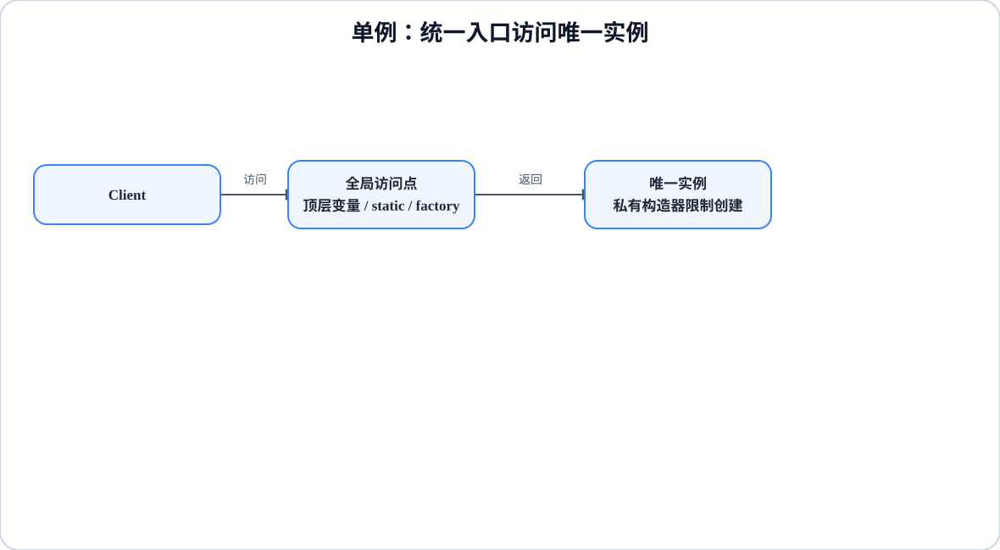

# 程序设计与软件设计｜01-单例（Singleton）

<!-- GFM-TOC -->
* [意图（Intent）](#意图intent)
* [结构（Structure）](#结构structure)
* [实现（Implementation）](#实现implementation)
* [适用条件与代价](#适用条件与代价)
* [Dart 标准库与生态映射](#dart-标准库与生态映射)
* [面试追问](#面试追问)
* [参考资料](#参考资料)
* [一句话总结](#一句话总结)
<!-- GFM-TOC -->

## 意图（Intent）

确保一个类在一个 isolate 内只有一个实例，并提供该实例的访问点。

动机：配置、日志、会话这类资源天然应该只有一份。如果各处可以随手 `new`，就会出现多个对象各持一份状态、互相看不见的场面。但要抓住重点：单例解决的从来不是“省内存”，而是“谁来控制生命周期，以及谁有权拿到它”。GoF 的答案是私有构造器加全局访问点；Dart 提供了更直接的语言机制，也带来了新的边界。

## 结构（Structure）

<figure class="diagram-scroll"></figure>

- **Singleton**：私有构造器保证只有类自己（或库内代码）能创建实例。
- **全局访问点**：顶层变量、`static` 变量或 `factory` 构造器，客户端统一从这里取实例。
- **Client**：只依赖访问点，不自己创建。

依赖方向：客户端直接依赖具体类型。这正是单例常被诟病的原因——依赖被藏进了函数体，而不是写在构造器签名上，替换和测试都要绕路。

## 实现（Implementation）

Dart 的顶层变量和带初始化式的 `static` 变量本来就是惰性初始化的：第一次读取时才求值，成功求值后同一 isolate 内不会再求值，不需要 Java 的双重校验锁或 `volatile`。注意失败路径的边界：初始化表达式抛错时该次求值不算完成，变量仍处于未初始化状态，下一次读取会重新求值（带副作用的初始化代码可能执行多次）。

以下代码合起来是完整文件 `singleton_lazy_static.dart`。验证环境：Dart 3.12.2；`dart analyze` 无问题，`dart run --enable-asserts` 通过（Dart 默认不启用断言，运行带 `assert` 的示例时要显式开启）。

```dart
// 前置条件：Dart 3.x；纯 Dart；无第三方依赖。
// 单例的两种惯用惰性形态：顶层 final 与 static final。

final AppConfig appConfig = AppConfig._('notes');

final class AppConfig {
  AppConfig._(this.appName) {
    _constructionCount++;
  }

  static int _constructionCount = 0;
  static int get constructionCount => _constructionCount;

  final String appName;
  String logLevel = 'info';
}

final class ThemeRegistry {
  ThemeRegistry._() {
    _constructionCount++;
  }

  // 1. 带初始化式的 static 变量同样惰性：第一次读取 instance 才求值。
  static final ThemeRegistry instance = ThemeRegistry._();

  static int _constructionCount = 0;
  static int get constructionCount => _constructionCount;

  final List<String> themes = <String>[];
}

void main() {
  // 2. 惰性：第一次读取 appConfig 之前，构造计数保持 0。
  assert(AppConfig.constructionCount == 0);
  assert(ThemeRegistry.constructionCount == 0);

  // 3. 唯一：重复读取拿到同一对象，状态在读取者之间共享。
  ThemeRegistry.instance.themes.add('dark');
  assert(identical(ThemeRegistry.instance, ThemeRegistry.instance));
  assert(ThemeRegistry.constructionCount == 1);
  assert(ThemeRegistry.instance.themes.single == 'dark');

  appConfig.logLevel = 'debug';
  assert(AppConfig.constructionCount == 1);
  assert(appConfig.logLevel == 'debug');
  print('appConfig=${appConfig.appName}/${appConfig.logLevel}');
  print('themes=${ThemeRegistry.instance.themes}');
}
```

<!-- verify: .work/verify/D1b/singleton_lazy_static.dart -->

要点：

- 不需要写 `late final`：带初始化式的顶层/静态变量已经兼具惰性与唯一性，多余 `late` 会触发 `unnecessary_late` 提示。
- “只求值一次”以初始化成功为前提：初始化表达式抛错时该次求值不算完成，下一次读取会重新求值，副作用可能重复执行。
- `ThemeRegistry.instance` 每次读取都返回同一个对象，所以通过它修改 `themes` 对所有读取者可见；这正是“全局可变状态”的来源，也是测试之间互相污染的原因。
- 顶层变量适合库内共享；需要“类名点出实例”的调用风格时用 `static final`，两者惰性语义一致。

`factory` 构造器能返回任意已有实例，于是也能实现单例，但复用决策必须显式写出来——“用了 factory”不等于“自动单例”。

以下代码合起来是完整文件 `singleton_factory_ctor.dart`。验证环境同上。

```dart
// 前置条件：Dart 3.x；纯 Dart；无第三方依赖。
// factory 构造器可以复用实例，但“是否复用”必须自己写清楚。

final class Session {
  Session._(this.token, this.openedAt);

  // 1. 相同 token 的重复登录复用同一实例；换 token 则创建新实例。
  factory Session.open(String token, {required DateTime openedAt}) {
    final cached = _cached;
    if (cached != null && cached.token == token) return cached;
    final created = Session._(token, openedAt);
    _cached = created;
    return created;
  }

  static Session? _cached;

  final String token;
  final DateTime openedAt;

  /// 测试或退出登录时清理缓存，避免单例状态渗进下一个用例。
  static void reset() => _cached = null;

  @override
  String toString() => 'Session($token, ${openedAt.toIso8601String()})';
}

void main() {
  // 2. 同一 token 返回同一对象，且保留首次创建时的状态。
  final first = Session.open('t1', openedAt: DateTime(2026, 9, 1));
  final again = Session.open('t1', openedAt: DateTime(2026, 9, 2));
  assert(identical(first, again));
  assert(again.openedAt == DateTime(2026, 9, 1));

  // 3. token 变化时 factory 返回新对象：这是按 token 缓存的工厂，不是单例。
  final other = Session.open('t2', openedAt: DateTime(2026, 9, 3));
  assert(!identical(other, first));

  // 4. reset 之后可以重新初始化，便于测试隔离。
  Session.reset();
  assert(!identical(Session.open('t1', openedAt: DateTime(2026, 9, 4)), first));

  print('first=$first');
  print('other=$other');
}
```

<!-- verify: .work/verify/D1b/singleton_factory_ctor.dart -->

如果实例依赖运行期才知道的外部配置（例如时区、环境），静态初始化无法完成注册，此时用显式初始化：没初始化就访问属于使用错误，应当立刻失败而不是拿到半成品。

异步来源还要多一层：缓存 `Future` 本身，并发调用才会共享同一次 I/O。不能用“先置 `null`、异步完成后赋值”的未初始化 `late final` 字段，那会把时序问题拖到第一次访问时才爆发。

以下代码合起来是完整文件 `singleton_async_init.dart`。验证环境同上。

```dart
// 前置条件：Dart 3.x；纯 Dart；无第三方依赖。
// 运行期才知道的配置用显式初始化；异步初始化缓存 Future 本身。

final class AppSettings {
  AppSettings._(this.timezone);

  static AppSettings? _instance;

  // 1. 未初始化就访问属于使用错误，立刻失败而不是返回半成品。
  static AppSettings get instance =>
      _instance ?? (throw StateError('先调用 AppSettings.initialize()'));

  static void initialize({required String timezone}) {
    _instance ??= AppSettings._(timezone);
  }

  static void reset() => _instance = null;

  final String timezone;
}

final class DeviceProfile {
  DeviceProfile._(this.deviceId);

  static Future<DeviceProfile>? _loading;
  static int loadCount = 0;

  // 2. 缓存的是 Future，不是「先置 null、后赋值」的半成品实例。
  static Future<DeviceProfile> load() => _loading ??= _readFromDisk();

  static Future<DeviceProfile> _readFromDisk() async {
    loadCount++;
    await Future<void>.delayed(const Duration(milliseconds: 5));
    return DeviceProfile._('device-01');
  }

  static void reset() {
    _loading = null;
    loadCount = 0;
  }

  final String deviceId;
}

Future<void> main() async {
  // 3. 未显式初始化前访问：抛出能定位的错误。
  try {
    print('不应到达：${AppSettings.instance.timezone}');
    assert(false, '未初始化时读取应当抛错');
  } on StateError catch (error) {
    print('未初始化：${error.message}');
  }
  AppSettings.initialize(timezone: 'Asia/Shanghai');
  assert(AppSettings.instance.timezone == 'Asia/Shanghai');

  // 4. 并发调用 load()：初始化只跑一次，两个 await 等到同一实例。
  final results = await Future.wait(<Future<DeviceProfile>>[
    DeviceProfile.load(),
    DeviceProfile.load(),
  ]);
  assert(DeviceProfile.loadCount == 1);
  assert(identical(results[0], results[1]));
  print(
    'deviceId=${results.first.deviceId}, loadCount=${DeviceProfile.loadCount}',
  );

  AppSettings.reset();
  DeviceProfile.reset();
}
```

<!-- verify: .work/verify/D1b/singleton_async_init.dart -->

## 适用条件与代价

- 适用：确有唯一生命周期、且无状态或状态受控的资源，例如只读配置、日志出口。
- 不适用：只是为了“方便到处拿到”。全局访问点会让依赖不可见，测试被迫依赖全局状态，并行用例互相干扰。
- 代价：单例把实例寿命拉长到整个 isolate，隐藏的全局可变状态是并发与测试问题的温床；因此测试期要留 `reset()` 这样的清理入口，或干脆改成构造器注入。
- 优先考虑依赖注入：在装配点创建一份实例、按接口注入给使用方，既保证唯一，又不把依赖藏起来。单例只是一种生命周期选择，和 DI 并不冲突——DI 容器里以单例作用域注册的依赖，就是它的常见形态，详见[面向对象与设计原则](../01-面向对象与设计原则.md)。

## Dart 标准库与生态映射

- Dart 标准库没有 `Singleton` 类型；语言级对应物就是顶层变量、`static final` 和 `factory` 构造器这三类机制。
- 三者的可测试性不同：顶层变量最难替换，`static final` 次之，显式初始化加 `reset()` 或构造器注入最灵活。
- Dart 没有 Java 式的共享内存线程，单个 isolate 内不存在两个执行单元同时初始化同一个静态变量的竞争，所以不需要锁；代价是 `Isolate` 各有独立堆，单例只是“每 isolate 唯一”，不是进程全局唯一。
- 语言机制不等于模式：`factory` 只是“可以返回已有实例”的构造语法，是否复用、复用条件是什么，都由开发者自己定义。

## 面试追问

- 为什么 Dart 单例通常不需要加锁？（单 isolate 事件循环内没有并发初始化；跨 isolate 本就各有一份实例）
- `late final` 是不是更现代的写法？（有初始化式时它是多余的；无初始化式时它只把“赋值前访问”变成运行期错误，反而更容易掩盖时序问题）
- 单例和依赖注入冲突吗？（不冲突。单例描述生命周期，DI 描述装配方式，容器里以单例作用域注册即可）
- 测试里怎么重置单例状态？（显式 `reset()`/`initialize()` 测试缝，或把依赖注入进来）
- 多 isolate 下还唯一吗？（不唯一，每个 isolate 各有一个实例；需要进程级唯一就要借助平台资源或外部存储）

## 参考资料

- [R1] [官方文档] [Dart: Variables — Default value（顶层与类变量惰性初始化）](https://dart.dev/language/variables#default-value) — Dart，[核查日期：2026-09]。
- [R2] [标准] [Dart Language Specification：Late-initialized getter（初始化抛错不改变绑定）](https://github.com/dart-lang/language/blob/main/specification/dartLangSpec.tex) — dart-lang/language，§ evaluationOfImplicitVariableGetters，[核查日期：2026-09]。
- [R3] [官方文档] [Dart: Variables — Late variables](https://dart.dev/language/variables#late-variables) — Dart，[核查日期：2026-09]。
- [R4] [官方文档] [Dart: Constructors — Factory constructors](https://dart.dev/language/constructors#factory-constructors) — Dart，[核查日期：2026-09]。
- [R5] [官方文档] [Dart: Isolates](https://dart.dev/language/isolates) — Dart，[核查日期：2026-09]。

## 一句话总结

> 单例是生命周期决策：Dart 用惰性顶层/static 变量实现“每 isolate 一份”，代价是全局可变状态与测试隔离成本。
