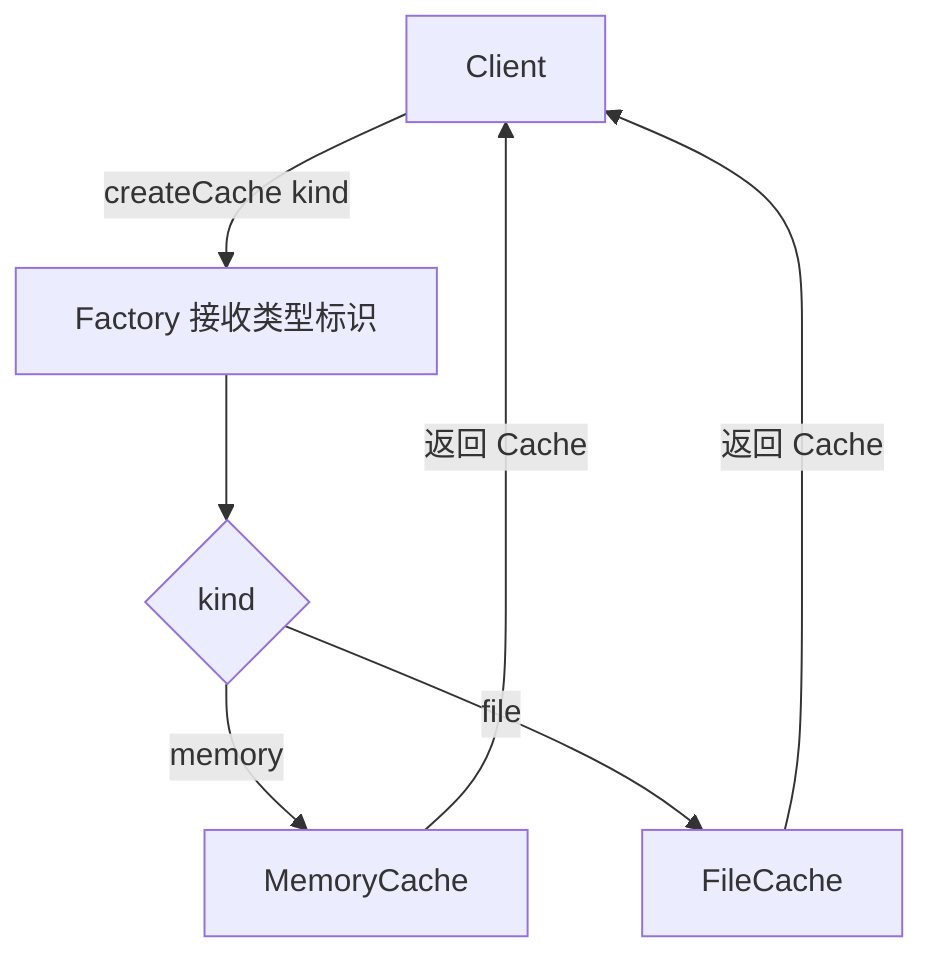

# 程序设计与软件设计｜02-简单工厂（Simple Factory）

<!-- GFM-TOC -->
* [意图（Intent）](#意图intent)
* [结构（Structure）](#结构structure)
* [实现（Implementation）](#实现implementation)
* [适用条件与代价](#适用条件与代价)
* [Dart 标准库与生态映射](#dart-标准库与生态映射)
* [面试追问](#面试追问)
* [参考资料](#参考资料)
* [小结](#小结)
<!-- GFM-TOC -->

## 意图（Intent）

不向客户暴露对象创建的细节，用一个统一入口决定实例化哪个具体产品。

动机：客户端手里常常只有一个类型标识——“我要内存缓存”。如果每个调用点都写一段 `if/else` 去选择实现，新增产品类型就要改遍所有调用方，而且很容易漏改或选错。简单工厂把“选择具体类型”这件事收敛到一处，客户端只面对抽象产品。

## 结构（Structure）



- **Product / ConcreteProduct**：抽象产品协议与具体实现，客户端只依赖前者。
- **Factory**：接收类型标识，返回某个 ConcreteProduct；通常一个顶层函数就是它的全部。

## 实现（Implementation）

以下代码合起来是完整文件 `simple_factory.dart`（枚举输入让 `switch` 穷尽，新增枚举值会立刻编译报错）。验证环境：Dart 3.12.2；`dart analyze` 无问题，`dart run --enable-asserts` 通过。

```dart
// 前置条件：Dart 3.x；纯 Dart；无第三方依赖。
// 简单工厂：调用方给出类型标识，具体类型集中在一处选择。

enum CacheKind { memory, file }

abstract interface class Cache {
  String? read(String key);

  void write(String key, String value);
}

final class MemoryCache implements Cache {
  final Map<String, String> _entries = <String, String>{};

  @override
  String? read(String key) => _entries[key];

  @override
  void write(String key, String value) => _entries[key] = value;
}

final class FileCache implements Cache {
  final Map<String, String> _disk = <String, String>{};

  @override
  String? read(String key) => _disk[key];

  @override
  void write(String key, String value) => _disk[key] = value;
}

// 1. 枚举 switch 是穷尽的：新增 CacheKind 会让这里直接编译报错。
Cache createCache(CacheKind kind) => switch (kind) {
  CacheKind.memory => MemoryCache(),
  CacheKind.file => FileCache(),
};

// 2. 字符串标识无法穷尽，必须显式失败，不能悄悄返回 null。
Cache createCacheByName(String name) => switch (name) {
  'memory' => MemoryCache(),
  'file' => FileCache(),
  _ => throw ArgumentError.value(name, 'name', '未知缓存类型'),
};

void main() {
  final memory = createCache(CacheKind.memory);
  memory.write('note', '设计模式');
  assert(memory.read('note') == '设计模式');

  final file = createCacheByName('file');
  file.write('note', '设计模式');
  assert(file.read('note') == '设计模式');

  // 3. 客户代码只依赖 Cache 协议，不认识具体类型。
  final caches = <Cache>[memory, file];
  assert(
    caches.map((Cache item) => item.read('note') ?? '<missing>').join('|') ==
        '设计模式|设计模式',
  );

  // 4. 非法标识显式报错，而不是静默降级成默认实现。
  try {
    createCacheByName('redis');
    assert(false, '未知类型必须抛错');
  } on ArgumentError catch (error) {
    print('未知类型被拒绝：$error');
  }
  print('caches=${caches.length}');
}
```

<!-- verify: .work/verify/D1b/simple_factory.dart -->

- 字符串版本做不到穷尽，必须在 `_` 分支显式抛 `ArgumentError`；想进一步解耦，可以把“类型 → 构造”做成注册表或函数注入，代价是校验从编译期退回运行期。

Dart 的 `factory` 构造器可以把选择逻辑挂到产品协议上：完整文件 `simple_factory_ctor.dart`，验证环境同上（`factory` 是语言机制，用了它不代表已经实现了 GoF 工厂方法）。

```dart
// 前置条件：Dart 3.x；纯 Dart；无第三方依赖。
import 'dart:convert' show jsonEncode;

/// 产品协议上挂一个 factory 构造器：Report.of('csv') 即可拿到实现。
abstract interface class Report {
  // 1. factory 构造器带实现、可以返回任意子类型，不是抽象成员。
  factory Report.of(String format) => switch (format) {
    'csv' => CsvReport(),
    'json' => JsonReport(),
    _ => throw ArgumentError.value(format, 'format', '未知报表格式'),
  };

  String render(List<Map<String, Object?>> rows);
}

final class CsvReport implements Report {
  @override
  String render(List<Map<String, Object?>> rows) => rows
      .map(
        (Map<String, Object?> row) => row.entries
            .map(
              (MapEntry<String, Object?> entry) =>
                  '${entry.key}=${entry.value}',
            )
            .join(';'),
      )
      .join('\n');
}

final class JsonReport implements Report {
  @override
  String render(List<Map<String, Object?>> rows) => jsonEncode(rows);
}

void main() {
  final rows = <Map<String, Object?>>[
    <String, Object?>{'title': '单例', 'lines': 230},
  ];

  // 2. 调用方只知道协议和字符串标识，看不到具体类型。
  final csv = Report.of('csv');
  assert(csv.render(rows) == 'title=单例;lines=230');

  final json = Report.of('json');
  assert(json.render(rows) == '[{"title":"单例","lines":230}]');

  // 3. 不认识的输入显式失败，而不是返回 null 或默认实现。
  try {
    Report.of('pdf');
    assert(false, '未知格式必须抛错');
  } on ArgumentError catch (error) {
    print('未知格式被拒绝：$error');
  }
  print('csv=${csv.render(rows)}');
}
```

<!-- verify: .work/verify/D1b/simple_factory_ctor.dart -->

## 适用条件与代价

- 适用：产品种类有限且稳定，客户端只给出类型标识，希望集中一处选择实现。
- 代价：新增产品要改工厂本身，违反开闭原则；产品变多后工厂会变成巨大的 `switch`，此时[工厂方法](03-工厂方法.md)或[抽象工厂](04-抽象工厂.md)才是可扩展的结构。

## Dart 标准库与生态映射

- Dart 标准库没有与简单工厂同名的类型或函数；“语言级工厂”指 `factory` 构造器和命名构造器，它们是构造语法，别把“写了 factory”当成已经实现了某个 GoF 模式——下一篇的[工厂方法](03-工厂方法.md)讨论的才是模式意义上的“延迟到子类创建”。
- 需要字符串选型且要显式失败时，`switch` + `throw` 比返回 `null` 更好：调用方不必在每个使用点判空，错误也能定位到源头。

## 面试追问

- 简单工厂为什么不在 GoF 23 里？（它是集中选择逻辑的编码惯例，没有给出可扩展的类结构）
- 它符合还是违反开闭原则？（新增产品需要修改工厂；用穷尽枚举把它变成编译期可见的坏味道，用注册表/函数注入把扩展点交给调用方）
- 什么时候一个 `switch` 就够了，什么时候该换成注册表或函数注入？（产品种类少且稳定时抽象层只会增加阅读成本；插件化、由外部配置决定种类时注册表更合适）

## 参考资料

- [R1] [官方文档] [Dart: Branches — Switch expressions](https://dart.dev/language/branches) — Dart，[核查日期：2026-09]。
- [R2] [官方文档] [Dart: Enumerated types](https://dart.dev/language/enums) — Dart，[核查日期：2026-09]。
- [R3] [官方文档] [Dart: Constructors — Factory constructors](https://dart.dev/language/constructors#factory-constructors) — Dart，[核查日期：2026-09]。

## 小结

> 简单工厂把“选择哪个实现”收敛到一处，让调用方只依赖抽象产品；但新增产品仍要改工厂本身，它用集中的修改换取客户端的稳定。
