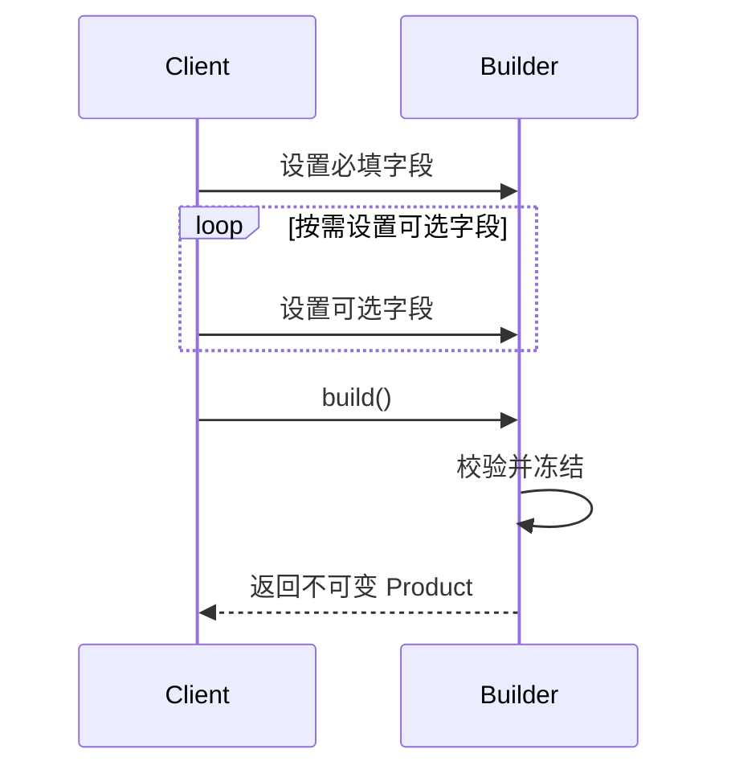

# 程序设计与软件设计｜05-生成器（Builder）

<!-- GFM-TOC -->
* [意图（Intent）](#意图intent)
* [结构（Structure）](#结构structure)
* [实现（Implementation）](#实现implementation)
* [适用条件与代价](#适用条件与代价)
* [Dart 标准库与生态映射](#dart-标准库与生态映射)
* [面试追问](#面试追问)
* [参考资料](#参考资料)
* [小结](#小结)
<!-- GFM-TOC -->

## 意图（Intent）

封装复杂对象的构造过程，允许按步骤构造，并在最后一步校验、冻结出成品。

动机：一个对象的必填与可选字段一多，构造器参数就会膨胀成位置不明的长列表；把校验塞进构造器，一旦漏项也只能在运行期报错。生成器把“设置字段”和“产出对象”拆成两个阶段：中间状态留在 builder 里，只有 `build()` 能产出校验通过的不可变对象，半成品不会泄漏给业务代码。

## 结构（Structure）



- **Product**：最终对象，构造完成后不可变；私有构造器保证只能由 `build()` 创建。
- **Builder**：持有分步设置的中间状态，`build()` 负责校验和转换。
- **Director**（可选）：把固定的组装顺序封装起来；Dart 里用级联或函数也能承担，通常不必单独建类。

## 实现（Implementation）

以下三段代码合起来是完整文件 `builder_http_request.dart`（按职责拆分）。验证环境：Dart 3.12.2；`dart analyze` 无问题，`dart run --enable-asserts` 通过。

不可变产品与校验入口（对应文件第 1–56 行）：

```dart
// 前置条件：Dart 3.x；纯 Dart；无第三方依赖。

/// 不可变请求对象：私有构造器保证只有校验通过的入口能创建它。
final class HttpRequest {
  HttpRequest._({
    required this.method,
    required this.url,
    required this.headers,
    required this.timeout,
    this.body,
  });

  /// 只有少量可选字段时，命名参数加默认值就够了，不必引入 Builder。
  factory HttpRequest.create({
    required String method,
    required String url,
    Map<String, String> headers = const <String, String>{},
    Duration timeout = const Duration(seconds: 10),
    String? body,
  }) {
    final normalizedMethod = method.toUpperCase();
    if (!_supportedMethods.contains(normalizedMethod)) {
      throw ArgumentError.value(method, 'method', '不支持的 HTTP 方法');
    }
    if (!url.startsWith('http://') && !url.startsWith('https://')) {
      throw ArgumentError.value(url, 'url', '必须带 http:// 或 https:// 前缀');
    }
    if (timeout <= Duration.zero) {
      throw ArgumentError.value(timeout, 'timeout', '超时必须为正数');
    }
    return HttpRequest._(
      method: normalizedMethod,
      url: url,
      headers: Map<String, String>.unmodifiable(headers),
      timeout: timeout,
      body: body,
    );
  }

  static const Set<String> _supportedMethods = <String>{
    'GET',
    'POST',
    'PUT',
    'DELETE',
  };

  final String method;
  final String url;
  final Map<String, String> headers;
  final Duration timeout;
  final String? body;

  @override
  String toString() =>
      '$method $url (${timeout.inMilliseconds}ms) headers=$headers';
}
```

<!-- verify: .work/verify/D1b/builder_http_request.dart -->

分步构建器（对应文件第 58–92 行）：

```dart
/// 分步构建器：必填项进构造器，可选项逐个设置，最后统一校验。
final class HttpRequestBuilder {
  HttpRequestBuilder({required this.method, required this.url});

  final String method;
  final String url;
  final Map<String, String> _headers = <String, String>{};
  Duration _timeout = const Duration(seconds: 10);
  String? _body;

  // 1. 设置方法返回 this 便于级联；半成品始终留在 builder 内部。
  HttpRequestBuilder header(String name, String value) {
    _headers[name] = value;
    return this;
  }

  HttpRequestBuilder timeout(Duration value) {
    _timeout = value;
    return this;
  }

  HttpRequestBuilder body(String value) {
    _body = value;
    return this;
  }

  // 2. build() 是唯一产出点，全部校验集中在这里发生。
  HttpRequest build() => HttpRequest.create(
    method: method,
    url: url,
    headers: _headers,
    timeout: _timeout,
    body: _body,
  );
}
```

<!-- verify: .work/verify/D1b/builder_http_request.dart -->

调用侧与断言（对应文件第 94–123 行）：

```dart
void main() {
  // 3. 调用侧：必填项进构造器，可选项用级联逐个补上。
  final builder =
      HttpRequestBuilder(method: 'post', url: 'https://example.com/notes')
        ..header('content-type', 'application/json')
        ..timeout(const Duration(seconds: 3))
        ..body('{"title":"生成器"}');
  final request = builder.build();

  assert(request.method == 'POST');
  assert(request.timeout.inSeconds == 3);
  assert(request.body == '{"title":"生成器"}');

  // 4. 错误参数在 build() 抛出，不会流出无效对象。
  try {
    HttpRequestBuilder(method: 'PATCH', url: 'https://example.com').build();
    assert(false, '不支持的方法应当抛错');
  } on ArgumentError catch (error) {
    print('拒绝：${error.message}');
  }

  // 5. 产出后是快照：headers 不能再被修改。
  try {
    request.headers['x'] = 'y';
    assert(false, 'headers 应当不可修改');
  } on UnsupportedError catch (error) {
    print('headers 不可修改：$error');
  }
  print('request=$request');
}
```

<!-- verify: .work/verify/D1b/builder_http_request.dart -->

要点：

- 校验集中在 `HttpRequest.create`，builder 的 `build()` 只是转发；这样“直接命名参数创建”和“分步构建”走同一条校验路径，不会出现两套规则。
- `Map.unmodifiable` 让成品拿到的是快照，后续改 builder 的 `_headers` 不再影响已产出的对象。不冻结的话，builder 复用会悄悄改掉旧对象；这里的安全性依赖 value 是不可变的 `String`，若 value 换成可变对象仍需递归复制。
- 参数少、没有分步需求时，命名参数加默认值就够了，Builder 只会多一层可变状态；这正对应 Dart 的惯用写法：`HttpRequest.create(method: 'GET', url: ...)`。
- Builder 和 Abstract Factory 都会“创建对象”，但关注点不同：Builder 关心**同一个对象**怎样一步步组装，Abstract Factory 关心**一族对象**由谁配套创建。
- 不需要分步时，与其建 builder 类，不如写一个返回不可变对象的顶层函数：参数校验放进函数体，调用方一步拿到成品。

## 适用条件与代价

- 适用：字段多且可选比例高、构造需要分步或顺序、必须在产出前统一校验、成品要求不可变。构建步骤本身可复用（如测试夹具、请求模板）时收益更大。
- 代价：多一个可变类型和一段半成品窗口期；builder 内部可变，跨异步边界复用时要想清楚谁在改。

## Dart 标准库与生态映射

- Dart 的命名参数、默认值、级联调用和 `copyWith` 已覆盖大量简单场景，很多 Java 世界需要 Builder 的样板在 Dart 里可以直接省掉；`copyWith` 只能换字段，不保证深拷贝。
- `StringBuffer` 是标准库里现成的 builder-like API：`write` 逐步累积，最后 `toString()` 产出结果。但它是为字符串拼接优化的可变缓冲，不等于通用的 Builder 模式。
- Dart 没有 `char`：按 code unit 推进时用 `codeUnitAt`/`String.fromCharCode`，遇到 emoji 这类补充平面字符必须改用 `runes` 遍历，否则会切在代理对中间。

## 面试追问

- Builder 与构造器/命名参数的边界在哪？（可选字段多、需要分步与统一校验时用 Builder；否则命名参数更短更安全）
- 怎样避免无效半成品泄漏？（私有构造器 + `build()` 唯一产出点，校验失败直接抛错）
- Builder 适合做“通用拼装”吗？（不适合。可选字段继续增加时优先拆成一组小对象；Builder 不该变成万能参数袋，这与[代码可读性](../../07-工程工具与代码质量/04-代码可读性与风格.md)里“减少参数数量”的建议一致）

## 参考资料

- [R1] [官方文档] [Dart: Constructors — Constant constructors](https://dart.dev/language/constructors#constant-constructors) — Dart，[核查日期：2026-09]。
- [R2] [官方文档] [Dart: Operators — Cascade notation](https://dart.dev/language/operators#cascade-notation) — Dart，[核查日期：2026-09]。
- [R3] [官方文档] [Dart: Built-in types — Runes and grapheme clusters](https://dart.dev/language/built-in-types#runes-and-grapheme-clusters) — Dart，[核查日期：2026-09]。
- [R4] [官方文档] [Dart API: Map.unmodifiable](https://api.dart.dev/dart-core/Map/Map.unmodifiable.html) — Dart，[核查日期：2026-09]。

## 小结

> 生成器把“分步设置”与“产出成品”分开，唯一的 build() 出口负责校验，换来不可变成品与更少的半成品状态。
