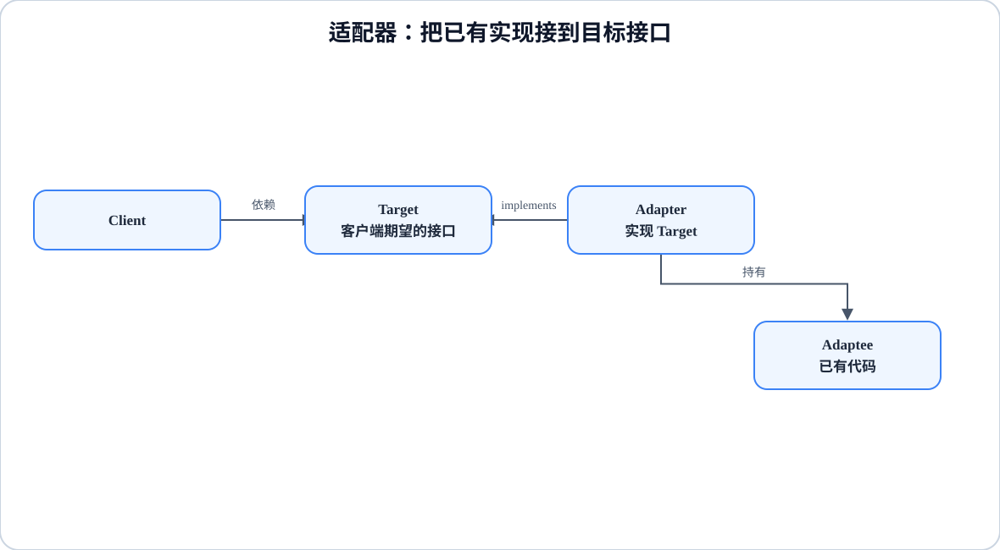

# 程序设计与软件设计｜07-适配器（Adapter）

<!-- GFM-TOC -->
* [意图（Intent）](#意图intent)
* [结构（Structure）](#结构structure)
* [实现（Implementation）](#实现implementation)
* [适用条件与代价](#适用条件与代价)
* [Dart 标准库与生态映射](#dart-标准库与生态映射)
* [面试追问](#面试追问)
* [参考资料](#参考资料)
* [小结](#小结)
<!-- GFM-TOC -->

## 意图（Intent）

把一个类的接口转换成客户端期望的另一个接口，使原本因接口不兼容而不能协作的类可以一起工作。

动机：对接第三方 SDK、遗留模块或新旧两代 API 时，经常出现“功能明明有，但对不上号”的情况——客户端要的是 `quack()`，旧模块只提供 `gobble()`。修改任何一端都可能牵动大量调用方，或者干脆没有源码。适配器选择在中间加一层翻译，让两端都保持原样。

## 结构（Structure）

<figure class="diagram-scroll"></figure>

- **Target**：客户端期望的接口，也是适配器实现的接口。
- **Adaptee**：已有但接口不兼容的实现，通常不允许修改。
- **Adapter**：实现 Target，内部持有 Adaptee，把调用翻译过去；能力缺口由它自己补齐。
- **Client**：只依赖 Target，不知道背后是不是被适配过的对象。

依赖方向：Client 只认识 Target，Adapter 同时认识 Target 和 Adaptee，Adaptee 谁都不认识。多出来的一层完全由 Adapter 吸收，两端各自保持独立。

## 实现（Implementation）

沿用鸭子与火鸡的直观场景：客户端只会“让鸭子叫”，火鸡只会 `gobble()`，而且火鸡不会飞。用对象适配器让火鸡冒充鸭子，再补一个只有单个方法的函数适配器。

以下代码合起来是完整文件 `adapter.dart`。验证环境：Dart 3.12.2；`dart analyze` 无问题，`dart run --enable-asserts` 通过（Dart 默认不启用断言，运行带 `assert` 的示例时要显式开启）。

```dart
// 前置条件：Dart 3.x；纯 Dart；无第三方依赖。
// 运行：dart run --enable-asserts adapter.dart

/// 目标协议（Target）：客户端只会用这套成员。
abstract interface class Duck {
  String quack();

  String fly();
}

/// 被适配者（Adaptee）：接口形状不同，而且能力有缺口。
abstract interface class Turkey {
  String gobble();
}

final class MallardDuck implements Duck {
  const MallardDuck();

  @override
  String quack() => 'quack!';

  @override
  String fly() => '飞行 500 米';
}

final class WildTurkey implements Turkey {
  const WildTurkey();

  @override
  String gobble() => 'gobble!';
}

/// 对象适配器（Object Adapter）：实现 Target，内部持有 Adaptee。
final class TurkeyAdapter implements Duck {
  const TurkeyAdapter(this._turkey);

  final Turkey _turkey;

  // 1. 方法名映射：quack 委托给 gobble。
  @override
  String quack() => _turkey.gobble();

  // 2. 目标协议比 Adaptee 多的能力，由适配器补齐并说明降级。
  @override
  String fly() => '飞行 50 米（火鸡上限）';
}

```

```dart
/// 单方法协议可以用函数适配器完成，不必建类。
String Function(String code) adaptLegacyLookup(String Function(int id) legacy) {
  // 3. 把客户端给的字符串编号翻译成旧接口需要的整数编号。
  return (code) {
    if (code.length < 2 || code.codeUnitAt(0) != 0x45) {
      throw FormatException('编号必须形如 E12', code);
    }
    return legacy(int.parse(code.substring(1)));
  };
}

String legacyLookup(int id) => '第 $id 号员工';

void main() {
  final ducks = <Duck>[const MallardDuck(), const TurkeyAdapter(WildTurkey())];

  // 4. 客户端只依赖 Duck，分不清哪个是真鸭子、哪个是伪装的。
  assert(ducks.map((duck) => duck.quack()).join(' ') == 'quack! gobble!');
  assert(ducks[1].fly() == '飞行 50 米（火鸡上限）');

  // 5. 函数适配器：同一个旧实现，换个入口继续用。
  final lookup = adaptLegacyLookup(legacyLookup);
  assert(lookup('E12') == '第 12 号员工');

  // 6. 无法转换的输入必须显式失败，不能悄悄返回坏数据。
  var rejected = false;
  try {
    lookup('坏编号');
  } on FormatException {
    rejected = true;
  }
  assert(rejected);

  print(ducks.map((duck) => '${duck.quack()} / ${duck.fly()}').join('\n'));
}
```

<!-- verify: .work/verify/D2b/adapter.dart -->

要点：

- `TurkeyAdapter` 用组合而不是继承持有被适配者。Dart 是单继承，而且 `implements` 只继承契约、不继承实现；想像 Java 类适配器那样“既继承 Adaptee 又实现 Target”会同时受继承限制和 `final`/`sealed` 修饰符约束，收益也不如组合明确。
- 目标协议比被适配者多出来的成员（`fly`）是适配器的真实职责：要么补齐，要么显式拒绝，最忌讳的是返回一个看起来正常、实际错误的结果。这里的取舍写在输出里，让调用方看得见能力降级。
- 翻译不只是改方法名，还要翻译错误契约和异步契约。示例把非法编号交给 `int.parse` 抛出 `FormatException`；如果 Target 约定的是领域异常，适配器就要把底层异常映射过去。
- 单方法协议优先用函数适配器：把旧函数包成新签名的函数，不需要为“只有一个方法”建一个类。
- extension method 不能替代适配器。它只是在某个静态类型上增加调用语法，既不会让对象变成 Target，也无法把火鸡传进需要 `Duck` 的位置。

## 适用条件与代价

- 适用：两端接口都已固定（第三方库、遗留代码、跨团队契约），客户端希望只依赖自己期望的协议。
- 不适用：能直接改上游接口，或者中间层只是简单改名。这时改上游或删掉中间层比长期维护一个适配器更划算。
- 代价：多一层间接调用，堆栈和调试信息都会变长；每个被适配的方法都要持续跟随两端的变化；适配器数量失控时会形成“接口方言”，反而增加理解成本。

## Dart 标准库与生态映射

- Dart 标准库没有名为 Adapter 的类型。最接近的“转换接口”是 `dart:convert` 的 `Converter<S, T>` 与 `Codec<S, T>`：`Utf8Codec`、`JsonCodec` 都实现了这套协议，输入输出类型是契约的一部分。
- 但要区分：`Converter` 是通用的类型转换协议，GoF 适配器解决的是“已有类型无法满足客户端期望的接口”。不是每个 converter 都是适配器，反之适配器也不必实现 `Converter`。
- 没有语义相符的集合 API 需要列出：集合的 `from` 构造器做的是复制或视图转换，与“兼容两个本不匹配的接口”不是同一个问题。

## 面试追问

- 对象适配器和类适配器有什么区别？Dart 为什么通常只能选对象适配器？
- 适配器和外观怎么区分？（适配器换接口形状，[外观](11-外观.md)简化入口）
- 适配器和装饰器都靠组合持有对象，区别在哪里？（见[装饰](10-装饰.md)）
- 被适配者的异常类型要不要转换？异步接口返回 `Future` 时怎么处理？
- 什么情况下应该反过来推动上游改接口，而不是继续加适配器？
- 需要双向转换时，适配器会承担什么额外责任？

## 参考资料

- [R1] [官方文档] [Dart API: Converter<S, T>](https://api.dart.dev/dart-convert/Converter-class.html) — Dart，[核查日期：2026-09]。
- [R2] [官方文档] [Dart API: Codec<S, T>](https://api.dart.dev/dart-convert/Codec-class.html) — Dart，[核查日期：2026-09]。
- [R3] [官方文档] [Dart: Extension methods](https://dart.dev/language/extension-methods) — Dart，[核查日期：2026-09]。

## 小结

> 适配器在两端已固定的接口之间做翻译，让客户端只依赖期望的协议，代价是多一层间接与跟随两端变化的维护成本。
