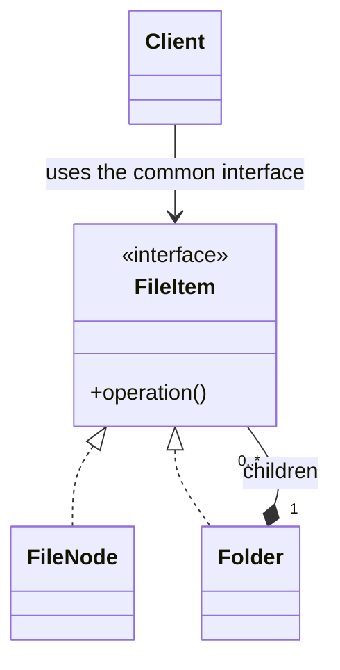

# 程序设计与软件设计｜09-组合（Composite）

<!-- GFM-TOC -->
* [意图（Intent）](#意图intent)
* [结构（Structure）](#结构structure)
* [实现（Implementation）](#实现implementation)
* [适用条件与代价](#适用条件与代价)
* [Dart 标准库与生态映射](#dart-标准库与生态映射)
* [面试追问](#面试追问)
* [参考资料](#参考资料)
* [小结](#小结)
<!-- GFM-TOC -->

## 意图（Intent）

把对象组合成树形结构，表示“整体—部分”的层次关系，让客户端用同一方式处理单个对象和组合对象。

动机：目录、菜单、表达式、组织架构都是树。如果 API 严格区分“单个节点”和“有子节点的容器”，客户端每做一次递归都要先判断类型，再决定调用哪个方法；整体性操作（求和、打印、统计）也会在两处重复实现。组合模式让叶子与容器共享同一个协议，把递归的责任交给容器，客户端只面向协议写一遍代码。

## 结构（Structure）



- **Component**：叶子和容器的共同协议，声明整体性操作。
- **Leaf**：没有子节点，操作只作用于自己。
- **Composite**：持有子节点，把操作递归委托给子节点；容器里可以再放容器。
- **Client**：只依赖 Component，无需区分叶子与容器。

依赖方向：客户端和容器都依赖 `FileNode`，所以容器能嵌套任意深度的容器或叶子；叶子不知道树的存在。

## 实现（Implementation）

用文件与目录演示。示例采用“安全式”设计：`add`/`remove` 只出现在 `Folder`，叶子在类型上就不具备这两个方法，客户端不可能误用。

以下代码合起来是完整文件 `composite.dart`。验证环境：Dart 3.12.2；`dart analyze` 无问题，`dart run --enable-asserts` 通过。

```dart
// 前置条件：Dart 3.x；纯 Dart；无第三方依赖。
// 运行：dart run --enable-asserts composite.dart

/// 组件（Component）：叶子与容器的共同协议，不包含子节点操作。
abstract class FileNode {
  FileNode(this.name);

  final String name;

  int get size;

  /// 打印以自己为根的子树；depth 决定缩进层级。
  String describe([int depth = 0]);
}

/// 叶子（Leaf）：自己就是终点，没有 add/remove 可误用。
final class FileItem extends FileNode {
  FileItem(super.name, this.sizeInBytes);

  final int sizeInBytes;

  @override
  int get size => sizeInBytes;

  @override
  String describe([int depth = 0]) => '${'  ' * depth}$name ($sizeInBytes B)';
}

/// 容器（Composite）：持有子节点，把操作递归委托下去。
final class Folder extends FileNode {
  Folder(super.name);

  final List<FileNode> _children = <FileNode>[];

  /// 只读视图：调用方不能绕过 add/remove 直接改内部列表。
  List<FileNode> get children => List.unmodifiable(_children);

  void add(FileNode node) {
    if (node is Folder && node._contains(this)) {
      throw StateError('不能把目录加入自己的子树，否则会形成环');
    }
    _children.add(node);
  }

  bool _contains(FileNode target) {
    if (identical(this, target)) return true;
    return _children.any(
      (child) => child is Folder && child._contains(target),
    );
  }

  void remove(FileNode node) => _children.remove(node);

  // 1. 整体的大小由部分递归求和，容器不关心子节点是文件还是目录。
  @override
  int get size => _children.fold(0, (sum, child) => sum + child.size);

  @override
  String describe([int depth = 0]) => <String>[
    '${'  ' * depth}$name/',
    for (final child in _children) child.describe(depth + 1),
  ].join('\n');
}

```

```dart
/// 2. 递归遍历：调用方用同一段代码走完整棵树。
Iterable<FileNode> walk(FileNode node) sync* {
  yield node;
  if (node is Folder) {
    for (final child in node.children) {
      yield* walk(child);
    }
  }
}

void main() {
  final root = Folder('root');
  final docs = Folder('docs');
  final api = Folder('api');
  root.add(FileItem('readme.md', 120));
  root.add(docs);
  root.add(FileItem('logo.png', 2048));
  docs.add(FileItem('intro.md', 300));
  docs.add(api);
  api.add(FileItem('v1.md', 48));

  // 3. 同一次调用同时覆盖叶子与容器：整体等于部分之和。
  assert(root.size == 2516);
  assert(docs.size == 348);
  assert(api.size == 48);

  // 4. describe 的递归责任在容器一侧，叶子只描述自己。
  assert(
    root.describe() ==
        'root/\n'
            '  readme.md (120 B)\n'
            '  docs/\n'
            '    intro.md (300 B)\n'
            '    api/\n'
            '      v1.md (48 B)\n'
            '  logo.png (2048 B)',
  );

  // 5. 遍历顺序固定为深度优先，与节点是叶子还是容器无关。
  assert(
    walk(root).map((node) => node.name).join(',') ==
        'root,readme.md,docs,intro.md,api,v1.md,logo.png',
  );
  print(root.describe());
}
```

<!-- verify: .work/verify/D2b/composite.dart -->

要点：

- 递归的终止条件是叶子：`FileItem.size` 直接返回自身大小，不依赖子节点；空目录通过 `fold` 自然得到 0。设计容器操作时先确认“最小情形”不会无限递归。
- `children` 暴露 `List.unmodifiable` 视图，外部无法绕过 `add`/`remove` 改内部列表。如果调用方需要快照或深拷贝，应显式提供方法，而不是把可变列表直接交出去。
- `walk` 用 `sync*` 生成器把遍历顺序与节点类型解耦；判断 `node is Folder` 只出现在遍历函数一处，而不是散落在客户端。
- GoF 的“透明式”把 `add`/`remove` 放上 Component，客户端调用统一，代价是叶子也必须实现（通常抛 `UnsupportedError`），编译器帮不上忙。示例选了安全式：牺牲一点“绝对统一”，换取类型系统对误用的拦截。
- 容器在 `add` 时检查待加入目录是否已经包含当前目录，拒绝自包含和互相嵌套，避免 `size`/`describe` 因环路无限递归；如果真实系统允许跨树移动，还要补充单亲约束与移动时的父节点更新。
- Dart 的 `sealed` 节点族配合穷尽 `switch` 很适合遍历封闭的语法树；但如果库外需要新增节点类型，就不要 `sealed`，否则每加一种节点都会破坏下游的穷尽匹配。

## 适用条件与代价

- 适用：数据天然是树或“整体—部分”关系；客户端希望对叶子和容器写同一套代码；递归操作需要集中实现。
- 代价：公共协议容易退化成所有节点的最小公倍数，某些只对容器有意义的方法（如排序、去重）难以上升到 Component；深度很大的树会把递归压进调用栈；容器与叶子共享协议后，运行期类型判断 `is Folder` 仍可能渗透到遍历代码里。
- 与普通树结构的区别：组合模式的重点在于“叶子与容器共享同一协议并统一客户端调用”，而不只是“能存子节点”。只是用一个 `List` 装子节点、客户端依旧到处判断类型，那只是树，不是组合模式。

## Dart 标准库与生态映射

- Dart 标准库没有 Component 的实现。`Iterable` + `sync*` 可以承担树的遍历部分，但遍历协议本身不定义“整体与部分”的委托关系。
- 集合的 `addAll` 不能类比组合：批量添加元素与“把子对象的操作递归委托给父对象”是两件事，元素之间也没有形成层次。

## 面试追问

- 组合模式和普通递归数据结构有什么区别？（协议统一 + 委托递归，而不只是节点里放列表）
- 叶子该不该实现 `add`/`remove`？透明式和安全式各自付出什么代价？
- 怎么防止树上出现环路？检测放在哪一层？
- `children` 该返回内部列表、只读视图还是快照？三种做法的调用方责任有何不同？
- 如果容器节点需要缓存 `size` 而不是每次递归计算，怎么保证缓存不失效？
- 组合模式和装饰器都靠“实现同一协议 + 持有同类对象”，它们的意图差别是什么？（见[装饰](10-装饰.md)）
- 组合与复制语义如何互相影响：复制整棵树时，子节点应该共享还是重建？不要假设容器会替你深拷贝。

## 参考资料

- [R1] [官方文档] [Dart: Functions — Generators](https://dart.dev/language/functions#generators) — Dart，[核查日期：2026-09]。
- [R2] [官方文档] [Dart: Class modifiers — Sealed](https://dart.dev/language/class-modifiers#sealed) — Dart，[核查日期：2026-09]。
- [R3] [官方文档] [Dart: Patterns](https://dart.dev/language/patterns) — Dart，[核查日期：2026-09]。

## 小结

> 组合模式让叶子与容器共享同一协议，客户端对整棵树只写一遍递归；安全式与透明式的取舍取决于误用拦截和调用统一哪个更重要。
