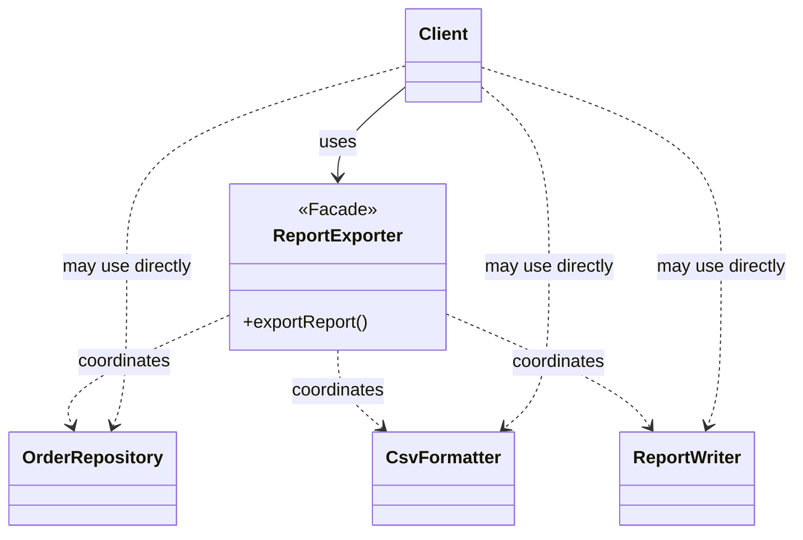

# 程序设计与软件设计｜11-外观（Facade）

<!-- GFM-TOC -->
* [意图（Intent）](#意图intent)
* [结构（Structure）](#结构structure)
* [实现（Implementation）](#实现implementation)
* [适用条件与代价](#适用条件与代价)
* [Dart 标准库与生态映射](#dart-标准库与生态映射)
* [面试追问](#面试追问)
* [参考资料](#参考资料)
* [小结](#小结)
<!-- GFM-TOC -->

## 意图（Intent）

为子系统中的一组接口提供一个一致的、更高层的入口，让子系统更容易使用。

动机：完成一个业务动作往往需要按正确顺序调用多个子系统，比如“导出月报”要先取数、再格式化、最后写文件。让每个调用方自己记住这三个步骤，既容易漏，也容易顺序写错。外观把这些固定流程收拢成一个方法；但它只是“多一个入口”，不是“把子系统锁起来”——需要精细控制的调用方仍然可以直接使用底层接口。

## 结构（Structure）



- **Facade**：知道完成某个用例需要哪些子系统、按什么顺序调用，对外只暴露用例级方法。
- **Subsystem**：各自完成一件具体的事，互不知道 Facade 存在。
- **Client**：常用路径走 Facade；高级场景可直接组合子系统。

依赖方向：Client → Facade → 子系统，是单向的。Facade 依赖具体子系统，子系统不反向依赖 Facade，因此 Facade 可以替换或删除而不影响子系统的复用。

## 实现（Implementation）

用“导出月报”演示：取数、格式化、写文件三个协作者，外观只负责编排顺序并让错误原样传播。写文件用内存 `Map` 模拟，示例不触碰真实文件系统。

以下代码合起来是完整文件 `facade.dart`。验证环境：Dart 3.12.2；`dart analyze` 无问题，`dart run --enable-asserts` 通过。

```dart
// 前置条件：Dart 3.x；纯 Dart；无第三方依赖。
// 运行：dart run --enable-asserts facade.dart

/// 子系统一：取数。缺数据时抛错，不返回“空报表”蒙混过关。
final class OrderRepository {
  final Map<String, List<int>> _amountsByMonth = {
    '2026-08': [1200, 800, 300],
    '2026-09': [],
  };

  List<int> findByMonth(String month) {
    final amounts = _amountsByMonth[month];
    if (amounts == null) {
      throw StateError('没有 $month 的订单数据');
    }
    return List.unmodifiable(amounts);
  }
}

/// 子系统二：格式化。空数据在这里被拒绝。
final class CsvFormatter {
  String toCsv(List<int> amounts) {
    if (amounts.isEmpty) {
      throw StateError('没有可导出的记录');
    }
    return <String>['amount', ...amounts.map((amount) => '$amount')].join('\n');
  }
}

/// 子系统三：落盘。示例里用内存 Map 代替文件系统。
final class ReportWriter {
  final Map<String, String> _saved = {};

  Map<String, String> get saved => Map.unmodifiable(_saved);

  String write(String fileName, String content) {
    _saved[fileName] = content;
    return '已写入 $fileName（${content.length} 字符）';
  }
}

```

```dart
/// 外观（Facade）：把“取数 → 格式化 → 写文件”的固定次序收拢在一处。
final class ReportExporter {
  ReportExporter({
    required this.repository,
    required this.formatter,
    required this.writer,
  });

  final OrderRepository repository;
  final CsvFormatter formatter;
  final ReportWriter writer;

  // 1. 只做编排：每一步仍由对应子系统完成。
  String export(String month) {
    final amounts = repository.findByMonth(month);
    final csv = formatter.toCsv(amounts);
    return writer.write('report-$month.csv', csv);
  }
}

void main() {
  final repository = OrderRepository();
  final writer = ReportWriter();
  final exporter = ReportExporter(
    repository: repository,
    formatter: CsvFormatter(),
    writer: writer,
  );

  // 2. 一次调用代替三步子系统操作，顺序由外观保证。
  final message = exporter.export('2026-08');
  assert(message.startsWith('已写入 report-2026-08.csv'));
  assert(writer.saved['report-2026-08.csv'] == 'amount\n1200\n800\n300');
  print(message);

  // 3. 领域错误原样传播：空数据被拒绝，而不是写出一份空报表。
  var rejected = false;
  try {
    exporter.export('2026-09');
  } on StateError catch (error) {
    rejected = true;
    print('导出失败：${error.message}');
  }
  assert(rejected);
  assert(writer.saved.length == 1);

  // 4. 外观不是围墙：需要精细控制时，子系统仍可直接使用。
  final rows = repository.findByMonth('2026-08');
  assert(rows.length == 3);
  assert(CsvFormatter().toCsv([rows.first]) == 'amount\n1200');
}
```

<!-- verify: .work/verify/D2b/facade.dart -->

要点：

- 外观的职责是“知道流程和顺序”，不是接管子系统的规则。校验空数据仍由 `CsvFormatter` 负责，外观只决定什么时候调用它。
- 错误必须原样传播或翻译成调用方能理解的类型，不能吞掉。示例中空月份导致 `export` 抛 `StateError`，且没有写出任何文件；如果外观在这里 `catch` 后返回“成功”，调用方就会拿到一份不存在的报表。
- 外观没有封闭子系统：`repository.findByMonth`、`CsvFormatter().toCsv` 仍可被高级调用方直接组合，外观的收益是“常用路径更短”，而不是“唯一入口”。
- 外观和适配器的方向相反：适配器改变接口形状以匹配客户端期望，外观提供更窄的入口以简化使用；外观不做翻译，也通常不改变被调用方法的语义。
- 示例直接注入具体子系统是为了突出编排关系；如果子系统需要替换或隔离测试，应让外观依赖更窄的接口，再在组合根注入具体实现。
- 外观要克制。如果它把每个子系统的每个方法都转发一遍，就会长成 God Object，退化成没有价值的中间层。判断标准：方法是否对应一个完整用例，而不是 API 的机械汇总。

## 适用条件与代价

- 适用：一个用例需要按固定顺序协作多个子系统；调用方大多是“只走常用路径”的业务代码；希望在不改子系统的情况下收敛入口。
- 代价：Facade 成为调用方与子系统之间的耦合点，子系统接口变化时通常要同步修改它；如果把过多流程塞进去，会变成什么都懂的上帝对象；分层增加后，“Facade 只是转发”的无价值抽象也会拖慢定位问题的速度。
- 与“直接写顶层函数”的区别：外观不需要是类。如果编排逻辑无状态，一个顶层函数同样成立；GoF 用类描述，是因为外观可能持有子系统引用或生命周期状态。示例选择类形式便于替换与测试。

## Dart 标准库与生态映射

- Dart 标准库没有 Facade 类型，这里不硬凑对应物。
- `library` 的 `export` / `part` 可以控制一个包的公开符号表面，让使用者少面对内部细节；但那是编译期的 API 组织手段，与“对象级的外观编排”不是一回事：前者不负责顺序，也不持有子系统。
- 如果外观只是把多个调用排列起来且没有状态，优先考虑顶层函数或一个薄封装类，而不是引入接口层次。

## 面试追问

- 外观和适配器怎么区分？（换接口形状 vs 提供简化入口）
- 外观会不会变成上帝对象？怎样划定它的职责边界？
- 外观是否“隐藏”了子系统？调用方还能不能用底层 API？
- 多个用例各自需要不同顺序时，是继续加 Facade 方法，还是让调用方自己组合？
- 外观和中介者都处在中间，区别是什么？（外观单向编排、子系统中立；中介者让协作者通过它互相通信）

## 参考资料

- [R1] [官方文档] [Dart: Libraries & imports](https://dart.dev/language/libraries) — Dart，[核查日期：2026-09]。
- [R2] [官方文档] [Effective Dart: Design](https://dart.dev/effective-dart/design) — Dart，[核查日期：2026-09]。

## 小结

> 外观把固定流程收拢成一个用例级入口，并不封闭子系统；它只做编排，错误与底层接口都应保持原样可及。
