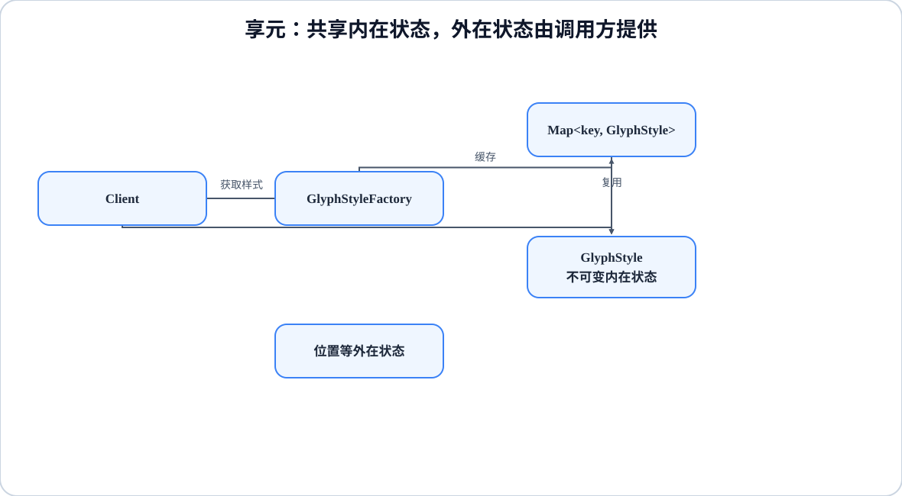

# 程序设计与软件设计｜12-享元（Flyweight）

<!-- GFM-TOC -->
* [意图（Intent）](#意图intent)
* [结构（Structure）](#结构structure)
* [实现（Implementation）](#实现implementation)
* [适用条件与代价](#适用条件与代价)
* [Dart 标准库与生态映射](#dart-标准库与生态映射)
* [面试追问](#面试追问)
* [参考资料](#参考资料)
* [小结](#小结)
<!-- GFM-TOC -->

## 意图（Intent）

运用共享技术有效地支持大量细粒度的对象。

动机：文本排版、地图瓦片、游戏粒子这类场景里，对象数量可能成千上万，但其中大量字段的值是重复且不变的——比如 500 个字形可能只有两种字体样式。如果每个字形都各存一份完整样式，内存会被重复数据吃掉。享元把状态拆成两半：可共享、不可变的“内在状态”收进享元对象并只保留一份；随使用场景变化的“外在状态”由调用方在调用时传入。

## 结构（Structure）

<figure class="diagram-scroll"></figure>

- **Flyweight**：享元对象，只保存内在状态，并且必须不可变。
- **FlyweightFactory**：按内在状态的组合去重，相同 key 返回同一个实例。
- **ExtrinsicState**：外在状态，不进享元，由调用方保存并随调用传入。
- **Client**：持有外在状态，通过工厂取得共享实例。

依赖方向：客户端依赖工厂与享元协议；享元不认识使用它的场景，外在状态沿调用参数进入，而不是存在享元内部。

## 实现（Implementation）

用字形排版演示：`GlyphStyle` 是内在状态，位置和字符是外在状态；工厂按 `(font, size, color)` 共享样式，并用 `identical` 证明复用。

以下代码合起来是完整文件 `flyweight.dart`。验证环境：Dart 3.12.2；`dart analyze` 无问题，`dart run --enable-asserts` 通过。

```dart
// 前置条件：Dart 3.x；纯 Dart；无第三方依赖。
// 运行：dart run --enable-asserts flyweight.dart

/// 内部状态（IntrinsicState）：可共享，因此必须不可变。
final class GlyphStyle {
  const GlyphStyle({
    required this.font,
    required this.size,
    required this.color,
  });

  final String font;
  final int size;
  final int color;
}

/// 享元工厂：按内部状态的组合去重，相同状态只保留一个实例。
final class GlyphStyleFactory {
  final Map<(String, int, int), GlyphStyle> _pool = {};

  GlyphStyle of({required String font, required int size, required int color}) {
    if (font.isEmpty || size <= 0) {
      throw ArgumentError('字体不能为空且字号必须为正数');
    }
    // 1. record 自带值相等语义，可以直接当 Map 的键。
    final key = (font, size, color);
    return _pool.putIfAbsent(
      key,
      () => GlyphStyle(font: font, size: size, color: color),
    );
  }

  int get sharedCount => _pool.length;
}

/// 外部状态（ExtrinsicState）：随使用场景变化，不放进享元对象。
final class Glyph {
  const Glyph(this.style, this.char, this.x, this.y);

  final GlyphStyle style;
  final String char;
  final int x;
  final int y;

  String render() => '${style.font}${style.size}#$char @($x,$y)';
}

```

```dart
void main() {
  final factory = GlyphStyleFactory();
  final glyphs = <Glyph>[];
  const fonts = <String>['Songti', 'Heiti'];

  // 2. 500 个字形，只用到 2 种字体样式。
  for (var index = 0; index < 500; index++) {
    glyphs.add(
      Glyph(
        factory.of(font: fonts[index % 2], size: 12, color: 0xFF000000),
        '字',
        index,
        index,
      ),
    );
  }

  // 3. 共享的判据是“同一个实例”，不是值相等：
  assert(glyphs.length == 500);
  assert(factory.sharedCount == 2);
  assert(identical(glyphs[0].style, glyphs[2].style));
  assert(glyphs[0].render() == 'Songti12#字 @(0,0)');
  print('${glyphs.length} 个字形共享了 ${factory.sharedCount} 份样式');

  // 4. 语言自带的共享手段之一：const 对象会被规范化为同一实例。
  const a = GlyphStyle(font: 'Heiti', size: 12, color: 0);
  const b = GlyphStyle(font: 'Heiti', size: 12, color: 0);
  assert(identical(a, b));
}
```

<!-- verify: .work/verify/D2b/flyweight.dart -->

要点：

- 内在状态和外在状态的划分是享元的全部难点。判据有两条：内在状态在使用期间不变、并且有大量对象取值重复；外在状态随每次使用变化，塞进享元就会让共享失效。位置如果放进 `GlyphStyle`，500 个字形就得有 500 份样式。
- 共享的判据是**同一个实例**（`identical`），而不是值相等。两个 `==` 成立的对象仍可能各占一份内存；享元省下的正是这份重复。
- 享元对象必须不可变。一旦某个使用者改了共享样式，所有引用它的字形都会跟着变，这类 bug 极难定位。示例把字段声明为 `final` 并用 `const` 构造，从类型层面挡住修改。
- Dart 的 `const` 对象会被规范化：相同常量表达式得到同一个实例。这与享元目标一致，但适用范围有限——只对编译期常量成立，运行期构造的对象不会自动合并。字符串驻留和小整数缓存属于 VM 的实现细节，不能当语言契约依赖；业务上的相等判断仍然使用 `==`。
- 工厂里的 `_pool` 是无界缓存：只要 key 持续增加，内存就会持续增长，共享反而变成隐性泄漏。真实系统需要淘汰策略（比如 LRU）或明确的生命周期上限。`WeakReference` 能表达“不阻止回收”，但 GC 时机不受控，不能用来替代缓存策略。
- 缓存命中意味着一次 Map 查找，使用享元是拿时间换空间。如果重复率很低或者对象本来就不多，享元只会增加复杂度。

## 适用条件与代价

- 适用：对象数量大；对象中大部分状态重复且不可变；可以把变化部分安全地移到调用参数里；内存确实是瓶颈。
- 代价：状态拆成两半后接口变复杂，调用方必须自己保管外在状态；共享对象不可变，牺牲了就地更新；工厂查找与间接访问有运行时开销；缓存生命周期需要单独设计。
- 与对象池的区别：对象池复用昂贵的资源（连接、缓冲区），对象通常可独占、可变更；享元共享的是同一份不可变数据，多个使用者同时读取。

## Dart 标准库与生态映射

- 语言层面最接近的机制是 `const` 对象的规范化。它不是享元的完整实现：没有 key 查找、没有生命周期管理，只覆盖编译期常量。
- Dart 标准库没有 FlyweightFactory 这类类型，本文示例即最小实现。需要淘汰策略时可以用 `dart:collection` 的 `LinkedHashMap` 手写 LRU。
- Dart 没有 `char` 类型，也不承诺整数装箱缓存；`identical` 只能证明“是否同一实例”，不能当数值相等来用。
- 不同 isolate 之间不共享内存，“享元”在同一 isolate 内成立；跨 isolate 要用消息传递，而不是指望共享实例。

## 面试追问

- 内在状态和外在状态怎么划分？举一个划分错误的例子。
- 享元和普通缓存的区别是什么？（共享不可变的同一实例 vs 按需缓存计算结果）
- 为什么享元对象必须不可变？共享后还能不能修改？
- 工厂的缓存会不会造成内存泄漏？如何限定生命周期？
- 多线程/多 isolate 环境下共享会带来什么问题？
- `const` 规范化可以替代享元吗？边界在哪里？

## 参考资料

- [R1] [官方文档] [Dart: Constructors — Constant constructors](https://dart.dev/language/constructors#constant-constructors) — Dart，[核查日期：2026-09]。
- [R2] [官方文档] [Dart API: WeakReference<T>](https://api.dart.dev/dart-core/WeakReference-class.html) — Dart，[核查日期：2026-09]。
- [R3] [官方文档] [Dart API: LinkedHashMap<K, V>](https://api.dart.dev/dart-collection/LinkedHashMap-class.html) — Dart，[核查日期：2026-09]。

## 小结

> 享元靠共享不可变的内在状态换取内存，判据是同一实例；外在状态、缓存生命周期与不可变性缺一不可。
