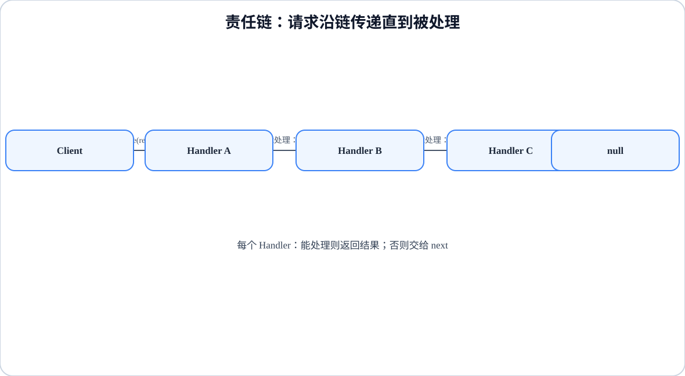

# 程序设计与软件设计｜14-责任链（Chain of Responsibility）

<!-- GFM-TOC -->
* [意图（Intent）](#意图intent)
* [结构（Structure）](#结构structure)
* [实现（Implementation）](#实现implementation)
* [适用条件与代价](#适用条件与代价)
* [Dart 标准库与生态映射](#dart-标准库与生态映射)
* [面试追问](#面试追问)
* [参考资料](#参考资料)
* [一句话总结](#一句话总结)
<!-- GFM-TOC -->

## 意图（Intent）

使多个对象都有机会处理请求，从而避免请求的发送者和接收者之间的耦合。把这些对象连成一条链，请求沿链传递，直到有一个对象处理它为止。

动机：审批、过滤、校验这类场景里，“该由谁处理”经常要到运行时才知道，而且规则会不断增加。如果在调用处写一长串 `if/else`，发送者就被迫认识所有处理者，每加一条规则都要改调用处。责任链把“处理”和“传递”拆开：每个节点只关心自己能不能处理，不能处理就把请求交给下一个节点。

## 结构（Structure）

<figure class="diagram-scroll"></figure>

- **Handler**：定义处理请求的接口，同时持有后继节点（successor）并负责转发。
- **ConcreteHandler**：只实现“我能处理吗”；不能处理就转给后继。
- **Client**：在装配阶段决定链的顺序，并发出请求。

请求沿链移动的规则由节点自己决定，Client 不需要知道最终是谁处理的。这也是它和“一堆 if/else”的本质区别：调用方只依赖 Handler 协议。

## 实现（Implementation）

以报销审批为例：200 元以内 TeamLead 批，2000 元以内 Manager 批，20000 元以内 Director 批，再高就驳回。

以下代码合起来是完整文件 `chain_of_responsibility.dart`。验证环境：Dart 3.12.2；`dart analyze` 无问题，`dart run --enable-asserts` 通过（Dart 默认不启用断言，运行带 `assert` 的示例时要显式开启）。

```dart
// 前置条件：Dart 3.x；纯 Dart；无第三方依赖。
typedef Request = ({int amount, String purpose});

abstract class Approver {
  const Approver(this.next);

  final Approver? next;

  /// 模板方法：先尝试自己审批，处理不了再转发给后继。
  String? handle(Request request) {
    if (request.amount < 0) {
      throw ArgumentError.value(request.amount, 'amount', '金额不能为负');
    }
    return decide(request) ?? next?.handle(request);
  }

  /// 返回审批结论；返回 null 表示“不归我管”。
  String? decide(Request request);
}

final class TeamLead extends Approver {
  const TeamLead(super.next);

  @override
  String? decide(Request request) =>
      request.amount <= 200 ? 'TeamLead 批准 ${request.amount} 元' : null;
}

final class Manager extends Approver {
  const Manager(super.next);

  @override
  String? decide(Request request) =>
      request.amount <= 2000 ? 'Manager 批准 ${request.amount} 元' : null;
}

final class Director extends Approver {
  const Director(super.next);

  @override
  String? decide(Request request) => request.amount <= 20000
      ? 'Director 批准 ${request.amount} 元'
      : '驳回 ${request.amount} 元（超预算）';
}
```

<!-- verify: .work/verify/D3/chain_of_responsibility.dart -->

要点：

- `decide` 返回 `String?`，`null` 被用作“不处理”的信号；转发由基类 `handle` 完成，子类不需要重复写 `if (next != null)`。
- `next?.handle(request)` 利用空安全：链尾的 `next` 是 `null`，请求自然结束，不需要哨兵节点。

```dart
/// 函数列表形态：链就是数据，顺序即优先级。
typedef Handler = String? Function(Request request);

String? runChain(List<Handler> handlers, Request request) {
  if (request.amount < 0) {
    throw ArgumentError.value(request.amount, 'amount', '金额不能为负');
  }
  for (final handler in handlers) {
    final result = handler(request);
    if (result != null) return result; // 第一个能处理的节点结束传递
  }
  return null;
}

void main() {
  // 1. 对象形态：手动组装链，规则分散在各节点内。
  const chain = TeamLead(Manager(Director(null)));
  assert(chain.handle((amount: 150, purpose: '打车')) == 'TeamLead 批准 150 元');
  assert(chain.handle((amount: 1500, purpose: '显示器')) == 'Manager 批准 1500 元');
  assert(chain.handle((amount: 9000, purpose: '团建')) == 'Director 批准 9000 元');
  assert(chain.handle((amount: 50000, purpose: '年会')) == '驳回 50000 元（超预算）');

  // 2. 函数列表形态：同一组规则，去掉 successor 字段。
  final handlers = <Handler>[
    (request) =>
        request.amount <= 200 ? 'TeamLead 批准 ${request.amount} 元' : null,
    (request) =>
        request.amount <= 2000 ? 'Manager 批准 ${request.amount} 元' : null,
    (request) => request.amount <= 20000
        ? 'Director 批准 ${request.amount} 元'
        : '驳回 ${request.amount} 元（超预算）',
  ];
  assert(
    runChain(handlers, (amount: 1500, purpose: '显示器')) == 'Manager 批准 1500 元',
  );
  assert(runChain(const [], (amount: 1, purpose: 'x')) == null); // 无人处理

  print(runChain(handlers, (amount: 50000, purpose: '年会')));
}
```

<!-- verify: .work/verify/D3/chain_of_responsibility.dart -->

Dart 里“每个节点一个类”不是必须的。责任链的本质是“处理 + 转交”的协议，而函数就是一等对象：把 handler 收进 `List<Handler>`，顺序变成数据，插拔节点只改列表。只有当节点需要持有状态、身份或依赖注入时，才有必要回到类形态。

另一个常见误区是把所有“链式处理”都叫责任链：如果每个节点都要执行并包裹同一个请求（比如常见的请求管道），请求并不会在某个节点中断，那更接近[装饰器模式](./10-装饰.md)，而不是责任链。

## 适用条件与代价

- 适用：有多个候选处理者、处理者在运行时决定、希望发送者与具体处理者解耦、链的顺序需要可配置。
- 代价：请求可能无人处理，链尾要么返回 `null`、要么抛出异常，接口必须把“未处理”说清楚；请求的流向分散在各节点里，调试时需要跟着链走；链越长，一次请求的转发开销越大。

## Dart 标准库与生态映射

- Dart 标准库没有责任链的同名实现。最接近的语言级写法就是本文的函数列表：`List<Handler>` 加一个顺序调用的驱动函数。
- 用 `null` 表示“未命中”是利用空安全把状态编码进类型；如果“未处理”属于调用方必须面对的异常情况，链尾直接 `throw` 更合适。
- `Future.then` 的链只是异步值的续接，不存在“能不能处理”的判定，不能等同于责任链。语言机制与 GoF 模式不是一回事。

## 面试追问

- 责任链和[装饰器](./10-装饰.md)怎么区分？前者在第一个能处理的节点中断，后者每个节点都执行并包裹同一请求。
- 链的顺序由谁决定？顺序变化会改变语义吗？
- 请求无人处理时返回 `null` 还是抛异常？
- 函数列表形态丢失了什么？（节点自身的状态、身份，以及动态插入节点的能力）
- 如何避免责任链退化成一条隐蔽的 `if/else`？

## 参考资料

- [R1] [官方文档] [Dart: Functions](https://dart.dev/language/functions) — Dart，[核查日期：2026-09]。
- [R2] [官方文档] [Dart: Patterns](https://dart.dev/language/patterns) — Dart，[核查日期：2026-09]。

## 一句话总结

> 责任链把候选处理者按顺序串起来，让请求在第一个能处理它的节点停止；链尾未处理和节点顺序必须成为显式契约。
