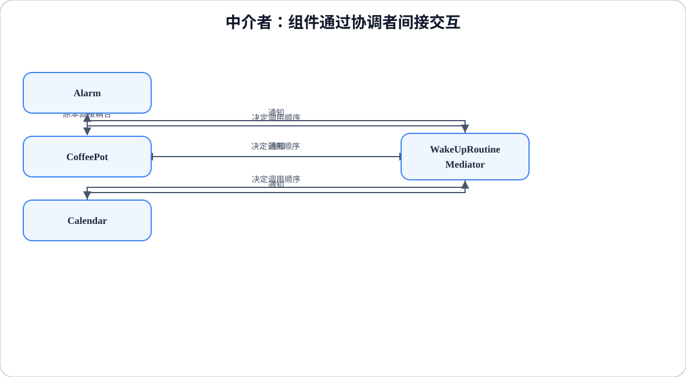

# 程序设计与软件设计｜18-中介者（Mediator）

<!-- GFM-TOC -->
* [意图（Intent）](#意图intent)
* [结构（Structure）](#结构structure)
* [实现（Implementation）](#实现implementation)
* [适用条件与代价](#适用条件与代价)
* [Dart 标准库与生态映射](#dart-标准库与生态映射)
* [面试追问](#面试追问)
* [参考资料](#参考资料)
* [小结](#小结)
<!-- GFM-TOC -->

## 意图（Intent）

用一个中介对象来封装一系列的对象交互。中介者使各对象不需要显式地相互引用，从而使其耦合松散，而且可以独立地改变它们之间的交互。

动机：起床流程里，闹钟响要启动咖啡机、刷新日历，日历新增会议又要影响咖啡量。如果让设备互相持有引用，三台设备之间很快出现多组双向关系；每加一台设备，连线按平方增长，任何一个设备的接口变化都会被其它设备的调用方感知。中介者把这些关系收进一个协调对象：设备只知道"我变化了要告诉谁"，至于先后顺序、判断条件、通知谁，集中在中介者一处维护。

## 结构（Structure）

<figure class="diagram-scroll"></figure>

- **Mediator**：声明同事上报变化的协议。本示例是「闹钟响了」`alarmRang()` 与「会议变了」`meetingAdded()` 两个领域方法。
- **ConcreteMediator（WakeUpRoutine）**：持有具体同事，集中编排协作的顺序与条件。
- **Colleague（Alarm / CoffeePot / Calendar）**：只认识 `Mediator` 接口，需要时上报；从不直接调用另一个同事。

依赖方向：同事 → `Mediator` 接口，具体中介者 → 具体同事。两个方向合起来是星形，同事之间没有引用边。

## 实现（Implementation）

下面把原例的闹钟、咖啡壶、日历、喷头缩成三台设备的明确交互：闹钟响时先刷新日历，再按当天有没有会议决定煮几杯；会议在闹钟已响期间新增时，杯数立刻重算。

以下两段合起来是完整文件 `mediator.dart`。验证环境：Dart 3.12.2；`dart analyze` 无问题，`dart run --enable-asserts` 通过。

```dart
// 前置条件：Dart 3.x；纯 Dart；无第三方依赖。
// 中介者：WakeUpRoutine 统一编排，三台设备互不引用。

abstract interface class Mediator {
  void alarmRang();
  void meetingAdded();
}

abstract class Colleague {
  Colleague(this.mediator);
  final Mediator mediator;
}

final class Alarm extends Colleague {
  Alarm(super.mediator);
  bool ringing = false;
  void ring() {
    ringing = true;
    mediator.alarmRang();
  }
}

final class CoffeePot extends Colleague {
  CoffeePot(super.mediator);
  int cups = 0;
}

final class Calendar extends Colleague {
  Calendar(super.mediator);
  final List<String> _meetings = [];
  bool shown = false;

  List<String> get meetings => List.unmodifiable(_meetings);

  void addMeeting(String title) {
    _meetings.add(title);
    mediator.meetingAdded();
  }
}

```

<!-- verify: .work/verify/D3b/mediator.dart -->

```dart
/// ConcreteMediator：协作顺序和条件判断集中在这里。
final class WakeUpRoutine implements Mediator {
  WakeUpRoutine() {
    alarm = Alarm(this);
    coffeePot = CoffeePot(this);
    calendar = Calendar(this);
  }
  late final Alarm alarm;
  late final CoffeePot coffeePot;
  late final Calendar calendar;

  @override
  void alarmRang() {
    calendar.shown = true; // 1. 先刷新日历
    coffeePot.cups = calendar.meetings.isEmpty ? 2 : 1; // 2. 再煮咖啡
  }

  @override
  void meetingAdded() {
    // 3. 只有闹钟已经响了，新增会议才需要调整杯数。
    if (alarm.ringing) coffeePot.cups = calendar.meetings.isEmpty ? 2 : 1;
  }
}

void main() {
  final routine = WakeUpRoutine();
  routine.calendar.addMeeting('09:00 站会');
  assert(routine.coffeePot.cups == 0); // 未响铃，不启动
  routine.alarm.ring();
  assert(routine.calendar.shown && routine.coffeePot.cups == 1);
  print(routine.coffeePot.cups);
}
```

<!-- verify: .work/verify/D3b/mediator.dart -->

要点：

- 上报入口是领域方法，而不是 `emit('alarm')` 或一张订阅表。这正是中介者与事件总线的关键差别：中介者知道协作协议，事件总线只负责转发，语义散落在各订阅方。
- 同事之间没有引用。`Calendar.addMeeting` 只调用 `mediator.meetingAdded()`；要不要改咖啡量、改成几杯，全由 `WakeUpRoutine` 决定。
- `meetingAdded` 里的 `if (alarm.ringing)` 是协作条件：没有它，初始化阶段添加会议就会意外启动咖啡机。示例开头先添加会议再断言 `cups == 0`，就是在验证这条规则。
- `WakeUpRoutine` 在构造器里创建同事并把 `this` 交给它们，`late final` 字段只是为了绕开"先有中介者还是先有同事"的初始化顺序。换一种装配方式也行，重要的是同事只依赖 `Mediator` 接口。

## 适用条件与代价

- 适用：一组同级对象之间关系复杂、交互规则会变、希望把协议集中到一处维护，或同事需要被独立复用时。
- 代价：中介者成为单点，规则持续堆积会退化成上帝对象；同事与中介者直接耦合，脱离中介者就难以复用；中介者调用同事的公开方法时可能触发反向通知，形成循环，需要在协议入口加状态判断来防重入。
- 如果对象之间只有一次性的单向调用，直接传引用或回调更简单，不必引入中介者。

## Dart 标准库与生态映射

- Dart 标准库没有 Mediator 的同名实现。
- `Stream` / `StreamController`、回调注册表、全局 event bus 都能"传递事件"，但它们不包含协作协议：事件发出后，响应逻辑仍散落在各订阅方，发布者也无法保证顺序与条件，把它们直接当 Mediator 会得到"谁都能发、谁都能收"的隐式耦合。
- 任务调度（延时、周期执行、线程池）和反射调用都不是中介者：前者决定“何时执行”，后者决定“怎么调用”，都不包含同事之间的协作协议。

## 面试追问

- 中介者和[观察者](./20-观察者.md)、事件总线怎么区分？观察者是一对多通知，主题不编排响应顺序；事件总线是发布/订阅的传输层；中介者集中了"接下来做什么"的协议。
- 中介者是消除了耦合，还是把耦合搬了家？它把同事之间的组合级依赖收敛成线性条数的上报关系，但中介者本身成了强耦合点，规模要靠拆分控制。
- 什么时候拆分中介者？当协作规则能按流程或领域分组、彼此不共享状态时，每个中介者只管一组相关同事。
- 循环通知怎么处理？在协议入口加状态判断（如本示例的 `alarm.ringing`），或设置显式防重入标志，避免通知链无限回环。

## 参考资料

- [R1] [官方文档] [Dart: Class modifiers — abstract interface](https://dart.dev/language/class-modifiers#abstract-interface) — Dart，[核查日期：2026-09]。
- [R2] [官方 API] [StreamController](https://api.dart.dev/dart-async/StreamController-class.html) — Dart，[核查日期：2026-09]。

## 小结

> 中介者把同事之间的协作协议集中到一个协调对象中，降低网状依赖；但中介者必须按流程或领域拆分，避免变成新的上帝对象。
