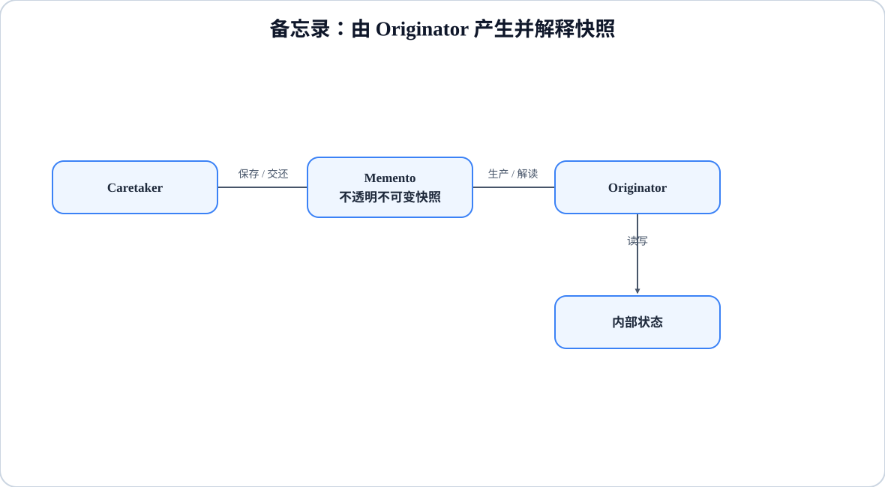

# 程序设计与软件设计｜19-备忘录（Memento）

<!-- GFM-TOC -->
* [意图（Intent）](#意图intent)
* [结构（Structure）](#结构structure)
* [实现（Implementation）](#实现implementation)
* [适用条件与代价](#适用条件与代价)
* [Dart 标准库与生态映射](#dart-标准库与生态映射)
* [面试追问](#面试追问)
* [参考资料](#参考资料)
* [小结](#小结)
<!-- GFM-TOC -->

## 意图（Intent）

在不违反封装的前提下，捕获一个对象的内部状态，并在该对象之外保存这个状态，以便以后可以将该对象恢复到原先保存的状态。

动机：撤销、草稿恢复、事务回滚都需要"回到之前的那一刻"。最直接的做法是把对象的字段全部公开，让外部自己拷贝一份；这会破坏封装，而且每加一个字段，所有拷贝代码都要跟着更新。备忘录把快照做成一个不透明值：Originator 自己生产、自己解读，Caretaker 只负责保管和交还，既不需要知道快照里有什么，也无权修改它。

## 结构（Structure）

<figure class="diagram-scroll"></figure>

- **Originator**：持有真实状态，`backup()` 生产快照，`restore()` 解读快照并写回状态。
- **Memento**：只保存状态；对外不暴露读写接口，由 Originator 解读。
- **Caretaker**：保存快照栈，只能原样入栈、出栈，不解读内容。

依赖方向：Caretaker → Memento 类型，Originator → Memento 与自身状态；Caretaker 不依赖 Originator 的内部字段，也不依赖快照的内部结构。

## 实现（Implementation）

下面复现原例的可观察流程：先算出 `10 + 100 = 110` 并保存，改成 `17 + (-290) = -273`，再撤销回 `110`。

以下两段合起来是完整文件 `memento.dart`。验证环境：Dart 3.12.2；`dart analyze` 无问题，`dart run --enable-asserts` 通过。

```dart
// 前置条件：Dart 3.x；纯 Dart；无第三方依赖。
// 备忘录：不透明快照 + Caretaker 只保管不解读。

/// 快照：字段私有、实例不可变，对 Caretaker 不暴露任何读取接口。
final class CalculationSnapshot {
  const CalculationSnapshot._(this._first, this._second);

  final int _first;
  final int _second;
}

/// Originator：真正持有状态，负责生产与解读快照。
final class Calculator {
  int first = 0;
  int second = 0;

  int get result => first + second;

  CalculationSnapshot backup() => CalculationSnapshot._(first, second);

  void restore(CalculationSnapshot snapshot) {
    // 1. 同一库内才能读到私有字段，这就是只给 Originator 的宽接口。
    first = snapshot._first;
    second = snapshot._second;
  }
}

/// Caretaker：只入栈、出栈，不关心快照内容。
final class Caretaker {
  final List<CalculationSnapshot> _undoStack = [];

  void save(CalculationSnapshot snapshot) => _undoStack.add(snapshot);

  CalculationSnapshot? undo() =>
      _undoStack.isEmpty ? null : _undoStack.removeLast();
}

```

<!-- verify: .work/verify/D3b/memento.dart -->

```dart
void main() {
  final calculator = Calculator();
  final caretaker = Caretaker();

  calculator.first = 10;
  calculator.second = 100;
  assert(calculator.result == 110);
  caretaker.save(calculator.backup()); // 2. 保存 110

  calculator.first = 17;
  calculator.second = -290;
  assert(calculator.result == -273);

  final snapshot = caretaker.undo();
  if (snapshot != null) {
    calculator.restore(snapshot); // 3. 恢复 110
  }
  assert(calculator.result == 110);
  assert(caretaker.undo() == null); // 栈空后没有可恢复状态

  print(calculator.result);
}
```

<!-- verify: .work/verify/D3b/memento.dart -->

要点：

- 快照字段全部 `final`、构造器私有：外部既不能修改快照，也拿不到读取方法。Caretaker 手里只有一个类型，这在编译期就阻止了它解读内容。
- Dart 的下划线可见性是**库级**的，不是 Java 的 package-private：`CalculationSnapshot._first` 在同一个库里的所有代码都能读。示例靠"只让 Originator 读"的约定扮演宽接口；要真正强制隔离，应把快照字段与解读逻辑放在同一库（可用 `library` + `part` 组织文件），对外只导出不透明的快照类型。仅把快照类放进另一个库文件，反而会让 Originator 也无法直接读取这些私有字段。
- 这是**全量快照**：两个 `int` 就是全部状态。如果状态里还有 `List` 之类的可变对象，`backup()` 时必须复制（例如 `List.of(items)` 或 `[...items]`），否则之后对原列表的修改会"穿透"到旧快照里，恢复出来的并不是当时的状态。
- `undo()` 在栈空时返回 `null`，而不是抛错；调用方必须先处理"没有可恢复状态"。栈本身也该设置深度上限，否则每次备份都占一份内存。
- 示例只保存了两个 `int`。真实对象要把构成状态的全部字段一起保存；只恢复一部分字段，会留下不满足不变量的中间状态。

## 适用条件与代价

- 适用：需要撤销、重做、回滚或恢复默认值，同时不希望暴露对象内部结构；状态规模可控、备份频率不高。
- 代价：每次备份都要复制状态，状态大或备份频繁时内存开销明显；快照数量需要上限；如果状态里混有可变对象，还必须明确做深拷贝；Caretaker 看不到内容，调试"恢复错了什么"时只能回到 Originator。
- 与[命令模式](./15-命令.md)的撤销对比：命令保存"操作"（或逆操作），备忘录保存"状态"。前者省内存但要求操作可逆，后者实现简单但快照昂贵。序列化、持久化与备忘录也不是同义词：序列化解决的是数据如何落盘或传输，备忘录解决的是运行期如何恢复。

## Dart 标准库与生态映射

- Dart 没有 `Memento`、`Object.clone` 之类的标准协议。Dart 3 的 record 或不可变 `final class` 都能承载快照值；本文用私有构造的类来体现"不透明"。
- 快照不一定要可序列化，可序列化的对象也不自动具备恢复语义：需要持久化时另配 JSON、二进制等序列化方案，但不要把"能序列化"当成"能安全恢复"。

## 面试追问

- 备忘录与[命令模式](./15-命令.md)的撤销有什么区别？备忘录存状态，命令存操作或逆操作；内存与可逆性的权衡不同。
- 深拷贝还是浅拷贝？取决于状态里有没有共享的可变对象；浅拷贝会让"恢复"变成"恢复引用"，快照与当前状态互相污染。
- 快照太大怎么办？只存差异（增量快照）、限制历史深度，或改用命令/事件溯源。
- 谁能读取快照？理想情况只有 Originator；Dart 用同一 library 的私有字段与对外导出边界表达这一点，跨文件时可用 `part` 组织同一库。
- Caretaker 能比较两个快照吗？只能比较引用，不能比较内容；两个快照是否相同、差在哪里，都由 Originator 决定是否暴露。
- 恢复之后还能继续撤销吗？这取决于 Caretaker 只维护历史栈，还是同时维护重做栈；本示例有意省略了重做方向。

## 参考资料

- [R1] [官方文档] [Dart: Libraries](https://dart.dev/language/libraries) — Dart，[核查日期：2026-09]。
- [R2] [官方文档] [Dart: Collections](https://dart.dev/language/collections) — Dart，[核查日期：2026-09]。

## 小结

> 备忘录由 Originator 生成和解读、Caretaker 只负责保存；它以快照成本换取封装不被撤销功能打穿。
