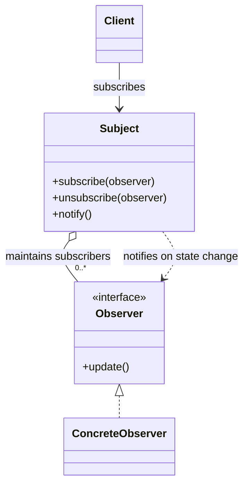

# 程序设计与软件设计｜20-观察者（Observer）

<!-- GFM-TOC -->
* [意图（Intent）](#意图intent)
* [结构（Structure）](#结构structure)
* [实现（Implementation）](#实现implementation)
  * [Stream：另一种一对多](#stream另一种一对多)
* [适用条件与代价](#适用条件与代价)
* [Dart 标准库与生态映射](#dart-标准库与生态映射)
* [面试追问](#面试追问)
* [参考资料](#参考资料)
* [小结](#小结)
<!-- GFM-TOC -->

## 意图（Intent）

定义对象之间的一对多依赖：当一个对象的状态改变时，所有依赖它的对象都会收到通知并自动更新。

动机：界面布告板、日志、缓存失效这些场景有一个共同点——数据源不知道也不该知道“谁在乎它变了”。如果在数据源里逐个调用下游，每加一个下游就要改数据源。观察者把“通知名单”从代码里搬到运行时：数据源只认识一个 Observer 协议，谁想收通知就订阅，不想收就取消。

## 结构（Structure）



- **Subject**：维护观察者名单，提供订阅与取消，状态变化时依次通知。
- **Observer**：只声明“收到通知”这一件事的协议。
- **ConcreteObserver**：自己决定收到通知后做什么，Subject 不关心。

依赖方向是 Subject → Observer 协议。ConcreteObserver 可以反向持有 Subject，但只能通过订阅接口操作，不能直接改它的内部名单。

## 实现（Implementation）

天气站的多个布告板要在读数变化时更新。以下两段代码合起来是完整文件 `observer_weather_station.dart`（第一段从文件开头到 `CallbackObserver` 结束，第二段是 `main`）。验证环境：Dart 3.12.2；`dart analyze` 无问题，`dart run --enable-asserts` 通过。

```dart
// 前置条件：Dart 3.12；纯 Dart；无第三方依赖。
// 天气站示例：主题维护观察者名单，subscribe() 返回取消函数。

/// 一次天气测量：不可变载荷，观察者之间不会互相篡改。
typedef WeatherReading = ({
  double temperature,
  double humidity,
  double pressure,
});

/// 观察者协议：只声明“收到新读数”这一件事。
abstract interface class WeatherObserver {
  void update(WeatherReading reading);
}

typedef Unsubscribe = void Function();

final class WeatherStation {
  final List<WeatherObserver> _observers = [];

  Unsubscribe subscribe(WeatherObserver observer) {
    _observers.add(observer);
    var active = true;
    return () {
      if (active) {
        active = false;
        _observers.remove(observer);
      }
    };
  }

  void setMeasurements(WeatherReading reading) {
    // 1. 在快照上迭代：update() 里可以安全地订阅或退订。
    for (final observer in List<WeatherObserver>.of(_observers)) {
      observer.update(reading);
    }
  }
}

final class Display implements WeatherObserver {
  final List<String> lines = [];

  @override
  void update(WeatherReading reading) => lines.add('${reading.temperature}°C');
}

final class StatisticsDisplay implements WeatherObserver {
  final List<double> _temperatures = [];
  Unsubscribe? stop;

  int get updateCount => _temperatures.length;

  @override
  void update(WeatherReading reading) {
    _temperatures.add(reading.temperature);
    if (_temperatures.length == 2) {
      stop?.call(); // 2. 通知中退订：本次仍收到，之后不再收到
    }
  }
}

/// 把回调适配成观察者，用于演示“通知过程中新增观察者”。
final class CallbackObserver implements WeatherObserver {
  const CallbackObserver(this.onUpdate);

  final void Function(WeatherReading reading) onUpdate;

  @override
  void update(WeatherReading reading) => onUpdate(reading);
}

```

<!-- verify: .work/verify/D4b/observer_weather_station.dart -->

```dart
void main() {
  final station = WeatherStation();
  final display = Display();
  final statistics = StatisticsDisplay();
  final late = Display();

  station.subscribe(display);
  statistics.stop = station.subscribe(statistics);

  // 3. 第一轮：两个观察者同时收到 20°C。
  station.setMeasurements((temperature: 20, humidity: 55, pressure: 1013));
  assert(display.lines.join('|') == '20.0°C');

  // 4. 第二轮：统计板在 update() 里退订，本次仍能收到。
  station.setMeasurements((temperature: 22, humidity: 60, pressure: 1010));
  assert(statistics.updateCount == 2);

  // 5. 通知过程中插入的观察者看不到本次读数，只从下一次开始收。
  var installed = false;
  station.subscribe(
    CallbackObserver((reading) {
      if (!installed) {
        installed = true;
        station.subscribe(late);
      }
    }),
  );
  station.setMeasurements((temperature: 24, humidity: 65, pressure: 1008));
  assert(late.lines.isEmpty);
  station.setMeasurements((temperature: 26, humidity: 70, pressure: 1005));
  assert(late.lines.join('|') == '26.0°C');

  print(display.lines.join('\n'));
}
```

<!-- verify: .work/verify/D4b/observer_weather_station.dart -->

要点：

- `subscribe()` 返回的 `Unsubscribe` 是一等函数，退订不需要观察者保存自己的引用来做身份比较。
- `setMeasurements` 在 `List.of` 快照上迭代。观察者如果在 `update()` 里退订自己，当前这一次仍然收到、之后不再收到；在通知过程中新订阅的观察者看不到本次读数——通知名单在广播开始时就已经确定。
- 读数用 record 承载，本身就是不可变值，不存在观察者互相篡改共享状态的入口。

### Stream：另一种一对多

Dart 标准库已经把异步事件序列抽象成 `Stream`，用 `StreamController` 同样能表达一对多通知，而且 `listen()` 返回的 `StreamSubscription` 就是可取消的凭据：

```dart
// 前置条件：Dart 3.12；纯 Dart；无第三方依赖。
// 广播流对照：listen() 返回 StreamSubscription，cancel() 即退订。

import 'dart:async';

Future<void> pump() => Future<void>.delayed(Duration.zero);

Future<void> main() async {
  final controller = StreamController<int>.broadcast();
  final log = <String>[];
  final errors = <Object>[];

  final subscriptionA = controller.stream.listen((value) => log.add('A$value'));
  controller.add(1);
  await pump();

  // 1. 新订阅者收不到历史事件：广播流不缓存旧值。
  final subscriptionB = controller.stream.listen(
    (value) => log.add('B$value'),
    onError: (Object error) => errors.add(error),
    onDone: () => log.add('B-done'),
  );
  controller.add(2);
  await pump();

  // 2. 取消订阅后不再收到事件。
  await subscriptionA.cancel();
  controller.add(3);
  await pump();

  // 3. 错误经 onError 独立到达监听者，不会混进正常事件。
  controller.addError(const FormatException('sensor offline'));
  await pump();

  await controller.close();
  await pump();

  assert(log.join(' ') == 'A1 A2 B2 B3 B-done', '实际顺序：${log.join(' ')}');
  assert(errors.single is FormatException);
  await subscriptionB.cancel();

  print(log.join(' '));
}
```

<!-- verify: .work/verify/D4b/observer_broadcast_stream.dart -->

对照要点：

- `StreamSubscription.cancel()` 等价于退订；`onError`、`onDone` 让“失败”和“结束”有独立通道，同步 Observer 接口要自己发明这些信号。
- broadcast 流不缓存历史事件：后来者收不到订阅前的数据，和上面 `late` 观察者的语义一致。
- 默认的 broadcast 流异步投递事件（代码里的 `pump()` 等一次事件循环再断言）；需要同步投递时用 `StreamController.broadcast(sync: true)`。`Stream` 不等于 GoF 观察者：它是库 API，不要求存在“主题对象”或订阅名单，订阅人数、错误处理、取消时机都要重新定义清楚。

## 适用条件与代价

- 适用：一个数据源、多个下游；订阅者在运行时增删；下游之间互不认识。
- 代价：Subject 持有观察者的强引用，忘了取消订阅就是内存泄漏的经典来源；通知顺序、通知期间能否改名单必须有明确约定；同步广播会在数据源的一次调用里串行执行所有观察者。
- 观察者（直接订阅）和发布-订阅（经消息中间件/事件总线）不是一回事：前者 Subject 认识 Observer 协议，后者双方只认识频道。需要集中协调多个同级对象的协作协议时，更适合[中介者](./18-中介者.md)；观察者里的 Subject 只广播，不做决策。

## Dart 标准库与生态映射

- `Stream`/`StreamController`：语义最接近的库机制，但它是异步事件流；single-subscription 流只允许一个监听者，broadcast 流才允许一对多。
- Flutter 生态的 `Listenable`/`ChangeNotifier` 也是观察者：`addListener`/`removeListener` 成对使用，通知粒度是整个对象而不是某个字段。代价与本文一致——监听者必须 `dispose`，否则对象销毁后仍被引用。
- Dart 标准库没有与 GoF Subject/Observer 同名的一对多实现，本文的示例就是最小实现。

## 面试追问

- 观察者和发布-订阅的差别是什么？
- 通知过程中取消订阅或新增订阅，应该以哪一刻的名单为准？
- 观察者模式的内存泄漏通常从哪里来？
- 广播流会不会缓存最后值？同步通知和异步通知各有什么风险？

## 参考资料

- [R1] [官方 API] [Dart: Stream](https://api.dart.dev/dart-async/Stream-class.html) — Dart，[核查日期：2026-09]。
- [R2] [官方 API] [StreamController.broadcast](https://api.dart.dev/dart-async/StreamController/StreamController.broadcast.html) — Dart，[核查日期：2026-09]。

## 小结

> 观察者把一对多通知与订阅生命周期分开管理；通知时机、名单变更和取消语义必须明确，否则异步更新与内存泄漏会变成隐患。
