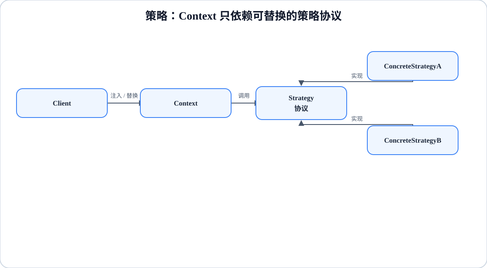

# 程序设计与软件设计｜22-策略（Strategy）

<!-- GFM-TOC -->
* [意图（Intent）](#意图intent)
* [结构（Structure）](#结构structure)
* [实现（Implementation）](#实现implementation)
* [适用条件与代价](#适用条件与代价)
* [Dart 标准库与生态映射](#dart-标准库与生态映射)
* [面试追问](#面试追问)
* [参考资料](#参考资料)
* [小结](#小结)
<!-- GFM-TOC -->

## 意图（Intent）

定义一系列算法，把它们分别封装起来，并使它们可以互相替换；算法的变化独立于使用它的客户端。

动机：结算要支持满减、打折、包邮门槛，排序要支持按名称、按价格、按更新时间。把算法都塞进一个方法里，每加一种就多一段 `switch`，而且编译器无法帮你检查新增的分支。策略模式把“怎么算”变成一个可以注入、可以替换的值。

## 结构（Structure）

<figure class="diagram-scroll"></figure>

- **Strategy**：算法族共同遵守的协议；在 Dart 里，无状态算法就是一个函数类型。
- **ConcreteStrategy**：具体算法，可以自带配置或依赖。
- **Context**：持有策略并调用它，不知道具体算法是谁。

## 实现（Implementation）

以下两段代码合起来是完整文件 `strategy_checkout.dart`（第一段到 `Checkout` 结束，第二段从 `main` 开始）。验证环境：Dart 3.12.2；`dart analyze` 无问题，`dart run --enable-asserts` 通过。

```dart
// 前置条件：Dart 3.12；纯 Dart；无第三方依赖。
// 结算：折扣策略用函数注入；需要配置的策略用对象表达。

/// 无状态策略：一次计算进、一次结果出，函数就是最轻的实现。
typedef DiscountPolicy = double Function(double subtotal);

double noDiscount(double subtotal) => subtotal;

double halfOff(double subtotal) => subtotal * 0.5;

/// 有配置的策略：税率是策略实例自身携带的状态。
abstract interface class TaxStrategy {
  double apply(double amount);
}

final class NoTax implements TaxStrategy {
  const NoTax();

  @override
  double apply(double amount) => amount;
}

final class PercentageTax implements TaxStrategy {
  PercentageTax(double rate) : rate = _requireRate(rate);

  static double _requireRate(double value) {
    if (value < 0 || value > 1) {
      throw ArgumentError.value(value, 'rate', '税率必须在 0 到 1 之间');
    }
    return value;
  }

  final double rate;

  @override
  double apply(double amount) => amount * (1 + rate);
}

/// Comparator 契约：负数排在前面，0 表示相等，正数排在后面。
int byLengthThenAlphabet(String a, String b) {
  final byLength = a.length.compareTo(b.length);
  return byLength != 0 ? byLength : a.compareTo(b);
}

/// Context：只依赖两个策略协议，不认识任何具体算法。
final class Checkout {
  Checkout({this.discount = noDiscount, this.tax = const NoTax()});

  DiscountPolicy discount;
  TaxStrategy tax;

  double total(List<double> prices) {
    final subtotal = prices.fold(0.0, (sum, price) => sum + price);
    return tax.apply(discount(subtotal));
  }
}

```

<!-- verify: .work/verify/D4b/strategy_checkout.dart -->

```dart
void main() {
  final cart = <double>[120, 90];

  // 1. 同一个 Checkout，替换函数策略即可切换折扣算法。
  final checkout = Checkout(discount: halfOff);
  assert(checkout.total(cart) == 105); // (120 + 90) * 0.5

  checkout.discount = noDiscount;
  assert(checkout.total(cart) == 210);

  // 2. 需要配置的策略换成对象，参数随实例保存。
  final withTax = Checkout(
    discount: noDiscount,
    tax: PercentageTax(0.08),
  );
  assert((withTax.total(cart) - 226.8).abs() < 1e-9);

  // 3. Comparator<T> 就是策略协议：排序算法固定，比较方式可替换。
  final words = <String>['pear', 'fig', 'apple'];
  words.sort(byLengthThenAlphabet);
  assert(words.join(',') == 'fig,pear,apple');

  print('${checkout.total(cart)}, ${withTax.total(cart)}');
}
```

<!-- verify: .work/verify/D4b/strategy_checkout.dart -->

要点：

- 无状态策略直接写 `typedef DiscountPolicy = double Function(double subtotal)`，顶层函数、闭包、方法 tear-off 都能满足它，不需要为一次计算建单方法类。
- 有配置的策略才值得建类：`PercentageTax` 把税率保存在实例里，创建一次、复用多次，也方便替换成测试替身。
- `Checkout` 用命名参数注入策略并给默认值，调用方决定初始算法，也能在运行期替换 `discount`。

## 适用条件与代价

- 适用：同一接口下有多种可互换算法；算法需要在运行期切换；算法各自需要独立测试或独立演化。
- 代价：客户端必须认识并选择具体策略；策略数量增长时可能类爆炸；如果 Context 只有一种固定算法，注入函数就够了，不必留可替换字段。
- 与[状态](./21-状态.md)的辨析：两者都把行为放进可替换对象里。策略的替换权在调用方，算法之间一般不知道彼此；状态的迁移由状态自己在处理事件时触发，当前状态决定下一个状态。判断标准是“谁来决定换行为”。

## Dart 标准库与生态映射

- `Comparator<T>` 就是标准库里的策略协议：`int Function(T, T)`，返回负数表示排在前面、0 表示相等、正数表示排在后面。`List.sort` 接收它，排序算法固定、比较方式由调用方提供。
- `List.sort` 不保证稳定：两个元素比较结果为 0 时，相对顺序没有承诺。需要稳定结果时，把原始下标或第二关键字写进比较器。
- `Iterable` 的 `where/map/fold` 参数也都是函数对象，属于同一类“把行为当参数”的机制。语言机制不等于 GoF 策略：它们不强制存在 Context 或策略协议。
- `Comparator` 上能直接看出策略与[命令](./15-命令.md)的差别：比较器封装“怎么比”，命令封装“要做什么”，后者可以排队、撤销、记录。与[模板方法](./23-模板方法.md)相比，策略替换的是整段算法，模板方法只替换流程中的步骤。

## 面试追问

- 策略和状态的边界在哪里？为什么要强调“谁来替换”？
- 什么时候函数就够了，什么时候必须建策略对象？
- 策略的错误和副作用由谁负责？怎样测试策略？
- `Comparator` 的返回值契约是什么？`List.sort` 稳定吗？
- 为什么说“函数是一等对象”会显著简化策略？

## 参考资料

- [R1] [官方文档] [Dart: Functions](https://dart.dev/language/functions) — Dart，[核查日期：2026-09]。
- [R2] [官方 API] [List.sort](https://api.dart.dev/dart-core/List/sort.html) — Dart，[核查日期：2026-09]。

## 小结

> 策略把可替换的整段算法作为依赖注入；无状态且只有一个操作时函数就够，有配置、身份或生命周期时再升级为对象。
