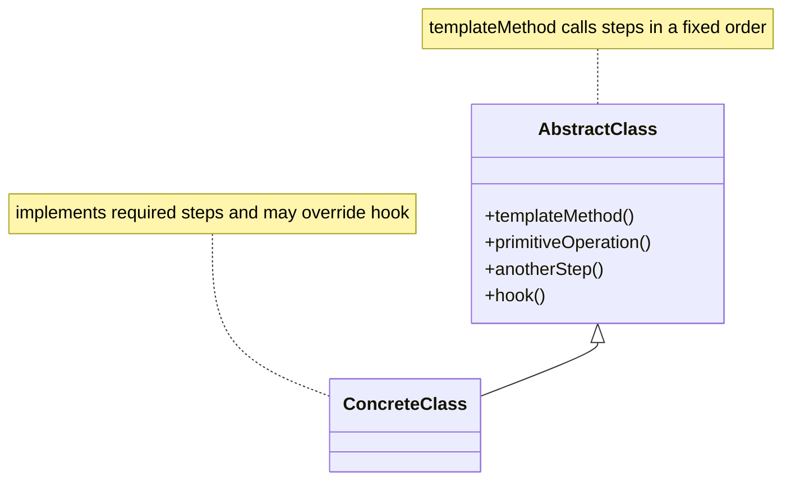

# 程序设计与软件设计｜23-模板方法（Template Method）

<!-- GFM-TOC -->
* [意图（Intent）](#意图intent)
* [结构（Structure）](#结构structure)
* [实现（Implementation）](#实现implementation)
* [适用条件与代价](#适用条件与代价)
* [Dart 标准库与生态映射](#dart-标准库与生态映射)
* [面试追问](#面试追问)
* [参考资料](#参考资料)
* [小结](#小结)
<!-- GFM-TOC -->

## 意图（Intent）

在一个方法里定义算法的骨架，把一些步骤延迟到子类实现；子类可以重定义某些步骤，但不改变算法的结构。

动机：冲咖啡和冲茶只差两步——泡什么、加什么调料——但“烧水、冲泡、倒杯、加调料”的顺序是一样的。与其在两个类里各写一遍流程，不如把顺序固定在基类，把差异点声明成抽象步骤。

## 结构（Structure）



- **AbstractClass**：定义模板方法和抽象步骤，可提供 hook。
- **ConcreteClass**：实现抽象步骤，按需覆盖 hook。

## 实现（Implementation）

以下两段代码合起来是完整文件 `template_method_beverage.dart`（第一段到 `RogueDrink` 结束，第二段从组合替代函数开始）。验证环境：Dart 3.12.2；`dart analyze` 无问题，`dart run --enable-asserts` 通过。

```dart
// 前置条件：Dart 3.12；纯 Dart；无第三方依赖。
// 饮品制作：模板方法固定流程，抽象步骤与 hook 由子类定制。

/// 抽象基类：prepareRecipe 是算法骨架，brew 与 addCondiments 是必填步骤。
abstract base class CaffeineBeverage {
  /// 模板方法：流程顺序写在这里，子类只提供各步骤的实现。
  List<String> prepareRecipe() {
    final steps = <String>['烧水', brew(), '倒进杯子'];
    if (wantCondiments()) {
      steps.add(addCondiments());
    }
    return steps;
  }

  String brew();

  String addCondiments();

  /// hook：默认加调料，子类可以覆盖它来改变流程分支。
  bool wantCondiments() => true;
}

base class Coffee extends CaffeineBeverage {
  @override
  String brew() => '冲咖啡粉';

  @override
  String addCondiments() => '加糖和牛奶';
}

final class Tea extends CaffeineBeverage {
  @override
  String brew() => '泡茶叶';

  @override
  String addCondiments() => '加柠檬';
}

/// 用 hook 改变流程分支：黑咖啡跳过加调料。
final class BlackCoffee extends Coffee {
  @override
  bool wantCondiments() => false;
}

/// 同一库内的子类仍然可以覆盖模板方法：类修饰符管不到单个方法。
final class RogueDrink extends CaffeineBeverage {
  @override
  List<String> prepareRecipe() => ['直接倒冷水'];

  @override
  String brew() => '冲咖啡粉';

  @override
  String addCondiments() => '加糖';
}

```

<!-- verify: .work/verify/D4b/template_method_beverage.dart -->

```dart
/// 组合替代：步骤作为函数注入，流程骨架固定在一个不可覆盖的函数里。
List<String> prepareRecipe({
  required String Function() brew,
  required String Function() addCondiments,
  bool wantCondiments = true,
}) {
  final steps = <String>['烧水', brew(), '倒进杯子'];
  if (wantCondiments) {
    steps.add(addCondiments());
  }
  return steps;
}

void main() {
  // 1. 两个子类复用同一骨架，只替换步骤。
  final coffee = Coffee().prepareRecipe();
  assert(coffee.join(' -> ') == '烧水 -> 冲咖啡粉 -> 倒进杯子 -> 加糖和牛奶');

  final tea = Tea().prepareRecipe();
  assert(tea.join(' -> ') == '烧水 -> 泡茶叶 -> 倒进杯子 -> 加柠檬');

  // 2. hook 分支：黑咖啡不执行 addCondiments。
  final black = BlackCoffee().prepareRecipe();
  assert(black.join(' -> ') == '烧水 -> 冲咖啡粉 -> 倒进杯子');

  // 3. 覆盖模板方法本身，骨架就失效了——继承保护不了算法结构。
  final rogue = RogueDrink().prepareRecipe();
  assert(rogue.join(' -> ') == '直接倒冷水');

  // 4. 组合版：同样的骨架，改成注入步骤函数。
  final latte = prepareRecipe(brew: () => '萃取浓缩', addCondiments: () => '加入蒸奶');
  assert(latte.length == 4);
  final espresso = prepareRecipe(
    brew: () => '萃取浓缩',
    addCondiments: () => '不加',
    wantCondiments: false,
  );
  assert(espresso.length == 3);

  print(coffee.join(' -> '));
  print(black.join(' -> '));
}
```

<!-- verify: .work/verify/D4b/template_method_beverage.dart -->

要点：

- `prepareRecipe` 是模板方法，`brew`/`addCondiments` 是抽象步骤，`wantCondiments` 是 hook：有默认实现，子类可以覆盖它来改变流程分支。
- `RogueDrink` 演示了一个必须说清的事实：Dart 没有 Java 那种给单个方法加 `final` 的语法。`base` 只约束库外的继承方式——库外不能 `implement`，`extend` 出的子类也必须是 `base`/`final`/`sealed`——管不到库内子类对某个方法的覆盖；同库的 `RogueDrink` 直接覆盖了 `prepareRecipe`，骨架就失效了。
- 如果算法结构真的不能被改动，组合比继承更可靠：把步骤作为函数注入（第二段的 `prepareRecipe`），骨架是顶层函数，根本不存在“被覆盖”的入口。

## 适用条件与代价

- 适用：多个类共享同一套流程，只有少数步骤不同；流程顺序是稳定的不变量。
- 代价：继承把子类和基类绑在一起，步骤增加会波及所有子类；“子类能覆盖什么”靠约定而不是编译器强制。
- 与[策略](./22-策略.md)的辨析：模板方法用**继承**固定骨架、替换步骤；策略用**组合**替换整个算法。流程固定选模板方法，整段算法可互换选策略。

## Dart 标准库与生态映射

- Dart 标准库没有与模板方法同名的 API。更常见的替代是“把步骤作为参数的高阶函数”，本文第二段就是这个方向。
- `dart:collection` 里的 `ListMixin` 一类混入提供另一种“填几个成员就获得整套行为”的复用方式，但它复用的是接口实现，不是可覆写的模板流程。

## 面试追问

- 模板方法和策略的区别？
- hook 和抽象步骤的差别是什么？
- 继承在这里带来了什么耦合？
- Dart 能保证模板方法不被覆盖吗？如果不能，怎样保护算法骨架？

## 参考资料

- [R1] [官方文档] [Dart: Class modifiers](https://dart.dev/language/class-modifiers) — Dart，[核查日期：2026-09]。
- [R2] [官方文档] [Dart: Mixins](https://dart.dev/language/mixins) — Dart，[核查日期：2026-09]。

## 小结

> 模板方法用继承固定算法骨架、把少数步骤交给子类；若骨架必须不可覆盖，函数组合比继承更可靠。
