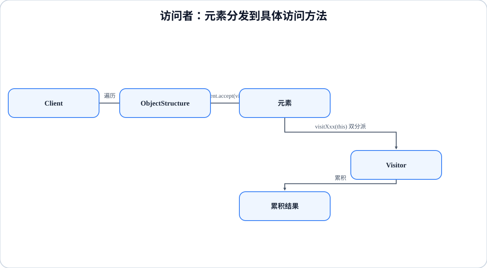

# 程序设计与软件设计｜24-访问者（Visitor）

<!-- GFM-TOC -->
* [意图（Intent）](#意图intent)
* [结构（Structure）](#结构structure)
* [实现（Implementation）](#实现implementation)
  * [sealed 替代版本](#sealed-替代版本)
* [适用条件与代价](#适用条件与代价)
* [Dart 标准库与生态映射](#dart-标准库与生态映射)
* [面试追问](#面试追问)
* [参考资料](#参考资料)
* [小结](#小结)
<!-- GFM-TOC -->

## 意图（Intent）

表示一个作用于某对象结构中各元素的操作；它使你可以在不改变各元素类的前提下定义作用于这些元素的新操作。动机：文档由段落、图片等元素组成，统计字数、导出 Markdown、检查拼写是三种完全不同的操作；如果把它们都塞进元素类，每加一种操作都要把所有元素改一遍。访问者把“操作”抽成对象，让元素只保留 `accept`。

## 结构（Structure）

<figure class="diagram-scroll"></figure>

- **Element**：声明 `accept(visitor)`；**ConcreteElement** 实现它并把 `this` 交给访问者。
- **Visitor**：为每种元素声明一个访问方法（Dart 没有重载，方法名不能相同）。
- **ConcreteVisitor**：实现各访问方法，通常持有累积状态或返回结果。

一次调用发生两次分派：`element.accept(visitor)` 先按元素的实际类型选中元素方法，方法体内再按访问者的实际类型选中 `visitXxx`。

## 实现（Implementation）

以下两段代码合起来是完整文件 `visitor_document.dart`（第一段到 `WordCountVisitor` 结束，第二段从 `main` 开始）。验证环境：Dart 3.12.2；`dart analyze` 无问题，`dart run --enable-asserts` 通过。

```dart
// 前置条件：Dart 3.12；纯 Dart；无第三方依赖。
// 文档结构 + 访问者：accept 负责双分派，visitXxx 承载新操作。

/// 元素协议：accept 把“我是谁”告诉访问者，由访问者决定做什么。
abstract interface class DocumentElement {
  T accept<T>(DocumentVisitor<T> visitor);
}

/// 访问者协议：Dart 没有方法重载，每种元素对应一个独立命名的方法。
abstract interface class DocumentVisitor<T> {
  T visitParagraph(Paragraph paragraph);

  T visitImage(Image image);
}

final class Paragraph implements DocumentElement {
  const Paragraph(this.text);

  final String text;

  @override
  T accept<T>(DocumentVisitor<T> visitor) => visitor.visitParagraph(this);
}

final class Image implements DocumentElement {
  const Image(this.alt);

  final String alt;

  @override
  T accept<T>(DocumentVisitor<T> visitor) => visitor.visitImage(this);
}

/// 访问者：统计正文字数，图片不贡献字数。
final class WordCountVisitor implements DocumentVisitor<int> {
  const WordCountVisitor();

  @override
  int visitParagraph(Paragraph paragraph) => paragraph.text
      .split(RegExp(r'\s+'))
      .where((word) => word.isNotEmpty)
      .length;

  @override
  int visitImage(Image image) => 0;
}

```

<!-- verify: .work/verify/D4b/visitor_document.dart -->

```dart
void main() {
  const document = <DocumentElement>[
    Paragraph('dart is a typed language'),
    Image('logo'),
    Paragraph('visitors add operations without editing elements'),
  ];

  // 1. 双分派：element.accept 决定调用哪个 visitXxx。
  const visitor = WordCountVisitor();
  final words = document.fold(
    0,
    (sum, element) => sum + element.accept(visitor),
  );
  assert(words == 11);
  print('总字数：$words');
}
```

<!-- verify: .work/verify/D4b/visitor_document.dart -->

要点：

- 访问者协议用泛型 `DocumentVisitor<T>`，同一个结构可以产出 `int` 字数，也可以产出 `String` 导出结果，不必强转。
- Dart 的方法不能重载，所以 Java 版 `visit(Customer)`/`visit(Order)` 那种写法在这里要改成不同名字的 `visitParagraph`/`visitImage`。
- `accept` 里没有业务逻辑，它只负责回答“我是谁”；新增操作只需要新增一个 Visitor 实现。

### sealed 替代版本

元素类型封闭时，Dart 的模式匹配可以把操作直接写在类型外面，不必给每个元素加 `accept`：

```dart
// 前置条件：Dart 3.12；纯 Dart；无第三方依赖。
// 封闭节点族的替代：节点是 sealed 类型，操作用穷尽 switch 写在类型外面。

sealed class Node {
  const Node();
}

final class TextNode extends Node {
  const TextNode(this.text);

  final String text;
}

final class ImageNode extends Node {
  const ImageNode({required this.alt, required this.src});

  final String alt;
  final String src;
}

/// 操作 1：统计字数。
int countWords(Node node) => switch (node) {
  TextNode(:final text) =>
    text.split(RegExp(r'\s+')).where((word) => word.isNotEmpty).length,
  ImageNode() => 0,
};

/// 操作 2：导出 Markdown。
String toMarkdown(Node node) => switch (node) {
  TextNode(:final text) => text,
  ImageNode(:final alt, :final src) => '',
};

void main() {
  const nodes = <Node>[
    TextNode('dart is a typed language'),
    ImageNode(alt: 'logo', src: 'logo.png'),
  ];

  assert(nodes.fold(0, (sum, node) => sum + countWords(node)) == 5);
  assert(toMarkdown(nodes.last) == '');

  // 新增 CodeNode 等节点类型时，上面的 switch 会编译报错，
  // 编译器逼着每个操作补全分支——封闭层次下的穷尽检查。
  print(nodes.map(toMarkdown).join('\n'));
}
```

<!-- verify: .work/verify/D4b/visitor_sealed_nodes.dart -->

- **取舍**——访问者版本：新增操作 = 新增 Visitor，元素类不动；新增元素类型 = 改所有 Visitor。
- sealed 版本：新增操作 = 新增一个函数（像 `countWords` 那样），元素类型不动；新增元素类型 = 所有 `switch` 编译报错，迫使每个操作补分支。
- 访问者把“操作”集中进类，适合需要累积状态、依赖注入或复用一次遍历的操作；sealed 版本更轻，适合封闭层次且操作多为纯函数的场景。

## 适用条件与代价

- 适用：对象结构稳定，操作经常新增；操作需要跨多个元素累积结果。
- 代价：新增元素类型昂贵（所有 Visitor 都要改）；Visitor 常常需要读取元素数据，等于把元素的封装打开。
- 与[解释器](./16-解释器.md)、[组合](./09-组合.md)的关系：它们经常配合使用——结构用组合树表达，遍历行为用访问者挂着；解释器的 AST 节点也常提供 `accept`。

## Dart 标准库与生态映射

- Dart 标准库没有 Visitor 对应物；`sealed` 加穷尽 `switch` 是封闭层次的更轻替代。

## 面试追问

- 双分派是什么？Dart 里怎样实现？新增操作和新增元素，哪种改动更便宜？
- 访问者需要访问元素的私有数据时怎么办？
- 访问者和解释器、组合是什么关系？元素层次对库外开放时还能用吗？

## 参考资料

- [R1] [官方文档] [Dart: Class modifiers — sealed](https://dart.dev/language/class-modifiers#sealed) — Dart，[核查日期：2026-09]。
- [R2] [官方文档] [Dart: Patterns](https://dart.dev/language/patterns) — Dart，[核查日期：2026-09]。

## 小结

> 访问者把新增操作集中到 Visitor，通过 `accept` + `visitXxx` 实现双分派；它用新增元素类型的成本换取新增操作的便利。
