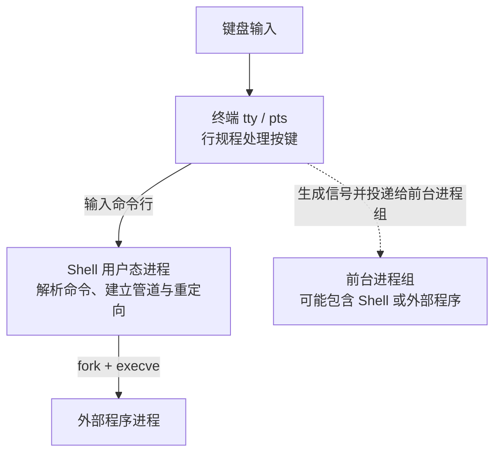

# 工程工具与代码质量｜01-Linux 命令行与进程排查

线上服务突然 502，你拿到一台 SSH 会话：服务进程还在不在、监听的是不是那个端口、日志最后一行写了什么、磁盘是不是满了。这些问题的共同点是——可用的只有命令行。许多图形界面操作都有命令行入口；反过来不成立，这也是它值得单独学一遍的原因。

真正的门槛在于建立一张"问题 → 观察点 → 命令"的映射，而不是背下多少命令：端口不通先看进程和监听，进程卡住先看状态字母和它在等什么，系统变慢先分清楚是 CPU、内存还是 I/O。只背 `ps aux | grep xxx` 的人，遇到 `D` 状态或僵尸进程就会卡住，因为那条命令回答不了"它在等什么"。

本文把命令按可观察问题组织：先划清终端、Shell 与命令的边界，再沿"找帮助 → 看权限 → 操作文件与链接 → 组合管道 → 定位进程与端口 → 排查资源"这条线路推进。进程调度、虚拟内存、文件系统原理由操作系统板块主讲，本文只保留操作侧的必要结论和跳转入口。

> 文中带输出的命令示例在 GNU/Linux 环境验证；`ss`、`lsof`、`journalctl`、`systemctl`、`zstd` 等工具可能需要另行安装，相关段落按对应手册说明书写，不附输出示例。命令选项的 GNU/BSD 差异以本机 `man` 与 `--help` 为准，不要把示例输出中的 PID、时间和发行版默认值当成固定结果。

<!-- GFM-TOC -->
* [终端、Shell 与命令的边界](#终端shell-与命令的边界)
* [先查手册，再敲命令](#先查手册再敲命令)
    * [man 的分区编号](#man-的分区编号)
    * [GNU 与 BSD 的选项差异](#gnu-与-bsd-的选项差异)
* [路径、PATH 与退出码](#路径path-与退出码)
* [权限位、umask 与 sudo 的边界](#权限位umask-与-sudo-的边界)
    * [三组身份与 rwx 的含义](#三组身份与-rwx-的含义)
    * [umask 是创建时刻的减法](#umask-是创建时刻的减法)
    * [sudo 提升的是一条命令](#sudo-提升的是一条命令)
* [文件与目录：把观察和修改分开](#文件与目录把观察和修改分开)
* [硬链接与符号链接的操作侧视角](#硬链接与符号链接的操作侧视角)
* [压缩与归档：打包不等于压缩](#压缩与归档打包不等于压缩)
* [包管理：先认发行版家族](#包管理先认发行版家族)
* [重定向与管道：连接的是 fd，不是文本](#重定向与管道连接的是-fd不是文本)
    * [重定向顺序为什么重要](#重定向顺序为什么重要)
    * [管道只连接 stdout](#管道只连接-stdout)
* [文本处理最小组合：grep、cut、sort、uniq、awk](#文本处理最小组合grepcutsortuniqawk)
* [进程、作业与信号](#进程作业与信号)
    * [观察运行时状态](#观察运行时状态)
    * [作业控制与脱离终端](#作业控制与脱离终端)
    * [信号：默认动作与不可捕捉的两个例外](#信号默认动作与不可捕捉的两个例外)
* [定位进程与端口：ps、ss 与 lsof](#定位进程与端口psss-与-lsof)
* [孤儿与僵尸：定位而不是背定义](#孤儿与僵尸定位而不是背定义)
* [日志与资源：从症状倒推](#日志与资源从症状倒推)
* [危险命令与安全边界](#危险命令与安全边界)
* [排查路线与命令速查](#排查路线与命令速查)
* [常见误区](#常见误区)
* [参考资料](#参考资料)
* [小结](#小结)
<!-- GFM-TOC -->

## 终端、Shell 与命令的边界

很多人把"终端"和"Shell"当同义词，这会在排障时直接误导判断。SSH 客户端连接上来的是一个伪终端从设备（`/dev/pts/N`），它负责字符级的输入输出、行缓冲和会话控制；`bash`、`zsh`、`dash` 才是解析命令行的程序，它们是普通用户态进程，可以随时被替换或退出。



这个分层解释了几个日常现象：Shell 崩溃并不影响内核；`Ctrl+C` 由终端行规程（line discipline）生成信号，Shell 并没有"读到 C 再决定退出"；同一条命令在不同 Shell 里行为不同，可能只是 Shell 的语法差异。

Shell 是用户态程序，不是内核的一部分：它负责解析与启动进程，终端负责按键与信号，内核负责进程、文件与网络，三者出错时的排查入口完全不同。

`Ctrl+C`、`Ctrl+D`、`Ctrl+Z` 最容易混。前两者看起来都是"结束输入"，机制却完全不同：

| 按键 | 默认含义 | 机制 |
|---|---|---|
| `Ctrl+C` | 中断前台任务 | 终端在开启 `ISIG` 时，遇到 `INTR` 字符（默认 `^C`）生成信号并投递给前台进程组 [R3] |
| `Ctrl+D` | 结束键盘输入 | 不是信号；`read` 返回 0，程序据此判断 EOF |
| `Ctrl+Z` | 挂起前台任务 | 终端生成 `SIGTSTP`，任务转入 `T` 状态，可用 `fg`/`bg` 恢复 [R4] |

`ISIG`、`INTR` 都是终端属性，可以在程序里改（例如交互式工具会把 `^C` 改成别的字符）。因此"按了 Ctrl+C 没反应"有两种可能：进程屏蔽/忽略了 `SIGINT`，或者终端没有配置成生成信号——用 `stty -a` 能看到当前的按键与开关。

> `Ctrl+C` 能生效的前提是"终端生成信号 + 进程没有忽略它"。一直按 `Ctrl+C` 无效时，下一步应该查进程状态与信号屏蔽，而不是继续按键。

并非所有"命令"都是程序：`cd`、`export`、`alias`、`umask` 由 Shell 自己执行——外部程序无法改变父进程的工作目录，所以 `cd` 必须是内建；`ls`、`grep`、`ss` 通常是磁盘上的可执行文件。`type -a echo` 能一次列出同名命令的全部来源，具体是否同时存在内建和外部实现取决于 Shell 与系统。

命令查找的顺序是"别名 → 函数 → 内建 → `$PATH` 中第一个匹配"，因此同名内建会覆盖外部程序 [R2]。

## 先查手册，再敲命令

面试可以背命令，生产环境不行：选项记错一个字母，`rm` 和 `dd` 就从"清理"变成"事故"。可靠的做法只有两条：优先用 `--help` 看概要，用 `man` 看权威说明；不确定时先"只读"执行一次，确认目标再动手。

`--help` 适合快速回忆选项；`man` 是完整手册，包含 SYNOPSIS、EXIT STATUS、EXAMPLES 与 SEE ALSO；GNU 项目的详细信息常常在 `info` 里（例如 `info coreutils`）；部分发行版还会把发行说明放在 `/usr/share/doc/<包名>/`。

### man 的分区编号

`man date` 输出的 `DATE(1)` 里，数字是手册分区，不是版本号 [R1]：

| 分区 | 内容 | 例 |
|---|---|---|
| 1 | 用户命令 | `man 1 ls` |
| 2 | 系统调用 | `man 2 fork` |
| 3 | 库函数 | `man 3 pthread_create` |
| 5 / 7 | 文件格式与配置 / 概览与约定 | `man 5 proc`、`man 7 signal` |
| 8 | 管理命令 | `man 8 mount` |

同名条目可能落在不同分区，`man 1 passwd`（改密码命令）与 `man 5 passwd`（口令文件格式）是两份文档。`man -k <关键词>`（等价于 `apropos`）按描述搜索，`man -f <名字>`（等价于 `whatis`）只给一行摘要——这两个是"不知道命令叫什么"时的入口。

> `man` 后的数字选择手册分区，不是命令的版本或参数。写文档、贴链接时用 `man 5 proc` 这样的完整写法，才能保证对方看到同一份内容。

### GNU 与 BSD 的选项差异

Linux 上多数工具来自 GNU 项目或 util-linux、procps，macOS/BSD 上的同名工具有时是另一个实现，选项并不通用。常见差异：

- `ps`：Linux 的 procps 同时接受 BSD 风格（`ps aux`）和 UNIX 风格（`ps -ef`），但不同风格的选项组合与解释依赖具体实现；BSD 系统对 `-e`、`--` 的处理也可能不同。可移植脚本应按目标系统的 `man ps` 编写 [R4]。
- `sed -i`：GNU sed 写作 `sed -i 's/a/b/' f`；BSD sed 要求显式给出备份后缀，如 `sed -i '' 's/a/b/' f`。
- `grep -P`（PCRE）、`grep -o` 不是所有实现都有；可移植脚本应退回 POSIX 选项。
- `tar -zxf` 中 `-f` 必须紧跟文件名；GNU tar 允许省略前导 `-`，BSD tar 也支持但更严格 [R13]。

实用习惯：脚本里避免依赖长选项和扩展选项；交互式使用时用长选项提高可读性，例如 `tar --extract --file=app.tar.gz`。

## 路径、PATH 与退出码

路径分绝对路径（以 `/` 开头）与相对路径（相对当前工作目录），`.` 是当前目录，`..` 是父目录，`~` 由 Shell 展开成用户主目录（写在单引号里则不展开）。

`PATH` 是冒号分隔的目录列表，Shell 按顺序在其中查找命令，命中第一个就停止。Debian/Ubuntu 的默认值形如 `/usr/local/sbin:/usr/local/bin:/usr/sbin:/usr/bin:/sbin:/bin`（用 Homebrew 的 macOS 会插入自己的目录，WSL 还会追加大量 Windows 路径）。

查找方式建议用 Shell 内建的 `command -v` 或 `type -a`，它们能看到别名与内建；`which` 是外部程序，只按 `PATH` 找文件，在函数和别名场景可能给出误导性结果。

调试脚本时最常用的两件事：用 `$?` 读上一条命令的退出码，用 `&&`/`||` 串接条件。退出码是约定而非枚举：`0` 表示成功，非 0 表示失败；Shell 另外规定了 `126`（找到了但不可执行）和 `127`（未找到命令）[R2]。输入不存在的命令后 `echo $?` 得到 `127`。

`PATH` 只影响"输入命令名时的解析结果"，不影响脚本里已经写死的绝对路径。生产脚本用绝对路径或 `command -v` 校验，可以避免命中错误版本。

## 权限位、umask 与 sudo 的边界

"Permission denied" 有三种截然不同的原因：权限位不允许、路径上某一级目录缺少执行位、进程身份不对。看懂 `ls -l` 是区分它们的第一步。

```text
$ ls -l /tmp/example.txt
-rw-r--r-- 1 alice dev 4096 Sep 21 10:20 /tmp/example.txt
 │└┬┘└┬┘└┬┘   │     │    │        │            └─ 名字
 │ │  │  └──── 其他人权限          └─ 最后修改时间
 │ │  └─────── 所属组权限
 │ └────────── 拥有者权限
 └──────────── 文件类型（- 普通文件、d 目录、l 链接、c/b 设备、s 套接字、p 管道）
```

### 三组身份与 rwx 的含义

九个权限位分三组，分别对应拥有者（user）、属组（group）、其他人（other）。对普通文件，`r` 是读内容、`w` 是改内容、`x` 是可执行；对目录，语义不同 [R9]：

| 位 | 文件 | 目录 |
|---|---|---|
| `r` | 读取内容 | 列出目录项（`ls`） |
| `w` | 修改内容 | 增删改名目录项 |
| `x` | 作为程序执行 | 进入目录、访问其中条目 |

目录的 `x` 位是"通过权"，也是最容易漏的一环：只有 `r` 没有 `x` 时能列出名字，但读不到任何条目的属性；只有 `x` 没有 `r` 时，知道路径就能访问，但列不出目录。用 `setpriv` 切到非特权用户后：

```text
$ chmod 755 perm && setpriv --reuid=65534 --regid=65534 --clear-groups cat perm/child/file.txt
data
$ chmod 644 perm && setpriv --reuid=65534 --regid=65534 --clear-groups cat perm/child/file.txt
cat: perm/child/file.txt: Permission denied
```

同样的检查对特权进程不成立：root 会绕过常规的读、写、执行判定（root 身份能读 644 目录下的文件）。因此"用 root 试一下"不能证明权限配置正确。

> 目录的 `x` 位决定能否"穿过"它，缺少它时目录的 `r` 位无法生效；而"root 能访问"只说明特权检查被绕过，不说明配置合理。

### umask 是创建时刻的减法

权限的数字写法里，第一位是特殊位，后三位才是 ugo：`chmod 754 f` 表示 `rwxr-xr--`；`chmod 4755 f` 表示在 `755` 之上加了 setuid。

新建对象的权限由请求模式与 umask 的补集相与决定（`mode & ~umask`），并不是"指定多少就是多少" [R7][R8]。普通文件与目录的请求模式基线不同——文件默认 `666`（不带执行位），目录默认 `777`（必须能被进入）[R8]：

```text
$ umask
0022
$ touch plain.txt && stat -c '%a %n' plain.txt
644 plain.txt
$ mkdir plain_dir && stat -c '%a %n' plain_dir
755 plain_dir
```

改 umask 只影响之后新建的对象，已存在的文件不变：

```text
$ ( umask 027; touch masked.txt; mkdir masked_dir; stat -c '%a %n' masked.txt masked_dir )
640 masked.txt
750 masked_dir
$ stat -c '%a %n' plain.txt
644 plain.txt
```

`chmod` 和 GNU `mkdir -m` 走的是另一条路：它们显式设置模式，不受 umask 影响。在 `umask 077` 下，`mkdir -m 755 d` 得到 `755`，而 `mkdir d` 只有 `700`；其他实现应以本机手册为准。

umask 是"创建时刻的减法"，不是绝对权限。它只作用于 `open`、`mkdir` 等创建路径，对已存在对象、`chmod`、`mkdir -m` 都无效 [R7][R8]。

特殊位的作用范围不同：setuid/setgid 让可执行文件以文件属主/属组身份运行；目录上的 setgid 让新建文件继承父目录的属组；sticky 位在目录上表示"只有文件属主、目录属主或特权用户才能删除或改名其中的条目"，`/tmp` 的 `1777` 就是典型配置 [R9]。

权限位是纯粹的位运算，用一段纯 Dart 把它算一遍，`s/S`、`t/T` 这类显示规则就不会再记混。下面的程序只做算术，不做任何文件系统调用。

```dart
// 前置条件：Dart 3.x；纯 Dart；无第三方依赖；由 bin/check_mode_bits.dart 驱动校验。
// 说明：这里只做 Linux 权限位的算术模型，不涉及任何文件系统调用。

/// Dart 没有八进制字面量，而权限惯用三位八进制书写，这里显式转换。
int octal(String digits) => int.parse(digits, radix: 8);

/// 把 12 位模式渲染成 ls -l 的权限串，包含 s/S 与 t/T 的显示规则。
String symbolicMode(int mode) {
  const shifts = <int>[6, 3, 0];
  const specials = <int>[0x800, 0x400, 0x200];
  const marks = <String>['sst', 'SST'];
  final out = StringBuffer();

  // 1. 每次渲染一组（拥有者、组、其他人）的三个字符。
  for (var group = 0; group < shifts.length; group++) {
    final bits = (mode >> shifts[group]) & 0x7;
    final exec = bits & 0x1 != 0;
    final special = mode & specials[group] != 0;

    out.write(bits & 0x4 != 0 ? 'r' : '-');
    out.write(bits & 0x2 != 0 ? 'w' : '-');

    // 2. 有执行位时特殊位显示小写 s/t，否则显示大写 S/T。
    final letters = special ? marks[exec ? 0 : 1] : null;
    out.write(letters?[group] ?? (exec ? 'x' : '-'));
  }
  return out.toString();
}

/// 新建对象的最终权限：默认模式走 umask，显式模式（chmod、mkdir -m）不走。
int createdMode({
  required int defaultMode,
  required int umask,
  int? explicitMode,
}) => explicitMode ?? (defaultMode & ~umask & 0x1ff);

/// 只判断模式是否包含任一组的执行位；真正能否穿过目录还取决于调用者身份。
bool hasExecuteBit(int directoryMode) => directoryMode & 0x49 != 0;
```

<!-- verify: .work/verify/B20/lib/mode_bits.dart -->

校验程序覆盖了本节全部结论，`dart run bin/check_mode_bits.dart` 输出 15 项 PASS，其中与上面的输出相互印证的部分是：

```text
PASS: umask 022 下新文件为 644
PASS: umask 077 下默认目录为 700
PASS: 显式 -m 755 不受 umask 影响
PASS: setuid 但无 x 显示大写 S
PASS: 644 目录无法进入，即使可读
```

> **面试高频：** 权限位与 umask 怎么算？
> **答题脉络：** 三组身份 → rwx 对目录与文件的差别 → 数字模式第一位是特殊位 → `mode & ~umask` 只作用于创建 → 明确指出 `chmod` 不受 umask 影响。
> **追问方向：** 目录缺 `x` 的现象、setuid 的安全代价、sticky 位为什么出现在 `/tmp`、root 为何绕过检查。

### sudo 提升的是一条命令

`sudo` 按 `/etc/sudoers` 的策略，以目标用户（默认 root）身份执行一条命令；它不改变当前 Shell 的身份，也不提供"整段会话都安全"的保证。

有一个必踩的坑：

```bash
# ❌ 重定向由当前 Shell 完成，它在 sudo 之前就打开了 /root/notes.log
sudo echo hello > /root/notes.log

# ✅ 让整条命令（含重定向）在特权下执行
echo hello | sudo tee /root/notes.log > /dev/null
sudo sh -c 'echo hello > /root/notes.log'
```

原因是 Shell 处理命令的顺序：先建立管道与重定向（`open` 文件、`dup2` 到 fd 1），再 `execve` 目标程序。`sudo` 只是被 exec 的那一步，权限提升发生得太晚。

> `sudo` 提升的是"被执行的程序"的权限，不是当前 Shell 的权限。凡是由当前 Shell 完成的动作（重定向、通配符展开、命令替换），都在特权之外发生。

> **时效信息（核查日期：2026-09）：** `sudo` 的默认策略、是否需要密码、能否免密，取决于发行版默认配置与 `/etc/sudoers`；容器与 CI 环境常给 `NOPASSWD`，不要把它当成权限边界。

## 文件与目录：把观察和修改分开

排障时最安全的习惯是：先用只读命令确认目标，再执行修改。下面分成两组，每组按使用频率排序。

只读观察（不改动系统）：

```bash
# 1. 看目录内容：-l 长格式、-a 含隐藏项、-h 人类可读大小、-t 按时间排序
ls -lht ~/logs | head

# 2. 看文件类型与 inode 元数据：file 判断真实格式，stat 看时间戳与链接数
file app.tar.gz && stat app.tar.gz

# 3. 看目录占用并按大小排序（sort -h 按人类可读单位比较）
du -sh /var/log/* 2>/dev/null | sort -h
```

修改操作（会改变系统状态）：

```bash
# 1. 建目录：-p 递归创建，父目录已存在也不报错
mkdir -p /tmp/demo/nested

# 2. 复制：-a 归档模式（保留权限、时间、链接），-i 覆盖前询问
cp -a /etc/skel /tmp/skel-backup

# 3. 移动或改名：同一文件系统内是改名，跨文件系统时退化为复制后删除
mv old-name.txt new-name.txt

# 4. 删除：默认不能删目录，递归需要 -r
rm -r /tmp/demo
```

`mv` 的语义值得单独记一句：它先尝试 `rename(2)`，后者对同一挂载点内的改名是原子操作；跨文件系统时 `rename` 返回 `EXDEV`，工具改用"复制 + 删除"，中途失败会留下不完整的目标。这一点决定了发布脚本应该避免跨设备 `mv`。

`rm` 有两个值得开启的保护：`-I` 在删除超过三个文件或递归删除时先问一次；`--preserve-root` 默认开启，拒绝递归删除 `/` [R11]。

查找文件用 `find`，它按表达式求值，最常用的三类条件：按名字、按类型、按时间。

```bash
# 1. 只打印，不删除：先确认目标集合
find /var/log -type f -name '*.log' -mtime +7 -print

# 2. 确认后再执行删除（-delete 只作用于匹配到的文件，这里限定 -type f 更稳）
find /var/log -type f -name '*.log' -mtime +7 -delete

# 3. 对命中项逐个执行命令：-exec 直接执行，不需要经过 xargs
find . -type f -name '*.tmp' -exec ls -l {} +
```

`find` 自己就能执行命令，`-exec cmd {} +` 比 `find | xargs` 少一层"把文件名重新拆成参数"的解析，因此更不容易在特殊文件名上出错 [R12]。

```text
$ touch "names/a b.txt" names/c.txt
$ find names -type f -name '*.txt' -print | xargs -n1 echo 参数是:
参数是: names/a
参数是: b.txt
$ find names -type f -name '*.txt' -print0 | xargs -0 -n1 echo 参数是:
参数是: names/a b.txt
```

## 硬链接与符号链接的操作侧视角

两种链接在命令行里只差一个 `-s`，语义却完全不同。目录项、inode 与打开文件描述如何表达"名字"与"文件"，由 [I/O、存储与文件系统](../03-操作系统与程序运行/05-I-O、存储与文件系统.md#文件系统给字节块增加了什么) 主讲；这里只讲操作侧的行为差异。

```bash
# 1. 硬链接：默认行为，给同一个 inode 增加一个目录项
ln origin.txt hard.txt

# 2. 符号链接：保存目标路径的独立文件
ln -s origin.txt soft.txt
```

两种链接的差异（`ls -li` 输出第一列是 inode 号，第二列是链接计数）：

```text
$ ls -li f1 f2
844424930557950 -rw-r--r-- 2 root root 4 Sep 21 17:11 f1
844424930557950 -rw-r--r-- 2 root root 4 Sep 21 17:11 f2
```

硬链接与源文件共享 inode 与数据；删除其中一个名字不会丢数据，只有链接计数归零且没有进程仍打开该文件时，空间才被回收。它的限制来自 inode 的身份定义：inode 号只在单个文件系统内唯一，因此硬链接不能跨文件系统；目录默认不允许创建硬链接 [R6]。

符号链接是一个保存路径的独立文件，因此可以跨文件系统、可以指向目录，也可以在目标消失后继续存在（悬空）：

```text
$ rm hard.txt
$ cat soft.txt
cat: soft.txt: No such file or directory
$ readlink soft.txt
hard.txt
$ ls -l dangling.txt
lrwxrwxrwx 1 root root 11 Sep 21 17:08 dangling.txt -> missing.txt
```

`ln -s` 的目标如果是相对路径，解析基准是链接所在目录，而不是执行命令时的当前目录 [R10]——这是"脚本里链接失效"最常见的原因。`ls -l` 里链接自身的权限位在 Linux 上不参与访问判定，`chmod` 对命令行中列出的符号链接会修改其目标文件 [R9]。

> **面试高频：** 硬链接和软链接怎么选、怎么删？
> **答题脉络：** 硬链接是同一 inode 的另一个名字（共享数据、不能跨文件系统、不能指向目录）→ 软链接是保存路径的独立文件（可跨文件系统、可悬空、可指向目录）→ 删除时硬链接只是减少计数、软链接本身是文件 → 用 `ls -li`、`stat`、`readlink` 验证。
> **追问方向：** 链接计数与打开文件描述的关系、`unlink` 后空间何时释放、相对路径链接的解析基准、`cp -d`/`cp -a` 如何保留链接。

## 压缩与归档：打包不等于压缩

`tar` 只负责把多个文件串成一个归档；压缩是另一个程序（gzip、bzip2、xz、zstd）。两者常被合写成一个命令，但概念上必须分开，否则无法解释"为什么 `.tar` 文件不减小"和"为什么需要 `-z`"。

```bash
# 1. 打包并压缩：-c 新建、-z 走 gzip、-f 指定文件名（必须紧跟文件名）
tar -czf app.tar.gz -C /srv app

# 2. 先查看内容，再决定是否解压
tar -tzf app.tar.gz

# 3. 解压到指定目录：-C 避免污染当前目录
tar -xzf app.tar.gz -C /tmp/restore
```

压缩器的选择是速度与体积的权衡：gzip 速度快、兼容性最好；bzip2 与 xz 压缩比更高但更慢；zstd 在两者之间，GNU tar 用 `--zstd` 调用它 [R13]。

两个初筛习惯：解压前先用 `tar -tf` 查看成员列表；不要用 `-P` 保留绝对路径。列表检查不能证明归档安全，也挡不住解压炸弹耗尽磁盘或其他资源。处理不可信归档时，应使用非特权账户，在有容量限制的隔离目录中解压。GNU tar 1.34 的输出如下——列表能看到成员名，而含 `../` 的成员在解压时被直接拒绝：

```text
$ tar -tzf pack.tar.gz
src/
src/app.conf
src/app.log
$ tar -xf evil.tar -C safe
tar: Removing leading `../' from member names
tar: ../escaped.txt: Member name contains '..'
```

> 打包与压缩是两个独立步骤，扩展名只是约定。判断真实格式用 `file`，而不是文件名后缀；解压陌生归档时，先列内容做初筛，再用非特权账户解到有资源限制的隔离目录。

## 包管理：先认发行版家族

装软件的命令不属于"Linux 标准"，而属于发行版的包管理器。先认家族，再记命令，比背一堆选项更可靠。

| 家族 | 包格式 | 常用前端 | 底层查询 |
|---|---|---|---|
| Debian/Ubuntu | `.deb` | `apt` | `dpkg -S <文件>`、`dpkg -l` |
| RHEL/Fedora/CentOS Stream/Rocky/Alma | `.rpm` | `dnf`（`yum` 为兼容别名） | `rpm -q --whatprovides <文件>` |
| Arch | `.pkg.tar.zst` | `pacman` | `pacman -Qo <文件>` |
| Alpine | `.apk` | `apk` | `apk info -W <文件>` |

RHEL 8 及以后，`yum` 与 `dnf` 是同一个工具的不同名字：官方文档明确说明 `yum` 是 `dnf` 的兼容别名，配置与命令行主要选项保持兼容 [R23]。

```bash
# 1. 只读查询：先确认装了什么、某个文件属于哪个包
apt list --installed 2>/dev/null | head
dnf list installed | head

# 2. 更新索引与升级已安装包（会修改系统，需要管理员权限）
sudo apt update           # 只同步软件包索引
sudo apt upgrade          # 安装已安装包的新版本，不删除已有包
```

这两个动作经常被混为一谈。Debian 手册对 `apt-get` 的说明很直接：`update` 只用于从源重新同步索引；`upgrade` 才会安装新版本，且"绝不删除已安装包" [R22]。因此 `update` 之后没有任何变化是正常的。

> **时效信息：** CentOS Linux 与 CentOS Stream 的支持周期、定位和可用版本会变化；CentOS Stream 是 RHEL 的上游开发分支，不应当作 RHEL 的下游重建版。安装或迁移前请以项目官方生命周期页面的当前信息为准 [R24]。

`dnf` 家族里对应的一条完整流程是：`sudo dnf check-update`（只查）、`sudo dnf upgrade`（升级）、`dnf list installed | head`（只读查阅）；找文件属于哪个包用 `dnf provides <路径>`。注意 `check-update` 找到可用更新时可能返回退出码 `100`，脚本不能只按“非 0 就失败”处理。

包管理与发行版家族绑定：同一家族内命令可迁移，跨家族不可混用。`apt update` 与 `apt upgrade` 不是同义词，前者只更新索引。

## 重定向与管道：连接的是 fd，不是文本

交互式 Shell 启动命令时通常会为进程准备三个文件描述符：0 标准输入、1 标准输出、2 标准错误；程序也可能主动关闭或重新打开它们。重定向就是让 Shell 在 `execve` 之前把这些 fd 指向别处。

| 写法 | 作用 |
|---|---|
| `> file` | fd 1 指向文件，先清空（覆盖） |
| `>> file` | fd 1 指向文件，从末尾追加 |
| `2> file` | fd 2 指向文件 |
| `2>&1` | 让 fd 2 指向 fd 1 当前的目标 |
| `&> file` | fd 1 与 fd 2 都指向文件（bash 扩展写法） |
| `< file` | fd 0 来自文件 |
| `<<'EOF'` | Here Document，fd 0 来自内嵌文本 |

> 重定向按从左到右的顺序求值，先建立的文件描述符不会因为你后来改了方向而跟着变。`2>&1` 复制的是 fd 1 **当下**的目标。

### 重定向顺序为什么重要

`> file 2>&1` 与 `2>&1 > file` 只差顺序，结果完全不同。用一个两行的 Shell 函数演示：

```text
$ demo() { echo "这是 stdout"; echo "这是 stderr" 1>&2; }
$ demo > out_both.txt 2>&1; cat out_both.txt
这是 stdout
这是 stderr
$ demo 2>&1 > out_only_stdout.txt    # stderr 出现在终端，文件里只有 stdout
这是 stderr
```

差别来自执行顺序：第一种写法先把 fd 1 指向文件，再把 fd 2 复制成 fd 1 的目标，于是两条流都进文件；第二种写法先把 fd 2 复制成 fd 1 的目标（此时还是终端），随后才把 fd 1 改指文件，因此 stderr 留在终端。

```dart
// 前置条件：Dart 3.x；纯 Dart；无第三方依赖；由 bin/check_redirect_order.dart 驱动校验。
// 说明：用一张最小 fd 表复现 shell 从左到右处理重定向的结果。

/// 默认目标名，代表命令启动时 stdout/stderr 连到的终端。
const String terminal = '<终端>';

/// 极简文件描述符表：fd 0/1/2 中只用到 1 和 2，目标名是终端或文件路径。
class FdTable {
  final List<String> _fd = <String>[terminal, terminal, terminal];
  final Map<String, StringBuffer> _out = <String, StringBuffer>{
    terminal: StringBuffer(),
  };

  /// 等价于 `> file`（truncate 为真）或 `>> file`。
  void redirectStdout(String path, {bool truncate = true}) {
    final buffer = _out.putIfAbsent(path, () => StringBuffer());
    if (truncate) buffer.clear();
    _fd[1] = path;
  }

  /// 等价于 `2>&1`：把 fd 2 指向 fd 1 **当前**的目标；之后 fd 1 再改不跟随。
  void redirectStderrToStdout() => _fd[2] = _fd[1];

  /// 目标必然已登记：终端在构造时加入，文件在重定向时加入。
  void write(int fd, String text) => _out[_fd[fd]]!.write(text);

  /// 读取某个目标累计到的内容，用来断言数据写到了哪里。
  String contentOf(String name) => _out[name]!.toString();
}
```

<!-- verify: .work/verify/B20/lib/redirect_order.dart -->

`dart run bin/check_redirect_order.dart` 复现了上面的两组结果，并额外验证追加模式不清空已有内容：

```text
PASS: > file 2>&1 让 stdout 与 stderr 都进入文件
PASS: 2>&1 > file 时文件里只有 stdout
PASS: 2>&1 > file 时 stderr 仍写到终端
PASS: >> 追加不会清空已有内容
```

### 管道只连接 stdout

管道的本质是"把左边进程的 fd 1 接到右边进程的 fd 0"，它不经过任何中间文件，也不处理 stderr。两个推论经常被忽略：第一，`cmd1 | cmd2` 时两条命令同时运行，不是"左边跑完再跑右边"；第二，整条管道的退出码默认取最后一条命令 [R2]。

```text
$ false | true; echo $?
0
$ set -o pipefail; false | true; echo $?
1
```

`pipefail` 是 bash 的扩展（zsh、ksh 也支持），开启后任一段失败都会让整条管道失败，适合放进发布脚本。另外，管道两侧在 bash 中各自运行在子 Shell 里，变量赋值不会回流：

```text
$ count=0; cat numbers.txt | while read -r l; do count=$((count + 1)); done; echo "count=$count"
count=0
$ count=0; while read -r l; do count=$((count + 1)); done < numbers.txt; echo "count=$count"
count=3
```

需要"边读边改当前 Shell 变量"时，把管道换成 `<` 重定向（如上），或用进程替换 `done < <(cmd)`。

`tee` 是重定向的分流器：一边写文件，一边把内容继续往下传，适合既想看输出又想落盘：

```bash
# 1. 覆盖写入，屏幕同时可见
echo hello | tee run.log

# 2. 追加写入
echo world | tee -a run.log
```

> **面试高频：** 管道与重定向有什么区别？`2>&1 > file` 为什么不生效？
> **答题脉络：** 重定向是 fd 指向改变（进程级）→ 管道是进程间的 fd 连接（内核缓冲区）→ 求值顺序从左到右 → `2>&1` 复制的是当时的 fd 1 目标。
> **追问方向：** stderr 如何进入管道（`2>&1 |`）、管道退出码与 `pipefail`、管道两侧子 Shell 对变量的影响、SIGPIPE 的触发条件。

## 文本处理最小组合：grep、cut、sort、uniq、awk

日志分析不需要复杂工具，五个命令各司其职即可：`grep` 挑行、`cut` 取列、`sort` 排序、`uniq` 去相邻重复、`awk` 按字段与条件处理；正则语法本身不在本文范围，见 [正则表达式](./03-正则表达式.md)。需要更快的大规模检索时可用 Rust 实现的 `rg`、按文件名搜索的 `fd`，但选项与 `grep`/`find` 不完全兼容，脚本里仍建议保留标准工具。

准备一份最小日志：

```text
10.0.0.5 GET /index.html 200
10.0.0.7 GET /a.png 404
10.0.0.5 GET /style.css 200
10.0.0.9 POST /login 500
10.0.0.5 GET /favicon.ico 200
10.0.0.7 GET /b.png 200
```

```bash
# 1. grep 挑行：-n 带行号、-i 忽略大小写、-c 计数、-v 反向
grep -n 'GET' access.log | head -2
grep -ci 'get' access.log

# 2. cut 取列：-d 定分隔符、-f 选字段
cut -d ' ' -f 1 access.log

# 3. sort + uniq 统计：uniq -c 只对相邻重复计数，必须先排序
cut -d ' ' -f 1 access.log | sort | uniq -c | sort -rn | head -3

# 4. awk 一步完成过滤与统计：$4 是状态码字段
awk '$4 >= 400 {print $1, $3, $4}' access.log
awk '{count[$4]++} END {for (code in count) print code, count[code]}' access.log
```

前三条的输出：

```text
$ cut -d ' ' -f 1 access.log | sort | uniq -c | sort -rn | head -3
      3 10.0.0.5
      2 10.0.0.7
      1 10.0.0.9
$ awk '$4 >= 400 {print $1, $3, $4}' access.log
10.0.0.7 /a.png 404
10.0.0.9 /login 500
```

三处容易踩空的地方：

- `uniq` 只比较相邻行。不排序直接 `uniq` 等于什么都没做，必须先 `sort`。
- `cut -d` 只接受单个字符分隔符，且会把连续分隔符之间的空字段也算作一列；`awk` 默认按"连续空白"切分，不存在空字段。两者的差异：

```text
$ printf 'a  b   c\n' > spaces.txt
$ cut -d ' ' -f2 spaces.txt      # 连续空格产生空字段
$ awk '{print $2}' spaces.txt
b
```

- `sort` 默认按字典序，`10` 会排在 `9` 前面；比较数字要加 `-n`（`-k3,3n` 可以只对第 3 列按数字排序）：

```text
$ sort numbers.txt      # 字典序：10 < 100 < 9
10 100 9
$ sort -n numbers.txt
9 10 100
```

文本处理的组合价值大于单个命令：`grep` 决定"要哪些行"，`cut`/`awk` 决定"要哪些列"，`sort` + `uniq -c` 决定"如何聚合"，缺了 `sort` 的 `uniq` 是无效步骤。

## 进程、作业与信号

进程状态机的定义、调度与回收责任由 [进程、线程与调度](../03-操作系统与程序运行/02-进程、线程与调度.md#生命周期与状态转换) 主讲；本节只回答"怎么在命令行里看到它们、怎么安全地影响它们"。

### 观察运行时状态

`ps` 是快照，`top` 是实时视图，`/proc` 是数据的来源。三种语法最常用：

```bash
# 1. 自定义列：pid、父 pid、状态、已运行时间、命令名（只读）
ps -eo pid,ppid,stat,etime,comm

# 2. BSD 风格：包含 CPU/内存占用，适合快速排序查看
ps aux --sort=-%cpu | head

# 3. 按名字找进程：pgrep -a sshd（-a 显示完整命令行）
pgrep -a sshd
```

自定义列的输出：

```text
$ ps -o pid,ppid,stat,etime,comm -p $$
  PID  PPID STAT     ELAPSED COMMAND
  850   849 S          00:00 bash
```

状态的字母含义以 procps 的 `ps(1)` 手册为准 [R4]：`R` 运行或可运行、`S` 可中断睡眠、`D` 不可中断睡眠（通常等在 I/O 上）、`T` 被作业控制或调试器停止、`Z` 已终止但未被父进程回收。`STAT` 还会带附加字符，例如 `<`（高优先级）、`l`（多线程）、`s`（会话首进程）、`+`（前台进程组）。

进程的原始数据在 `/proc/<pid>/` 下：`status` 有 `Name`、`State`、`PPid`、`Threads`、`VmRSS`，`stat` 的第三个字段是状态字母，`cmdline` 是启动参数，`fd/` 是打开的文件描述符。例如：

```text
$ awk '{print "state=" $3}' /proc/$$/stat
state=S
$ grep -E '^(Name|State|PPid|Threads|VmRSS)' /proc/$$/status
Name:	bash
State:	S (sleeping)
PPid:	729
VmRSS:	1716 kB
Threads:	1
```

`top` 的头部三项信息最常被误读：load average 是"就绪 + 不可中断睡眠任务数"的 1/5/15 分钟平均，未按 CPU 数归一 [R21]；`%wa` 是等待 I/O 的时间比例；`Tasks` 行里的 `zombie` 计数可以直接判断有无泄漏。这些字段的含义与限制，与 [日志与资源：从症状倒推](#日志与资源从症状倒推) 一起看更完整。

> **面试高频：** `ps` 里的 `R/S/D/T/Z` 分别说明什么？排查时怎么用？
> **答题脉络：** 区分"缺 CPU"（R，就绪）与"等事件"（S/D）→ `D` 专指不可中断睡眠，常见于磁盘/网络文件系统 I/O → `T` 是被停住，不是等资源 → `Z` 是回收责任问题 → 再落到"CPU 高但吞吐低"和"卡住但 CPU 低"两类症状。
> **追问方向：** `S` 与 `D` 的区别、`STAT` 附加字符、`D` 状态进程为何杀不掉、load average 与 CPU 使用率的差异。

### 作业控制与脱离终端

Shell 的作业控制只管"当前会话里的任务"：`&` 放到后台、`jobs` 列出、`fg` 调回前台、`Ctrl+Z` 挂起后用 `bg` 继续。会话断开时，终端会向会话内的进程发送 `SIGHUP`，前台与后台任务都可能被终止。

```bash
# 1. 后台运行并立刻回到提示符
long_task &

# 2. 让任务忽略挂起信号，输出自动落到 nohup.out
nohup long_task &

# 3. 已经把任务放进后台但忘了 nohup：仍在当前 Shell 里，可用 disown 移出作业表
disown %1
```

`nohup` 的官方行为是：忽略挂起信号；如果 stdout 是终端，就把输出追加到 `nohup.out`（不可写时落到 `$HOME/nohup.out`）[R28]。要长期稳定运行，现代发行版更推荐交给服务管理器（systemd unit、容器编排），因为 `nohup` 不负责重启、日志轮转和资源限制。

### 信号：默认动作与不可捕捉的两个例外

`kill -l` 列出全部信号编号，输出前 15 项：

```text
$ kill -l | head -3
 1) SIGHUP   2) SIGINT   3) SIGQUIT  4) SIGILL   5) SIGTRAP
 6) SIGABRT  7) SIGBUS   8) SIGFPE   9) SIGKILL 10) SIGUSR1
11) SIGSEGV 12) SIGUSR2 13) SIGPIPE 14) SIGALRM 15) SIGTERM
```

`kill` 默认发送 `SIGTERM`（编号 15），进程可以捕获它做清理后退出；`SIGKILL`（9）与 `SIGSTOP`（19）是唯二"既不能捕获、也不能阻塞、也不能忽略"的信号 [R18]：

```bash
# 1. 优雅请求退出：给出保存状态、关闭连接的机会
kill 12345

# 2. 只探活，不发送信号：进程存在且有权访问时返回 0
kill -0 12345 && echo "进程仍在"

# 3. 强制终止：跳过清理，可能丢数据、留下锁文件和半写文件
kill -9 12345
```

`kill -9` 换了一套语义，并不只是比普通 `kill` 更强：目标进程不再有机会 flush、释放锁或写日志。它也有明确的失败边界：

- 处于 `D`（不可中断睡眠）状态的进程不会响应任何信号（包括 `SIGKILL`），必须等内核完成 I/O；此时通常会先看到它在等磁盘或网络文件系统。
- 已经被回收不了的僵尸进程（`Z`）不是"活着的进程"，`kill -9` 对它无效，要处理的是它的父进程。

> **面试高频：** `kill` 和 `kill -9` 的边界在哪里？
> **答题脉络：** `SIGTERM` 可捕获、可清理，是默认选择 → `SIGKILL`/`SIGSTOP` 不可捕获/阻塞/忽略 → 但 `SIGKILL` 对 `D` 状态无效、对僵尸无意义 → 结论：先 `SIGTERM`，只在进程真的无响应且能接受副作用时才升级。
> **追问方向：** 信号是否排队（标准信号不排队）、`SIGCHLD` 的默认动作、`SIGPIPE` 何时产生、容器里 PID 1 的信号转发。

## 定位进程与端口：ps、ss 与 lsof

"端口不通"是服务端排查最常见的入口，标准动作是三条只读命令：看进程、看监听、看日志。

```bash
# 1. 列出所有监听中的 TCP/UDP 端口，带进程信息
ss -tulpn

# 2. 只看某端口的连接与状态
ss -tanp state established '( sport = :8080 )'

# 3. 找占用某个端口的进程（lsof 属于 lsof 包，部分精简系统未预装）
lsof -i :8080
```

`ss -tulpn` 的每个字母都有含义，拆开记比整体记更牢：`-t` TCP、`-u` UDP、`-l` 只看监听、`-p` 显示进程、`-n` 不做名称解析。需要汇总看 socket 总量时用 `ss -s`，看 Unix 域套接字用 `ss -x`，看连接内部的往返时间、拥塞窗口等 TCP 细节用 `ss -i` [R14]。输出里的 `Send-Q` 列在 LISTEN 状态下是监听队列的上限，在已建立的连接上则是已发送但未被确认的字节数，具体列名以本机版本为准 [R14]。`lsof` 走的是另一条路径：它按进程列出打开的文件、目录、设备与套接字，`lsof -i :8080` 按端口过滤网络文件，`lsof -p <pid>` 看某个进程的全部打开项 [R16]。

> **历史机制（不推荐）：** `netstat`、`ifconfig`、`route` 来自 net-tools，其手册明确写着 "This program is mostly obsolete. Replacement for netstat is ss"，并给出一一对应的替代：`netstat -r` → `ip route`，`netstat -i` → `ip -s link`，`netstat -g` → `ip maddr` [R15]，新文档不应再把它作为首选方案。[核查日期：2026-09]

进程与端口的可见性受权限约束：`/proc/<pid>/` 下的文件通常由该进程的有效用户与组拥有，非特权用户读不到别人的进程细节 [R5]。因此 `ss -p`、`lsof` 在跨用户查看时往往拿不到进程归属，需要特权，或者切到同一 uid 下执行；看不到进程名时，先确认是不是权限问题，而不是怀疑工具坏了。

> **面试高频：** 怎么查"谁占用了 8080 端口"？
> **答题脉络：** `ss -tulpn` 看监听与进程 → 非 root 看不到进程时用 `sudo` 或 `lsof -i :8080` → 确认是不是同一端口被别的协议（UDP）占用 → 还想知道连接方与状态就加 `state established`。
> **追问方向：** `-p` 需要什么权限、LISTEN 与 ESTABLISHED 的队列含义、`TIME_WAIT` 属于连接快照还是进程状态、`ss -K` 的破坏性。

## 孤儿与僵尸：定位而不是背定义

僵尸不是"活着的坏进程"，孤儿也不是"没人管的问题进程"。两者的成因都在父进程与回收责任上，命令行的任务是**定位**：谁的父进程没做该做的事。

```bash
# 1. 按状态字母筛出僵尸（-o 自定义列更稳定）
ps -eo pid,ppid,stat,etime,comm | awk '$3 ~ /^Z/'
```

输出（用 perl 造一个 fork 后不 wait 的父进程）：

```text
$ ps -eo pid,ppid,stat,etime,comm | awk '$3 ~ /^Z/'
   53    51 Z          00:01 perl <defunct>
```

`Z` 加 `<defunct>` 是僵尸的固定外观，它的进程表项仍保留 PID、退出状态和资源使用统计，等父进程调用 `wait`/`waitpid` 读取 [R26]。因此僵尸不占 CPU、不占用户态内存，只占进程表槽位；大量僵尸的风险是耗尽 PID 或进程表容量，而不是"吃内存"。

按这个定义，处理办法只有两类：

- 父进程还活着且是可控进程：修它的代码，让它回收子进程（`wait`、`waitpid`、或按规范处理 `SIGCHLD`；原理见 [进程、线程与调度](../03-操作系统与程序运行/02-进程、线程与调度.md#进程如何创建替换与回收)）。
- 父进程不可控或已经异常：终止父进程，僵尸会被 PID 1 或最近的 subreaper 收养并回收。`kill -9 <僵尸的 PID>` 不会起任何作用。

孤儿进程的成因相反：父进程先退出，子进程被 PID 1（或子收割者）收养。把子进程放到子 Shell 后台并立刻退出父 Shell 后，它的 PPID 变成 1：

```text
$ ( sleep 15 & ) ; ps -eo pid,ppid,stat,comm | awk '$4 == "sleep"'
   29     1 S    sleep
```

孤儿本身没有危害，危害是"脱离了服务的生命周期管理"：日志打到已关闭的终端、被重复拉起、或者随容器退出被整体清理。容器场景还有一条必须记住的规则：PID 命名空间里的 PID 1 是该命名空间的 init，它要负责收养与回收；如果这个 init 进程退出，内核会用 `SIGKILL` 终止该命名空间内的所有进程 [R20]。

> 僵尸是"已终止但未被父进程回收"的状态，占的是进程表槽位而不是 CPU/内存；`kill -9` 对它无效，唯一正确的处理路径是让父进程回收或终止父进程。

> **面试高频：** 僵尸进程和孤儿进程分别怎么产生、怎么处理？
> **答题脉络：** 子进程退出后仍保留状态等父进程 `wait`（僵尸）→ 父进程先退出、子进程被 PID 1 收养（孤儿）→ 用 `ps -eo ... | awk '$3 ~ /^Z/'` 定位、看 PPID 找责任人 → 处理父进程而不是反复 `kill -9`。
> **追问方向：** `SIGCHLD` 默认动作、`waitpid` 的 `WNOHANG`、容器 PID 1 的回收责任、僵尸数量如何影响系统。

## 日志与资源：从症状倒推

"服务变慢"至少有五条互斥的链路：CPU 饱和、内存不足、磁盘满或 inode 用尽、I/O 等待、网络问题。先做只读观察，把范围缩小到一条，再看日志。

```bash
# 1. 容量与 inode：df 看空间，df -i 看 inode，du 定位到具体目录
df -h /
df -i /
du -sh /var/log/* | sort -h | tail

# 2. 内存：available 才是可用估计，buff/cache 可以回收
free -h

# 3. 负载：先看 1/5/15 分钟的趋势，再看进程排序
uptime
ps aux --sort=-%mem | head

# 4. 日志：systemd 系统的首选入口
journalctl -u my-service -b --since "1 hour ago"
journalctl -u my-service -f
```

排障时最容易误判的是 load average。它的定义是"运行队列中可运行任务 + 不可中断睡眠任务"的平均数量，不做 CPU 数归一 [R21]：一台 4 核机器的 load 4.0 表示正好满载，而 load 4.0 在高 I/O 的服务上可能几乎全是 `D` 状态任务在等磁盘，此时 CPU 可能大量空闲。

```text
$ top -b -n1 | head -5
top - 17:08:55 up 1 min,  0 users,  load average: 0.52, 0.58, 0.59
Tasks:   9 total,   1 running,   8 sleeping,   0 stopped,   0 zombie
%Cpu(s):  2.0 us,  0.0 sy,  0.0 ni, 98.0 id,  0.0 wa,  0.0 hi,  0.0 si,  0.0 st
MiB Mem :  32557.4 total,  23292.0 free,   9041.4 used,    224.0 buff/cache
MiB Swap:  98304.0 total,  98257.0 free,     47.0 used.    23385.4 avail Mem
```

`journalctl` 的 `-u` 选 unit、`-b` 限定本次启动、`--since` 限定时间窗口，`-f` 持续跟随新日志 [R17]。`journald` 的持久化有一个常被忽略的前提：日志默认保存在 `/var/log/journal` 与 `/run/log/journal`，是否持久化取决于 `/var/log/journal/` 在启动时是否存在，否则走易失存储、重启即丢；`Storage=` 可以在 `journald.conf` 里显式指定 [R19]。容器或精简镜像里没有这个目录时，`journalctl -b` 看不到上次启动的日志是正常现象。内核层面的信息用 `dmesg`：OOM killer 杀进程、磁盘错误、网卡驱动异常都会记录在里面；受限内核通过 `kernel.dmesg_restrict=1` 要求 `CAP_SYSLOG` 才能读取 [R25]，此时普通用户执行 `dmesg` 会被拒绝，需要 `sudo` 或改用 `journalctl -k`。

load average 是"可运行 + 不可中断"任务数的平均，不是 CPU 使用率。load 高而 CPU 空闲，优先怀疑 I/O 与 `D` 状态；load 高且 CPU 饱和，才考虑计算瓶颈。

## 危险命令与安全边界

下面这些命令本身没有错，错的是执行前没有确认目标。共同的对策是：先打印目标集合，确认无误再执行；涉及递归或通配符时，把变量用引号包好，避免空格与空字符串展开出意外。

| 危险操作 | 常见事故 | 更安全的做法 |
|---|---|---|
| `rm -rf $dir/*` | `$dir` 为空时变成 `rm -rf /*` | 先用 `case` 拒绝空值、`/` 和 `.`，再使用 `rm -rf -- "$dir"/*`；`"${dir:?}"` 只能防空值，不能防止误传根目录 |
| `find ... -delete` | 条件写错，删掉不该删的文件 | 先跑 `-print` 看集合，再改成 `-delete` |
| `chmod -R 777` | 把系统目录的权限永久放开 | 只改最小范围；用 `-c` 观察变化 |
| `> important.log` | 覆盖而非追加，历史内容不可恢复 | 先 `ls -l`/`tail` 确认文件，追加用 `>>` |
| `tar -xP` | 绝对路径成员被解压到系统目录 | 不用 `-P`；先 `tar -tf` 检查成员名 |
| `dd`、`mkfs` | 写错设备名会直接毁掉整块盘 | 先 `lsblk` 确认设备；写镜像前复核 `of=` |
| `sudo` 加重定向 | 文件仍由当前用户创建或被拒绝 | 用 `sudo tee` 或 `sudo sh -c` |
| `curl … \| bash` | 直接执行远端内容，无校验、无版本记录 | 先下载、看内容、校验哈希，再决定是否执行 |

`shutdown` 属于管理命令，需要特权，且会中断系统；`-h` 关机、`-r` 重启、`-c` 取消。现代 systemd 系统上等价的入口是 `systemctl poweroff` 与 `systemctl reboot` [R27]。无论哪种，执行前的只读检查都是 `who`（谁还在线）与 `sync`（把脏页写回磁盘）。

> 破坏性命令的危险往往不在命令本身，而在"目标集合被计算错"。因此安全顺序是固定的：先只读打印目标 → 人工确认 → 再执行修改。

## 排查路线与命令速查

把本文的命令压缩成一张"症状 → 第一步"的表，真正排障时按顺序走，不要一上来就重启。

| 症状 | 第一条命令（只读） | 下一步 |
|---|---|---|
| 端口不通 | `ss -tulpn` | 有监听无进程信息 → 提升权限重看；无监听 → 查服务日志 |
| 进程不见了 | `ps -eo pid,ppid,stat,etime,comm` | `journalctl -u <unit> -b` 看退出原因 |
| 进程在但无响应 | `ps -o stat,wchan:24,comm -p <pid>` | `S`/`D` 看它在等什么；`SIGTERM` 前先留证据 |
| 系统变慢 | `uptime` + `top -b -n1` | load 高而 CPU 空闲 → 看 `D` 与 `%wa`；CPU 高 → 按 `%cpu` 排序 |
| 内存疑似泄漏 | `free -h` + `ps aux --sort=-%rss \| head` | 看 `VmRSS` 趋势与 OOM 记录（`journalctl -k`） |
| 写文件失败 | `df -h` + `df -i` | 空间满看 `du`；inode 满说明小文件过多或未清理 |
| 服务启动失败 | `journalctl -u <unit> -b` | 配置语法 → 端口占用 → 文件权限 |

> **面试高频：** 拿到一台出问题的 Linux 服务器，你的排查顺序是什么？
> **答题脉络：** 先建立事实（进程在不在、端口有没有监听、日志最后怎么写）→ 再看资源（CPU/内存/磁盘/load）→ 再缩小到单进程（状态、线程、打开的文件）→ 最后才动系统，且优先 `SIGTERM`。
> **追问方向：** 只读命令与写命令的区分、`D` 状态进程的处理、日志持久化配置、容器环境里视野的差异。

## 常见误区

- ❌ `chmod 777` 能解决所有权限问题。
- ✅ 它同时放开了写与执行，是最小权限原则的反面；权限问题更常见的原因是路径上某级目录缺少 `x`，或进程身份不对。
- ❌ umask 会改变已有文件的权限。
- ✅ umask 只在创建路径参与运算（`mode & ~umask`），对已存在对象和 `chmod`、`mkdir -m` 无效。
- ❌ 硬链接和软链接都是"快捷方式"。
- ✅ 硬链接是同一 inode 的另一个目录项，能共享数据但不能跨文件系统、不能指向目录；软链接是保存路径的独立文件，可悬空、可跨文件系统。
- ❌ 管道会把 stdout 和 stderr 一起传给下一条命令。
- ✅ 管道只连接 stdout；stderr 需要显式 `2>&1` 才能进入管道。
- ❌ `cmd1 | cmd2` 的退出码是 `cmd1` 的。
- ✅ 默认取管道最后一条命令的退出码；需要整条管道失败即失败时用 `set -o pipefail`。
- ❌ `kill -9` 是"强制版的 kill"，总能立刻结束进程。
- ✅ `SIGKILL` 确实不可捕获、不可阻塞、不可忽略，但 `D` 状态进程不会响应它，僵尸也不需要它；它还会跳过清理，可能丢数据、留下锁文件。
- ❌ 僵尸进程占着 CPU 和内存，应该 `kill -9`。
- ✅ 僵尸只保留进程表信息与退出状态，不占 CPU、不占用户态内存；要处理的是它的父进程。
- ❌ load average 高就是 CPU 不够用。
- ✅ load 统计"可运行 + 不可中断睡眠"的任务数，且不按 CPU 数归一；高 I/O 服务上 load 高而 CPU 空闲是常见组合。
- ❌ `apt update` 就是升级软件。
- ✅ `update` 只同步软件包索引，`upgrade` 才安装新版本；两者是不同动作。
- ❌ `sudo echo x > /etc/config` 能用特权写文件。
- ✅ 重定向由当前 Shell 完成，`sudo` 只提升被 exec 的程序；要写特权文件用 `sudo tee` 或 `sudo sh -c`。

## 参考资料

- [R1] [手册] [man-pages(7) — conventions for writing Linux man pages](https://man7.org/linux/man-pages/man7/man-pages.7.html) — Linux man-pages，含手册分区编号与 `man` 约定，[核查日期：2026-09]。
- [R2] [手册] [bash(1) — GNU Bourne-Again SHell](https://man7.org/linux/man-pages/man1/bash.1.html) — GNU Bash，含管道子 Shell、作业控制、重定向与退出码约定，[核查日期：2026-09]。
- [R3] [手册] [termios(3) — get and set terminal attributes](https://man7.org/linux/man-pages/man3/termios.3.html) — Linux man-pages，含 `ISIG` 与 `INTR` 字符生成信号、前台进程组语义，[核查日期：2026-09]。
- [R4] [手册] [ps(1) — report a snapshot of the current processes](https://man7.org/linux/man-pages/man1/ps.1.html) — procps-ng，含 BSD/UNIX 两种语法与进程状态码表，[核查日期：2026-09]。
- [R5] [手册] [proc_pid(5) — /proc/pid/ 目录](https://man7.org/linux/man-pages/man5/proc_pid.5.html) — Linux man-pages，含 `/proc/<pid>` 的归属与可访问性、`dumpable` 影响，[核查日期：2026-09]。
- [R6] [手册] [inode(7) — file inode information](https://man7.org/linux/man-pages/man7/inode.7.html) — Linux man-pages，含链接计数、inode 号仅在同一文件系统内唯一、权限位结构，[核查日期：2026-09]。
- [R7] [手册] [mkdir(2) — create a directory](https://man7.org/linux/man-pages/man2/mkdir.2.html) — Linux man-pages，含 `mode & ~umask & 0777` 的创建语义，[核查日期：2026-09]。
- [R8] [手册] [umask(2) — set file mode creation mask](https://man7.org/linux/man-pages/man2/umask.2.html) — Linux man-pages，含 umask 语义、默认 022、`/proc/pid/status` 的 `Umask` 字段，[核查日期：2026-09]。
- [R9] [手册] [chmod(1) — change file mode bits](https://man7.org/linux/man-pages/man1/chmod.1.html) — GNU coreutils，含数字/符号模式、setuid/setgid、sticky 位与符号链接处理，[核查日期：2026-09]。
- [R10] [手册] [ln(1) — make links between files](https://man7.org/linux/man-pages/man1/ln.1.html) — GNU coreutils，含默认硬链接、`--symbolic`、相对链接的解析基准，[核查日期：2026-09]。
- [R11] [手册] [rm(1) — remove files or directories](https://man7.org/linux/man-pages/man1/rm.1.html) — GNU coreutils，含 `--preserve-root` 默认为开启、`-I` 交互策略，[核查日期：2026-09]。
- [R12] [手册] [find(1) — search for files in a directory hierarchy](https://man7.org/linux/man-pages/man1/find.1.html) — GNU findutils，含 `-print0`、`-exec ... {} +`、按时间与大小筛选，[核查日期：2026-09]。
- [R13] [手册] [tar(1) — an archiving utility](https://man.archlinux.org/man/tar.1.en) — GNU tar，含 `-z/-j/-J/--zstd` 与 `-f` 的用法，[核查日期：2026-09]。
- [R14] [手册] [ss(8) — another utility to investigate sockets](https://man7.org/linux/man-pages/man8/ss.8.html) — iproute2，含 `-t/-u/-l/-n/-p/-a/-x/-s/-i` 等选项与队列列含义，[核查日期：2026-09]。
- [R15] [手册] [netstat(8) — Print network connections](https://man7.org/linux/man-pages/man8/netstat.8.html) — net-tools，明确标注该程序已基本过时并给出 `ss`/`ip` 替代，[核查日期：2026-09]。
- [R16] [手册] [lsof(8) — list open files](https://man7.org/linux/man-pages/man8/lsof.8.html) — lsof，含 `-i`、`-p`、`+|-r` 等选择项，[核查日期：2026-09]。
- [R17] [官方文档] [journalctl(1) — print log entries from the systemd journal](https://man7.org/linux/man-pages/man1/journalctl.1.html) — systemd，含 `-u`、`-b`、`-f`、`--since` 等过滤选项，[核查日期：2026-09]。
- [R18] [手册] [signal(7) — overview of signals](https://man7.org/linux/man-pages/man7/signal.7.html) — Linux man-pages，含信号默认动作表与 "SIGKILL 和 SIGSTOP 不可捕获、阻塞、忽略"，[核查日期：2026-09]。
- [R19] [官方文档] [systemd-journald.service — Journal service](https://www.freedesktop.org/software/systemd/man/latest/systemd-journald.service.html) — systemd，含 `/var/log/journal` 与 `/run/log/journal` 的持久化规则与 `Storage=`，[核查日期：2026-09]。
- [R20] [手册] [pid_namespaces(7) — overview of PID namespaces](https://man7.org/linux/man-pages/man7/pid_namespaces.7.html) — Linux man-pages，含命名空间 init 的收养责任与退出时终止全部进程，[核查日期：2026-09]。
- [R21] [手册] [uptime(1) — tell how long the system has been running](https://man7.org/linux/man-pages/man1/uptime.1.html) — procps-ng，含 load average 由可运行与不可中断状态任务构成、未按 CPU 数归一，[核查日期：2026-09]。
- [R22] [手册] [apt-get(8) — APT package handling utility](https://manpages.debian.org/bookworm/apt/apt-get.8) — Debian，含 `update` 只同步索引、`upgrade` 不删除已安装包的说明，[核查日期：2026-09]。
- [R23] [官方文档] [Considerations in adopting RHEL 8: Software management](https://docs.redhat.com/en/documentation/red_hat_enterprise_linux/8/html/considerations_in_adopting_rhel_8/software-management_considerations-in-adopting-rhel-8) — Red Hat，说明 `yum` 是 `dnf` 的兼容别名，[核查日期：2026-09]。
- [R24] [官方文档] [Comparing CentOS Linux and CentOS Stream](https://www.centos.org/cl-vs-cs/) — The CentOS Project，含各版本 EOL 日期与 Stream 作为 RHEL 上游的定位，[核查日期：2026-09]。
- [R25] [官方文档] [Documentation for /proc/sys/kernel: dmesg_restrict](https://docs.kernel.org/admin-guide/sysctl/kernel.html) — Linux kernel，含 `dmesg_restrict=1` 时读取内核日志需要 `CAP_SYSLOG`，[核查日期：2026-09]。
- [R26] [手册] [wait(2) — wait for process to change state](https://man7.org/linux/man-pages/man2/wait.2.html) — Linux man-pages，含僵尸的形成与回收、`SIGCHLD` 规则，[核查日期：2026-09]。
- [R27] [官方文档] [systemctl — Control the systemd system and service manager](https://www.freedesktop.org/software/systemd/man/latest/systemctl.html) — systemd，含 `systemctl poweroff`、`systemctl reboot` 等系统控制命令，[核查日期：2026-09]。
- [R28] [手册] [nohup(1) — run a command immune to hangups](https://man7.org/linux/man-pages/man1/nohup.1.html) — GNU coreutils，含忽略挂起信号与 `nohup.out` 重定向规则，[核查日期：2026-09]。

## 小结

把命令行当成"问题到观察点的映射"而不是命令清单：先分清终端、Shell 与进程的边界，再用只读命令建立事实（权限、链接、重定向、进程状态、端口、资源），确认目标之后才执行修改，破坏性操作永远先打印再动手。
