# 工程工具与代码质量｜Git

很多人第一次用 Git，是在"改坏了代码想退回去"的时刻：`Ctrl+Z` 救不了已经提交的错误，团队里两个人的修改互相覆盖，或者一次错误的合并让分支陷入混乱。
Git 就是为解决这些问题而生的版本控制系统，但只背命令清单无法应对这些场景——同一个"撤销"，`restore`、`reset`、`revert` 行为完全不同；同一次"整合"，`merge` 和 `rebase` 留下的历史形状也不一样。

本文的路线是：先建立集中式/分布式的认知框架，再深入 Git 的本质模型——不可变对象与可移动指针，然后沿"一次提交发生什么 → 分支与远程协作 → 分层回退 → merge vs rebase → 冲突"的主线展开原理，最后落到命令详解与"后悔药"速查。理解了对象与指针这一层心智模型，大部分 Git 命令都会变成同一套规则在不同位置上的展开。

<!-- GFM-TOC -->
* [集中式与分布式](#集中式与分布式)
* [四个区域与对象模型](#四个区域与对象模型)
  * [四个职责不同的状态层](#四个职责不同的状态层)
  * [Git 保存的是快照，不是差异](#git-保存的是快照不是差异)
  * [指针才是 Git 的灵魂](#指针才是-git-的灵魂)
* [一次提交的完整过程](#一次提交的完整过程)
  * [工作流：三个区域的推进](#工作流三个区域的推进)
  * [暂存不是提交，提交也不打包工作区](#暂存不是提交提交也不打包工作区)
  * [跳过暂存区的捷径](#跳过暂存区的捷径)
* [fetch、push、pull：谁在动](#fetchpushpull谁在动)
  * [fetch 只更新情报](#fetch-只更新情报)
  * [push 是让远程指针快进](#push-是让远程指针快进)
  * [pull 不是一个原子动作](#pull-不是一个原子动作)
* [分支与远程协作](#分支与远程协作)
  * [分支只是一个可移动指针](#分支只是一个可移动指针)
  * [新建分支与提交时的指针运动](#新建分支与提交时的指针运动)
  * [Fast forward 与 --no-ff](#fast-forward-与---no-ff)
  * [储藏（Stashing）](#储藏stashing)
* [分层回退体系：checkout、switch、restore、reset、revert](#分层回退体系checkoutswitchrestoreresetrevert)
  * [切换分支动的是 HEAD](#切换分支动的是-head)
  * [restore：用快照覆盖工作区或暂存区](#restore用快照覆盖工作区或暂存区)
  * [reset：连分支指针一起动](#reset连分支指针一起动)
  * [revert：向前追加反向提交](#revert向前追加反向提交)
  * [远程仓库的两种"回退"路径](#远程仓库的两种回退路径)
* [merge 与 rebase：两种历史形状](#merge-与-rebase两种历史形状)
  * [merge：把两段历史汇合](#merge把两段历史汇合)
  * [rebase：换底座重放你这一段](#rebase换底座重放你这一段)
  * [选型权衡](#选型权衡)
* [冲突：为什么发生，怎么解决](#冲突为什么发生怎么解决)
  * [冲突的真正来源](#冲突的真正来源)
  * [冲突标记与解决流程](#冲突标记与解决流程)
  * [rebase 冲突为什么"看起来已经对了还要停"](#rebase-冲突为什么看起来已经对了还要停)
* [命令详解](#命令详解)
  * [分支基础操作](#分支基础操作)
  * [分支查看与管理](#分支查看与管理)
  * [远程分支操作](#远程分支操作)
  * [合并操作](#合并操作)
  * [变基操作](#变基操作)
  * [Stash 暂存操作](#stash-暂存操作)
  * [Tag 标签操作](#tag-标签操作)
  * [常用查看命令](#常用查看命令)
  * [撤销与 Reflog 恢复](#撤销与-reflog-恢复)
  * [配置与别名](#配置与别名)
* [后悔药速查：场景表](#后悔药速查场景表)
  * [八个后悔场景](#八个后悔场景)
  * [主命令裸敲行为表](#主命令裸敲行为表)
* [SSH 传输设置](#ssh-传输设置)
* [.gitignore 文件](#gitignore-文件)
* [常见误区](#常见误区)
* [参考资料](#参考资料)
* [一句话总结](#一句话总结)
<!-- GFM-TOC -->

## 集中式与分布式

版本控制系统先要回答一个问题：代码的历史放在哪里、谁来保管。答案分成两派。

Git 属于分布式版本控制系统，而 SVN 属于集中式。

<div align="center"> 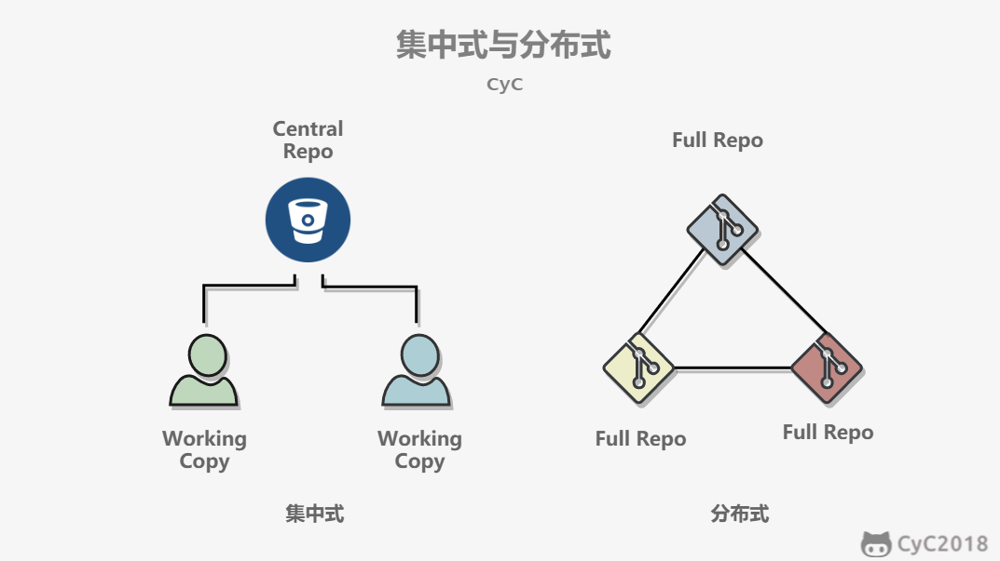 </div><br>

集中式版本控制只有中心服务器拥有一份代码，而分布式版本控制每个人的电脑上就有一份完整的代码。

由此带来几条实际差异：

- **可用性**：集中式服务器不可用时，通常无法提交到中心或与团队交换修改；分布式仓库的本地提交、建分支和看历史仍可继续，任一完整克隆都能在需要时恢复历史。
- **联网要求**：集中式通常需要连网才能提交到中心；分布式不需要连网就能提交、建分支、看历史，联网时再交换修改。
- **分支成本**：分布式的新建分支、合并分支操作通常很快；集中式分支依赖服务器的实现、权限和网络，工作流成本不一定相同。

> **关键认知：** 分布式的核心差异是"每人都持有完整仓库"，离线可工作、分支廉价都是这一点的派生结果。

### 中心服务器

分布式没有中心服务器也能工作，但中心服务器能 24 小时开机，方便大家交换修改——GitHub 扮演的就是这个角色。要强调的是：中心服务器在 Git 里只是"交换修改的中转站"，不是代码历史的唯一保管者。

> **关键认知：** GitHub 不是必需品，它只是大家约定俗成的交换节点；离线时你照样可以正常提交。

## 四个区域与对象模型

命令背不完，是因为没有先建立模型。Git 的一切操作都发生在四个区域之间，操作的对象只有两种：不可变的对象和可移动的指针。

### 四个职责不同的状态层

| 区域 | 里面放的是什么 | 会不会自动同步到下一个区域 |
|---|---|---|
| 工作区 Working Tree | 你当前能直接看到和编辑的文件 | 不会 |
| 暂存区 Index | 下一次准备提交的快照清单 | 不会 |
| 本地仓库 Local Repository | 提交对象、树对象、blob 对象、分支指针、HEAD | 不会 |
| 远程仓库 Remote Repository | 另一份仓库对象库和远程分支指针 | 不会 |

这四个区域不是"四个备份文件夹"，而是四个职责不同的状态层：

- 工作区负责编辑中的现实状态；
- 暂存区负责"下一次提交到底想提交什么"；
- 本地仓库负责保存已经成立的历史；
- 远程仓库负责和别人共享历史。

<div align="center">
  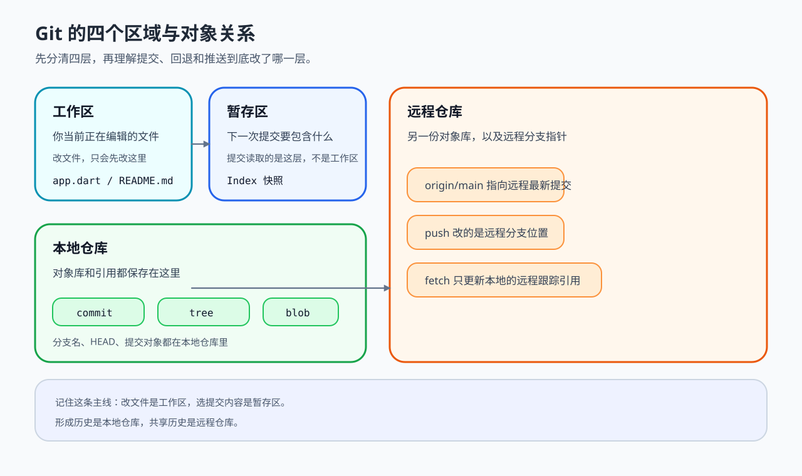
</div>
<p align="center">图 1：Git 四个区域与对象的关系；理解它之后，"改文件只动工作区、暂存只动 Index、提交只在本地仓库新建对象并移动分支指针"这些规则会自然成立。</p>

> **关键认知：** 四个区域之间没有任何自动同步。你在工作区改了文件，暂存区不知道；你 fetch 了远程，工作区也不会变。所有推进都必须显式命令。

### Git 保存的是快照，不是差异

很多人第一次学 Git，会把它理解成"每次只记录改了哪几行"。这个理解不完整：**Git 在提交层面保存的是快照**。一次提交里会记录：

- 当前目录树长什么样；
- 每个文件内容对象指向哪里；
- 这个提交的父提交是谁；
- 作者、时间、说明这些元数据。

其中最重要的三个对象：

| 对象 | 作用 | 是否可变 |
|---|---|---|
| `blob` | 文件内容 | 不可变 |
| `tree` | 目录结构和文件清单 | 不可变 |
| `commit` | 指向一棵 tree，并记录父提交 | 不可变 |

一旦对象写入仓库，它就不会被"修改"。后续所谓"改提交内容"，本质上都不是原地改，而是**新建一个新的对象，然后让分支指针改指向新对象**。

这就是为什么：

- 新提交会有新哈希；
- rebase 之后提交哈希会变；
- `--amend` 看起来像"修改上一个提交"，实际上是"生成一个新提交替换原来的位置"。

> **关键认知：** Git 对象不可变，一切"修改历史"都是"新建对象 + 移动指针"。哈希变化是这一模型的直接结果，不是异常。

### 指针才是 Git 的灵魂

对象是静态的，指针才是动态的。Git 里最常见的几个指针：

| 指针 | 本质 | 它指向什么 |
|---|---|---|
| `HEAD` | 你当前所在位置 | 通常指向某个本地分支，也可能直接指向某个提交（分离头指针） |
| 本地分支 | 一个可移动引用 | 某个最新提交 |
| 远程跟踪分支（如 `origin/main`） | 你上次已知的远程位置 | 某个远程分支对应的提交 |
| Tag | 通常不移动的引用 | 某个固定提交 |

最常见的情况是 `HEAD -> main -> C3`：你当前在 `main` 分支上，`main` 分支当前指向提交 `C3`，`HEAD` 不是直接指向 `C3`，而是先指向 `main`。

当你新建一次提交时，真正发生的不是"把代码塞进 main"，而是：

1. 为有变化的内容创建或复用 `blob/tree` 对象，并生成新的 `commit` 对象；
2. 把 `main` 从 `C3` 挪到 `C4`；
3. 因为 `HEAD` 指着 `main`，所以你看起来也跟着到了 `C4`。

<div align="center">
  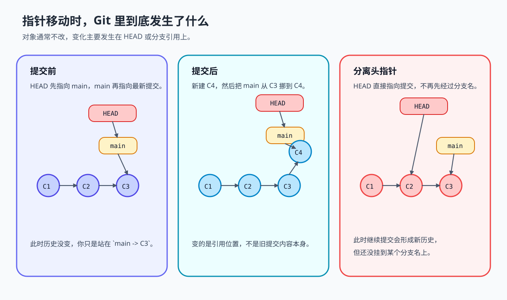
</div>
<p align="center">图 2：提交、切换分支、分离头指针三种场景下的指针运动；对象不动，指针在动。</p>

> **关键认知：** 提交、分支、合并、回退，本质上都只是"对象新增了"或"某个指针改指向了"。抓住"对象不动，指针在动"，大部分 Git 操作都能看懂。

## 一次提交的完整过程

模型建立之后，回到最日常的动作：编辑、暂存、提交。

### 工作流：三个区域的推进

新建一个仓库之后，当前目录就成为了工作区，工作区下有一个隐藏目录 .git，它属于 Git 的版本库。Git 的版本库有一个称为 Stage 的暂存区以及最后的 History 版本库，History 存储所有分支信息，使用一个 HEAD 指针指向当前分支。

<div align="center"> 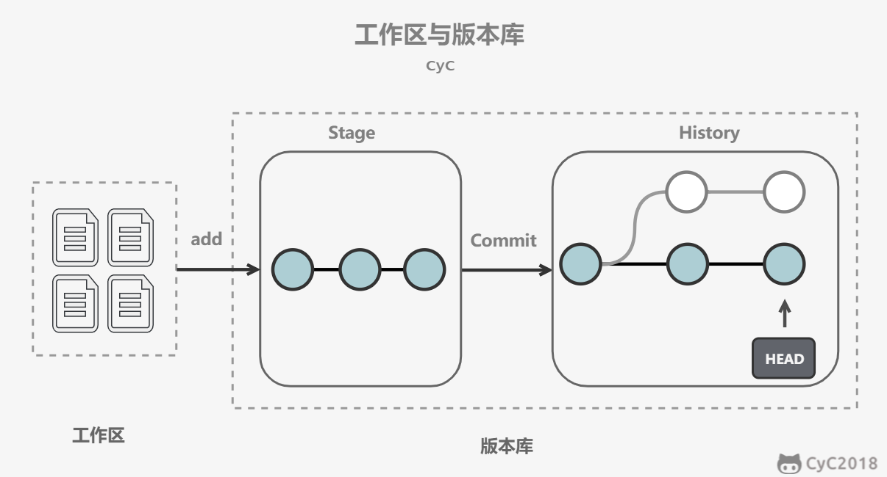 </div><br>

```bash
git add <files>        # 把工作区的修改放进暂存区
git commit             # 把暂存区的内容提交到当前分支；提交后暂存区被清空
git reset -- <files>   # 用当前分支上的版本覆盖暂存区，撤销最后一次 git add
git checkout -- <files> # 用暂存区的内容覆盖工作区，丢弃本地未暂存修改
```

现代 Git（2.23 起）把 `git checkout` 的"恢复文件"职责拆成了语义更清晰的 `git restore`：`git restore --staged <file>` 对应 `git reset -- <file>`，`git restore <file>` 对应 `git checkout -- <file>`，切换分支则用 `git switch <branch>` 代替 `git checkout <branch>`，见 [Git 2.23 发布说明](https://github.com/git/git/blob/v2.23.0/Documentation/RelNotes/2.23.0.txt)。[核查日期：2026-09]

<div align="center"> 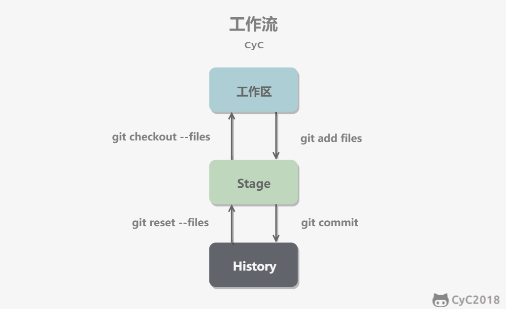 </div><br>

### 暂存不是提交，提交也不打包工作区

用指针模型重新审视这三步，最容易混淆的是第二步和第三步：

- 暂存不是提交；
- 提交不是"把工作区打包"；
- **提交时真正拿来生成新历史的是暂存区（Index），不是工作区。**

所以才会出现这种现象：文件后来又继续改了，但 Index 里还保留着旧版本，提交时进入历史的仍然是旧的那份暂存内容。反过来，文件改了但没 `git add`，这些改动不会进入下一次提交。

### 跳过暂存区的捷径

可以跳过暂存区直接操作：

```bash
git commit -a            # 把所有已跟踪文件（不含未跟踪的新文件）的修改直接提交
git checkout HEAD -- <files>  # 从最后一次提交直接取回文件内容，可用于回滚
```

<div align="center"> 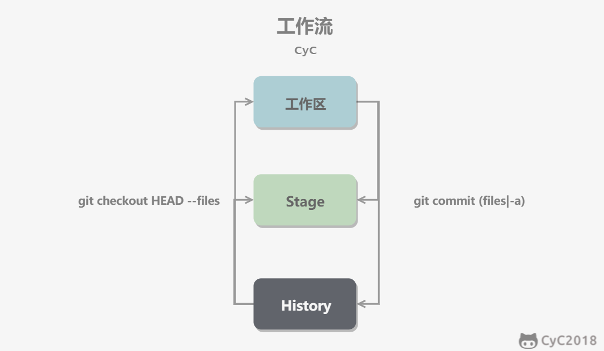 </div><br>

> **面试高频：** git add / git commit / git restore 各自动的是哪一层？
> **答题脉络：** add 只动 Index → commit 只用 Index 生成新提交并移动分支指针 → restore 覆盖工作区或 Index，不动历史。
> **追问方向：** `commit -a` 是否包含未跟踪文件（不包含）、提交时工作区继续改动会不会进历史（不会）。

## fetch、push、pull：谁在动

这一组操作最容易把"本地看到的远程状态"和"远程真实状态"混成一件事。先分清两个东西：

- `main` 是你的本地分支指针；
- `origin/main` 是你在本地记录的"上次已知远程 main 在哪"。

> **关键认知：** `origin/main` 不是远程服务器上的那个分支本体，它只是你本地仓库里的一条远程跟踪引用。fetch 更新的是它，不是你的代码。

### fetch 只更新情报

`fetch` 的本质是：

1. 从远程拿回新对象；
2. 更新你本地仓库里的远程跟踪分支（如 `origin/main`）。

它通常不会动你的当前本地分支、`HEAD` 和工作区。所以 `fetch` 更像"更新情报"，不是"改你当前代码"。

### push 是让远程指针快进

`push` 的本质是**尝试让远程分支指针前进到你本地这段历史**。如果远程分支当前指向的提交是你准备推送历史的祖先，远程分支可以直接快进；如果不是，说明远程有你本地没有的新历史、或者你本地改写过历史，push 被拒绝——本质上是 Git 在保护远程指针不被你直接覆盖。

### pull 不是一个原子动作

`pull` 至少包含两步：

1. 先 fetch，更新远程跟踪分支；
2. 再把那段新历史整合进你当前分支——第二步是 merge 还是 rebase，决定了你是得到一个新的 merge commit，还是把本地提交换基底重放。

```bash
git pull origin main          # 第二步默认走 merge（除非配置 pull.rebase）
git pull --rebase origin main # 第二步显式走 rebase
```

> **关键认知：** pull = fetch + merge（或 rebase）。没把这两层分开理解，就很容易在冲突、快进、merge、rebase 之间混淆。

## 分支与远程协作

### 分支只是一个可移动指针

使用指针将每个提交连接成一条时间线，HEAD 指针指向当前分支指针。

<div align="center"> 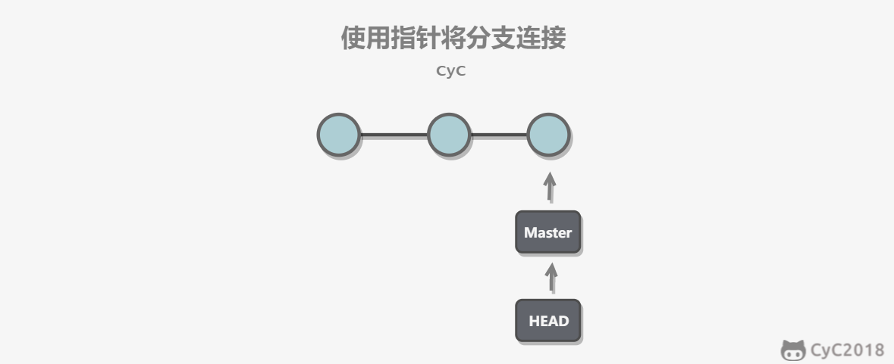 </div><br>

新建分支是新建一个指针指向时间线的最后一个节点，并让 HEAD 指针指向新分支，表示新分支成为当前分支。

<div align="center"> 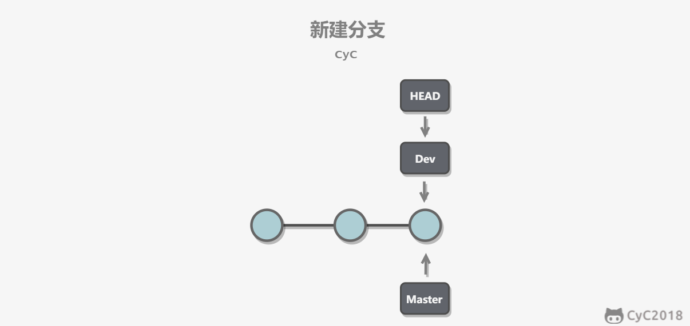 </div><br>

每次提交只会让当前分支指针向前移动，而其它分支指针不会移动。

<div align="center"> 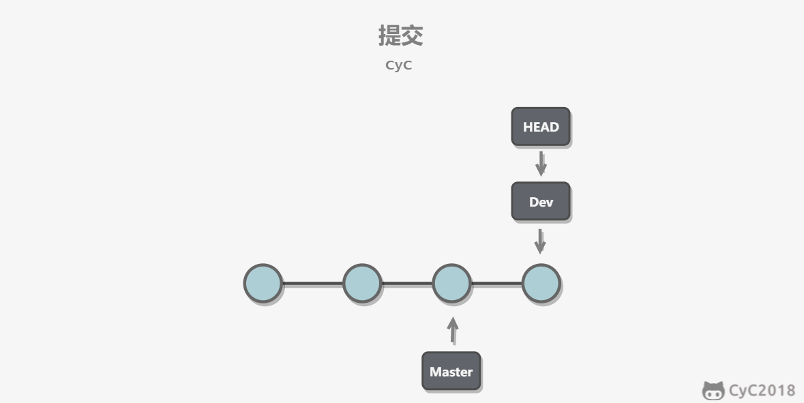 </div><br>

> **关键认知：** 分支不是"一份代码的拷贝"，只是一个指向某次提交的可移动引用。这就是分布式 Git 建分支廉价到可以随便建的根本原因。

图中的 master 是历史示例分支名；GitHub 自 2020-10-01 起[新建仓库的默认分支名改为 main](https://github.blog/changelog/2020-10-01-the-default-branch-for-newly-created-repositories-is-now-main/)，Git 2.28 起可用 [init.defaultBranch](https://git-scm.com/docs/git-init) 指定本地 `git init` 的初始分支名。[核查日期：2026-09]

### 新建分支与提交时的指针运动

把上一节的图串成一句话：新建分支（`git branch dev`）只是增加一个引用；切换分支（`git switch dev`）只是把 HEAD 改指向它；在 dev 上提交（`git commit`）生成新对象并把 dev 挪过去。整个过程中没有任何文件被复制。

快进式合并只需要改变指针；非快进合并还会生成一个新的 merge commit。

<div align="center"> 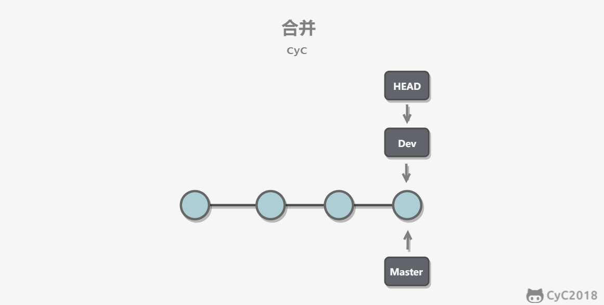 </div><br>

### Fast forward 与 --no-ff

"快进式合并"（fast-forward merge）会直接把当前分支指针挪到被合并分支的位置。这种模式下合并会丢失分支信息——历史里看不出这里曾经有过一个分支。

可以在合并时加上 `--no-ff` 参数禁用 fast forward，并加上 `-m` 参数让合并产生一个新的 merge commit：

```bash
git merge --no-ff -m "merge with no-ff" dev
```

<div align="center"> 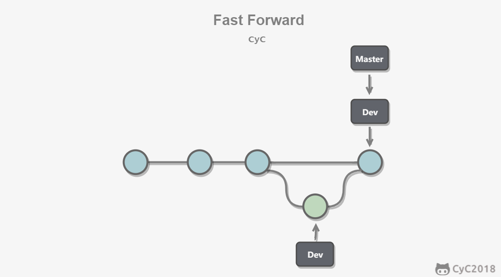 </div><br>

> **关键认知：** fast forward 只动指针、不产生新提交；`--no-ff` 强制产生一个 merge commit，把"这里有过一次合并"记进历史。团队通常在合入长期分支时统一要求 `--no-ff`，保留分支语义。

### 储藏（Stashing）

在一个分支上操作之后，如果还没有将修改提交到分支上，此时进行切换分支，那么另一个分支上也能看到新的修改（若改动与目标分支冲突，Git 会拒绝切换）。这是因为所有分支都共用一个工作区的缘故。

可以使用 `git stash` 将当前分支的修改储藏起来：已跟踪文件的修改被存进一个栈结构，工作区变干净，此时就可以安全地切换到其它分支。

```text
$ git stash
Saved working directory and index state WIP on master: 049d078 added the index file
```

未跟踪文件默认不会进入储藏，需要 `git stash -u`；恢复时用 `git stash pop`（恢复并删除该条记录）或 `git stash apply`（恢复但保留记录），`git stash list` 可以查看栈中的记录。

该功能可以用于 bug 分支的实现：如果当前正在 dev 分支上进行开发，但是 master 上有个 bug 需要修复，而 dev 上的开发还未完成、不想立即提交，就可以先 `git stash` 把未提交修改储藏起来，修完 bug 回来再恢复。

> **关键认知：** stash 不是神奇缓存区——它本质上也是提交对象，只是挂在特殊引用（refs/stash）上。stash 能保存、列出、恢复，用的还是对象和引用这一套。

## 分层回退体系：checkout、switch、restore、reset、revert

很多人觉得 Git 最难的部分是"为什么都是回退，行为却不一样"。根因是它们操作的层级不同。先把结论放前面：

| 命令 | 动的层 | 分支指针动吗 |
|---|---|---|
| `git switch` / `git checkout <branch>` | HEAD、工作区、Index | HEAD 改指向别的分支 |
| `git restore` / `git checkout -- <file>` | 工作区或 Index（按参数） | 不动 |
| `git reset`（不带路径） | 分支指针、Index、工作区（按模式） | **动**（这是它和 restore 的本质区别） |
| `git reset <commit> -- <path>` | Index（按路径形式） | 不动当前分支指针 |
| `git revert` | 向前追加一个反向提交 | 动（向前，不是回退） |

### 切换分支动的是 HEAD

切换分支时，本质动作是：

1. `HEAD` 改为指向另一个分支；
2. 工作区和 Index 尽量被调整成那个分支最新提交对应的快照。

如果当前改动会被覆盖，Git 就阻止你切换，因为它无法安全改写工作区。

`git checkout <commit-hash>` 则会让 HEAD 直接指向某个提交，进入分离头指针（detached HEAD）状态。此时你仍然可以继续提交，但如果不把这段新历史挂到某个分支名上，后面就容易丢失可达入口。

### restore：用快照覆盖工作区或暂存区

`restore` 类动作的核心不是改历史，而是**用某个已知快照覆盖工作区或 Index**：

- 恢复工作区（`git restore <file>`）：用 Index 里的版本覆盖工作区，分支指针不动；
- 恢复暂存区（`git restore --staged <file>`）：用 HEAD 里的版本覆盖 Index，分支指针也不动。

它主要影响的是"现在这两层看起来是什么样子"，历史完全没被碰。注意 `git restore` 必须带路径参数，裸敲会直接报错（见下文[后悔药速查](#主命令裸敲行为表)）。

### reset：连分支指针一起动

不带路径的 `reset` 真正强大的地方在于：它**既移动当前分支指针，又可以选择性地顺手重置 Index 和工作区**。带 `-- <path>` 的形式只重置指定路径的 Index，不移动分支指针。它本质上是在说三句话：

- "把当前分支重新指到别的提交。"
- "顺便要不要让 Index 跟过去？"
- "顺便要不要让工作区也跟过去？"

三种模式对应三种后果：

| reset 模式 | 分支指针 | Index | 工作区 | 结果 |
|---|---|---|---|---|
| `--soft` | 变 | 不变 | 不变 | 提交记录回退了，改动保留为已暂存状态 |
| `--mixed`（默认） | 变 | 变 | 不变 | 提交记录回退了，改动退回工作区 |
| `--hard` | 变 | 变 | 变 | 提交记录和本地改动一起退回到目标提交 |

> **面试高频：** reset 的三种模式有什么区别？
> **答题脉络：** reset 先动分支指针 → `--soft` 只动指针、改动留在暂存区 → `--mixed` 再重置 Index、改动退回工作区 → `--hard` 连工作区一起覆盖、未提交改动丢失。
> **追问方向：** `--hard` 丢掉的提交还能找回吗（reflog）、默认模式是哪个（`--mixed`）。

### revert：向前追加反向提交

`revert` 完全不是回头改历史。它是在当前历史末尾再追加一个"反向提交"：

- 历史没有被重写；
- 分支指针照样向前走，只是新增的提交内容刚好抵消之前某次改动；
- 已经共享给团队的历史，更适合用它，因为别人不会被你改掉共同历史。

<div align="center">
  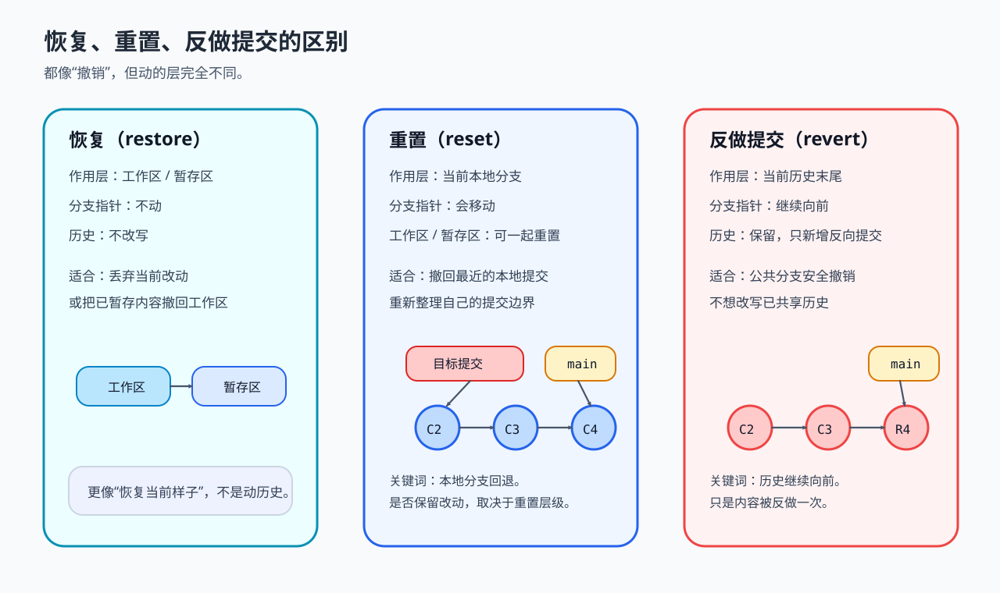
</div>
<p align="center">图 3：reset 移动分支指针（可重写本地历史）、restore 只覆盖工作区/暂存区、revert 向前追加反向提交。</p>

> **关键认知：** revert 和 reset 的选择标准只有一条——这段历史是否已经共享给别人。已推送的用 revert（追加反向提交，不改历史），未推送的本地提交才可以用 reset 整理。

### 远程仓库的两种"回退"路径

远程仓库没有什么神秘之处，它也只是对象库加分支指针。所谓"让远程回退"，本质上只有两种路径：

| 路径 | 本质动作 | 是否改共享历史 | 适用场景 |
|---|---|---|---|
| 追加反向提交（`git revert`） | 远程分支继续前进，但内容抵消旧提交 | 否 | 公共分支、协作分支 |
| 强制把远程分支指向旧提交（优先 `git push --force-with-lease`） | 直接改远程指针 | 是 | 私有分支、确认无人依赖且已沟通时 |

只要记住这一点，就不会把"内容回退"和"历史回退"混为一谈。

> **关键认知：** push 被拒绝不是"网络问题"，而是你准备推的历史不能直接接在远程分支后面——Git 在阻止你覆盖别人的提交。

## merge 与 rebase：两种历史形状

两者表面都在"把别的分支内容拿过来"，本质区别在**历史形状**。

### merge：把两段历史汇合

如果当前分支只是落后、没有分叉，Git 只需要把当前分支指针直接快进到前面，这叫 fast-forward。

如果两边都各自前进过，Git 会：

1. 找到共同祖先；
2. 比较"祖先 → 你这边"和"祖先 → 对方那边"各自做了什么；
3. 能自动合并就生成一个新的 merge commit；
4. 当前分支指针移动到这个新的 merge commit。

此时历史是**保留分叉形状**的。

### rebase：换底座重放你这一段

`rebase` 不是汇合两段历史，而是把"你这条分支自己新增的那几次提交"摘下来，换个基底，重新播放一遍。本质动作是：

1. 找到你相对旧基底多出来的提交；
2. 把目标基底切换到新的位置；
3. 逐个把那些提交变成**新的提交**重新应用；
4. 让当前分支指针指向这串新提交。

原来的那串提交并不是被"修改"了，而是被新提交替换了位置——哈希变化就是这个原因。所以：

- merge 更像"把两段历史接成一个汇合点"；
- rebase 更像"换底座重写你这一小段历史"。

<div align="center">
  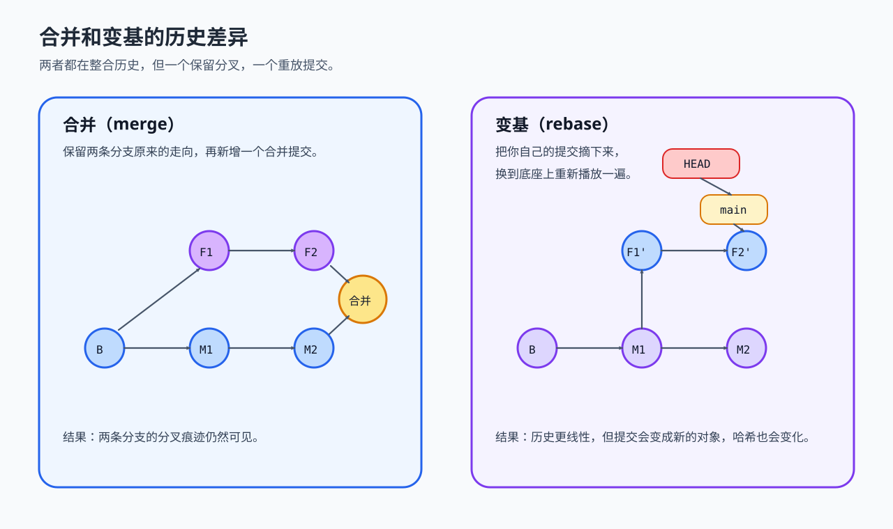
</div>
<p align="center">图 4：merge 保留真实的分叉形状；rebase 把你的提交换成新基底上的新提交，历史变线性但哈希全部改变。</p>

### 选型权衡

| 维度 | merge | rebase |
|---|---|---|
| 历史形状 | 保留分叉，有 merge commit | 线性，像从未分叉 |
| 是否改写提交 | 否（新建合并提交） | 是（你的提交被重放为哈希不同的新提交） |
| 适用 | 公共分支、多人协作 | 自己的私有分支整理 |
| 风险 | 历史图较绕 | 改写已共享历史会让别人拉不下来 |

> **面试高频：** merge 和 rebase 怎么选？
> **答题脉络：** 先说本质差异（汇合 vs 重放）→ 历史形状与哈希是否变化 → 判断标准是这段历史是否已共享 → 私有分支大胆 rebase，公共分支谨慎 rebase 和强推。
> **追问方向：** rebase 后别人为什么拉不下来（共同祖先变了）、`git pull --rebase` 的作用。

## 冲突：为什么发生，怎么解决

### 冲突的真正来源

当两个分支都对同一个文件的同一行进行了修改，在分支合并时就会产生冲突。但更准确地说：**冲突不是因为"你们都改了同一个文件"——改同一个文件也可以自动合并——真正的冲突来自 Git 无法唯一确定最终结果**。

<div align="center"> 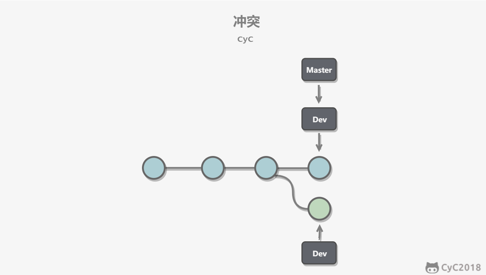 </div><br>

最常见的几类冲突来源：

**1. 同一段内容被两边改成了不同结果。** 共同祖先里是 `timeout = 3000`，甲改成 `5000`，乙改成 `10000`。Git 能知道"两边都改了同一位置"，但不知道该保留哪个值，只能停下来让人决定。

**2. 一边改文件内容，另一边删掉了整个文件。** Git 无法猜测你的真实意图——是删除更重要，还是保留修改后的文件更重要？它不能替你做业务判断。

**3. 同一逻辑被分别移动、重命名、拆分。** 一边把 `user.js` 重命名成 `account.js` 并继续修改，另一边还在旧文件名上继续修改。Git 可能能识别一部分重命名关系，但复杂场景下还是要人工确认。

### 冲突标记与解决流程

Git 会使用 `<<<<<<<`，`=======`，`>>>>>>>` 标记出不同分支的内容：

```text
<<<<<<< HEAD
Creating a new branch is quick & simple.
=======
Creating a new branch is quick AND simple.
>>>>>>> feature1
```

解决冲突，本质上是在**重新定义最终快照**，不只是"把标记删掉"：

1. 决定最终文件应该长什么样（真正需要判断的是业务语义：两边逻辑是否都要保留、一边是否已覆盖另一边意图、是否需要第三种写法）；
2. 把这个结果放回工作区；
3. `git add` 告诉 Git 这个文件从"未决状态"回到"已确认状态"；
4. `git commit` 让当前整合流程继续完成。

想放弃本次合并可以用 `git merge --abort`（rebase 对应 `git rebase --abort`）。

<div align="center">
  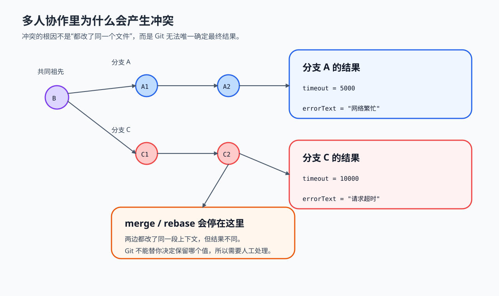
</div>
<p align="center">图 5：冲突的形成过程；Git 能定位冲突位置，但不能替你做业务取舍。</p>

> **关键认知：** 很多冲突不是技术问题，而是需求和设计没有提前收敛——冲突标记落在几行文本上，真实冲突点常常是业务决策冲突。

### rebase 冲突为什么"看起来已经对了还要停"

merge 冲突和 rebase 冲突的认知模型不同：

- merge 冲突是"两条分支一起往前合并时，当前快照无法自动汇总"；
- rebase 冲突是"你历史上某个旧提交，放到新基底上后，补丁打不上去了"。

所以 rebase 时经常出现"文件明明已经是我想要的样子了，Git 还是停下来"——因为它处理的不是最终文件长相，而是"这一笔旧提交在新上下文里还能不能成立"。

> **面试高频：** 为什么会发生合并冲突？
> **答题脉络：** 两个分支从共同祖先分叉 → 各自前进 → 合并时 Git 做三方比较 → 同一位置有两种改法且 Git 无法替你决策 → 停下来人工裁决。
> **追问方向：** 改同一文件不同区域能否自动合并（能）、rebase 冲突与 merge 冲突的差异、`merge --abort`。

## 命令详解

这一部分按使用场景分类整理常用命令。重点是每条命令"动哪一层、不带参数会怎样"，而不是死记参数。

### 分支基础操作

```bash
git branch <branch-name>        # 只创建分支，不切换；动的只是引用表
git checkout -b <branch-name>   # 创建并切换（老写法）
git switch -c <branch-name>     # 创建并切换（Git 2.23+ 推荐写法）
git branch <branch-name> <commit-hash> # 从指定提交创建分支

git checkout <branch-name>      # 切换分支（老写法，还兼任恢复文件）
git switch <branch-name>        # 切换分支（职责单一的新写法）
git checkout -                  # 切回上一个分支，同 git switch -
git checkout --detach <commit-hash> # 分离头指针查看历史提交
```

`checkout` 一人分饰两角（切分支 + 恢复文件）是很多误操作的来源，带 `--` 与否语义完全不同：`git checkout <file>` 是丢工作区改动，`git checkout <branch>` 是切分支。`switch`/`restore` 的拆分就是为了消除这种歧义。

### 分支查看与管理

```bash
git branch          # 列出本地分支；当前分支带 * 号
git branch -a       # 列出所有分支（含远程跟踪分支）
git branch -v       # 列出分支及最后一次提交
git branch -vv      # 额外显示上游分支
git branch --merged   # 列出已合并进当前分支的分支
git branch --no-merged # 列出未合并的分支（删除前先看这个）
git branch --contains <commit> # 查看包含特定提交的所有分支

git branch -d <branch-name>  # 删除已合并的分支；未合并时拒绝，是安全阀
git branch -D <branch-name>  # 强制删除，未合并的提交会失去这个引用

git branch -u origin/<branch-name>               # 设置上游分支
git branch --set-upstream-to=origin/<branch-name>
```

注意 `-d` 与 `-D` 的区别正好体现"删除分支只是删引用"：被 `-D` 删掉的提交并没有立刻消失，reflog 里通常还能找回。

### 远程分支操作

```bash
git branch -r            # 查看远程跟踪分支
git fetch origin         # 拿回远程对象并更新 origin/*，不动你的工作区
git fetch --all          # 获取所有远程仓库
git fetch --prune        # 顺便清掉远程已删除分支的本地引用
git remote prune origin  # 同上的显式写法

git push origin <branch-name> # 推送本地分支
git push -u origin <branch-name> # 推送并建立上游跟踪关系（之后可裸 push/pull）
git push --all origin    # 推送所有本地分支
git push origin --delete <branch-name> # 删除远程分支
git push origin :<branch-name>         # 删除远程分支的老写法（推空）

git pull origin <branch-name>        # fetch + merge
git pull --rebase origin <branch-name> # fetch + rebase
git remote show origin   # 查看远程分支的详细信息
```

### 合并操作

```bash
git merge <branch-name>       # 把目标分支合并进当前分支
git merge --ff <branch-name>  # 允许快进（默认行为）
git merge --no-ff -m "msg" <branch-name> # 禁用快进，强制生成 merge commit
git merge --no-commit <branch-name> # 非快进合并时停在提交前，允许先检查；快进时需配合 --no-ff
git merge --abort             # 冲突后放弃本次合并，回到合并前状态

git cherry-pick <commit-hash> # 把某次提交"复制"到当前分支（生成新哈希）
git cherry-pick <start>..<end> # 摘取一系列提交
```

`--no-verify` 跳过的是 pre-commit/pre-merge 钩子，与冲突处理无关，别被名字误导。

### 变基操作

```bash
git rebase <base-branch>   # 把当前分支的提交重放到目标基底上
git rebase -i HEAD~<n>     # 交互式变基最近 n 个提交：可 reword/squash/drop
git rebase --continue      # 解决冲突后继续
git rebase --skip          # 跳过当前这个打不上去的提交
git rebase --abort         # 放弃整个变基，回到起点
git rebase -X theirs <base-branch> # 冲突时偏向"对方"版本
git rebase -X ours <base-branch>   # 冲突时偏向"自己"版本
```

变基过程中的每一步冲突解决完都要 `git add` 再 `--continue`；Git 是逐个提交重放的，所以可能要解决多轮冲突。注意 rebase 期间 `ours` 通常指新基底（上游），`theirs` 通常指正在重放的提交，和直觉中的“我方/对方”可能相反；不要在不了解冲突语义时直接使用 `-X`。

### Stash 暂存操作

```bash
git stash                  # 暂存已跟踪文件的改动，工作区变干净
git stash push -m "message" # 带描述的暂存（save 的现代写法）
git stash -u               # 连未跟踪文件一起暂存
git stash -a               # 连 .gitignore 忽略的文件也一起暂存
git stash --keep-index     # 暂存但暂存区内容保留在工作区

git stash list             # 查看储藏栈：stash@{0} 是最新一条
git stash show -p          # 看最新一条的完整差异
git stash show -p stash@{2} # 看指定条目

git stash pop              # 恢复最新一条并从栈中删除（冲突时不删）
git stash apply stash@{1}  # 恢复指定条目但保留在栈中
git stash branch <name>    # 从某条储藏直接创建分支
git stash drop stash@{0}   # 删除指定条目
git stash clear            # 清空整个储藏栈（不可逆）
```

### Tag 标签操作

```bash
git tag                          # 列出所有标签
git tag -l "v1.*"                # 按模式过滤

git tag <tag-name>               # 轻量标签：只是一个指向提交的引用
git tag -a <tag-name> -m "说明"  # 附注标签：包含完整元数据（推荐用于发布）
git tag <tag-name> <commit-hash> # 给历史提交补标签

git show <tag-name>              # 查看标签详情（附注标签能看到元数据）
git tag -d <tag-name>            # 删除本地标签

git push origin <tag-name>       # 推送单个标签（标签默认不随 push 走！）
git push origin --tags           # 推送所有标签
git push origin --delete <tag-name> # 删除远程标签

git diff <tag1> <tag2>           # 比较两个标签的差异
git diff <tag1> <tag2> --stat    # 只看变更文件统计
git checkout -b <branch> <tag-name> # 基于标签检出新分支
```

> **关键认知：** 轻量标签和附注标签的区别在于是否携带元数据；发版应使用附注标签。另外 `git push` 默认不推标签，必须显式推。

### 常用查看命令

```bash
git status                     # 当前工作区/暂存区状态
git log --oneline              # 简洁提交历史
git log --graph --oneline --all --decorate # 分支结构图（多人协作必备）
git log -p                     # 附带每次提交的完整差异

git diff                       # 工作区 vs 暂存区
git diff --cached              # 暂存区 vs 最新提交（下一次提交会包含什么）
git diff <branch1>..<branch2>  # 两个分支的差异
git diff <branch1>...<branch2> # 从共同祖先到 branch2 的差异（不是对称比较）

git merge-base <b1> <b2>       # 查看两个分支的共同祖先
git log --oneline -- <file>    # 某个文件的修改历史
git log --follow -p -- <file>  # 跟随重命名查看文件历史
git log --author="name"        # 按作者过滤
git log --grep="keyword"       # 按提交信息搜索
```

`git diff` 与 `git diff --cached` 的区别最容易忘：前者比较工作区和暂存区（还有什么没 add），后者比较暂存区和 HEAD（下一次提交会带上什么）。

### 撤销与 Reflog 恢复

```bash
git restore <file>             # 工作区 → 暂存区版本（丢弃未暂存改动）
git restore --staged <file>    # 暂存区 → HEAD 版本（取消暂存，不动工作区）
git checkout -- <file>         # 老写法，等价 git restore <file>
git reset HEAD <file>          # 老写法，等价 git restore --staged <file>

git reset --soft HEAD~1   # 撤销 commit，改动留在暂存区
git reset HEAD~1          # 撤销 commit，改动退回工作区（--mixed 默认）
git reset --hard HEAD~1   # 撤销 commit 并丢弃已跟踪文件的改动

git revert <commit-hash>  # 用反向提交撤销指定提交（不改历史）
git reflog                # 查看 HEAD 的移动历史
git branch <name> <reflog-hash> # 从 reflog 记录恢复分支
```

> **关键认知：** 回滚类操作（reset/rebase/删分支）只移动指针，提交对象通常仍在版本库里；误操作后用 `git reflog` 找到目标位置，再用 `git reset --hard HEAD@{n}` 回去，或 `git branch <名字> HEAD@{n}` 恢复被删分支。reflog 的默认保留期受引用是否可达、仓库配置和垃圾回收影响，常见的可达记录约为 90 天、不可达记录约为 30 天，不应把它当永久备份。

### 配置与别名

```bash
git config --global user.name "你的名字"
git config --global user.email "你的邮箱"
git config --global core.editor vim
git config --list             # 查看所有配置

# 别名：把长命令缩短
git config --global alias.co checkout
git config --global alias.br branch
git config --global alias.st status
git config --global alias.last 'log -1 HEAD'
git config --global alias.unstage 'reset HEAD --'

git config --global pull.rebase false  # pull 第二步默认走 merge
git config --global push.default simple
git config --global --unset alias.co   # 删除某条配置
```

## 后悔药速查：场景表

回退命令组合起来才是真实场景。下面两张表按"你想救哪一层"组织：第一张是场景 → 推荐命令 → 省参数行为 → 风险；第二张回答"主命令裸敲会发生什么"。

### 八个后悔场景

| 目标场景 | 推荐命令 | 简写 / 等价写法 | 主命令不带参数，或省略关键参数时会怎样 | 风险 / 补充 |
|---|---|---|---|---|
| **远程 → 本地仓库**（把本地分支硬拉回远端最新） | `git fetch origin && git reset --hard origin/当前分支` | 没有真正简写；核心动作是 `git reset --hard origin/当前分支` | `git reset --hard` 只会把**已跟踪文件的工作区和暂存区**重置到**当前本地 HEAD**，不会自动同步远端最新状态 | 会丢**所有未 push 的 commit**、已跟踪文件的暂存改动和未暂存改动；未跟踪文件不会被它删除。先 `fetch`，否则 `origin/当前分支` 可能还是旧引用 |
| **本地 commit → 暂存区**（刚 commit 就发现提交信息或内容写错） | `git reset --soft HEAD~1` | `HEAD~1` 和 `HEAD^` 在这里等价，也常写成 `git reset --soft HEAD^` | `git reset --soft` 目标默认是 `HEAD`，通常**看起来什么都没发生**；因为只是"把 HEAD 移到 HEAD" | 只撤销 commit 记录，改动保留在暂存区，适合立刻重新 commit |
| **本地 commit → 工作区**（commit 错了，add 也错了，要重新挑文件） | `git reset HEAD~1` | 这是 `git reset --mixed HEAD~1` 的简写；`HEAD~1` 也可写成 `HEAD^` | `git reset` 默认等于 `git reset --mixed HEAD`，效果是**取消暂存**，但不撤销当前 commit，也不清空工作区内容 | 改动会退回工作区，之后要重新 `git add` |
| **暂存区 → 工作区**（add 多了，想撤掉暂存） | `git restore --staged .` | 老写法是 `git reset HEAD .`；单文件可把 `.` 换成文件名 | `git restore --staged` 会直接报错，因为它**必须带路径**；不知道你要把哪个文件移出暂存区 | `.` 表示当前目录下全部文件；只撤暂存，不改工作区内容 |
| **工作区 → 最后一次 commit**（本地改崩了，直接丢掉当前修改） | `git restore .` | 老写法是 `git checkout -- .` | `git restore` 会直接报错，因为它**必须带路径**；只写主命令不会默认恢复全部文件 | 会直接清空当前目录下**已跟踪文件**的未提交改动；未跟踪文件不会被它删除，单文件可把 `.` 换成文件名 |
| **远程已 push 的错 commit**（公共分支，不能改历史） | `git revert 错commit哈希` | 撤销最近一次提交时常直接写 `git revert HEAD` | `git revert` 会直接报错，因为它**必须带 commit**，或者在冲突处理中用 `--continue / --abort` | 会新生成一个"反做"的 commit；适合已共享历史 |
| **merge 后发现有毒**（还没 push，想回到 merge 前） | `git reset --keep ORIG_HEAD` | 也有人写 `git reset --keep HEAD@{1}`，但前提是 reflog 上一条确实就是 merge 前的 HEAD | `git reset --keep` 目标默认是 `HEAD`，通常没有明显效果；它不会自己猜"回到 merge 前" | `--keep` 会尽量保留本地改动；如果本地改动和目标提交冲突，Git 会停下，不会硬覆盖 |
| **merge commit 已 push，必须公开撤销这次合并结果** | `git revert -m 1 要撤销的merge提交哈希` | `-m` 是 `--mainline` 的简写 | `git revert -m 1` 仍然会报错，因为它还缺少要撤销的 merge commit 哈希 | `-m 1` 里的 1 是"第 1 个父提交"，不是"第 1 次 merge"。常见场景是你在主分支上执行 merge，这时第 1 个父提交通常就是 merge 前的主分支头；revert 后会保留这条主线，反做另一个父分支带进来的改动 |

### 主命令裸敲行为表

| 主命令 | 直接敲会发生什么 |
|---|---|
| `git reset` | 等价于 `git reset --mixed HEAD`。只会取消暂存，不会清空工作区，也不会回退 commit。 |
| `git reset --soft` | 目标默认是 `HEAD`。通常没有可见变化。 |
| `git reset --hard` | 把暂存区和工作区都强制重置到当前 `HEAD`。危险点在于它会直接丢掉未提交改动。 |
| `git restore` | 直接报错。必须指定要恢复的路径。 |
| `git restore --staged` | 直接报错。必须指定要从暂存区恢复的路径。 |
| `git revert` | 直接报错。必须指定要反做的 commit，或者处于 revert 冲突流程里再用 `--continue / --abort`。 |

## SSH 传输设置

Git 仓库和远程托管仓库之间可以用 SSH 加密传输；GitHub 也支持 HTTPS 远程地址，本节只说明 SSH 的配置方式。

SSH Key 存放在当前用户主目录的 .ssh 目录下；如果没有密钥文件，可以用以下命令创建（GitHub 当前推荐 Ed25519 算法，生成 id_ed25519 和 id_ed25519.pub 两个文件，`-t rsa` 仅用于不支持 Ed25519 的旧系统，见 [Generating a new SSH key](https://docs.github.com/en/authentication/connecting-to-github-with-ssh/generating-a-new-ssh-key-and-adding-it-to-the-ssh-agent)）[核查日期：2026-09]：

```bash
ssh-keygen -t ed25519 -C "youremail@example.com"
```

然后把公钥 `id_ed25519.pub` 的内容添加到对应托管平台的 SSH Key 设置中；不同平台的菜单名称可能不同。

## .gitignore 文件

忽略以下文件：

- 操作系统自动生成的文件，比如缩略图；
- 编译或构建生成的文件与缓存，比如 Dart 项目的 .dart_tool/ 目录、Flutter 的 build/ 目录；
- 自己的敏感信息，比如存放口令的配置文件。

不需要全部自己编写，可以到 [https://github.com/github/gitignore](https://github.com/github/gitignore) 中进行查询。

> **关键认知：** `.gitignore` 只对**未跟踪**文件生效。一个文件已经被 Git 跟踪后再加进 `.gitignore`，它的修改仍会被记录；需要先 `git rm --cached <file>` 把它移出暂存区。密码、令牌等秘密一旦提交过，即使后来忽略并删除，也仍可能留在历史中，应立即吊销并按凭据泄露流程处理。

## 常见误区

- ❌ "Git 每次提交保存的是差异。"
- ✅ 提交层面保存的是完整快照（blob/tree/commit 对象）；差异只在存储层作为压缩优化出现。
- ❌ "删除分支会删掉那些提交。"
- ✅ 删除分支只是删掉一个引用；提交对象仍在，reflog 可达期内可以恢复。
- ❌ "checkout 到某个提交等于创建了新分支。"
- ✅ 那是分离头指针状态；继续提交而不挂到分支名上，历史容易丢失入口。
- ❌ "fetch 之后我的代码就更新了。"
- ✅ fetch 只更新远程跟踪分支（origin/*）和你对远程的认知，不动工作区、不动本地分支。
- ❌ "revert 是把历史改回去。"
- ✅ revert 是向前追加一个反向提交，历史只增不改；改历史的是 reset/rebase。
- ❌ "push 被拒绝是网络问题，force 一下就好。"
- ✅ 被拒说明你的历史不是远程历史的后继；强推会改写共享历史，覆盖别人的提交。确需改写私有分支时优先 `git push --force-with-lease`，并先确认协作者没有新提交。

## 参考资料

- [R1] [教程] [Git - 简明指南](https://rogerdudler.github.io/git-guide/index.zh.html) — Roger Dudler，[核查日期：2026-09]。
- [R2] [教程] [图解 Git](https://marklodato.github.io/visual-git-guide/index-zh-cn.html) — Mark Lodato，[核查日期：2026-09]。
- [R3] [教程] [廖雪峰：Git 教程](https://liaoxuefeng.com/books/git/introduction/index.html) — 廖雪峰，[核查日期：2026-09]。
- [R4] [教程] [Learn Git Branching](https://learngitbranching.js.org/) — Peter Cottle，[核查日期：2026-09]。
- [R5] [官方文档] [Git Reference](https://git-scm.com/docs) — Git，含 [git-reset](https://git-scm.com/docs/git-reset)、[git-restore](https://git-scm.com/docs/git-restore)、[git-revert](https://git-scm.com/docs/git-revert)、[git-rebase](https://git-scm.com/docs/git-rebase)、[git-stash](https://git-scm.com/docs/git-stash)、[git-tag](https://git-scm.com/docs/git-tag) 各条，[核查日期：2026-09]。
- [R6] [官方文档] [Pro Git Book (2nd Edition)](https://git-scm.com/book/zh/v2) — Scott Chacon & Ben Straub，第 3 章"分支"、第 7 章"Git 工具"，[核查日期：2026-09]。
- [R7] [官方文档] [Git 2.23 Release Notes](https://github.com/git/git/blob/v2.23.0/Documentation/RelNotes/2.23.0.txt) — Git，switch/restore 引入说明，[核查日期：2026-09]。
- [R8] [官方文档] [Generating a new SSH key](https://docs.github.com/en/authentication/connecting-to-github-with-ssh/generating-a-new-ssh-key-and-adding-it-to-the-ssh-agent) — GitHub Docs，[核查日期：2026-09]。

## 一句话总结

> Git 用不可变对象保存快照、用可移动指针描述位置，一切命令都是"新建对象或移动指针"在不同区域上的展开——判断任何操作时先问它动的是哪一层、历史是否被改写、是否已共享。
