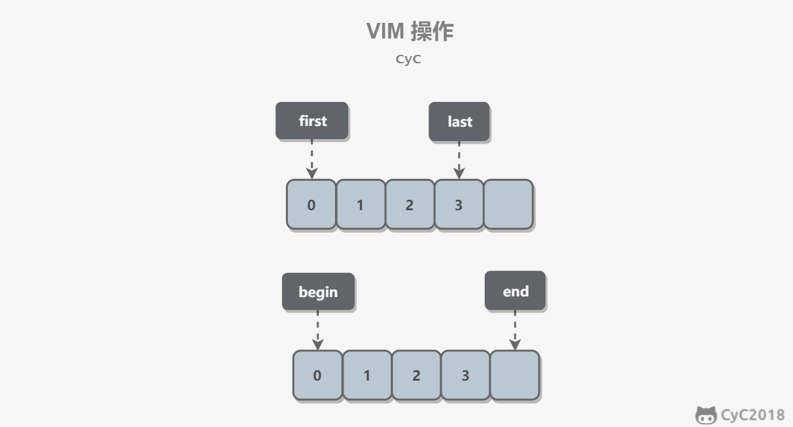

# 代码可读性与风格

接手一个半年没人动过的模块时，拖慢你的通常不是算法，而是名字和结构：`d`、`tmp`、`flag1` 分别是什么，`if` 为什么套了四层，两个几乎一样的函数哪个才是当前版本。写代码的时间是一次性的，读懂代码的时间却会在每次修改时重新支付。

把可读性当成个人审美是常见的误解。它其实是一项工程属性：同一段逻辑，读者需要同时记住多少变量、跳几次转、回看几处注释，直接决定修改它的速度和出错概率。可读的代码更愿意被修改，也更容易演进；难读的代码会被所有人绕开，慢慢变成没人敢动的遗留模块。

本文按“读者在代码里寻找什么”的顺序组织：先解决名字和注释能否传递意图，再解决函数与控制流能否降低一次阅读的负担，最后把缩进、换行这类不需要讨论的版面约定交给工具。类与模块之间职责如何划分，属于设计主题，见 [面向对象与设计原则](../05-程序设计与软件设计/01-面向对象与设计原则.md)。当你已经识别出可读性问题，需要在不改变行为的前提下逐步调整结构时，继续阅读[重构方法论与实践](./05-重构方法论与实践.md)。

<!-- GFM-TOC -->
* [为什么可读性决定修改成本](#为什么可读性决定修改成本)
* [命名：让名字代替注释](#命名让名字代替注释)
    * [用具体的动词和名词表达意图](#用具体的动词和名词表达意图)
    * [名字长度随作用域变化](#名字长度随作用域变化)
    * [消除歧义：布尔、范围与边界](#消除歧义布尔范围与边界)
    * [用约定固定命名形式](#用约定固定命名形式)
* [注释：解释为什么，而不是复述代码](#注释解释为什么而不是复述代码)
    * [什么时候不需要注释](#什么时候不需要注释)
    * [注释要记录什么](#注释要记录什么)
    * [如何写出合格的注释](#如何写出合格的注释)
* [函数：一次只做一件事](#函数一次只做一件事)
    * [先用自然语言写出流程](#先用自然语言写出流程)
    * [抽取函数：把细节推到身后](#抽取函数把细节推到身后)
    * [什么时候不该抽取](#什么时候不该抽取)
    * [少写代码，而不是压缩代码](#少写代码而不是压缩代码)
* [控制流与表达式](#控制流与表达式)
    * [让正常路径留在最外层](#让正常路径留在最外层)
    * [减少嵌套与跳转](#减少嵌套与跳转)
    * [三元运算符与 do while 循环](#三元运算符与-do-while-循环)
    * [拆分长表达式](#拆分长表达式)
* [变量：缩小作用域，去掉中转状态](#变量缩小作用域去掉中转状态)
    * [去掉控制流变量](#去掉控制流变量)
    * [缩小作用域](#缩小作用域)
    * [声明靠近使用位置](#声明靠近使用位置)
* [版面风格：把机械判断交给工具](#版面风格把机械判断交给工具)
    * [统一的风格减少什么成本](#统一的风格减少什么成本)
    * [格式化与导入顺序](#格式化与导入顺序)
    * [用 lints 把约定变成检查](#用-lints-把约定变成检查)
    * [工具管不了的才是评审重点](#工具管不了的才是评审重点)
* [常见误区](#常见误区)
* [参考资料](#参考资料)
* [一句话总结](#一句话总结)
<!-- GFM-TOC -->

## 为什么可读性决定修改成本

一段代码的生命周期里，被阅读的次数远远多于被编写的次数：修改缺陷前要读，加需求前要读，做代码评审时要读，几个月后你自己回来还要读。**阅读成本会随每次改动重复支付，编写成本只支付一次**，这就是可读性值得投入的全部理由。

可读性差还有一个隐蔽的代价：它把代码变成“资产折旧”更快的东西。面对一段没人看得懂的逻辑，理性的选择是绕开它、复制一份再改，而不是重构它。复制带来重复，重复带来不一致，不一致带来缺陷——技术债往往就是这样滚起来的。反过来，可读性好的代码更容易被修改，也更可能持续演进成更清晰的架构，这正是《The Art of Readable Code》的核心论点：代码的目标是**把理解它所需的时间降到最低**（[R1]）。

可读性没有单一指标，它由几层可观察的细节共同构成：

- **命名**：名字是否准确表达意图，作用域越大是否越具体；
- **注释**：是否解释了代码本身看不出来的“为什么”、前提与边界；
- **函数结构**：一次阅读是否只需要理解一件事；
- **控制流与表达式**：正常路径是否留在最外层，条件是否容易拆分和命名；
- **变量**：状态存活的范围是否足够小，是否存在只为传递结果而设的中转变量；
- **版面风格**：缩进、换行、导入顺序是否全项目一致，是否由工具保证。

前五项依赖语境，需要人来判断；最后一项完全可以交给工具，不该占用人的注意力。本文按这个顺序展开。

需要明确的边界：性能关键路径、自动生成代码和一次性脚本可以放宽这些要求，但“以后再补可读性”通常补不上——因为每次修改都要先读懂它，而读懂它正是最难的部分。即使在高频热点里为性能做了妥协，也应把原因、约束和测量依据写进注释，让后来者知道这里的“丑”是有理由的。

> **面试高频：** 可读性和性能冲突时怎么选？
> **答题脉络：** 先用剖析数据判断是否处于热点 → 热点内允许牺牲局部可读性，但要保留意图注释与边界测试 → 非热点路径坚持可读性优先 → 用测量而不是直觉做决定。
> **追问方向：** 过早优化的危害、基准测试的写法、代码评审中如何区分风格问题与逻辑问题。

> **关键认知：** 可读性不是审美偏好，而是修改成本的一部分；只有被测量证明的热点路径才值得用它交换性能。

## 命名：让名字代替注释

读者读代码时，最先进入视野的是名字，而不是注释。一个准确的名字可以直接省掉一句注释；一个含糊的名字会让后面所有注释都在给它打补丁。命名要回答的是“这东西是什么、能做什么”，而不是“我觉得这个缩写很省事”。

### 用具体的动词和名词表达意图

最普遍的问题是动词太泛。`send`、`find`、`start`、`make` 什么都能指，读者必须去读实现才能确认语义；换成更具体的近义词，调用点就能自解释：

| 泛化动词 | 可替换的具体动词（按语义选择） |
| --- | --- |
| send | deliver、dispatch、announce、distribute、route |
| find | search、extract、locate、recover |
| start | launch、create、begin、open |
| make | create、set up、build、generate、compose、add、new |

同类问题出现在循环迭代器上。`i`、`j`、`k` 在单层短循环里尚可接受，但循环一嵌套、循环体一长，读者就得记住每个下标分别对应什么。`userIndex`、`memberIndex` 这类名字更长，却能让读者不必回看循环头。作用域越大，读者需要携带的上下文越多，名字就应该越具体。

### 名字长度随作用域变化

名字长度有一条可操作的准则：**作用域越大，名字越长**。

- 只在循环体内用三五行的小变量，可以短，`i`、`e`、`v` 在最近的几行里不会造成负担；
- 函数参数和局部变量处于中间尺度，名字应能表达业务含义；
- 类成员、顶层变量、公共 API 会被任意位置的代码引用，必须完整、无缩写、无歧义。

这不是“名字越长越好”，而是把理解成本放在读者最需要它的位置：作用域越小，读者脑中的上下文越新鲜，可以承受更简的名字。

### 消除歧义：布尔、范围与边界

起完名字后要站在读者视角问一句：这个名字还可能被理解成什么？三类名字最容易出错。

**布尔值**要用能直接回答“是/否/能不能”的形式，常见前缀有 `is`、`has`、`can`、`should`。`isIdempotent` 读起来就是一个判断，而 `idempotent` 让人无法确定它是布尔还是某个配置对象。

**范围**要区分“数量范围”和“位置边界”：

- `min`、`max` 表示数量范围，例如 `minRetries`、`maxAttempt`；
- `first`、`last` 表示包含端点的位置范围，例如 `firstVisibleIndex`、`lastVisibleIndex`；
- `begin`、`end` 表示半开区间，`end` 不包含尾部元素，例如 `[begin, end)`。

半开区间是很多越界缺陷的来源，名字本身不足以消除歧义时，再补一句注释或一个边界测试。下面的图把两种范围放在一起对比：

<div align="center">
  
</div>
<p align="center">图 1：first / last 包含端点，begin / end 不包含尾部；来源：CyC2018，CS-Notes。</p>

### 用约定固定命名形式

命名中还有一大类是“约定问题”而不是“表达问题”：类名用什么大小写、文件名用什么分隔符。这类约定不需要每次讨论，直接采用语言社区的主流规范即可。Dart 的官方规范是 [Effective Dart](https://dart.dev/effective-dart)（[R2]），其中 [Style](https://dart.dev/effective-dart/style) 部分（[R3]）把标识符分成三种形式：`UpperCamelCase`、`lowerCamelCase`、`lowercase_with_underscores`。

| 场景 | Java 常见写法 | Dart 约定 |
| --- | --- | --- |
| 类、枚举、typedef、扩展 | `RetryPolicy` | `RetryPolicy`（`UpperCamelCase`） |
| 变量、参数、函数、成员 | `retryCount` | `retryCount`（`lowerCamelCase`） |
| 文件、目录、包 | `RetryPolicy.java` | `retry_policy.dart`（`lowercase_with_underscores`） |
| 常量、枚举值 | `MAX_ATTEMPT` | `maxAttempt`（`lowerCamelCase`） |
| 私有成员 | `private int count` | `_count`（前缀 `_`，私有范围是库） |
| 导入前缀 | `import java.util.*` | `import 'dart:math' as math;` |

两个容易踩的细节：

- **缩写按单词处理**：写 `HttpRequest`、`Uri`、`userId`，而不是 `HTTPRequest`、`URI`、`userID`。多个缩写连在一起时（如 `HTTPSFTP`），读者无法分辨词的边界；已有公共 API 或生成代码可按项目兼容性要求保留原样。
- **不要用类型前缀**：`kDefaultTimeout` 这类匈牙利式命名在编译器能推断类型、作用域和可变性的语言里没有价值，只会让名字变长。

> **历史机制：** Dart 早期也使用 Java 风格的 `SCREAMING_CAPS` 常量名，后来改为 `lowerCamelCase`；只有在与已有代码保持一致，或生成与 Java 代码并行的代码（例如 protobuf 生成物）时，才继续使用 `SCREAMING_CAPS`。[核查日期：2026-09]

命名约定就位后，具体名字是否“准确”仍然只能由人来判断，这正是下一节注释与后续评审要补位的地方。下面是一个把约定落到代码里的例子：

```dart
/// 重试策略：把规则和它用到的常量放在一起。
class RetryPolicy {
  const RetryPolicy();

  // 1. Dart 用 lowerCamelCase 命名常量，而不是 Java 风格的 SCREAMING_CAPS。
  static const int maxAttempt = 3;
  static const Duration baseDelay = Duration(milliseconds: 200);

  // 2. 具名布尔参数让调用点自带解释：
  //    policy.shouldRetry(attempt, isIdempotent: true)
  //    位置参数会退化成 shouldRetry(2, true)，读者必须回头看签名才知道 true 是什么。
  bool shouldRetry(int attempt, {required bool isIdempotent}) {
    return isIdempotent && attempt < maxAttempt;
  }
}
```
<!-- verify: .work/verify/lib/readability/naming_demo.dart -->

> **关键认知：** 名字是给读者的第一份文档：作用域越大，名字必须越长、越具体；布尔名要能直接回答“是不是、能不能”。

## 注释：解释为什么，而不是复述代码

注释有收益也有成本：读者会读它。一段复述代码的注释不仅浪费时间，还会成为第三个错误来源——代码改了，注释没改，读者不知道该信谁。所以写注释的第一个动作不是想“怎么描述这行代码”，而是判断这里是否真的需要注释。

### 什么时候不需要注释

能一眼看懂的代码不需要注释，尤其是简单的 getter、setter 和直接的赋值。更重要的规则是：**不要用注释弥补一个坏名字**。与其写 `// 用户第几次重试`，不如把变量命名为 `retryCount`；名字改好之后，注释往往就不需要了。

原资料里有一个典型对比：用一个 Map 存学生姓名到分数的映射，注释写成“第一个 String 是学生姓名，第二个 int 是分数”只是在翻译类型签名；写成“学生姓名 -> 分数”才是补充签名之外的信息。前者是复述，后者是解释。

### 注释要记录什么

代码本身能表达“做了什么”，所以注释的价值在代码表达不了的地方：

- **决策原因**：为什么用这种方案而不是另一种，例如“这里接受 O(n²) 遍历，因为输入规模被上游限制在 100 以内”；
- **前提与约束**：调用方必须保证什么，例如“进入此函数前必须已加锁”；
- **特殊情况**：反直觉但故意保留的行为、绕过某缺陷的临时方案；
- **标记待办**：用统一的标记让未完成项可被搜索：

| 标记 | 含义 |
| --- | --- |
| TODO | 待做 |
| FIXME | 已知缺陷，待修复 |
| HACK | 粗糙但暂时可用的解决方案 |
| XXX | 危险：这里有重要问题 |

标记不是免罪符：TODO 和 FIXME 若长期无人处理，说明要么需求没排期，要么代码不该合入主干。

### 如何写出合格的注释

合格的注释尽量简洁，并且**用行为而不是实现来描述**：

- 用例子说明非显然的行为，例如 `divide(7, 2)` 返回 `3`、`divide(-7, 2)` 返回 `-3`、除数为 0 时返回 `null`——一个例子往往比三段文字更省时间；
- 用专业名词压缩解释：说“这里用了策略模式来切换算法”，比描述对象关系更短，前提是团队共享同一套术语（见 [设计模式](../05-程序设计与软件设计/04-设计模式/README.md)）；
- Dart 中面向 API 的说明用文档注释 `///`，而不是普通注释或 `/* */` 块注释；首句用一句话概括，第二段再补充边界和异常（[R4]）；
- 不要重复签名和类名已经说明的信息，只写读者不知道的部分。

```dart
/// 计算两个整数的商，截断小数部分。
///
/// 例：`divide(7, 2)` 返回 `3`；`divide(-7, 2)` 返回 `-3`，注意不是向下取整。
/// `divisor` 为 0 时返回 `null`，由调用方决定是提示用户还是记录日志。
int? divide(int dividend, int divisor) =>
    divisor == 0 ? null : dividend ~/ divisor;

// 学生姓名 -> 分数：一行注释说清两个类型参数各自的含义。
// 写成"第一个 String 是学生姓名，第二个 int 是分数"只会浪费读者的时间。
final Map<String, int> scoreByStudent = <String, int>{'alice': 90};
```
<!-- verify: .work/verify/lib/readability/comment_demo.dart -->

> **关键认知：** 注释回答“为什么这样做、有什么前提和边界”，代码负责“做了什么”；复述代码的注释会随代码漂移，最终变成第三个错误来源。

## 函数：一次只做一件事

命名和注释解决了局部可读性，函数边界解决的是整体阅读负载。一个函数如果同时承担多件事，读者就必须在脑中维护多套上下文；拆开之后，每次只需要理解一件事。

### 先用自然语言写出流程

写代码前先用自然语言（伪代码）把逻辑写一遍，好处是顺序、条件与边界会在这一步暴露出来。自然语言里的每个步骤，往往就是一个函数边界候选：

```dart
/// 从一行日志里取出重试事件的时间戳。
///
/// 1. 不是重试事件就直接跳过；
/// 2. 时间戳位于行首；
/// 3. 解析失败返回 null，不抛出异常。
DateTime? retryTimeOf(String logLine) {
  if (!logLine.contains('retry')) return null;
  final rawTimestamp = logLine.trimLeft().split(RegExp(r'\s+')).first;
  return DateTime.tryParse(rawTimestamp);
}
```
<!-- verify: .work/verify/lib/readability/one_task_demo.dart -->

“一次只做一件事”可以用一个简单动作检查：列出函数做的所有任务，如果无法用一句不含“并且”的话描述它，就应当把任务拆到不同函数或不同段落。这与类级别的单一责任原则是同一动机在不同尺度上的体现（见 [面向对象与设计原则](../05-程序设计与软件设计/01-面向对象与设计原则.md)）。

### 抽取函数：把细节推到身后

抽取函数的判断标准不是行数，而是**读调用处时是否还需要了解细节**。先明确函数的高层次目标，再把不属于该目标的代码移出去。例如“找出离中心最近的点”，高层次目标是“遍历并保留最小距离”，距离怎么算属于细节。以下两个代码块节选自 `.work/verify/lib/readability/extract_function_demo.dart`，省略了文件开头的前置条件注释和 `import 'dart:math' as math;`（两个代码块都用它做开方）：

```dart
/// 一个二维位置。
class Position {
  const Position(this.x, this.y);

  final double x;
  final double y;
}

/// 反例：距离公式的细节占了函数主体，读者要读完才知道这个函数在"找最近的点"。
int? findClosestIndexBad(List<Position> positions, Position center) {
  int? closestIndex;
  var closestDistance = double.infinity;
  for (var index = 0; index < positions.length; index++) {
    final dx = positions[index].x - center.x;
    final dy = positions[index].y - center.y;
    final distance = math.sqrt(dx * dx + dy * dy);
    if (distance < closestDistance) {
      closestIndex = index;
      closestDistance = distance;
    }
  }
  return closestIndex;
}
```
<!-- verify: .work/verify/lib/readability/extract_function_demo.dart -->

把距离计算抽成独立函数后，主函数只剩“遍历并保留最小值”这一件事，细节退到函数后面：

```dart
/// 两点间的欧氏距离；抽成独立函数后可以单独写测试。
double distanceBetween(Position a, Position b) {
  final dx = a.x - b.x;
  final dy = a.y - b.y;
  return math.sqrt(dx * dx + dy * dy);
}

/// 正例：距离计算退到函数后面，主循环只剩下"遍历并保留最小值"这件事。
int? findClosestIndex(List<Position> positions, Position center) {
  int? closestIndex;
  var closestDistance = double.infinity;
  for (var index = 0; index < positions.length; index++) {
    final distance = distanceBetween(positions[index], center);
    if (distance < closestDistance) {
      closestIndex = index;
      closestDistance = distance;
    }
  }
  return closestIndex;
}
```
<!-- verify: .work/verify/lib/readability/extract_function_demo.dart -->

抽取还会带来两个额外收益：被抽出的函数可以单独写测试，出错时也更容易定位到具体环节。抽取同样是消除重复代码的主要手段：同一段逻辑出现第二次时，它就该有名字。

### 什么时候不该抽取

函数不是拆得越细越好。如果调用处必须点进每个小函数才能理解整体流程，抽取就把“一次阅读”变成了“多次跳转”。只在当前函数**不需要了解某块代码细节也能表达其含义**时，抽取才是净收益；否则应保留在上下文里，等语义稳定后再拆。

### 少写代码，而不是压缩代码

减少代码量的正确方向是减少“不必要的代码”：

- **不做过度设计**：编码过程中需求会变化，为想象中的扩展点预留的抽象，最后往往无人使用并成为负担；
- **优先使用标准库**：能用 `List.contains`、`DateTime.tryParse`、集合去重解决的事，不要手写循环和状态机。

要注意“少写”不等于“压缩”：把多层逻辑塞进一行链式表达式，代码是短了，理解成本却从作者转移给了每一位读者。代码量应当少在**重复与冗余**上，而不是少在表达意图上。

> **关键认知：** 抽取函数的标准是“读调用处时不需要了解细节”，不是函数行数；过度抽取和欠抽取一样都在增加阅读成本。

## 控制流与表达式

控制流的问题从来不是“能不能跑”，而是读者需要把多少个条件同时装在脑中。好的控制流让正常路径一眼可见，异常和边界尽早退出。

### 让正常路径留在最外层

嵌套的 `if` 会把真正的业务逻辑推到缩进深处，读者要先用排除法确认“什么情况下会走到这里”。改用卫语句（guard clause）先挡掉异常输入，正常路径就留在最外层：

```dart
/// 反例：正常路径被两层 if 推到缩进深处，核心逻辑写在最里面。
double priceForBad(int quantity, String? coupon) {
  var price = 0.0;
  if (quantity > 0) {
    price = quantity * 10.0;
    if (coupon == 'HALF') {
      price = price / 2;
    }
  }
  return price;
}

/// 正例：卫语句先挡掉异常输入，正常路径留在最外层。
double priceFor(int quantity, String? coupon) {
  if (quantity <= 0) return 0;
  final base = quantity * 10.0;
  if (coupon != 'HALF') return base;
  return base / 2;
}
```
<!-- verify: .work/verify/lib/readability/control_flow_demo.dart -->

条件本身的写法也影响扫读节奏：把“被判断的东西”放在左边、常量放在右边，例如 `if (len < 10)`。这个习惯来自 C 时代防止 `=` 误写的技巧，在 Dart 中条件必须是布尔值，防误写作用已弱化，但“先看判断对象、再看比较值”的阅读顺序仍然成立。

### 减少嵌套与跳转

嵌套循环中需要跳出多层时，最容易出现“标记变量 + break”的写法：`break` 只能跳出一层，外层还得靠变量接住结果。如果目标是直接结束整个函数，用 `return` 可以让跳转目标就是函数出口：

```dart
/// 反例：break 只跳出内层循环，外层只能靠标记变量接住结果。
bool hasCommonBad(List<int> left, List<int> right) {
  var found = false;
  for (final x in left) {
    for (final y in right) {
      if (x == y) {
        found = true;
        break;
      }
    }
  }
  return found;
}

/// 正例：直接从内层 return，跳转目标就是函数出口。
bool hasCommon(List<int> left, List<int> right) {
  for (final x in left) {
    for (final y in right) {
      if (x == y) return true;
    }
  }
  return false;
}
```
<!-- verify: .work/verify/lib/readability/control_flow_demo.dart -->

C 和 Java 里的 `goto` 是同一个问题的极端版本：目标唯一的简单跳转尚可容忍，跳转图一复杂，代码就不再能按顺序阅读。Dart 没有 `goto`，但保留了带标签的 `break` / `continue`，用于从嵌套循环中跳出或跳转（[R10]）。它比 `goto` 安全，却同样把跳转目标放到了别处；能用 `return` 或库函数表达的，就不要用标签：

```dart
/// 反例：带标签的 break 能跳出两层循环，但跳转目标写在别处，读者得向上找。
bool hasPairSummingToBad(List<int> left, List<int> right, int target) {
  var found = false;
  outer:
  for (final x in left) {
    for (final y in right) {
      if (x + y == target) {
        found = true;
        break outer;
      }
    }
  }
  return found;
}

/// 正例：内层循环换成库函数，只剩一层循环，return 就是唯一的出口。
bool hasPairSummingTo(List<int> left, List<int> right, int target) {
  for (final x in left) {
    if (right.contains(target - x)) return true;
  }
  return false;
}
```
<!-- verify: .work/verify/lib/readability/control_flow_demo.dart -->

### 三元运算符与 do while 循环

三元运算符只适合“条件简单、两个分支都是简单表达式”的场景；一旦嵌套三元或分支里带副作用，应改回 `if` / `else`，或者干脆抽成一个有名字的函数。

`do` / `while` 的问题在于条件写在末尾：读者要读到最后才知道循环在什么条件下继续，而且“至少执行一次”的语义容易看错。除非“至少执行一次”确实是需求，否则优先用 `while`。

### 拆分长表达式

长表达式可以引入**解释变量**来拆分：把中间结果命名，判断语句本身只剩一件事。命名后的变量既是代码，也是一行不需要维护的注释。判断条件还可以按德摩根定律改写，把双重否定变成正向命名：

```dart
/// 反例：解析、取值和比较挤在一行，读者要逐段拆开才知道在判断谁。
bool isRootBad(String line) => line.split(':')[0].trim() == 'root';

/// 正例：中间结果有了名字，判断语句本身只剩一件事。
bool isRoot(String line) {
  final userName = line.split(':')[0].trim();
  return userName == 'root';
}

/// 反例：双重否定，读者要在脑子里做一次逻辑化简。
bool shouldDenyBad({required bool hasTicket, required bool isStaff}) {
  return !hasTicket && !isStaff;
}

/// 正例：德摩根定律给出等价的 !(a || b)，再给条件起一个正向的名字。
bool shouldDeny({required bool hasTicket, required bool isStaff}) {
  final canEnter = hasTicket || isStaff;
  return !canEnter;
}
```
<!-- verify: .work/verify/lib/readability/expression_demo.dart -->

`!a && !b` 与 `!(a || b)` 等价，两者都没有错；可读性上的差别在于，把结果命名为 `canEnter` 这类正向概念后，读者不需要再做逻辑化简。

> **关键认知：** 控制流的可读性目标是让正常路径常驻最外层、让退出条件尽早发生；为了跳出而维护的标记与跳转，最终都会以状态变量的形式把成本转嫁给读者。

## 变量：缩小作用域，去掉中转状态

变量是读者需要同时跟踪的状态。变量的数量越少、存活范围越窄、声明位置越靠近使用位置，阅读时的记忆负担就越小。

### 去掉控制流变量

循环里常见的 `found`、`done` 变量，本质是把“已经得到结果”这个控制流事实存成了一个布尔状态：循环要检查它，循环外还要再判断一次。用 `break` 或 `return` 直接表达，读者就不需要维护这个中转状态：

```dart
/// 反例：用 found 变量传递"已经找到"这个状态，读者要在脑子里维护两个变量。
bool containsDuplicateBad(List<int> values) {
  final seen = <int>{};
  var found = false;
  for (final value in values) {
    if (!seen.add(value)) {
      found = true; // 结果只能先记下来……
      continue; // ……再靠 continue 绕回循环开头
    }
  }
  return found;
}

/// 正例：找到就立刻返回，控制流变量和 continue 都不需要了。
bool containsDuplicate(List<int> values) {
  final seen = <int>{};
  for (final value in values) {
    if (!seen.add(value)) return true;
  }
  return false;
}
```
<!-- verify: .work/verify/lib/readability/control_flow_demo.dart -->

### 缩小作用域

作用域越小，读者越容易定位到变量的所有使用位置，也越难出现“被谁偷偷改了”的问题。原资料用一个 JavaScript 例子说明这一点：把“是否已提交”作为全局变量时，任何代码都能修改它；放进闭包后，状态只属于那一个提交动作。换成 Dart，同样的思路由工厂函数返回闭包实现：

```dart
// 反例：状态活在整个库的作用域里，任何代码都能写它，
// 读者要搜遍全库才能确认它在哪里被修改。
var firstSubmitHandled = false;

String submitOnceBad(String formName) {
  if (firstSubmitHandled) return '已忽略 $formName';
  firstSubmitHandled = true;
  return '已提交 $formName';
}

/// 正例：工厂函数返回一个闭包，把"是否已提交"关进这个小动作自己的作用域。
///
/// 1. submitted 只有这个闭包能读写；
/// 2. 想重新开始，只能再造一个提交器，而不是从外部篡改状态。
String Function(String formName) createSubmitOnce() {
  var submitted = false;
  return (String formName) {
    if (submitted) return '已忽略 $formName';
    submitted = true;
    return '已提交 $formName';
  };
}
```
<!-- verify: .work/verify/lib/readability/scope_demo.dart -->

JavaScript 里未用 `var` 声明的变量会成为全局变量，Dart 没有这种隐式全局，但顶层可变变量同样是“谁都能改”的共享状态。能用局部变量、参数或闭包表达的状态，不要提升到库级。

### 声明靠近使用位置

变量的声明位置离使用位置越远，读者需要提前记住的东西越多。原资料中的表单实例很有代表性：给第一个空输入框填入新值。手写版用 `while` 推进下标，再用 `foundIndex` 把结果带出循环；改进版用 `for` 负责遍历，找到就就地处理并返回，临时变量只活在迭代块里：

```dart
/// 反例：手工推进下标，再靠 foundIndex 这个中转状态把结果带到循环外。
int? fillFirstEmptyBad(List<String> fields, String newValue) {
  var foundIndex = -1;
  var index = 0;
  while (index < fields.length) {
    if (fields[index].isEmpty) {
      foundIndex = index;
      break;
    }
    index++;
  }
  if (foundIndex != -1) fields[foundIndex] = newValue;
  return foundIndex == -1 ? null : foundIndex;
}

/// 正例：for 负责遍历，找到就地处理并返回；临时变量只活在迭代块里。
int? fillFirstEmpty(List<String> fields, String newValue) {
  for (var index = 0; index < fields.length; index++) {
    if (fields[index].isEmpty) {
      fields[index] = newValue;
      return index;
    }
  }
  return null;
}
```
<!-- verify: .work/verify/lib/readability/scope_demo.dart -->

这条准则和“缩小作用域”是同一件事的两个方向：作用域要小，声明要近；临时变量用完即弃，不跨步骤传递。

> **关键认知：** 变量存活的范围越窄，读者需要同时记住的状态越少；能用 `return`、`break` 表达的状态，不要放进变量。

## 版面风格：把机械判断交给工具

前面的判断都依赖语境，不同人可能有分歧；还有一大类问题根本不该产生分歧——缩进、换行、导入顺序、命名大小写。这类问题的正确答案是“全项目一致，且不需要在评审里讨论”。

### 统一的风格减少什么成本

风格一致的第一收益是模式识别：长得一样的东西就是一样的东西，读者可以把注意力放在语义上，而不是重新解析版面。第二收益在代码评审和版本历史里：如果每个人都按自己的习惯对齐和换行，diff 里会混入大量格式噪音，真正的逻辑改动被淹没，评审时间和漏看风险都会上升。

风格不必靠争吵解决：有官方规范就采用官方规范，没有就在项目里选一套并写进工具配置。个人偏好让位于项目一致性，因为一致性才是有收益的那部分。

### 格式化与导入顺序

Dart 的官方格式化工具是 [dart format](https://dart.dev/tools/dart-format)（[R5]），它统一处理三类版面问题：

- 以默认 80 列作为排版目标，必要时折行；
- 按 formatter 配置处理尾逗号；
- 删除多余空白。

因此**不要手工对齐注释或参数**，也不要为了美观手写换行：与格式化工具对抗的结果是每次格式化都会产生额外改动。开启编辑器的 format on save 即可。行宽等选项写在包根目录的 `analysis_options.yaml` 里（页宽配置要求语言版本不低于 3.7，[核查日期：2026-09]）：

```yaml
# analysis_options.yaml：放在包根目录、pubspec.yaml 旁边
include: package:lints/recommended.yaml

formatter:
  page_width: 80
```

`page_width` 等 formatter 配置只在支持它的 Dart SDK 中生效；需要兼容较旧 SDK 时应以该 SDK 的 `dart format --help` 为准，或省略这段配置。`package:lints` 也必须先作为开发依赖加入 `pubspec.yaml`，否则 `include` 无法解析；Flutter 项目相应使用 `package:flutter_lints/flutter.yaml` 并加入 `flutter_lints` 依赖：

```yaml
dev_dependencies:
  lints: any
```

这里用 `any` 只是省略版本选择；实际项目应根据 `environment.sdk` 约束选择并锁定兼容版本，再提交 `pubspec.lock`（应用项目）或保持依赖约束可解析（库项目）。

导入顺序同样有约定：`dart:` 导入在最前，其次 `package:` 导入，最后是相对导入；各段之间空行分隔，段内按字母排序（[R3]）。空行也承担语义：用空行把语句分组为逻辑段落，相关语句按阅读顺序排列——先取数据，再校验，再写入。原资料里“表单相关变量的赋值顺序应与表单字段顺序一致”说的就是这种“顺序跟随领域顺序”的直觉。

### 用 lints 把约定变成检查

Dart 生态把可以机械判定的风格约定做成了 linter 规则，并按强度分成规则集（[R6][R7][R8][R9]）：

| 规则集 | 适用范围 |
| --- | --- |
| `package:lints/core.yaml` | 适合优先处理的基础规则 |
| `package:lints/recommended.yaml` | `core` 的超集，额外覆盖惯用写法与格式，普通 Dart 项目推荐 |
| `package:flutter_lints/flutter.yaml` | `flutter` 团队维护，`recommended` 的超集，Flutter 项目使用 |

启用方式是在 `analysis_options.yaml` 中 include 规则集，再按需增删单条规则：

```yaml
include: package:lints/recommended.yaml

analyzer:
  language:
    strict-casts: true

linter:
  rules:
    - avoid_positional_boolean_parameters
```

像 “布尔参数尽量具名”（`avoid_positional_boolean_parameters`）、“不会被重新赋值的局部变量用 `final`”（`prefer_final_locals`）、“导入顺序”（`directives_ordering`）这类规则，正是前几节建议的自动化版本。部分规则支持 `dart fix` 的快速修复；规则本身有 stable、experimental、deprecated、removed 等状态，选规则时优先 stable（[R7]）。

建议把检查接进日常流程与 CI：

```bash
dart format --output=none --set-exit-if-changed .
dart analyze
```

第一条命令只检查格式，有文件需要改动时以非零码退出；第二条命令执行静态分析（[R5][R6]）。两者通过后，风格问题就不需要人再逐行看。

> **历史机制（来源记录）：** 合并前的《代码风格规范》收集的是 [Twitter Java Style Guide](https://github.com/twitter/commons/blob/master/src/java/com/twitter/common/styleguide.md)、[Google Java Style Guide](https://google.github.io/styleguide/javaguide.html) 和[阿里巴巴 Java 开发手册](https://github.com/alibaba/p3c)（[R11][R12][R13]）。在 Dart/Flutter 项目中，主规范改为 Effective Dart 与上表规则集；Java 风格指南只在此保留来源追溯，不再作为执行标准。[核查日期：2026-09]

### 工具管不了的才是评审重点

工具能判断格式、导入顺序和一部分命名规则，因此这些内容不应该再占用评审注意力。真正需要人来判断的是工具判断不了的部分：名字是否准确表达了业务语义、注释是否解释了“为什么”、函数边界是否让调用处不需要了解细节、控制流是否让正常路径清晰。把评审配额留给这些问题，才是可读性提升最快的用法。

> **关键认知：** 机器能判断的格式与命名规则交给 formatter 和 linter，人只讨论工具判断不了的意图与取舍。

## 常见误区

- ❌ **代码越短越可读。** 把多层逻辑压成一行链式表达式，作者少写了几个字符，每位读者却要多做一次拆解。
  ✅ 少写在重复与冗余上；“一行流”只在读者已熟悉该惯用法时成立，否则应引入解释变量或抽取函数。
- ❌ **注释越多越好。** 复述代码的注释会随着代码变化失效，变成一处新的误导来源。
  ✅ 先让名字表达清楚；注释只写代码看不出的原因、前提与边界。
- ❌ **函数拆得越细越好。** 过度拆分会让理解一个流程需要反复跳转，读者反而更难建立整体图景。
  ✅ 抽取标准是“读调用处时不需要了解细节”，细节不影响主流程时才值得移出去。
- ❌ **风格统一只是个人审美，无所谓。** 格式不一致会在 diff 中制造噪音，让评审变慢并掩盖真实改动。
  ✅ 项目内部一致优先于个人偏好；有官方规范（Effective Dart 与规则集）时直接采用并由工具执行。
- ❌ **可读性和性能必须二选一。** 大多数代码从未出现在性能剖析结果的前列，为想象中的性能牺牲可读性并不划算。
  ✅ 只在被测量证明的热点内做取舍，并把原因、约束和测量依据写进注释与测试。
- ❌ **可读性可以等以后再补。** 每次修改都要先读懂代码，而“读懂”正是最贵的一步，欠下的可读性债务会随改动次数复利。
  ✅ 在编写与评审时顺手解决命名、注释与结构问题，成本最低。

## 参考资料

- [R1] [教材] [The Art of Readable Code](https://www.oreilly.com/library/view/the-art-of/9781449318482/) — Dustin Boswell、Trevor Foucher，O'Reilly Media，2011-11，ISBN 978-0-596-80229-5（中译本《编写可读代码的艺术》，机械工业出版社，2012），[核查日期：2026-09]。
- [R2] [官方文档] [Effective Dart](https://dart.dev/effective-dart) — Dart，含 Style、Documentation、Usage、Design 四部分，[核查日期：2026-09]。
- [R3] [官方文档] [Effective Dart: Style](https://dart.dev/effective-dart/style) — Dart，标识符大小写、缩写处理、导入与指令顺序约定，[核查日期：2026-09]。
- [R4] [官方文档] [Effective Dart: Documentation](https://dart.dev/effective-dart/documentation) — Dart，文档注释 `///`、首句摘要、避免与上下文重复，[核查日期：2026-09]。
- [R5] [官方文档] [dart format](https://dart.dev/tools/dart-format) — Dart，默认 80 列、尾逗号处理、`page_width` 与 `trailing_commas` 配置及版本要求、`--set-exit-if-changed`，[核查日期：2026-09]。
- [R6] [官方文档] [Customizing static analysis](https://dart.dev/tools/analysis) — Dart，`analysis_options.yaml` 的 `include`、`analyzer`、`linter` 用法与 `strict-casts` 等语言模式，[核查日期：2026-09]。
- [R7] [官方文档] [Linter rules](https://dart.dev/tools/linter-rules) — Dart，规则集划分与规则成熟度状态，[核查日期：2026-09]。
- [R8] [官方文档] [package:lints](https://pub.dev/packages/lints) — Dart team，`core` 与 `recommended` 规则集，[核查日期：2026-09]。
- [R9] [官方文档] [package:flutter_lints](https://pub.dev/packages/flutter_lints) — Flutter team，`flutter` 规则集，[核查日期：2026-09]。
- [R10] [官方文档] [Dart: Loops](https://dart.dev/language/loops) — Dart，`break`、`continue` 与带标签语句的语义，[核查日期：2026-09]。
- [R11] [来源记录] [Twitter Java Style Guide](https://github.com/twitter/commons/blob/master/src/java/com/twitter/common/styleguide.md) — 合并前《代码风格规范》收录的 Java 指南，现仅用于来源追溯，[核查日期：2026-09]。
- [R12] [来源记录] [Google Java Style Guide](https://google.github.io/styleguide/javaguide.html) — 合并前《代码风格规范》收录的 Java 指南，现仅用于来源追溯，[核查日期：2026-09]。
- [R13] [来源记录] [阿里巴巴 Java 开发手册](https://github.com/alibaba/p3c) — 合并前《代码风格规范》收录的 Java 指南，现仅用于来源追溯，[核查日期：2026-09]。

## 一句话总结

> 可读性是把作者脑中的意图编码进名字、注释、函数边界和控制流，而风格约定负责把可以机械判断的部分交给工具，让人和评审都集中在意图本身。
