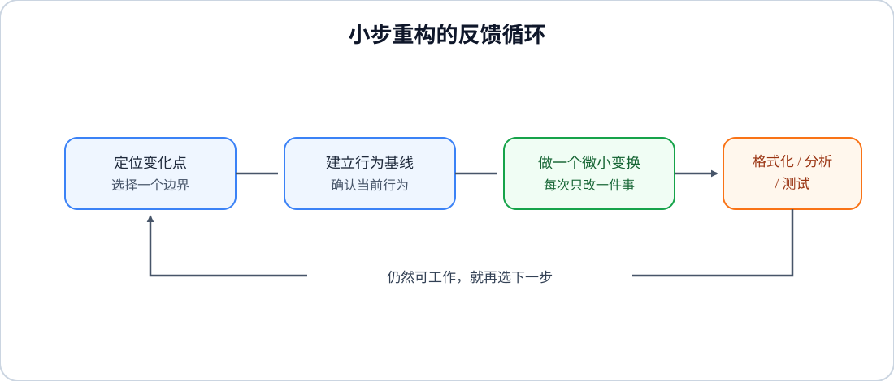

# 工程工具与代码质量｜05-重构方法论与实践

重构不是“把代码改得更漂亮”，也不是一次性推倒重来。它是一组保持软件可观察行为不变的微小代码变换，目标是让代码更容易理解、修改和验证。真正的收益不是少几行代码，而是下一次添加功能或修复问题时，能更快找到修改点，并且更少引入回归。

本文依据《重构：改善既有代码的设计（第 2 版）》第 2～5 章及重构名录提炼，结合本知识库的 Dart 示例重新组织。书中的具体重构名称属于通用工程术语；示例代码为本笔记独立编写。

<!-- GFM-TOC -->
* [重构的边界](#重构的边界)
* [两顶帽子：功能开发与结构调整](#两顶帽子功能开发与结构调整)
* [安全网：先让行为可观察](#安全网先让行为可观察)
* [一条可重复的重构工作流](#一条可重复的重构工作流)
* [从坏味道选择重构手法](#从坏味道选择重构手法)
    * [方法过长或职责混杂](#方法过长或职责混杂)
    * [重复与变化方向不一致](#重复与变化方向不一致)
    * [条件逻辑逐渐膨胀](#条件逻辑逐渐膨胀)
    * [数据和边界泄漏](#数据和边界泄漏)
    * [接口让调用者承担过多知识](#接口让调用者承担过多知识)
* [一个完整的 Dart 示例](#一个完整的-dart-示例)
* [什么时候做、什么时候停](#什么时候做什么时候停)
* [代码评审清单](#代码评审清单)
* [常见误区](#常见误区)
* [参考资料](#参考资料)
* [一句话总结](#一句话总结)
<!-- GFM-TOC -->

## 重构的边界

可以用三个问题判断一项工作是否属于重构：

1. 用户、调用者或外部协议能观察到的行为是否保持不变？
2. 每一步是否足够小，可以编译、运行测试并在需要时停下来？
3. 这一步是否降低了理解成本或未来修改成本？

三个问题缺一不可。修改返回值、修复业务规则、升级数据库结构属于功能或迁移；它们可以和重构同时发生，但不能把两类变化混成一个无法验证的大提交。以性能为主要目标的优化不是纯重构：重构优先改善内部设计，性能优化优先改善运行时间，二者有时方向一致，有时需要取舍。若一次变更同时包含两者，应分别记录性能基线和行为基线。

“行为不变”指对用户和调用者的可观察承诺不变，不要求实现细节完全相同。函数被拆开后调用栈会变化，内部类可能搬家，局部性能也可能略有变化；如果这些变化影响了公共 API、时序、异常类型或性能预算，就必须把它们当作明确的兼容性决策来验证。

重构的质量标准不是代码看起来多整齐，而是修改变得更容易：读者能更快找到职责，变化能集中在少数位置，测试能准确指出哪一步破坏了行为。

## 两顶帽子：功能开发与结构调整

开发时应有意识地区分两种状态：

| 状态 | 允许做什么 | 主要证据 |
| --- | --- | --- |
| 功能帽子 | 添加或改变业务行为；必要时补充测试 | 新旧行为的测试差异 |
| 重构帽子 | 只调整结构、命名、依赖和边界 | 原有测试仍然通过 |

写新功能时，如果发现现有结构让修改很困难，可以暂时换上重构帽子：先把结构整理到适合扩展的位置，再换回功能帽子。换帽子的价值在于让每一刻的意图清楚，测试失败时也知道是在验证新行为还是在排查结构变换。

并不是每次提交都必须严格拆开。紧密交织的功能和重构可以放在同一条工作线上，但提交说明、代码评审和验证结果应该明确区分两者。若团队依赖自动化回滚或需要独立审阅，保持“纯重构提交”通常更方便；如果分离会丢失上下文，就保留上下文并在描述中写清行为边界。

## 安全网：先让行为可观察

小步重构依赖反馈环。开始前先列出这段代码对外承诺的行为：正常输入、空值、边界值、异常、排序和副作用顺序。优先为最关键且最容易回归的承诺建立测试，而不是为了覆盖率把实现细节全部锁死。

测试应验证结果和契约，而不是验证当前的私有结构。例如，测试“折扣后金额”为稳定契约，测试“必须调用了 `calculateBase`”则会阻止安全的函数搬移。对于尚未测试的遗留代码，可以先做一组特征测试（characterization test）：记录当前行为，确认测试通过后再开始重构；如果发现的行为本身是缺陷，先记录决策，再单独修复。

安全网不只有单元测试，还包括：

- 编译器、静态分析器和格式化工具；
- 集成测试、端到端测试和关键日志/指标；
- 小范围运行、对照输出或金丝雀发布；
- 版本控制中的小提交，使每一步都能回看和回退。

没有任何可观察反馈时，不要同时搬移模块、修改接口和替换算法。先增加一个可验证的边界，再继续变换。

## 一条可重复的重构工作流

<figure class="diagram-scroll"></figure>

可以按下面的顺序执行：

1. **从变化出发。** 问“下一项需求最可能改哪里”“这个 bug 的根因横跨哪些重复代码”，而不是先追求全库统一。
2. **记录基线。** 运行已有测试，补齐关键边界；写下公共 API、异常和副作用的约束。
3. **选择一个手法。** 一次只改变一个结构关系，例如先改名，再提炼函数，再搬移函数。不要在同一步里顺便重写算法。
4. **立即反馈。** 对 Dart 代码运行 `dart format`、`dart analyze` 和相关测试；失败时先回到最近一步，检查是否违反了基线。
5. **提交可解释的进展。** 提交标题写结构变化和范围，例如“提炼订单金额计算函数”，不要写“杂项清理”。
6. **在更高层重新观察。** 局部清晰后，重新看模块职责和依赖方向，再决定是否继续。重构的终点是当前需求的修改成本已经下降，不是目录里没有任何坏味道。

遇到大型替换（库、服务或组件）时，可以先引入兼容抽象，让新旧实现同时可用；逐步迁移调用方后再删除旧实现。这种“先隔离变化，再搬移使用者”的方式能把一次不可控的大爆炸拆成多个可验证的步骤。

## 从坏味道选择重构手法

坏味道是线索，不是自动处方。同一个症状可能由不同原因造成，先问“什么变化会被迫一起发生”，再选择手法。

### 方法过长或职责混杂

症状：函数同时解析输入、计算业务规则、格式化输出和写日志；读者必须记住多个阶段的局部变量。

优先顺序：

1. 用**提炼函数**给每个有名字的意图划边界；
2. 用**提炼变量**为复杂条件或中间结果命名；
3. 如果计算和展示的变化方向不同，用**拆分阶段**隔离输入、计算和输出；
4. 如果抽取后调用处反而需要连续跳转，使用**内联函数**收回过小或没有语义价值的包装。

函数长短不是唯一指标。一个 40 行、只做一件事的函数可能比 10 行、混合三种职责的函数更容易修改。

### 重复与变化方向不一致

症状：相同公式或判断分散在多个文件；复制后每一份都出现了微小差异。

先确认重复代码是否会一起变化：

- 会一起变化：提炼函数、函数参数化，或把共享规则放入合适的类；
- 看起来相似但业务含义不同：不要为了消除行数而强行合并；
- 修改总是集中在同一个调用点：可以先把语句搬到调用者，减少无意义的中间层。

重复代码的真正成本是修改时容易漏改，而不是磁盘多占几百字节。

### 条件逻辑逐渐膨胀

症状：同一状态码在多个 `switch` 中重复出现；嵌套条件把正常路径推到最深处；特殊情况散落在每个调用者。

可以按复杂度递进：

- **卫语句**：先处理无效输入、权限不足和空结果，让主路径保持平直；
- **分解条件表达式**：把“条件、正常分支、异常分支”分别命名；
- **引入特例**：把“没有数据”“未知用户”这类反复出现的特殊值封装成对象或统一查询结果；
- **以多态取代条件**：只有当类型变化稳定、分支行为确实属于不同策略时才使用，避免为了少一个 `switch` 过早建立继承层次；
- **引入断言**：把“按设计不可能发生”的前提写成可执行检查，区分程序员错误和用户输入错误。

### 数据和边界泄漏

症状：调用者直接改集合、散落地组装参数、使用一串基本类型表达同一概念。

可以使用**封装集合**限制修改入口，使用**以对象取代基本类型**把格式和不变量放在值对象中，使用**引入参数对象**把总是一起出现的参数收拢。对象不是为了增加层次，而是为了让不变量有唯一的维护位置。

### 接口让调用者承担过多知识

症状：调用者必须先查询再修改，知道内部委托链，或通过布尔标记选择两种完全不同的行为。

优先考虑**查询与修改分离**、**隐藏委托关系**、**移除标记参数**和**保持对象完整**。公共接口变更要先确认调用范围；无法一次迁移时保留兼容包装，标记旧接口为弃用，并给出移除时间或迁移路径。

## 一个完整的 Dart 示例

下面的例子模拟“计算订单金额并生成摘要”。原函数把校验、计算和格式化混在一起，且用布尔参数改变输出行为。

```dart
class OrderItem {
  const OrderItem(this.price, this.quantity);

  final double price;
  final int quantity;
}

class Order {
  const Order(this.id, this.items, {this.discountCode});

  final String id;
  final List<OrderItem> items;
  final String? discountCode;
}

String summaryBefore(Order order, bool includeTax) {
  if (order.items.isEmpty) return 'empty';
  var total = 0.0;
  for (final item in order.items) {
    total += item.price * item.quantity;
  }
  if (order.discountCode == 'VIP') total *= 0.9;
  if (includeTax) total *= 1.06;
  return '${order.id}: ${total.toStringAsFixed(2)}';
}
```

先把阶段和业务规则命名，再让两个公共入口表达不同意图，调用者不再传递 `includeTax` 这样的标记参数。这里没有改变折扣、税率或空订单的行为：

```dart
String summary(Order order) => _summary(order, withTax: false);

String summaryWithTax(Order order) => _summary(order, withTax: true);

/// 公共 API 已被调用时可暂时保留兼容包装；内部 API 则可以直接删除旧入口。
@Deprecated('Use summary or summaryWithTax')
String summaryBefore(Order order, bool includeTax) =>
    includeTax ? summaryWithTax(order) : summary(order);

String _summary(Order order, {required bool withTax}) {
  if (order.items.isEmpty) return 'empty';
  final subtotal = _subtotal(order);
  final discounted = _applyDiscount(subtotal, order.discountCode);
  final total = withTax ? discounted * 1.06 : discounted;
  return '${order.id}: ${total.toStringAsFixed(2)}';
}

double _subtotal(Order order) => order.items.fold(
      0.0,
      (sum, item) => sum + item.price * item.quantity,
    );

double _applyDiscount(double amount, String? code) =>
    code == 'VIP' ? amount * 0.9 : amount;
```

这里依次使用了提炼函数、拆分阶段和“对外 API 移除标记参数”的思想。`summary` 与 `summaryWithTax` 是两个有名字的意图，调用者不必记住 `true` 的含义；如果 `summaryBefore` 已经是公共 API，先保留兼容包装并安排迁移，不能把删除旧入口当成纯重构。内部辅助函数保留布尔参数只是为了共享实现，若该内部变化继续扩展，可以再用策略函数或两个专用计算函数彻底消除它。计算阶段也可以独立测试。示例仍有可继续演进的空间，例如把税率和折扣规则提炼成策略，但只有在出现第二种税制或多个折扣变化方向时才值得继续抽象。

示例用 `double` 只为突出结构变化；真实金额不要直接依赖二进制浮点数做结算，通常应使用最小货币单位的整数或项目选定的十进制定点/金额类型，并明确舍入规则。`Order` 的输入校验、税率来源和折扣有效期也应由业务契约定义，而不是由重构顺手猜测。

## 什么时候做、什么时候停

重构通常最值得做的时机，是即将修改一段代码之前：先把结构整理到适合当前变化的位置，避免复制粘贴。修 bug 时也一样，先合并导致同一错误的重复路径，往往比在三处打补丁更可靠。阅读陌生代码时，改名和提炼小函数可以把脑中的理解写回代码，帮助暴露更高层的问题。

可以用“三次法则”提醒自己：第一次重复先完成，第二次记录不适，第三次出现相似变化时优先重构。它不是硬性计数器，而是避免第一次遇到相似代码就过度抽象的经验规则。

以下情况应谨慎或停止：

- 代码被稳定的 API 隔离，近期没有修改需求；
- 现有行为没有测试、监控或对照输出，继续变换无法判断是否破坏契约；
- 重构范围已经扩散到多个团队拥有的已发布接口，却没有兼容与迁移计划；
- 经过小步尝试后，完整重写的风险和成本明显更低；
- 所谓“优化”只是个人风格偏好，不能降低当前或可预见的修改成本。

“让营地比到达时更干净”是适合日常开发的尺度：顺手修掉低风险、与当前修改相邻的坏味道；大型整理则拆成可独立验收的阶段，不要让一次 PR 变成无法审阅的重写。

## 代码评审清单

- 这次变化是否说明了要保护的行为契约？
- 是否先建立了测试、基线输出或其他安全网？
- 每一步是否只改变一种结构关系，并能独立编译和验证？
- 新的函数、类和模块边界是否对应真实的变化方向？
- 是否消除了重复的知识，而不是只把代码复制到另一层？
- 正常路径、异常路径和边界条件是否容易从调用处读懂？
- 公共 API、异常类型、时序和性能预算是否有明确影响说明？
- 新增的抽象是否已经有第二个真实使用场景，还是只为想象中的未来预留？
- 提交是否足够小，失败时能定位到具体一步？

## 常见误区

**把重构当成大扫除。** 一次改名、搬移、替换算法和目录重组会让失败难以归因。按微小变换拆开，反馈更快。

**只看行数。** 删除代码不等于降低复杂度；一行嵌套的表达式可能比几行有名字的步骤更难懂。

**为了消灭所有 `switch` 而上多态。** 当分支不稳定或只有一个实现时，多态会增加导航和构造成本。先确认变化轴，再决定是表驱动、函数、特例还是多态。

**用实现细节写测试。** 锁定私有函数、调用次数或类层次会阻止安全重构。测试外部契约，必要时再为独立算法补单元测试。

**把性能直觉当成证据。** 重构可能改变分配、调用栈或缓存行为；只有剖析或基准测试显示它处于关键路径，才为性能做针对性取舍，并把测量依据写进注释或记录。

## 参考资料

- [R1] [教材] Martin Fowler，《重构：改善既有代码的设计（第 2 版）》，熊节、林从羽译，人民邮电出版社，ISBN 978-7-115-50865-2。本文主要依据第 2～5 章及“重构列表”整理。
- [R2] [官方文档] [Dart language tour](https://dart.dev/language)，Dart 语法、集合和函数语义，[核查日期：2026-09]。
- [R3] [官方文档] [Dart testing](https://dart.dev/testing)，Dart 测试工具与测试组织，[核查日期：2026-09]。

## 一句话总结

> 重构就是在安全网保护下，以小步、可验证的结构变换降低下一次修改成本；先守住行为契约，再决定抽取、搬移、封装或替换。
